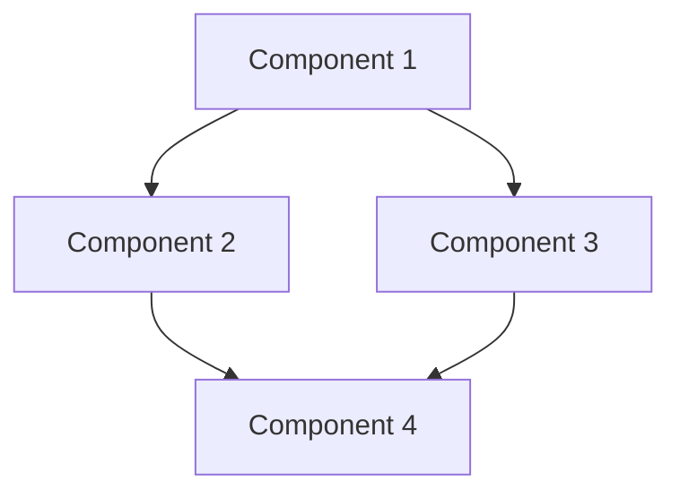

User input: $ARGUMENTS

## Execution Steps

### 0. Set ARCHETYPES_BASEDIR

**SUCCESS CRITERIA**:
- Search for directory: "00-core-orchestration"
- Set variable `${ARCHETYPES_BASEDIR}` to immediate parent of this directory

**HALT IF**:
- Directory "00-core-orchestration" is not found
- `${ARCHETYPES_BASEDIR}` is not set

// turbo
Search for directory: "00-core-orchestration". Set variable `${ARCHETYPES_BASEDIR}` to immediate parent of this directory. Workflow must halt if the variable is not set.

### 1. Environment Setup
// turbo
Run `python ${ARCHETYPES_BASEDIR}/00-core-orchestration/scripts/validate_env.py --archetype core-orchestration --json` and parse for env_valid. Halt if false.

### 2. Analyze Solution Requirements

Parse $ARGUMENTS for:
- Solution scope and components
- Technology stack
- Integration requirements
- Deployment targets

### 3. Infer Context from User's Assets

**Before calling discover-archetype.py, analyze the user's context to augment queries.**

**If user references a PROJECT or DIRECTORY:**
```
Analyze directory structure to infer composition:
- Look for package.json, requirements.txt, pom.xml → Application type
- Look for .tf, terraform/ → Infrastructure as Code
- Look for .py + mlflow/, model/ → ML/Data Science
- Look for Dockerfile, helm/, k8s/ → Container/Kubernetes
- Look for .sql, dbt_project.yml → Data Engineering
- Look for airflow/, dags/ → Orchestration
- Look for tests/, pytest.ini → Testing focus
- Look for manifest.yaml + constitution.md → Archetype

Generate context description:
"Project composition: {inferred_type} with {key_technologies}"
```

**If user references a FILE:**
```
Analyze file to infer purpose:
- .py → Python (check imports for framework: fastapi, pyspark, sklearn, etc.)
- .sql → SQL queries
- .tf → Terraform infrastructure
- .tsx/.jsx → React frontend
- .yaml/.yml → Configuration (check content: k8s, airflow, etc.)
- .sh/.bash → Automation scripts
- .md → Documentation

Generate context description:
"File type: {extension}, Purpose: {inferred_purpose}, Framework: {detected_framework}"
```

**Build Augmented Query for each component:**
```
${AUGMENTED_QUERY} = "${CONTEXT_DESCRIPTION}. Component: {component_description}"
```

### 4. Identify Required Archetypes

**Use Discovery for Each Component:**
For each component mentioned in requirements, run:
```bash
python ${ARCHETYPES_BASEDIR}/00-core-orchestration/scripts/discover-archetype.py --query "{component_description}" --json
```

This identifies the appropriate archetype for each component.

**Common Multi-Archetype Solution Patterns:**

Refer to `manifest.yaml` files in each archetype for standard patterns:

**Pattern: ML Training Pipeline**
- Categories: Machine Learning Models → ML Operations → Infrastructure
- Example archetypes:
  - Model training: model-architect, gradient-boosted-trees, neural-network-model
  - Feature engineering: feature-architect
  - Inference: inference-orchestrator
  - Deployment: aks-devops-deployment

**Pattern: Data Platform**
- Categories: Data Engineering → Data Governance → Infrastructure
- Example archetypes:
  - Ingestion: pipeline-builder
  - Transformation: transformation-alchemist, sql-query-crafter
  - Orchestration: pipeline-orchestrator
  - Quality: quality-guardian, data-validation
  - Observability: observability

**Pattern: Application with Knowledge Graph**
- Categories: Application Development → Graph Analytics → Infrastructure
- Example archetypes:
  - Frontend: app-maker
  - Backend API: integration-specialist
  - Ontology: ontology-engineer, general-graph-ontology
  - Analytics: insight-reporter

**Pattern: DevOps CI/CD Pipeline**
- Categories: Infrastructure & DevOps → Software Quality
- Example archetypes:
  - Container orchestration: aks-devops-deployment
  - Infrastructure: terraform-cicd-architect
  - CI/CD: microservice-cicd-architect, dev-ops-engineer
  - Testing: unit-test-code-coverage, regression-test-coverage
  - Monitoring: observability

### 5. Generate Component Scaffolds

For each identified archetype, use the `workflow` field from discover output:

```
Generating solution components...

Component 1: {component_name}
→ Discovery: {display_name} (score: {score})
→ Workflow: {workflow}  # from manifest.yaml via discover-archetype.py
→ Calling: /{workflow} $ARGUMENTS
→ Generated: {file_paths}

Component 2: {component_name}
→ Discovery: {display_name} (score: {score})
→ Workflow: {workflow}
→ Calling: /{workflow} $ARGUMENTS
→ Generated: {file_paths}

[Continue for all components...]
```

**Key**: The workflow name comes directly from the archetype's `manifest.yaml`, ensuring consistency.

### 6. Create Integration Layer

Generate integration code between components:

**Data Flow Integration:**
- Component outputs → Component inputs
- Message passing contracts
- Event schemas

**Dependency Management:**
- Shared configurations
- Environment variables
- Secret references

**Error Handling:**
- Cross-component error propagation
- Retry strategies
- Circuit breakers

### 7. Generate Dependency Graph

Create visual representation of component dependencies:



Save to: `docs/architecture.mmd`

### 8. Generate Solution Documentation

Create comprehensive documentation package:

**Files Generated:**
- `README.md` - Solution overview
- `docs/ARCHITECTURE.md` - Architecture documentation
- `docs/DEPLOYMENT.md` - Deployment guide
- `docs/OPERATIONS.md` - Operational runbook
- `docs/DEVELOPMENT.md` - Developer guide

### 9. Create Testing Framework

Generate test suite covering:

**Component-Level Tests:**
- Unit tests for each component
- Component-specific test harnesses

**Integration Tests:**
- Cross-component data flow tests
- API contract tests
- End-to-end workflow tests

**Performance Tests:**
- Load testing scenarios
- Scalability validation

### 10. Validate and Report

**Validation Checks:**
// turbo
- Environment validation: `python ${ARCHETYPES_BASEDIR}/00-core-orchestration/scripts/validate_env.py --archetype {archetype-slug} --json`
- Constitution compliance: Each generated component follows its archetype's constitution

**Report Generation:**
```
✓ Solution Scaffold Complete

Components Generated: {count}
{list of components with archetypes}

Integration Points: {count}
{list of integrations}

Documentation: {files}
Testing Framework: {test_files}

Next Steps:
1. Review generated code and configurations
2. Customize integration layer for specific needs
3. Run integration tests: pytest tests/integration/
4. Deploy components: See docs/DEPLOYMENT.md
```

## Examples

**Example 1: Data Analytics Platform**
```
User: /solution-scaffold Build analytics platform with ingestion, transformation, and reporting

Components Identified:
1. pipeline-builder (Data Engineering) - Ingestion
2. transformation-alchemist (Data Engineering) - Spark transformation
3. sql-query-crafter (Data Engineering) - SQL analytics
4. insight-reporter (Graph & Analytics) - Reporting dashboard
5. quality-guardian (Data Governance) - Quality checks
6. pipeline-orchestrator (Data Engineering) - Workflow orchestration

Integration: Data flow from ingestion → transformation → analytics → reporting
```

**Example 2: ML Model Deployment**
```
User: /solution-scaffold Deploy XGBoost model with feature engineering and monitoring

Components Identified:
1. feature-architect (ML Operations) - Feature pipeline
2. gradient-boosted-trees (ML Models) - Model training
3. inference-orchestrator (ML Operations) - Model serving
4. model-ops-steward (ML Operations) - Monitoring
5. aks-devops-deployment (Infrastructure) - K8s deployment
6. observability (Infrastructure) - Telemetry

Integration: Feature store → Model → Inference API → Monitoring
```

**Example 3: Web Application with API**
```
User: /solution-scaffold Build customer portal with React frontend and FastAPI backend

Components Identified:
1. app-maker (Application Development) - React frontend
2. integration-specialist (Application Development) - FastAPI backend
3. sql-query-crafter (Data Engineering) - Database queries
4. microservice-cicd-architect (Infrastructure) - CI/CD pipeline
5. unit-test-code-coverage (Software Quality) - Testing
6. documentation-evangelist (Documentation) - API docs

Integration: Frontend → API → Database, CI/CD automation
```

## References

- **Category Index**: [Category Index](../../../INDEX.md)
- **Routing Config**: [../../templates/archetype manifest.yaml files](../../templates/archetype manifest.yaml files)
- **Discovery Script**: `${ARCHETYPES_BASEDIR}/00-core-orchestration/scripts/discover-archetype.py`
- **Solution Patterns**: See routing config for common patterns
- **Core Orchestrators**: [/scaffold](../../../core/.windsurf/workflows/scaffold.md), [/compare](../../../core/.windsurf/workflows/compare.md), [/debug](../../../core/.windsurf/workflows/debug.md)
