# Archetype Architect - Comprehensive Design

## Executive Summary

The **archetype-architect** is the meta-archetype responsible for creating, refining, quality-controlling, and documenting all archetypes in the ecosystem. It serves as the foundation for maintaining consistency, quality, and discoverability across the entire archetype inventory.

This design document establishes the architectural principles, interaction patterns, and quality standards that govern how archetype-architect operates and how it ensures all archetypes conform to ecosystem standards.

---

## Table of Contents

1. [Core Responsibilities](#core-responsibilities)
2. [Architectural Principles](#architectural-principles)
3. [Manifest Schema Design](#manifest-schema-design)
4. [Archetype Structure Standard](#archetype-structure-standard)
5. [Workflow Architecture](#workflow-architecture)
6. [Discovery and Routing](#discovery-and-routing)
7. [Quality Assurance Model](#quality-assurance-model)
8. [Delegation Patterns](#delegation-patterns)
9. [Circular Dependency Handling](#circular-dependency-handling)
10. [Integration Points](#integration-points)

---

## Core Responsibilities

### Primary Functions

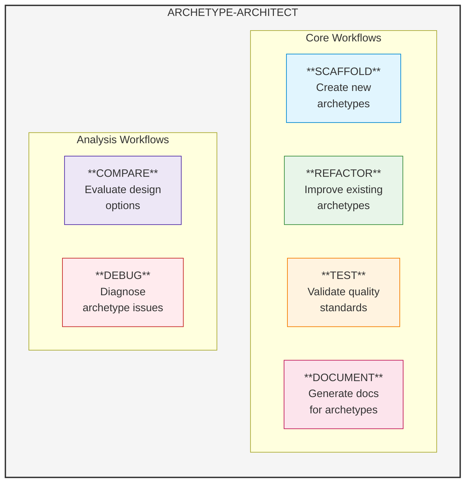

### Basic Vision

- Create, refine, and quality-control **any single archetype** at a time
- Ensure consistency with ecosystem standards
- Validate manifest, constitution, workflows, and structure

### Ultimate Vision

- Manage a **multi-archetype ecosystem**
- Guide users in creating new archetypes on-the-fly
- Prevent duplication by recommending existing archetypes
- Inventory-aware: Prompt expansion before creation if <50 archetypes exist

---

## Architectural Principles

### Principle 1: No Versioning in Core Assets

**Rationale**: Version information in manifests, constitutions, or workflows increases LLM token consumption and risks hallucinations from stale context.

**Implementation**:

- Version tracking belongs in `changelog.md` within each archetype
- Manifests reference changelog but never contain version fields
- Workflows never reference or check version numbers
- Only archetype-architect reads changelog during audit operations

```yaml
# WRONG - Version in manifest
archetype:
  name: example
version: '1.0'

# CORRECT - No version, separate changelog
archetype:
  name: example
  changelog: changelog.md  # Optional reference
```

### Principle 2: Leverage Core Orchestration

**Rationale**: Archetype-architect should not reinvent routing logic. Core orchestration provides battle-tested discovery and delegation.

**Implementation**:

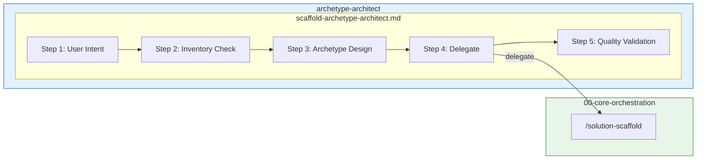

### Principle 3: Maximize Routing Benefits

**Rationale**: Specialist archetypes exist for a reason. Documentation should be beautiful (documentation-evangelist), code should be correct (domain archetype).

**Implementation**:

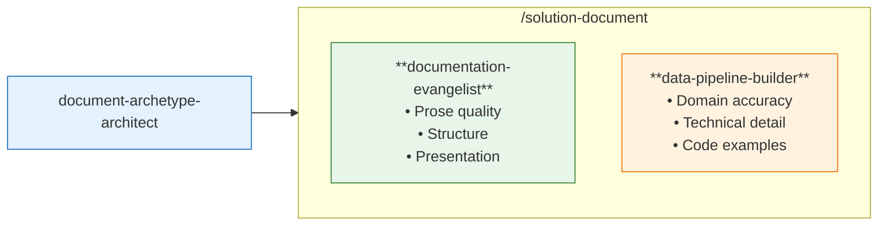

*Example: Documenting a Data Pipeline Archetype - combines prose expertise with domain accuracy.*

### Principle 4: Inventory Awareness

**Rationale**: Creating new archetypes when similar ones exist leads to fragmentation and confusion.

**Implementation**:

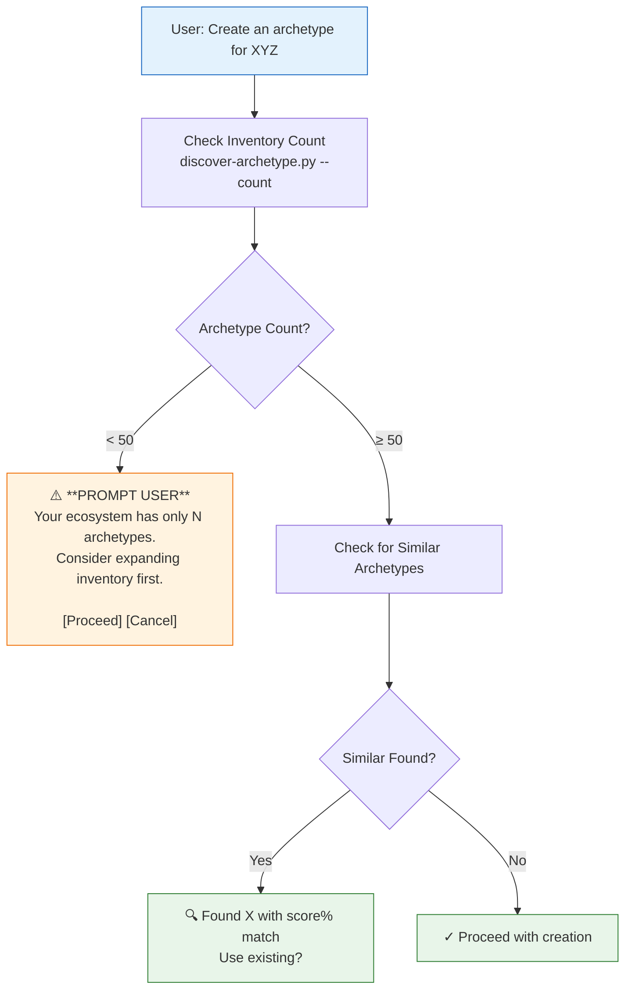

### Principle 5: Graceful Circular Handling

**Rationale**: When archetype-architect modifies itself or archetypes that support modification, the model should not get confused.

**Implementation**:

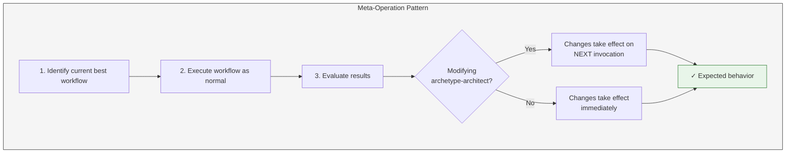

---

## Manifest Schema Design

### Current Schema (Deprecated)

```yaml
archetype:
  name: example-archetype
  display_name: Example Archetype
  description: Brief description
  keywords:
    - keyword1
    - keyword2
  workflows:
    scaffold: scaffold-example-archetype
    refactor: refactor-example-archetype
    compare: compare-example-archetype
    test: test-example-archetype
    debug: debug-example-archetype
    document: document-example-archetype
version: '1.0'  # DEPRECATED - REMOVE
```

### New Schema

```yaml
archetype:
  name: example-archetype
  display_name: Example Archetype
  description: Brief description of what this archetype does and when to use it
  
  keywords:
    - keyword1
    - keyword2
    # Keywords should be domain-relevant for discovery scoring
  
  constitution:
    path: example-archetype-constitution.md
    # Path relative to archetype root
  
  dependencies:
    - 00-core-orchestration  # Always required (implicit)
    # Only list HARD dependencies - archetypes that MUST be present
    # Soft dependencies are resolved via discovery at runtime
  
  workflows:
    scaffold: scaffold-example-archetype
    refactor: refactor-example-archetype
    compare: compare-example-archetype
    test: test-example-archetype
    debug: debug-example-archetype
    document: document-example-archetype

# NO version field - version history in changelog.md
```

### Schema Validation Rules

1. **Required Fields**: `name`, `display_name`, `description`, `keywords`, `workflows`
2. **Constitution**: Must exist if referenced; path must be valid
3. **Dependencies**: Must reference existing archetypes
4. **Workflows**: All 6 workflows must be defined (scaffold, refactor, compare, test, debug, document)
5. **Keywords**: Must be relevant to archetype domain (no generic terms)
6. **No Version**: Field must not exist

---

## Archetype Structure Standard

### Required Structure

```
{archetype-slug}/
│
├── manifest.yaml                      # REQUIRED: Discovery metadata
│   • name, display_name, description
│   • keywords for discovery scoring
│   • constitution path reference
│   • workflow mappings
│
├── {archetype-slug}-constitution.md   # REQUIRED: Rules and guardrails
│   • Hard-stop rules
│   • Mandatory patterns
│   • Preferred patterns
│   • Cross-platform guidelines
│
├── README.md                          # REQUIRED: Human-readable overview
│   • Purpose and use cases
│   • Quick start guide
│   • Workflow summary
│   • Related archetypes
│
├── .koda/
│   └── workflows/                     # REQUIRED: All 6 workflows
│       ├── scaffold-{slug}.md         # REQUIRED
│       ├── refactor-{slug}.md         # REQUIRED
│       ├── compare-{slug}.md          # REQUIRED
│       ├── test-{slug}.md             # REQUIRED
│       ├── debug-{slug}.md            # REQUIRED
│       └── document-{slug}.md         # REQUIRED
│
├── changelog.md                       # OPTIONAL: Version history
│   • Release dates
│   • Change summaries
│   • Migration notes
│
├── docs/                              # OPTIONAL: Extended documentation
│   ├── design.md                      # Architecture and design decisions
│   ├── implementation-plan.md         # Development roadmap
│   └── {other-docs}.md                # Additional documentation
│
├── scripts/                           # OPTIONAL: Archetype-specific scripts
│   └── {script-name}.py               # Only truly native scripts
│
└── templates/                         # OPTIONAL: Archetype-specific templates
    └── {template-name}.{ext}          # Only truly native templates
```

### Asset Ownership Rules

| Asset Type | Owned By | Location |
|------------|----------|----------|
| Discovery script | 00-core-orchestration | `00-core-orchestration/scripts/` |
| Core workflow templates | 00-core-orchestration | `00-core-orchestration/templates/` |
| Archetype-specific scripts | Archetype | `{archetype}/scripts/` |
| Archetype-specific templates | Archetype | `{archetype}/templates/` |
| Shared utilities | 00-core-orchestration | `00-core-orchestration/scripts/` |

**Rule**: If an asset could be useful to multiple archetypes, it belongs in 00-core-orchestration. If it's truly specific to one archetype's domain, it belongs in that archetype.

### archetype-architect Scripts

Scripts specific to archetype management (not discovery/routing):

| Script | Purpose | Usage |
|--------|---------|-------|
| `migrate-manifests.py` | Migrate manifests to new schema | `python scripts/migrate-manifests.py --dry-run` |

**migrate-manifests.py** capabilities:
- `--dry-run` - Preview changes without applying
- `--apply` - Apply schema migrations
- `--validate` - Validate manifests only
- `--basedir` - Override ARCHETYPES_BASEDIR

Migrations performed:
- Adds `constitution` field if missing
- Adds `dependencies` field if missing
- Removes deprecated `version` field
- Validates required fields

---

## Workflow Architecture

### Workflow Interaction Model

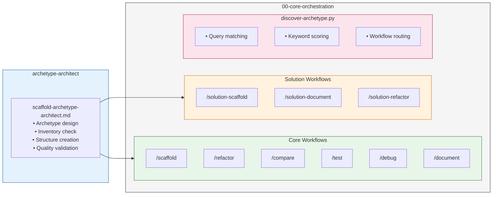

### Workflow Design Patterns

#### Pattern 1: Delegate General, Specialize Specific

```markdown
## Step N: Generate Comprehensive Documentation

Delegate to `/solution-document` with multi-archetype context:

**Primary Specialist**: documentation-evangelist
- Handles: Prose quality, structure, visual presentation
- Expertise: Technical writing, information architecture

**Domain Expert**: {target-archetype}
- Handles: Domain accuracy, code examples, configuration specifics
- Expertise: The actual technology being documented

// turbo
Execute `/solution-document` targeting both archetypes for combined output.
```

#### Pattern 2: Pre-Flight Inventory Check

```markdown
## Step 1: Inventory Assessment

Before creating a new archetype, assess ecosystem state:

// turbo
Run `python ${ARCHETYPES_BASEDIR}/00-core-orchestration/scripts/discover-archetype.py --count --json`

**If count < 50**:
```
⚠️ Your archetype ecosystem has only {count} archetypes.

Recommendation: Consider expanding your inventory with established
patterns before creating custom archetypes.

[Proceed Anyway] [Explore Existing Archetypes] [Cancel]
```

**If count ≥ 50**: Continue to similarity check.
```

#### Pattern 3: Similarity Check Before Creation

```markdown
## Step 2: Check for Similar Archetypes

// turbo
Run `python ${ARCHETYPES_BASEDIR}/00-core-orchestration/scripts/discover-archetype.py --query "{user_intent}" --top 3 --json`

**If match score ≥ 70%**:
```
🔍 Found similar archetype: {archetype_name}

Match Score: {score}%
Keywords: {matching_keywords}

Would you like to:
1. Use existing archetype: /{workflow}
2. Refactor existing archetype to add functionality
3. Proceed with new archetype (requires justification)
```

**If no close matches**: Proceed with archetype creation.
```

---

## Discovery and Routing

### Enhanced discover-archetype.py

The discovery script is the routing brain of the ecosystem. Enhancements needed:

```python
# New capabilities needed:

def discover_archetypes(basedir, include_constitution=False):
    """
    Scan all archetypes and return metadata.
    
    Args:
        basedir: Root directory containing archetypes
        include_constitution: If True, also load constitution metadata
    
    Returns:
        List of archetype metadata dictionaries
    """

def get_inventory_count(basedir):
    """
    Return total count of valid archetypes.
    
    Returns:
        Integer count of archetypes with valid manifests
    """

def validate_archetype_structure(archetype_dir):
    """
    Validate an archetype against the standard structure.
    
    Returns:
        Dictionary with:
        - is_valid: Boolean
        - missing_required: List of missing required files
        - missing_recommended: List of missing recommended files
        - issues: List of structural issues found
    """

def resolve_dependencies(archetype_name, basedir):
    """
    Resolve all dependencies for an archetype.
    
    Returns:
        Dictionary with:
        - hard_dependencies: List from manifest
        - resolved: Boolean (all dependencies exist)
        - missing: List of missing dependencies
    """
```

### Routing Decision Tree

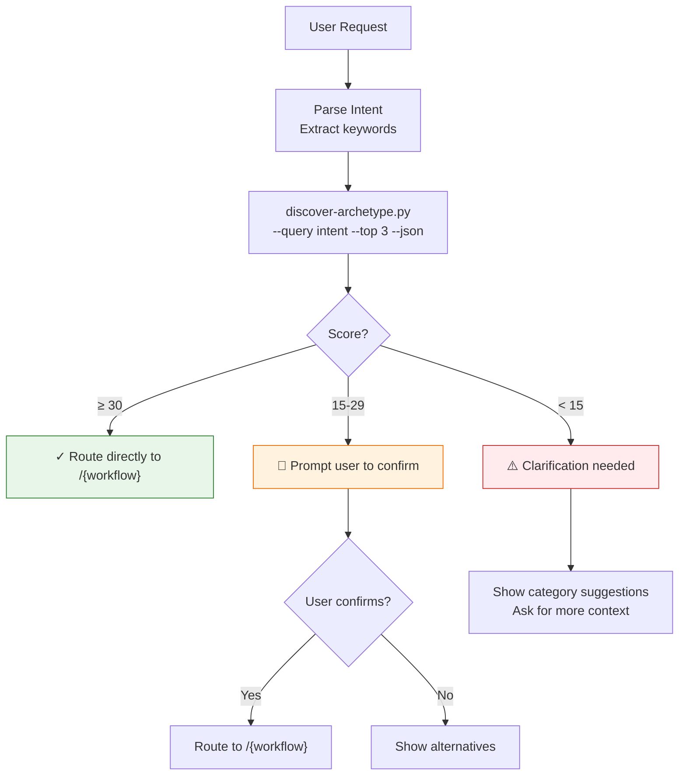

**Score Reference** (from discover-archetype.py):
- Exact archetype name match: +50
- Display name match: +30
- Keyword match: +10 each
- Description word match: +2 each
- Workflow name match: +25

---

## Quality Assurance Model

### Archetype Quality Dimensions

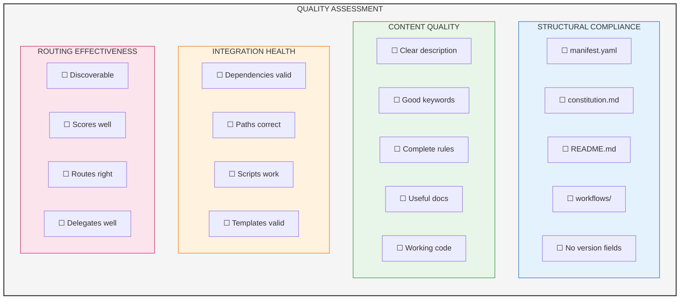

### Quality Checks by Workflow

| Workflow | Quality Checks |
|----------|----------------|
| **scaffold** | Structure complete, manifest valid, constitution exists, workflows created |
| **refactor** | No version fields, paths updated, dependencies resolved, keywords relevant |
| **test** | All workflows execute, discovery scores correctly, routing works |
| **debug** | Root cause identified, fix doesn't break other archetypes |
| **compare** | Both options evaluated fairly, recommendation justified |
| **document** | README exists, docs comprehensive, examples work |

---

## Delegation Patterns

### Core Principle: Structural vs Content Quality

**archetype-architect specializes in STRUCTURAL and LOGICAL quality**, not content generation. For content, it delegates to specialist archetypes.

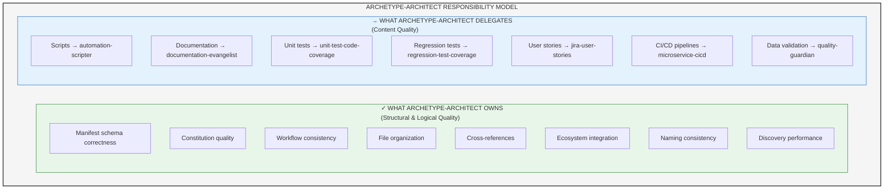

### Delegation Decision Matrix

| Scenario | archetype-architect Action |
|----------|---------------------------|
| Script has bugs or poor patterns | **DELEGATE** to `/debug-automation` |
| Documentation is unclear | **DELEGATE** to `/refactor-documentation` |
| Tests are missing or weak | **DELEGATE** to `/scaffold-unit-test-code-coverage` |
| Manifest has wrong schema | **HANDLE directly** (structural) |
| Constitution rules incomplete | **HANDLE directly** (logical quality) |
| Workflow structure non-standard | **HANDLE directly** (consistency) |
| Cross-references broken | **HANDLE directly** (integration) |
| User stories needed for project | **DELEGATE** to `/scaffold-jira-user-stories` |

### Delegation Flow Pattern

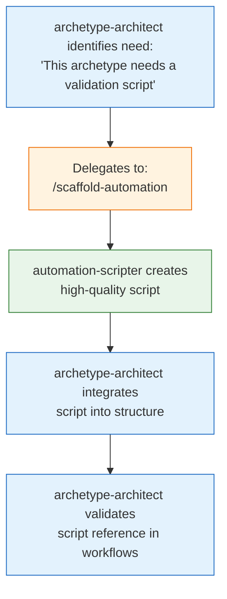

### Pattern: Multi-Archetype Documentation

When documenting an archetype, leverage multiple specialists:

*Input: "Document the data-pipeline-builder archetype"*

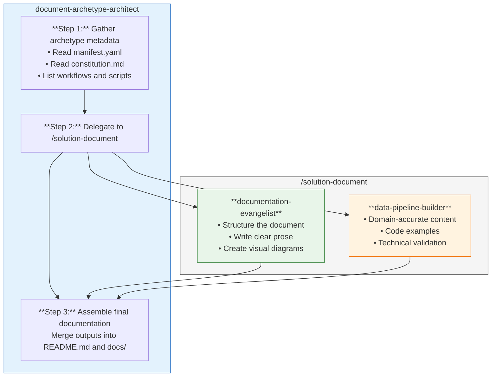

### Pattern: Cross-Archetype Refactoring

When refactoring affects multiple archetypes:

*Input: "Update all archetypes to new manifest schema"*

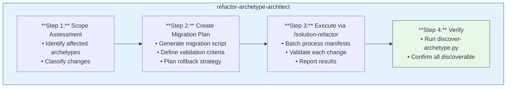

---

## Circular Dependency Handling

### Scenario: Modifying archetype-architect

*User: "Refactor the archetype-architect's scaffold workflow"*

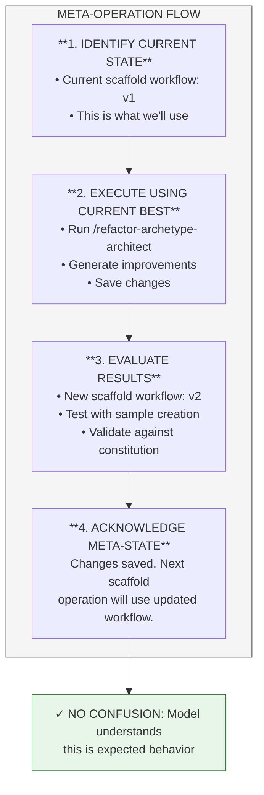

### Scenario: Documenting the documentation archetype

*User: "Document the documentation-evangelist archetype"*

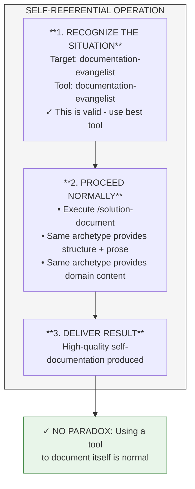

---

## Integration Points

### 00-core-orchestration Integration

archetype-architect integrates with 00-core-orchestration at three levels:

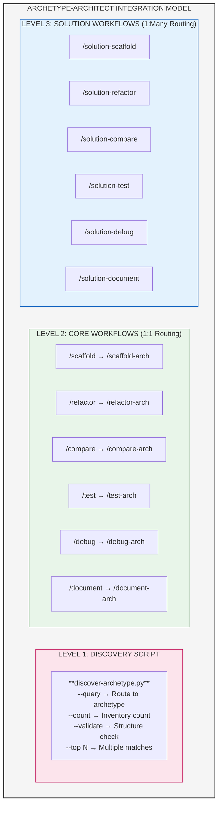

### archetype-architect Workflow Integration Map

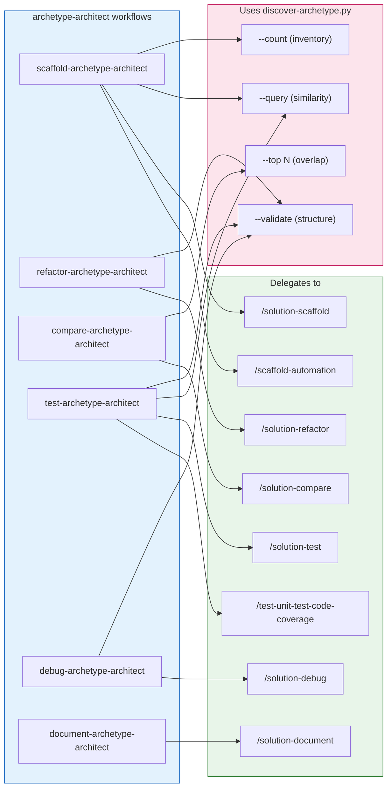

### Routing Thresholds (Standardized)

All core and solution workflows use consistent numeric score thresholds:

| Score Range | Confidence | Action |
|-------------|------------|--------|
| ≥30 | High | Route directly to specialist workflow |
| 15-29 | Medium | Prompt user to confirm, show alternatives |
| <15 | Low | Request clarification, show category suggestions |

Score calculation (from discover-archetype.py):
- Exact archetype name match: +50
- Display name match: +30
- Keyword match: +10 each
- Description word match: +2 each
- Workflow name match: +25

### Environment Variables

| Variable | Purpose | Default |
|----------|---------|---------|
| `ARCHETYPES_BASEDIR` | Root of archetype directories | Auto-detected from script location |

### Configuration Files

| File | Purpose | Location |
|------|---------|----------|
| `manifest.yaml` | Archetype metadata | Each archetype root |
| `*-constitution.md` | Rules and guardrails | Each archetype root |
| `changelog.md` | Version history | Each archetype root (optional) |

---

## Appendix: Templates

### Manifest Template

```yaml
archetype:
  name: {archetype-slug}
  display_name: {Human Readable Name}
  description: |
    Brief description of what this archetype does, when to use it,
    and what problems it solves.
  
  keywords:
    - {domain-keyword-1}
    - {domain-keyword-2}
    - {technology-keyword}
  
  constitution:
    path: {archetype-slug}-constitution.md
  
  dependencies:
    # Only hard dependencies - soft dependencies via discovery
    # - other-archetype-name
  
  workflows:
    scaffold: scaffold-{archetype-slug}
    refactor: refactor-{archetype-slug}
    compare: compare-{archetype-slug}
    test: test-{archetype-slug}
    debug: debug-{archetype-slug}
    document: document-{archetype-slug}
```

### README Template

```markdown
# {Archetype Display Name}

## Overview

{Brief description of the archetype's purpose and value proposition.}

## When to Use

- {Use case 1}
- {Use case 2}
- {Use case 3}

## Quick Start

```bash
# Scaffold a new {domain} solution
/scaffold-{archetype-slug} {arguments}
```

## Workflows

| Workflow | Purpose |
|----------|---------|
| `/scaffold-{slug}` | Create new {domain} solutions |
| `/refactor-{slug}` | Improve existing {domain} code |
| `/compare-{slug}` | Evaluate {domain} design options |
| `/test-{slug}` | Validate {domain} implementations |
| `/debug-{slug}` | Diagnose {domain} issues |
| `/document-{slug}` | Generate {domain} documentation |

## Related Archetypes

- `{related-archetype-1}` - {relationship description}
- `{related-archetype-2}` - {relationship description}

## References

- [Constitution](./{archetype-slug}-constitution.md)
- [Design](./docs/design.md)
```

---

## Document Information

- **Author**: archetype-architect (via /document workflow)
- **Purpose**: Define comprehensive design for archetype-architect refactoring
- **Audience**: Developers maintaining the archetype ecosystem
- **Related**: [Implementation Plan](./implementation-plan.md)
