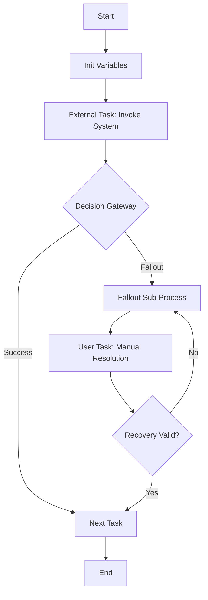

User input: $ARGUMENTS

## Execution Steps


### 0. Set ARCHETYPES_BASEDIR [⋯]
 
**SUCCESS CRITERIA**:
- Search for directory: "00-core-orchestration"
- Set variable `${ARCHETYPES_BASEDIR}` to immediate parent of this directory
 
**HALT IF**:
- Directory "00-core-orchestration" is not found
- `${ARCHETYPES_BASEDIR}` is not set (workflow will halt if this variable is not present in the environment)
 
// turbo
Search for directory: "00-core-orchestration". Set variable `${ARCHETYPES_BASEDIR}` to immediate parent of this directory. Workflow must halt if the variable is not set.

### 1. Environment Setup
// turbo
Run `python ${ARCHETYPES_BASEDIR}/00-core-orchestration/scripts/validate_env.py --archetype camunda-orchestration --json ` and parse for CAMUNDA_VERSION, ENV_VALID. Halt if ENV_VALID is false.

### 2. Load Configuration
- Read `${ARCHETYPES_BASEDIR}/camunda-orchestration/constitution.md` for design rules
- Load `${ARCHETYPES_BASEDIR}/camunda-orchestration/templates/env-config.yaml` for engine settings

### 3. Parse Input
Extract from $ARGUMENTS: BPMN file path or directory, documentation scope (architecture/operations/developer guide), audience (developers/operators/business stakeholders). Request clarification if incomplete.

### 4. Analyze Workflow

Parse BPMN and supporting code to extract:

**Process Structure**:
- Process ID and name
- Start/end events and their types
- All tasks (external, service, user, call activity)
- Gateways (exclusive, event-based, parallel) and their conditions
- Decision gateways with fallout/success paths
- Sub-processes and call activities

**Integration Points**:
- External task topics and their workers
- Camel routes (Kafka, REST, event publishing)
- DMN decision tables and their inputs/outputs
- Message events and correlation keys
- Timer events and expressions

**Error Handling**:
- Error boundary events and their targets
- Fallout sub-process configuration
- User task fallout resolution
- Conditional sequence flow for recovery validation

**Variables**:
- Process variables initialized in `initVars`
- Variables passed via call activity mapping
- Groovy expressions and conditions
- Spring bean references

### 5. Generate Documentation

Create comprehensive documentation with structure:

**Overview Section**:
```markdown
# [Process Name] Documentation

## Purpose
[High-level description of what this workflow accomplishes]

## Process ID
`snake_case_process_id`

## Technology Stack
- Camunda 7 EE with Spring Boot
- Java 17, Groovy 4.x
- Apache Camel for integration
- PostgreSQL (runtime), H2 (test)
```

**Process Flow Diagram** (Mermaid):


**Element Reference**:
```markdown
## Elements

### External Tasks
| Element ID | Topic | Description | Error Handling |
|-----------|-------|-------------|----------------|
| `external_task_invoke_system` | `${calledTopicName}` | Invokes external system | Error boundary → fallout |

### Gateways
| Element ID | Type | Conditions | Default Flow |
|-----------|------|------------|--------------|
| `gateway_pre_fallout` | Exclusive | `fallout == true` → fallout path | success path |

### Call Activities
| Element ID | Called Process | Binding | Variable Mapping |
|-----------|--------------|---------|-----------------|
| `call_activity_fallout` | `fallout_process` | deployment | explicit in/out |
```

**Variable Reference**:
```markdown
## Variables
| Name | Type | Initialized In | Description |
|------|------|---------------|-------------|
| `calledTopicName` | String | initVars | External task topic |
| `fallout` | Boolean | gateway condition | Fallout indicator |
| `ParentProcessInstanceId` | String | call activity input | Parent traceability |
```

**Integration Reference**:
```markdown
## Integrations

### Camel Routes
- Route: `kafka-consumer-route` — Listens for order events
- Route: `rest-callback-route` — Sends completion callbacks

### DMN Tables
- `routing_decision.dmn` — Routes orders by type (FIRST hit policy)
```

**Operations Guide**:
```markdown
## Operations

### Deployment
- Build: `mvn clean package`
- Deploy: Docker image to AKS
- Verify: Camunda Cockpit → Deployments

### Monitoring
- **Cockpit**: Process instance state, incidents, job status
- **Elasticsearch**: Historical execution data
- **Spring Actuator**: Application health

### Troubleshooting
1. **Process stuck at gateway**: Check default sequence flow, verify condition variables
2. **External task not picked up**: Verify topic name, check worker registration
3. **Message not correlating**: Check message name and correlation key
4. **Timer not firing**: Verify expression syntax, check job executor
```

### 6. Add Operational Details

Include sections for:
- **Testing**: How to run tests (`mvn test`), test coverage
- **Configuration**: Spring Boot properties, processes.xml entries
- **Deployment**: Docker/AKS deployment steps
- **Contacts**: Team responsible for maintenance
- **Change Log**: Version history

### 7. Validate and Report

// turbo

Report completion with:
- Documentation file path
- Mermaid diagram preview
- Element count (tasks, gateways, events)
- Documentation completeness estimate
- Recommendations for improvements

## Error Handling

**Missing BPMN Information**: Report incomplete process definitions, suggest adding missing elements.

**No Integration Details**: Warn about missing Camel route or DMN documentation, suggest review.

**Invalid Mermaid Syntax**: Report syntax errors, provide corrected diagram.

## Examples

**Order Activation Flow**: `/document-camunda-orchestration Document order_activation_flow.bpmn with architecture diagram, element reference, and operations guide`
Output: Complete documentation with process flow, element tables, variable reference, operations runbook.

**Call and Wait Pattern**: `/document-camunda-orchestration Document call_and_wait_for_event_flow.bpmn, audience: developers, focus on integration points`
Output: Developer-focused documentation with Camel routes, message correlation, timer configuration.

**Fallout Handling**: `/document-camunda-orchestration Document fallout_process.bpmn, focus on operations and troubleshooting`
Output: Operations guide with fallout resolution steps, Cockpit monitoring, common issues.

## References

Constitution: `${ARCHETYPES_BASEDIR}/camunda-orchestration/constitution.md` | Env Config: `${ARCHETYPES_BASEDIR}/camunda-orchestration/templates/env-config.yaml`
