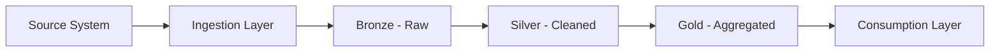

User input: $ARGUMENTS

## Execution Steps

### 0. Context Note

The archetype constitution and workflow have been pre-loaded by CodeForge. All hard-stop rules and mandatory patterns from the constitution are active. Proceed directly to the execution steps below.

### 1. Identify Documentation Scope

Extract from $ARGUMENTS:
- Solution to document
- Documentation type (full package, specific section, stakeholder summary)
- Target audience (technical, business, governance)

### 2. Gather Source Materials

Collect existing artifacts:
- SOLUTION_DESIGN.md
- env-config.yaml
- Implementation Plan
- Any existing architecture diagrams

### 3. Generate Documentation Package

Based on scope and audience:

**Technical Documentation:**
- Architecture overview with Mermaid diagrams
- Data flow specifications (source-to-target mapping)
- Technology stack justification
- Configuration management guide
- Delegation breakdown (which archetype handles what)
- Integration points and contracts

**Business Documentation:**
- Executive summary (business context and goals)
- Data classification and sensitivity
- SLA commitments
- Cost estimates and resource requirements
- Timeline and milestones

**Governance Documentation:**
- Medallion layer assignments
- PII handling procedures
- Access control specifications
- Compliance checklist
- Audit trail requirements

### 4. Create Architecture Diagrams

Generate Mermaid diagrams for:

**Data Flow Diagram:**


**Component Diagram:**
- Show archetype assignments per component
- Highlight integration points

### 5. Delegate Detailed Documentation

For implementation-specific documentation, delegate to specialists:
- Pipeline documentation → pipeline-orchestrator
- Transformation logic → transformation-alchemist or sql-query-crafter
- Quality rules → quality-guardian
- API contracts → integration-specialist

Use discovery script to confirm appropriate archetype:
```bash
python ${ARCHETYPES_BASEDIR}/00-core-orchestration/scripts/discover-archetype.py --query "<documentation task>" --json
```

### 6. Compile Final Package

Assemble documentation deliverables:
- `docs/SOLUTION_DESIGN.md` - Master design document
- `docs/ARCHITECTURE.md` - Technical architecture details
- `docs/RUNBOOK.md` - Operational procedures
- `docs/DATA_DICTIONARY.md` - Schema and field definitions

## Error Handling

**Missing SOLUTION_DESIGN.md**: Cannot document what doesn't exist. Route to `/scaffold-data-solution-architect` first.

**Incomplete Design**: If design has gaps, document known sections and flag missing areas.

**Audience Mismatch**: Adjust language and detail level for target audience.

## Examples

### Example 1: Full Documentation Package

```
/document-data-solution-architect "
Generate complete documentation package for customer-360-pipeline.
Include technical, business, and governance sections.
"
```

### Example 2: Executive Summary

```
/document-data-solution-architect "
Create executive summary for the data-lake-modernization project.
Audience: C-level stakeholders
Focus: Business value, timeline, and cost
"
```

### Example 3: Technical Handoff

```
/document-data-solution-architect "
Document the real-time-inventory solution for handoff to implementation team.
Include detailed architecture, configuration guide, and delegation breakdown.
"
```

## References

- **Constitution**: `${ARCHETYPES_BASEDIR}/data-solution-architect/data-solution-architect-constitution.md`
- **Documentation Evangelist**: For prose quality and formatting standards
- **Related Workflows**: scaffold-data-solution-architect, test-data-solution-architect
