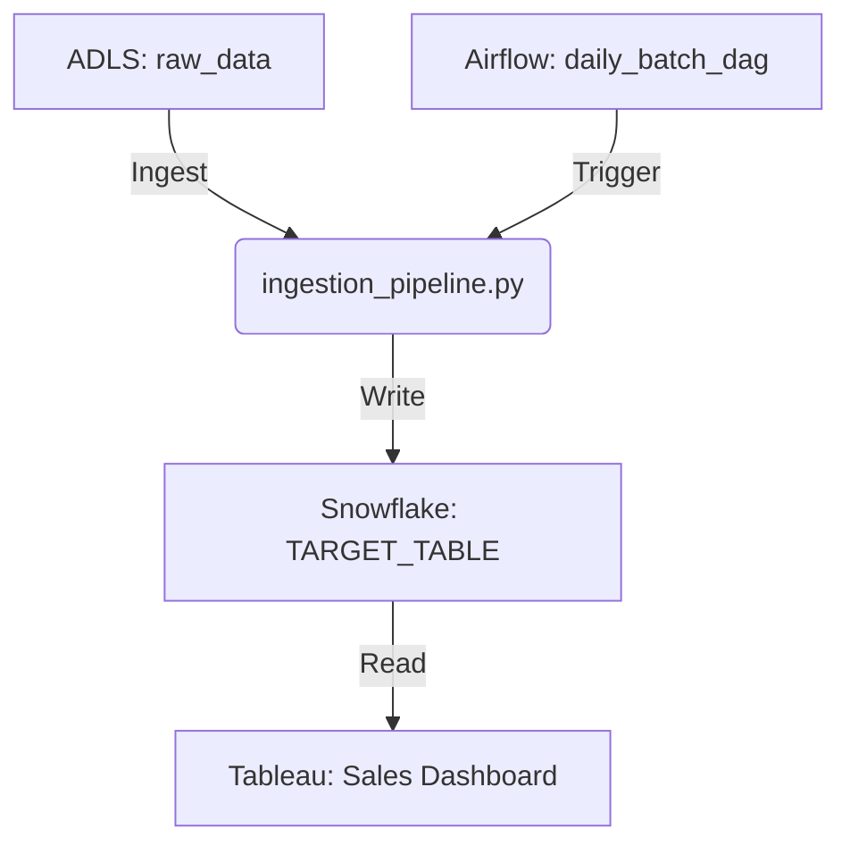

# Impact Analysis Report: New Ingestion (ADLS -> Snowflake)

**Date**: 2026-01-12
**Target Object**: ADLS Container `raw_data` / Target Table `SNOWFLAKE.DB.SCHEMA.TARGET_TABLE`
**Change Type**: ADD_INGESTION (New Feed)
**Codebase Path**: `/Users/puneetabichandani/Documents/aifc-master-aggregation-repo` (Simulated)

## Executive Summary
Adding a new ingestion pipeline is a **Medium Risk** change. While it is additive (low risk of breaking existing code), it introduces new dependencies on the upstream ADLS source and requires significant integration testing.

- **Total Files Affected**: 4 (Estimated)
- **Risk Level**: Medium
- **Primary Risk**: Schema mismatch between ADLS Parquet and Snowflake Table.

## Affected Artifacts

### Ingestion Layer (New)
- `[NEW] ingestion_pipeline.py`: Spark job to read from ADLS and write to Snowflake.
    - **Dependency**: ADLS Connection String, Snowflake Credentials.

### Orchestration Layer (Impacted)
- `[MODIFY] daily_batch_dag.py` (Airflow): Needs a new task to schedule `ingestion_pipeline.py`.
    - **Risk**: Pipeline latency increase.

### Data Warehouse Layer (New)
- `[NEW] create_target_table.sql`: DDL for `TARGET_TABLE` in Snowflake.

### Downstream Reporting (Potential)
- `[NEW] sales_dashboard_view.sql`: If this data feeds a dashboard, this view will be created.

## Impact Graph

## Risk Assessment
- **Schema Evolution**: High. If ADLS files change schema, the Spark job may fail. *Recommended Action*: Enable schema evolution in Delta/Spark or strict schema validation.
- **Data Quality**: Medium. Bad records in source. *Recommended Action*: Define "badRecordsPath" (Constitution Rule).
- **Orchestration**: Low. Standard DAG update.

## Cost Estimate (Informational)
*Based on `multi_layer` model for new ingestion.*

| Phase | Task Focus | Complexity | Base Hours | Multiplier | Total Hours |
|-------|------------|------------|------------|------------|-------------|
| Analysis & Design | Requirements, schema mapping | Medium | 8 | 1.00 | 8.0 |
| Development | Ingestion job, DDL, DAG update | Medium | 24 | 1.00 | 24.0 |
| Unit Testing | Mock ADLS data local run | Medium | 8 | 1.00 | 8.0 |
| Integration Testing | End-to-end flow in Dev | Medium | 12 | 1.00 | 12.0 |
| Deployment/Ops | CI/CD, Key Vault setup | Medium | 6 | 1.00 | 6.0 |
| **Subtotal** |  |  | **58.0** |  | **58.0** |
| Buffer | New Source Integration | 30% |  | 1.30 | 75.4 |
| **Total Estimate** |  |  |  |  | **75.4** |

## Quantified Metrics (Simulated from `collect-impact-stats.py`)
- **Direct Impact Files**: 0 (New features)
- **Downstream Impact Files**: 0 (New features)
- **Score**: 5.0 (Medium Complexity)
