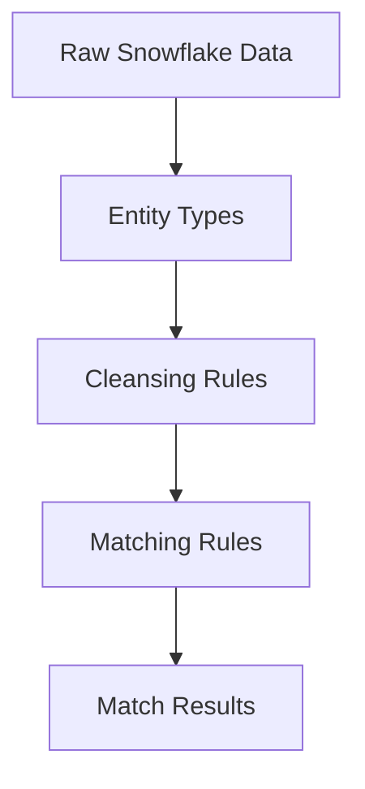

User input: $ARGUMENTS

## Execution Steps

### 0. Set ARCHETYPES_BASEDIR

**SUCCESS CRITERIA**:
- Search for directory: "00-core-orchestration"
- Set variable `${ARCHETYPES_BASEDIR}` to immediate parent of this directory

**HALT IF**:
- Directory "00-core-orchestration" is not found
- `${ARCHETYPES_BASEDIR}` is not set

Search for directory: "00-core-orchestration". Set variable `${ARCHETYPES_BASEDIR}` to immediate parent of this directory. Workflow must halt if the variable is not set.

---

# Document Ontology Workflow

**Archetype**: Ontology Engineer  
**Purpose**: Generate documentation for RAI ontology  
**Complexity**: Low  
**Expected Duration**: 5-10 minutes

## When to Use

Use `/document-ontology` to generate:
- Architecture documentation
- Entity-relationship diagrams
- Rule dependency graphs
- Query pattern examples
- Deployment runbooks
- API reference

## What This Generates

✅ README with quick start  
✅ Architecture diagrams (Mermaid)  
✅ Type hierarchy documentation  
✅ Rule catalog with examples  
✅ Query API reference  
✅ Deployment guide

## Example Output

```markdown
# Address Matching Ontology

## Architecture



## Entity Types

### Address
Base type for all addresses

**Properties**:
- `original_street`: String
- `cleansed_street`: String
- `resolved_city`: City

**Subtypes**:
- InlapAddress
- CimAddress
```

## Error Handling

**No Ontology Found**: Request path to ontology files for documentation generation.

**Missing Metadata**: Generate placeholder sections with TODO markers.

**Complex Dependencies**: Use simplified diagrams with expand-on-demand sections.

## References

- **Constitution**: `${ARCHETYPES_BASEDIR}/ontology-engineer/ontology-engineer-constitution.md`
- **Related**: scaffold-ontology-engineer, refactor-ontology-engineer

---

**Archetype**: Ontology Engineer  
**Version**: 1.0.0
