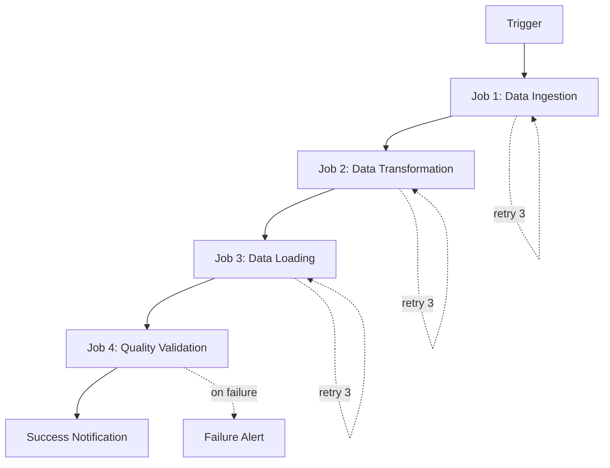

User input: $ARGUMENTS

## Execution Steps


### 0. Context Note

The archetype constitution and workflow have been pre-loaded by CodeForge. All hard-stop rules and mandatory patterns from the constitution are active. Proceed directly to the execution steps below.

### 1. Environment Setup
Run `python ${ARCHETYPES_BASEDIR}/00-core-orchestration/scripts/validate_env.py --archetype pipeline-orchestrator --json ` and parse for ORCHESTRATOR_TYPE, ENV_VALID. Halt if ENV_VALID is false.

### 2. Load Configuration
- The constitution rules are already loaded in context above.
- Load `${ARCHETYPES_BASEDIR}/pipeline-orchestrator/templates/env-config.yaml` for orchestrator settings

### 3. Parse Input
Extract from $ARGUMENTS: job stream/workflow file path or directory, documentation scope (architecture/operations/troubleshooting), audience (developers/operators/business). Request clarification if incomplete.

### 4. Analyze Job Stream

Parse orchestration code to extract:

**Job Structure**:
- Job stream name and description
- Individual jobs and their purposes
- Job dependencies and execution order
- Schedule and triggers

**Configuration**:
- Retry logic and backoff settings
- Timeout configurations
- Resource requirements
- Environment variables

**Integration Points**:
- External systems and APIs
- Data sources and destinations
- Notification channels
- Monitoring hooks

**Error Handling**:
- Failure callbacks
- Retry strategies
- Alerting mechanisms
- Rollback procedures

### 5. Generate Documentation

Create comprehensive documentation with structure:

**Overview Section**:
```markdown
# [Job Stream Name] Documentation

## Purpose
[High-level description of what this job stream accomplishes]

## Schedule
- **Frequency**: [Daily/Hourly/On-demand]
- **Time**: [Execution time]
- **Timezone**: [Timezone]
- **Trigger**: [Event/Schedule/Manual]

## Dependencies
- **Upstream**: [Systems/data this depends on]
- **Downstream**: [Systems/data that depend on this]
```

**Architecture Diagram** (Mermaid):


**Job Definitions**:
```markdown
## Jobs

### Job 1: Data Ingestion
- **Purpose**: Extract data from source systems
- **Script**: `${ARCHETYPES_BASEDIR}/pipeline-orchestrator/scripts/ingest_data.sh`
- **Runtime**: ~15 minutes
- **Retries**: 3 with exponential backoff
- **Dependencies**: None (entry point)
- **Outputs**: Raw data in staging area

### Job 2: Data Transformation
- **Purpose**: Transform and enrich data
- **Script**: `transformations/process_data.py`
- **Runtime**: ~30 minutes
- **Retries**: 3 with exponential backoff
- **Dependencies**: Job 1 (Data Ingestion)
- **Outputs**: Transformed data ready for loading
```

**Configuration Reference**:
```markdown
## Configuration

### Environment Variables
| Variable | Description | Example |
|----------|-------------|---------|
| `SOURCE_PATH` | Source data location | `abfss://raw@storage.dfs.core.windows.net/` |
| `TARGET_PATH` | Target data location | `abfss://processed@storage.dfs.core.windows.net/` |
| `ALERT_EMAIL` | Email for alerts | `team@company.com` |

### Retry Configuration
- **Max Retries**: 3
- **Initial Delay**: 60 seconds
- **Backoff Multiplier**: 2
- **Max Delay**: 300 seconds
```

**Operations Runbook**:
```markdown
## Operations

### Starting the Job Stream
```bash
# Manual trigger
tws submit job_stream_name

# Check status
tws status job_stream_name
```

### Monitoring
- **Dashboard**: [Link to monitoring dashboard]
- **Logs**: [Link to log aggregation]
- **Alerts**: Sent to [alert channel]

### Common Operations
1. **Pause job stream**: `tws pause job_stream_name`
2. **Resume job stream**: `tws resume job_stream_name`
3. **View logs**: `tws logs job_stream_name job_name`
4. **Retry failed job**: `tws retry job_stream_name job_name`
```

**Troubleshooting Guide**:
```markdown
## Troubleshooting

### Job 1 Fails: Data Ingestion
**Symptoms**: Job fails with connection timeout
**Cause**: Source system unavailable or network issues
**Resolution**:
1. Check source system status
2. Verify network connectivity
3. Check credentials in Key Vault
4. Retry job: `tws retry job_stream_name job_1`

### Job 2 Fails: Data Transformation
**Symptoms**: Job fails with OOM error
**Cause**: Insufficient memory for data volume
**Resolution**:
1. Check data volume: `du -sh staging_area/`
2. Increase executor memory in config
3. Enable spill to disk
4. Consider data partitioning

### Job Stream Stuck
**Symptoms**: Job stream shows "Running" but no progress
**Cause**: Deadlock or resource contention
**Resolution**:
1. Check job logs for errors
2. Verify resource availability
3. Kill stuck job: `tws kill job_stream_name`
4. Restart job stream
```

**Change Log**:
```markdown
## Change Log

### Version 1.2.0 (2025-01-15)
- Added retry logic with exponential backoff
- Implemented failure callbacks
- Enhanced monitoring and alerting

### Version 1.1.0 (2024-12-01)
- Optimized Job 2 for better performance
- Added data quality validation (Job 4)
- Updated documentation

### Version 1.0.0 (2024-11-01)
- Initial release
- Basic ETL pipeline with 3 jobs
```

### 6. Add Operational Details

Include sections for:
- **SLA**: Expected runtime and availability
- **Cost**: Estimated compute costs per run
- **Contacts**: Team responsible for maintenance
- **Escalation**: Who to contact for issues
- **Disaster Recovery**: Backup and recovery procedures

### 7. Validate and Report


Report completion with:
- Documentation file path
- Mermaid diagram preview
- Job count and dependencies
- Estimated documentation completeness
- Recommendations for improvements

## Error Handling

**Missing Job Information**: Report incomplete job definitions, suggest adding missing details (purpose, runtime, dependencies).

**No Dependency Information**: Warn about missing dependency graph, suggest manual review of job order.

**Invalid Mermaid Syntax**: Report syntax errors, provide corrected diagram.

## Examples

**Daily ETL Pipeline**: `/document-pipeline orchestration/daily_etl_job.py "Document daily ETL job stream with 5 jobs, include architecture diagram, operations runbook, troubleshooting guide"`
Output: Complete documentation with job definitions, Mermaid diagram, configuration reference, operations guide, troubleshooting section.

**Real-Time Streaming**: `/document-pipeline orchestration/streaming_job.py "Document real-time streaming job stream, focus on monitoring and alerting, audience: operations team"`
Output: Operations-focused documentation with monitoring setup, alert configurations, common issues and resolutions.

**ML Training Pipeline**: `/document-pipeline orchestration/ml_training_job.py "Document ML training job stream with 7 jobs, include resource requirements, cost estimates, SLA"`
Output: Comprehensive documentation with resource specs, cost analysis, SLA commitments, escalation procedures.

## References

Constitution: (pre-loaded above) | Env Config: `${ARCHETYPES_BASEDIR}/pipeline-orchestrator/templates/env-config.yaml`
