# 1371708 Wireless - Device Financing - Customer Account and IP Status (QB7342) - Context Diagram

```mermaid
%%{init: {'theme': 'base', 'themeVariables': {'fontSize': '12px'}, 'flowchart': {'nodeSpacing': 30, 'rankSpacing': 50}}}%%

flowchart TB

    %% ============================================================
    %% LEGEND
    %% ============================================================
    subgraph LEGEND["Impact Legend"]
        direction LR
        L_NEW["◼ New"]:::impactNew
        L_ENHANCE["◼ Enhance"]:::impactEnhance
        L_CONFIGURE["◼ Configure"]:::impactConfigure
        L_TEST["◼ Test"]:::impactTest
        L_RETIRE["◼ Retire"]:::impactRetire
        L_NOCHANGE["◼ No Change"]:::impactNoChange
    end

    subgraph LINE_LEGEND["Line Legend"]
        direction LR
        LL1["── Enhance"]
        LL2["-·- Test"]
        LL3["··· Configure"]
    end

    %% ============================================================
    %% ACTORS
    %% ============================================================
    subgraph ACTORS["Actors"]
        direction LR
        AGENT(["🧑 Agent"])
        CUSTOMER(["🧑 Customer"])
    end

    %% ============================================================
    %% ACC / AGENT LAYER
    %% ============================================================
    subgraph ACC_LAYER["ACC – Agent Channel"]
        CCSF["CCSF<br/><small>30685 · Enhance · Easy</small>"]:::impactEnhance
        CCMuleService["CCMule-Service<br/><small>33688 · Enhance · Moderate</small>"]:::impactEnhance
        CCMuleCLM["CCMule-CLM<br/><small>33686 · Enhance · Easy</small>"]:::impactEnhance
        BWSFMC["BWSFMC<br/><small>30687 · Enhance · Easy</small>"]:::impactEnhance
        CCDL["CCDL<br/><small>32255 · Enhance · Easy</small>"]:::impactEnhance
        AnalyticsMicroservice["Analytics Microservice<br/><small>30420 · Enhance · Easy</small>"]:::impactEnhance
    end

    %% ============================================================
    %% SELF-SERVICE / DIGITAL LAYER
    %% ============================================================
    subgraph DIGITAL_LAYER["Self-Service / Digital"]
        IDPWebAcctMgmt["IDP-WebAcctMgmt<br/><small>32768 · Enhance · Easy</small>"]:::impactEnhance
        myATTMobileApp["myATT Mobile App<br/><small>30558 · Enhance · Easy</small>"]:::impactEnhance
        OMHUB["OMHUB<br/><small>27835 · Enhance · Easy</small>"]:::impactEnhance
    end

    %% ============================================================
    %% COMMERCE / DISCOVERY LAYER
    %% ============================================================
    subgraph COMMERCE_LAYER["Commerce Services"]
        IDPCommerceCartPricing["IDP-Commerce-Cart&Pricing<br/><small>33825 · Enhance · Easy</small>"]:::impactEnhance
        IDPCommercePO["IDP-Commerce-P&O Discovery<br/><small>33824 · Enhance · Easy</small>"]:::impactEnhance
    end

    %% ============================================================
    %% ORDER MANAGEMENT LAYER
    %% ============================================================
    subgraph ORDER_LAYER["Order Management"]
        IDPOMNIODS["IDP-OMNI-ODS<br/><small>32166 · Enhance · Moderate</small>"]:::impactEnhance
        BSSe_OC["BSSe-OC<br/><small>30909 · Enhance · Easy</small>"]:::impactEnhance
        BSSe_C1["BSSe-C1<br/><small>30911 · Enhance · Easy</small>"]:::impactEnhance
        IDPOrderGraphCloud["IDP-Order Graph Cloud<br/><small>31543 · Enhance · Easy</small>"]:::impactEnhance
        ORBIT["ORBIT<br/><small>27503 · Enhance · Easy</small>"]:::impactEnhance
        BSSe_OH["BSSe-OH<br/><small>30910 · Test · TestSupport</small>"]:::impactTest
    end

    %% ============================================================
    %% ORCHESTRATION LAYER
    %% ============================================================
    subgraph ORCH_LAYER["Orchestration"]
        OCE["OCE<br/><small>23488 · Enhance · Moderate</small>"]:::impactEnhance
        IDPCustomerGraphCloud["IDP-Customer Graph Cloud<br/><small>31468 · Enhance · Easy</small>"]:::impactEnhance
    end

    %% ============================================================
    %% BILLING / FINANCIAL LAYER
    %% ============================================================
    subgraph BILLING_LAYER["Billing & Financial"]
        ILS["ILS<br/><small>31372 · Enhance · Moderate</small>"]:::impactEnhance
        BSSe_RTB["BSSe-RTB<br/><small>30914 · Enhance · Easy</small>"]:::impactEnhance
        CFM["CFM<br/><small>13287 · Enhance · Easy</small>"]:::impactEnhance
        BSSe_BB["BSSe-BB<br/><small>31692 · Enhance · Easy</small>"]:::impactEnhance
        OTS["OTS<br/><small>27429 · Test · Test</small>"]:::impactTest
        CorpFin["CorpFin<br/><small>29882 · Test · Test</small>"]:::impactTest
    end

    %% ============================================================
    %% PROVISIONING & INFRASTRUCTURE
    %% ============================================================
    subgraph INFRA_LAYER["Provisioning & Infrastructure"]
        BSSe_NEO["BSSe-NEO<br/><small>31710 · Test · TestSupport</small>"]:::impactTest
        DLC["DLC<br/><small>17744 · Enhance · Easy</small>"]:::impactEnhance
        ISBUS["ISBUS<br/><small>31292 · Configure · Easy</small>"]:::impactConfigure
        MSGRTR["MSGRTR<br/><small>25316 · Configure · Easy</small>"]:::impactConfigure
        IDPCTXEventHUB["IDP-CTX-Event-HUB<br/><small>33932 · Enhance · Easy</small>"]:::impactEnhance
    end

    %% ============================================================
    %% FALLOUT
    %% ============================================================
    subgraph FALLOUT_LAYER["Fallout"]
        BSSe_SkyFM["BSSe-SkyFM<br/><small>31452 · Enhance · Easy</small>"]:::impactEnhance
    end

    %% ============================================================
    %% RECONCILIATION
    %% ============================================================
    subgraph RECON_LAYER["Reconciliation"]
        BSSe_MMap["BSSe-MMap<br/><small>31697 · Enhance · Easy</small>"]:::impactEnhance
    end

    %% ============================================================
    %% DPG SYSTEM
    %% ============================================================
    subgraph DPG_SYSTEM["DPG System"]
        DPGFinance["DPG - Finance<br/><small>31618 · Enhance · Easy</small>"]:::impactEnhance
        DPGBilling["DPG - Billing<br/><small>31204 · Enhance · Easy</small>"]:::impactEnhance
        DPGCustAccounts["DPG - Customer & Accounts<br/><small>31478 · Enhance · Easy</small>"]:::impactEnhance
        DPGEDMOmni["DPG - EDM Omnichannel Analytics<br/><small>29670 · Enhance · Easy</small>"]:::impactEnhance
        DPGOrdersSupply["DPG - Orders & Supply Chain<br/><small>31510 · Enhance · Easy</small>"]:::impactEnhance
        DPGSalesSunrise["DPG - Sales & Sunrise<br/><small>31479 · Enhance · Moderate</small>"]:::impactEnhance
        DPGNetworkUsage["DPG - Network & Usage<br/><small>32417 · Test · TestSupport</small>"]:::impactTest
    end

    %% ============================================================
    %% ACTOR CONNECTIONS
    %% ============================================================
    AGENT --> CCSF
    CUSTOMER --> IDPWebAcctMgmt
    CUSTOMER --> myATTMobileApp

    %% ============================================================
    %% INTERFACES – ENHANCE (solid arrows)
    %% Source → Target with label "Name (Type)"
    %% ============================================================

    %% --- ACC / Agent Layer internal ---
    CCSF -->|"Reporting Data<br/>(DirectLink)"| CCDL
    CCSF -->|"Account/CTN/IP Status Request<br/>(mS)"| CCMuleService
    CCSF -->|"get Reason Code<br/>(mS)"| CCMuleService
    CCSF -->|"Validate what is Allowed<br/>(mS)"| CCMuleService

    %% --- CCMule-Service outbound ---
    CCMuleService -->|"Watermarking & ClickStream Data<br/>(DirectLink)"| AnalyticsMicroservice
    CCMuleService -->|"Account/IP Status Request<br/>(mS)"| IDPOMNIODS
    CCMuleService -->|"Get Reason Code"| IDPOMNIODS
    CCMuleService -->|"Validate<br/>(mS)"| IDPCommerceCartPricing

    %% --- CCMule-CLM ---
    CCMuleCLM -->|"Fallout/Order update<br/>(Event)"| CCMuleService
    CCMuleCLM -->|"Customer Notification<br/>(mS)"| BWSFMC

    %% --- Analytics ---
    AnalyticsMicroservice -->|"Watermarking & ClickStream Data<br/>(DirectLink)"| DPGEDMOmni

    %% --- CCDL ---
    DPGEDMOmni -->|"Reporting Data<br/>(DirectLink)"| CCDL

    %% --- Digital / Self-Service ---
    IDPWebAcctMgmt -->|"Get Reason Code<br/>(mS)"| IDPCommercePO
    IDPWebAcctMgmt -->|"Suspend/Restore Request<br/>(mS)"| IDPOMNIODS
    IDPWebAcctMgmt -->|"Validate<br/>(mS)"| IDPCommerceCartPricing
    myATTMobileApp -->|"Get Reason Code<br/>(mS)"| IDPCommercePO
    myATTMobileApp -->|"Suspend/Restore Request<br/>(mS)"| IDPOMNIODS
    myATTMobileApp -->|"Validate<br/>(mS)"| IDPCommerceCartPricing
    OMHUB -->|"Get order Status<br/>(mS)"| IDPOMNIODS

    %% --- Commerce → Order Management ---
    IDPCommercePO -->|"get Reason Code<br/>(mS)"| BSSe_OC
    IDPOMNIODS -->|"Get Reason Code<br/>(mS)"| IDPCommercePO
    IDPOMNIODS -->|"Suspend/Restore<br/>(Event)"| BSSe_OC
    IDPOMNIODS -->|"Suspend/Restore Events<br/>(Event)"| IDPOrderGraphCloud

    %% --- Order Management ---
    BSSe_OC -->|"Get Reason Code<br/>(mS)"| BSSe_C1
    BSSe_OC -->|"PI update Event for Status Changes<br/>(Event)"| IDPCustomerGraphCloud
    BSSe_OC -->|"Status Change Transaction<br/>(mS)"| OCE
    IDPOrderGraphCloud -->|"Back office Fallout/manual Handling<br/>(Event)"| CCMuleCLM
    IDPOrderGraphCloud -->|"Comm<br/>(Event)"| CCMuleCLM
    IDPOrderGraphCloud -->|"Order Events<br/>(Event)"| DPGOrdersSupply

    %% --- Orchestration ---
    OCE -->|"Notify Billing<br/>(mS)"| BSSe_RTB
    OCE -->|"IP Updates via mS"| ILS

    %% --- Billing / Financial ---
    ILS -->|"Add/Reverse IP Billing<br/>via OC MASS"| BSSe_RTB
    BSSe_RTB -->|"Bill Data<br/>(Event)"| BSSe_BB
    BSSe_RTB -->|"Billed Events<br/>(Event)"| CFM
    BSSe_RTB -->|"Billing Events<br/>(Event)"| DPGBilling
    CFM -->|"Financial Data<br/>(DirectLink)"| DPGFinance
    CFM -->|"Add IP Details"| ORBIT
    CFM -->|"Updates Re Payment/<br/>Reversals for Billing"| ILS

    %% --- Customer Graph → DPG ---
    IDPCustomerGraphCloud -->|"Customer Events<br/>(Event)"| DPGCustAccounts
    DPGCustAccounts -->|"Status Change attributes<br/>(DirectLink)"| DPGEDMOmni
    DPGOrdersSupply -->|"Suspend/Restore attribute<br/>(DirectLink)"| DPGEDMOmni

    %% --- DPG Sales & Sunrise ---
    DPGSalesSunrise -->|"Source IP details by CIPID"| DPGFinance
    DPGSalesSunrise -->|"Source CIPID data from Order"| DPGOrdersSupply

    %% ============================================================
    %% INTERFACES – TEST (dashed arrows)
    %% ============================================================
    BSSe_RTB -.->|"Taxation<br/>(API)"| OTS
    IDPOMNIODS -.->|"Get Order Status<br/>(mS)"| IDPOrderGraphCloud
    BSSe_OC -.->|"test for AIA flows<br/>(Event)"| BSSe_OH
    ORBIT -.->|"Status Request<br/>(mS)"| IDPOMNIODS

    %% ============================================================
    %% TEST-IMPACT APPS – connections from diagram
    %% (Apps with Impact Type = Test in Applications Summary)
    %% ============================================================
    OCE -.->|"Provisioning<br/>(Test)"| BSSe_NEO
    ILS -.->|"GL Entries<br/>(Test)"| CorpFin
    CFM -.->|"GL Entries<br/>(Test)"| CorpFin
    DPGBilling -.->|"Network Data<br/>(Test)"| DPGNetworkUsage

    %% ============================================================
    %% INFRASTRUCTURE – configure apps stitched in
    %% ============================================================
    BSSe_OC -.-|"Message Routing<br/>(Configure)"| ISBUS
    BSSe_OC -.-|"Message Routing<br/>(Configure)"| MSGRTR

    %% ============================================================
    %% Fallout & Reconciliation connections from diagram
    %% ============================================================
    OCE -.->|"Fallout Handling"| BSSe_SkyFM
    BSSe_RTB -.->|"Reconciliation"| BSSe_MMap
    ILS -.->|"Reconciliation"| BSSe_MMap
    CFM -.->|"Reconciliation"| BSSe_MMap
    CorpFin -.->|"Reconciliation"| BSSe_MMap

    %% ============================================================
    %% Event Hub stitched in
    %% ============================================================
    IDPOMNIODS -.->|"Events"| IDPCTXEventHUB

    %% ============================================================
    %% DLC connection from diagram
    %% ============================================================
    OCE -->|"Publish Event to DLC if<br/>Status Change related to<br/>Lost/Stolen"| DLC

    %% ============================================================
    %% STYLES
    %% ============================================================
    classDef impactNew fill:#00b300,stroke:#006600,color:#fff,font-weight:bold
    classDef impactEnhance fill:#00bcd4,stroke:#00838f,color:#fff,font-weight:bold
    classDef impactConfigure fill:#ff9800,stroke:#e65100,color:#fff,font-weight:bold
    classDef impactTest fill:#ffc107,stroke:#ff8f00,color:#000,font-weight:bold
    classDef impactRetire fill:#f44336,stroke:#b71c1c,color:#fff,font-weight:bold
    classDef impactNoChange fill:#9e9e9e,stroke:#616161,color:#fff,font-weight:bold
```

## Application Coverage Checklist

All **38 applications** from the Applications Summary Table are included:

### 1371708 Development (30 apps – Enhance/Configure)
| App | Impact Type | In Diagram |
|-----|-------------|------------|
| Analytics Microservice | Enhance | ✅ |
| BSSe-BB | Enhance | ✅ |
| BSSe-C1 | Enhance | ✅ |
| BSSe-MMap | Enhance | ✅ |
| BSSe-OC | Enhance | ✅ |
| BSSe-RTB | Enhance | ✅ |
| BSSe-SkyFM | Enhance | ✅ |
| BWSFMC | Enhance | ✅ |
| CCDL | Enhance | ✅ |
| CCMule-CLM | Enhance | ✅ |
| CCMule-Service | Enhance | ✅ |
| CCSF | Enhance | ✅ |
| CFM | Enhance | ✅ |
| DLC | Enhance | ✅ |
| DPG - Billing | Enhance | ✅ |
| DPG - Customer & Accounts | Enhance | ✅ |
| DPG - EDM Omnichannel Analytics | Enhance | ✅ |
| DPG - Finance | Enhance | ✅ |
| DPG - Orders & Supply Chain | Enhance | ✅ |
| DPG - Sales & Sunrise | Enhance | ✅ |
| IDP-Commerce-Cart&Pricing | Enhance | ✅ |
| IDP-Commerce-P&O Discovery | Enhance | ✅ |
| IDP-CTX-Event-HUB | Enhance | ✅ |
| IDP-Customer Graph Cloud | Enhance | ✅ |
| IDP-OMNI-ODS | Enhance | ✅ |
| IDP-Order Graph Cloud | Enhance | ✅ |
| ILS | Enhance | ✅ |
| ISBUS | Configure | ✅ |
| MSGRTR | Configure | ✅ |
| OCE | Enhance | ✅ |
| ORBIT | Enhance | ✅ |

### 1371708 No Impact (2 apps)
| App | Impact Type | In Diagram |
|-----|-------------|------------|
| BSSe-OH | Test | ✅ |
| IDP-WebAcctMgmt | Enhance | ✅ |

### 1371708 Non Development (4 apps – Test)
| App | Impact Type | In Diagram |
|-----|-------------|------------|
| BSSe-NEO | Test | ✅ |
| CorpFin | Test | ✅ |
| DPG - Network & Usage | Test | ✅ |
| OTS | Test | ✅ |

### Epic#1279500 No Impact (2 apps)
| App | Impact Type | In Diagram |
|-----|-------------|------------|
| myATT Mobile App | Enhance | ✅ |
| OMHUB | Enhance | ✅ |
