<!-- SI Document – Markdown extraction of 1371708 Wireless - Device Financing - Customer Account and IP Status(QB7342) Solution Intent.docx -->

<table border="1" style="border-collapse: collapse; width: 100%;">
  <thead>
    <tr>
      <th style="border: 1px solid black; padding: 8px;"></th>
      <th style="border: 1px solid black; padding: 8px;">Solution Intent (SI)</th>
    </tr>
  </thead>
</table>
SI Generated: 01/30/26
***ATTENTION:  This Solution Intent (SI) should be validated by the Solution Architect to ensure requirements are still satisfied, if PI planning or phase 2 implementation begins after 07/30/26
It is Strongly encouraged to be reviewed with the Solution Architect if initial SI is being targeted in a later PI/release than initially planned.

# 1371708 Wireless - Device Financing - Customer Account and IP Status(QB7342) Solution Intent

Revision History

<table border="1" style="border-collapse: collapse; width: 100%;">
  <thead>
    <tr>
      <th style="border: 1px solid black; padding: 8px;">Author / ATTUID</th>
      <th style="border: 1px solid black; padding: 8px;">Revision Date</th>
      <th style="border: 1px solid black; padding: 8px;">Version</th>
      <th style="border: 1px solid black; padding: 8px;">Version</th>
      <th style="border: 1px solid black; padding: 8px;">Revision Description</th>
      <th style="border: 1px solid black; padding: 8px;">Revision Description</th>
    </tr>
  </thead>
  <tbody>
    <tr>
      <td style="border: 1px solid black; padding: 8px;">Melanie ms5805</td>
      <td style="border: 1px solid black; padding: 8px;">20 Feb 2025</td>
      <td style="border: 1px solid black; padding: 8px;">0.01</td>
      <td style="border: 1px solid black; padding: 8px;">Initial version SI</td>
      <td style="border: 1px solid black; padding: 8px;">Initial version SI</td>
      <td style="border: 1px solid black; padding: 8px;"></td>
    </tr>
    <tr>
      <td style="border: 1px solid black; padding: 8px;">Melanie ms5805</td>
      <td style="border: 1px solid black; padding: 8px;">21 Feb 2025</td>
      <td style="border: 1px solid black; padding: 8px;">0.02</td>
      <td style="border: 1px solid black; padding: 8px;">Updates during initial review session</td>
      <td style="border: 1px solid black; padding: 8px;">Updates during initial review session</td>
      <td style="border: 1px solid black; padding: 8px;"></td>
    </tr>
    <tr>
      <td style="border: 1px solid black; padding: 8px;">Melanie ms5805</td>
      <td style="border: 1px solid black; padding: 8px;">03 Mar 2025</td>
      <td style="border: 1px solid black; padding: 8px;">0.03</td>
      <td style="border: 1px solid black; padding: 8px;">Updates during initial review session</td>
      <td style="border: 1px solid black; padding: 8px;">Updates during initial review session</td>
      <td style="border: 1px solid black; padding: 8px;"></td>
    </tr>
    <tr>
      <td style="border: 1px solid black; padding: 8px;">Melanie ms5805</td>
      <td style="border: 1px solid black; padding: 8px;">04 Mar 2025</td>
      <td style="border: 1px solid black; padding: 8px;">0.04</td>
      <td style="border: 1px solid black; padding: 8px;">Updates during initial review session</td>
      <td style="border: 1px solid black; padding: 8px;">Updates during initial review session</td>
      <td style="border: 1px solid black; padding: 8px;"></td>
    </tr>
    <tr>
      <td style="border: 1px solid black; padding: 8px;">Melanie ms5805</td>
      <td style="border: 1px solid black; padding: 8px;">07 Mar 2025</td>
      <td style="border: 1px solid black; padding: 8px;">0.05</td>
      <td style="border: 1px solid black; padding: 8px;">Updates to Military Cancellation based on offline discussion/EPIC clarification</td>
      <td style="border: 1px solid black; padding: 8px;">Updates to Military Cancellation based on offline discussion/EPIC clarification</td>
      <td style="border: 1px solid black; padding: 8px;"></td>
    </tr>
    <tr>
      <td style="border: 1px solid black; padding: 8px;">Melanie ms5805</td>
      <td style="border: 1px solid black; padding: 8px;">20 Mar 2025</td>
      <td style="border: 1px solid black; padding: 8px;">0.06</td>
      <td style="border: 1px solid black; padding: 8px;">Updates Orbit Gold to Development impact</td>
      <td style="border: 1px solid black; padding: 8px;">Updates Orbit Gold to Development impact</td>
      <td style="border: 1px solid black; padding: 8px;"></td>
    </tr>
    <tr>
      <td style="border: 1px solid black; padding: 8px;">Melanie ms5805</td>
      <td style="border: 1px solid black; padding: 8px;">20 Mar 2025</td>
      <td style="border: 1px solid black; padding: 8px;">0.07</td>
      <td style="border: 1px solid black; padding: 8px;">Minor correction to Death return scenario (no charge for damage)</td>
      <td style="border: 1px solid black; padding: 8px;">Minor correction to Death return scenario (no charge for damage)</td>
      <td style="border: 1px solid black; padding: 8px;"></td>
    </tr>
    <tr>
      <td style="border: 1px solid black; padding: 8px;">Melanie ms5805</td>
      <td style="border: 1px solid black; padding: 8px;">14 May 2025</td>
      <td style="border: 1px solid black; padding: 8px;">0.08</td>
      <td style="border: 1px solid black; padding: 8px;">Added some detail to CFM → ORBIT interface impacts</td>
      <td style="border: 1px solid black; padding: 8px;">Added some detail to CFM → ORBIT interface impacts</td>
      <td style="border: 1px solid black; padding: 8px;"></td>
    </tr>
    <tr>
      <td style="border: 1px solid black; padding: 8px;">Melanie ms5805</td>
      <td style="border: 1px solid black; padding: 8px;">03 Jun 2025</td>
      <td style="border: 1px solid black; padding: 8px;">0.09</td>
      <td style="border: 1px solid black; padding: 8px;">Finalized detail to CFM → ORBIT interface impacts</td>
      <td style="border: 1px solid black; padding: 8px;">Finalized detail to CFM → ORBIT interface impacts</td>
      <td style="border: 1px solid black; padding: 8px;"></td>
    </tr>
    <tr>
      <td style="border: 1px solid black; padding: 8px;">Melanie ms5805</td>
      <td style="border: 1px solid black; padding: 8px;">01/23/2026</td>
      <td style="border: 1px solid black; padding: 8px;">0.010</td>
      <td style="border: 1px solid black; padding: 8px;">Updates post restart - included feedback from OCE and some minor updates based on shifting scope</td>
      <td style="border: 1px solid black; padding: 8px;">Updates post restart - included feedback from OCE and some minor updates based on shifting scope</td>
      <td style="border: 1px solid black; padding: 8px;"></td>
    </tr>
    <tr>
      <td style="border: 1px solid black; padding: 8px;">Melanie ms5805</td>
      <td style="border: 1px solid black; padding: 8px;">01/27/2026</td>
      <td style="border: 1px solid black; padding: 8px;">0.011</td>
      <td style="border: 1px solid black; padding: 8px;">Updated during re-review for restart of EPIC from May 2025.  Added details for forced acceleration.</td>
      <td style="border: 1px solid black; padding: 8px;">Updated during re-review for restart of EPIC from May 2025.  Added details for forced acceleration.</td>
      <td style="border: 1px solid black; padding: 8px;"></td>
    </tr>
    <tr>
      <td style="border: 1px solid black; padding: 8px;">Melanie ms5805</td>
      <td style="border: 1px solid black; padding: 8px;">01/29/2026</td>
      <td style="border: 1px solid black; padding: 8px;">0.012</td>
      <td style="border: 1px solid black; padding: 8px;">Updated during re-review for restart of EPIC from May 2025.  Added details for forced acceleration.</td>
      <td style="border: 1px solid black; padding: 8px;">Updated during re-review for restart of EPIC from May 2025.  Added details for forced acceleration.</td>
      <td style="border: 1px solid black; padding: 8px;"></td>
    </tr>
  </tbody>
</table>

# Problem Statement

Support Agent Assisted account status functions

The main problem we are addressing is the need for AT&T to effectively manage and respond to changes in the status of customer accounts and device installment loans. The customer pain points revolve around the complexities and inconsistencies that arise when there are changes in account statuses such as non-payment, customer death, military deployment, fraud, service cancellation, forced acceleration, and the need for reinstatement.

# Contributing Factors

## Assumptions, Constraints and Dependencies

<table border="1" style="border-collapse: collapse; width: 100%;">
  <thead>
    <tr>
      <th style="border: 1px solid black; padding: 8px;">A/C/D #</th>
      <th style="border: 1px solid black; padding: 8px;">Description</th>
    </tr>
  </thead>
  <tbody>
    <tr>
      <td style="border: 1px solid black; padding: 8px;">Assumptions</td>
      <td style="border: 1px solid black; padding: 8px;"></td>
    </tr>
    <tr>
      <td style="border: 1px solid black; padding: 8px;">A1</td>
      <td style="border: 1px solid black; padding: 8px;">Since Suspension for Non-Pay is done prior to Cancellation for non-payment, and the initial suspension will be the transaction that accelerates and ultimately closes the installment plan, it is assumed that there is no need for special installment plan handling by the time the account reaches cancellation for non-payment.</td>
    </tr>
    <tr>
      <td style="border: 1px solid black; padding: 8px;">A2</td>
      <td style="border: 1px solid black; padding: 8px;">For non-payment suspends, the loan will continue to bill BAU</td>
    </tr>
    <tr>
      <td style="border: 1px solid black; padding: 8px;">A3</td>
      <td style="border: 1px solid black; padding: 8px;">Warranty replacements will not require a new loan</td>
    </tr>
    <tr>
      <td style="border: 1px solid black; padding: 8px;">A4</td>
      <td style="border: 1px solid black; padding: 8px;"></td>
    </tr>
    <tr>
      <td style="border: 1px solid black; padding: 8px;">A5</td>
      <td style="border: 1px solid black; padding: 8px;"></td>
    </tr>
    <tr>
      <td style="border: 1px solid black; padding: 8px;">Constraints</td>
      <td style="border: 1px solid black; padding: 8px;"></td>
    </tr>
    <tr>
      <td style="border: 1px solid black; padding: 8px;">C1</td>
      <td style="border: 1px solid black; padding: 8px;"></td>
    </tr>
    <tr>
      <td style="border: 1px solid black; padding: 8px;">C2</td>
      <td style="border: 1px solid black; padding: 8px;"></td>
    </tr>
    <tr>
      <td style="border: 1px solid black; padding: 8px;">C3</td>
      <td style="border: 1px solid black; padding: 8px;"></td>
    </tr>
    <tr>
      <td style="border: 1px solid black; padding: 8px;">C4</td>
      <td style="border: 1px solid black; padding: 8px;"></td>
    </tr>
    <tr>
      <td style="border: 1px solid black; padding: 8px;">Dependencies</td>
      <td style="border: 1px solid black; padding: 8px;"></td>
    </tr>
    <tr>
      <td style="border: 1px solid black; padding: 8px;">D1</td>
      <td style="border: 1px solid black; padding: 8px;">Epic #1278924 - Wireless: Collections – Suspend Service, Restore Service, Cancel for non-pay (QB#6478) - CTP - Solution Architecture - tWiki</td>
    </tr>
    <tr>
      <td style="border: 1px solid black; padding: 8px;">D2</td>
      <td style="border: 1px solid black; padding: 8px;">Epic #1279500 - BSSe Wireless: Voluntary Suspend Wireless(QB#6952) - CTP - Solution Architecture - tWiki</td>
    </tr>
    <tr>
      <td style="border: 1px solid black; padding: 8px;">D3</td>
      <td style="border: 1px solid black; padding: 8px;">1343652 Buyer's Remorse Processing (without financing)(QB7211) Solution Intent_V2</td>
    </tr>
  </tbody>
</table>

## Applications Summary Table

<table border="1" style="border-collapse: collapse; width: 100%;">
  <thead>
    <tr>
      <th style="border: 1px solid black; padding: 8px;">Parent Package</th>
      <th style="border: 1px solid black; padding: 8px;">Impact Type</th>
      <th style="border: 1px solid black; padding: 8px;">MOTS ID</th>
      <th style="border: 1px solid black; padding: 8px;">Application</th>
      <th style="border: 1px solid black; padding: 8px;">IT App Owner</th>
      <th style="border: 1px solid black; padding: 8px;">LoE</th>
    </tr>
  </thead>
  <tbody>
    <tr>
      <td style="border: 1px solid black; padding: 8px;">1371708 Development</td>
      <td style="border: 1px solid black; padding: 8px;">Enhance</td>
      <td style="border: 1px solid black; padding: 8px;">30420</td>
      <td style="border: 1px solid black; padding: 8px;">Analytics Microservice</td>
      <td style="border: 1px solid black; padding: 8px;">sh4695</td>
      <td style="border: 1px solid black; padding: 8px;">Easy</td>
    </tr>
    <tr>
      <td style="border: 1px solid black; padding: 8px;">1371708 Development</td>
      <td style="border: 1px solid black; padding: 8px;">Enhance</td>
      <td style="border: 1px solid black; padding: 8px;">31692</td>
      <td style="border: 1px solid black; padding: 8px;">BSSe-BB</td>
      <td style="border: 1px solid black; padding: 8px;">ah6941</td>
      <td style="border: 1px solid black; padding: 8px;">Easy</td>
    </tr>
    <tr>
      <td style="border: 1px solid black; padding: 8px;">1371708 Development</td>
      <td style="border: 1px solid black; padding: 8px;">Enhance</td>
      <td style="border: 1px solid black; padding: 8px;">30911</td>
      <td style="border: 1px solid black; padding: 8px;">BSSe-C1</td>
      <td style="border: 1px solid black; padding: 8px;">mr6640</td>
      <td style="border: 1px solid black; padding: 8px;">Easy</td>
    </tr>
    <tr>
      <td style="border: 1px solid black; padding: 8px;">1371708 Development</td>
      <td style="border: 1px solid black; padding: 8px;">Enhance</td>
      <td style="border: 1px solid black; padding: 8px;">31697</td>
      <td style="border: 1px solid black; padding: 8px;">BSSe-MMap</td>
      <td style="border: 1px solid black; padding: 8px;">el2596</td>
      <td style="border: 1px solid black; padding: 8px;">Easy</td>
    </tr>
    <tr>
      <td style="border: 1px solid black; padding: 8px;">1371708 Development</td>
      <td style="border: 1px solid black; padding: 8px;">Enhance</td>
      <td style="border: 1px solid black; padding: 8px;">30909</td>
      <td style="border: 1px solid black; padding: 8px;">BSSe-OC</td>
      <td style="border: 1px solid black; padding: 8px;">dj8303</td>
      <td style="border: 1px solid black; padding: 8px;">Easy</td>
    </tr>
    <tr>
      <td style="border: 1px solid black; padding: 8px;">1371708 Development</td>
      <td style="border: 1px solid black; padding: 8px;">Enhance</td>
      <td style="border: 1px solid black; padding: 8px;">30914</td>
      <td style="border: 1px solid black; padding: 8px;">BSSe-RTB</td>
      <td style="border: 1px solid black; padding: 8px;">ab7451</td>
      <td style="border: 1px solid black; padding: 8px;">Easy</td>
    </tr>
    <tr>
      <td style="border: 1px solid black; padding: 8px;">1371708 Development</td>
      <td style="border: 1px solid black; padding: 8px;">Enhance</td>
      <td style="border: 1px solid black; padding: 8px;">31452</td>
      <td style="border: 1px solid black; padding: 8px;">BSSe-SkyFM</td>
      <td style="border: 1px solid black; padding: 8px;">rs1624</td>
      <td style="border: 1px solid black; padding: 8px;">Easy</td>
    </tr>
    <tr>
      <td style="border: 1px solid black; padding: 8px;">1371708 Development</td>
      <td style="border: 1px solid black; padding: 8px;">Enhance</td>
      <td style="border: 1px solid black; padding: 8px;">30687</td>
      <td style="border: 1px solid black; padding: 8px;">BWSFMC</td>
      <td style="border: 1px solid black; padding: 8px;">rk6538</td>
      <td style="border: 1px solid black; padding: 8px;">Easy</td>
    </tr>
    <tr>
      <td style="border: 1px solid black; padding: 8px;">1371708 Development</td>
      <td style="border: 1px solid black; padding: 8px;">Enhance</td>
      <td style="border: 1px solid black; padding: 8px;">32255</td>
      <td style="border: 1px solid black; padding: 8px;">CCDL</td>
      <td style="border: 1px solid black; padding: 8px;">ss5477</td>
      <td style="border: 1px solid black; padding: 8px;">Easy</td>
    </tr>
    <tr>
      <td style="border: 1px solid black; padding: 8px;">1371708 Development</td>
      <td style="border: 1px solid black; padding: 8px;">Enhance</td>
      <td style="border: 1px solid black; padding: 8px;">33686</td>
      <td style="border: 1px solid black; padding: 8px;">CCMule-CLM</td>
      <td style="border: 1px solid black; padding: 8px;">rk6538</td>
      <td style="border: 1px solid black; padding: 8px;">Easy</td>
    </tr>
    <tr>
      <td style="border: 1px solid black; padding: 8px;">1371708 Development</td>
      <td style="border: 1px solid black; padding: 8px;">Enhance</td>
      <td style="border: 1px solid black; padding: 8px;">33688</td>
      <td style="border: 1px solid black; padding: 8px;">CCMule-Service</td>
      <td style="border: 1px solid black; padding: 8px;">pm426r</td>
      <td style="border: 1px solid black; padding: 8px;">Moderate</td>
    </tr>
    <tr>
      <td style="border: 1px solid black; padding: 8px;">1371708 Development</td>
      <td style="border: 1px solid black; padding: 8px;">Enhance</td>
      <td style="border: 1px solid black; padding: 8px;">30685</td>
      <td style="border: 1px solid black; padding: 8px;">CCSF</td>
      <td style="border: 1px solid black; padding: 8px;">pp5960</td>
      <td style="border: 1px solid black; padding: 8px;">Easy</td>
    </tr>
    <tr>
      <td style="border: 1px solid black; padding: 8px;">1371708 Development</td>
      <td style="border: 1px solid black; padding: 8px;">Enhance</td>
      <td style="border: 1px solid black; padding: 8px;">13287</td>
      <td style="border: 1px solid black; padding: 8px;">CFM</td>
      <td style="border: 1px solid black; padding: 8px;">tr2858</td>
      <td style="border: 1px solid black; padding: 8px;">Easy</td>
    </tr>
    <tr>
      <td style="border: 1px solid black; padding: 8px;">1371708 Development</td>
      <td style="border: 1px solid black; padding: 8px;">Enhance</td>
      <td style="border: 1px solid black; padding: 8px;">17744</td>
      <td style="border: 1px solid black; padding: 8px;">DLC</td>
      <td style="border: 1px solid black; padding: 8px;">ss7841</td>
      <td style="border: 1px solid black; padding: 8px;">Easy</td>
    </tr>
    <tr>
      <td style="border: 1px solid black; padding: 8px;">1371708 Development</td>
      <td style="border: 1px solid black; padding: 8px;">Enhance</td>
      <td style="border: 1px solid black; padding: 8px;">31204</td>
      <td style="border: 1px solid black; padding: 8px;">DPG - Billing</td>
      <td style="border: 1px solid black; padding: 8px;">lt1046</td>
      <td style="border: 1px solid black; padding: 8px;">Easy</td>
    </tr>
    <tr>
      <td style="border: 1px solid black; padding: 8px;">1371708 Development</td>
      <td style="border: 1px solid black; padding: 8px;">Enhance</td>
      <td style="border: 1px solid black; padding: 8px;">31478</td>
      <td style="border: 1px solid black; padding: 8px;">DPG - Customer & Accounts</td>
      <td style="border: 1px solid black; padding: 8px;">lt1046</td>
      <td style="border: 1px solid black; padding: 8px;">Easy</td>
    </tr>
    <tr>
      <td style="border: 1px solid black; padding: 8px;">1371708 Development</td>
      <td style="border: 1px solid black; padding: 8px;">Enhance</td>
      <td style="border: 1px solid black; padding: 8px;">29670</td>
      <td style="border: 1px solid black; padding: 8px;">DPG - EDM Omnichannel Analytics</td>
      <td style="border: 1px solid black; padding: 8px;">rb9777</td>
      <td style="border: 1px solid black; padding: 8px;">Easy</td>
    </tr>
    <tr>
      <td style="border: 1px solid black; padding: 8px;">1371708 Development</td>
      <td style="border: 1px solid black; padding: 8px;">Enhance</td>
      <td style="border: 1px solid black; padding: 8px;">31618</td>
      <td style="border: 1px solid black; padding: 8px;">DPG - Finance</td>
      <td style="border: 1px solid black; padding: 8px;">mh3242</td>
      <td style="border: 1px solid black; padding: 8px;">Easy</td>
    </tr>
    <tr>
      <td style="border: 1px solid black; padding: 8px;">1371708 Development</td>
      <td style="border: 1px solid black; padding: 8px;">Enhance</td>
      <td style="border: 1px solid black; padding: 8px;">31510</td>
      <td style="border: 1px solid black; padding: 8px;">DPG - Orders & Supply Chain</td>
      <td style="border: 1px solid black; padding: 8px;">lt1046</td>
      <td style="border: 1px solid black; padding: 8px;">Easy</td>
    </tr>
    <tr>
      <td style="border: 1px solid black; padding: 8px;">1371708 Development</td>
      <td style="border: 1px solid black; padding: 8px;">Enhance</td>
      <td style="border: 1px solid black; padding: 8px;">31479</td>
      <td style="border: 1px solid black; padding: 8px;">DPG - Sales & Sunrise</td>
      <td style="border: 1px solid black; padding: 8px;">lc7559</td>
      <td style="border: 1px solid black; padding: 8px;">Moderate</td>
    </tr>
    <tr>
      <td style="border: 1px solid black; padding: 8px;">1371708 Development</td>
      <td style="border: 1px solid black; padding: 8px;">Enhance</td>
      <td style="border: 1px solid black; padding: 8px;">33825</td>
      <td style="border: 1px solid black; padding: 8px;">IDP-Commerce-Cart&Pricing</td>
      <td style="border: 1px solid black; padding: 8px;">ms565h</td>
      <td style="border: 1px solid black; padding: 8px;">Easy</td>
    </tr>
    <tr>
      <td style="border: 1px solid black; padding: 8px;">1371708 Development</td>
      <td style="border: 1px solid black; padding: 8px;">Enhance</td>
      <td style="border: 1px solid black; padding: 8px;">33824</td>
      <td style="border: 1px solid black; padding: 8px;">IDP-Commerce-P&O Discovery</td>
      <td style="border: 1px solid black; padding: 8px;">ra839d</td>
      <td style="border: 1px solid black; padding: 8px;">Easy</td>
    </tr>
    <tr>
      <td style="border: 1px solid black; padding: 8px;">1371708 Development</td>
      <td style="border: 1px solid black; padding: 8px;">Enhance</td>
      <td style="border: 1px solid black; padding: 8px;">33932</td>
      <td style="border: 1px solid black; padding: 8px;">IDP-CTX-Event-HUB</td>
      <td style="border: 1px solid black; padding: 8px;">jb5042</td>
      <td style="border: 1px solid black; padding: 8px;">Easy</td>
    </tr>
    <tr>
      <td style="border: 1px solid black; padding: 8px;">1371708 Development</td>
      <td style="border: 1px solid black; padding: 8px;">Enhance</td>
      <td style="border: 1px solid black; padding: 8px;">31468</td>
      <td style="border: 1px solid black; padding: 8px;">IDP-Customer Graph Cloud</td>
      <td style="border: 1px solid black; padding: 8px;">aw5338</td>
      <td style="border: 1px solid black; padding: 8px;">Easy</td>
    </tr>
    <tr>
      <td style="border: 1px solid black; padding: 8px;">1371708 Development</td>
      <td style="border: 1px solid black; padding: 8px;">Enhance</td>
      <td style="border: 1px solid black; padding: 8px;">32166</td>
      <td style="border: 1px solid black; padding: 8px;">IDP-OMNI-ODS</td>
      <td style="border: 1px solid black; padding: 8px;">sk2099</td>
      <td style="border: 1px solid black; padding: 8px;">Moderate</td>
    </tr>
    <tr>
      <td style="border: 1px solid black; padding: 8px;">1371708 Development</td>
      <td style="border: 1px solid black; padding: 8px;">Enhance</td>
      <td style="border: 1px solid black; padding: 8px;">31543</td>
      <td style="border: 1px solid black; padding: 8px;">IDP-Order Graph Cloud</td>
      <td style="border: 1px solid black; padding: 8px;">sk2099</td>
      <td style="border: 1px solid black; padding: 8px;">Easy</td>
    </tr>
    <tr>
      <td style="border: 1px solid black; padding: 8px;">1371708 Development</td>
      <td style="border: 1px solid black; padding: 8px;">Enhance</td>
      <td style="border: 1px solid black; padding: 8px;">31372</td>
      <td style="border: 1px solid black; padding: 8px;">ILS</td>
      <td style="border: 1px solid black; padding: 8px;">rb5385</td>
      <td style="border: 1px solid black; padding: 8px;">Moderate</td>
    </tr>
    <tr>
      <td style="border: 1px solid black; padding: 8px;">1371708 Development</td>
      <td style="border: 1px solid black; padding: 8px;">Configure</td>
      <td style="border: 1px solid black; padding: 8px;">31292</td>
      <td style="border: 1px solid black; padding: 8px;">ISBUS</td>
      <td style="border: 1px solid black; padding: 8px;">ph2755</td>
      <td style="border: 1px solid black; padding: 8px;">Easy</td>
    </tr>
    <tr>
      <td style="border: 1px solid black; padding: 8px;">1371708 Development</td>
      <td style="border: 1px solid black; padding: 8px;">Configure</td>
      <td style="border: 1px solid black; padding: 8px;">25316</td>
      <td style="border: 1px solid black; padding: 8px;">MSGRTR</td>
      <td style="border: 1px solid black; padding: 8px;">jm0939</td>
      <td style="border: 1px solid black; padding: 8px;">Easy</td>
    </tr>
    <tr>
      <td style="border: 1px solid black; padding: 8px;">1371708 Development</td>
      <td style="border: 1px solid black; padding: 8px;">Enhance</td>
      <td style="border: 1px solid black; padding: 8px;">23488</td>
      <td style="border: 1px solid black; padding: 8px;">OCE</td>
      <td style="border: 1px solid black; padding: 8px;">hv2868</td>
      <td style="border: 1px solid black; padding: 8px;">Moderate</td>
    </tr>
    <tr>
      <td style="border: 1px solid black; padding: 8px;">1371708 Development</td>
      <td style="border: 1px solid black; padding: 8px;">Enhance</td>
      <td style="border: 1px solid black; padding: 8px;">27503</td>
      <td style="border: 1px solid black; padding: 8px;">ORBIT</td>
      <td style="border: 1px solid black; padding: 8px;">rb9594</td>
      <td style="border: 1px solid black; padding: 8px;">Easy</td>
    </tr>
    <tr>
      <td style="border: 1px solid black; padding: 8px;">1371708 No Impact</td>
      <td style="border: 1px solid black; padding: 8px;">Test</td>
      <td style="border: 1px solid black; padding: 8px;">30910</td>
      <td style="border: 1px solid black; padding: 8px;">BSSe-OH</td>
      <td style="border: 1px solid black; padding: 8px;">dj8303</td>
      <td style="border: 1px solid black; padding: 8px;">TestSupport</td>
    </tr>
    <tr>
      <td style="border: 1px solid black; padding: 8px;">1371708 No Impact</td>
      <td style="border: 1px solid black; padding: 8px;">Enhance</td>
      <td style="border: 1px solid black; padding: 8px;">32768</td>
      <td style="border: 1px solid black; padding: 8px;">IDP-WebAcctMgmt</td>
      <td style="border: 1px solid black; padding: 8px;">rk699u</td>
      <td style="border: 1px solid black; padding: 8px;">Easy</td>
    </tr>
    <tr>
      <td style="border: 1px solid black; padding: 8px;">1371708 Non Development</td>
      <td style="border: 1px solid black; padding: 8px;">Test</td>
      <td style="border: 1px solid black; padding: 8px;">31710</td>
      <td style="border: 1px solid black; padding: 8px;">BSSe-NEO</td>
      <td style="border: 1px solid black; padding: 8px;">pn4720</td>
      <td style="border: 1px solid black; padding: 8px;">TestSupport</td>
    </tr>
    <tr>
      <td style="border: 1px solid black; padding: 8px;">1371708 Non Development</td>
      <td style="border: 1px solid black; padding: 8px;">Test</td>
      <td style="border: 1px solid black; padding: 8px;">29882</td>
      <td style="border: 1px solid black; padding: 8px;">CorpFin</td>
      <td style="border: 1px solid black; padding: 8px;">pr4873</td>
      <td style="border: 1px solid black; padding: 8px;">Test</td>
    </tr>
    <tr>
      <td style="border: 1px solid black; padding: 8px;">1371708 Non Development</td>
      <td style="border: 1px solid black; padding: 8px;">Test</td>
      <td style="border: 1px solid black; padding: 8px;">32417</td>
      <td style="border: 1px solid black; padding: 8px;">DPG - Network & Usage</td>
      <td style="border: 1px solid black; padding: 8px;">lt1046</td>
      <td style="border: 1px solid black; padding: 8px;">TestSupport</td>
    </tr>
    <tr>
      <td style="border: 1px solid black; padding: 8px;">1371708 Non Development</td>
      <td style="border: 1px solid black; padding: 8px;">Test</td>
      <td style="border: 1px solid black; padding: 8px;">27429</td>
      <td style="border: 1px solid black; padding: 8px;">OTS</td>
      <td style="border: 1px solid black; padding: 8px;">ak758m</td>
      <td style="border: 1px solid black; padding: 8px;">Test</td>
    </tr>
    <tr>
      <td style="border: 1px solid black; padding: 8px;">Epic#1279500 No Impact</td>
      <td style="border: 1px solid black; padding: 8px;">Enhance</td>
      <td style="border: 1px solid black; padding: 8px;">30558</td>
      <td style="border: 1px solid black; padding: 8px;">myATT Mobile App</td>
      <td style="border: 1px solid black; padding: 8px;">ds104v</td>
      <td style="border: 1px solid black; padding: 8px;">Easy</td>
    </tr>
    <tr>
      <td style="border: 1px solid black; padding: 8px;">Epic#1279500 No Impact</td>
      <td style="border: 1px solid black; padding: 8px;">Enhance</td>
      <td style="border: 1px solid black; padding: 8px;">27835</td>
      <td style="border: 1px solid black; padding: 8px;">OMHUB</td>
      <td style="border: 1px solid black; padding: 8px;">rk699u</td>
      <td style="border: 1px solid black; padding: 8px;">Easy</td>
    </tr>
  </tbody>
</table>
*Group impacts are added automatically via MDE and are not represented in the SI.

## Sequencing Summary Table

<table border="1" style="border-collapse: collapse; width: 100%;">
  <thead>
    <tr>
      <th style="border: 1px solid black; padding: 8px;">Parent Package</th>
      <th style="border: 1px solid black; padding: 8px;">Application Impact Type</th>
      <th style="border: 1px solid black; padding: 8px;">MOTS ID</th>
      <th style="border: 1px solid black; padding: 8px;">Application</th>
      <th style="border: 1px solid black; padding: 8px;">Application LoE</th>
      <th style="border: 1px solid black; padding: 8px;">*Sequence</th>
    </tr>
  </thead>
</table>
*Sequences of "ZZZ" means the application was not considered in the sequencing.
This sequence table understands that this sequence does not cover all acceptance criteria or requirements or all scenarios under epic but covers most common and generic flow to give high level idea.
Actual development sequence should be relied on PI planning exercises.

## Product Team Summary Table

<table border="1" style="border-collapse: collapse; width: 100%;">
  <thead>
    <tr>
      <th style="border: 1px solid black; padding: 8px;">Product Team</th>
      <th style="border: 1px solid black; padding: 8px;"></th>
      <th style="border: 1px solid black; padding: 8px;">Notes</th>
      <th style="border: 1px solid black; padding: 8px;">MOTS ID</th>
      <th style="border: 1px solid black; padding: 8px;">Application</th>
      <th style="border: 1px solid black; padding: 8px;">Application LoE</th>
    </tr>
  </thead>
  <tbody>
    <tr>
      <td style="border: 1px solid black; padding: 8px;">ACC-Shop and Purchase</td>
      <td style="border: 1px solid black; padding: 8px;">Customer Connect Salesforce Sales & Services Cloud (MOTS ID: 30685)</td>
      <td style="border: 1px solid black; padding: 8px;">30685</td>
      <td style="border: 1px solid black; padding: 8px;">CCSF</td>
      <td style="border: 1px solid black; padding: 8px;">Easy</td>
      <td style="border: 1px solid black; padding: 8px;"></td>
    </tr>
    <tr>
      <td style="border: 1px solid black; padding: 8px;">BSS Evolution</td>
      <td style="border: 1px solid black; padding: 8px;">BSSe-BriteBill (MOTS ID: 31692)</td>
      <td style="border: 1px solid black; padding: 8px;">31692</td>
      <td style="border: 1px solid black; padding: 8px;">BSSe-BB</td>
      <td style="border: 1px solid black; padding: 8px;">Easy</td>
      <td style="border: 1px solid black; padding: 8px;"></td>
    </tr>
    <tr>
      <td style="border: 1px solid black; padding: 8px;">BSS Evolution</td>
      <td style="border: 1px solid black; padding: 8px;">BSSe-MoneyMap (MOTS ID: 31697)</td>
      <td style="border: 1px solid black; padding: 8px;">31697</td>
      <td style="border: 1px solid black; padding: 8px;">BSSe-MMap</td>
      <td style="border: 1px solid black; padding: 8px;">Easy</td>
      <td style="border: 1px solid black; padding: 8px;"></td>
    </tr>
    <tr>
      <td style="border: 1px solid black; padding: 8px;">BSS Evolution</td>
      <td style="border: 1px solid black; padding: 8px;">BSSe-Real Time Biller (MOTS ID: 30914)</td>
      <td style="border: 1px solid black; padding: 8px;">30914</td>
      <td style="border: 1px solid black; padding: 8px;">BSSe-RTB</td>
      <td style="border: 1px solid black; padding: 8px;">Easy</td>
      <td style="border: 1px solid black; padding: 8px;"></td>
    </tr>
    <tr>
      <td style="border: 1px solid black; padding: 8px;">BSS Evolution</td>
      <td style="border: 1px solid black; padding: 8px;">BSSe-Catalog One (MOTS ID: 30911)</td>
      <td style="border: 1px solid black; padding: 8px;">30911</td>
      <td style="border: 1px solid black; padding: 8px;">BSSe-C1</td>
      <td style="border: 1px solid black; padding: 8px;">Easy</td>
      <td style="border: 1px solid black; padding: 8px;"></td>
    </tr>
    <tr>
      <td style="border: 1px solid black; padding: 8px;">BSS Evolution</td>
      <td style="border: 1px solid black; padding: 8px;">BSSe-NEO (MOTS ID: 31710)</td>
      <td style="border: 1px solid black; padding: 8px;">31710</td>
      <td style="border: 1px solid black; padding: 8px;">BSSe-NEO</td>
      <td style="border: 1px solid black; padding: 8px;">TestSupport</td>
      <td style="border: 1px solid black; padding: 8px;"></td>
    </tr>
    <tr>
      <td style="border: 1px solid black; padding: 8px;">BSS Evolution</td>
      <td style="border: 1px solid black; padding: 8px;">BSSe-Order Capture (MOTS ID: 30909)</td>
      <td style="border: 1px solid black; padding: 8px;">30909</td>
      <td style="border: 1px solid black; padding: 8px;">BSSe-OC</td>
      <td style="border: 1px solid black; padding: 8px;">Easy</td>
      <td style="border: 1px solid black; padding: 8px;"></td>
    </tr>
    <tr>
      <td style="border: 1px solid black; padding: 8px;">BSS Evolution</td>
      <td style="border: 1px solid black; padding: 8px;">BSSe-Sky Fallout Management (MOTS ID: 31452)</td>
      <td style="border: 1px solid black; padding: 8px;">31452</td>
      <td style="border: 1px solid black; padding: 8px;">BSSe-SkyFM</td>
      <td style="border: 1px solid black; padding: 8px;">Easy</td>
      <td style="border: 1px solid black; padding: 8px;"></td>
    </tr>
    <tr>
      <td style="border: 1px solid black; padding: 8px;">BSS Evolution</td>
      <td style="border: 1px solid black; padding: 8px;">BSSe-Order Handler (MOTS ID: 30910)</td>
      <td style="border: 1px solid black; padding: 8px;">30910</td>
      <td style="border: 1px solid black; padding: 8px;">BSSe-OH</td>
      <td style="border: 1px solid black; padding: 8px;">TestSupport</td>
      <td style="border: 1px solid black; padding: 8px;"></td>
    </tr>
    <tr>
      <td style="border: 1px solid black; padding: 8px;">Commerce Services</td>
      <td style="border: 1px solid black; padding: 8px;">IDP-Commerce-Cart&Pricing (MOTS ID: 33825)</td>
      <td style="border: 1px solid black; padding: 8px;">33825</td>
      <td style="border: 1px solid black; padding: 8px;">IDP-Commerce-Cart&Pricing</td>
      <td style="border: 1px solid black; padding: 8px;">Easy</td>
      <td style="border: 1px solid black; padding: 8px;"></td>
    </tr>
    <tr>
      <td style="border: 1px solid black; padding: 8px;">Commerce Services</td>
      <td style="border: 1px solid black; padding: 8px;">IDP-Commerce-P&O Discovery (MOTS ID: 33824)</td>
      <td style="border: 1px solid black; padding: 8px;">33824</td>
      <td style="border: 1px solid black; padding: 8px;">IDP-Commerce-P&O Discovery</td>
      <td style="border: 1px solid black; padding: 8px;">Easy</td>
      <td style="border: 1px solid black; padding: 8px;"></td>
    </tr>
    <tr>
      <td style="border: 1px solid black; padding: 8px;">SPT-Analytics</td>
      <td style="border: 1px solid black; padding: 8px;">Server-Side Analytics Framework Microservice (MOTS ID: 30420)</td>
      <td style="border: 1px solid black; padding: 8px;">30420</td>
      <td style="border: 1px solid black; padding: 8px;">Analytics Microservice</td>
      <td style="border: 1px solid black; padding: 8px;">Easy</td>
      <td style="border: 1px solid black; padding: 8px;"></td>
    </tr>
    <tr>
      <td style="border: 1px solid black; padding: 8px;">SPT-Analytics</td>
      <td style="border: 1px solid black; padding: 8px;">DPG - EDM Omnichannel Analytics (MOTS ID: 29670)</td>
      <td style="border: 1px solid black; padding: 8px;">29670</td>
      <td style="border: 1px solid black; padding: 8px;">DPG - EDM Omnichannel Analytics</td>
      <td style="border: 1px solid black; padding: 8px;">Easy</td>
      <td style="border: 1px solid black; padding: 8px;"></td>
    </tr>
    <tr>
      <td style="border: 1px solid black; padding: 8px;">SPT-Customer Graph 360</td>
      <td style="border: 1px solid black; padding: 8px;">IDP-Customer Graph Cloud (MOTS ID: 31468)</td>
      <td style="border: 1px solid black; padding: 8px;">31468</td>
      <td style="border: 1px solid black; padding: 8px;">IDP-Customer Graph Cloud</td>
      <td style="border: 1px solid black; padding: 8px;">Easy</td>
      <td style="border: 1px solid black; padding: 8px;"></td>
    </tr>
    <tr>
      <td style="border: 1px solid black; padding: 8px;">SPT-Infrastructure Engineering</td>
      <td style="border: 1px solid black; padding: 8px;">IDP-CTX-Event-HUB (MOTS ID: 33932)</td>
      <td style="border: 1px solid black; padding: 8px;">33932</td>
      <td style="border: 1px solid black; padding: 8px;">IDP-CTX-Event-HUB</td>
      <td style="border: 1px solid black; padding: 8px;">Easy</td>
      <td style="border: 1px solid black; padding: 8px;"></td>
    </tr>
    <tr>
      <td style="border: 1px solid black; padding: 8px;">SPT-myATT Mobile App</td>
      <td style="border: 1px solid black; padding: 8px;">myAT&T Mobile App (MOTS ID: 30558)</td>
      <td style="border: 1px solid black; padding: 8px;">30558</td>
      <td style="border: 1px solid black; padding: 8px;">myATT Mobile App</td>
      <td style="border: 1px solid black; padding: 8px;">Easy</td>
      <td style="border: 1px solid black; padding: 8px;"></td>
    </tr>
    <tr>
      <td style="border: 1px solid black; padding: 8px;">SPT-OCE</td>
      <td style="border: 1px solid black; padding: 8px;">Order Capture Engine (MOTS ID: 23488)</td>
      <td style="border: 1px solid black; padding: 8px;">23488</td>
      <td style="border: 1px solid black; padding: 8px;">OCE</td>
      <td style="border: 1px solid black; padding: 8px;">Moderate</td>
      <td style="border: 1px solid black; padding: 8px;"></td>
    </tr>
    <tr>
      <td style="border: 1px solid black; padding: 8px;">SPT-Order Mgmt</td>
      <td style="border: 1px solid black; padding: 8px;">IDP-Order Graph Cloud (MOTS ID: 31543)</td>
      <td style="border: 1px solid black; padding: 8px;">31543</td>
      <td style="border: 1px solid black; padding: 8px;">IDP-Order Graph Cloud</td>
      <td style="border: 1px solid black; padding: 8px;">Easy</td>
      <td style="border: 1px solid black; padding: 8px;"></td>
    </tr>
    <tr>
      <td style="border: 1px solid black; padding: 8px;">SPT-Order Mgmt</td>
      <td style="border: 1px solid black; padding: 8px;">IDP-Order Domain Services (MOTS ID: 32166)</td>
      <td style="border: 1px solid black; padding: 8px;">32166</td>
      <td style="border: 1px solid black; padding: 8px;">IDP-OMNI-ODS</td>
      <td style="border: 1px solid black; padding: 8px;">Moderate</td>
      <td style="border: 1px solid black; padding: 8px;"></td>
    </tr>
    <tr>
      <td style="border: 1px solid black; padding: 8px;">SPT-SFDC CLM ATT</td>
      <td style="border: 1px solid black; padding: 8px;">Customer Connect Salesforce Marketing Cloud (MOTS ID: 30687)</td>
      <td style="border: 1px solid black; padding: 8px;">30687</td>
      <td style="border: 1px solid black; padding: 8px;">BWSFMC</td>
      <td style="border: 1px solid black; padding: 8px;">Easy</td>
      <td style="border: 1px solid black; padding: 8px;"></td>
    </tr>
    <tr>
      <td style="border: 1px solid black; padding: 8px;">SPT-SFDC CLM ATT</td>
      <td style="border: 1px solid black; padding: 8px;">CCMule-CLM (MOTS ID: 33686)</td>
      <td style="border: 1px solid black; padding: 8px;">33686</td>
      <td style="border: 1px solid black; padding: 8px;">CCMule-CLM</td>
      <td style="border: 1px solid black; padding: 8px;">Easy</td>
      <td style="border: 1px solid black; padding: 8px;"></td>
    </tr>
    <tr>
      <td style="border: 1px solid black; padding: 8px;">SPT-SFDC Data Insights ATT</td>
      <td style="border: 1px solid black; padding: 8px;">Customer  Connect  Data Lake House (MOTS ID: 32255)</td>
      <td style="border: 1px solid black; padding: 8px;">32255</td>
      <td style="border: 1px solid black; padding: 8px;">CCDL</td>
      <td style="border: 1px solid black; padding: 8px;">Easy</td>
      <td style="border: 1px solid black; padding: 8px;"></td>
    </tr>
    <tr>
      <td style="border: 1px solid black; padding: 8px;">SPT-SFDC Data Solutions ATT</td>
      <td style="border: 1px solid black; padding: 8px;">Customer  Connect  Data Lake House (MOTS ID: 32255)</td>
      <td style="border: 1px solid black; padding: 8px;">32255</td>
      <td style="border: 1px solid black; padding: 8px;">CCDL</td>
      <td style="border: 1px solid black; padding: 8px;">Easy</td>
      <td style="border: 1px solid black; padding: 8px;"></td>
    </tr>
    <tr>
      <td style="border: 1px solid black; padding: 8px;">SPT-SFDC Data Solutions ATT</td>
      <td style="border: 1px solid black; padding: 8px;">Customer  Connect  Data Lake House (MOTS ID: 32255)</td>
      <td style="border: 1px solid black; padding: 8px;">32255</td>
      <td style="border: 1px solid black; padding: 8px;">CCDL</td>
      <td style="border: 1px solid black; padding: 8px;">Easy</td>
      <td style="border: 1px solid black; padding: 8px;"></td>
    </tr>
    <tr>
      <td style="border: 1px solid black; padding: 8px;">SPT-SFDC Service and Support</td>
      <td style="border: 1px solid black; padding: 8px;">CCMule-Service (MOTS ID: 33688)</td>
      <td style="border: 1px solid black; padding: 8px;">33688</td>
      <td style="border: 1px solid black; padding: 8px;">CCMule-Service</td>
      <td style="border: 1px solid black; padding: 8px;">Moderate</td>
      <td style="border: 1px solid black; padding: 8px;"></td>
    </tr>
    <tr>
      <td style="border: 1px solid black; padding: 8px;">SPT-SFDC Service and Support</td>
      <td style="border: 1px solid black; padding: 8px;">Customer Connect Salesforce Sales & Services Cloud (MOTS ID: 30685)</td>
      <td style="border: 1px solid black; padding: 8px;">30685</td>
      <td style="border: 1px solid black; padding: 8px;">CCSF</td>
      <td style="border: 1px solid black; padding: 8px;">Easy</td>
      <td style="border: 1px solid black; padding: 8px;"></td>
    </tr>
    <tr>
      <td style="border: 1px solid black; padding: 8px;">Web-Post Purchase</td>
      <td style="border: 1px solid black; padding: 8px;">Order Management Hub (MOTS ID: 27835)</td>
      <td style="border: 1px solid black; padding: 8px;">27835</td>
      <td style="border: 1px solid black; padding: 8px;">OMHUB</td>
      <td style="border: 1px solid black; padding: 8px;">Easy</td>
      <td style="border: 1px solid black; padding: 8px;"></td>
    </tr>
    <tr>
      <td style="border: 1px solid black; padding: 8px;">Web-Post Purchase</td>
      <td style="border: 1px solid black; padding: 8px;">Web Account Management (MOTS ID: 32768)</td>
      <td style="border: 1px solid black; padding: 8px;">32768</td>
      <td style="border: 1px solid black; padding: 8px;">IDP-WebAcctMgmt</td>
      <td style="border: 1px solid black; padding: 8px;">Easy</td>
      <td style="border: 1px solid black; padding: 8px;"></td>
    </tr>
  </tbody>
</table>

## Interfaces Summary Table

<table border="1" style="border-collapse: collapse; width: 100%;">
  <thead>
    <tr>
      <th style="border: 1px solid black; padding: 8px;">Source</th>
      <th style="border: 1px solid black; padding: 8px;">Target</th>
      <th style="border: 1px solid black; padding: 8px;">Name</th>
      <th style="border: 1px solid black; padding: 8px;">Type</th>
      <th style="border: 1px solid black; padding: 8px;">Description</th>
      <th style="border: 1px solid black; padding: 8px;">Impact Type</th>
    </tr>
  </thead>
  <tbody>
    <tr>
      <td style="border: 1px solid black; padding: 8px;">Analytics Microservice</td>
      <td style="border: 1px solid black; padding: 8px;">DPG - EDM Omnichannel Analytics</td>
      <td style="border: 1px solid black; padding: 8px;">Watermarking & ClickStream Data</td>
      <td style="border: 1px solid black; padding: 8px;">DirectLink</td>
      <td style="border: 1px solid black; padding: 8px;"></td>
      <td style="border: 1px solid black; padding: 8px;">Enhance</td>
    </tr>
    <tr>
      <td style="border: 1px solid black; padding: 8px;">BSSe-RTB</td>
      <td style="border: 1px solid black; padding: 8px;">BSSe-BB</td>
      <td style="border: 1px solid black; padding: 8px;">Bill Data</td>
      <td style="border: 1px solid black; padding: 8px;">Event</td>
      <td style="border: 1px solid black; padding: 8px;"></td>
      <td style="border: 1px solid black; padding: 8px;">Enhance</td>
    </tr>
    <tr>
      <td style="border: 1px solid black; padding: 8px;">BSSe-RTB</td>
      <td style="border: 1px solid black; padding: 8px;">CFM</td>
      <td style="border: 1px solid black; padding: 8px;">Billed Events</td>
      <td style="border: 1px solid black; padding: 8px;">Event</td>
      <td style="border: 1px solid black; padding: 8px;"></td>
      <td style="border: 1px solid black; padding: 8px;">Enhance</td>
    </tr>
    <tr>
      <td style="border: 1px solid black; padding: 8px;">BSSe-RTB</td>
      <td style="border: 1px solid black; padding: 8px;">DPG - Billing</td>
      <td style="border: 1px solid black; padding: 8px;"></td>
      <td style="border: 1px solid black; padding: 8px;">Event</td>
      <td style="border: 1px solid black; padding: 8px;"></td>
      <td style="border: 1px solid black; padding: 8px;">Enhance</td>
    </tr>
    <tr>
      <td style="border: 1px solid black; padding: 8px;">BSSe-RTB</td>
      <td style="border: 1px solid black; padding: 8px;">OTS</td>
      <td style="border: 1px solid black; padding: 8px;">Taxation</td>
      <td style="border: 1px solid black; padding: 8px;">API</td>
      <td style="border: 1px solid black; padding: 8px;"></td>
      <td style="border: 1px solid black; padding: 8px;">Test</td>
    </tr>
    <tr>
      <td style="border: 1px solid black; padding: 8px;">CCMule-Service</td>
      <td style="border: 1px solid black; padding: 8px;">Analytics Microservice</td>
      <td style="border: 1px solid black; padding: 8px;">Watermarking & ClickStream Data</td>
      <td style="border: 1px solid black; padding: 8px;">DirectLink</td>
      <td style="border: 1px solid black; padding: 8px;"></td>
      <td style="border: 1px solid black; padding: 8px;">Enhance</td>
    </tr>
    <tr>
      <td style="border: 1px solid black; padding: 8px;">CCMule-Service</td>
      <td style="border: 1px solid black; padding: 8px;">IDP-OMNI-ODS</td>
      <td style="border: 1px solid black; padding: 8px;">Account/IP Status Request</td>
      <td style="border: 1px solid black; padding: 8px;">mS</td>
      <td style="border: 1px solid black; padding: 8px;"></td>
      <td style="border: 1px solid black; padding: 8px;">Enhance</td>
    </tr>
    <tr>
      <td style="border: 1px solid black; padding: 8px;">CCMule-Service</td>
      <td style="border: 1px solid black; padding: 8px;">IDP-OMNI-ODS</td>
      <td style="border: 1px solid black; padding: 8px;">Get Reason Code</td>
      <td style="border: 1px solid black; padding: 8px;"></td>
      <td style="border: 1px solid black; padding: 8px;"></td>
      <td style="border: 1px solid black; padding: 8px;">Enhance</td>
    </tr>
    <tr>
      <td style="border: 1px solid black; padding: 8px;">CCMule-Service</td>
      <td style="border: 1px solid black; padding: 8px;">IDP-Commerce-Cart&Pricing</td>
      <td style="border: 1px solid black; padding: 8px;">Validate</td>
      <td style="border: 1px solid black; padding: 8px;">mS</td>
      <td style="border: 1px solid black; padding: 8px;"></td>
      <td style="border: 1px solid black; padding: 8px;">Enhance</td>
    </tr>
    <tr>
      <td style="border: 1px solid black; padding: 8px;">CCSF</td>
      <td style="border: 1px solid black; padding: 8px;">CCDL</td>
      <td style="border: 1px solid black; padding: 8px;">Reporting Data</td>
      <td style="border: 1px solid black; padding: 8px;">DirectLink</td>
      <td style="border: 1px solid black; padding: 8px;"></td>
      <td style="border: 1px solid black; padding: 8px;">Enhance</td>
    </tr>
    <tr>
      <td style="border: 1px solid black; padding: 8px;">CCSF</td>
      <td style="border: 1px solid black; padding: 8px;">CCMule-Service</td>
      <td style="border: 1px solid black; padding: 8px;">Account/CTN/IP Status Request</td>
      <td style="border: 1px solid black; padding: 8px;">mS</td>
      <td style="border: 1px solid black; padding: 8px;"></td>
      <td style="border: 1px solid black; padding: 8px;">Enhance</td>
    </tr>
    <tr>
      <td style="border: 1px solid black; padding: 8px;">CCSF</td>
      <td style="border: 1px solid black; padding: 8px;">CCMule-Service</td>
      <td style="border: 1px solid black; padding: 8px;">get Reason Code</td>
      <td style="border: 1px solid black; padding: 8px;">mS</td>
      <td style="border: 1px solid black; padding: 8px;"></td>
      <td style="border: 1px solid black; padding: 8px;">Enhance</td>
    </tr>
    <tr>
      <td style="border: 1px solid black; padding: 8px;">CCSF</td>
      <td style="border: 1px solid black; padding: 8px;">CCMule-Service</td>
      <td style="border: 1px solid black; padding: 8px;">Validate what is Allowed</td>
      <td style="border: 1px solid black; padding: 8px;">mS</td>
      <td style="border: 1px solid black; padding: 8px;"></td>
      <td style="border: 1px solid black; padding: 8px;">Enhance</td>
    </tr>
    <tr>
      <td style="border: 1px solid black; padding: 8px;">DPG - EDM Omnichannel Analytics</td>
      <td style="border: 1px solid black; padding: 8px;">CCDL</td>
      <td style="border: 1px solid black; padding: 8px;">Repoting Data</td>
      <td style="border: 1px solid black; padding: 8px;">DirectLink</td>
      <td style="border: 1px solid black; padding: 8px;"></td>
      <td style="border: 1px solid black; padding: 8px;">Enhance</td>
    </tr>
    <tr>
      <td style="border: 1px solid black; padding: 8px;">IDP-Commerce-P&O Discovery</td>
      <td style="border: 1px solid black; padding: 8px;">BSSe-OC</td>
      <td style="border: 1px solid black; padding: 8px;">get Reason Code</td>
      <td style="border: 1px solid black; padding: 8px;">mS</td>
      <td style="border: 1px solid black; padding: 8px;"></td>
      <td style="border: 1px solid black; padding: 8px;">Enhance</td>
    </tr>
    <tr>
      <td style="border: 1px solid black; padding: 8px;">IDP-OMNI-ODS</td>
      <td style="border: 1px solid black; padding: 8px;">IDP-Commerce-P&O Discovery</td>
      <td style="border: 1px solid black; padding: 8px;">Get Reason Code</td>
      <td style="border: 1px solid black; padding: 8px;">mS</td>
      <td style="border: 1px solid black; padding: 8px;"></td>
      <td style="border: 1px solid black; padding: 8px;">Enhance</td>
    </tr>
    <tr>
      <td style="border: 1px solid black; padding: 8px;">IDP-OMNI-ODS</td>
      <td style="border: 1px solid black; padding: 8px;">BSSe-OC</td>
      <td style="border: 1px solid black; padding: 8px;">Suspend/Restore</td>
      <td style="border: 1px solid black; padding: 8px;">Event</td>
      <td style="border: 1px solid black; padding: 8px;"></td>
      <td style="border: 1px solid black; padding: 8px;">Enhance</td>
    </tr>
    <tr>
      <td style="border: 1px solid black; padding: 8px;">IDP-OMNI-ODS</td>
      <td style="border: 1px solid black; padding: 8px;">IDP-Order Graph Cloud</td>
      <td style="border: 1px solid black; padding: 8px;">Get Oder Status</td>
      <td style="border: 1px solid black; padding: 8px;">mS</td>
      <td style="border: 1px solid black; padding: 8px;"></td>
      <td style="border: 1px solid black; padding: 8px;">Test</td>
    </tr>
    <tr>
      <td style="border: 1px solid black; padding: 8px;">IDP-OMNI-ODS</td>
      <td style="border: 1px solid black; padding: 8px;">IDP-Order Graph Cloud</td>
      <td style="border: 1px solid black; padding: 8px;">Suspend/Restore Events</td>
      <td style="border: 1px solid black; padding: 8px;">Event</td>
      <td style="border: 1px solid black; padding: 8px;"></td>
      <td style="border: 1px solid black; padding: 8px;">Enhance</td>
    </tr>
    <tr>
      <td style="border: 1px solid black; padding: 8px;">IDP-WebAcctMgmt</td>
      <td style="border: 1px solid black; padding: 8px;">IDP-Commerce-P&O Discovery</td>
      <td style="border: 1px solid black; padding: 8px;">Get Reason Code</td>
      <td style="border: 1px solid black; padding: 8px;">mS</td>
      <td style="border: 1px solid black; padding: 8px;"></td>
      <td style="border: 1px solid black; padding: 8px;">Enhance</td>
    </tr>
    <tr>
      <td style="border: 1px solid black; padding: 8px;">IDP-WebAcctMgmt</td>
      <td style="border: 1px solid black; padding: 8px;">IDP-OMNI-ODS</td>
      <td style="border: 1px solid black; padding: 8px;">Suspend/Restore Request</td>
      <td style="border: 1px solid black; padding: 8px;">mS</td>
      <td style="border: 1px solid black; padding: 8px;"></td>
      <td style="border: 1px solid black; padding: 8px;">Enhance</td>
    </tr>
    <tr>
      <td style="border: 1px solid black; padding: 8px;">IDP-WebAcctMgmt</td>
      <td style="border: 1px solid black; padding: 8px;">IDP-Commerce-Cart&Pricing</td>
      <td style="border: 1px solid black; padding: 8px;">Validate</td>
      <td style="border: 1px solid black; padding: 8px;">mS</td>
      <td style="border: 1px solid black; padding: 8px;"></td>
      <td style="border: 1px solid black; padding: 8px;">Enhance</td>
    </tr>
    <tr>
      <td style="border: 1px solid black; padding: 8px;">myATT Mobile App</td>
      <td style="border: 1px solid black; padding: 8px;">IDP-Commerce-P&O Discovery</td>
      <td style="border: 1px solid black; padding: 8px;">Get Reason Code</td>
      <td style="border: 1px solid black; padding: 8px;">mS</td>
      <td style="border: 1px solid black; padding: 8px;"></td>
      <td style="border: 1px solid black; padding: 8px;">Enhance</td>
    </tr>
    <tr>
      <td style="border: 1px solid black; padding: 8px;">myATT Mobile App</td>
      <td style="border: 1px solid black; padding: 8px;">IDP-OMNI-ODS</td>
      <td style="border: 1px solid black; padding: 8px;">Suspend/Restore Request</td>
      <td style="border: 1px solid black; padding: 8px;">mS</td>
      <td style="border: 1px solid black; padding: 8px;"></td>
      <td style="border: 1px solid black; padding: 8px;">Enhance</td>
    </tr>
    <tr>
      <td style="border: 1px solid black; padding: 8px;">myATT Mobile App</td>
      <td style="border: 1px solid black; padding: 8px;">IDP-Commerce-Cart&Pricing</td>
      <td style="border: 1px solid black; padding: 8px;">Validate</td>
      <td style="border: 1px solid black; padding: 8px;">mS</td>
      <td style="border: 1px solid black; padding: 8px;"></td>
      <td style="border: 1px solid black; padding: 8px;">Enhance</td>
    </tr>
    <tr>
      <td style="border: 1px solid black; padding: 8px;">OMHUB</td>
      <td style="border: 1px solid black; padding: 8px;">IDP-OMNI-ODS</td>
      <td style="border: 1px solid black; padding: 8px;">Get order Status</td>
      <td style="border: 1px solid black; padding: 8px;">mS</td>
      <td style="border: 1px solid black; padding: 8px;"></td>
      <td style="border: 1px solid black; padding: 8px;">Enhance</td>
    </tr>
    <tr>
      <td style="border: 1px solid black; padding: 8px;">CCMule-CLM</td>
      <td style="border: 1px solid black; padding: 8px;">CCMule-Service</td>
      <td style="border: 1px solid black; padding: 8px;">case for Fallout/Order update if any needed due to self healing</td>
      <td style="border: 1px solid black; padding: 8px;">Event</td>
      <td style="border: 1px solid black; padding: 8px;"></td>
      <td style="border: 1px solid black; padding: 8px;">Enhance</td>
    </tr>
    <tr>
      <td style="border: 1px solid black; padding: 8px;">CCMule-CLM</td>
      <td style="border: 1px solid black; padding: 8px;">BWSFMC</td>
      <td style="border: 1px solid black; padding: 8px;">Customer Notification</td>
      <td style="border: 1px solid black; padding: 8px;">mS</td>
      <td style="border: 1px solid black; padding: 8px;"></td>
      <td style="border: 1px solid black; padding: 8px;">Enhance</td>
    </tr>
    <tr>
      <td style="border: 1px solid black; padding: 8px;">BSSe-OC</td>
      <td style="border: 1px solid black; padding: 8px;">BSSe-C1</td>
      <td style="border: 1px solid black; padding: 8px;">Get Reason Code</td>
      <td style="border: 1px solid black; padding: 8px;">mS</td>
      <td style="border: 1px solid black; padding: 8px;"></td>
      <td style="border: 1px solid black; padding: 8px;">Enhance</td>
    </tr>
    <tr>
      <td style="border: 1px solid black; padding: 8px;">BSSe-OC</td>
      <td style="border: 1px solid black; padding: 8px;">IDP-Customer Graph Cloud</td>
      <td style="border: 1px solid black; padding: 8px;">PI update Event for Status Changes</td>
      <td style="border: 1px solid black; padding: 8px;">Event</td>
      <td style="border: 1px solid black; padding: 8px;"></td>
      <td style="border: 1px solid black; padding: 8px;">Enhance</td>
    </tr>
    <tr>
      <td style="border: 1px solid black; padding: 8px;">BSSe-OC</td>
      <td style="border: 1px solid black; padding: 8px;">OCE</td>
      <td style="border: 1px solid black; padding: 8px;">Status Change Transaction</td>
      <td style="border: 1px solid black; padding: 8px;">mS</td>
      <td style="border: 1px solid black; padding: 8px;"></td>
      <td style="border: 1px solid black; padding: 8px;">Enhance</td>
    </tr>
    <tr>
      <td style="border: 1px solid black; padding: 8px;">BSSe-OC</td>
      <td style="border: 1px solid black; padding: 8px;">BSSe-OH</td>
      <td style="border: 1px solid black; padding: 8px;">test for AIA flows</td>
      <td style="border: 1px solid black; padding: 8px;">Event</td>
      <td style="border: 1px solid black; padding: 8px;"></td>
      <td style="border: 1px solid black; padding: 8px;">Test</td>
    </tr>
    <tr>
      <td style="border: 1px solid black; padding: 8px;">CFM</td>
      <td style="border: 1px solid black; padding: 8px;">DPG - Finance</td>
      <td style="border: 1px solid black; padding: 8px;"></td>
      <td style="border: 1px solid black; padding: 8px;">DirectLink</td>
      <td style="border: 1px solid black; padding: 8px;"></td>
      <td style="border: 1px solid black; padding: 8px;">Enhance</td>
    </tr>
    <tr>
      <td style="border: 1px solid black; padding: 8px;">CFM</td>
      <td style="border: 1px solid black; padding: 8px;">ORBIT</td>
      <td style="border: 1px solid black; padding: 8px;">Add IP Details</td>
      <td style="border: 1px solid black; padding: 8px;"></td>
      <td style="border: 1px solid black; padding: 8px;"></td>
      <td style="border: 1px solid black; padding: 8px;">Enhance</td>
    </tr>
    <tr>
      <td style="border: 1px solid black; padding: 8px;">CFM</td>
      <td style="border: 1px solid black; padding: 8px;">ILS</td>
      <td style="border: 1px solid black; padding: 8px;">Updates Re Payment/Reversals for Billing</td>
      <td style="border: 1px solid black; padding: 8px;"></td>
      <td style="border: 1px solid black; padding: 8px;"></td>
      <td style="border: 1px solid black; padding: 8px;">Enhance</td>
    </tr>
    <tr>
      <td style="border: 1px solid black; padding: 8px;">DPG - Customer & Accounts</td>
      <td style="border: 1px solid black; padding: 8px;">DPG - EDM Omnichannel Analytics</td>
      <td style="border: 1px solid black; padding: 8px;">Status Change attributes</td>
      <td style="border: 1px solid black; padding: 8px;">DirectLink</td>
      <td style="border: 1px solid black; padding: 8px;"></td>
      <td style="border: 1px solid black; padding: 8px;">Enhance</td>
    </tr>
    <tr>
      <td style="border: 1px solid black; padding: 8px;">DPG - Orders & Supply Chain</td>
      <td style="border: 1px solid black; padding: 8px;">DPG - EDM Omnichannel Analytics</td>
      <td style="border: 1px solid black; padding: 8px;">Suspend/Restore attribute</td>
      <td style="border: 1px solid black; padding: 8px;">DirectLink</td>
      <td style="border: 1px solid black; padding: 8px;"></td>
      <td style="border: 1px solid black; padding: 8px;">Enhance</td>
    </tr>
    <tr>
      <td style="border: 1px solid black; padding: 8px;">IDP-Customer Graph Cloud</td>
      <td style="border: 1px solid black; padding: 8px;">DPG - Customer & Accounts</td>
      <td style="border: 1px solid black; padding: 8px;"></td>
      <td style="border: 1px solid black; padding: 8px;">Event</td>
      <td style="border: 1px solid black; padding: 8px;"></td>
      <td style="border: 1px solid black; padding: 8px;">Enhance</td>
    </tr>
    <tr>
      <td style="border: 1px solid black; padding: 8px;">ORBIT</td>
      <td style="border: 1px solid black; padding: 8px;">IDP-OMNI-ODS</td>
      <td style="border: 1px solid black; padding: 8px;"></td>
      <td style="border: 1px solid black; padding: 8px;">mS</td>
      <td style="border: 1px solid black; padding: 8px;"></td>
      <td style="border: 1px solid black; padding: 8px;">Test</td>
    </tr>
    <tr>
      <td style="border: 1px solid black; padding: 8px;">IDP-Order Graph Cloud</td>
      <td style="border: 1px solid black; padding: 8px;">CCMule-CLM</td>
      <td style="border: 1px solid black; padding: 8px;">case for Back office agent for Fallout/Order update for manual Handling</td>
      <td style="border: 1px solid black; padding: 8px;">Event</td>
      <td style="border: 1px solid black; padding: 8px;"></td>
      <td style="border: 1px solid black; padding: 8px;">Enhance</td>
    </tr>
    <tr>
      <td style="border: 1px solid black; padding: 8px;">IDP-Order Graph Cloud</td>
      <td style="border: 1px solid black; padding: 8px;">CCMule-CLM</td>
      <td style="border: 1px solid black; padding: 8px;">Comm</td>
      <td style="border: 1px solid black; padding: 8px;">Event</td>
      <td style="border: 1px solid black; padding: 8px;"></td>
      <td style="border: 1px solid black; padding: 8px;">Enhance</td>
    </tr>
    <tr>
      <td style="border: 1px solid black; padding: 8px;">IDP-Order Graph Cloud</td>
      <td style="border: 1px solid black; padding: 8px;">DPG - Orders & Supply Chain</td>
      <td style="border: 1px solid black; padding: 8px;"></td>
      <td style="border: 1px solid black; padding: 8px;">Event</td>
      <td style="border: 1px solid black; padding: 8px;"></td>
      <td style="border: 1px solid black; padding: 8px;">Enhance</td>
    </tr>
    <tr>
      <td style="border: 1px solid black; padding: 8px;">OCE</td>
      <td style="border: 1px solid black; padding: 8px;">BSSe-RTB</td>
      <td style="border: 1px solid black; padding: 8px;">Notify Billing</td>
      <td style="border: 1px solid black; padding: 8px;">mS</td>
      <td style="border: 1px solid black; padding: 8px;"></td>
      <td style="border: 1px solid black; padding: 8px;">Enhance</td>
    </tr>
    <tr>
      <td style="border: 1px solid black; padding: 8px;">OCE</td>
      <td style="border: 1px solid black; padding: 8px;">ILS</td>
      <td style="border: 1px solid black; padding: 8px;">IP Updates via mS</td>
      <td style="border: 1px solid black; padding: 8px;"></td>
      <td style="border: 1px solid black; padding: 8px;"></td>
      <td style="border: 1px solid black; padding: 8px;">Enhance</td>
    </tr>
    <tr>
      <td style="border: 1px solid black; padding: 8px;">ILS</td>
      <td style="border: 1px solid black; padding: 8px;">BSSe-RTB</td>
      <td style="border: 1px solid black; padding: 8px;">Add/Reverse IP Billing via OC MASS</td>
      <td style="border: 1px solid black; padding: 8px;"></td>
      <td style="border: 1px solid black; padding: 8px;"></td>
      <td style="border: 1px solid black; padding: 8px;">Enhance</td>
    </tr>
    <tr>
      <td style="border: 1px solid black; padding: 8px;">DPG - Sales & Sunrise</td>
      <td style="border: 1px solid black; padding: 8px;">DPG - Finance</td>
      <td style="border: 1px solid black; padding: 8px;">Source IP details by CIPID</td>
      <td style="border: 1px solid black; padding: 8px;"></td>
      <td style="border: 1px solid black; padding: 8px;"></td>
      <td style="border: 1px solid black; padding: 8px;">Enhance</td>
    </tr>
    <tr>
      <td style="border: 1px solid black; padding: 8px;">DPG - Sales & Sunrise</td>
      <td style="border: 1px solid black; padding: 8px;">DPG - Orders & Supply Chain</td>
      <td style="border: 1px solid black; padding: 8px;">Source CIPID data from Order</td>
      <td style="border: 1px solid black; padding: 8px;"></td>
      <td style="border: 1px solid black; padding: 8px;"></td>
      <td style="border: 1px solid black; padding: 8px;">Enhance</td>
    </tr>
  </tbody>
</table>
*Any Non-Backward compatible api design changes should be flagged for a risk assessment/validation by the api Provider with all api Consumers and SA/AA/SyE

## Requirements Summary Table

<table border="1" style="border-collapse: collapse; width: 100%;">
  <thead>
    <tr>
      <th style="border: 1px solid black; padding: 8px;">NFR</th>
      <th style="border: 1px solid black; padding: 8px;">Name</th>
      <th style="border: 1px solid black; padding: 8px;">Notes</th>
      <th style="border: 1px solid black; padding: 8px;">Apps</th>
    </tr>
  </thead>
</table>

## 1371708 End to End Solution

ORBIT GOLD's needs for installment data will be met through an enhanced CFM interface (the finding is that CFM receives / will receive enough data from ILS to derive or provide to ORBIT GOLD). CFM will provide the data for ALL installment plans, not just those in treatment, as the billing data is used for decisioning. RTB will need to ensure it sends the appropriate data that is received from ILS to CFM. Details about what Orbit needs to receive from CFM based on the legacy Orbit interface are below:

NRF will have two different PBIs (one for accelerated NRF fees sent by ILS for ESPR (new CR) and one for all others via SCOR -> IDP CAMS -> RTB which is RT000025.00).

<table border="1" style="border-collapse: collapse; width: 100%;">
  <thead>
    <tr>
      <th style="border: 1px solid black; padding: 8px;">Charge Description</th>
      <th style="border: 1px solid black; padding: 8px;">Charge Code</th>
      <th style="border: 1px solid black; padding: 8px;">PBI</th>
    </tr>
  </thead>
  <tbody>
    <tr>
      <td style="border: 1px solid black; padding: 8px;">ILS Accessory Charge</td>
      <td style="border: 1px solid black; padding: 8px;">ILSACSORY</td>
      <td style="border: 1px solid black; padding: 8px;">RT000006.00</td>
    </tr>
    <tr>
      <td style="border: 1px solid black; padding: 8px;">ILS Smartphone Charge</td>
      <td style="border: 1px solid black; padding: 8px;">ILS</td>
      <td style="border: 1px solid black; padding: 8px;">RT000010.00</td>
    </tr>
    <tr>
      <td style="border: 1px solid black; padding: 8px;">ILS Promo Charge</td>
      <td style="border: 1px solid black; padding: 8px;">ILSPROMO</td>
      <td style="border: 1px solid black; padding: 8px;">RT000010.00</td>
    </tr>
    <tr>
      <td style="border: 1px solid black; padding: 8px;">ILS Unreturned Device Fee via SCOR</td>
      <td style="border: 1px solid black; padding: 8px;">IPACCLRT</td>
      <td style="border: 1px solid black; padding: 8px;">RT000025.00</td>
    </tr>
    <tr>
      <td style="border: 1px solid black; padding: 8px;">ILS Unreturned Device Fee via ILS (e.g. ESPR/RPCC)</td>
      <td style="border: 1px solid black; padding: 8px;">TBD*</td>
      <td style="border: 1px solid black; padding: 8px;">RT000010.00</td>
    </tr>
    <tr>
      <td style="border: 1px solid black; padding: 8px;">ILS Damaged Device Fee via SCOR</td>
      <td style="border: 1px solid black; padding: 8px;">TBD2</td>
      <td style="border: 1px solid black; padding: 8px;">RT000008.00</td>
    </tr>
    <tr>
      <td style="border: 1px solid black; padding: 8px;">ILS Acceleration Balance Charge from ILS (e.g. cancel service)</td>
      <td style="border: 1px solid black; padding: 8px;">TBD3**</td>
      <td style="border: 1px solid black; padding: 8px;">RT000010.00</td>
    </tr>
  </tbody>
</table>

*The ESPR data hasn’t yet been set up but will be a CR to the 1371708 EPIC.

** @LEHR, ALLISON / @TIAN, SUSAN TIAN I think we will need a charge code for the acceleration of balance due to cancellation of IP, since it’s not an unreturned device fee for a phone we expect back, but the remaining balance when they cancelled (likely different bill presentation/description, and other reasons to differentiate right?).

It is expected that CFM, as the accounts receivables SL, will receive from RTB the specific details of bill payments and adjustments offsetting the specific installment plan charge code for a given bill period. This means that CFM knows if an installment charge or accelerated balance charge has been adjusted or paid with its charge code. The below table summarizes the calculations CFM will support to provide ORBIT and Strata (via existing ORBIT interface) installment data for treatment.

<table border="1" style="border-collapse: collapse; width: 100%;">
  <thead>
    <tr>
      <th style="border: 1px solid black; padding: 8px;">Legacy ORBIT FILE Name</th>
      <th style="border: 1px solid black; padding: 8px;">Description</th>
      <th style="border: 1px solid black; padding: 8px;">RTB and CFM Solution Impacts:</th>
    </tr>
  </thead>
  <tbody>
    <tr>
      <td style="border: 1px solid black; padding: 8px;">INST_UNPAID_AMT</td>
      <td style="border: 1px solid black; padding: 8px;">This is the sum of all installments under a BAN (multiple CIPIDs possible) that are UNPAID as of the current invoice. If there are NO installment plans under the BAN this will be zero</td>
      <td style="border: 1px solid black; padding: 8px;">INST_UNPAID_AMT: CFM will send ORBIT the sum of remainingUnbilledBalance (ILS -> to RTB -> CFM) totaled with billed charges PBI 10, and I believe PBI 8 and 25. RTB will need to ensure the remainingUnbilledBalance is sent to CFM.</td>
    </tr>
    <tr>
      <td style="border: 1px solid black; padding: 8px;">TOT_NXT_INST_AMT</td>
      <td style="border: 1px solid black; padding: 8px;">This is the total installment charges (multiple CIPIDs possible) that are added/created with CURRENT invoice for the BAN</td>
      <td style="border: 1px solid black; padding: 8px;">RTB will send CFM the TRANSACTION_AMOUNT values from ILS that were billed in the current period. CFM will total this amount and include in Orbit File. Total of PBI 10.</td>
    </tr>
    <tr>
      <td style="border: 1px solid black; padding: 8px;">TOT_NXT_VOL_PYF_AMT</td>
      <td style="border: 1px solid black; padding: 8px;">Total Balance of installments to completely payoff all loans under the BAN less adjustments and paid amounts.</td>
      <td style="border: 1px solid black; padding: 8px;">TOT_NXT_VOL_PYF_AMT = INST_UNPAID_AMT - TOT_NXT_INVOL_PYF_AMT</td>
    </tr>
    <tr>
      <td style="border: 1px solid black; padding: 8px;">TOT_NXT_INVOL_PYF_AMT</td>
      <td style="border: 1px solid black; padding: 8px;">Total balance of accelerated installments in the current bill period based on cancelled Installment Plans less adjustments</td>
      <td style="border: 1px solid black; padding: 8px;">TOT_NXT_INVOL_PYF_AMT will require CFM to calculate and send the amount for ORBIT by taking the total of current bill cycle accelerated charge amounts (PBI 25 + PBI 8 + TBI* charge code) for the BAN less adjusted installment, adjusted accelerated amounts and paid amounts offsetting those charges for that bill cycle.</td>
    </tr>
    <tr>
      <td style="border: 1px solid black; padding: 8px;">TOT_NUM_ACTV_NXT_SUB</td>
      <td style="border: 1px solid black; padding: 8px;">The total number of CIPIDs under the BAN</td>
      <td style="border: 1px solid black; padding: 8px;">TOT_NUM_ACTV_NXT_SUB – This is enhancement between RTB and CFM to include the Loan No (RTB gets this from ILS events) as a new attribute on charges or however CFM/RTB agree to include it in the interface. For ORBIT, CFM will send the count of the unique loan numbers.</td>
    </tr>
    <tr>
      <td style="border: 1px solid black; padding: 8px;">NRF Charge Count</td>
      <td style="border: 1px solid black; padding: 8px;">Total NRF Unreturned Device/Damaged Device Charges for the BAN added on the current invoice (instances of charge code added by SCOR)</td>
      <td style="border: 1px solid black; padding: 8px;">RTB will send CFM the Unreturned device fee/Damaged device fee transactions based on charge code. NRF_CHARGE_COUNT = Count of the number unreturned device fee charges applied to the BAN in the current bill period- so a count of IPACCLRT + TBD * + TBD2 charge code charges.</td>
    </tr>
    <tr>
      <td style="border: 1px solid black; padding: 8px;">NRF Charge Amount</td>
      <td style="border: 1px solid black; padding: 8px;">Total NRF Unreturned Device/Damaged Device Fee amount for the BAN added on the current invoice</td>
      <td style="border: 1px solid black; padding: 8px;">RTB will send CFM the Unreturned device fee/Damaged device fee transactions based on charge code. CFM will sum the dollar amounts Unreturned Device Fee and Damaged Device Fee Charge Codes/PBI for the current bill and include in Orbit File NRF_CHARGE_AMOUNT = the total $ amount for all IPACCLRT + TBD* + TBD2 charge code charges for the current bill.</td>
    </tr>
  </tbody>
</table>

Note: if Promos get broken out into a different PBI it should also be included in the INST_UNPAID_AMT but this will be in a future EPIC.

Once an account is voluntarily suspended and the customer has not resolved the collection due to non-payment, based on business policy, Orbit Gold will identify the need to cancel the account. Orbit will systematically request IDP-ODS to cancel the account.

The request will follow this path: Orbit Gold → IDP-ODS → BSSe-OC → OCE → NEO and OCE -> RTB → BSSe-OC → IDP-CG and IDP-OG.

If the systematic process cannot be completed within a configurable time, the Orbit back office will submit the request via the Orbit web interface or the ACC screen, based on the profile defined for the user.

Cancellation process details:

Do not allow the customer to add any additional lines.
Service: Cancel the customer's wireless service on the account and any associated CTNs, including those on voluntary suspension.
Billing: The customer is billed for any outstanding balance and for any time spent in involuntary suspension up to the time of cancellation (BAU proration).
Payment: The customer can still make a payment, but their service will not be restored.
When a customer is canceled, the unique subscriber line ID for any lines that are canceled should persist. This is necessary for financial management and subscriber reporting.
ACC will add the ability for agents with specific permissions to also submit the transaction via ACC → ODS
When Orbit Gold cancels an account for non-payment, ODS will look up the CIPIDs associated with the BAN that is being canceled for non-payment and include in downstream orders
OCE will retrieve CIPID(s) for the CTN as part of cancellation.
OCE will recognize that the cancel is for non-payment, will see the CIPID(s) to indicate there is an installment plan on the line(s) and will send the cancellation to ILS using ILS mS with the indication that the cancel is for non-payment. This could be a specific acceleration API with a reason code indicating non-payment.
ILS will recognize that the cancellation of each installment plan under the BAN is for non-payment and will accelerate the balance of the impacted installment plans to OC MASS → RTB.
RTB will incorporate the accelerated charges on the next bill
ILS will update the CorpFin GL with associated IP charges on acceleration day (following existing bill GL processing)
CFM will update the CorpFin GL with associated IP related transactions for billing at billing time. (following existing bill GL processing)

Customer Death with No TOBR

Agents will receive the notification of the customer's death and ACC will provide the user experience for the agent to process the cancellation of the BAN if there is no transfer of billing responsibility. This EPIC will enhance existing cancellation flow to incorporate new reason codes in C1 that can be retrieved by IDP P&O when an Agent with the correct permissions is using ACC → ODS to process a cancellation of a CTN or transfer of an installment plan to a different CTN under the BAN due to customer death transaction. Note that the associated reason codes will NOT be returned to self-service channels by P&O.  The ACC order through ODS will need to indicate CIPID, and whether the device will be returned.

ACC→ ODS → BSSe OC → OCE will process the cancellation:

C1 will be enhanced to include new reason codes for customer death to be used when canceling the CTN and hence the related IP. P&O will retrieve these from C1 when the customer channel is Agent assisted only.

Scenarios we need to consider are as follows:

Customer does not intend to return the device (e.g. it is not available): In this scenario, loan will be written off.
Customer intends to return the device and does return the device regardless of device condition: OCE will pause the loan when cancel service order is received and then loan will be closed when return device is received by Oracle SCM.
Customer intends to return the device and does NOT return the device: OCE will pause the loan when cancel service order is received and then accelerate the loan when OCE receives notification that device is NOT received by Oracle SCM.

The process flow for dealing with CTN cancellation due to death is as follows:

ACC → IDP-ODS → ILS to retrieve CTN and lookup active installment plans for the BAN/CTNs of the deceased customer
ACC → IDP-ODS → BSSe OC → OCE to process the order to cancel the CTN and IP
If there are active installment plans that necessitate device return (e.g. scenarios 2 and 3 above), a claim order will be created for those devices with appropriate reason codes for the return
ESPR stands for Estate Settle Phone Return, and this process is used to cancel CTN due to death. IP is canceled (STOPPED status), RMA claim is created with the order type associated with customer death OCE → SCOR, and customer is supposed to return the device originally purchased on installment. (see the BRE 1343652 Buyer's Remorse Processing (without financing)(QB7211) Solution Intent_V2) for how to create/process RMA Claim orders with supply chain. One difference from a BRE return is that if the device is returned damaged, we will NOT charge the customer a damage fee, additionally supply chain will need to send a return kit which ACC will add to the order as a SKU (SCOR/Oracle adds based on Order Type).

De-provision lines:

OCE → NEO to cancel/de-provision the lines with appropriate reason code

If the equipment will be returned:

ACC → IDP-ODS → OCE with a claim order cancellation (like a BRE return transaction with death reason codes)
OCE → SCOR submit claim order for returning equipment
OCE → ILS to pause the billing on the IP(s)
SCOR → OCE → ILS to indicate device(s) received and close loan
ILS will write off the unpaid/remaining balance of the loan
ILS → CorpFIN to account for write off of plan remaining balance per return flow
OCE → RTB to cancel the BAN
CFM → CorpFIN to account for remaining unpaid bill balances per accounting requirements.

Exception flow if device isn't received should be handled: SCOR → OCE→ ILS to apply non-returned phone balance (accelerate) to RTB via OC MASS and then SCOR → OCE → ILS to cancel loan.  OCE will send notification to DLC to mark the device as "lost / stolen" or equivalent to ensure it isn't kept and used by someone else on our network.

Military Deployment

ACC Case will be worked on deployment date per paperwork
capture effective date of cancellation (deployment date) - it will be within 30 days of the case being created (needs to be configurable in ACC - right now only 30 days supported)
include effective date to ILS - ILS will use the effective date to determine any billed charges to be pulled off the bill/reversed
OPEN - confirm we can have ACC → CCMULE → ODS → OG/OCE, OCE hold until effective date, and send to ILS on effective date, or if we want to send to ILS right away and ILS mark installments that should be reversed, etc.

Military cancellation will incorporate new reason codes in C1 that can be retrieved by IDP P&O when an Agent with the correct permissions is using ACC → ODS to process a Military Suspend transaction. Note that Military suspend reason codes will NOT be returned to self-service channels by P&O.

The customer will provide the deployment paperwork and then an ACC case will be created for the Military Cancellation that should not be available to work until the deployment date has been reached. This will prevent the need for future dated cancellations. Agents will use ACC to change the customer's account status to cancel with Military reason codes based on case that was created, on or after the deployment date.

ACC→ ODS → BSSe OC → OCE will process the cancellation:

ACC will restrict the military cancel functions based on agent profile/role/permissions according to the rules provided by the business teams.
ACC case will be created and will capture the details of the military deployment and whether the deployment paperwork has been received.
ACC will retrieve new reason code from ODS → P&O → C1
When the case becomes available, the Agent will work the case to process the cancellation, selecting the correct reason codes, and including the details concerning deployment date and military reason code
ACC will retrieve the current installment information from ODS who will retrieve from ILS via existing ILS mS and return to ACC with other relevant account details used in cancellation.
ACC → ODS will include the deployment date and the military cancellation reason code in the transaction
ODS will validate that the installment plan was created prior to the deployment date, and if not will indicate the loan is not eligible for military cancellation
ODS will enforce other business logic/rules for cancellation to prevent incorrect status changes such as when there is an open order on the line, line already canceled etc. per the foundation EPIC
OCE will receive the request to cancel and orchestrate
OCE to ILS to cancel the Installment Plan
ILS will use the deployment date provided as the effective date for the cancellation, and will reverse any billed charges after that date through existing ILS → OC MASS → RTB interface
CFM will journal any change reversals based on the updates to RTB via CFM → CorpFIN (expect same file and format as other transactions) once the cancellation processes
ILS will account for the installment plan on a military cancellation via ILS → CorpFIN per accounting requirements once the cancellation processes
OCE → NEO to de-provision the line(s)
OCE → DTAP → TLG via existing interface to release the CTN with correct reason code. This will ensure number will be available should soldier resume service at a future date.

Fraud Related Cancellations - THIS SCOPE WILL MOVE TO VD3 FRAUD EPIC

Account, Line and IP cancellation due to fraud in ACC will be supported by enhancement of the cancellation flows already developed in Epic #1278924 - Wireless: Collections – Suspend Service, Restore Service, Cancel for non-pay (QB#6478). In the case of fraud related cancellation, whether it is of the installment plan only, the line or the whole BAN, it is expected that the reason codes for Fraud will only be available in the Agent flows to agents with the appropriate permissions. This will be enforced by ACC, and reason codes to be returned by C1 and IDP P&O.

For the cancellation order the flow will be:

ACC→ ODS
ODS→ IDP P&O, BSSe OC → OCE
OCE → ILS, NEO, RTB, DTAP

Subscriber Fraud:

Someone who is not the customer managed to fraudulently establish a line and installment plan on the customer's account. In this case the line and installment plan will be cancelled and related charges will be reversed and written off. - ADD A LINE FRAUD - cancel the line/IP

When only the loan is fraudulent the agent will use ACC to create a request to ODS to cancel the IP with the fraud reason codes. This will be sent to OCE to orchestrate the cancellation to both RTB and ILS.

ODS will validate and send the order to cancel (IP, CTN or BAN) to OCE, including the reason code details. OCE will update ILS using existing mS to cancel the loan based on the loan information that is included in the ODS order.
ILS will reverse any unpaid installments that were sent to billing via ILS → OC MASS → RTB, write off the balance of the loan(s) via ILS → CorpFIN, then close the loan. ILS will maintain a status that will indicate that the loan(s) was written-off due to fraud. and will return this status in queries for the related CIPID(s)/CTN(s).
ILS will send the reversals for unbilled charges to RTB. RTB will send the unbilled charge reversal or billed charge adjustments to CFM will support the reversal of any unpaid installment charges for the cancelled loan(s) and adjust to credit the BAN for any installment charges that have already been paid. CFM will write off paid charges via CFM → CorpFIN. OPEN Accounting - which do CFM write off vs. ILS?

Upgrade Fraud:

Someone who is not the customer managed to fraudulently establish an installment plan on the customer's line/account as an upgrade. In this case the installment plan will be cancelled, any billed charges reversed and written off in the systems. In this case, we need to put the real customer back to their original device and IP.

-Create a ticket/case in JSMS per business process

-Similar to a reverse upgrade

When the fraud is identified as upgrade fraud and replaced a legitimate installment plan with a fraudulent one, ODS will include both the reason code and both old and new CIPID. This will allow OCE to both cancel the fraudulent IP plan in ILS and notify ILS to reinstate the prior CIPID on the line. ILS will send catch up charges to RTB via existing OC MASS interface.
ILS will reverse any unpaid installments that were sent to billing via ILS → OC MASS → RTB, write off the balance of the loan(s) via ILS → CorpFIN, then close the loan. ILS will maintain a status that will indicate that the loan(s) was written-off due to fraud. and will return this status in queries for the related CIPID(s)/CTN(s).
If the upgrade fraud included a device switch to new equipment, OCE will orchestrate the reprovisioning of the original equipment based on IMEI data ODS should include in the order. This will be similar to upgrade reversal process detailed in 1343652 Buyer's Remorse Processing (without financing)(QB7211) Solution Intent_V2
note: it is not expected that there will be a turn in device in this case, but otherwise it is similar to an Upgrade Reversal

Subscriber Changes

In a scenario where the subscriber is moving to a new line/changing their CTN, the agent will need to be able to update any installment plans if they are moving with the customer.

Impacts to ACC to develop UI to allow agent to view the installment plans tied to the CTN/Service that need new CTN assigned. ACC -> ODS -> ILS will retrieve the current installment plans associated with the CTN.

ODS will provide the validation of the subscriber move, including determining if there is market change as well. Eligibility for destination CTN: ACC → ODS → P&O (new loan move eligibility check) - note Split Billing impacts - PI24 EPIC

In order to change the CTN/subscriber for a given CIPID, the flow will be: ACC -> Commerce enabler  -> OCE-> BSSe OC and will need to be enhanced to incorporate the CIPID, the original CTN and the new CTN, original market and new market (if applicable).

OCE will interface with ILS to update the CTN and market (if applicable) on the CIPID using the existing OCE -> ILS micro-services.

If the market has changed, ILS will use existing ILS -> GEARs interface data to determine new company code and apply the new company code mapping to the remaining balance on the CIPID, as well as updating the CTN.

ILS will update the GL via ILS -> CorpFIN to reclass the balances to the correct company code. The updates will be included in the data sent to MoneyMap for reconciliation by ILS.

Subscriber Service Cancellation and Foundational Pay Off

When the customer calls in to cancel their service, ACC will determine via ACC -> IDP ODS -> ILS whether there are any open/active installment plans on the account. This will allow customer to be informed about balance that will be billed and give them option to move the loan to another CTN first (note moving the loan to another CTN is NOT in this EPIC).

ACC -> IDP ODS -> BSSe OC -> OCE to submit the line cancellation per flow already developed in previous EPICs (e.g. https://wiki.web.att.com/pages/viewpage.action?pageId=2241174672)
OCE -> NEO to cancel the service
OCE -> RTB to notify of the cancellation (note BAN must stay in status that can accept the accelerated loan amount)
OCE -> ILS will cancel the loan with appropriate reason code indicating normal cancel line with acceleration
ILS -> OC MASS -> RTB to accelerate balance to bill and close the loan
ILS -> CorpFIN to journal the GL entries

If the customer wants to move the loan to a different CTN before cancellation:

Eligibility for destination CTN: ACC → ODS → P&O → IDP CG (new loan move eligibility check) - note possible Split Billing impacts - PI24 EPIC
ACC will submit a request with Loan CTN change action and cancellation action, including old and new CTN and CIPID. ACC -> IDP ODS -> BSSe OC -> OCE
OCE will update ILS first to change the CTN for the loan
OCE will continue the cancellation of the line BAU

Forced Acceleration

Certain Agents will have the ability to accelerate the remaining balance of a loan, which will send the charges to the bill and cancel the loan. ACC will enforce the permissions for access to this capability.

In order to determine whether a product order is needed, ACC will call IDP BUPS -> ILS to retrieve IP details, features and promos.

If the customer has an NUA/NU feature or promotions a Product order will be required:
ACC (CC MULE) -> IDP ODS -> BSSe OC -> OCE -> ILS to submit the loan cancellation by CIPID. The order will need to indicate that only the loan is to be canceled, and the reason code would drive whether the loan balance should be accelerated.
If the Loan doesn’t have any NUA/NU or promos the process will not require a product order:
ACC (CC MULE) -> IDP BUPs -> ILS to force-accelerate the loan using ILS microservices to support a synchronous response to ACC.
Once ILS receives the acceleration:
ILS -> OC MASS -> RTB will include the accelerated installment charges. RTB and BB will ensure that both the unpaid but billed and accelerated charges are added to the bill.
ILS -> CorpFIN for GL entries (same as monthly billing)
CFM -> CorpFIN for GL entries (same as monthly billing)

Reinstate Installment Loans

Within a configurable timeframe, customers who have voluntarily cancelled their account can reinstate. The reinstatement of BAN and CTN is covered in in PI24 withBST: Wireless - Resume from Cancel Account & Resume a Line - QB-7673. With respect to adding installment loans into the mix, the requirement is to be able to reinstate an installment plan associated with a CTN that is being reinstated, on its own or as part of a BAN reinstatement.

ACC -> IDP ODS -> OC -> OCE is the flow for the reinstatement of the line through agent flow, allowing Agent the option to reinstate loan or not.
OCE -> NEO, RTB, and this EPIC adds ILS.
ODS will determine the eligibility for reinstatement before allowing the processing of the resume from cancellation.
OCE will orchestrate reinstating the service BAU and will now update ILS via mS to reinstate the original loan for each CTN being processed.
ILS will restart the canceled loan, reversing any previously accelerated balance through the interface ILS -> OC MASS -> RTB. ILS will resume installments only for the accelerated portion.
If the balance had been paid, RTB and CFM will credit the bill.
ILS will then update the GL accordingly to reflect the reversed balance and any catch-up payments. (per billing GL rules)
ILS will continue processing the installments at the correct interval each month for each reinstated installment plan though ILS -> OC MASS -> RTB
CFM will update the GL through current billing GL rules for the reversal of the accelerated balance and any associated credit.

Device Returns due to Rate/Feature Changes

Device Returns with installment plans are covered by 1343652 Buyer's Remorse Processing (without financing)(QB7211) Solution Intent_V2). The reason code that should be used for CTN cancellation due to AT&T pricing/contract changes reason codes is RPCH which stands for Refuse Plan Change. This new reason code will follow the established pattern of being configured in C1, retrieved/validated by IDP-ODS, and presented/selected in the correct ACC screens when processing a CTN cancellation with a financed device return. The existing claim order functionality and cash and carry flows as described in earlier scenarios should apply to the scenario when a customer returns a financed device due to a rate/feature change refusal.

##### Reporting and Audit

For ALL transactions covered by this EPIC that impact the account/subscription and installment status each application should be providing data to MoneyMap for reconciliation. These interfaces should already be established flows, but should incorporate additional details regarding the transaction reason codes so that MoneyMap will have context concerning the changes and can meet the audit requirements listed in the EPIC.

Existing reporting architecture will be reused. Applications will provide additional reason code values and status change transaction data through their existing interfaces to DPG Customer and Accounts, DPG Finance, DPG Billing, and DPG Orders and Supply Chain. DPG Sunrise will source ILS and order related data from DPG Finance and DPG Orders and Supply Chain.

Enhancements to CCDL, Omni-channel analytics and Analytics Microservice are expected to capture new data in the agent flows supporting the account, CTN and IP status changes performed by the agents in ACC.

##### Future Scope Considerations (not in this EPIC)

-transfer installment plan to a different CTN on the BAN

### Context - 1371708 Wireless - Device Financing - Customer Account and IP Status(QB7342)

```mermaid
%%{init: {'theme': 'base', 'themeVariables': {'fontSize': '12px'}, 'flowchart': {'nodeSpacing': 30, 'rankSpacing': 50}}}%%

flowchart TB

    %% ============================================================
    %% LEGEND
    %% ============================================================
    subgraph LEGEND["Impact Legend"]
        direction LR
        L_NEW["◼ New"]:::impactNew
        L_ENHANCE["◼ Enhance"]:::impactEnhance
        L_CONFIGURE["◼ Configure"]:::impactConfigure
        L_TEST["◼ Test"]:::impactTest
        L_RETIRE["◼ Retire"]:::impactRetire
        L_NOCHANGE["◼ No Change"]:::impactNoChange
    end

    subgraph LINE_LEGEND["Line Legend"]
        direction LR
        LL1["── Enhance"]
        LL2["-·- Test"]
        LL3["··· Configure"]
    end

    %% ============================================================
    %% ACTORS
    %% ============================================================
    subgraph ACTORS["Actors"]
        direction LR
        AGENT(["🧑 Agent"])
        CUSTOMER(["🧑 Customer"])
    end

    %% ============================================================
    %% ACC / AGENT LAYER
    %% ============================================================
    subgraph ACC_LAYER["ACC – Agent Channel"]
        CCSF["CCSF<br/><small>30685 · Enhance · Easy</small>"]:::impactEnhance
        CCMuleService["CCMule-Service<br/><small>33688 · Enhance · Moderate</small>"]:::impactEnhance
        CCMuleCLM["CCMule-CLM<br/><small>33686 · Enhance · Easy</small>"]:::impactEnhance
        BWSFMC["BWSFMC<br/><small>30687 · Enhance · Easy</small>"]:::impactEnhance
        CCDL["CCDL<br/><small>32255 · Enhance · Easy</small>"]:::impactEnhance
        AnalyticsMicroservice["Analytics Microservice<br/><small>30420 · Enhance · Easy</small>"]:::impactEnhance
    end

    %% ============================================================
    %% SELF-SERVICE / DIGITAL LAYER
    %% ============================================================
    subgraph DIGITAL_LAYER["Self-Service / Digital"]
        IDPWebAcctMgmt["IDP-WebAcctMgmt<br/><small>32768 · Enhance · Easy</small>"]:::impactEnhance
        myATTMobileApp["myATT Mobile App<br/><small>30558 · Enhance · Easy</small>"]:::impactEnhance
        OMHUB["OMHUB<br/><small>27835 · Enhance · Easy</small>"]:::impactEnhance
    end

    %% ============================================================
    %% COMMERCE / DISCOVERY LAYER
    %% ============================================================
    subgraph COMMERCE_LAYER["Commerce Services"]
        IDPCommerceCartPricing["IDP-Commerce-Cart&Pricing<br/><small>33825 · Enhance · Easy</small>"]:::impactEnhance
        IDPCommercePO["IDP-Commerce-P&O Discovery<br/><small>33824 · Enhance · Easy</small>"]:::impactEnhance
    end

    %% ============================================================
    %% ORDER MANAGEMENT LAYER
    %% ============================================================
    subgraph ORDER_LAYER["Order Management"]
        IDPOMNIODS["IDP-OMNI-ODS<br/><small>32166 · Enhance · Moderate</small>"]:::impactEnhance
        BSSe_OC["BSSe-OC<br/><small>30909 · Enhance · Easy</small>"]:::impactEnhance
        BSSe_C1["BSSe-C1<br/><small>30911 · Enhance · Easy</small>"]:::impactEnhance
        IDPOrderGraphCloud["IDP-Order Graph Cloud<br/><small>31543 · Enhance · Easy</small>"]:::impactEnhance
        ORBIT["ORBIT<br/><small>27503 · Enhance · Easy</small>"]:::impactEnhance
        BSSe_OH["BSSe-OH<br/><small>30910 · Test · TestSupport</small>"]:::impactTest
    end

    %% ============================================================
    %% ORCHESTRATION LAYER
    %% ============================================================
    subgraph ORCH_LAYER["Orchestration"]
        OCE["OCE<br/><small>23488 · Enhance · Moderate</small>"]:::impactEnhance
        IDPCustomerGraphCloud["IDP-Customer Graph Cloud<br/><small>31468 · Enhance · Easy</small>"]:::impactEnhance
    end

    %% ============================================================
    %% BILLING / FINANCIAL LAYER
    %% ============================================================
    subgraph BILLING_LAYER["Billing & Financial"]
        ILS["ILS<br/><small>31372 · Enhance · Moderate</small>"]:::impactEnhance
        BSSe_RTB["BSSe-RTB<br/><small>30914 · Enhance · Easy</small>"]:::impactEnhance
        CFM["CFM<br/><small>13287 · Enhance · Easy</small>"]:::impactEnhance
        BSSe_BB["BSSe-BB<br/><small>31692 · Enhance · Easy</small>"]:::impactEnhance
        OTS["OTS<br/><small>27429 · Test · Test</small>"]:::impactTest
        CorpFin["CorpFin<br/><small>29882 · Test · Test</small>"]:::impactTest
    end

    %% ============================================================
    %% PROVISIONING & INFRASTRUCTURE
    %% ============================================================
    subgraph INFRA_LAYER["Provisioning & Infrastructure"]
        BSSe_NEO["BSSe-NEO<br/><small>31710 · Test · TestSupport</small>"]:::impactTest
        DLC["DLC<br/><small>17744 · Enhance · Easy</small>"]:::impactEnhance
        ISBUS["ISBUS<br/><small>31292 · Configure · Easy</small>"]:::impactConfigure
        MSGRTR["MSGRTR<br/><small>25316 · Configure · Easy</small>"]:::impactConfigure
        IDPCTXEventHUB["IDP-CTX-Event-HUB<br/><small>33932 · Enhance · Easy</small>"]:::impactEnhance
    end

    %% ============================================================
    %% FALLOUT
    %% ============================================================
    subgraph FALLOUT_LAYER["Fallout"]
        BSSe_SkyFM["BSSe-SkyFM<br/><small>31452 · Enhance · Easy</small>"]:::impactEnhance
    end

    %% ============================================================
    %% RECONCILIATION
    %% ============================================================
    subgraph RECON_LAYER["Reconciliation"]
        BSSe_MMap["BSSe-MMap<br/><small>31697 · Enhance · Easy</small>"]:::impactEnhance
    end

    %% ============================================================
    %% DPG SYSTEM
    %% ============================================================
    subgraph DPG_SYSTEM["DPG System"]
        DPGFinance["DPG - Finance<br/><small>31618 · Enhance · Easy</small>"]:::impactEnhance
        DPGBilling["DPG - Billing<br/><small>31204 · Enhance · Easy</small>"]:::impactEnhance
        DPGCustAccounts["DPG - Customer & Accounts<br/><small>31478 · Enhance · Easy</small>"]:::impactEnhance
        DPGEDMOmni["DPG - EDM Omnichannel Analytics<br/><small>29670 · Enhance · Easy</small>"]:::impactEnhance
        DPGOrdersSupply["DPG - Orders & Supply Chain<br/><small>31510 · Enhance · Easy</small>"]:::impactEnhance
        DPGSalesSunrise["DPG - Sales & Sunrise<br/><small>31479 · Enhance · Moderate</small>"]:::impactEnhance
        DPGNetworkUsage["DPG - Network & Usage<br/><small>32417 · Test · TestSupport</small>"]:::impactTest
    end

    %% ============================================================
    %% ACTOR CONNECTIONS
    %% ============================================================
    AGENT --> CCSF
    CUSTOMER --> IDPWebAcctMgmt
    CUSTOMER --> myATTMobileApp

    %% ============================================================
    %% INTERFACES – ENHANCE (solid arrows)
    %% Source → Target with label "Name (Type)"
    %% ============================================================

    %% --- ACC / Agent Layer internal ---
    CCSF -->|"Reporting Data<br/>(DirectLink)"| CCDL
    CCSF -->|"Account/CTN/IP Status Request<br/>(mS)"| CCMuleService
    CCSF -->|"get Reason Code<br/>(mS)"| CCMuleService
    CCSF -->|"Validate what is Allowed<br/>(mS)"| CCMuleService

    %% --- CCMule-Service outbound ---
    CCMuleService -->|"Watermarking & ClickStream Data<br/>(DirectLink)"| AnalyticsMicroservice
    CCMuleService -->|"Account/IP Status Request<br/>(mS)"| IDPOMNIODS
    CCMuleService -->|"Get Reason Code"| IDPOMNIODS
    CCMuleService -->|"Validate<br/>(mS)"| IDPCommerceCartPricing

    %% --- CCMule-CLM ---
    CCMuleCLM -->|"Fallout/Order update<br/>(Event)"| CCMuleService
    CCMuleCLM -->|"Customer Notification<br/>(mS)"| BWSFMC

    %% --- Analytics ---
    AnalyticsMicroservice -->|"Watermarking & ClickStream Data<br/>(DirectLink)"| DPGEDMOmni

    %% --- CCDL ---
    DPGEDMOmni -->|"Reporting Data<br/>(DirectLink)"| CCDL

    %% --- Digital / Self-Service ---
    IDPWebAcctMgmt -->|"Get Reason Code<br/>(mS)"| IDPCommercePO
    IDPWebAcctMgmt -->|"Suspend/Restore Request<br/>(mS)"| IDPOMNIODS
    IDPWebAcctMgmt -->|"Validate<br/>(mS)"| IDPCommerceCartPricing
    myATTMobileApp -->|"Get Reason Code<br/>(mS)"| IDPCommercePO
    myATTMobileApp -->|"Suspend/Restore Request<br/>(mS)"| IDPOMNIODS
    myATTMobileApp -->|"Validate<br/>(mS)"| IDPCommerceCartPricing
    OMHUB -->|"Get order Status<br/>(mS)"| IDPOMNIODS

    %% --- Commerce → Order Management ---
    IDPCommercePO -->|"get Reason Code<br/>(mS)"| BSSe_OC
    IDPOMNIODS -->|"Get Reason Code<br/>(mS)"| IDPCommercePO
    IDPOMNIODS -->|"Suspend/Restore<br/>(Event)"| BSSe_OC
    IDPOMNIODS -->|"Suspend/Restore Events<br/>(Event)"| IDPOrderGraphCloud

    %% --- Order Management ---
    BSSe_OC -->|"Get Reason Code<br/>(mS)"| BSSe_C1
    BSSe_OC -->|"PI update Event for Status Changes<br/>(Event)"| IDPCustomerGraphCloud
    BSSe_OC -->|"Status Change Transaction<br/>(mS)"| OCE
    IDPOrderGraphCloud -->|"Back office Fallout/manual Handling<br/>(Event)"| CCMuleCLM
    IDPOrderGraphCloud -->|"Comm<br/>(Event)"| CCMuleCLM
    IDPOrderGraphCloud -->|"Order Events<br/>(Event)"| DPGOrdersSupply

    %% --- Orchestration ---
    OCE -->|"Notify Billing<br/>(mS)"| BSSe_RTB
    OCE -->|"IP Updates via mS"| ILS

    %% --- Billing / Financial ---
    ILS -->|"Add/Reverse IP Billing<br/>via OC MASS"| BSSe_RTB
    BSSe_RTB -->|"Bill Data<br/>(Event)"| BSSe_BB
    BSSe_RTB -->|"Billed Events<br/>(Event)"| CFM
    BSSe_RTB -->|"Billing Events<br/>(Event)"| DPGBilling
    CFM -->|"Financial Data<br/>(DirectLink)"| DPGFinance
    CFM -->|"Add IP Details"| ORBIT
    CFM -->|"Updates Re Payment/<br/>Reversals for Billing"| ILS

    %% --- Customer Graph → DPG ---
    IDPCustomerGraphCloud -->|"Customer Events<br/>(Event)"| DPGCustAccounts
    DPGCustAccounts -->|"Status Change attributes<br/>(DirectLink)"| DPGEDMOmni
    DPGOrdersSupply -->|"Suspend/Restore attribute<br/>(DirectLink)"| DPGEDMOmni

    %% --- DPG Sales & Sunrise ---
    DPGSalesSunrise -->|"Source IP details by CIPID"| DPGFinance
    DPGSalesSunrise -->|"Source CIPID data from Order"| DPGOrdersSupply

    %% ============================================================
    %% INTERFACES – TEST (dashed arrows)
    %% ============================================================
    BSSe_RTB -.->|"Taxation<br/>(API)"| OTS
    IDPOMNIODS -.->|"Get Order Status<br/>(mS)"| IDPOrderGraphCloud
    BSSe_OC -.->|"test for AIA flows<br/>(Event)"| BSSe_OH
    ORBIT -.->|"Status Request<br/>(mS)"| IDPOMNIODS

    %% ============================================================
    %% TEST-IMPACT APPS – connections from diagram
    %% (Apps with Impact Type = Test in Applications Summary)
    %% ============================================================
    OCE -.->|"Provisioning<br/>(Test)"| BSSe_NEO
    ILS -.->|"GL Entries<br/>(Test)"| CorpFin
    CFM -.->|"GL Entries<br/>(Test)"| CorpFin
    DPGBilling -.->|"Network Data<br/>(Test)"| DPGNetworkUsage

    %% ============================================================
    %% INFRASTRUCTURE – configure apps stitched in
    %% ============================================================
    BSSe_OC -.-|"Message Routing<br/>(Configure)"| ISBUS
    BSSe_OC -.-|"Message Routing<br/>(Configure)"| MSGRTR

    %% ============================================================
    %% Fallout & Reconciliation connections from diagram
    %% ============================================================
    OCE -.->|"Fallout Handling"| BSSe_SkyFM
    BSSe_RTB -.->|"Reconciliation"| BSSe_MMap
    ILS -.->|"Reconciliation"| BSSe_MMap
    CFM -.->|"Reconciliation"| BSSe_MMap
    CorpFin -.->|"Reconciliation"| BSSe_MMap

    %% ============================================================
    %% Event Hub stitched in
    %% ============================================================
    IDPOMNIODS -.->|"Events"| IDPCTXEventHUB

    %% ============================================================
    %% DLC connection from diagram
    %% ============================================================
    OCE -->|"Publish Event to DLC if<br/>Status Change related to<br/>Lost/Stolen"| DLC

    %% ============================================================
    %% STYLES
    %% ============================================================
    classDef impactNew fill:#00b300,stroke:#006600,color:#fff,font-weight:bold
    classDef impactEnhance fill:#00bcd4,stroke:#00838f,color:#fff,font-weight:bold
    classDef impactConfigure fill:#ff9800,stroke:#e65100,color:#fff,font-weight:bold
    classDef impactTest fill:#ffc107,stroke:#ff8f00,color:#000,font-weight:bold
    classDef impactRetire fill:#f44336,stroke:#b71c1c,color:#fff,font-weight:bold
    classDef impactNoChange fill:#9e9e9e,stroke:#616161,color:#fff,font-weight:bold
```

SI Created by: MELANIE C SWIERSTRA on 12/9/2024
Modified: 1/22/2026
Figure: 1

### 1371708 Development

#### Analytics Microservice 30420

Server-Side Analytics Framework Microservice (MOTS ID: 30420)

Tagged Values

<table border="1" style="border-collapse: collapse; width: 100%;">
  <thead>
    <tr>
      <th style="border: 1px solid black; padding: 8px;">Application Name</th>
      <th style="border: 1px solid black; padding: 8px;">App Lifestyle</th>
      <th style="border: 1px solid black; padding: 8px;">App Lifestyle Status</th>
      <th style="border: 1px solid black; padding: 8px;">Impact Type</th>
      <th style="border: 1px solid black; padding: 8px;">LoE</th>
    </tr>
  </thead>
  <tbody>
    <tr>
      <td style="border: 1px solid black; padding: 8px;"></td>
      <td style="border: 1px solid black; padding: 8px;">Operational</td>
      <td style="border: 1px solid black; padding: 8px;">In Use</td>
      <td style="border: 1px solid black; padding: 8px;">Enhance</td>
      <td style="border: 1px solid black; padding: 8px;">Easy</td>
    </tr>
  </tbody>
</table>
Interfaces

<table border="1" style="border-collapse: collapse; width: 100%;">
  <thead>
    <tr>
      <th style="border: 1px solid black; padding: 8px;">Source</th>
      <th style="border: 1px solid black; padding: 8px;">Target</th>
      <th style="border: 1px solid black; padding: 8px;">Name</th>
      <th style="border: 1px solid black; padding: 8px;">Type</th>
      <th style="border: 1px solid black; padding: 8px;">Description</th>
      <th style="border: 1px solid black; padding: 8px;">Impact Type</th>
    </tr>
  </thead>
  <tbody>
    <tr>
      <td style="border: 1px solid black; padding: 8px;">Analytics Microservice</td>
      <td style="border: 1px solid black; padding: 8px;">DPG - EDM Omnichannel Analytics</td>
      <td style="border: 1px solid black; padding: 8px;">Watermarking & ClickStream Data</td>
      <td style="border: 1px solid black; padding: 8px;">DirectLink</td>
      <td style="border: 1px solid black; padding: 8px;"></td>
      <td style="border: 1px solid black; padding: 8px;">Enhance</td>
    </tr>
    <tr>
      <td style="border: 1px solid black; padding: 8px;">CCMule-Service</td>
      <td style="border: 1px solid black; padding: 8px;">Analytics Microservice</td>
      <td style="border: 1px solid black; padding: 8px;">Watermarking & ClickStream Data</td>
      <td style="border: 1px solid black; padding: 8px;">DirectLink</td>
      <td style="border: 1px solid black; padding: 8px;"></td>
      <td style="border: 1px solid black; padding: 8px;">Enhance</td>
    </tr>
  </tbody>
</table>

---

#### BSSe-BB 31692

BSSe-BriteBill (MOTS ID: 31692)

Tagged Values

<table border="1" style="border-collapse: collapse; width: 100%;">
  <thead>
    <tr>
      <th style="border: 1px solid black; padding: 8px;">Application Name</th>
      <th style="border: 1px solid black; padding: 8px;">App Lifestyle</th>
      <th style="border: 1px solid black; padding: 8px;">App Lifestyle Status</th>
      <th style="border: 1px solid black; padding: 8px;">Impact Type</th>
      <th style="border: 1px solid black; padding: 8px;">LoE</th>
    </tr>
  </thead>
  <tbody>
    <tr>
      <td style="border: 1px solid black; padding: 8px;"></td>
      <td style="border: 1px solid black; padding: 8px;">Operational</td>
      <td style="border: 1px solid black; padding: 8px;">In Use</td>
      <td style="border: 1px solid black; padding: 8px;">Enhance</td>
      <td style="border: 1px solid black; padding: 8px;">Easy</td>
    </tr>
  </tbody>
</table>
Interfaces

<table border="1" style="border-collapse: collapse; width: 100%;">
  <thead>
    <tr>
      <th style="border: 1px solid black; padding: 8px;">Source</th>
      <th style="border: 1px solid black; padding: 8px;">Target</th>
      <th style="border: 1px solid black; padding: 8px;">Name</th>
      <th style="border: 1px solid black; padding: 8px;">Type</th>
      <th style="border: 1px solid black; padding: 8px;">Description</th>
      <th style="border: 1px solid black; padding: 8px;">Impact Type</th>
    </tr>
  </thead>
  <tbody>
    <tr>
      <td style="border: 1px solid black; padding: 8px;">BSSe-RTB</td>
      <td style="border: 1px solid black; padding: 8px;">BSSe-BB</td>
      <td style="border: 1px solid black; padding: 8px;">Bill Data</td>
      <td style="border: 1px solid black; padding: 8px;">Event</td>
      <td style="border: 1px solid black; padding: 8px;"></td>
      <td style="border: 1px solid black; padding: 8px;">Enhance</td>
    </tr>
  </tbody>
</table>

---

#### BSSe-C1 30911

BSSe-Catalog One (MOTS ID: 30911)

Tagged Values

<table border="1" style="border-collapse: collapse; width: 100%;">
  <thead>
    <tr>
      <th style="border: 1px solid black; padding: 8px;">Application Name</th>
      <th style="border: 1px solid black; padding: 8px;">App Lifestyle</th>
      <th style="border: 1px solid black; padding: 8px;">App Lifestyle Status</th>
      <th style="border: 1px solid black; padding: 8px;">Impact Type</th>
      <th style="border: 1px solid black; padding: 8px;">LoE</th>
    </tr>
  </thead>
  <tbody>
    <tr>
      <td style="border: 1px solid black; padding: 8px;"></td>
      <td style="border: 1px solid black; padding: 8px;">Operational</td>
      <td style="border: 1px solid black; padding: 8px;">In Use</td>
      <td style="border: 1px solid black; padding: 8px;">Enhance</td>
      <td style="border: 1px solid black; padding: 8px;">Easy</td>
    </tr>
  </tbody>
</table>
Interfaces

<table border="1" style="border-collapse: collapse; width: 100%;">
  <thead>
    <tr>
      <th style="border: 1px solid black; padding: 8px;">Source</th>
      <th style="border: 1px solid black; padding: 8px;">Target</th>
      <th style="border: 1px solid black; padding: 8px;">Name</th>
      <th style="border: 1px solid black; padding: 8px;">Type</th>
      <th style="border: 1px solid black; padding: 8px;">Description</th>
      <th style="border: 1px solid black; padding: 8px;">Impact Type</th>
    </tr>
  </thead>
  <tbody>
    <tr>
      <td style="border: 1px solid black; padding: 8px;">BSSe-OC</td>
      <td style="border: 1px solid black; padding: 8px;">BSSe-C1</td>
      <td style="border: 1px solid black; padding: 8px;">Get Reason Code</td>
      <td style="border: 1px solid black; padding: 8px;">mS</td>
      <td style="border: 1px solid black; padding: 8px;"></td>
      <td style="border: 1px solid black; padding: 8px;">Enhance</td>
    </tr>
  </tbody>
</table>

---

#### BSSe-MMap 31697

BSSe-MoneyMap (MOTS ID: 31697)

Tagged Values

<table border="1" style="border-collapse: collapse; width: 100%;">
  <thead>
    <tr>
      <th style="border: 1px solid black; padding: 8px;">Application Name</th>
      <th style="border: 1px solid black; padding: 8px;">App Lifestyle</th>
      <th style="border: 1px solid black; padding: 8px;">App Lifestyle Status</th>
      <th style="border: 1px solid black; padding: 8px;">Impact Type</th>
      <th style="border: 1px solid black; padding: 8px;">LoE</th>
    </tr>
  </thead>
  <tbody>
    <tr>
      <td style="border: 1px solid black; padding: 8px;"></td>
      <td style="border: 1px solid black; padding: 8px;">Operational</td>
      <td style="border: 1px solid black; padding: 8px;">In Use</td>
      <td style="border: 1px solid black; padding: 8px;">Enhance</td>
      <td style="border: 1px solid black; padding: 8px;">Easy</td>
    </tr>
  </tbody>
</table>

---

#### BSSe-OC 30909

BSSe-Order Capture (MOTS ID: 30909)

Tagged Values

<table border="1" style="border-collapse: collapse; width: 100%;">
  <thead>
    <tr>
      <th style="border: 1px solid black; padding: 8px;">Application Name</th>
      <th style="border: 1px solid black; padding: 8px;">App Lifestyle</th>
      <th style="border: 1px solid black; padding: 8px;">App Lifestyle Status</th>
      <th style="border: 1px solid black; padding: 8px;">Impact Type</th>
      <th style="border: 1px solid black; padding: 8px;">LoE</th>
    </tr>
  </thead>
  <tbody>
    <tr>
      <td style="border: 1px solid black; padding: 8px;"></td>
      <td style="border: 1px solid black; padding: 8px;">Operational</td>
      <td style="border: 1px solid black; padding: 8px;">In Use</td>
      <td style="border: 1px solid black; padding: 8px;">Enhance</td>
      <td style="border: 1px solid black; padding: 8px;">Easy</td>
    </tr>
  </tbody>
</table>
Interfaces

<table border="1" style="border-collapse: collapse; width: 100%;">
  <thead>
    <tr>
      <th style="border: 1px solid black; padding: 8px;">Source</th>
      <th style="border: 1px solid black; padding: 8px;">Target</th>
      <th style="border: 1px solid black; padding: 8px;">Name</th>
      <th style="border: 1px solid black; padding: 8px;">Type</th>
      <th style="border: 1px solid black; padding: 8px;">Description</th>
      <th style="border: 1px solid black; padding: 8px;">Impact Type</th>
    </tr>
  </thead>
  <tbody>
    <tr>
      <td style="border: 1px solid black; padding: 8px;">BSSe-OC</td>
      <td style="border: 1px solid black; padding: 8px;">OCE</td>
      <td style="border: 1px solid black; padding: 8px;">Status Change Transaction</td>
      <td style="border: 1px solid black; padding: 8px;">mS</td>
      <td style="border: 1px solid black; padding: 8px;"></td>
      <td style="border: 1px solid black; padding: 8px;">Enhance</td>
    </tr>
    <tr>
      <td style="border: 1px solid black; padding: 8px;">BSSe-OC</td>
      <td style="border: 1px solid black; padding: 8px;">BSSe-C1</td>
      <td style="border: 1px solid black; padding: 8px;">Get Reason Code</td>
      <td style="border: 1px solid black; padding: 8px;">mS</td>
      <td style="border: 1px solid black; padding: 8px;"></td>
      <td style="border: 1px solid black; padding: 8px;">Enhance</td>
    </tr>
    <tr>
      <td style="border: 1px solid black; padding: 8px;">IDP-OMNI-ODS</td>
      <td style="border: 1px solid black; padding: 8px;">BSSe-OC</td>
      <td style="border: 1px solid black; padding: 8px;">Suspend/Restore</td>
      <td style="border: 1px solid black; padding: 8px;">Event</td>
      <td style="border: 1px solid black; padding: 8px;"></td>
      <td style="border: 1px solid black; padding: 8px;">Enhance</td>
    </tr>
    <tr>
      <td style="border: 1px solid black; padding: 8px;">IDP-Commerce-P&O Discovery</td>
      <td style="border: 1px solid black; padding: 8px;">BSSe-OC</td>
      <td style="border: 1px solid black; padding: 8px;">get Reason Code</td>
      <td style="border: 1px solid black; padding: 8px;">mS</td>
      <td style="border: 1px solid black; padding: 8px;"></td>
      <td style="border: 1px solid black; padding: 8px;">Enhance</td>
    </tr>
    <tr>
      <td style="border: 1px solid black; padding: 8px;">BSSe-OC</td>
      <td style="border: 1px solid black; padding: 8px;">IDP-Customer Graph Cloud</td>
      <td style="border: 1px solid black; padding: 8px;">PI update Event for Status Changes</td>
      <td style="border: 1px solid black; padding: 8px;">Event</td>
      <td style="border: 1px solid black; padding: 8px;"></td>
      <td style="border: 1px solid black; padding: 8px;">Enhance</td>
    </tr>
    <tr>
      <td style="border: 1px solid black; padding: 8px;">BSSe-OC</td>
      <td style="border: 1px solid black; padding: 8px;">BSSe-OH</td>
      <td style="border: 1px solid black; padding: 8px;">test for AIA flows</td>
      <td style="border: 1px solid black; padding: 8px;">Event</td>
      <td style="border: 1px solid black; padding: 8px;"></td>
      <td style="border: 1px solid black; padding: 8px;">Test</td>
    </tr>
  </tbody>
</table>

---

#### BSSe-RTB 30914

BSSe-Real Time Biller (MOTS ID: 30914)

Tagged Values

<table border="1" style="border-collapse: collapse; width: 100%;">
  <thead>
    <tr>
      <th style="border: 1px solid black; padding: 8px;">Application Name</th>
      <th style="border: 1px solid black; padding: 8px;">App Lifestyle</th>
      <th style="border: 1px solid black; padding: 8px;">App Lifestyle Status</th>
      <th style="border: 1px solid black; padding: 8px;">Impact Type</th>
      <th style="border: 1px solid black; padding: 8px;">LoE</th>
    </tr>
  </thead>
  <tbody>
    <tr>
      <td style="border: 1px solid black; padding: 8px;"></td>
      <td style="border: 1px solid black; padding: 8px;">Operational</td>
      <td style="border: 1px solid black; padding: 8px;">In Use</td>
      <td style="border: 1px solid black; padding: 8px;">Enhance</td>
      <td style="border: 1px solid black; padding: 8px;">Easy</td>
    </tr>
  </tbody>
</table>
Interfaces

<table border="1" style="border-collapse: collapse; width: 100%;">
  <thead>
    <tr>
      <th style="border: 1px solid black; padding: 8px;">Source</th>
      <th style="border: 1px solid black; padding: 8px;">Target</th>
      <th style="border: 1px solid black; padding: 8px;">Name</th>
      <th style="border: 1px solid black; padding: 8px;">Type</th>
      <th style="border: 1px solid black; padding: 8px;">Description</th>
      <th style="border: 1px solid black; padding: 8px;">Impact Type</th>
    </tr>
  </thead>
  <tbody>
    <tr>
      <td style="border: 1px solid black; padding: 8px;">OCE</td>
      <td style="border: 1px solid black; padding: 8px;">BSSe-RTB</td>
      <td style="border: 1px solid black; padding: 8px;">Notify Billing</td>
      <td style="border: 1px solid black; padding: 8px;">mS</td>
      <td style="border: 1px solid black; padding: 8px;"></td>
      <td style="border: 1px solid black; padding: 8px;">Enhance</td>
    </tr>
    <tr>
      <td style="border: 1px solid black; padding: 8px;">BSSe-RTB</td>
      <td style="border: 1px solid black; padding: 8px;">OTS</td>
      <td style="border: 1px solid black; padding: 8px;">Taxation</td>
      <td style="border: 1px solid black; padding: 8px;">API</td>
      <td style="border: 1px solid black; padding: 8px;"></td>
      <td style="border: 1px solid black; padding: 8px;">Test</td>
    </tr>
    <tr>
      <td style="border: 1px solid black; padding: 8px;">BSSe-RTB</td>
      <td style="border: 1px solid black; padding: 8px;">CFM</td>
      <td style="border: 1px solid black; padding: 8px;">Billed Events</td>
      <td style="border: 1px solid black; padding: 8px;">Event</td>
      <td style="border: 1px solid black; padding: 8px;"></td>
      <td style="border: 1px solid black; padding: 8px;">Enhance</td>
    </tr>
    <tr>
      <td style="border: 1px solid black; padding: 8px;">BSSe-RTB</td>
      <td style="border: 1px solid black; padding: 8px;">BSSe-BB</td>
      <td style="border: 1px solid black; padding: 8px;">Bill Data</td>
      <td style="border: 1px solid black; padding: 8px;">Event</td>
      <td style="border: 1px solid black; padding: 8px;"></td>
      <td style="border: 1px solid black; padding: 8px;">Enhance</td>
    </tr>
    <tr>
      <td style="border: 1px solid black; padding: 8px;">BSSe-RTB</td>
      <td style="border: 1px solid black; padding: 8px;">DPG - Billing</td>
      <td style="border: 1px solid black; padding: 8px;"></td>
      <td style="border: 1px solid black; padding: 8px;">Event</td>
      <td style="border: 1px solid black; padding: 8px;"></td>
      <td style="border: 1px solid black; padding: 8px;">Enhance</td>
    </tr>
    <tr>
      <td style="border: 1px solid black; padding: 8px;">ILS</td>
      <td style="border: 1px solid black; padding: 8px;">BSSe-RTB</td>
      <td style="border: 1px solid black; padding: 8px;">Add/Reverse IP Billing via OC MASS</td>
      <td style="border: 1px solid black; padding: 8px;"></td>
      <td style="border: 1px solid black; padding: 8px;"></td>
      <td style="border: 1px solid black; padding: 8px;">Enhance</td>
    </tr>
  </tbody>
</table>

---

#### BSSe-SkyFM 31452

BSSe-Sky Fallout Management (MOTS ID: 31452)

Tagged Values

<table border="1" style="border-collapse: collapse; width: 100%;">
  <thead>
    <tr>
      <th style="border: 1px solid black; padding: 8px;">Application Name</th>
      <th style="border: 1px solid black; padding: 8px;">App Lifestyle</th>
      <th style="border: 1px solid black; padding: 8px;">App Lifestyle Status</th>
      <th style="border: 1px solid black; padding: 8px;">Impact Type</th>
      <th style="border: 1px solid black; padding: 8px;">LoE</th>
    </tr>
  </thead>
  <tbody>
    <tr>
      <td style="border: 1px solid black; padding: 8px;"></td>
      <td style="border: 1px solid black; padding: 8px;">Operational</td>
      <td style="border: 1px solid black; padding: 8px;">In Use</td>
      <td style="border: 1px solid black; padding: 8px;">Enhance</td>
      <td style="border: 1px solid black; padding: 8px;">Easy</td>
    </tr>
  </tbody>
</table>

---

#### BWSFMC 30687

Customer Connect Salesforce Marketing Cloud (MOTS ID: 30687)

Tagged Values

<table border="1" style="border-collapse: collapse; width: 100%;">
  <thead>
    <tr>
      <th style="border: 1px solid black; padding: 8px;">Application Name</th>
      <th style="border: 1px solid black; padding: 8px;">App Lifestyle</th>
      <th style="border: 1px solid black; padding: 8px;">App Lifestyle Status</th>
      <th style="border: 1px solid black; padding: 8px;">Impact Type</th>
      <th style="border: 1px solid black; padding: 8px;">LoE</th>
    </tr>
  </thead>
  <tbody>
    <tr>
      <td style="border: 1px solid black; padding: 8px;"></td>
      <td style="border: 1px solid black; padding: 8px;">Operational</td>
      <td style="border: 1px solid black; padding: 8px;">In Use</td>
      <td style="border: 1px solid black; padding: 8px;">Enhance</td>
      <td style="border: 1px solid black; padding: 8px;">Easy</td>
    </tr>
  </tbody>
</table>
Interfaces

<table border="1" style="border-collapse: collapse; width: 100%;">
  <thead>
    <tr>
      <th style="border: 1px solid black; padding: 8px;">Source</th>
      <th style="border: 1px solid black; padding: 8px;">Target</th>
      <th style="border: 1px solid black; padding: 8px;">Name</th>
      <th style="border: 1px solid black; padding: 8px;">Type</th>
      <th style="border: 1px solid black; padding: 8px;">Description</th>
      <th style="border: 1px solid black; padding: 8px;">Impact Type</th>
    </tr>
  </thead>
  <tbody>
    <tr>
      <td style="border: 1px solid black; padding: 8px;">CCMule-CLM</td>
      <td style="border: 1px solid black; padding: 8px;">BWSFMC</td>
      <td style="border: 1px solid black; padding: 8px;">Customer Notification</td>
      <td style="border: 1px solid black; padding: 8px;">mS</td>
      <td style="border: 1px solid black; padding: 8px;"></td>
      <td style="border: 1px solid black; padding: 8px;">Enhance</td>
    </tr>
  </tbody>
</table>

---

#### CCDL 32255

Customer  Connect  Data Lake House (MOTS ID: 32255)

Tagged Values

<table border="1" style="border-collapse: collapse; width: 100%;">
  <thead>
    <tr>
      <th style="border: 1px solid black; padding: 8px;">Application Name</th>
      <th style="border: 1px solid black; padding: 8px;">App Lifestyle</th>
      <th style="border: 1px solid black; padding: 8px;">App Lifestyle Status</th>
      <th style="border: 1px solid black; padding: 8px;">Impact Type</th>
      <th style="border: 1px solid black; padding: 8px;">LoE</th>
    </tr>
  </thead>
  <tbody>
    <tr>
      <td style="border: 1px solid black; padding: 8px;"></td>
      <td style="border: 1px solid black; padding: 8px;">Operational</td>
      <td style="border: 1px solid black; padding: 8px;">In Use</td>
      <td style="border: 1px solid black; padding: 8px;">Enhance</td>
      <td style="border: 1px solid black; padding: 8px;">Easy</td>
    </tr>
  </tbody>
</table>
Interfaces

<table border="1" style="border-collapse: collapse; width: 100%;">
  <thead>
    <tr>
      <th style="border: 1px solid black; padding: 8px;">Source</th>
      <th style="border: 1px solid black; padding: 8px;">Target</th>
      <th style="border: 1px solid black; padding: 8px;">Name</th>
      <th style="border: 1px solid black; padding: 8px;">Type</th>
      <th style="border: 1px solid black; padding: 8px;">Description</th>
      <th style="border: 1px solid black; padding: 8px;">Impact Type</th>
    </tr>
  </thead>
  <tbody>
    <tr>
      <td style="border: 1px solid black; padding: 8px;">DPG - EDM Omnichannel Analytics</td>
      <td style="border: 1px solid black; padding: 8px;">CCDL</td>
      <td style="border: 1px solid black; padding: 8px;">Repoting Data</td>
      <td style="border: 1px solid black; padding: 8px;">DirectLink</td>
      <td style="border: 1px solid black; padding: 8px;"></td>
      <td style="border: 1px solid black; padding: 8px;">Enhance</td>
    </tr>
    <tr>
      <td style="border: 1px solid black; padding: 8px;">CCSF</td>
      <td style="border: 1px solid black; padding: 8px;">CCDL</td>
      <td style="border: 1px solid black; padding: 8px;">Reporting Data</td>
      <td style="border: 1px solid black; padding: 8px;">DirectLink</td>
      <td style="border: 1px solid black; padding: 8px;"></td>
      <td style="border: 1px solid black; padding: 8px;">Enhance</td>
    </tr>
  </tbody>
</table>

---

#### CCMule-CLM 33686

CCMule-CLM (MOTS ID: 33686)

Tagged Values

<table border="1" style="border-collapse: collapse; width: 100%;">
  <thead>
    <tr>
      <th style="border: 1px solid black; padding: 8px;">Application Name</th>
      <th style="border: 1px solid black; padding: 8px;">App Lifestyle</th>
      <th style="border: 1px solid black; padding: 8px;">App Lifestyle Status</th>
      <th style="border: 1px solid black; padding: 8px;">Impact Type</th>
      <th style="border: 1px solid black; padding: 8px;">LoE</th>
    </tr>
  </thead>
  <tbody>
    <tr>
      <td style="border: 1px solid black; padding: 8px;"></td>
      <td style="border: 1px solid black; padding: 8px;">Operational</td>
      <td style="border: 1px solid black; padding: 8px;">In Use</td>
      <td style="border: 1px solid black; padding: 8px;">Enhance</td>
      <td style="border: 1px solid black; padding: 8px;">Easy</td>
    </tr>
  </tbody>
</table>
Interfaces

<table border="1" style="border-collapse: collapse; width: 100%;">
  <thead>
    <tr>
      <th style="border: 1px solid black; padding: 8px;">Source</th>
      <th style="border: 1px solid black; padding: 8px;">Target</th>
      <th style="border: 1px solid black; padding: 8px;">Name</th>
      <th style="border: 1px solid black; padding: 8px;">Type</th>
      <th style="border: 1px solid black; padding: 8px;">Description</th>
      <th style="border: 1px solid black; padding: 8px;">Impact Type</th>
    </tr>
  </thead>
  <tbody>
    <tr>
      <td style="border: 1px solid black; padding: 8px;">IDP-Order Graph Cloud</td>
      <td style="border: 1px solid black; padding: 8px;">CCMule-CLM</td>
      <td style="border: 1px solid black; padding: 8px;">case for Back office agent for Fallout/Order update for manual Handling</td>
      <td style="border: 1px solid black; padding: 8px;">Event</td>
      <td style="border: 1px solid black; padding: 8px;"></td>
      <td style="border: 1px solid black; padding: 8px;">Enhance</td>
    </tr>
    <tr>
      <td style="border: 1px solid black; padding: 8px;">IDP-Order Graph Cloud</td>
      <td style="border: 1px solid black; padding: 8px;">CCMule-CLM</td>
      <td style="border: 1px solid black; padding: 8px;">Comm</td>
      <td style="border: 1px solid black; padding: 8px;">Event</td>
      <td style="border: 1px solid black; padding: 8px;"></td>
      <td style="border: 1px solid black; padding: 8px;">Enhance</td>
    </tr>
    <tr>
      <td style="border: 1px solid black; padding: 8px;">CCMule-CLM</td>
      <td style="border: 1px solid black; padding: 8px;">CCMule-Service</td>
      <td style="border: 1px solid black; padding: 8px;">case for Fallout/Order update if any needed due to self healing</td>
      <td style="border: 1px solid black; padding: 8px;">Event</td>
      <td style="border: 1px solid black; padding: 8px;"></td>
      <td style="border: 1px solid black; padding: 8px;">Enhance</td>
    </tr>
    <tr>
      <td style="border: 1px solid black; padding: 8px;">CCMule-CLM</td>
      <td style="border: 1px solid black; padding: 8px;">BWSFMC</td>
      <td style="border: 1px solid black; padding: 8px;">Customer Notification</td>
      <td style="border: 1px solid black; padding: 8px;">mS</td>
      <td style="border: 1px solid black; padding: 8px;"></td>
      <td style="border: 1px solid black; padding: 8px;">Enhance</td>
    </tr>
  </tbody>
</table>

---

#### CCMule-Service 33688

CCMule-Service (MOTS ID: 33688)

Tagged Values

<table border="1" style="border-collapse: collapse; width: 100%;">
  <thead>
    <tr>
      <th style="border: 1px solid black; padding: 8px;">Application Name</th>
      <th style="border: 1px solid black; padding: 8px;">App Lifestyle</th>
      <th style="border: 1px solid black; padding: 8px;">App Lifestyle Status</th>
      <th style="border: 1px solid black; padding: 8px;">Impact Type</th>
      <th style="border: 1px solid black; padding: 8px;">LoE</th>
    </tr>
  </thead>
  <tbody>
    <tr>
      <td style="border: 1px solid black; padding: 8px;"></td>
      <td style="border: 1px solid black; padding: 8px;">Operational</td>
      <td style="border: 1px solid black; padding: 8px;">In Use</td>
      <td style="border: 1px solid black; padding: 8px;">Enhance</td>
      <td style="border: 1px solid black; padding: 8px;">Moderate</td>
    </tr>
  </tbody>
</table>
Interfaces

<table border="1" style="border-collapse: collapse; width: 100%;">
  <thead>
    <tr>
      <th style="border: 1px solid black; padding: 8px;">Source</th>
      <th style="border: 1px solid black; padding: 8px;">Target</th>
      <th style="border: 1px solid black; padding: 8px;">Name</th>
      <th style="border: 1px solid black; padding: 8px;">Type</th>
      <th style="border: 1px solid black; padding: 8px;">Description</th>
      <th style="border: 1px solid black; padding: 8px;">Impact Type</th>
    </tr>
  </thead>
  <tbody>
    <tr>
      <td style="border: 1px solid black; padding: 8px;">CCMule-Service</td>
      <td style="border: 1px solid black; padding: 8px;">IDP-Commerce-Cart&Pricing</td>
      <td style="border: 1px solid black; padding: 8px;">Validate</td>
      <td style="border: 1px solid black; padding: 8px;">mS</td>
      <td style="border: 1px solid black; padding: 8px;"></td>
      <td style="border: 1px solid black; padding: 8px;">Enhance</td>
    </tr>
    <tr>
      <td style="border: 1px solid black; padding: 8px;">CCSF</td>
      <td style="border: 1px solid black; padding: 8px;">CCMule-Service</td>
      <td style="border: 1px solid black; padding: 8px;">Account/CTN/IP Status Request</td>
      <td style="border: 1px solid black; padding: 8px;">mS</td>
      <td style="border: 1px solid black; padding: 8px;"></td>
      <td style="border: 1px solid black; padding: 8px;">Enhance</td>
    </tr>
    <tr>
      <td style="border: 1px solid black; padding: 8px;">CCSF</td>
      <td style="border: 1px solid black; padding: 8px;">CCMule-Service</td>
      <td style="border: 1px solid black; padding: 8px;">Validate what is Allowed</td>
      <td style="border: 1px solid black; padding: 8px;">mS</td>
      <td style="border: 1px solid black; padding: 8px;"></td>
      <td style="border: 1px solid black; padding: 8px;">Enhance</td>
    </tr>
    <tr>
      <td style="border: 1px solid black; padding: 8px;">CCMule-Service</td>
      <td style="border: 1px solid black; padding: 8px;">Analytics Microservice</td>
      <td style="border: 1px solid black; padding: 8px;">Watermarking & ClickStream Data</td>
      <td style="border: 1px solid black; padding: 8px;">DirectLink</td>
      <td style="border: 1px solid black; padding: 8px;"></td>
      <td style="border: 1px solid black; padding: 8px;">Enhance</td>
    </tr>
    <tr>
      <td style="border: 1px solid black; padding: 8px;">CCMule-Service</td>
      <td style="border: 1px solid black; padding: 8px;">IDP-OMNI-ODS</td>
      <td style="border: 1px solid black; padding: 8px;">Account/IP Status Request</td>
      <td style="border: 1px solid black; padding: 8px;">mS</td>
      <td style="border: 1px solid black; padding: 8px;"></td>
      <td style="border: 1px solid black; padding: 8px;">Enhance</td>
    </tr>
    <tr>
      <td style="border: 1px solid black; padding: 8px;">CCSF</td>
      <td style="border: 1px solid black; padding: 8px;">CCMule-Service</td>
      <td style="border: 1px solid black; padding: 8px;">get Reason Code</td>
      <td style="border: 1px solid black; padding: 8px;">mS</td>
      <td style="border: 1px solid black; padding: 8px;"></td>
      <td style="border: 1px solid black; padding: 8px;">Enhance</td>
    </tr>
    <tr>
      <td style="border: 1px solid black; padding: 8px;">CCMule-CLM</td>
      <td style="border: 1px solid black; padding: 8px;">CCMule-Service</td>
      <td style="border: 1px solid black; padding: 8px;">case for Fallout/Order update if any needed due to self healing</td>
      <td style="border: 1px solid black; padding: 8px;">Event</td>
      <td style="border: 1px solid black; padding: 8px;"></td>
      <td style="border: 1px solid black; padding: 8px;">Enhance</td>
    </tr>
    <tr>
      <td style="border: 1px solid black; padding: 8px;">CCMule-Service</td>
      <td style="border: 1px solid black; padding: 8px;">IDP-OMNI-ODS</td>
      <td style="border: 1px solid black; padding: 8px;">Get Reason Code</td>
      <td style="border: 1px solid black; padding: 8px;"></td>
      <td style="border: 1px solid black; padding: 8px;"></td>
      <td style="border: 1px solid black; padding: 8px;">Enhance</td>
    </tr>
  </tbody>
</table>

---

#### CCSF 30685

Customer Connect Salesforce Sales & Services Cloud (MOTS ID: 30685)

Tagged Values

<table border="1" style="border-collapse: collapse; width: 100%;">
  <thead>
    <tr>
      <th style="border: 1px solid black; padding: 8px;">Application Name</th>
      <th style="border: 1px solid black; padding: 8px;">App Lifestyle</th>
      <th style="border: 1px solid black; padding: 8px;">App Lifestyle Status</th>
      <th style="border: 1px solid black; padding: 8px;">Impact Type</th>
      <th style="border: 1px solid black; padding: 8px;">LoE</th>
    </tr>
  </thead>
  <tbody>
    <tr>
      <td style="border: 1px solid black; padding: 8px;"></td>
      <td style="border: 1px solid black; padding: 8px;">Operational</td>
      <td style="border: 1px solid black; padding: 8px;">In Use</td>
      <td style="border: 1px solid black; padding: 8px;">Enhance</td>
      <td style="border: 1px solid black; padding: 8px;">Easy</td>
    </tr>
  </tbody>
</table>
Interfaces

<table border="1" style="border-collapse: collapse; width: 100%;">
  <thead>
    <tr>
      <th style="border: 1px solid black; padding: 8px;">Source</th>
      <th style="border: 1px solid black; padding: 8px;">Target</th>
      <th style="border: 1px solid black; padding: 8px;">Name</th>
      <th style="border: 1px solid black; padding: 8px;">Type</th>
      <th style="border: 1px solid black; padding: 8px;">Description</th>
      <th style="border: 1px solid black; padding: 8px;">Impact Type</th>
    </tr>
  </thead>
  <tbody>
    <tr>
      <td style="border: 1px solid black; padding: 8px;">CCSF</td>
      <td style="border: 1px solid black; padding: 8px;">CCMule-Service</td>
      <td style="border: 1px solid black; padding: 8px;">Account/CTN/IP Status Request</td>
      <td style="border: 1px solid black; padding: 8px;">mS</td>
      <td style="border: 1px solid black; padding: 8px;"></td>
      <td style="border: 1px solid black; padding: 8px;">Enhance</td>
    </tr>
    <tr>
      <td style="border: 1px solid black; padding: 8px;">CCSF</td>
      <td style="border: 1px solid black; padding: 8px;">CCMule-Service</td>
      <td style="border: 1px solid black; padding: 8px;">Validate what is Allowed</td>
      <td style="border: 1px solid black; padding: 8px;">mS</td>
      <td style="border: 1px solid black; padding: 8px;"></td>
      <td style="border: 1px solid black; padding: 8px;">Enhance</td>
    </tr>
    <tr>
      <td style="border: 1px solid black; padding: 8px;">CCSF</td>
      <td style="border: 1px solid black; padding: 8px;">CCMule-Service</td>
      <td style="border: 1px solid black; padding: 8px;">get Reason Code</td>
      <td style="border: 1px solid black; padding: 8px;">mS</td>
      <td style="border: 1px solid black; padding: 8px;"></td>
      <td style="border: 1px solid black; padding: 8px;">Enhance</td>
    </tr>
    <tr>
      <td style="border: 1px solid black; padding: 8px;">CCSF</td>
      <td style="border: 1px solid black; padding: 8px;">CCDL</td>
      <td style="border: 1px solid black; padding: 8px;">Reporting Data</td>
      <td style="border: 1px solid black; padding: 8px;">DirectLink</td>
      <td style="border: 1px solid black; padding: 8px;"></td>
      <td style="border: 1px solid black; padding: 8px;">Enhance</td>
    </tr>
  </tbody>
</table>

---

#### CFM 13287

Customer Financial Management (MOTS ID: 13287)

Tagged Values

<table border="1" style="border-collapse: collapse; width: 100%;">
  <thead>
    <tr>
      <th style="border: 1px solid black; padding: 8px;">Application Name</th>
      <th style="border: 1px solid black; padding: 8px;">App Lifestyle</th>
      <th style="border: 1px solid black; padding: 8px;">App Lifestyle Status</th>
      <th style="border: 1px solid black; padding: 8px;">Impact Type</th>
      <th style="border: 1px solid black; padding: 8px;">LoE</th>
    </tr>
  </thead>
  <tbody>
    <tr>
      <td style="border: 1px solid black; padding: 8px;"></td>
      <td style="border: 1px solid black; padding: 8px;">Operational</td>
      <td style="border: 1px solid black; padding: 8px;">In Use</td>
      <td style="border: 1px solid black; padding: 8px;">Enhance</td>
      <td style="border: 1px solid black; padding: 8px;">Easy</td>
    </tr>
  </tbody>
</table>
Interfaces

<table border="1" style="border-collapse: collapse; width: 100%;">
  <thead>
    <tr>
      <th style="border: 1px solid black; padding: 8px;">Source</th>
      <th style="border: 1px solid black; padding: 8px;">Target</th>
      <th style="border: 1px solid black; padding: 8px;">Name</th>
      <th style="border: 1px solid black; padding: 8px;">Type</th>
      <th style="border: 1px solid black; padding: 8px;">Description</th>
      <th style="border: 1px solid black; padding: 8px;">Impact Type</th>
    </tr>
  </thead>
  <tbody>
    <tr>
      <td style="border: 1px solid black; padding: 8px;">BSSe-RTB</td>
      <td style="border: 1px solid black; padding: 8px;">CFM</td>
      <td style="border: 1px solid black; padding: 8px;">Billed Events</td>
      <td style="border: 1px solid black; padding: 8px;">Event</td>
      <td style="border: 1px solid black; padding: 8px;"></td>
      <td style="border: 1px solid black; padding: 8px;">Enhance</td>
    </tr>
    <tr>
      <td style="border: 1px solid black; padding: 8px;">CFM</td>
      <td style="border: 1px solid black; padding: 8px;">DPG - Finance</td>
      <td style="border: 1px solid black; padding: 8px;"></td>
      <td style="border: 1px solid black; padding: 8px;">DirectLink</td>
      <td style="border: 1px solid black; padding: 8px;"></td>
      <td style="border: 1px solid black; padding: 8px;">Enhance</td>
    </tr>
    <tr>
      <td style="border: 1px solid black; padding: 8px;">CFM</td>
      <td style="border: 1px solid black; padding: 8px;">ILS</td>
      <td style="border: 1px solid black; padding: 8px;">Updates Re Payment/Reversals for Billing</td>
      <td style="border: 1px solid black; padding: 8px;"></td>
      <td style="border: 1px solid black; padding: 8px;"></td>
      <td style="border: 1px solid black; padding: 8px;">Enhance</td>
    </tr>
    <tr>
      <td style="border: 1px solid black; padding: 8px;">CFM</td>
      <td style="border: 1px solid black; padding: 8px;">ORBIT</td>
      <td style="border: 1px solid black; padding: 8px;">Add IP Details</td>
      <td style="border: 1px solid black; padding: 8px;"></td>
      <td style="border: 1px solid black; padding: 8px;"></td>
      <td style="border: 1px solid black; padding: 8px;">Enhance</td>
    </tr>
  </tbody>
</table>

---

#### DLC 17744

Device Lifecycle Management (DLC) (MOTS ID: 17744)

Tagged Values

<table border="1" style="border-collapse: collapse; width: 100%;">
  <thead>
    <tr>
      <th style="border: 1px solid black; padding: 8px;">Application Name</th>
      <th style="border: 1px solid black; padding: 8px;">App Lifestyle</th>
      <th style="border: 1px solid black; padding: 8px;">App Lifestyle Status</th>
      <th style="border: 1px solid black; padding: 8px;">Impact Type</th>
      <th style="border: 1px solid black; padding: 8px;">LoE</th>
    </tr>
  </thead>
  <tbody>
    <tr>
      <td style="border: 1px solid black; padding: 8px;"></td>
      <td style="border: 1px solid black; padding: 8px;">Operational</td>
      <td style="border: 1px solid black; padding: 8px;">In Use</td>
      <td style="border: 1px solid black; padding: 8px;">Enhance</td>
      <td style="border: 1px solid black; padding: 8px;">Easy</td>
    </tr>
  </tbody>
</table>

---

#### DPG - Billing 31204

DPG - Billing (MOTS ID: 31204)

Tagged Values

<table border="1" style="border-collapse: collapse; width: 100%;">
  <thead>
    <tr>
      <th style="border: 1px solid black; padding: 8px;">Application Name</th>
      <th style="border: 1px solid black; padding: 8px;">App Lifestyle</th>
      <th style="border: 1px solid black; padding: 8px;">App Lifestyle Status</th>
      <th style="border: 1px solid black; padding: 8px;">Impact Type</th>
      <th style="border: 1px solid black; padding: 8px;">LoE</th>
    </tr>
  </thead>
  <tbody>
    <tr>
      <td style="border: 1px solid black; padding: 8px;"></td>
      <td style="border: 1px solid black; padding: 8px;">Operational</td>
      <td style="border: 1px solid black; padding: 8px;">In Use</td>
      <td style="border: 1px solid black; padding: 8px;">Enhance</td>
      <td style="border: 1px solid black; padding: 8px;">Easy</td>
    </tr>
  </tbody>
</table>
Interfaces

<table border="1" style="border-collapse: collapse; width: 100%;">
  <thead>
    <tr>
      <th style="border: 1px solid black; padding: 8px;">Source</th>
      <th style="border: 1px solid black; padding: 8px;">Target</th>
      <th style="border: 1px solid black; padding: 8px;">Name</th>
      <th style="border: 1px solid black; padding: 8px;">Type</th>
      <th style="border: 1px solid black; padding: 8px;">Description</th>
      <th style="border: 1px solid black; padding: 8px;">Impact Type</th>
    </tr>
  </thead>
  <tbody>
    <tr>
      <td style="border: 1px solid black; padding: 8px;">BSSe-RTB</td>
      <td style="border: 1px solid black; padding: 8px;">DPG - Billing</td>
      <td style="border: 1px solid black; padding: 8px;"></td>
      <td style="border: 1px solid black; padding: 8px;">Event</td>
      <td style="border: 1px solid black; padding: 8px;"></td>
      <td style="border: 1px solid black; padding: 8px;">Enhance</td>
    </tr>
  </tbody>
</table>

---

#### DPG - Customer & Accounts 31478

DPG - Customer & Accounts (MOTS ID: 31478)

Tagged Values

<table border="1" style="border-collapse: collapse; width: 100%;">
  <thead>
    <tr>
      <th style="border: 1px solid black; padding: 8px;">Application Name</th>
      <th style="border: 1px solid black; padding: 8px;">App Lifestyle</th>
      <th style="border: 1px solid black; padding: 8px;">App Lifestyle Status</th>
      <th style="border: 1px solid black; padding: 8px;">Impact Type</th>
      <th style="border: 1px solid black; padding: 8px;">LoE</th>
    </tr>
  </thead>
  <tbody>
    <tr>
      <td style="border: 1px solid black; padding: 8px;"></td>
      <td style="border: 1px solid black; padding: 8px;">Operational</td>
      <td style="border: 1px solid black; padding: 8px;">In Use</td>
      <td style="border: 1px solid black; padding: 8px;">Enhance</td>
      <td style="border: 1px solid black; padding: 8px;">Easy</td>
    </tr>
  </tbody>
</table>
Interfaces

<table border="1" style="border-collapse: collapse; width: 100%;">
  <thead>
    <tr>
      <th style="border: 1px solid black; padding: 8px;">Source</th>
      <th style="border: 1px solid black; padding: 8px;">Target</th>
      <th style="border: 1px solid black; padding: 8px;">Name</th>
      <th style="border: 1px solid black; padding: 8px;">Type</th>
      <th style="border: 1px solid black; padding: 8px;">Description</th>
      <th style="border: 1px solid black; padding: 8px;">Impact Type</th>
    </tr>
  </thead>
  <tbody>
    <tr>
      <td style="border: 1px solid black; padding: 8px;">DPG - Customer & Accounts</td>
      <td style="border: 1px solid black; padding: 8px;">DPG - EDM Omnichannel Analytics</td>
      <td style="border: 1px solid black; padding: 8px;">Status Change attributes</td>
      <td style="border: 1px solid black; padding: 8px;">DirectLink</td>
      <td style="border: 1px solid black; padding: 8px;"></td>
      <td style="border: 1px solid black; padding: 8px;">Enhance</td>
    </tr>
    <tr>
      <td style="border: 1px solid black; padding: 8px;">IDP-Customer Graph Cloud</td>
      <td style="border: 1px solid black; padding: 8px;">DPG - Customer & Accounts</td>
      <td style="border: 1px solid black; padding: 8px;"></td>
      <td style="border: 1px solid black; padding: 8px;">Event</td>
      <td style="border: 1px solid black; padding: 8px;"></td>
      <td style="border: 1px solid black; padding: 8px;">Enhance</td>
    </tr>
  </tbody>
</table>

---

#### DPG - EDM Omnichannel Analytics 29670

DPG - EDM Omnichannel Analytics (MOTS ID: 29670)

Tagged Values

<table border="1" style="border-collapse: collapse; width: 100%;">
  <thead>
    <tr>
      <th style="border: 1px solid black; padding: 8px;">Application Name</th>
      <th style="border: 1px solid black; padding: 8px;">App Lifestyle</th>
      <th style="border: 1px solid black; padding: 8px;">App Lifestyle Status</th>
      <th style="border: 1px solid black; padding: 8px;">Impact Type</th>
      <th style="border: 1px solid black; padding: 8px;">LoE</th>
    </tr>
  </thead>
  <tbody>
    <tr>
      <td style="border: 1px solid black; padding: 8px;"></td>
      <td style="border: 1px solid black; padding: 8px;">Operational</td>
      <td style="border: 1px solid black; padding: 8px;">In Use</td>
      <td style="border: 1px solid black; padding: 8px;">Enhance</td>
      <td style="border: 1px solid black; padding: 8px;">Easy</td>
    </tr>
  </tbody>
</table>
Interfaces

<table border="1" style="border-collapse: collapse; width: 100%;">
  <thead>
    <tr>
      <th style="border: 1px solid black; padding: 8px;">Source</th>
      <th style="border: 1px solid black; padding: 8px;">Target</th>
      <th style="border: 1px solid black; padding: 8px;">Name</th>
      <th style="border: 1px solid black; padding: 8px;">Type</th>
      <th style="border: 1px solid black; padding: 8px;">Description</th>
      <th style="border: 1px solid black; padding: 8px;">Impact Type</th>
    </tr>
  </thead>
  <tbody>
    <tr>
      <td style="border: 1px solid black; padding: 8px;">Analytics Microservice</td>
      <td style="border: 1px solid black; padding: 8px;">DPG - EDM Omnichannel Analytics</td>
      <td style="border: 1px solid black; padding: 8px;">Watermarking & ClickStream Data</td>
      <td style="border: 1px solid black; padding: 8px;">DirectLink</td>
      <td style="border: 1px solid black; padding: 8px;"></td>
      <td style="border: 1px solid black; padding: 8px;">Enhance</td>
    </tr>
    <tr>
      <td style="border: 1px solid black; padding: 8px;">DPG - EDM Omnichannel Analytics</td>
      <td style="border: 1px solid black; padding: 8px;">CCDL</td>
      <td style="border: 1px solid black; padding: 8px;">Repoting Data</td>
      <td style="border: 1px solid black; padding: 8px;">DirectLink</td>
      <td style="border: 1px solid black; padding: 8px;"></td>
      <td style="border: 1px solid black; padding: 8px;">Enhance</td>
    </tr>
    <tr>
      <td style="border: 1px solid black; padding: 8px;">DPG - Customer & Accounts</td>
      <td style="border: 1px solid black; padding: 8px;">DPG - EDM Omnichannel Analytics</td>
      <td style="border: 1px solid black; padding: 8px;">Status Change attributes</td>
      <td style="border: 1px solid black; padding: 8px;">DirectLink</td>
      <td style="border: 1px solid black; padding: 8px;"></td>
      <td style="border: 1px solid black; padding: 8px;">Enhance</td>
    </tr>
    <tr>
      <td style="border: 1px solid black; padding: 8px;">DPG - Orders & Supply Chain</td>
      <td style="border: 1px solid black; padding: 8px;">DPG - EDM Omnichannel Analytics</td>
      <td style="border: 1px solid black; padding: 8px;">Suspend/Restore attribute</td>
      <td style="border: 1px solid black; padding: 8px;">DirectLink</td>
      <td style="border: 1px solid black; padding: 8px;"></td>
      <td style="border: 1px solid black; padding: 8px;">Enhance</td>
    </tr>
  </tbody>
</table>

---

#### DPG - Finance 31618

DPG - Finance Data Product (MOTS ID: 31618)

Tagged Values

<table border="1" style="border-collapse: collapse; width: 100%;">
  <thead>
    <tr>
      <th style="border: 1px solid black; padding: 8px;">Application Name</th>
      <th style="border: 1px solid black; padding: 8px;">App Lifestyle</th>
      <th style="border: 1px solid black; padding: 8px;">App Lifestyle Status</th>
      <th style="border: 1px solid black; padding: 8px;">Impact Type</th>
      <th style="border: 1px solid black; padding: 8px;">LoE</th>
    </tr>
  </thead>
  <tbody>
    <tr>
      <td style="border: 1px solid black; padding: 8px;"></td>
      <td style="border: 1px solid black; padding: 8px;">Operational</td>
      <td style="border: 1px solid black; padding: 8px;">In Use</td>
      <td style="border: 1px solid black; padding: 8px;">Enhance</td>
      <td style="border: 1px solid black; padding: 8px;">Easy</td>
    </tr>
  </tbody>
</table>
Interfaces

<table border="1" style="border-collapse: collapse; width: 100%;">
  <thead>
    <tr>
      <th style="border: 1px solid black; padding: 8px;">Source</th>
      <th style="border: 1px solid black; padding: 8px;">Target</th>
      <th style="border: 1px solid black; padding: 8px;">Name</th>
      <th style="border: 1px solid black; padding: 8px;">Type</th>
      <th style="border: 1px solid black; padding: 8px;">Description</th>
      <th style="border: 1px solid black; padding: 8px;">Impact Type</th>
    </tr>
  </thead>
  <tbody>
    <tr>
      <td style="border: 1px solid black; padding: 8px;">CFM</td>
      <td style="border: 1px solid black; padding: 8px;">DPG - Finance</td>
      <td style="border: 1px solid black; padding: 8px;"></td>
      <td style="border: 1px solid black; padding: 8px;">DirectLink</td>
      <td style="border: 1px solid black; padding: 8px;"></td>
      <td style="border: 1px solid black; padding: 8px;">Enhance</td>
    </tr>
    <tr>
      <td style="border: 1px solid black; padding: 8px;">DPG - Sales & Sunrise</td>
      <td style="border: 1px solid black; padding: 8px;">DPG - Finance</td>
      <td style="border: 1px solid black; padding: 8px;">Source IP details by CIPID</td>
      <td style="border: 1px solid black; padding: 8px;"></td>
      <td style="border: 1px solid black; padding: 8px;"></td>
      <td style="border: 1px solid black; padding: 8px;">Enhance</td>
    </tr>
  </tbody>
</table>

---

#### DPG - Orders & Supply Chain 31510

DPG - Orders & Supply Chain (MOTS ID: 31510)

Tagged Values

<table border="1" style="border-collapse: collapse; width: 100%;">
  <thead>
    <tr>
      <th style="border: 1px solid black; padding: 8px;">Application Name</th>
      <th style="border: 1px solid black; padding: 8px;">App Lifestyle</th>
      <th style="border: 1px solid black; padding: 8px;">App Lifestyle Status</th>
      <th style="border: 1px solid black; padding: 8px;">Impact Type</th>
      <th style="border: 1px solid black; padding: 8px;">LoE</th>
    </tr>
  </thead>
  <tbody>
    <tr>
      <td style="border: 1px solid black; padding: 8px;"></td>
      <td style="border: 1px solid black; padding: 8px;">Operational</td>
      <td style="border: 1px solid black; padding: 8px;">In Use</td>
      <td style="border: 1px solid black; padding: 8px;">Enhance</td>
      <td style="border: 1px solid black; padding: 8px;">Easy</td>
    </tr>
  </tbody>
</table>
Interfaces

<table border="1" style="border-collapse: collapse; width: 100%;">
  <thead>
    <tr>
      <th style="border: 1px solid black; padding: 8px;">Source</th>
      <th style="border: 1px solid black; padding: 8px;">Target</th>
      <th style="border: 1px solid black; padding: 8px;">Name</th>
      <th style="border: 1px solid black; padding: 8px;">Type</th>
      <th style="border: 1px solid black; padding: 8px;">Description</th>
      <th style="border: 1px solid black; padding: 8px;">Impact Type</th>
    </tr>
  </thead>
  <tbody>
    <tr>
      <td style="border: 1px solid black; padding: 8px;">IDP-Order Graph Cloud</td>
      <td style="border: 1px solid black; padding: 8px;">DPG - Orders & Supply Chain</td>
      <td style="border: 1px solid black; padding: 8px;"></td>
      <td style="border: 1px solid black; padding: 8px;">Event</td>
      <td style="border: 1px solid black; padding: 8px;"></td>
      <td style="border: 1px solid black; padding: 8px;">Enhance</td>
    </tr>
    <tr>
      <td style="border: 1px solid black; padding: 8px;">DPG - Orders & Supply Chain</td>
      <td style="border: 1px solid black; padding: 8px;">DPG - EDM Omnichannel Analytics</td>
      <td style="border: 1px solid black; padding: 8px;">Suspend/Restore attribute</td>
      <td style="border: 1px solid black; padding: 8px;">DirectLink</td>
      <td style="border: 1px solid black; padding: 8px;"></td>
      <td style="border: 1px solid black; padding: 8px;">Enhance</td>
    </tr>
    <tr>
      <td style="border: 1px solid black; padding: 8px;">DPG - Sales & Sunrise</td>
      <td style="border: 1px solid black; padding: 8px;">DPG - Orders & Supply Chain</td>
      <td style="border: 1px solid black; padding: 8px;">Source CIPID data from Order</td>
      <td style="border: 1px solid black; padding: 8px;"></td>
      <td style="border: 1px solid black; padding: 8px;"></td>
      <td style="border: 1px solid black; padding: 8px;">Enhance</td>
    </tr>
  </tbody>
</table>

---

#### DPG - Sales & Sunrise 31479

DPG - Sales & Sunrise (MOTS ID: 31479)

Tagged Values

<table border="1" style="border-collapse: collapse; width: 100%;">
  <thead>
    <tr>
      <th style="border: 1px solid black; padding: 8px;">Application Name</th>
      <th style="border: 1px solid black; padding: 8px;">App Lifestyle</th>
      <th style="border: 1px solid black; padding: 8px;">App Lifestyle Status</th>
      <th style="border: 1px solid black; padding: 8px;">Impact Type</th>
      <th style="border: 1px solid black; padding: 8px;">LoE</th>
    </tr>
  </thead>
  <tbody>
    <tr>
      <td style="border: 1px solid black; padding: 8px;"></td>
      <td style="border: 1px solid black; padding: 8px;">Operational</td>
      <td style="border: 1px solid black; padding: 8px;">In Use</td>
      <td style="border: 1px solid black; padding: 8px;">Enhance</td>
      <td style="border: 1px solid black; padding: 8px;">Moderate</td>
    </tr>
  </tbody>
</table>
Interfaces

<table border="1" style="border-collapse: collapse; width: 100%;">
  <thead>
    <tr>
      <th style="border: 1px solid black; padding: 8px;">Source</th>
      <th style="border: 1px solid black; padding: 8px;">Target</th>
      <th style="border: 1px solid black; padding: 8px;">Name</th>
      <th style="border: 1px solid black; padding: 8px;">Type</th>
      <th style="border: 1px solid black; padding: 8px;">Description</th>
      <th style="border: 1px solid black; padding: 8px;">Impact Type</th>
    </tr>
  </thead>
  <tbody>
    <tr>
      <td style="border: 1px solid black; padding: 8px;">DPG - Sales & Sunrise</td>
      <td style="border: 1px solid black; padding: 8px;">DPG - Orders & Supply Chain</td>
      <td style="border: 1px solid black; padding: 8px;">Source CIPID data from Order</td>
      <td style="border: 1px solid black; padding: 8px;"></td>
      <td style="border: 1px solid black; padding: 8px;"></td>
      <td style="border: 1px solid black; padding: 8px;">Enhance</td>
    </tr>
    <tr>
      <td style="border: 1px solid black; padding: 8px;">DPG - Sales & Sunrise</td>
      <td style="border: 1px solid black; padding: 8px;">DPG - Finance</td>
      <td style="border: 1px solid black; padding: 8px;">Source IP details by CIPID</td>
      <td style="border: 1px solid black; padding: 8px;"></td>
      <td style="border: 1px solid black; padding: 8px;"></td>
      <td style="border: 1px solid black; padding: 8px;">Enhance</td>
    </tr>
  </tbody>
</table>

---

#### IDP-Commerce-Cart&Pricing 33825

IDP-Commerce-Cart&Pricing (MOTS ID: 33825)

Tagged Values

<table border="1" style="border-collapse: collapse; width: 100%;">
  <thead>
    <tr>
      <th style="border: 1px solid black; padding: 8px;">Application Name</th>
      <th style="border: 1px solid black; padding: 8px;">App Lifestyle</th>
      <th style="border: 1px solid black; padding: 8px;">App Lifestyle Status</th>
      <th style="border: 1px solid black; padding: 8px;">Impact Type</th>
      <th style="border: 1px solid black; padding: 8px;">LoE</th>
    </tr>
  </thead>
  <tbody>
    <tr>
      <td style="border: 1px solid black; padding: 8px;"></td>
      <td style="border: 1px solid black; padding: 8px;">Operational</td>
      <td style="border: 1px solid black; padding: 8px;">In Use</td>
      <td style="border: 1px solid black; padding: 8px;">Enhance</td>
      <td style="border: 1px solid black; padding: 8px;">Easy</td>
    </tr>
  </tbody>
</table>
Interfaces

<table border="1" style="border-collapse: collapse; width: 100%;">
  <thead>
    <tr>
      <th style="border: 1px solid black; padding: 8px;">Source</th>
      <th style="border: 1px solid black; padding: 8px;">Target</th>
      <th style="border: 1px solid black; padding: 8px;">Name</th>
      <th style="border: 1px solid black; padding: 8px;">Type</th>
      <th style="border: 1px solid black; padding: 8px;">Description</th>
      <th style="border: 1px solid black; padding: 8px;">Impact Type</th>
    </tr>
  </thead>
  <tbody>
    <tr>
      <td style="border: 1px solid black; padding: 8px;">CCMule-Service</td>
      <td style="border: 1px solid black; padding: 8px;">IDP-Commerce-Cart&Pricing</td>
      <td style="border: 1px solid black; padding: 8px;">Validate</td>
      <td style="border: 1px solid black; padding: 8px;">mS</td>
      <td style="border: 1px solid black; padding: 8px;"></td>
      <td style="border: 1px solid black; padding: 8px;">Enhance</td>
    </tr>
    <tr>
      <td style="border: 1px solid black; padding: 8px;">myATT Mobile App</td>
      <td style="border: 1px solid black; padding: 8px;">IDP-Commerce-Cart&Pricing</td>
      <td style="border: 1px solid black; padding: 8px;">Validate</td>
      <td style="border: 1px solid black; padding: 8px;">mS</td>
      <td style="border: 1px solid black; padding: 8px;"></td>
      <td style="border: 1px solid black; padding: 8px;">Enhance</td>
    </tr>
    <tr>
      <td style="border: 1px solid black; padding: 8px;">IDP-WebAcctMgmt</td>
      <td style="border: 1px solid black; padding: 8px;">IDP-Commerce-Cart&Pricing</td>
      <td style="border: 1px solid black; padding: 8px;">Validate</td>
      <td style="border: 1px solid black; padding: 8px;">mS</td>
      <td style="border: 1px solid black; padding: 8px;"></td>
      <td style="border: 1px solid black; padding: 8px;">Enhance</td>
    </tr>
  </tbody>
</table>

---

#### IDP-Commerce-P&O Discovery 33824

IDP-Commerce-P&O Discovery (MOTS ID: 33824)

Tagged Values

<table border="1" style="border-collapse: collapse; width: 100%;">
  <thead>
    <tr>
      <th style="border: 1px solid black; padding: 8px;">Application Name</th>
      <th style="border: 1px solid black; padding: 8px;">App Lifestyle</th>
      <th style="border: 1px solid black; padding: 8px;">App Lifestyle Status</th>
      <th style="border: 1px solid black; padding: 8px;">Impact Type</th>
      <th style="border: 1px solid black; padding: 8px;">LoE</th>
    </tr>
  </thead>
  <tbody>
    <tr>
      <td style="border: 1px solid black; padding: 8px;"></td>
      <td style="border: 1px solid black; padding: 8px;">Operational</td>
      <td style="border: 1px solid black; padding: 8px;">In Use</td>
      <td style="border: 1px solid black; padding: 8px;">Enhance</td>
      <td style="border: 1px solid black; padding: 8px;">Easy</td>
    </tr>
  </tbody>
</table>
Interfaces

<table border="1" style="border-collapse: collapse; width: 100%;">
  <thead>
    <tr>
      <th style="border: 1px solid black; padding: 8px;">Source</th>
      <th style="border: 1px solid black; padding: 8px;">Target</th>
      <th style="border: 1px solid black; padding: 8px;">Name</th>
      <th style="border: 1px solid black; padding: 8px;">Type</th>
      <th style="border: 1px solid black; padding: 8px;">Description</th>
      <th style="border: 1px solid black; padding: 8px;">Impact Type</th>
    </tr>
  </thead>
  <tbody>
    <tr>
      <td style="border: 1px solid black; padding: 8px;">IDP-WebAcctMgmt</td>
      <td style="border: 1px solid black; padding: 8px;">IDP-Commerce-P&O Discovery</td>
      <td style="border: 1px solid black; padding: 8px;">Get Reason Code</td>
      <td style="border: 1px solid black; padding: 8px;">mS</td>
      <td style="border: 1px solid black; padding: 8px;"></td>
      <td style="border: 1px solid black; padding: 8px;">Enhance</td>
    </tr>
    <tr>
      <td style="border: 1px solid black; padding: 8px;">IDP-OMNI-ODS</td>
      <td style="border: 1px solid black; padding: 8px;">IDP-Commerce-P&O Discovery</td>
      <td style="border: 1px solid black; padding: 8px;">Get Reason Code</td>
      <td style="border: 1px solid black; padding: 8px;">mS</td>
      <td style="border: 1px solid black; padding: 8px;"></td>
      <td style="border: 1px solid black; padding: 8px;">Enhance</td>
    </tr>
    <tr>
      <td style="border: 1px solid black; padding: 8px;">myATT Mobile App</td>
      <td style="border: 1px solid black; padding: 8px;">IDP-Commerce-P&O Discovery</td>
      <td style="border: 1px solid black; padding: 8px;">Get Reason Code</td>
      <td style="border: 1px solid black; padding: 8px;">mS</td>
      <td style="border: 1px solid black; padding: 8px;"></td>
      <td style="border: 1px solid black; padding: 8px;">Enhance</td>
    </tr>
    <tr>
      <td style="border: 1px solid black; padding: 8px;">IDP-Commerce-P&O Discovery</td>
      <td style="border: 1px solid black; padding: 8px;">BSSe-OC</td>
      <td style="border: 1px solid black; padding: 8px;">get Reason Code</td>
      <td style="border: 1px solid black; padding: 8px;">mS</td>
      <td style="border: 1px solid black; padding: 8px;"></td>
      <td style="border: 1px solid black; padding: 8px;">Enhance</td>
    </tr>
  </tbody>
</table>

---

#### IDP-CTX-Event-HUB 33932

IDP-CTX-Event-HUB (MOTS ID: 33932)

Tagged Values

<table border="1" style="border-collapse: collapse; width: 100%;">
  <thead>
    <tr>
      <th style="border: 1px solid black; padding: 8px;">Application Name</th>
      <th style="border: 1px solid black; padding: 8px;">App Lifestyle</th>
      <th style="border: 1px solid black; padding: 8px;">App Lifestyle Status</th>
      <th style="border: 1px solid black; padding: 8px;">Impact Type</th>
      <th style="border: 1px solid black; padding: 8px;">LoE</th>
    </tr>
  </thead>
  <tbody>
    <tr>
      <td style="border: 1px solid black; padding: 8px;"></td>
      <td style="border: 1px solid black; padding: 8px;">Operational</td>
      <td style="border: 1px solid black; padding: 8px;">In Use</td>
      <td style="border: 1px solid black; padding: 8px;">Enhance</td>
      <td style="border: 1px solid black; padding: 8px;">Easy</td>
    </tr>
  </tbody>
</table>

---

#### IDP-Customer Graph Cloud 31468

IDP-Customer Graph Cloud (MOTS ID: 31468)

Tagged Values

<table border="1" style="border-collapse: collapse; width: 100%;">
  <thead>
    <tr>
      <th style="border: 1px solid black; padding: 8px;">Application Name</th>
      <th style="border: 1px solid black; padding: 8px;">App Lifestyle</th>
      <th style="border: 1px solid black; padding: 8px;">App Lifestyle Status</th>
      <th style="border: 1px solid black; padding: 8px;">Impact Type</th>
      <th style="border: 1px solid black; padding: 8px;">LoE</th>
    </tr>
  </thead>
  <tbody>
    <tr>
      <td style="border: 1px solid black; padding: 8px;"></td>
      <td style="border: 1px solid black; padding: 8px;">Operational</td>
      <td style="border: 1px solid black; padding: 8px;">In Use</td>
      <td style="border: 1px solid black; padding: 8px;">Enhance</td>
      <td style="border: 1px solid black; padding: 8px;">Easy</td>
    </tr>
  </tbody>
</table>
Interfaces

<table border="1" style="border-collapse: collapse; width: 100%;">
  <thead>
    <tr>
      <th style="border: 1px solid black; padding: 8px;">Source</th>
      <th style="border: 1px solid black; padding: 8px;">Target</th>
      <th style="border: 1px solid black; padding: 8px;">Name</th>
      <th style="border: 1px solid black; padding: 8px;">Type</th>
      <th style="border: 1px solid black; padding: 8px;">Description</th>
      <th style="border: 1px solid black; padding: 8px;">Impact Type</th>
    </tr>
  </thead>
  <tbody>
    <tr>
      <td style="border: 1px solid black; padding: 8px;">BSSe-OC</td>
      <td style="border: 1px solid black; padding: 8px;">IDP-Customer Graph Cloud</td>
      <td style="border: 1px solid black; padding: 8px;">PI update Event for Status Changes</td>
      <td style="border: 1px solid black; padding: 8px;">Event</td>
      <td style="border: 1px solid black; padding: 8px;"></td>
      <td style="border: 1px solid black; padding: 8px;">Enhance</td>
    </tr>
    <tr>
      <td style="border: 1px solid black; padding: 8px;">IDP-Customer Graph Cloud</td>
      <td style="border: 1px solid black; padding: 8px;">DPG - Customer & Accounts</td>
      <td style="border: 1px solid black; padding: 8px;"></td>
      <td style="border: 1px solid black; padding: 8px;">Event</td>
      <td style="border: 1px solid black; padding: 8px;"></td>
      <td style="border: 1px solid black; padding: 8px;">Enhance</td>
    </tr>
  </tbody>
</table>

---

#### IDP-OMNI-ODS 32166

IDP-Order Domain Services (MOTS ID: 32166)

Tagged Values

<table border="1" style="border-collapse: collapse; width: 100%;">
  <thead>
    <tr>
      <th style="border: 1px solid black; padding: 8px;">Application Name</th>
      <th style="border: 1px solid black; padding: 8px;">App Lifestyle</th>
      <th style="border: 1px solid black; padding: 8px;">App Lifestyle Status</th>
      <th style="border: 1px solid black; padding: 8px;">Impact Type</th>
      <th style="border: 1px solid black; padding: 8px;">LoE</th>
    </tr>
  </thead>
  <tbody>
    <tr>
      <td style="border: 1px solid black; padding: 8px;"></td>
      <td style="border: 1px solid black; padding: 8px;">Operational</td>
      <td style="border: 1px solid black; padding: 8px;">In Use</td>
      <td style="border: 1px solid black; padding: 8px;">Enhance</td>
      <td style="border: 1px solid black; padding: 8px;">Moderate</td>
    </tr>
  </tbody>
</table>
Interfaces

<table border="1" style="border-collapse: collapse; width: 100%;">
  <thead>
    <tr>
      <th style="border: 1px solid black; padding: 8px;">Source</th>
      <th style="border: 1px solid black; padding: 8px;">Target</th>
      <th style="border: 1px solid black; padding: 8px;">Name</th>
      <th style="border: 1px solid black; padding: 8px;">Type</th>
      <th style="border: 1px solid black; padding: 8px;">Description</th>
      <th style="border: 1px solid black; padding: 8px;">Impact Type</th>
    </tr>
  </thead>
  <tbody>
    <tr>
      <td style="border: 1px solid black; padding: 8px;">OMHUB</td>
      <td style="border: 1px solid black; padding: 8px;">IDP-OMNI-ODS</td>
      <td style="border: 1px solid black; padding: 8px;">Get order Status</td>
      <td style="border: 1px solid black; padding: 8px;">mS</td>
      <td style="border: 1px solid black; padding: 8px;"></td>
      <td style="border: 1px solid black; padding: 8px;">Enhance</td>
    </tr>
    <tr>
      <td style="border: 1px solid black; padding: 8px;">IDP-OMNI-ODS</td>
      <td style="border: 1px solid black; padding: 8px;">IDP-Commerce-P&O Discovery</td>
      <td style="border: 1px solid black; padding: 8px;">Get Reason Code</td>
      <td style="border: 1px solid black; padding: 8px;">mS</td>
      <td style="border: 1px solid black; padding: 8px;"></td>
      <td style="border: 1px solid black; padding: 8px;">Enhance</td>
    </tr>
    <tr>
      <td style="border: 1px solid black; padding: 8px;">CCMule-Service</td>
      <td style="border: 1px solid black; padding: 8px;">IDP-OMNI-ODS</td>
      <td style="border: 1px solid black; padding: 8px;">Account/IP Status Request</td>
      <td style="border: 1px solid black; padding: 8px;">mS</td>
      <td style="border: 1px solid black; padding: 8px;"></td>
      <td style="border: 1px solid black; padding: 8px;">Enhance</td>
    </tr>
    <tr>
      <td style="border: 1px solid black; padding: 8px;">IDP-OMNI-ODS</td>
      <td style="border: 1px solid black; padding: 8px;">BSSe-OC</td>
      <td style="border: 1px solid black; padding: 8px;">Suspend/Restore</td>
      <td style="border: 1px solid black; padding: 8px;">Event</td>
      <td style="border: 1px solid black; padding: 8px;"></td>
      <td style="border: 1px solid black; padding: 8px;">Enhance</td>
    </tr>
    <tr>
      <td style="border: 1px solid black; padding: 8px;">ORBIT</td>
      <td style="border: 1px solid black; padding: 8px;">IDP-OMNI-ODS</td>
      <td style="border: 1px solid black; padding: 8px;"></td>
      <td style="border: 1px solid black; padding: 8px;">mS</td>
      <td style="border: 1px solid black; padding: 8px;"></td>
      <td style="border: 1px solid black; padding: 8px;">Test</td>
    </tr>
    <tr>
      <td style="border: 1px solid black; padding: 8px;">IDP-WebAcctMgmt</td>
      <td style="border: 1px solid black; padding: 8px;">IDP-OMNI-ODS</td>
      <td style="border: 1px solid black; padding: 8px;">Suspend/Restore Request</td>
      <td style="border: 1px solid black; padding: 8px;">mS</td>
      <td style="border: 1px solid black; padding: 8px;"></td>
      <td style="border: 1px solid black; padding: 8px;">Enhance</td>
    </tr>
    <tr>
      <td style="border: 1px solid black; padding: 8px;">IDP-OMNI-ODS</td>
      <td style="border: 1px solid black; padding: 8px;">IDP-Order Graph Cloud</td>
      <td style="border: 1px solid black; padding: 8px;">Suspend/Restore Events</td>
      <td style="border: 1px solid black; padding: 8px;">Event</td>
      <td style="border: 1px solid black; padding: 8px;"></td>
      <td style="border: 1px solid black; padding: 8px;">Enhance</td>
    </tr>
    <tr>
      <td style="border: 1px solid black; padding: 8px;">myATT Mobile App</td>
      <td style="border: 1px solid black; padding: 8px;">IDP-OMNI-ODS</td>
      <td style="border: 1px solid black; padding: 8px;">Suspend/Restore Request</td>
      <td style="border: 1px solid black; padding: 8px;">mS</td>
      <td style="border: 1px solid black; padding: 8px;"></td>
      <td style="border: 1px solid black; padding: 8px;">Enhance</td>
    </tr>
    <tr>
      <td style="border: 1px solid black; padding: 8px;">IDP-OMNI-ODS</td>
      <td style="border: 1px solid black; padding: 8px;">IDP-Order Graph Cloud</td>
      <td style="border: 1px solid black; padding: 8px;">Get Oder Status</td>
      <td style="border: 1px solid black; padding: 8px;">mS</td>
      <td style="border: 1px solid black; padding: 8px;"></td>
      <td style="border: 1px solid black; padding: 8px;">Test</td>
    </tr>
    <tr>
      <td style="border: 1px solid black; padding: 8px;">CCMule-Service</td>
      <td style="border: 1px solid black; padding: 8px;">IDP-OMNI-ODS</td>
      <td style="border: 1px solid black; padding: 8px;">Get Reason Code</td>
      <td style="border: 1px solid black; padding: 8px;"></td>
      <td style="border: 1px solid black; padding: 8px;"></td>
      <td style="border: 1px solid black; padding: 8px;">Enhance</td>
    </tr>
  </tbody>
</table>

---

#### IDP-Order Graph Cloud 31543

IDP-Order Graph Cloud (MOTS ID: 31543)

Tagged Values

<table border="1" style="border-collapse: collapse; width: 100%;">
  <thead>
    <tr>
      <th style="border: 1px solid black; padding: 8px;">Application Name</th>
      <th style="border: 1px solid black; padding: 8px;">App Lifestyle</th>
      <th style="border: 1px solid black; padding: 8px;">App Lifestyle Status</th>
      <th style="border: 1px solid black; padding: 8px;">Impact Type</th>
      <th style="border: 1px solid black; padding: 8px;">LoE</th>
    </tr>
  </thead>
  <tbody>
    <tr>
      <td style="border: 1px solid black; padding: 8px;"></td>
      <td style="border: 1px solid black; padding: 8px;">Operational</td>
      <td style="border: 1px solid black; padding: 8px;">In Use</td>
      <td style="border: 1px solid black; padding: 8px;">Enhance</td>
      <td style="border: 1px solid black; padding: 8px;">Easy</td>
    </tr>
  </tbody>
</table>
Interfaces

<table border="1" style="border-collapse: collapse; width: 100%;">
  <thead>
    <tr>
      <th style="border: 1px solid black; padding: 8px;">Source</th>
      <th style="border: 1px solid black; padding: 8px;">Target</th>
      <th style="border: 1px solid black; padding: 8px;">Name</th>
      <th style="border: 1px solid black; padding: 8px;">Type</th>
      <th style="border: 1px solid black; padding: 8px;">Description</th>
      <th style="border: 1px solid black; padding: 8px;">Impact Type</th>
    </tr>
  </thead>
  <tbody>
    <tr>
      <td style="border: 1px solid black; padding: 8px;">IDP-Order Graph Cloud</td>
      <td style="border: 1px solid black; padding: 8px;">CCMule-CLM</td>
      <td style="border: 1px solid black; padding: 8px;">case for Back office agent for Fallout/Order update for manual Handling</td>
      <td style="border: 1px solid black; padding: 8px;">Event</td>
      <td style="border: 1px solid black; padding: 8px;"></td>
      <td style="border: 1px solid black; padding: 8px;">Enhance</td>
    </tr>
    <tr>
      <td style="border: 1px solid black; padding: 8px;">IDP-OMNI-ODS</td>
      <td style="border: 1px solid black; padding: 8px;">IDP-Order Graph Cloud</td>
      <td style="border: 1px solid black; padding: 8px;">Suspend/Restore Events</td>
      <td style="border: 1px solid black; padding: 8px;">Event</td>
      <td style="border: 1px solid black; padding: 8px;"></td>
      <td style="border: 1px solid black; padding: 8px;">Enhance</td>
    </tr>
    <tr>
      <td style="border: 1px solid black; padding: 8px;">IDP-Order Graph Cloud</td>
      <td style="border: 1px solid black; padding: 8px;">CCMule-CLM</td>
      <td style="border: 1px solid black; padding: 8px;">Comm</td>
      <td style="border: 1px solid black; padding: 8px;">Event</td>
      <td style="border: 1px solid black; padding: 8px;"></td>
      <td style="border: 1px solid black; padding: 8px;">Enhance</td>
    </tr>
    <tr>
      <td style="border: 1px solid black; padding: 8px;">IDP-Order Graph Cloud</td>
      <td style="border: 1px solid black; padding: 8px;">DPG - Orders & Supply Chain</td>
      <td style="border: 1px solid black; padding: 8px;"></td>
      <td style="border: 1px solid black; padding: 8px;">Event</td>
      <td style="border: 1px solid black; padding: 8px;"></td>
      <td style="border: 1px solid black; padding: 8px;">Enhance</td>
    </tr>
    <tr>
      <td style="border: 1px solid black; padding: 8px;">IDP-OMNI-ODS</td>
      <td style="border: 1px solid black; padding: 8px;">IDP-Order Graph Cloud</td>
      <td style="border: 1px solid black; padding: 8px;">Get Oder Status</td>
      <td style="border: 1px solid black; padding: 8px;">mS</td>
      <td style="border: 1px solid black; padding: 8px;"></td>
      <td style="border: 1px solid black; padding: 8px;">Test</td>
    </tr>
  </tbody>
</table>

---

#### ILS 31372

Installment Loan Sub Ledger (MOTS ID: 31372)

Tagged Values

<table border="1" style="border-collapse: collapse; width: 100%;">
  <thead>
    <tr>
      <th style="border: 1px solid black; padding: 8px;">Application Name</th>
      <th style="border: 1px solid black; padding: 8px;">App Lifestyle</th>
      <th style="border: 1px solid black; padding: 8px;">App Lifestyle Status</th>
      <th style="border: 1px solid black; padding: 8px;">Impact Type</th>
      <th style="border: 1px solid black; padding: 8px;">LoE</th>
    </tr>
  </thead>
  <tbody>
    <tr>
      <td style="border: 1px solid black; padding: 8px;"></td>
      <td style="border: 1px solid black; padding: 8px;">Design</td>
      <td style="border: 1px solid black; padding: 8px;">Build</td>
      <td style="border: 1px solid black; padding: 8px;">Enhance</td>
      <td style="border: 1px solid black; padding: 8px;">Moderate</td>
    </tr>
  </tbody>
</table>
Interfaces

<table border="1" style="border-collapse: collapse; width: 100%;">
  <thead>
    <tr>
      <th style="border: 1px solid black; padding: 8px;">Source</th>
      <th style="border: 1px solid black; padding: 8px;">Target</th>
      <th style="border: 1px solid black; padding: 8px;">Name</th>
      <th style="border: 1px solid black; padding: 8px;">Type</th>
      <th style="border: 1px solid black; padding: 8px;">Description</th>
      <th style="border: 1px solid black; padding: 8px;">Impact Type</th>
    </tr>
  </thead>
  <tbody>
    <tr>
      <td style="border: 1px solid black; padding: 8px;">OCE</td>
      <td style="border: 1px solid black; padding: 8px;">ILS</td>
      <td style="border: 1px solid black; padding: 8px;">IP Updates via mS</td>
      <td style="border: 1px solid black; padding: 8px;"></td>
      <td style="border: 1px solid black; padding: 8px;"></td>
      <td style="border: 1px solid black; padding: 8px;">Enhance</td>
    </tr>
    <tr>
      <td style="border: 1px solid black; padding: 8px;">ILS</td>
      <td style="border: 1px solid black; padding: 8px;">BSSe-RTB</td>
      <td style="border: 1px solid black; padding: 8px;">Add/Reverse IP Billing via OC MASS</td>
      <td style="border: 1px solid black; padding: 8px;"></td>
      <td style="border: 1px solid black; padding: 8px;"></td>
      <td style="border: 1px solid black; padding: 8px;">Enhance</td>
    </tr>
    <tr>
      <td style="border: 1px solid black; padding: 8px;">CFM</td>
      <td style="border: 1px solid black; padding: 8px;">ILS</td>
      <td style="border: 1px solid black; padding: 8px;">Updates Re Payment/Reversals for Billing</td>
      <td style="border: 1px solid black; padding: 8px;"></td>
      <td style="border: 1px solid black; padding: 8px;"></td>
      <td style="border: 1px solid black; padding: 8px;">Enhance</td>
    </tr>
  </tbody>
</table>

---

#### ISBUS 31292

Integration Service Bus (MOTS ID: 31292)

Tagged Values

<table border="1" style="border-collapse: collapse; width: 100%;">
  <thead>
    <tr>
      <th style="border: 1px solid black; padding: 8px;">Application Name</th>
      <th style="border: 1px solid black; padding: 8px;">App Lifestyle</th>
      <th style="border: 1px solid black; padding: 8px;">App Lifestyle Status</th>
      <th style="border: 1px solid black; padding: 8px;">Impact Type</th>
      <th style="border: 1px solid black; padding: 8px;">LoE</th>
    </tr>
  </thead>
  <tbody>
    <tr>
      <td style="border: 1px solid black; padding: 8px;"></td>
      <td style="border: 1px solid black; padding: 8px;">Operational</td>
      <td style="border: 1px solid black; padding: 8px;">In Use</td>
      <td style="border: 1px solid black; padding: 8px;">Configure</td>
      <td style="border: 1px solid black; padding: 8px;">Easy</td>
    </tr>
  </tbody>
</table>

---

#### MSGRTR 25316

Message Router (MOTS ID: 25316)

Tagged Values

<table border="1" style="border-collapse: collapse; width: 100%;">
  <thead>
    <tr>
      <th style="border: 1px solid black; padding: 8px;">Application Name</th>
      <th style="border: 1px solid black; padding: 8px;">App Lifestyle</th>
      <th style="border: 1px solid black; padding: 8px;">App Lifestyle Status</th>
      <th style="border: 1px solid black; padding: 8px;">Impact Type</th>
      <th style="border: 1px solid black; padding: 8px;">LoE</th>
    </tr>
  </thead>
  <tbody>
    <tr>
      <td style="border: 1px solid black; padding: 8px;"></td>
      <td style="border: 1px solid black; padding: 8px;">End of Life</td>
      <td style="border: 1px solid black; padding: 8px;">Funded to Retire</td>
      <td style="border: 1px solid black; padding: 8px;">Configure</td>
      <td style="border: 1px solid black; padding: 8px;">Easy</td>
    </tr>
  </tbody>
</table>

---

#### OCE 23488

Order Capture Engine (MOTS ID: 23488)

Tagged Values

<table border="1" style="border-collapse: collapse; width: 100%;">
  <thead>
    <tr>
      <th style="border: 1px solid black; padding: 8px;">Application Name</th>
      <th style="border: 1px solid black; padding: 8px;">App Lifestyle</th>
      <th style="border: 1px solid black; padding: 8px;">App Lifestyle Status</th>
      <th style="border: 1px solid black; padding: 8px;">Impact Type</th>
      <th style="border: 1px solid black; padding: 8px;">LoE</th>
    </tr>
  </thead>
  <tbody>
    <tr>
      <td style="border: 1px solid black; padding: 8px;"></td>
      <td style="border: 1px solid black; padding: 8px;">Operational</td>
      <td style="border: 1px solid black; padding: 8px;">In Use</td>
      <td style="border: 1px solid black; padding: 8px;">Enhance</td>
      <td style="border: 1px solid black; padding: 8px;">Moderate</td>
    </tr>
  </tbody>
</table>
Interfaces

<table border="1" style="border-collapse: collapse; width: 100%;">
  <thead>
    <tr>
      <th style="border: 1px solid black; padding: 8px;">Source</th>
      <th style="border: 1px solid black; padding: 8px;">Target</th>
      <th style="border: 1px solid black; padding: 8px;">Name</th>
      <th style="border: 1px solid black; padding: 8px;">Type</th>
      <th style="border: 1px solid black; padding: 8px;">Description</th>
      <th style="border: 1px solid black; padding: 8px;">Impact Type</th>
    </tr>
  </thead>
  <tbody>
    <tr>
      <td style="border: 1px solid black; padding: 8px;">BSSe-OC</td>
      <td style="border: 1px solid black; padding: 8px;">OCE</td>
      <td style="border: 1px solid black; padding: 8px;">Status Change Transaction</td>
      <td style="border: 1px solid black; padding: 8px;">mS</td>
      <td style="border: 1px solid black; padding: 8px;"></td>
      <td style="border: 1px solid black; padding: 8px;">Enhance</td>
    </tr>
    <tr>
      <td style="border: 1px solid black; padding: 8px;">OCE</td>
      <td style="border: 1px solid black; padding: 8px;">BSSe-RTB</td>
      <td style="border: 1px solid black; padding: 8px;">Notify Billing</td>
      <td style="border: 1px solid black; padding: 8px;">mS</td>
      <td style="border: 1px solid black; padding: 8px;"></td>
      <td style="border: 1px solid black; padding: 8px;">Enhance</td>
    </tr>
    <tr>
      <td style="border: 1px solid black; padding: 8px;">OCE</td>
      <td style="border: 1px solid black; padding: 8px;">ILS</td>
      <td style="border: 1px solid black; padding: 8px;">IP Updates via mS</td>
      <td style="border: 1px solid black; padding: 8px;"></td>
      <td style="border: 1px solid black; padding: 8px;"></td>
      <td style="border: 1px solid black; padding: 8px;">Enhance</td>
    </tr>
  </tbody>
</table>

---

#### ORBIT 27503

ORBIT (MOTS ID: 27503)

Tagged Values

<table border="1" style="border-collapse: collapse; width: 100%;">
  <thead>
    <tr>
      <th style="border: 1px solid black; padding: 8px;">Application Name</th>
      <th style="border: 1px solid black; padding: 8px;">App Lifestyle</th>
      <th style="border: 1px solid black; padding: 8px;">App Lifestyle Status</th>
      <th style="border: 1px solid black; padding: 8px;">Impact Type</th>
      <th style="border: 1px solid black; padding: 8px;">LoE</th>
    </tr>
  </thead>
  <tbody>
    <tr>
      <td style="border: 1px solid black; padding: 8px;"></td>
      <td style="border: 1px solid black; padding: 8px;">Inventory</td>
      <td style="border: 1px solid black; padding: 8px;">Retired</td>
      <td style="border: 1px solid black; padding: 8px;">Enhance</td>
      <td style="border: 1px solid black; padding: 8px;">Easy</td>
    </tr>
  </tbody>
</table>
Interfaces

<table border="1" style="border-collapse: collapse; width: 100%;">
  <thead>
    <tr>
      <th style="border: 1px solid black; padding: 8px;">Source</th>
      <th style="border: 1px solid black; padding: 8px;">Target</th>
      <th style="border: 1px solid black; padding: 8px;">Name</th>
      <th style="border: 1px solid black; padding: 8px;">Type</th>
      <th style="border: 1px solid black; padding: 8px;">Description</th>
      <th style="border: 1px solid black; padding: 8px;">Impact Type</th>
    </tr>
  </thead>
  <tbody>
    <tr>
      <td style="border: 1px solid black; padding: 8px;">ORBIT</td>
      <td style="border: 1px solid black; padding: 8px;">IDP-OMNI-ODS</td>
      <td style="border: 1px solid black; padding: 8px;"></td>
      <td style="border: 1px solid black; padding: 8px;">mS</td>
      <td style="border: 1px solid black; padding: 8px;"></td>
      <td style="border: 1px solid black; padding: 8px;">Test</td>
    </tr>
    <tr>
      <td style="border: 1px solid black; padding: 8px;">CFM</td>
      <td style="border: 1px solid black; padding: 8px;">ORBIT</td>
      <td style="border: 1px solid black; padding: 8px;">Add IP Details</td>
      <td style="border: 1px solid black; padding: 8px;"></td>
      <td style="border: 1px solid black; padding: 8px;"></td>
      <td style="border: 1px solid black; padding: 8px;">Enhance</td>
    </tr>
  </tbody>
</table>

---

### 1371708 Non Development

#### BSSe-NEO 31710

BSSe-NEO (MOTS ID: 31710)

Tagged Values

<table border="1" style="border-collapse: collapse; width: 100%;">
  <thead>
    <tr>
      <th style="border: 1px solid black; padding: 8px;">Application Name</th>
      <th style="border: 1px solid black; padding: 8px;">App Lifestyle</th>
      <th style="border: 1px solid black; padding: 8px;">App Lifestyle Status</th>
      <th style="border: 1px solid black; padding: 8px;">Impact Type</th>
      <th style="border: 1px solid black; padding: 8px;">LoE</th>
    </tr>
  </thead>
  <tbody>
    <tr>
      <td style="border: 1px solid black; padding: 8px;"></td>
      <td style="border: 1px solid black; padding: 8px;">Operational</td>
      <td style="border: 1px solid black; padding: 8px;">In Use</td>
      <td style="border: 1px solid black; padding: 8px;">Test</td>
      <td style="border: 1px solid black; padding: 8px;">TestSupport</td>
    </tr>
  </tbody>
</table>

---

#### CorpFin 29882

CorpFin (MOTS ID: 29882)

Tagged Values

<table border="1" style="border-collapse: collapse; width: 100%;">
  <thead>
    <tr>
      <th style="border: 1px solid black; padding: 8px;">Application Name</th>
      <th style="border: 1px solid black; padding: 8px;">App Lifestyle</th>
      <th style="border: 1px solid black; padding: 8px;">App Lifestyle Status</th>
      <th style="border: 1px solid black; padding: 8px;">Impact Type</th>
      <th style="border: 1px solid black; padding: 8px;">LoE</th>
    </tr>
  </thead>
  <tbody>
    <tr>
      <td style="border: 1px solid black; padding: 8px;"></td>
      <td style="border: 1px solid black; padding: 8px;">Operational</td>
      <td style="border: 1px solid black; padding: 8px;">In Use</td>
      <td style="border: 1px solid black; padding: 8px;">Test</td>
      <td style="border: 1px solid black; padding: 8px;">Test</td>
    </tr>
  </tbody>
</table>

---

#### DPG - Network & Usage 32417

DPG - Network & Usage (MOTS ID: 32417)

Tagged Values

<table border="1" style="border-collapse: collapse; width: 100%;">
  <thead>
    <tr>
      <th style="border: 1px solid black; padding: 8px;">Application Name</th>
      <th style="border: 1px solid black; padding: 8px;">App Lifestyle</th>
      <th style="border: 1px solid black; padding: 8px;">App Lifestyle Status</th>
      <th style="border: 1px solid black; padding: 8px;">Impact Type</th>
      <th style="border: 1px solid black; padding: 8px;">LoE</th>
    </tr>
  </thead>
  <tbody>
    <tr>
      <td style="border: 1px solid black; padding: 8px;"></td>
      <td style="border: 1px solid black; padding: 8px;">Operational</td>
      <td style="border: 1px solid black; padding: 8px;">In Use</td>
      <td style="border: 1px solid black; padding: 8px;">Test</td>
      <td style="border: 1px solid black; padding: 8px;">TestSupport</td>
    </tr>
  </tbody>
</table>

---

#### OTS 27429

Online Tax System (MOTS ID: 27429)

Tagged Values

<table border="1" style="border-collapse: collapse; width: 100%;">
  <thead>
    <tr>
      <th style="border: 1px solid black; padding: 8px;">Application Name</th>
      <th style="border: 1px solid black; padding: 8px;">App Lifestyle</th>
      <th style="border: 1px solid black; padding: 8px;">App Lifestyle Status</th>
      <th style="border: 1px solid black; padding: 8px;">Impact Type</th>
      <th style="border: 1px solid black; padding: 8px;">LoE</th>
    </tr>
  </thead>
  <tbody>
    <tr>
      <td style="border: 1px solid black; padding: 8px;"></td>
      <td style="border: 1px solid black; padding: 8px;">Operational</td>
      <td style="border: 1px solid black; padding: 8px;">In Use</td>
      <td style="border: 1px solid black; padding: 8px;">Test</td>
      <td style="border: 1px solid black; padding: 8px;">Test</td>
    </tr>
  </tbody>
</table>
Interfaces

<table border="1" style="border-collapse: collapse; width: 100%;">
  <thead>
    <tr>
      <th style="border: 1px solid black; padding: 8px;">Source</th>
      <th style="border: 1px solid black; padding: 8px;">Target</th>
      <th style="border: 1px solid black; padding: 8px;">Name</th>
      <th style="border: 1px solid black; padding: 8px;">Type</th>
      <th style="border: 1px solid black; padding: 8px;">Description</th>
      <th style="border: 1px solid black; padding: 8px;">Impact Type</th>
    </tr>
  </thead>
  <tbody>
    <tr>
      <td style="border: 1px solid black; padding: 8px;">BSSe-RTB</td>
      <td style="border: 1px solid black; padding: 8px;">OTS</td>
      <td style="border: 1px solid black; padding: 8px;">Taxation</td>
      <td style="border: 1px solid black; padding: 8px;">API</td>
      <td style="border: 1px solid black; padding: 8px;"></td>
      <td style="border: 1px solid black; padding: 8px;">Test</td>
    </tr>
  </tbody>
</table>

---

### 1371708 No Impact

#### BSSe-OH 30910

BSSe-Order Handler (MOTS ID: 30910)

Tagged Values

<table border="1" style="border-collapse: collapse; width: 100%;">
  <thead>
    <tr>
      <th style="border: 1px solid black; padding: 8px;">Application Name</th>
      <th style="border: 1px solid black; padding: 8px;">App Lifestyle</th>
      <th style="border: 1px solid black; padding: 8px;">App Lifestyle Status</th>
      <th style="border: 1px solid black; padding: 8px;">Impact Type</th>
      <th style="border: 1px solid black; padding: 8px;">LoE</th>
    </tr>
  </thead>
  <tbody>
    <tr>
      <td style="border: 1px solid black; padding: 8px;"></td>
      <td style="border: 1px solid black; padding: 8px;">Operational</td>
      <td style="border: 1px solid black; padding: 8px;">In Use</td>
      <td style="border: 1px solid black; padding: 8px;">Test</td>
      <td style="border: 1px solid black; padding: 8px;">TestSupport</td>
    </tr>
  </tbody>
</table>
Interfaces

<table border="1" style="border-collapse: collapse; width: 100%;">
  <thead>
    <tr>
      <th style="border: 1px solid black; padding: 8px;">Source</th>
      <th style="border: 1px solid black; padding: 8px;">Target</th>
      <th style="border: 1px solid black; padding: 8px;">Name</th>
      <th style="border: 1px solid black; padding: 8px;">Type</th>
      <th style="border: 1px solid black; padding: 8px;">Description</th>
      <th style="border: 1px solid black; padding: 8px;">Impact Type</th>
    </tr>
  </thead>
  <tbody>
    <tr>
      <td style="border: 1px solid black; padding: 8px;">BSSe-OC</td>
      <td style="border: 1px solid black; padding: 8px;">BSSe-OH</td>
      <td style="border: 1px solid black; padding: 8px;">test for AIA flows</td>
      <td style="border: 1px solid black; padding: 8px;">Event</td>
      <td style="border: 1px solid black; padding: 8px;"></td>
      <td style="border: 1px solid black; padding: 8px;">Test</td>
    </tr>
  </tbody>
</table>

---

#### IDP-WebAcctMgmt 32768

Web Account Management (MOTS ID: 32768)

Tagged Values

<table border="1" style="border-collapse: collapse; width: 100%;">
  <thead>
    <tr>
      <th style="border: 1px solid black; padding: 8px;">Application Name</th>
      <th style="border: 1px solid black; padding: 8px;">App Lifestyle</th>
      <th style="border: 1px solid black; padding: 8px;">App Lifestyle Status</th>
      <th style="border: 1px solid black; padding: 8px;">Impact Type</th>
      <th style="border: 1px solid black; padding: 8px;">LoE</th>
    </tr>
  </thead>
  <tbody>
    <tr>
      <td style="border: 1px solid black; padding: 8px;"></td>
      <td style="border: 1px solid black; padding: 8px;">Operational</td>
      <td style="border: 1px solid black; padding: 8px;">In Use</td>
      <td style="border: 1px solid black; padding: 8px;">Enhance</td>
      <td style="border: 1px solid black; padding: 8px;">Easy</td>
    </tr>
  </tbody>
</table>
Interfaces

<table border="1" style="border-collapse: collapse; width: 100%;">
  <thead>
    <tr>
      <th style="border: 1px solid black; padding: 8px;">Source</th>
      <th style="border: 1px solid black; padding: 8px;">Target</th>
      <th style="border: 1px solid black; padding: 8px;">Name</th>
      <th style="border: 1px solid black; padding: 8px;">Type</th>
      <th style="border: 1px solid black; padding: 8px;">Description</th>
      <th style="border: 1px solid black; padding: 8px;">Impact Type</th>
    </tr>
  </thead>
  <tbody>
    <tr>
      <td style="border: 1px solid black; padding: 8px;">IDP-WebAcctMgmt</td>
      <td style="border: 1px solid black; padding: 8px;">IDP-Commerce-P&O Discovery</td>
      <td style="border: 1px solid black; padding: 8px;">Get Reason Code</td>
      <td style="border: 1px solid black; padding: 8px;">mS</td>
      <td style="border: 1px solid black; padding: 8px;"></td>
      <td style="border: 1px solid black; padding: 8px;">Enhance</td>
    </tr>
    <tr>
      <td style="border: 1px solid black; padding: 8px;">IDP-WebAcctMgmt</td>
      <td style="border: 1px solid black; padding: 8px;">IDP-Commerce-Cart&Pricing</td>
      <td style="border: 1px solid black; padding: 8px;">Validate</td>
      <td style="border: 1px solid black; padding: 8px;">mS</td>
      <td style="border: 1px solid black; padding: 8px;"></td>
      <td style="border: 1px solid black; padding: 8px;">Enhance</td>
    </tr>
    <tr>
      <td style="border: 1px solid black; padding: 8px;">IDP-WebAcctMgmt</td>
      <td style="border: 1px solid black; padding: 8px;">IDP-OMNI-ODS</td>
      <td style="border: 1px solid black; padding: 8px;">Suspend/Restore Request</td>
      <td style="border: 1px solid black; padding: 8px;">mS</td>
      <td style="border: 1px solid black; padding: 8px;"></td>
      <td style="border: 1px solid black; padding: 8px;">Enhance</td>
    </tr>
  </tbody>
</table>

---

### 1371708 TBD

## Epic#1279500 End to End Solution

## Solution Details

### Agent

---

### Customer

---

### Epic#1279500 No Impact

#### myATT Mobile App 30558

myAT&T Mobile App (MOTS ID: 30558)

Tagged Values

<table border="1" style="border-collapse: collapse; width: 100%;">
  <thead>
    <tr>
      <th style="border: 1px solid black; padding: 8px;">Application Name</th>
      <th style="border: 1px solid black; padding: 8px;">App Lifestyle</th>
      <th style="border: 1px solid black; padding: 8px;">App Lifestyle Status</th>
      <th style="border: 1px solid black; padding: 8px;">Impact Type</th>
      <th style="border: 1px solid black; padding: 8px;">LoE</th>
    </tr>
  </thead>
  <tbody>
    <tr>
      <td style="border: 1px solid black; padding: 8px;"></td>
      <td style="border: 1px solid black; padding: 8px;">Operational</td>
      <td style="border: 1px solid black; padding: 8px;">In Use</td>
      <td style="border: 1px solid black; padding: 8px;">Enhance</td>
      <td style="border: 1px solid black; padding: 8px;">Easy</td>
    </tr>
  </tbody>
</table>
Interfaces

<table border="1" style="border-collapse: collapse; width: 100%;">
  <thead>
    <tr>
      <th style="border: 1px solid black; padding: 8px;">Source</th>
      <th style="border: 1px solid black; padding: 8px;">Target</th>
      <th style="border: 1px solid black; padding: 8px;">Name</th>
      <th style="border: 1px solid black; padding: 8px;">Type</th>
      <th style="border: 1px solid black; padding: 8px;">Description</th>
      <th style="border: 1px solid black; padding: 8px;">Impact Type</th>
    </tr>
  </thead>
  <tbody>
    <tr>
      <td style="border: 1px solid black; padding: 8px;">myATT Mobile App</td>
      <td style="border: 1px solid black; padding: 8px;">IDP-Commerce-Cart&Pricing</td>
      <td style="border: 1px solid black; padding: 8px;">Validate</td>
      <td style="border: 1px solid black; padding: 8px;">mS</td>
      <td style="border: 1px solid black; padding: 8px;"></td>
      <td style="border: 1px solid black; padding: 8px;">Enhance</td>
    </tr>
    <tr>
      <td style="border: 1px solid black; padding: 8px;">myATT Mobile App</td>
      <td style="border: 1px solid black; padding: 8px;">IDP-Commerce-P&O Discovery</td>
      <td style="border: 1px solid black; padding: 8px;">Get Reason Code</td>
      <td style="border: 1px solid black; padding: 8px;">mS</td>
      <td style="border: 1px solid black; padding: 8px;"></td>
      <td style="border: 1px solid black; padding: 8px;">Enhance</td>
    </tr>
    <tr>
      <td style="border: 1px solid black; padding: 8px;">myATT Mobile App</td>
      <td style="border: 1px solid black; padding: 8px;">IDP-OMNI-ODS</td>
      <td style="border: 1px solid black; padding: 8px;">Suspend/Restore Request</td>
      <td style="border: 1px solid black; padding: 8px;">mS</td>
      <td style="border: 1px solid black; padding: 8px;"></td>
      <td style="border: 1px solid black; padding: 8px;">Enhance</td>
    </tr>
  </tbody>
</table>

---

#### OMHUB 27835

Order Management Hub (MOTS ID: 27835)

Tagged Values

<table border="1" style="border-collapse: collapse; width: 100%;">
  <thead>
    <tr>
      <th style="border: 1px solid black; padding: 8px;">Application Name</th>
      <th style="border: 1px solid black; padding: 8px;">App Lifestyle</th>
      <th style="border: 1px solid black; padding: 8px;">App Lifestyle Status</th>
      <th style="border: 1px solid black; padding: 8px;">Impact Type</th>
      <th style="border: 1px solid black; padding: 8px;">LoE</th>
    </tr>
  </thead>
  <tbody>
    <tr>
      <td style="border: 1px solid black; padding: 8px;"></td>
      <td style="border: 1px solid black; padding: 8px;">End of Life</td>
      <td style="border: 1px solid black; padding: 8px;">Funded to Retire</td>
      <td style="border: 1px solid black; padding: 8px;">Enhance</td>
      <td style="border: 1px solid black; padding: 8px;">Easy</td>
    </tr>
  </tbody>
</table>
Interfaces

<table border="1" style="border-collapse: collapse; width: 100%;">
  <thead>
    <tr>
      <th style="border: 1px solid black; padding: 8px;">Source</th>
      <th style="border: 1px solid black; padding: 8px;">Target</th>
      <th style="border: 1px solid black; padding: 8px;">Name</th>
      <th style="border: 1px solid black; padding: 8px;">Type</th>
      <th style="border: 1px solid black; padding: 8px;">Description</th>
      <th style="border: 1px solid black; padding: 8px;">Impact Type</th>
    </tr>
  </thead>
  <tbody>
    <tr>
      <td style="border: 1px solid black; padding: 8px;">OMHUB</td>
      <td style="border: 1px solid black; padding: 8px;">IDP-OMNI-ODS</td>
      <td style="border: 1px solid black; padding: 8px;">Get order Status</td>
      <td style="border: 1px solid black; padding: 8px;">mS</td>
      <td style="border: 1px solid black; padding: 8px;"></td>
      <td style="border: 1px solid black; padding: 8px;">Enhance</td>
    </tr>
  </tbody>
</table>

---

### Epic#1279500 TBD

## Issues Log

# Log (Optional issues and information for tracking purposes

<table border="1" style="border-collapse: collapse; width: 100%;">
  <thead>
    <tr>
      <th style="border: 1px solid black; padding: 8px;">No.</th>
      <th style="border: 1px solid black; padding: 8px;">Date</th>
      <th style="border: 1px solid black; padding: 8px;">Log Title (Short Title)</th>
      <th style="border: 1px solid black; padding: 8px;">Description (Chronologically list the activities with dates)</th>
      <th style="border: 1px solid black; padding: 8px;">Feature refinement scheduled for 07/16</th>
    </tr>
  </thead>
  <tbody>
    <tr>
      <td style="border: 1px solid black; padding: 8px;"></td>
      <td style="border: 1px solid black; padding: 8px;"></td>
      <td style="border: 1px solid black; padding: 8px;"></td>
      <td style="border: 1px solid black; padding: 8px;"></td>
      <td style="border: 1px solid black; padding: 8px;"></td>
    </tr>
  </tbody>
</table>
*This document was generated in the Consumer 2022-2025 repository from package 1371708 Wireless - Device Financing - Customer Account and IP Status(QB7342) Solution Intent {D6C13AC5-43FC-4720-96B4-34125AC2E9A7}
