<!-- SI Document – 1371759 BSSe Wireless: Trade-In & Buyback Solution Intent -->

<table border="1" style="border-collapse: collapse; width: 100%;">
  <thead>
    <tr>
      <th style="border: 1px solid black; padding: 8px;"></th>
      <th style="border: 1px solid black; padding: 8px;">Solution Intent (SI)</th>
    </tr>
  </thead>
</table>

SI Generated: 03/13/26

***ATTENTION: This Solution Intent (SI) should be validated by the Solution Architect to ensure requirements are still satisfied, if PI planning or phase 2 implementation begins after 09/13/26***

*It is Strongly encouraged to be reviewed with the Solution Architect if initial SI is being targeted in a later PI/release than initially planned.*

# 1371759 BSSe Wireless: Trade-In & Buyback (QB-7342) Solution Intent

Revision History

<table border="1" style="border-collapse: collapse; width: 100%;">
  <thead>
    <tr>
      <th style="border: 1px solid black; padding: 8px;">Author / ATTUID</th>
      <th style="border: 1px solid black; padding: 8px;">Revision Date</th>
      <th style="border: 1px solid black; padding: 8px;">Version</th>
      <th style="border: 1px solid black; padding: 8px;">Revision Description</th>
    </tr>
  </thead>
  <tbody>
    <tr>
      <td style="border: 1px solid black; padding: 8px;"></td>
      <td style="border: 1px solid black; padding: 8px;">13 Mar 2026</td>
      <td style="border: 1px solid black; padding: 8px;">0.01</td>
      <td style="border: 1px solid black; padding: 8px;">Initial version SI — generated from impact analysis report v4</td>
    </tr>
  </tbody>
</table>

# Problem Statement

This epic introduces net-new unified Trade-In & Buyback capability on the BSSe Wireless platform. The current landscape lacks a cohesive BSSe-native trade-in order flow — device trade-in processing, RMA logistics, device condition assessment, bill credit application, and customer status tracking are fragmented across legacy systems.

Epic 1371759 delivers a unified solution spanning order capture (OCE/YODA), supply chain logistics (SCOR/Oracle SCM/FedEx), financial settlement (CFM/ASPEN/ILS/BSSe-RTB), and customer communication (BWSFMC/CCMule/OrderTrack) to enable BSSe wireless customers to trade in devices for bill credits through self-service (myATT), retail (OPUS-C), and care (ATTCC) channels.

**Epic Scope:** BC-01 (Trade-In for Bill Credit) · BC-02 (Buyback Standalone) · BC-03 (RMA) · BC-04 (Device Assessment) · BC-05 (Order Tracking) · BC-06 (Communications) · BC-07 (Financial Settlement)

**PI28 Active:** BC-01, BC-03, BC-04, BC-05, BC-06

**ON HOLD PI28:** BC-02 (Buyback Standalone), BC-07 (Financial Settlement)

# Contributing Factors

## Assumptions, Constraints and Dependencies

<table border="1" style="border-collapse: collapse; width: 100%;">
  <thead>
    <tr>
      <th style="border: 1px solid black; padding: 8px;">A/C/D #</th>
      <th style="border: 1px solid black; padding: 8px;">Description</th>
    </tr>
  </thead>
  <tbody>
    <tr>
      <td style="border: 1px solid black; padding: 8px;">Assumptions</td>
      <td style="border: 1px solid black; padding: 8px;"></td>
    </tr>
    <tr>
      <td style="border: 1px solid black; padding: 8px;">A1</td>
      <td style="border: 1px solid black; padding: 8px;">All 12 seed applications require SME-confirmed LoE assignments during PI28 planning.</td>
    </tr>
    <tr>
      <td style="border: 1px solid black; padding: 8px;">A2</td>
      <td style="border: 1px solid black; padding: 8px;">Assurant/Hyla is an external partner system with no internal MOTS ID — the Trade-In system (22966) serves as the internal integration point.</td>
    </tr>
    <tr>
      <td style="border: 1px solid black; padding: 8px;">A3</td>
      <td style="border: 1px solid black; padding: 8px;">BSSe-Core family apps (BSSe-OC, -C1, -iPaaS, -SkyFM, -ACF, -BB, -NEO) are assessed at Easy LoE per SI 1372673 historical anchoring.</td>
    </tr>
    <tr>
      <td style="border: 1px solid black; padding: 8px;">A4</td>
      <td style="border: 1px solid black; padding: 8px;">DPG, IDP-Platform, CCMule, and BSSe-Core critical families are mandatory assessment — Rule A/C/D exclusions never applied.</td>
    </tr>
    <tr>
      <td style="border: 1px solid black; padding: 8px;">A5</td>
      <td style="border: 1px solid black; padding: 8px;">BFS depth=2 from 12 seeds produced 193 candidates; 126 excluded via Rules A/C/D.</td>
    </tr>
    <tr>
      <td style="border: 1px solid black; padding: 8px;">A6</td>
      <td style="border: 1px solid black; padding: 8px;">notifyNow (30920) is included as Enhance/Easy for BC-06 push notifications — not excluded (unlike exception handling epic where it was hop=2 No Change).</td>
    </tr>
    <tr>
      <td style="border: 1px solid black; padding: 8px;">Constraints</td>
      <td style="border: 1px solid black; padding: 8px;"></td>
    </tr>
    <tr>
      <td style="border: 1px solid black; padding: 8px;">C1</td>
      <td style="border: 1px solid black; padding: 8px;">BC-02 (Buyback Standalone) and BC-07 (Financial Settlement) are ON HOLD for PI28 — apps tagged with these capabilities may have deferred development.</td>
    </tr>
    <tr>
      <td style="border: 1px solid black; padding: 8px;">C2</td>
      <td style="border: 1px solid black; padding: 8px;">24 catalog gaps (APM0*/UNKNOWN) identified in iTAP — 4 included with unresolved names, 20 excluded via Rule A.</td>
    </tr>
    <tr>
      <td style="border: 1px solid black; padding: 8px;">C3</td>
      <td style="border: 1px solid black; padding: 8px;">BYOD trade-in without new BSSe line purchase is out of scope.</td>
    </tr>
    <tr>
      <td style="border: 1px solid black; padding: 8px;">C4</td>
      <td style="border: 1px solid black; padding: 8px;">Bulk/Business customer trade-in is future state (separate epic).</td>
    </tr>
    <tr>
      <td style="border: 1px solid black; padding: 8px;">C5</td>
      <td style="border: 1px solid black; padding: 8px;">Legacy TLG trade-in sunset is a separate epic.</td>
    </tr>
    <tr>
      <td style="border: 1px solid black; padding: 8px;">Dependencies</td>
      <td style="border: 1px solid black; padding: 8px;"></td>
    </tr>
    <tr>
      <td style="border: 1px solid black; padding: 8px;">D1</td>
      <td style="border: 1px solid black; padding: 8px;">SI 1383580 — Device Financing Back Office (QB6708) — OCE/YODA reference patterns</td>
    </tr>
    <tr>
      <td style="border: 1px solid black; padding: 8px;">D2</td>
      <td style="border: 1px solid black; padding: 8px;">SI 1372673 — MIGR Wireless Device Financing, Signature (QB7356) — BSSe-Core LoE anchoring</td>
    </tr>
    <tr>
      <td style="border: 1px solid black; padding: 8px;">D3</td>
      <td style="border: 1px solid black; padding: 8px;">SI 1279127 — BSSe Wireless Device Financing — foundational ILS/billing interfaces</td>
    </tr>
    <tr>
      <td style="border: 1px solid black; padding: 8px;">D4</td>
      <td style="border: 1px solid black; padding: 8px;">SI 1372668 — BST Wireless Device Financing Promotions (QB7355) — Trade-In promo lifecycle</td>
    </tr>
  </tbody>
</table>

## Applications Summary Table

<table border="1" style="border-collapse: collapse; width: 100%;">
  <thead>
    <tr>
      <th style="border: 1px solid black; padding: 8px;">Parent Package</th>
      <th style="border: 1px solid black; padding: 8px;">Impact Type</th>
      <th style="border: 1px solid black; padding: 8px;">MOTS ID</th>
      <th style="border: 1px solid black; padding: 8px;">Application</th>
      <th style="border: 1px solid black; padding: 8px;">IT App Owner</th>
      <th style="border: 1px solid black; padding: 8px;">LoE</th>
    </tr>
  </thead>
  <tbody>
    <tr>
      <td style="border: 1px solid black; padding: 8px;">1371759 Development</td>
      <td style="border: 1px solid black; padding: 8px;">Enhance</td>
      <td style="border: 1px solid black; padding: 8px;">23488</td>
      <td style="border: 1px solid black; padding: 8px;">OCE</td>
      <td style="border: 1px solid black; padding: 8px;"></td>
      <td style="border: 1px solid black; padding: 8px;">TBD/SME</td>
    </tr>
    <tr>
      <td style="border: 1px solid black; padding: 8px;">1371759 Development</td>
      <td style="border: 1px solid black; padding: 8px;">Enhance</td>
      <td style="border: 1px solid black; padding: 8px;">21053</td>
      <td style="border: 1px solid black; padding: 8px;">YODA</td>
      <td style="border: 1px solid black; padding: 8px;"></td>
      <td style="border: 1px solid black; padding: 8px;">TBD/SME</td>
    </tr>
    <tr>
      <td style="border: 1px solid black; padding: 8px;">1371759 Development</td>
      <td style="border: 1px solid black; padding: 8px;">Enhance</td>
      <td style="border: 1px solid black; padding: 8px;">31902</td>
      <td style="border: 1px solid black; padding: 8px;">SCOR</td>
      <td style="border: 1px solid black; padding: 8px;"></td>
      <td style="border: 1px solid black; padding: 8px;">TBD/SME</td>
    </tr>
    <tr>
      <td style="border: 1px solid black; padding: 8px;">1371759 Development</td>
      <td style="border: 1px solid black; padding: 8px;">Enhance</td>
      <td style="border: 1px solid black; padding: 8px;">30687</td>
      <td style="border: 1px solid black; padding: 8px;">BWSFMC</td>
      <td style="border: 1px solid black; padding: 8px;"></td>
      <td style="border: 1px solid black; padding: 8px;">TBD/SME</td>
    </tr>
    <tr>
      <td style="border: 1px solid black; padding: 8px;">1371759 Development</td>
      <td style="border: 1px solid black; padding: 8px;">Enhance</td>
      <td style="border: 1px solid black; padding: 8px;">13287</td>
      <td style="border: 1px solid black; padding: 8px;">CFM</td>
      <td style="border: 1px solid black; padding: 8px;"></td>
      <td style="border: 1px solid black; padding: 8px;">TBD/SME</td>
    </tr>
    <tr>
      <td style="border: 1px solid black; padding: 8px;">1371759 Development</td>
      <td style="border: 1px solid black; padding: 8px;">Enhance</td>
      <td style="border: 1px solid black; padding: 8px;">30914</td>
      <td style="border: 1px solid black; padding: 8px;">BSSe-RTB</td>
      <td style="border: 1px solid black; padding: 8px;"></td>
      <td style="border: 1px solid black; padding: 8px;">TBD/SME</td>
    </tr>
    <tr>
      <td style="border: 1px solid black; padding: 8px;">1371759 Development</td>
      <td style="border: 1px solid black; padding: 8px;">Enhance</td>
      <td style="border: 1px solid black; padding: 8px;">31697</td>
      <td style="border: 1px solid black; padding: 8px;">BSSe-MMap</td>
      <td style="border: 1px solid black; padding: 8px;"></td>
      <td style="border: 1px solid black; padding: 8px;">TBD/SME</td>
    </tr>
    <tr>
      <td style="border: 1px solid black; padding: 8px;">1371759 Development</td>
      <td style="border: 1px solid black; padding: 8px;">Enhance</td>
      <td style="border: 1px solid black; padding: 8px;">31543</td>
      <td style="border: 1px solid black; padding: 8px;">IDP-Order Graph Cloud</td>
      <td style="border: 1px solid black; padding: 8px;"></td>
      <td style="border: 1px solid black; padding: 8px;">TBD/SME</td>
    </tr>
    <tr>
      <td style="border: 1px solid black; padding: 8px;">1371759 Development</td>
      <td style="border: 1px solid black; padding: 8px;">Configure</td>
      <td style="border: 1px solid black; padding: 8px;">18249</td>
      <td style="border: 1px solid black; padding: 8px;">ORACLE SCM</td>
      <td style="border: 1px solid black; padding: 8px;"></td>
      <td style="border: 1px solid black; padding: 8px;">TBD/SME</td>
    </tr>
    <tr>
      <td style="border: 1px solid black; padding: 8px;">1371759 Development</td>
      <td style="border: 1px solid black; padding: 8px;">Enhance</td>
      <td style="border: 1px solid black; padding: 8px;">18944</td>
      <td style="border: 1px solid black; padding: 8px;">OrderTrack</td>
      <td style="border: 1px solid black; padding: 8px;"></td>
      <td style="border: 1px solid black; padding: 8px;">TBD/SME</td>
    </tr>
    <tr>
      <td style="border: 1px solid black; padding: 8px;">1371759 Development</td>
      <td style="border: 1px solid black; padding: 8px;">Enhance</td>
      <td style="border: 1px solid black; padding: 8px;">17815</td>
      <td style="border: 1px solid black; padding: 8px;">ASPEN</td>
      <td style="border: 1px solid black; padding: 8px;"></td>
      <td style="border: 1px solid black; padding: 8px;">TBD/SME</td>
    </tr>
    <tr>
      <td style="border: 1px solid black; padding: 8px;">1371759 Development</td>
      <td style="border: 1px solid black; padding: 8px;">Enhance</td>
      <td style="border: 1px solid black; padding: 8px;">31372</td>
      <td style="border: 1px solid black; padding: 8px;">ILS</td>
      <td style="border: 1px solid black; padding: 8px;"></td>
      <td style="border: 1px solid black; padding: 8px;">TBD/SME</td>
    </tr>
    <tr>
      <td style="border: 1px solid black; padding: 8px;">1371759 Development</td>
      <td style="border: 1px solid black; padding: 8px;">Enhance</td>
      <td style="border: 1px solid black; padding: 8px;">30909</td>
      <td style="border: 1px solid black; padding: 8px;">BSSe-OC</td>
      <td style="border: 1px solid black; padding: 8px;"></td>
      <td style="border: 1px solid black; padding: 8px;">Easy</td>
    </tr>
    <tr>
      <td style="border: 1px solid black; padding: 8px;">1371759 Development</td>
      <td style="border: 1px solid black; padding: 8px;">Enhance</td>
      <td style="border: 1px solid black; padding: 8px;">30911</td>
      <td style="border: 1px solid black; padding: 8px;">BSSe-C1</td>
      <td style="border: 1px solid black; padding: 8px;"></td>
      <td style="border: 1px solid black; padding: 8px;">Easy</td>
    </tr>
    <tr>
      <td style="border: 1px solid black; padding: 8px;">1371759 Development</td>
      <td style="border: 1px solid black; padding: 8px;">Configure</td>
      <td style="border: 1px solid black; padding: 8px;">30912</td>
      <td style="border: 1px solid black; padding: 8px;">BSSe-iPaaS</td>
      <td style="border: 1px solid black; padding: 8px;"></td>
      <td style="border: 1px solid black; padding: 8px;">Easy</td>
    </tr>
    <tr>
      <td style="border: 1px solid black; padding: 8px;">1371759 Development</td>
      <td style="border: 1px solid black; padding: 8px;">Enhance</td>
      <td style="border: 1px solid black; padding: 8px;">31452</td>
      <td style="border: 1px solid black; padding: 8px;">BSSe-SkyFM</td>
      <td style="border: 1px solid black; padding: 8px;"></td>
      <td style="border: 1px solid black; padding: 8px;">Easy</td>
    </tr>
    <tr>
      <td style="border: 1px solid black; padding: 8px;">1371759 Development</td>
      <td style="border: 1px solid black; padding: 8px;">Enhance</td>
      <td style="border: 1px solid black; padding: 8px;">32985</td>
      <td style="border: 1px solid black; padding: 8px;">BSSe-ACF</td>
      <td style="border: 1px solid black; padding: 8px;"></td>
      <td style="border: 1px solid black; padding: 8px;">Easy</td>
    </tr>
    <tr>
      <td style="border: 1px solid black; padding: 8px;">1371759 Development</td>
      <td style="border: 1px solid black; padding: 8px;">Enhance</td>
      <td style="border: 1px solid black; padding: 8px;">31692</td>
      <td style="border: 1px solid black; padding: 8px;">BSSe-BB</td>
      <td style="border: 1px solid black; padding: 8px;"></td>
      <td style="border: 1px solid black; padding: 8px;">Easy</td>
    </tr>
    <tr>
      <td style="border: 1px solid black; padding: 8px;">1371759 Development</td>
      <td style="border: 1px solid black; padding: 8px;">Enhance</td>
      <td style="border: 1px solid black; padding: 8px;">31710</td>
      <td style="border: 1px solid black; padding: 8px;">BSSe-NEO</td>
      <td style="border: 1px solid black; padding: 8px;"></td>
      <td style="border: 1px solid black; padding: 8px;">Easy</td>
    </tr>
    <tr>
      <td style="border: 1px solid black; padding: 8px;">1371759 Development</td>
      <td style="border: 1px solid black; padding: 8px;">Enhance</td>
      <td style="border: 1px solid black; padding: 8px;">33686</td>
      <td style="border: 1px solid black; padding: 8px;">CCMule-CLM</td>
      <td style="border: 1px solid black; padding: 8px;"></td>
      <td style="border: 1px solid black; padding: 8px;">Easy-Moderate</td>
    </tr>
    <tr>
      <td style="border: 1px solid black; padding: 8px;">1371759 Development</td>
      <td style="border: 1px solid black; padding: 8px;">Enhance</td>
      <td style="border: 1px solid black; padding: 8px;">33688</td>
      <td style="border: 1px solid black; padding: 8px;">CCMule-Service</td>
      <td style="border: 1px solid black; padding: 8px;"></td>
      <td style="border: 1px solid black; padding: 8px;">Easy-Moderate</td>
    </tr>
    <tr>
      <td style="border: 1px solid black; padding: 8px;">1371759 Development</td>
      <td style="border: 1px solid black; padding: 8px;">Enhance</td>
      <td style="border: 1px solid black; padding: 8px;">30686</td>
      <td style="border: 1px solid black; padding: 8px;">CCMULE</td>
      <td style="border: 1px solid black; padding: 8px;"></td>
      <td style="border: 1px solid black; padding: 8px;">Easy-Moderate</td>
    </tr>
    <tr>
      <td style="border: 1px solid black; padding: 8px;">1371759 Development</td>
      <td style="border: 1px solid black; padding: 8px;">Enhance</td>
      <td style="border: 1px solid black; padding: 8px;">31204</td>
      <td style="border: 1px solid black; padding: 8px;">DPG - Billing</td>
      <td style="border: 1px solid black; padding: 8px;"></td>
      <td style="border: 1px solid black; padding: 8px;">Easy</td>
    </tr>
    <tr>
      <td style="border: 1px solid black; padding: 8px;">1371759 Development</td>
      <td style="border: 1px solid black; padding: 8px;">Enhance</td>
      <td style="border: 1px solid black; padding: 8px;">31478</td>
      <td style="border: 1px solid black; padding: 8px;">DPG - Customer & Accounts</td>
      <td style="border: 1px solid black; padding: 8px;"></td>
      <td style="border: 1px solid black; padding: 8px;">Easy</td>
    </tr>
    <tr>
      <td style="border: 1px solid black; padding: 8px;">1371759 Development</td>
      <td style="border: 1px solid black; padding: 8px;">Enhance</td>
      <td style="border: 1px solid black; padding: 8px;">31618</td>
      <td style="border: 1px solid black; padding: 8px;">DPG - Finance</td>
      <td style="border: 1px solid black; padding: 8px;"></td>
      <td style="border: 1px solid black; padding: 8px;">Easy</td>
    </tr>
    <tr>
      <td style="border: 1px solid black; padding: 8px;">1371759 Development</td>
      <td style="border: 1px solid black; padding: 8px;">Enhance</td>
      <td style="border: 1px solid black; padding: 8px;">31510</td>
      <td style="border: 1px solid black; padding: 8px;">DPG - Orders & Supply Chain</td>
      <td style="border: 1px solid black; padding: 8px;"></td>
      <td style="border: 1px solid black; padding: 8px;">Easy</td>
    </tr>
    <tr>
      <td style="border: 1px solid black; padding: 8px;">1371759 Development</td>
      <td style="border: 1px solid black; padding: 8px;">Enhance</td>
      <td style="border: 1px solid black; padding: 8px;">31479</td>
      <td style="border: 1px solid black; padding: 8px;">DPG - Sales & Sunrise</td>
      <td style="border: 1px solid black; padding: 8px;"></td>
      <td style="border: 1px solid black; padding: 8px;">Easy</td>
    </tr>
    <tr>
      <td style="border: 1px solid black; padding: 8px;">1371759 Development</td>
      <td style="border: 1px solid black; padding: 8px;">Enhance</td>
      <td style="border: 1px solid black; padding: 8px;">29670</td>
      <td style="border: 1px solid black; padding: 8px;">DPG - EDM Omnichannel Analytics</td>
      <td style="border: 1px solid black; padding: 8px;"></td>
      <td style="border: 1px solid black; padding: 8px;">Easy</td>
    </tr>
    <tr>
      <td style="border: 1px solid black; padding: 8px;">1371759 Development</td>
      <td style="border: 1px solid black; padding: 8px;">Enhance</td>
      <td style="border: 1px solid black; padding: 8px;">32417</td>
      <td style="border: 1px solid black; padding: 8px;">DPG - Network & Usage</td>
      <td style="border: 1px solid black; padding: 8px;"></td>
      <td style="border: 1px solid black; padding: 8px;">Easy</td>
    </tr>
    <tr>
      <td style="border: 1px solid black; padding: 8px;">1371759 Development</td>
      <td style="border: 1px solid black; padding: 8px;">Enhance</td>
      <td style="border: 1px solid black; padding: 8px;">31520</td>
      <td style="border: 1px solid black; padding: 8px;">DPG - Credit and Collections</td>
      <td style="border: 1px solid black; padding: 8px;"></td>
      <td style="border: 1px solid black; padding: 8px;">Easy</td>
    </tr>
    <tr>
      <td style="border: 1px solid black; padding: 8px;">1371759 Development</td>
      <td style="border: 1px solid black; padding: 8px;">Configure</td>
      <td style="border: 1px solid black; padding: 8px;">33932</td>
      <td style="border: 1px solid black; padding: 8px;">IDP-CTX-Evt-HUB</td>
      <td style="border: 1px solid black; padding: 8px;"></td>
      <td style="border: 1px solid black; padding: 8px;">Easy</td>
    </tr>
    <tr>
      <td style="border: 1px solid black; padding: 8px;">1371759 Development</td>
      <td style="border: 1px solid black; padding: 8px;">Configure</td>
      <td style="border: 1px solid black; padding: 8px;">33825</td>
      <td style="border: 1px solid black; padding: 8px;">IDP-Commerce-Cart & Pricing</td>
      <td style="border: 1px solid black; padding: 8px;"></td>
      <td style="border: 1px solid black; padding: 8px;">Easy</td>
    </tr>
    <tr>
      <td style="border: 1px solid black; padding: 8px;">1371759 Development</td>
      <td style="border: 1px solid black; padding: 8px;">Configure</td>
      <td style="border: 1px solid black; padding: 8px;">33824</td>
      <td style="border: 1px solid black; padding: 8px;">IDP-Commerce-P&O Discovery</td>
      <td style="border: 1px solid black; padding: 8px;"></td>
      <td style="border: 1px solid black; padding: 8px;">Easy</td>
    </tr>
    <tr>
      <td style="border: 1px solid black; padding: 8px;">1371759 Development</td>
      <td style="border: 1px solid black; padding: 8px;">Configure</td>
      <td style="border: 1px solid black; padding: 8px;">31468</td>
      <td style="border: 1px solid black; padding: 8px;">IDP-Customer Graph Cloud</td>
      <td style="border: 1px solid black; padding: 8px;"></td>
      <td style="border: 1px solid black; padding: 8px;">Easy</td>
    </tr>
    <tr>
      <td style="border: 1px solid black; padding: 8px;">1371759 Development</td>
      <td style="border: 1px solid black; padding: 8px;">Enhance</td>
      <td style="border: 1px solid black; padding: 8px;">32166</td>
      <td style="border: 1px solid black; padding: 8px;">IDP-OMNI-ODS</td>
      <td style="border: 1px solid black; padding: 8px;"></td>
      <td style="border: 1px solid black; padding: 8px;">Easy</td>
    </tr>
    <tr>
      <td style="border: 1px solid black; padding: 8px;">1371759 Development</td>
      <td style="border: 1px solid black; padding: 8px;">Enhance</td>
      <td style="border: 1px solid black; padding: 8px;">32768</td>
      <td style="border: 1px solid black; padding: 8px;">IDP-WebAcctMgmt</td>
      <td style="border: 1px solid black; padding: 8px;"></td>
      <td style="border: 1px solid black; padding: 8px;">Easy</td>
    </tr>
    <tr>
      <td style="border: 1px solid black; padding: 8px;">1371759 Development</td>
      <td style="border: 1px solid black; padding: 8px;">Configure</td>
      <td style="border: 1px solid black; padding: 8px;">32470</td>
      <td style="border: 1px solid black; padding: 8px;">IDP-Platform Cloud</td>
      <td style="border: 1px solid black; padding: 8px;"></td>
      <td style="border: 1px solid black; padding: 8px;">Easy</td>
    </tr>
    <tr>
      <td style="border: 1px solid black; padding: 8px;">1371759 Development</td>
      <td style="border: 1px solid black; padding: 8px;">Enhance</td>
      <td style="border: 1px solid black; padding: 8px;">22966</td>
      <td style="border: 1px solid black; padding: 8px;">Trade-In</td>
      <td style="border: 1px solid black; padding: 8px;"></td>
      <td style="border: 1px solid black; padding: 8px;">Easy</td>
    </tr>
    <tr>
      <td style="border: 1px solid black; padding: 8px;">1371759 Development</td>
      <td style="border: 1px solid black; padding: 8px;">Configure</td>
      <td style="border: 1px solid black; padding: 8px;">31292</td>
      <td style="border: 1px solid black; padding: 8px;">ISBUS</td>
      <td style="border: 1px solid black; padding: 8px;"></td>
      <td style="border: 1px solid black; padding: 8px;">Easy</td>
    </tr>
    <tr>
      <td style="border: 1px solid black; padding: 8px;">1371759 Development</td>
      <td style="border: 1px solid black; padding: 8px;">Configure</td>
      <td style="border: 1px solid black; padding: 8px;">25316</td>
      <td style="border: 1px solid black; padding: 8px;">MSGRTR</td>
      <td style="border: 1px solid black; padding: 8px;"></td>
      <td style="border: 1px solid black; padding: 8px;">Easy</td>
    </tr>
    <tr>
      <td style="border: 1px solid black; padding: 8px;">1371759 Development</td>
      <td style="border: 1px solid black; padding: 8px;">Enhance</td>
      <td style="border: 1px solid black; padding: 8px;">25376</td>
      <td style="border: 1px solid black; padding: 8px;">WMS - FDC/PDC - FedEx</td>
      <td style="border: 1px solid black; padding: 8px;"></td>
      <td style="border: 1px solid black; padding: 8px;">Easy</td>
    </tr>
    <tr>
      <td style="border: 1px solid black; padding: 8px;">1371759 Development</td>
      <td style="border: 1px solid black; padding: 8px;">Configure</td>
      <td style="border: 1px solid black; padding: 8px;">17989</td>
      <td style="border: 1px solid black; padding: 8px;">Oracle OM</td>
      <td style="border: 1px solid black; padding: 8px;"></td>
      <td style="border: 1px solid black; padding: 8px;">Easy</td>
    </tr>
    <tr>
      <td style="border: 1px solid black; padding: 8px;">1371759 Development</td>
      <td style="border: 1px solid black; padding: 8px;">Configure</td>
      <td style="border: 1px solid black; padding: 8px;">32785</td>
      <td style="border: 1px solid black; padding: 8px;">STIBO</td>
      <td style="border: 1px solid black; padding: 8px;"></td>
      <td style="border: 1px solid black; padding: 8px;">Easy</td>
    </tr>
    <tr>
      <td style="border: 1px solid black; padding: 8px;">1371759 Development</td>
      <td style="border: 1px solid black; padding: 8px;">Configure</td>
      <td style="border: 1px solid black; padding: 8px;">23135</td>
      <td style="border: 1px solid black; padding: 8px;">OALC</td>
      <td style="border: 1px solid black; padding: 8px;"></td>
      <td style="border: 1px solid black; padding: 8px;">Easy</td>
    </tr>
    <tr>
      <td style="border: 1px solid black; padding: 8px;">1371759 Development</td>
      <td style="border: 1px solid black; padding: 8px;">Enhance</td>
      <td style="border: 1px solid black; padding: 8px;">30920</td>
      <td style="border: 1px solid black; padding: 8px;">notifyNow</td>
      <td style="border: 1px solid black; padding: 8px;"></td>
      <td style="border: 1px solid black; padding: 8px;">Easy</td>
    </tr>
    <tr>
      <td style="border: 1px solid black; padding: 8px;">1371759 Development</td>
      <td style="border: 1px solid black; padding: 8px;">Configure</td>
      <td style="border: 1px solid black; padding: 8px;">31293</td>
      <td style="border: 1px solid black; padding: 8px;">IEBUS</td>
      <td style="border: 1px solid black; padding: 8px;"></td>
      <td style="border: 1px solid black; padding: 8px;">Easy</td>
    </tr>
    <tr>
      <td style="border: 1px solid black; padding: 8px;">1371759 Development</td>
      <td style="border: 1px solid black; padding: 8px;">Enhance</td>
      <td style="border: 1px solid black; padding: 8px;">30558</td>
      <td style="border: 1px solid black; padding: 8px;">myATT Mobile App</td>
      <td style="border: 1px solid black; padding: 8px;"></td>
      <td style="border: 1px solid black; padding: 8px;">Easy</td>
    </tr>
    <tr>
      <td style="border: 1px solid black; padding: 8px;">1371759 Development</td>
      <td style="border: 1px solid black; padding: 8px;">Enhance</td>
      <td style="border: 1px solid black; padding: 8px;">18257</td>
      <td style="border: 1px solid black; padding: 8px;">OPUS - C</td>
      <td style="border: 1px solid black; padding: 8px;"></td>
      <td style="border: 1px solid black; padding: 8px;">Easy</td>
    </tr>
    <tr>
      <td style="border: 1px solid black; padding: 8px;">1371759 Development</td>
      <td style="border: 1px solid black; padding: 8px;">Enhance</td>
      <td style="border: 1px solid black; padding: 8px;">31599</td>
      <td style="border: 1px solid black; padding: 8px;">ATTCC</td>
      <td style="border: 1px solid black; padding: 8px;"></td>
      <td style="border: 1px solid black; padding: 8px;">Easy</td>
    </tr>
    <tr>
      <td style="border: 1px solid black; padding: 8px;">1371759 Development</td>
      <td style="border: 1px solid black; padding: 8px;">Enhance</td>
      <td style="border: 1px solid black; padding: 8px;">27835</td>
      <td style="border: 1px solid black; padding: 8px;">OMHUB</td>
      <td style="border: 1px solid black; padding: 8px;"></td>
      <td style="border: 1px solid black; padding: 8px;">Easy</td>
    </tr>
    <tr>
      <td style="border: 1px solid black; padding: 8px;">1371759 Development</td>
      <td style="border: 1px solid black; padding: 8px;">Configure</td>
      <td style="border: 1px solid black; padding: 8px;">73</td>
      <td style="border: 1px solid black; padding: 8px;">CAPM</td>
      <td style="border: 1px solid black; padding: 8px;"></td>
      <td style="border: 1px solid black; padding: 8px;">Easy</td>
    </tr>
    <tr>
      <td style="border: 1px solid black; padding: 8px;">1371759 Development</td>
      <td style="border: 1px solid black; padding: 8px;">Configure</td>
      <td style="border: 1px solid black; padding: 8px;">32412</td>
      <td style="border: 1px solid black; padding: 8px;">CorpFin-GL</td>
      <td style="border: 1px solid black; padding: 8px;"></td>
      <td style="border: 1px solid black; padding: 8px;">Easy</td>
    </tr>
    <tr>
      <td style="border: 1px solid black; padding: 8px;">1371759 Development</td>
      <td style="border: 1px solid black; padding: 8px;">Configure</td>
      <td style="border: 1px solid black; padding: 8px;">32476</td>
      <td style="border: 1px solid black; padding: 8px;">CorpFin-Integration</td>
      <td style="border: 1px solid black; padding: 8px;"></td>
      <td style="border: 1px solid black; padding: 8px;">Easy</td>
    </tr>
    <tr>
      <td style="border: 1px solid black; padding: 8px;">1371759 Development</td>
      <td style="border: 1px solid black; padding: 8px;">Enhance</td>
      <td style="border: 1px solid black; padding: 8px;">34345</td>
      <td style="border: 1px solid black; padding: 8px;">CFMS4</td>
      <td style="border: 1px solid black; padding: 8px;"></td>
      <td style="border: 1px solid black; padding: 8px;">Easy</td>
    </tr>
    <tr>
      <td style="border: 1px solid black; padding: 8px;">1371759 Development</td>
      <td style="border: 1px solid black; padding: 8px;">Configure</td>
      <td style="border: 1px solid black; padding: 8px;">8043</td>
      <td style="border: 1px solid black; padding: 8px;">CFAS-CS</td>
      <td style="border: 1px solid black; padding: 8px;"></td>
      <td style="border: 1px solid black; padding: 8px;">Easy</td>
    </tr>
    <tr>
      <td style="border: 1px solid black; padding: 8px;">1371759 Development</td>
      <td style="border: 1px solid black; padding: 8px;">Configure</td>
      <td style="border: 1px solid black; padding: 8px;">9783</td>
      <td style="border: 1px solid black; padding: 8px;">ERP</td>
      <td style="border: 1px solid black; padding: 8px;"></td>
      <td style="border: 1px solid black; padding: 8px;">Easy</td>
    </tr>
    <tr>
      <td style="border: 1px solid black; padding: 8px;">1371759 Development</td>
      <td style="border: 1px solid black; padding: 8px;">Configure</td>
      <td style="border: 1px solid black; padding: 8px;">17985</td>
      <td style="border: 1px solid black; padding: 8px;">Oracle AR</td>
      <td style="border: 1px solid black; padding: 8px;"></td>
      <td style="border: 1px solid black; padding: 8px;">Easy</td>
    </tr>
    <tr>
      <td style="border: 1px solid black; padding: 8px;">1371759 Development</td>
      <td style="border: 1px solid black; padding: 8px;">Enhance</td>
      <td style="border: 1px solid black; padding: 8px;">33847</td>
      <td style="border: 1px solid black; padding: 8px;">BUPS Platform</td>
      <td style="border: 1px solid black; padding: 8px;"></td>
      <td style="border: 1px solid black; padding: 8px;">Easy</td>
    </tr>
    <tr>
      <td style="border: 1px solid black; padding: 8px;">1371759 Development</td>
      <td style="border: 1px solid black; padding: 8px;">Configure</td>
      <td style="border: 1px solid black; padding: 8px;">32255</td>
      <td style="border: 1px solid black; padding: 8px;">CCDL</td>
      <td style="border: 1px solid black; padding: 8px;"></td>
      <td style="border: 1px solid black; padding: 8px;">Easy</td>
    </tr>
    <tr>
      <td style="border: 1px solid black; padding: 8px;">1371759 Development</td>
      <td style="border: 1px solid black; padding: 8px;">Configure</td>
      <td style="border: 1px solid black; padding: 8px;">25114</td>
      <td style="border: 1px solid black; padding: 8px;">AVTK</td>
      <td style="border: 1px solid black; padding: 8px;"></td>
      <td style="border: 1px solid black; padding: 8px;">Easy</td>
    </tr>
    <tr>
      <td style="border: 1px solid black; padding: 8px;">1371759 Development</td>
      <td style="border: 1px solid black; padding: 8px;">Configure</td>
      <td style="border: 1px solid black; padding: 8px;">30732</td>
      <td style="border: 1px solid black; padding: 8px;">ABS-Suite</td>
      <td style="border: 1px solid black; padding: 8px;"></td>
      <td style="border: 1px solid black; padding: 8px;">Easy</td>
    </tr>
    <tr>
      <td style="border: 1px solid black; padding: 8px;">1371759 Development</td>
      <td style="border: 1px solid black; padding: 8px;">Configure</td>
      <td style="border: 1px solid black; padding: 8px;">18211</td>
      <td style="border: 1px solid black; padding: 8px;">EDP</td>
      <td style="border: 1px solid black; padding: 8px;"></td>
      <td style="border: 1px solid black; padding: 8px;">Easy</td>
    </tr>
    <tr>
      <td style="border: 1px solid black; padding: 8px;">1371759 Development</td>
      <td style="border: 1px solid black; padding: 8px;">Configure</td>
      <td style="border: 1px solid black; padding: 8px;">18906</td>
      <td style="border: 1px solid black; padding: 8px;">EDS</td>
      <td style="border: 1px solid black; padding: 8px;"></td>
      <td style="border: 1px solid black; padding: 8px;">Easy</td>
    </tr>
    <tr>
      <td style="border: 1px solid black; padding: 8px;">1371759 Development</td>
      <td style="border: 1px solid black; padding: 8px;">Configure</td>
      <td style="border: 1px solid black; padding: 8px;">32765</td>
      <td style="border: 1px solid black; padding: 8px;">IDP-IDM</td>
      <td style="border: 1px solid black; padding: 8px;"></td>
      <td style="border: 1px solid black; padding: 8px;">Easy</td>
    </tr>
    <tr>
      <td style="border: 1px solid black; padding: 8px;">1371759 Development</td>
      <td style="border: 1px solid black; padding: 8px;">Configure</td>
      <td style="border: 1px solid black; padding: 8px;">31998</td>
      <td style="border: 1px solid black; padding: 8px;">IDP-DTAP</td>
      <td style="border: 1px solid black; padding: 8px;"></td>
      <td style="border: 1px solid black; padding: 8px;">Easy</td>
    </tr>
    <tr>
      <td style="border: 1px solid black; padding: 8px;">1371759 Development</td>
      <td style="border: 1px solid black; padding: 8px;">Configure</td>
      <td style="border: 1px solid black; padding: 8px;">31595</td>
      <td style="border: 1px solid black; padding: 8px;">IDP - Consent</td>
      <td style="border: 1px solid black; padding: 8px;"></td>
      <td style="border: 1px solid black; padding: 8px;">Easy</td>
    </tr>
    <tr>
      <td style="border: 1px solid black; padding: 8px;">1371759 Development</td>
      <td style="border: 1px solid black; padding: 8px;">Configure</td>
      <td style="border: 1px solid black; padding: 8px;">33944</td>
      <td style="border: 1px solid black; padding: 8px;">IDGraph</td>
      <td style="border: 1px solid black; padding: 8px;"></td>
      <td style="border: 1px solid black; padding: 8px;">Easy</td>
    </tr>
    <tr>
      <td style="border: 1px solid black; padding: 8px;">1371759 Development</td>
      <td style="border: 1px solid black; padding: 8px;">Configure</td>
      <td style="border: 1px solid black; padding: 8px;">32767</td>
      <td style="border: 1px solid black; padding: 8px;">APM0039726</td>
      <td style="border: 1px solid black; padding: 8px;"></td>
      <td style="border: 1px solid black; padding: 8px;">Easy</td>
    </tr>
    <tr>
      <td style="border: 1px solid black; padding: 8px;">1371759 Development</td>
      <td style="border: 1px solid black; padding: 8px;">Enhance</td>
      <td style="border: 1px solid black; padding: 8px;">33687</td>
      <td style="border: 1px solid black; padding: 8px;">APM0044947</td>
      <td style="border: 1px solid black; padding: 8px;"></td>
      <td style="border: 1px solid black; padding: 8px;">Easy-Moderate</td>
    </tr>
    <tr>
      <td style="border: 1px solid black; padding: 8px;">1371759 Development</td>
      <td style="border: 1px solid black; padding: 8px;">Configure</td>
      <td style="border: 1px solid black; padding: 8px;">33826</td>
      <td style="border: 1px solid black; padding: 8px;">APM0045081</td>
      <td style="border: 1px solid black; padding: 8px;"></td>
      <td style="border: 1px solid black; padding: 8px;">Easy</td>
    </tr>
    <tr>
      <td style="border: 1px solid black; padding: 8px;">1371759 Development</td>
      <td style="border: 1px solid black; padding: 8px;">Configure</td>
      <td style="border: 1px solid black; padding: 8px;">33827</td>
      <td style="border: 1px solid black; padding: 8px;">APM0045082</td>
      <td style="border: 1px solid black; padding: 8px;"></td>
      <td style="border: 1px solid black; padding: 8px;">Easy</td>
    </tr>
    <tr>
      <td style="border: 1px solid black; padding: 8px;">1371759 Testing</td>
      <td style="border: 1px solid black; padding: 8px;">TestSupport</td>
      <td style="border: 1px solid black; padding: 8px;">30910</td>
      <td style="border: 1px solid black; padding: 8px;">BSSe-OH</td>
      <td style="border: 1px solid black; padding: 8px;"></td>
      <td style="border: 1px solid black; padding: 8px;">TestSupport (TSO)</td>
    </tr>
    <tr>
      <td style="border: 1px solid black; padding: 8px;">1371759 Testing</td>
      <td style="border: 1px solid black; padding: 8px;">TestSupport</td>
      <td style="border: 1px solid black; padding: 8px;">34173</td>
      <td style="border: 1px solid black; padding: 8px;">IDP-PLTFRM</td>
      <td style="border: 1px solid black; padding: 8px;"></td>
      <td style="border: 1px solid black; padding: 8px;">TestSupport (TSO)</td>
    </tr>
    <tr>
      <td style="border: 1px solid black; padding: 8px;">1371759 Testing</td>
      <td style="border: 1px solid black; padding: 8px;">Test</td>
      <td style="border: 1px solid black; padding: 8px;">22597</td>
      <td style="border: 1px solid black; padding: 8px;">DATARTR</td>
      <td style="border: 1px solid black; padding: 8px;"></td>
      <td style="border: 1px solid black; padding: 8px;">Test</td>
    </tr>
    <tr>
      <td style="border: 1px solid black; padding: 8px;">1371759 Testing</td>
      <td style="border: 1px solid black; padding: 8px;">Test</td>
      <td style="border: 1px solid black; padding: 8px;">32765</td>
      <td style="border: 1px solid black; padding: 8px;">IDP-IDM</td>
      <td style="border: 1px solid black; padding: 8px;"></td>
      <td style="border: 1px solid black; padding: 8px;">Test</td>
    </tr>
    <tr>
      <td style="border: 1px solid black; padding: 8px;">1371759 Testing</td>
      <td style="border: 1px solid black; padding: 8px;">Test</td>
      <td style="border: 1px solid black; padding: 8px;">31998</td>
      <td style="border: 1px solid black; padding: 8px;">IDP-DTAP</td>
      <td style="border: 1px solid black; padding: 8px;"></td>
      <td style="border: 1px solid black; padding: 8px;">Test</td>
    </tr>
    <tr>
      <td style="border: 1px solid black; padding: 8px;">1371759 Testing</td>
      <td style="border: 1px solid black; padding: 8px;">TestSupport</td>
      <td style="border: 1px solid black; padding: 8px;">31293</td>
      <td style="border: 1px solid black; padding: 8px;">IEBUS</td>
      <td style="border: 1px solid black; padding: 8px;"></td>
      <td style="border: 1px solid black; padding: 8px;">TestSupport (TSO)</td>
    </tr>
    <tr>
      <td style="border: 1px solid black; padding: 8px;">1371759 Testing</td>
      <td style="border: 1px solid black; padding: 8px;">Test</td>
      <td style="border: 1px solid black; padding: 8px;">20138</td>
      <td style="border: 1px solid black; padding: 8px;">OTSM</td>
      <td style="border: 1px solid black; padding: 8px;"></td>
      <td style="border: 1px solid black; padding: 8px;">Test</td>
    </tr>
    <tr>
      <td style="border: 1px solid black; padding: 8px;">1371759 Testing</td>
      <td style="border: 1px solid black; padding: 8px;">Test</td>
      <td style="border: 1px solid black; padding: 8px;">27429</td>
      <td style="border: 1px solid black; padding: 8px;">OTS</td>
      <td style="border: 1px solid black; padding: 8px;"></td>
      <td style="border: 1px solid black; padding: 8px;">Test</td>
    </tr>
  </tbody>
</table>

*Group impacts are added automatically via MDE and are not represented in the SI.

## Sequencing Summary Table

<table border="1" style="border-collapse: collapse; width: 100%;">
  <thead>
    <tr>
      <th style="border: 1px solid black; padding: 8px;">Seq #</th>
      <th style="border: 1px solid black; padding: 8px;">Application</th>
      <th style="border: 1px solid black; padding: 8px;">Activity/Action</th>
      <th style="border: 1px solid black; padding: 8px;">Description</th>
    </tr>
  </thead>
  <tbody>
    <tr>
      <td style="border: 1px solid black; padding: 8px;">1</td>
      <td style="border: 1px solid black; padding: 8px;">myATT Mobile App / OPUS-C / ATTCC</td>
      <td style="border: 1px solid black; padding: 8px;">Customer/Agent Trade-In Initiation</td>
      <td style="border: 1px solid black; padding: 8px;">Customer or agent submits trade-in request via channel UI</td>
    </tr>
    <tr>
      <td style="border: 1px solid black; padding: 8px;">2</td>
      <td style="border: 1px solid black; padding: 8px;">OCE</td>
      <td style="border: 1px solid black; padding: 8px;">Order Capture & Eligibility</td>
      <td style="border: 1px solid black; padding: 8px;">OCE captures trade-in order, calls Trade-In system for eligibility/valuation</td>
    </tr>
    <tr>
      <td style="border: 1px solid black; padding: 8px;">3</td>
      <td style="border: 1px solid black; padding: 8px;">Trade-In</td>
      <td style="border: 1px solid black; padding: 8px;">Device Valuation</td>
      <td style="border: 1px solid black; padding: 8px;">Trade-In system returns device condition tier, credit value, promo eligibility</td>
    </tr>
    <tr>
      <td style="border: 1px solid black; padding: 8px;">4</td>
      <td style="border: 1px solid black; padding: 8px;">OCE</td>
      <td style="border: 1px solid black; padding: 8px;">Order Confirmation & Handoff</td>
      <td style="border: 1px solid black; padding: 8px;">OCE confirms trade-in order, hands off to YODA and publishes events to ISBUS/ODS/Order Graph</td>
    </tr>
    <tr>
      <td style="border: 1px solid black; padding: 8px;">5</td>
      <td style="border: 1px solid black; padding: 8px;">YODA</td>
      <td style="border: 1px solid black; padding: 8px;">Billing & Financial Processing</td>
      <td style="border: 1px solid black; padding: 8px;">YODA processes bill credit application via BSSe-RTB, CFM, ASPEN, ILS</td>
    </tr>
    <tr>
      <td style="border: 1px solid black; padding: 8px;">6</td>
      <td style="border: 1px solid black; padding: 8px;">SCOR / ORACLE SCM</td>
      <td style="border: 1px solid black; padding: 8px;">RMA & Supply Chain</td>
      <td style="border: 1px solid black; padding: 8px;">SCOR creates RMA work order; Oracle SCM generates FedEx return label</td>
    </tr>
    <tr>
      <td style="border: 1px solid black; padding: 8px;">7</td>
      <td style="border: 1px solid black; padding: 8px;">WMS - FDC/PDC - FedEx</td>
      <td style="border: 1px solid black; padding: 8px;">Device Return Shipping</td>
      <td style="border: 1px solid black; padding: 8px;">FedEx generates return label and publishes shipment tracking events</td>
    </tr>
    <tr>
      <td style="border: 1px solid black; padding: 8px;">8</td>
      <td style="border: 1px solid black; padding: 8px;">OrderTrack</td>
      <td style="border: 1px solid black; padding: 8px;">Status Tracking</td>
      <td style="border: 1px solid black; padding: 8px;">OrderTrack records trade-in lifecycle events for customer visibility</td>
    </tr>
    <tr>
      <td style="border: 1px solid black; padding: 8px;">9</td>
      <td style="border: 1px solid black; padding: 8px;">BSSe-OC / BSSe-iPaaS</td>
      <td style="border: 1px solid black; padding: 8px;">Order Context Distribution</td>
      <td style="border: 1px solid black; padding: 8px;">BSSe-OC captures order context; iPaaS distributes to IDP-CTX-Evt-HUB</td>
    </tr>
    <tr>
      <td style="border: 1px solid black; padding: 8px;">10</td>
      <td style="border: 1px solid black; padding: 8px;">ISBUS / CCMule-CLM / BWSFMC</td>
      <td style="border: 1px solid black; padding: 8px;">Customer Communication</td>
      <td style="border: 1px solid black; padding: 8px;">ISBUS routes comm events; CCMule/BWSFMC send SMS/email/push notifications</td>
    </tr>
    <tr>
      <td style="border: 1px solid black; padding: 8px;">11</td>
      <td style="border: 1px solid black; padding: 8px;">DPG Family</td>
      <td style="border: 1px solid black; padding: 8px;">Data Product Updates</td>
      <td style="border: 1px solid black; padding: 8px;">DPG family members consume trade-in events for billing, order, finance, and analytics data products</td>
    </tr>
    <tr>
      <td style="border: 1px solid black; padding: 8px;">ZZZ</td>
      <td style="border: 1px solid black; padding: 8px;">BSSe-Core / IDP-Platform / Supporting</td>
      <td style="border: 1px solid black; padding: 8px;">Platform Support</td>
      <td style="border: 1px solid black; padding: 8px;">Platform and infrastructure apps — sequence per PI planning</td>
    </tr>
  </tbody>
</table>

*Sequences of "ZZZ" means the application was not considered in the sequencing.
This sequence table understands that this sequence does not cover all acceptance criteria or requirements or all scenarios under epic but covers most common and generic flow to give high level idea.
Actual development sequence should be relied on PI planning exercises.

## Product Team Summary Table

<table border="1" style="border-collapse: collapse; width: 100%;">
  <thead>
    <tr>
      <th style="border: 1px solid black; padding: 8px;">Product Team</th>
      <th style="border: 1px solid black; padding: 8px;">Notes</th>
      <th style="border: 1px solid black; padding: 8px;">MOTS ID</th>
      <th style="border: 1px solid black; padding: 8px;">Application</th>
      <th style="border: 1px solid black; padding: 8px;">Application LoE</th>
    </tr>
  </thead>
  <tbody>
    <tr>
      <td style="border: 1px solid black; padding: 8px;"></td>
      <td style="border: 1px solid black; padding: 8px;">OCE (MOTS ID: 23488)</td>
      <td style="border: 1px solid black; padding: 8px;">23488</td>
      <td style="border: 1px solid black; padding: 8px;">OCE</td>
      <td style="border: 1px solid black; padding: 8px;">TBD/SME</td>
    </tr>
    <tr>
      <td style="border: 1px solid black; padding: 8px;"></td>
      <td style="border: 1px solid black; padding: 8px;">YODA (MOTS ID: 21053)</td>
      <td style="border: 1px solid black; padding: 8px;">21053</td>
      <td style="border: 1px solid black; padding: 8px;">YODA</td>
      <td style="border: 1px solid black; padding: 8px;">TBD/SME</td>
    </tr>
    <tr>
      <td style="border: 1px solid black; padding: 8px;"></td>
      <td style="border: 1px solid black; padding: 8px;">SCOR (MOTS ID: 31902)</td>
      <td style="border: 1px solid black; padding: 8px;">31902</td>
      <td style="border: 1px solid black; padding: 8px;">SCOR</td>
      <td style="border: 1px solid black; padding: 8px;">TBD/SME</td>
    </tr>
    <tr>
      <td style="border: 1px solid black; padding: 8px;"></td>
      <td style="border: 1px solid black; padding: 8px;">BWSFMC (MOTS ID: 30687)</td>
      <td style="border: 1px solid black; padding: 8px;">30687</td>
      <td style="border: 1px solid black; padding: 8px;">BWSFMC</td>
      <td style="border: 1px solid black; padding: 8px;">TBD/SME</td>
    </tr>
    <tr>
      <td style="border: 1px solid black; padding: 8px;"></td>
      <td style="border: 1px solid black; padding: 8px;">CFM (MOTS ID: 13287)</td>
      <td style="border: 1px solid black; padding: 8px;">13287</td>
      <td style="border: 1px solid black; padding: 8px;">CFM</td>
      <td style="border: 1px solid black; padding: 8px;">TBD/SME</td>
    </tr>
    <tr>
      <td style="border: 1px solid black; padding: 8px;"></td>
      <td style="border: 1px solid black; padding: 8px;">BSSe-RTB (MOTS ID: 30914)</td>
      <td style="border: 1px solid black; padding: 8px;">30914</td>
      <td style="border: 1px solid black; padding: 8px;">BSSe-RTB</td>
      <td style="border: 1px solid black; padding: 8px;">TBD/SME</td>
    </tr>
    <tr>
      <td style="border: 1px solid black; padding: 8px;"></td>
      <td style="border: 1px solid black; padding: 8px;">BSSe-MMap (MOTS ID: 31697)</td>
      <td style="border: 1px solid black; padding: 8px;">31697</td>
      <td style="border: 1px solid black; padding: 8px;">BSSe-MMap</td>
      <td style="border: 1px solid black; padding: 8px;">TBD/SME</td>
    </tr>
    <tr>
      <td style="border: 1px solid black; padding: 8px;"></td>
      <td style="border: 1px solid black; padding: 8px;">IDP-Order Graph Cloud (MOTS ID: 31543)</td>
      <td style="border: 1px solid black; padding: 8px;">31543</td>
      <td style="border: 1px solid black; padding: 8px;">IDP-Order Graph Cloud</td>
      <td style="border: 1px solid black; padding: 8px;">TBD/SME</td>
    </tr>
    <tr>
      <td style="border: 1px solid black; padding: 8px;"></td>
      <td style="border: 1px solid black; padding: 8px;">ORACLE SCM (MOTS ID: 18249)</td>
      <td style="border: 1px solid black; padding: 8px;">18249</td>
      <td style="border: 1px solid black; padding: 8px;">ORACLE SCM</td>
      <td style="border: 1px solid black; padding: 8px;">TBD/SME</td>
    </tr>
    <tr>
      <td style="border: 1px solid black; padding: 8px;"></td>
      <td style="border: 1px solid black; padding: 8px;">OrderTrack (MOTS ID: 18944)</td>
      <td style="border: 1px solid black; padding: 8px;">18944</td>
      <td style="border: 1px solid black; padding: 8px;">OrderTrack</td>
      <td style="border: 1px solid black; padding: 8px;">TBD/SME</td>
    </tr>
    <tr>
      <td style="border: 1px solid black; padding: 8px;"></td>
      <td style="border: 1px solid black; padding: 8px;">ASPEN (MOTS ID: 17815)</td>
      <td style="border: 1px solid black; padding: 8px;">17815</td>
      <td style="border: 1px solid black; padding: 8px;">ASPEN</td>
      <td style="border: 1px solid black; padding: 8px;">TBD/SME</td>
    </tr>
    <tr>
      <td style="border: 1px solid black; padding: 8px;"></td>
      <td style="border: 1px solid black; padding: 8px;">ILS (MOTS ID: 31372)</td>
      <td style="border: 1px solid black; padding: 8px;">31372</td>
      <td style="border: 1px solid black; padding: 8px;">ILS</td>
      <td style="border: 1px solid black; padding: 8px;">TBD/SME</td>
    </tr>
    <tr>
      <td style="border: 1px solid black; padding: 8px;"></td>
      <td style="border: 1px solid black; padding: 8px;">BSSe-OC (MOTS ID: 30909)</td>
      <td style="border: 1px solid black; padding: 8px;">30909</td>
      <td style="border: 1px solid black; padding: 8px;">BSSe-OC</td>
      <td style="border: 1px solid black; padding: 8px;">Easy</td>
    </tr>
    <tr>
      <td style="border: 1px solid black; padding: 8px;"></td>
      <td style="border: 1px solid black; padding: 8px;">BSSe-C1 (MOTS ID: 30911)</td>
      <td style="border: 1px solid black; padding: 8px;">30911</td>
      <td style="border: 1px solid black; padding: 8px;">BSSe-C1</td>
      <td style="border: 1px solid black; padding: 8px;">Easy</td>
    </tr>
    <tr>
      <td style="border: 1px solid black; padding: 8px;"></td>
      <td style="border: 1px solid black; padding: 8px;">BSSe-iPaaS (MOTS ID: 30912)</td>
      <td style="border: 1px solid black; padding: 8px;">30912</td>
      <td style="border: 1px solid black; padding: 8px;">BSSe-iPaaS</td>
      <td style="border: 1px solid black; padding: 8px;">Easy</td>
    </tr>
    <tr>
      <td style="border: 1px solid black; padding: 8px;"></td>
      <td style="border: 1px solid black; padding: 8px;">BSSe-SkyFM (MOTS ID: 31452)</td>
      <td style="border: 1px solid black; padding: 8px;">31452</td>
      <td style="border: 1px solid black; padding: 8px;">BSSe-SkyFM</td>
      <td style="border: 1px solid black; padding: 8px;">Easy</td>
    </tr>
    <tr>
      <td style="border: 1px solid black; padding: 8px;"></td>
      <td style="border: 1px solid black; padding: 8px;">BSSe-ACF (MOTS ID: 32985)</td>
      <td style="border: 1px solid black; padding: 8px;">32985</td>
      <td style="border: 1px solid black; padding: 8px;">BSSe-ACF</td>
      <td style="border: 1px solid black; padding: 8px;">Easy</td>
    </tr>
    <tr>
      <td style="border: 1px solid black; padding: 8px;"></td>
      <td style="border: 1px solid black; padding: 8px;">BSSe-BB (MOTS ID: 31692)</td>
      <td style="border: 1px solid black; padding: 8px;">31692</td>
      <td style="border: 1px solid black; padding: 8px;">BSSe-BB</td>
      <td style="border: 1px solid black; padding: 8px;">Easy</td>
    </tr>
    <tr>
      <td style="border: 1px solid black; padding: 8px;"></td>
      <td style="border: 1px solid black; padding: 8px;">BSSe-NEO (MOTS ID: 31710)</td>
      <td style="border: 1px solid black; padding: 8px;">31710</td>
      <td style="border: 1px solid black; padding: 8px;">BSSe-NEO</td>
      <td style="border: 1px solid black; padding: 8px;">Easy</td>
    </tr>
    <tr>
      <td style="border: 1px solid black; padding: 8px;"></td>
      <td style="border: 1px solid black; padding: 8px;">CCMule-CLM (MOTS ID: 33686)</td>
      <td style="border: 1px solid black; padding: 8px;">33686</td>
      <td style="border: 1px solid black; padding: 8px;">CCMule-CLM</td>
      <td style="border: 1px solid black; padding: 8px;">Easy-Moderate</td>
    </tr>
    <tr>
      <td style="border: 1px solid black; padding: 8px;"></td>
      <td style="border: 1px solid black; padding: 8px;">CCMule-Service (MOTS ID: 33688)</td>
      <td style="border: 1px solid black; padding: 8px;">33688</td>
      <td style="border: 1px solid black; padding: 8px;">CCMule-Service</td>
      <td style="border: 1px solid black; padding: 8px;">Easy-Moderate</td>
    </tr>
    <tr>
      <td style="border: 1px solid black; padding: 8px;"></td>
      <td style="border: 1px solid black; padding: 8px;">CCMULE (MOTS ID: 30686)</td>
      <td style="border: 1px solid black; padding: 8px;">30686</td>
      <td style="border: 1px solid black; padding: 8px;">CCMULE</td>
      <td style="border: 1px solid black; padding: 8px;">Easy-Moderate</td>
    </tr>
    <tr>
      <td style="border: 1px solid black; padding: 8px;"></td>
      <td style="border: 1px solid black; padding: 8px;">DPG - Billing (MOTS ID: 31204)</td>
      <td style="border: 1px solid black; padding: 8px;">31204</td>
      <td style="border: 1px solid black; padding: 8px;">DPG - Billing</td>
      <td style="border: 1px solid black; padding: 8px;">Easy</td>
    </tr>
    <tr>
      <td style="border: 1px solid black; padding: 8px;"></td>
      <td style="border: 1px solid black; padding: 8px;">DPG - Customer & Accounts (MOTS ID: 31478)</td>
      <td style="border: 1px solid black; padding: 8px;">31478</td>
      <td style="border: 1px solid black; padding: 8px;">DPG - Customer & Accounts</td>
      <td style="border: 1px solid black; padding: 8px;">Easy</td>
    </tr>
    <tr>
      <td style="border: 1px solid black; padding: 8px;"></td>
      <td style="border: 1px solid black; padding: 8px;">DPG - Finance (MOTS ID: 31618)</td>
      <td style="border: 1px solid black; padding: 8px;">31618</td>
      <td style="border: 1px solid black; padding: 8px;">DPG - Finance</td>
      <td style="border: 1px solid black; padding: 8px;">Easy</td>
    </tr>
    <tr>
      <td style="border: 1px solid black; padding: 8px;"></td>
      <td style="border: 1px solid black; padding: 8px;">DPG - Orders & Supply Chain (MOTS ID: 31510)</td>
      <td style="border: 1px solid black; padding: 8px;">31510</td>
      <td style="border: 1px solid black; padding: 8px;">DPG - Orders & Supply Chain</td>
      <td style="border: 1px solid black; padding: 8px;">Easy</td>
    </tr>
    <tr>
      <td style="border: 1px solid black; padding: 8px;"></td>
      <td style="border: 1px solid black; padding: 8px;">DPG - Sales & Sunrise (MOTS ID: 31479)</td>
      <td style="border: 1px solid black; padding: 8px;">31479</td>
      <td style="border: 1px solid black; padding: 8px;">DPG - Sales & Sunrise</td>
      <td style="border: 1px solid black; padding: 8px;">Easy</td>
    </tr>
    <tr>
      <td style="border: 1px solid black; padding: 8px;"></td>
      <td style="border: 1px solid black; padding: 8px;">DPG - EDM Omnichannel Analytics (MOTS ID: 29670)</td>
      <td style="border: 1px solid black; padding: 8px;">29670</td>
      <td style="border: 1px solid black; padding: 8px;">DPG - EDM Omnichannel Analytics</td>
      <td style="border: 1px solid black; padding: 8px;">Easy</td>
    </tr>
    <tr>
      <td style="border: 1px solid black; padding: 8px;"></td>
      <td style="border: 1px solid black; padding: 8px;">DPG - Network & Usage (MOTS ID: 32417)</td>
      <td style="border: 1px solid black; padding: 8px;">32417</td>
      <td style="border: 1px solid black; padding: 8px;">DPG - Network & Usage</td>
      <td style="border: 1px solid black; padding: 8px;">Easy</td>
    </tr>
    <tr>
      <td style="border: 1px solid black; padding: 8px;"></td>
      <td style="border: 1px solid black; padding: 8px;">DPG - Credit and Collections (MOTS ID: 31520)</td>
      <td style="border: 1px solid black; padding: 8px;">31520</td>
      <td style="border: 1px solid black; padding: 8px;">DPG - Credit and Collections</td>
      <td style="border: 1px solid black; padding: 8px;">Easy</td>
    </tr>
    <tr>
      <td style="border: 1px solid black; padding: 8px;"></td>
      <td style="border: 1px solid black; padding: 8px;">IDP-CTX-Evt-HUB (MOTS ID: 33932)</td>
      <td style="border: 1px solid black; padding: 8px;">33932</td>
      <td style="border: 1px solid black; padding: 8px;">IDP-CTX-Evt-HUB</td>
      <td style="border: 1px solid black; padding: 8px;">Easy</td>
    </tr>
    <tr>
      <td style="border: 1px solid black; padding: 8px;"></td>
      <td style="border: 1px solid black; padding: 8px;">IDP-Commerce-Cart & Pricing (MOTS ID: 33825)</td>
      <td style="border: 1px solid black; padding: 8px;">33825</td>
      <td style="border: 1px solid black; padding: 8px;">IDP-Commerce-Cart & Pricing</td>
      <td style="border: 1px solid black; padding: 8px;">Easy</td>
    </tr>
    <tr>
      <td style="border: 1px solid black; padding: 8px;"></td>
      <td style="border: 1px solid black; padding: 8px;">IDP-Commerce-P&O Discovery (MOTS ID: 33824)</td>
      <td style="border: 1px solid black; padding: 8px;">33824</td>
      <td style="border: 1px solid black; padding: 8px;">IDP-Commerce-P&O Discovery</td>
      <td style="border: 1px solid black; padding: 8px;">Easy</td>
    </tr>
    <tr>
      <td style="border: 1px solid black; padding: 8px;"></td>
      <td style="border: 1px solid black; padding: 8px;">IDP-Customer Graph Cloud (MOTS ID: 31468)</td>
      <td style="border: 1px solid black; padding: 8px;">31468</td>
      <td style="border: 1px solid black; padding: 8px;">IDP-Customer Graph Cloud</td>
      <td style="border: 1px solid black; padding: 8px;">Easy</td>
    </tr>
    <tr>
      <td style="border: 1px solid black; padding: 8px;"></td>
      <td style="border: 1px solid black; padding: 8px;">IDP-OMNI-ODS (MOTS ID: 32166)</td>
      <td style="border: 1px solid black; padding: 8px;">32166</td>
      <td style="border: 1px solid black; padding: 8px;">IDP-OMNI-ODS</td>
      <td style="border: 1px solid black; padding: 8px;">Easy</td>
    </tr>
    <tr>
      <td style="border: 1px solid black; padding: 8px;"></td>
      <td style="border: 1px solid black; padding: 8px;">IDP-WebAcctMgmt (MOTS ID: 32768)</td>
      <td style="border: 1px solid black; padding: 8px;">32768</td>
      <td style="border: 1px solid black; padding: 8px;">IDP-WebAcctMgmt</td>
      <td style="border: 1px solid black; padding: 8px;">Easy</td>
    </tr>
    <tr>
      <td style="border: 1px solid black; padding: 8px;"></td>
      <td style="border: 1px solid black; padding: 8px;">IDP-Platform Cloud (MOTS ID: 32470)</td>
      <td style="border: 1px solid black; padding: 8px;">32470</td>
      <td style="border: 1px solid black; padding: 8px;">IDP-Platform Cloud</td>
      <td style="border: 1px solid black; padding: 8px;">Easy</td>
    </tr>
    <tr>
      <td style="border: 1px solid black; padding: 8px;"></td>
      <td style="border: 1px solid black; padding: 8px;">Trade-In (MOTS ID: 22966)</td>
      <td style="border: 1px solid black; padding: 8px;">22966</td>
      <td style="border: 1px solid black; padding: 8px;">Trade-In</td>
      <td style="border: 1px solid black; padding: 8px;">Easy</td>
    </tr>
    <tr>
      <td style="border: 1px solid black; padding: 8px;"></td>
      <td style="border: 1px solid black; padding: 8px;">ISBUS (MOTS ID: 31292)</td>
      <td style="border: 1px solid black; padding: 8px;">31292</td>
      <td style="border: 1px solid black; padding: 8px;">ISBUS</td>
      <td style="border: 1px solid black; padding: 8px;">Easy</td>
    </tr>
    <tr>
      <td style="border: 1px solid black; padding: 8px;"></td>
      <td style="border: 1px solid black; padding: 8px;">MSGRTR (MOTS ID: 25316)</td>
      <td style="border: 1px solid black; padding: 8px;">25316</td>
      <td style="border: 1px solid black; padding: 8px;">MSGRTR</td>
      <td style="border: 1px solid black; padding: 8px;">Easy</td>
    </tr>
    <tr>
      <td style="border: 1px solid black; padding: 8px;"></td>
      <td style="border: 1px solid black; padding: 8px;">WMS - FDC/PDC - FedEx (MOTS ID: 25376)</td>
      <td style="border: 1px solid black; padding: 8px;">25376</td>
      <td style="border: 1px solid black; padding: 8px;">WMS - FDC/PDC - FedEx</td>
      <td style="border: 1px solid black; padding: 8px;">Easy</td>
    </tr>
    <tr>
      <td style="border: 1px solid black; padding: 8px;"></td>
      <td style="border: 1px solid black; padding: 8px;">Oracle OM (MOTS ID: 17989)</td>
      <td style="border: 1px solid black; padding: 8px;">17989</td>
      <td style="border: 1px solid black; padding: 8px;">Oracle OM</td>
      <td style="border: 1px solid black; padding: 8px;">Easy</td>
    </tr>
    <tr>
      <td style="border: 1px solid black; padding: 8px;"></td>
      <td style="border: 1px solid black; padding: 8px;">STIBO (MOTS ID: 32785)</td>
      <td style="border: 1px solid black; padding: 8px;">32785</td>
      <td style="border: 1px solid black; padding: 8px;">STIBO</td>
      <td style="border: 1px solid black; padding: 8px;">Easy</td>
    </tr>
    <tr>
      <td style="border: 1px solid black; padding: 8px;"></td>
      <td style="border: 1px solid black; padding: 8px;">OALC (MOTS ID: 23135)</td>
      <td style="border: 1px solid black; padding: 8px;">23135</td>
      <td style="border: 1px solid black; padding: 8px;">OALC</td>
      <td style="border: 1px solid black; padding: 8px;">Easy</td>
    </tr>
    <tr>
      <td style="border: 1px solid black; padding: 8px;"></td>
      <td style="border: 1px solid black; padding: 8px;">notifyNow (MOTS ID: 30920)</td>
      <td style="border: 1px solid black; padding: 8px;">30920</td>
      <td style="border: 1px solid black; padding: 8px;">notifyNow</td>
      <td style="border: 1px solid black; padding: 8px;">Easy</td>
    </tr>
    <tr>
      <td style="border: 1px solid black; padding: 8px;"></td>
      <td style="border: 1px solid black; padding: 8px;">IEBUS (MOTS ID: 31293)</td>
      <td style="border: 1px solid black; padding: 8px;">31293</td>
      <td style="border: 1px solid black; padding: 8px;">IEBUS</td>
      <td style="border: 1px solid black; padding: 8px;">Easy</td>
    </tr>
    <tr>
      <td style="border: 1px solid black; padding: 8px;"></td>
      <td style="border: 1px solid black; padding: 8px;">myATT Mobile App (MOTS ID: 30558)</td>
      <td style="border: 1px solid black; padding: 8px;">30558</td>
      <td style="border: 1px solid black; padding: 8px;">myATT Mobile App</td>
      <td style="border: 1px solid black; padding: 8px;">Easy</td>
    </tr>
    <tr>
      <td style="border: 1px solid black; padding: 8px;"></td>
      <td style="border: 1px solid black; padding: 8px;">OPUS - C (MOTS ID: 18257)</td>
      <td style="border: 1px solid black; padding: 8px;">18257</td>
      <td style="border: 1px solid black; padding: 8px;">OPUS - C</td>
      <td style="border: 1px solid black; padding: 8px;">Easy</td>
    </tr>
    <tr>
      <td style="border: 1px solid black; padding: 8px;"></td>
      <td style="border: 1px solid black; padding: 8px;">ATTCC (MOTS ID: 31599)</td>
      <td style="border: 1px solid black; padding: 8px;">31599</td>
      <td style="border: 1px solid black; padding: 8px;">ATTCC</td>
      <td style="border: 1px solid black; padding: 8px;">Easy</td>
    </tr>
    <tr>
      <td style="border: 1px solid black; padding: 8px;"></td>
      <td style="border: 1px solid black; padding: 8px;">OMHUB (MOTS ID: 27835)</td>
      <td style="border: 1px solid black; padding: 8px;">27835</td>
      <td style="border: 1px solid black; padding: 8px;">OMHUB</td>
      <td style="border: 1px solid black; padding: 8px;">Easy</td>
    </tr>
    <tr>
      <td style="border: 1px solid black; padding: 8px;"></td>
      <td style="border: 1px solid black; padding: 8px;">CAPM (MOTS ID: 73)</td>
      <td style="border: 1px solid black; padding: 8px;">73</td>
      <td style="border: 1px solid black; padding: 8px;">CAPM</td>
      <td style="border: 1px solid black; padding: 8px;">Easy</td>
    </tr>
    <tr>
      <td style="border: 1px solid black; padding: 8px;"></td>
      <td style="border: 1px solid black; padding: 8px;">CorpFin-GL (MOTS ID: 32412)</td>
      <td style="border: 1px solid black; padding: 8px;">32412</td>
      <td style="border: 1px solid black; padding: 8px;">CorpFin-GL</td>
      <td style="border: 1px solid black; padding: 8px;">Easy</td>
    </tr>
    <tr>
      <td style="border: 1px solid black; padding: 8px;"></td>
      <td style="border: 1px solid black; padding: 8px;">CorpFin-Integration (MOTS ID: 32476)</td>
      <td style="border: 1px solid black; padding: 8px;">32476</td>
      <td style="border: 1px solid black; padding: 8px;">CorpFin-Integration</td>
      <td style="border: 1px solid black; padding: 8px;">Easy</td>
    </tr>
    <tr>
      <td style="border: 1px solid black; padding: 8px;"></td>
      <td style="border: 1px solid black; padding: 8px;">CFMS4 (MOTS ID: 34345)</td>
      <td style="border: 1px solid black; padding: 8px;">34345</td>
      <td style="border: 1px solid black; padding: 8px;">CFMS4</td>
      <td style="border: 1px solid black; padding: 8px;">Easy</td>
    </tr>
    <tr>
      <td style="border: 1px solid black; padding: 8px;"></td>
      <td style="border: 1px solid black; padding: 8px;">CFAS-CS (MOTS ID: 8043)</td>
      <td style="border: 1px solid black; padding: 8px;">8043</td>
      <td style="border: 1px solid black; padding: 8px;">CFAS-CS</td>
      <td style="border: 1px solid black; padding: 8px;">Easy</td>
    </tr>
    <tr>
      <td style="border: 1px solid black; padding: 8px;"></td>
      <td style="border: 1px solid black; padding: 8px;">ERP (MOTS ID: 9783)</td>
      <td style="border: 1px solid black; padding: 8px;">9783</td>
      <td style="border: 1px solid black; padding: 8px;">ERP</td>
      <td style="border: 1px solid black; padding: 8px;">Easy</td>
    </tr>
    <tr>
      <td style="border: 1px solid black; padding: 8px;"></td>
      <td style="border: 1px solid black; padding: 8px;">Oracle AR (MOTS ID: 17985)</td>
      <td style="border: 1px solid black; padding: 8px;">17985</td>
      <td style="border: 1px solid black; padding: 8px;">Oracle AR</td>
      <td style="border: 1px solid black; padding: 8px;">Easy</td>
    </tr>
    <tr>
      <td style="border: 1px solid black; padding: 8px;"></td>
      <td style="border: 1px solid black; padding: 8px;">BUPS Platform (MOTS ID: 33847)</td>
      <td style="border: 1px solid black; padding: 8px;">33847</td>
      <td style="border: 1px solid black; padding: 8px;">BUPS Platform</td>
      <td style="border: 1px solid black; padding: 8px;">Easy</td>
    </tr>
    <tr>
      <td style="border: 1px solid black; padding: 8px;"></td>
      <td style="border: 1px solid black; padding: 8px;">CCDL (MOTS ID: 32255)</td>
      <td style="border: 1px solid black; padding: 8px;">32255</td>
      <td style="border: 1px solid black; padding: 8px;">CCDL</td>
      <td style="border: 1px solid black; padding: 8px;">Easy</td>
    </tr>
    <tr>
      <td style="border: 1px solid black; padding: 8px;"></td>
      <td style="border: 1px solid black; padding: 8px;">AVTK (MOTS ID: 25114)</td>
      <td style="border: 1px solid black; padding: 8px;">25114</td>
      <td style="border: 1px solid black; padding: 8px;">AVTK</td>
      <td style="border: 1px solid black; padding: 8px;">Easy</td>
    </tr>
    <tr>
      <td style="border: 1px solid black; padding: 8px;"></td>
      <td style="border: 1px solid black; padding: 8px;">ABS-Suite (MOTS ID: 30732)</td>
      <td style="border: 1px solid black; padding: 8px;">30732</td>
      <td style="border: 1px solid black; padding: 8px;">ABS-Suite</td>
      <td style="border: 1px solid black; padding: 8px;">Easy</td>
    </tr>
    <tr>
      <td style="border: 1px solid black; padding: 8px;"></td>
      <td style="border: 1px solid black; padding: 8px;">EDP (MOTS ID: 18211)</td>
      <td style="border: 1px solid black; padding: 8px;">18211</td>
      <td style="border: 1px solid black; padding: 8px;">EDP</td>
      <td style="border: 1px solid black; padding: 8px;">Easy</td>
    </tr>
    <tr>
      <td style="border: 1px solid black; padding: 8px;"></td>
      <td style="border: 1px solid black; padding: 8px;">EDS (MOTS ID: 18906)</td>
      <td style="border: 1px solid black; padding: 8px;">18906</td>
      <td style="border: 1px solid black; padding: 8px;">EDS</td>
      <td style="border: 1px solid black; padding: 8px;">Easy</td>
    </tr>
    <tr>
      <td style="border: 1px solid black; padding: 8px;"></td>
      <td style="border: 1px solid black; padding: 8px;">IDP-IDM (MOTS ID: 32765)</td>
      <td style="border: 1px solid black; padding: 8px;">32765</td>
      <td style="border: 1px solid black; padding: 8px;">IDP-IDM</td>
      <td style="border: 1px solid black; padding: 8px;">Easy</td>
    </tr>
    <tr>
      <td style="border: 1px solid black; padding: 8px;"></td>
      <td style="border: 1px solid black; padding: 8px;">IDP-DTAP (MOTS ID: 31998)</td>
      <td style="border: 1px solid black; padding: 8px;">31998</td>
      <td style="border: 1px solid black; padding: 8px;">IDP-DTAP</td>
      <td style="border: 1px solid black; padding: 8px;">Easy</td>
    </tr>
    <tr>
      <td style="border: 1px solid black; padding: 8px;"></td>
      <td style="border: 1px solid black; padding: 8px;">IDP - Consent (MOTS ID: 31595)</td>
      <td style="border: 1px solid black; padding: 8px;">31595</td>
      <td style="border: 1px solid black; padding: 8px;">IDP - Consent</td>
      <td style="border: 1px solid black; padding: 8px;">Easy</td>
    </tr>
    <tr>
      <td style="border: 1px solid black; padding: 8px;"></td>
      <td style="border: 1px solid black; padding: 8px;">IDGraph (MOTS ID: 33944)</td>
      <td style="border: 1px solid black; padding: 8px;">33944</td>
      <td style="border: 1px solid black; padding: 8px;">IDGraph</td>
      <td style="border: 1px solid black; padding: 8px;">Easy</td>
    </tr>
    <tr>
      <td style="border: 1px solid black; padding: 8px;"></td>
      <td style="border: 1px solid black; padding: 8px;">APM0039726 (MOTS ID: 32767)</td>
      <td style="border: 1px solid black; padding: 8px;">32767</td>
      <td style="border: 1px solid black; padding: 8px;">APM0039726</td>
      <td style="border: 1px solid black; padding: 8px;">Easy</td>
    </tr>
    <tr>
      <td style="border: 1px solid black; padding: 8px;"></td>
      <td style="border: 1px solid black; padding: 8px;">APM0044947 (MOTS ID: 33687)</td>
      <td style="border: 1px solid black; padding: 8px;">33687</td>
      <td style="border: 1px solid black; padding: 8px;">APM0044947</td>
      <td style="border: 1px solid black; padding: 8px;">Easy-Moderate</td>
    </tr>
    <tr>
      <td style="border: 1px solid black; padding: 8px;"></td>
      <td style="border: 1px solid black; padding: 8px;">APM0045081 (MOTS ID: 33826)</td>
      <td style="border: 1px solid black; padding: 8px;">33826</td>
      <td style="border: 1px solid black; padding: 8px;">APM0045081</td>
      <td style="border: 1px solid black; padding: 8px;">Easy</td>
    </tr>
    <tr>
      <td style="border: 1px solid black; padding: 8px;"></td>
      <td style="border: 1px solid black; padding: 8px;">APM0045082 (MOTS ID: 33827)</td>
      <td style="border: 1px solid black; padding: 8px;">33827</td>
      <td style="border: 1px solid black; padding: 8px;">APM0045082</td>
      <td style="border: 1px solid black; padding: 8px;">Easy</td>
    </tr>
    <tr>
      <td style="border: 1px solid black; padding: 8px;"></td>
      <td style="border: 1px solid black; padding: 8px;">BSSe-OH (MOTS ID: 30910)</td>
      <td style="border: 1px solid black; padding: 8px;">30910</td>
      <td style="border: 1px solid black; padding: 8px;">BSSe-OH</td>
      <td style="border: 1px solid black; padding: 8px;">TestSupport (TSO)</td>
    </tr>
    <tr>
      <td style="border: 1px solid black; padding: 8px;"></td>
      <td style="border: 1px solid black; padding: 8px;">IDP-PLTFRM (MOTS ID: 34173)</td>
      <td style="border: 1px solid black; padding: 8px;">34173</td>
      <td style="border: 1px solid black; padding: 8px;">IDP-PLTFRM</td>
      <td style="border: 1px solid black; padding: 8px;">TestSupport (TSO)</td>
    </tr>
    <tr>
      <td style="border: 1px solid black; padding: 8px;"></td>
      <td style="border: 1px solid black; padding: 8px;">DATARTR (MOTS ID: 22597)</td>
      <td style="border: 1px solid black; padding: 8px;">22597</td>
      <td style="border: 1px solid black; padding: 8px;">DATARTR</td>
      <td style="border: 1px solid black; padding: 8px;">Test</td>
    </tr>
    <tr>
      <td style="border: 1px solid black; padding: 8px;"></td>
      <td style="border: 1px solid black; padding: 8px;">IDP-IDM (MOTS ID: 32765)</td>
      <td style="border: 1px solid black; padding: 8px;">32765</td>
      <td style="border: 1px solid black; padding: 8px;">IDP-IDM</td>
      <td style="border: 1px solid black; padding: 8px;">Test</td>
    </tr>
    <tr>
      <td style="border: 1px solid black; padding: 8px;"></td>
      <td style="border: 1px solid black; padding: 8px;">IDP-DTAP (MOTS ID: 31998)</td>
      <td style="border: 1px solid black; padding: 8px;">31998</td>
      <td style="border: 1px solid black; padding: 8px;">IDP-DTAP</td>
      <td style="border: 1px solid black; padding: 8px;">Test</td>
    </tr>
    <tr>
      <td style="border: 1px solid black; padding: 8px;"></td>
      <td style="border: 1px solid black; padding: 8px;">IEBUS (MOTS ID: 31293)</td>
      <td style="border: 1px solid black; padding: 8px;">31293</td>
      <td style="border: 1px solid black; padding: 8px;">IEBUS</td>
      <td style="border: 1px solid black; padding: 8px;">TestSupport (TSO)</td>
    </tr>
    <tr>
      <td style="border: 1px solid black; padding: 8px;"></td>
      <td style="border: 1px solid black; padding: 8px;">OTSM (MOTS ID: 20138)</td>
      <td style="border: 1px solid black; padding: 8px;">20138</td>
      <td style="border: 1px solid black; padding: 8px;">OTSM</td>
      <td style="border: 1px solid black; padding: 8px;">Test</td>
    </tr>
    <tr>
      <td style="border: 1px solid black; padding: 8px;"></td>
      <td style="border: 1px solid black; padding: 8px;">OTS (MOTS ID: 27429)</td>
      <td style="border: 1px solid black; padding: 8px;">27429</td>
      <td style="border: 1px solid black; padding: 8px;">OTS</td>
      <td style="border: 1px solid black; padding: 8px;">Test</td>
    </tr>
  </tbody>
</table>

## Interfaces Summary Table

<table border="1" style="border-collapse: collapse; width: 100%;">
  <thead>
    <tr>
      <th style="border: 1px solid black; padding: 8px;">Source</th>
      <th style="border: 1px solid black; padding: 8px;">Target</th>
      <th style="border: 1px solid black; padding: 8px;">Name</th>
      <th style="border: 1px solid black; padding: 8px;">Type</th>
      <th style="border: 1px solid black; padding: 8px;">Description</th>
      <th style="border: 1px solid black; padding: 8px;">Impact Type</th>
    </tr>
  </thead>
  <tbody>
    <tr>
      <td style="border: 1px solid black; padding: 8px;">myATT Mobile App</td>
      <td style="border: 1px solid black; padding: 8px;">OCE</td>
      <td style="border: 1px solid black; padding: 8px;">Trade-In Self-Service Initiation</td>
      <td style="border: 1px solid black; padding: 8px;">REST API</td>
      <td style="border: 1px solid black; padding: 8px;">Customer submits trade-in request via myATT; OCE receives order payload (BC-01, BC-02)</td>
      <td style="border: 1px solid black; padding: 8px;">New</td>
    </tr>
    <tr>
      <td style="border: 1px solid black; padding: 8px;">OPUS - C</td>
      <td style="border: 1px solid black; padding: 8px;">OCE</td>
      <td style="border: 1px solid black; padding: 8px;">Agent-Assisted Trade-In Submit</td>
      <td style="border: 1px solid black; padding: 8px;">REST API</td>
      <td style="border: 1px solid black; padding: 8px;">Retail/care agent submits trade-in order on behalf of customer (BC-01, BC-02)</td>
      <td style="border: 1px solid black; padding: 8px;">New</td>
    </tr>
    <tr>
      <td style="border: 1px solid black; padding: 8px;">OCE</td>
      <td style="border: 1px solid black; padding: 8px;">Trade-In</td>
      <td style="border: 1px solid black; padding: 8px;">Trade-In Eligibility & Valuation Request</td>
      <td style="border: 1px solid black; padding: 8px;">REST API</td>
      <td style="border: 1px solid black; padding: 8px;">OCE calls Trade-In for device eligibility check and Assurant/Hyla valuation quote (BC-01, BC-02, BC-03)</td>
      <td style="border: 1px solid black; padding: 8px;">New</td>
    </tr>
    <tr>
      <td style="border: 1px solid black; padding: 8px;">Trade-In</td>
      <td style="border: 1px solid black; padding: 8px;">OCE</td>
      <td style="border: 1px solid black; padding: 8px;">Trade-In Valuation Response</td>
      <td style="border: 1px solid black; padding: 8px;">REST API</td>
      <td style="border: 1px solid black; padding: 8px;">Returns device condition tier, credit value, and promo eligibility (BC-01, BC-02)</td>
      <td style="border: 1px solid black; padding: 8px;">Enhance</td>
    </tr>
    <tr>
      <td style="border: 1px solid black; padding: 8px;">OCE</td>
      <td style="border: 1px solid black; padding: 8px;">YODA</td>
      <td style="border: 1px solid black; padding: 8px;">Trade-In Order Handoff</td>
      <td style="border: 1px solid black; padding: 8px;">REST API</td>
      <td style="border: 1px solid black; padding: 8px;">OCE passes confirmed trade-in order to YODA for billing/account processing (BC-01, BC-02)</td>
      <td style="border: 1px solid black; padding: 8px;">New</td>
    </tr>
    <tr>
      <td style="border: 1px solid black; padding: 8px;">YODA</td>
      <td style="border: 1px solid black; padding: 8px;">BSSe-RTB</td>
      <td style="border: 1px solid black; padding: 8px;">Bill Credit Application Event</td>
      <td style="border: 1px solid black; padding: 8px;">Event</td>
      <td style="border: 1px solid black; padding: 8px;">YODA publishes trade-in credit event for real-time billing credit (BC-07)</td>
      <td style="border: 1px solid black; padding: 8px;">Enhance</td>
    </tr>
    <tr>
      <td style="border: 1px solid black; padding: 8px;">YODA</td>
      <td style="border: 1px solid black; padding: 8px;">CFM</td>
      <td style="border: 1px solid black; padding: 8px;">Financial Settlement Request</td>
      <td style="border: 1px solid black; padding: 8px;">REST API</td>
      <td style="border: 1px solid black; padding: 8px;">YODA submits trade-in financial settlement to CFM for credit accounting (BC-07)</td>
      <td style="border: 1px solid black; padding: 8px;">Enhance</td>
    </tr>
    <tr>
      <td style="border: 1px solid black; padding: 8px;">YODA</td>
      <td style="border: 1px solid black; padding: 8px;">ILS</td>
      <td style="border: 1px solid black; padding: 8px;">Installment Ledger Credit Update</td>
      <td style="border: 1px solid black; padding: 8px;">REST API</td>
      <td style="border: 1px solid black; padding: 8px;">YODA updates ILS with trade-in credit applied to installment loan (BC-07)</td>
      <td style="border: 1px solid black; padding: 8px;">Enhance</td>
    </tr>
    <tr>
      <td style="border: 1px solid black; padding: 8px;">YODA</td>
      <td style="border: 1px solid black; padding: 8px;">ASPEN</td>
      <td style="border: 1px solid black; padding: 8px;">Bill Credit Accounting Entry</td>
      <td style="border: 1px solid black; padding: 8px;">REST API</td>
      <td style="border: 1px solid black; padding: 8px;">YODA triggers ASPEN to record trade-in credit as accounting entry (BC-07)</td>
      <td style="border: 1px solid black; padding: 8px;">Enhance</td>
    </tr>
    <tr>
      <td style="border: 1px solid black; padding: 8px;">OCE</td>
      <td style="border: 1px solid black; padding: 8px;">SCOR</td>
      <td style="border: 1px solid black; padding: 8px;">Trade-In RMA Order Request</td>
      <td style="border: 1px solid black; padding: 8px;">REST API</td>
      <td style="border: 1px solid black; padding: 8px;">OCE sends RMA request to SCOR for device return logistics (BC-03)</td>
      <td style="border: 1px solid black; padding: 8px;">New</td>
    </tr>
    <tr>
      <td style="border: 1px solid black; padding: 8px;">SCOR</td>
      <td style="border: 1px solid black; padding: 8px;">ORACLE SCM</td>
      <td style="border: 1px solid black; padding: 8px;">RMA Work Order Create</td>
      <td style="border: 1px solid black; padding: 8px;">API</td>
      <td style="border: 1px solid black; padding: 8px;">SCOR creates RMA work order in Oracle SCM for device return label (BC-03)</td>
      <td style="border: 1px solid black; padding: 8px;">New</td>
    </tr>
    <tr>
      <td style="border: 1px solid black; padding: 8px;">ORACLE SCM</td>
      <td style="border: 1px solid black; padding: 8px;">WMS - FDC/PDC - FedEx</td>
      <td style="border: 1px solid black; padding: 8px;">RMA Shipping Label Request</td>
      <td style="border: 1px solid black; padding: 8px;">API</td>
      <td style="border: 1px solid black; padding: 8px;">Oracle SCM requests FedEx return label via WMS integration (BC-03)</td>
      <td style="border: 1px solid black; padding: 8px;">Enhance</td>
    </tr>
    <tr>
      <td style="border: 1px solid black; padding: 8px;">WMS - FDC/PDC - FedEx</td>
      <td style="border: 1px solid black; padding: 8px;">OrderTrack</td>
      <td style="border: 1px solid black; padding: 8px;">Shipment Tracking Event</td>
      <td style="border: 1px solid black; padding: 8px;">Event</td>
      <td style="border: 1px solid black; padding: 8px;">FedEx/WMS publishes shipment events; OrderTrack consumes for status (BC-05)</td>
      <td style="border: 1px solid black; padding: 8px;">Enhance</td>
    </tr>
    <tr>
      <td style="border: 1px solid black; padding: 8px;">OCE</td>
      <td style="border: 1px solid black; padding: 8px;">OrderTrack</td>
      <td style="border: 1px solid black; padding: 8px;">Trade-In Order Status Event</td>
      <td style="border: 1px solid black; padding: 8px;">Event</td>
      <td style="border: 1px solid black; padding: 8px;">OCE publishes order lifecycle events for customer visibility (BC-05)</td>
      <td style="border: 1px solid black; padding: 8px;">Enhance</td>
    </tr>
    <tr>
      <td style="border: 1px solid black; padding: 8px;">OCE</td>
      <td style="border: 1px solid black; padding: 8px;">BSSe-OC</td>
      <td style="border: 1px solid black; padding: 8px;">Trade-In Order Context</td>
      <td style="border: 1px solid black; padding: 8px;">REST API</td>
      <td style="border: 1px solid black; padding: 8px;">OCE passes trade-in context to BSSe-OC for order capture (BC-01)</td>
      <td style="border: 1px solid black; padding: 8px;">Enhance</td>
    </tr>
    <tr>
      <td style="border: 1px solid black; padding: 8px;">BSSe-OC</td>
      <td style="border: 1px solid black; padding: 8px;">BSSe-iPaaS</td>
      <td style="border: 1px solid black; padding: 8px;">Trade-In Order Event</td>
      <td style="border: 1px solid black; padding: 8px;">Event</td>
      <td style="border: 1px solid black; padding: 8px;">BSSe-OC publishes trade-in events via iPaaS to downstream (BC-01)</td>
      <td style="border: 1px solid black; padding: 8px;">Configure</td>
    </tr>
    <tr>
      <td style="border: 1px solid black; padding: 8px;">BSSe-iPaaS</td>
      <td style="border: 1px solid black; padding: 8px;">IDP-CTX-Evt-HUB</td>
      <td style="border: 1px solid black; padding: 8px;">Trade-In Context Event Route</td>
      <td style="border: 1px solid black; padding: 8px;">Event</td>
      <td style="border: 1px solid black; padding: 8px;">BSSe-iPaaS routes context events to IDP-CTX-Evt-HUB (BC-01)</td>
      <td style="border: 1px solid black; padding: 8px;">Configure</td>
    </tr>
    <tr>
      <td style="border: 1px solid black; padding: 8px;">OCE</td>
      <td style="border: 1px solid black; padding: 8px;">IDP-Order Graph Cloud</td>
      <td style="border: 1px solid black; padding: 8px;">Trade-In Order Graph Node</td>
      <td style="border: 1px solid black; padding: 8px;">Event</td>
      <td style="border: 1px solid black; padding: 8px;">OCE publishes trade-in order for graph node creation (BC-01, BC-05)</td>
      <td style="border: 1px solid black; padding: 8px;">Enhance</td>
    </tr>
    <tr>
      <td style="border: 1px solid black; padding: 8px;">OCE</td>
      <td style="border: 1px solid black; padding: 8px;">ISBUS</td>
      <td style="border: 1px solid black; padding: 8px;">Trade-In Order Event Publish</td>
      <td style="border: 1px solid black; padding: 8px;">Event</td>
      <td style="border: 1px solid black; padding: 8px;">OCE publishes trade-in event to ISBUS for downstream routing (BC-01, BC-06)</td>
      <td style="border: 1px solid black; padding: 8px;">Enhance</td>
    </tr>
    <tr>
      <td style="border: 1px solid black; padding: 8px;">ISBUS</td>
      <td style="border: 1px solid black; padding: 8px;">CCMule-CLM</td>
      <td style="border: 1px solid black; padding: 8px;">Trade-In CLM Notification Trigger</td>
      <td style="border: 1px solid black; padding: 8px;">Event</td>
      <td style="border: 1px solid black; padding: 8px;">ISBUS routes trade-in comm events to CCMule-CLM (BC-06)</td>
      <td style="border: 1px solid black; padding: 8px;">Enhance</td>
    </tr>
    <tr>
      <td style="border: 1px solid black; padding: 8px;">ISBUS</td>
      <td style="border: 1px solid black; padding: 8px;">CCMule-Service</td>
      <td style="border: 1px solid black; padding: 8px;">Trade-In Service Event</td>
      <td style="border: 1px solid black; padding: 8px;">Event</td>
      <td style="border: 1px solid black; padding: 8px;">ISBUS routes trade-in events to CCMule-Service (BC-01, BC-03)</td>
      <td style="border: 1px solid black; padding: 8px;">Enhance</td>
    </tr>
    <tr>
      <td style="border: 1px solid black; padding: 8px;">CCMule-CLM</td>
      <td style="border: 1px solid black; padding: 8px;">BWSFMC</td>
      <td style="border: 1px solid black; padding: 8px;">RMA Communication Request</td>
      <td style="border: 1px solid black; padding: 8px;">REST API</td>
      <td style="border: 1px solid black; padding: 8px;">CCMule-CLM sends RMA communication request to BWSFMC (BC-06)</td>
      <td style="border: 1px solid black; padding: 8px;">Enhance</td>
    </tr>
    <tr>
      <td style="border: 1px solid black; padding: 8px;">BWSFMC</td>
      <td style="border: 1px solid black; padding: 8px;">MSGRTR</td>
      <td style="border: 1px solid black; padding: 8px;">Customer Notification Route</td>
      <td style="border: 1px solid black; padding: 8px;">Event</td>
      <td style="border: 1px solid black; padding: 8px;">BWSFMC routes notification payloads to MSGRTR for SMS/email (BC-06)</td>
      <td style="border: 1px solid black; padding: 8px;">Configure</td>
    </tr>
    <tr>
      <td style="border: 1px solid black; padding: 8px;">BWSFMC</td>
      <td style="border: 1px solid black; padding: 8px;">notifyNow</td>
      <td style="border: 1px solid black; padding: 8px;">Push Notification Dispatch</td>
      <td style="border: 1px solid black; padding: 8px;">Event</td>
      <td style="border: 1px solid black; padding: 8px;">BWSFMC triggers push notification via notifyNow for myATT (BC-06)</td>
      <td style="border: 1px solid black; padding: 8px;">Enhance</td>
    </tr>
    <tr>
      <td style="border: 1px solid black; padding: 8px;">OCE</td>
      <td style="border: 1px solid black; padding: 8px;">IDP-OMNI-ODS</td>
      <td style="border: 1px solid black; padding: 8px;">Trade-In Order Data Persist</td>
      <td style="border: 1px solid black; padding: 8px;">Event</td>
      <td style="border: 1px solid black; padding: 8px;">OCE writes trade-in order data to ODS for persistence (BC-01, BC-05)</td>
      <td style="border: 1px solid black; padding: 8px;">Enhance</td>
    </tr>
    <tr>
      <td style="border: 1px solid black; padding: 8px;">IDP-WebAcctMgmt</td>
      <td style="border: 1px solid black; padding: 8px;">IDP-OMNI-ODS</td>
      <td style="border: 1px solid black; padding: 8px;">Trade-In Status Read</td>
      <td style="border: 1px solid black; padding: 8px;">REST API</td>
      <td style="border: 1px solid black; padding: 8px;">IDP-WebAcctMgmt reads trade-in order status from ODS (BC-05)</td>
      <td style="border: 1px solid black; padding: 8px;">Enhance</td>
    </tr>
    <tr>
      <td style="border: 1px solid black; padding: 8px;">myATT Mobile App</td>
      <td style="border: 1px solid black; padding: 8px;">IDP-WebAcctMgmt</td>
      <td style="border: 1px solid black; padding: 8px;">Trade-In Tracking Display</td>
      <td style="border: 1px solid black; padding: 8px;">REST API</td>
      <td style="border: 1px solid black; padding: 8px;">myATT retrieves trade-in tracking for self-serve UI (BC-05, BC-06)</td>
      <td style="border: 1px solid black; padding: 8px;">Enhance</td>
    </tr>
    <tr>
      <td style="border: 1px solid black; padding: 8px;">ATTCC</td>
      <td style="border: 1px solid black; padding: 8px;">OCE</td>
      <td style="border: 1px solid black; padding: 8px;">Care Agent Trade-In View</td>
      <td style="border: 1px solid black; padding: 8px;">REST API</td>
      <td style="border: 1px solid black; padding: 8px;">ATTCC reads trade-in order context from OCE for care agent (BC-01, BC-05)</td>
      <td style="border: 1px solid black; padding: 8px;">Enhance</td>
    </tr>
    <tr>
      <td style="border: 1px solid black; padding: 8px;">BSSe-RTB</td>
      <td style="border: 1px solid black; padding: 8px;">DPG - Billing</td>
      <td style="border: 1px solid black; padding: 8px;">Trade-In Credit Transaction</td>
      <td style="border: 1px solid black; padding: 8px;">Event</td>
      <td style="border: 1px solid black; padding: 8px;">BSSe-RTB publishes credit transaction to DPG-Billing (BC-07)</td>
      <td style="border: 1px solid black; padding: 8px;">Enhance</td>
    </tr>
    <tr>
      <td style="border: 1px solid black; padding: 8px;">BSSe-SkyFM</td>
      <td style="border: 1px solid black; padding: 8px;">OrderTrack</td>
      <td style="border: 1px solid black; padding: 8px;">Fulfillment Exception Event</td>
      <td style="border: 1px solid black; padding: 8px;">Event</td>
      <td style="border: 1px solid black; padding: 8px;">BSSe-SkyFM raises exception events for OrderTrack status (BC-05)</td>
      <td style="border: 1px solid black; padding: 8px;">Enhance</td>
    </tr>
    <tr>
      <td style="border: 1px solid black; padding: 8px;">CFM</td>
      <td style="border: 1px solid black; padding: 8px;">CorpFin-GL</td>
      <td style="border: 1px solid black; padding: 8px;">Trade-In GL Journal Entry</td>
      <td style="border: 1px solid black; padding: 8px;">Batch</td>
      <td style="border: 1px solid black; padding: 8px;">CFM generates GL journal entry for trade-in credits (BC-07)</td>
      <td style="border: 1px solid black; padding: 8px;">Configure</td>
    </tr>
    <tr>
      <td style="border: 1px solid black; padding: 8px;">OCE</td>
      <td style="border: 1px solid black; padding: 8px;">Trade-In</td>
      <td style="border: 1px solid black; padding: 8px;">Trade-In Initiation via BSSe</td>
      <td style="border: 1px solid black; padding: 8px;">REST API</td>
      <td style="border: 1px solid black; padding: 8px;">New entry point for BSSe-originated trade-in vs legacy path (BC-01)</td>
      <td style="border: 1px solid black; padding: 8px;">New</td>
    </tr>
  </tbody>
</table>

*Any Non-Backward compatible api design changes should be flagged for a risk assessment/validation by the api Provider with all api Consumers and SA/AA/SyE

## Requirements Summary Table

<table border="1" style="border-collapse: collapse; width: 100%;">
  <thead>
    <tr>
      <th style="border: 1px solid black; padding: 8px;">NFR</th>
      <th style="border: 1px solid black; padding: 8px;">Name</th>
      <th style="border: 1px solid black; padding: 8px;">Notes</th>
      <th style="border: 1px solid black; padding: 8px;">Apps</th>
    </tr>
  </thead>
</table>

## 1371759 End to End Solution

### BC-01 — Trade-In for Bill Credit

The customer initiates a device trade-in through myATT Mobile App (self-service), OPUS-C (retail agent), or ATTCC (care agent). The channel application submits the trade-in request to OCE, which captures the order and calls the Trade-In system (22966) for device eligibility verification and Assurant/Hyla valuation. The Trade-In system returns the device condition tier, estimated credit value, and promotional eligibility.

Upon customer confirmation, OCE hands the trade-in order to YODA for billing and account processing. YODA publishes bill credit events to BSSe-RTB for real-time billing credit application to the customer's BSSe BAN. OCE simultaneously publishes order events to ISBUS, IDP-Order Graph Cloud, IDP-OMNI-ODS, and OrderTrack for downstream processing and status tracking.

### BC-03 — RMA Request & Device Return Logistics

When a trade-in is confirmed, OCE sends an RMA order request to SCOR (Supply Chain Orchestration). SCOR creates an RMA work order in ORACLE SCM, which requests a FedEx return shipping label via WMS-FDC/PDC-FedEx. The label is generated and tracking events are published back through OrderTrack for customer visibility.

The device is shipped back by the customer using the pre-paid label. FedEx/WMS publishes shipment tracking events (pickup, in-transit, delivered) that OrderTrack consumes to update the trade-in order status visible to the customer.

### BC-04 — Device Condition Assessment & Grading

Upon device receipt at the partner facility, Assurant/Hyla performs condition assessment and grading. The Trade-In system (22966) serves as the internal integration point for receiving assessment results. Final credit value may be adjusted based on actual device condition versus the initial estimate.

### BC-05 — Order Tracking & Customer Status Visibility

OrderTrack (18944) serves as the central status aggregation point. It receives trade-in order events from OCE, shipment tracking from WMS-FedEx, and fulfillment exception events from BSSe-SkyFM. Customers access trade-in status through myATT Mobile App → IDP-WebAcctMgmt → IDP-OMNI-ODS. Care agents view status through ATTCC → OCE.

### BC-06 — Customer Communications / Notifications

Trade-in lifecycle events trigger customer notifications through the ISBUS → CCMule-CLM → BWSFMC pipeline. BWSFMC routes notifications to MSGRTR for SMS/email delivery and to notifyNow for myATT push notifications. Communication types include: trade-in confirmation, RMA label sent, device received, credit applied, and exception notifications.

### BC-07 — Financial Settlement, Bill Credit & Reporting (ON HOLD PI28)

YODA orchestrates financial settlement by sending requests to CFM (credit accounting and GL posting), ASPEN (accounting entries), ILS (installment loan ledger credit), and BSSe-RTB (real-time billing credit). CFM generates GL journal entries to CorpFin-GL for reconciliation. BSSe-RTB publishes credit transactions to DPG-Billing. BUPS Platform handles billing credit settlement. Financial reporting flows through DPG-Finance, DPG-Credit and Collections, and DPG-Billing data products.

---

##### Reporting and Audit

DPG family members provide operational reporting: DPG-Billing (credit transactions), DPG-Finance (GL entries), DPG-Orders & Supply Chain (RMA tracking), DPG-Customer & Accounts (customer data), DPG-Sales & Sunrise (trade-in promo data), DPG-EDM Omnichannel Analytics (analytics), DPG-Network & Usage (network data), and DPG-Credit and Collections (credit/collections). Financial audit trails flow through CFM → CorpFin-GL/CorpFin-Integration → ASPEN.

##### Future Scope Considerations (not in this EPIC)

- BYOD trade-in without new BSSe line purchase
- Bulk / Business customer trade-in
- Legacy TLG trade-in sunset (separate epic)
- Assurant payment processing (partner-owned)

### Context - 1371759 BSSe Wireless: Trade-In & Buyback

```mermaid
%%{init: {"theme": "base", "themeVariables": {"fontSize": "11px"}, "flowchart": {"nodeSpacing": 25, "rankSpacing": 40}}}%%

flowchart TB

    subgraph LEGEND["Impact Legend"]
        direction LR
        L_NEW["◼ New"]:::impactNew
        L_ENH["◼ Enhance"]:::impactEnhance
        L_CFG["◼ Configure"]:::impactConfigure
        L_TST["◼ Test"]:::impactTest
        L_NC["◼ No Change"]:::impactNoChange
    end

    subgraph LINE_LEGEND["Line Legend"]
        direction LR
        LL1["── Enhance/New"]
        LL2["-·- Test"]
        LL3["··· Configure"]
    end

    subgraph ACTORS["Actors"]
        direction LR
        CUSTOMER(["🧑 Customer"])
        AGENT(["🧑 Agent"])
    end

    subgraph CHANNEL["Channel Layer"]
        direction LR
        MYATT["myATT Mobile App<br/><small>30558 · Enhance · Easy</small>"]:::impactEnhance
        OPUSC["OPUS-C<br/><small>18257 · Enhance · Easy</small>"]:::impactEnhance
        ATTCC_N["ATTCC<br/><small>31599 · Enhance · Easy</small>"]:::impactEnhance
        OMHUB_N["OMHUB<br/><small>27835 · Enhance · Easy</small>"]:::impactEnhance
    end

    subgraph ORDER["Order Orchestration"]
        direction LR
        OCE_N["OCE<br/><small>23488 · Enhance · TBD/SME</small>"]:::impactEnhance
        YODA_N["YODA<br/><small>21053 · Enhance · TBD/SME</small>"]:::impactEnhance
        TRADEIN["Trade-In<br/><small>22966 · Enhance · Easy</small>"]:::impactEnhance
    end

    subgraph BSSE["BSSe Core"]
        direction LR
        BSSEOC["BSSe-OC<br/><small>30909 · Enhance · Easy</small>"]:::impactEnhance
        BSSEIP["BSSe-iPaaS<br/><small>30912 · Configure · Easy</small>"]:::impactConfigure
        BSSESKY["BSSe-SkyFM<br/><small>31452 · Enhance · Easy</small>"]:::impactEnhance
        BSSEACF["BSSe-ACF<br/><small>32985 · Enhance · Easy</small>"]:::impactEnhance
        BSSERTB["BSSe-RTB<br/><small>30914 · Enhance · TBD/SME</small>"]:::impactEnhance
        BSSEC1["BSSe-C1<br/><small>30911 · Enhance · Easy</small>"]:::impactEnhance
        BSSEBB["BSSe-BB<br/><small>31692 · Enhance · Easy</small>"]:::impactEnhance
        BSSENEO["BSSe-NEO<br/><small>31710 · Enhance · Easy</small>"]:::impactEnhance
    end

    subgraph SUPPLY["Supply Chain"]
        direction LR
        SCOR_N["SCOR<br/><small>31902 · Enhance · TBD/SME</small>"]:::impactEnhance
        OSCM["ORACLE SCM<br/><small>18249 · Configure · TBD/SME</small>"]:::impactConfigure
        WMS["WMS-FedEx<br/><small>25376 · Enhance · Easy</small>"]:::impactEnhance
        ORDTRK["OrderTrack<br/><small>18944 · Enhance · TBD/SME</small>"]:::impactEnhance
    end

    subgraph COMMS["Communications"]
        direction LR
        ISBUS_N["ISBUS<br/><small>31292 · Configure · Easy</small>"]:::impactConfigure
        CCCLM["CCMule-CLM<br/><small>33686 · Enhance · Easy-Mod</small>"]:::impactEnhance
        CCSVC["CCMule-Service<br/><small>33688 · Enhance · Easy-Mod</small>"]:::impactEnhance
        BWSFMC_N["BWSFMC<br/><small>30687 · Enhance · TBD/SME</small>"]:::impactEnhance
        MSGRTR_N["MSGRTR<br/><small>25316 · Configure · Easy</small>"]:::impactConfigure
        NOTIFY["notifyNow<br/><small>30920 · Enhance · Easy</small>"]:::impactEnhance
    end

    subgraph FINANCE["Financial Layer"]
        direction LR
        CFM_N["CFM<br/><small>13287 · Enhance · TBD/SME</small>"]:::impactEnhance
        ASPEN_N["ASPEN<br/><small>17815 · Enhance · TBD/SME</small>"]:::impactEnhance
        ILS_N["ILS<br/><small>31372 · Enhance · TBD/SME</small>"]:::impactEnhance
        BSSEMMAP["BSSe-MMap<br/><small>31697 · Enhance · TBD/SME</small>"]:::impactEnhance
        CORPGL["CorpFin-GL<br/><small>32412 · Configure · Easy</small>"]:::impactConfigure
        BUPS["BUPS<br/><small>33847 · Enhance · Easy</small>"]:::impactEnhance
    end

    subgraph IDP["IDP Platform"]
        direction LR
        IDPOG["IDP-Order Graph<br/><small>31543 · Enhance · TBD/SME</small>"]:::impactEnhance
        IDPODS["IDP-OMNI-ODS<br/><small>32166 · Enhance · Easy</small>"]:::impactEnhance
        IDPWAM["IDP-WebAcctMgmt<br/><small>32768 · Enhance · Easy</small>"]:::impactEnhance
        IDPCTX["IDP-CTX-Evt-HUB<br/><small>33932 · Configure · Easy</small>"]:::impactConfigure
        IDPCG["IDP-Cust Graph<br/><small>31468 · Configure · Easy</small>"]:::impactConfigure
    end

    subgraph DPG["Data Products"]
        direction LR
        DPGBILL["DPG-Billing<br/><small>31204 · Enhance · Easy</small>"]:::impactEnhance
        DPGFIN["DPG-Finance<br/><small>31618 · Enhance · Easy</small>"]:::impactEnhance
        DPGOSC["DPG-Orders&SC<br/><small>31510 · Enhance · Easy</small>"]:::impactEnhance
    end

    %% ── CONNECTIONS ──
    CUSTOMER --> MYATT
    AGENT --> OPUSC
    AGENT --> ATTCC_N
    MYATT -->|"Trade-In Initiation<br/>(REST API)"| OCE_N
    OPUSC -->|"Agent Trade-In<br/>(REST API)"| OCE_N
    ATTCC_N -->|"Care View<br/>(REST API)"| OCE_N
    OCE_N -->|"Eligibility<br/>(REST API)"| TRADEIN
    OCE_N -->|"Order Handoff<br/>(REST API)"| YODA_N
    OCE_N -->|"RMA Request<br/>(REST API)"| SCOR_N
    OCE_N -->|"Order Context<br/>(REST API)"| BSSEOC
    OCE_N -->|"Order Graph<br/>(Event)"| IDPOG
    OCE_N -->|"Event Publish<br/>(Event)"| ISBUS_N
    OCE_N -->|"ODS Persist<br/>(Event)"| IDPODS
    OCE_N -->|"Status Event<br/>(Event)"| ORDTRK
    YODA_N -->|"Bill Credit<br/>(Event)"| BSSERTB
    YODA_N -->|"Settlement<br/>(REST API)"| CFM_N
    YODA_N -->|"Ledger Update<br/>(REST API)"| ILS_N
    YODA_N -->|"Accounting<br/>(REST API)"| ASPEN_N
    SCOR_N -->|"RMA Work Order<br/>(API)"| OSCM
    OSCM -->|"Ship Label<br/>(API)"| WMS
    WMS -->|"Tracking<br/>(Event)"| ORDTRK
    BSSEOC -.-|"Order Event<br/>(Event)"| BSSEIP
    BSSEIP -.-|"Context Route<br/>(Event)"| IDPCTX
    ISBUS_N -->|"CLM Trigger<br/>(Event)"| CCCLM
    ISBUS_N -->|"Service Event<br/>(Event)"| CCSVC
    CCCLM -->|"RMA Comm<br/>(REST API)"| BWSFMC_N
    BWSFMC_N -.-|"Notification<br/>(Event)"| MSGRTR_N
    BWSFMC_N -->|"Push<br/>(Event)"| NOTIFY
    BSSERTB -->|"Credit Txn<br/>(Event)"| DPGBILL
    BSSESKY -->|"Exception<br/>(Event)"| ORDTRK
    CFM_N -.-|"GL Entry<br/>(Batch)"| CORPGL
    IDPWAM -->|"Status Read<br/>(REST API)"| IDPODS
    MYATT -->|"Tracking<br/>(REST API)"| IDPWAM

    classDef impactNew fill:#00b300,stroke:#006600,color:#fff,font-weight:bold
    classDef impactEnhance fill:#00bcd4,stroke:#00838f,color:#fff,font-weight:bold
    classDef impactConfigure fill:#ff9800,stroke:#e65100,color:#fff,font-weight:bold
    classDef impactTest fill:#ffc107,stroke:#ff8f00,color:#000,font-weight:bold
    classDef impactNoChange fill:#9e9e9e,stroke:#616161,color:#fff,font-weight:bold
```

SI Created by: Requirements Impact Analyst (AI-assisted) on 13 Mar 2026
Modified: 13 Mar 2026
Figure: 1

### 1371759 Development

#### OCE 23488

OCE (MOTS ID: 23488)

Tagged Values

<table border="1" style="border-collapse: collapse; width: 100%;">
  <thead>
    <tr>
      <th style="border: 1px solid black; padding: 8px;">Application Name</th>
      <th style="border: 1px solid black; padding: 8px;">App Lifestyle</th>
      <th style="border: 1px solid black; padding: 8px;">App Lifestyle Status</th>
      <th style="border: 1px solid black; padding: 8px;">Impact Type</th>
      <th style="border: 1px solid black; padding: 8px;">LoE</th>
    </tr>
  </thead>
  <tbody>
    <tr>
      <td style="border: 1px solid black; padding: 8px;">OCE</td>
      <td style="border: 1px solid black; padding: 8px;">Operational</td>
      <td style="border: 1px solid black; padding: 8px;">In Use</td>
      <td style="border: 1px solid black; padding: 8px;">Enhance</td>
      <td style="border: 1px solid black; padding: 8px;">TBD/SME</td>
    </tr>
  </tbody>
</table>

Interfaces

<table border="1" style="border-collapse: collapse; width: 100%;">
  <thead>
    <tr>
      <th style="border: 1px solid black; padding: 8px;">Source</th>
      <th style="border: 1px solid black; padding: 8px;">Target</th>
      <th style="border: 1px solid black; padding: 8px;">Name</th>
      <th style="border: 1px solid black; padding: 8px;">Type</th>
      <th style="border: 1px solid black; padding: 8px;">Description</th>
      <th style="border: 1px solid black; padding: 8px;">Impact Type</th>
    </tr>
  </thead>
  <tbody>
    <tr>
      <td style="border: 1px solid black; padding: 8px;">myATT Mobile App</td>
      <td style="border: 1px solid black; padding: 8px;">OCE</td>
      <td style="border: 1px solid black; padding: 8px;">Trade-In Self-Service Initiation</td>
      <td style="border: 1px solid black; padding: 8px;">REST API</td>
      <td style="border: 1px solid black; padding: 8px;">Customer submits trade-in request via myATT; OCE receives order payload (BC-01, BC-02)</td>
      <td style="border: 1px solid black; padding: 8px;">New</td>
    </tr>
    <tr>
      <td style="border: 1px solid black; padding: 8px;">OPUS - C</td>
      <td style="border: 1px solid black; padding: 8px;">OCE</td>
      <td style="border: 1px solid black; padding: 8px;">Agent-Assisted Trade-In Submit</td>
      <td style="border: 1px solid black; padding: 8px;">REST API</td>
      <td style="border: 1px solid black; padding: 8px;">Retail/care agent submits trade-in order on behalf of customer (BC-01, BC-02)</td>
      <td style="border: 1px solid black; padding: 8px;">New</td>
    </tr>
    <tr>
      <td style="border: 1px solid black; padding: 8px;">OCE</td>
      <td style="border: 1px solid black; padding: 8px;">Trade-In</td>
      <td style="border: 1px solid black; padding: 8px;">Trade-In Eligibility & Valuation Request</td>
      <td style="border: 1px solid black; padding: 8px;">REST API</td>
      <td style="border: 1px solid black; padding: 8px;">OCE calls Trade-In for device eligibility check and Assurant/Hyla valuation quote (BC-01, BC-02, BC-03)</td>
      <td style="border: 1px solid black; padding: 8px;">New</td>
    </tr>
    <tr>
      <td style="border: 1px solid black; padding: 8px;">Trade-In</td>
      <td style="border: 1px solid black; padding: 8px;">OCE</td>
      <td style="border: 1px solid black; padding: 8px;">Trade-In Valuation Response</td>
      <td style="border: 1px solid black; padding: 8px;">REST API</td>
      <td style="border: 1px solid black; padding: 8px;">Returns device condition tier, credit value, and promo eligibility (BC-01, BC-02)</td>
      <td style="border: 1px solid black; padding: 8px;">Enhance</td>
    </tr>
    <tr>
      <td style="border: 1px solid black; padding: 8px;">OCE</td>
      <td style="border: 1px solid black; padding: 8px;">YODA</td>
      <td style="border: 1px solid black; padding: 8px;">Trade-In Order Handoff</td>
      <td style="border: 1px solid black; padding: 8px;">REST API</td>
      <td style="border: 1px solid black; padding: 8px;">OCE passes confirmed trade-in order to YODA for billing/account processing (BC-01, BC-02)</td>
      <td style="border: 1px solid black; padding: 8px;">New</td>
    </tr>
    <tr>
      <td style="border: 1px solid black; padding: 8px;">OCE</td>
      <td style="border: 1px solid black; padding: 8px;">SCOR</td>
      <td style="border: 1px solid black; padding: 8px;">Trade-In RMA Order Request</td>
      <td style="border: 1px solid black; padding: 8px;">REST API</td>
      <td style="border: 1px solid black; padding: 8px;">OCE sends RMA request to SCOR for device return logistics (BC-03)</td>
      <td style="border: 1px solid black; padding: 8px;">New</td>
    </tr>
    <tr>
      <td style="border: 1px solid black; padding: 8px;">OCE</td>
      <td style="border: 1px solid black; padding: 8px;">OrderTrack</td>
      <td style="border: 1px solid black; padding: 8px;">Trade-In Order Status Event</td>
      <td style="border: 1px solid black; padding: 8px;">Event</td>
      <td style="border: 1px solid black; padding: 8px;">OCE publishes order lifecycle events for customer visibility (BC-05)</td>
      <td style="border: 1px solid black; padding: 8px;">Enhance</td>
    </tr>
    <tr>
      <td style="border: 1px solid black; padding: 8px;">OCE</td>
      <td style="border: 1px solid black; padding: 8px;">BSSe-OC</td>
      <td style="border: 1px solid black; padding: 8px;">Trade-In Order Context</td>
      <td style="border: 1px solid black; padding: 8px;">REST API</td>
      <td style="border: 1px solid black; padding: 8px;">OCE passes trade-in context to BSSe-OC for order capture (BC-01)</td>
      <td style="border: 1px solid black; padding: 8px;">Enhance</td>
    </tr>
    <tr>
      <td style="border: 1px solid black; padding: 8px;">OCE</td>
      <td style="border: 1px solid black; padding: 8px;">IDP-Order Graph Cloud</td>
      <td style="border: 1px solid black; padding: 8px;">Trade-In Order Graph Node</td>
      <td style="border: 1px solid black; padding: 8px;">Event</td>
      <td style="border: 1px solid black; padding: 8px;">OCE publishes trade-in order for graph node creation (BC-01, BC-05)</td>
      <td style="border: 1px solid black; padding: 8px;">Enhance</td>
    </tr>
    <tr>
      <td style="border: 1px solid black; padding: 8px;">OCE</td>
      <td style="border: 1px solid black; padding: 8px;">ISBUS</td>
      <td style="border: 1px solid black; padding: 8px;">Trade-In Order Event Publish</td>
      <td style="border: 1px solid black; padding: 8px;">Event</td>
      <td style="border: 1px solid black; padding: 8px;">OCE publishes trade-in event to ISBUS for downstream routing (BC-01, BC-06)</td>
      <td style="border: 1px solid black; padding: 8px;">Enhance</td>
    </tr>
    <tr>
      <td style="border: 1px solid black; padding: 8px;">OCE</td>
      <td style="border: 1px solid black; padding: 8px;">IDP-OMNI-ODS</td>
      <td style="border: 1px solid black; padding: 8px;">Trade-In Order Data Persist</td>
      <td style="border: 1px solid black; padding: 8px;">Event</td>
      <td style="border: 1px solid black; padding: 8px;">OCE writes trade-in order data to ODS for persistence (BC-01, BC-05)</td>
      <td style="border: 1px solid black; padding: 8px;">Enhance</td>
    </tr>
    <tr>
      <td style="border: 1px solid black; padding: 8px;">ATTCC</td>
      <td style="border: 1px solid black; padding: 8px;">OCE</td>
      <td style="border: 1px solid black; padding: 8px;">Care Agent Trade-In View</td>
      <td style="border: 1px solid black; padding: 8px;">REST API</td>
      <td style="border: 1px solid black; padding: 8px;">ATTCC reads trade-in order context from OCE for care agent (BC-01, BC-05)</td>
      <td style="border: 1px solid black; padding: 8px;">Enhance</td>
    </tr>
    <tr>
      <td style="border: 1px solid black; padding: 8px;">OCE</td>
      <td style="border: 1px solid black; padding: 8px;">Trade-In</td>
      <td style="border: 1px solid black; padding: 8px;">Trade-In Initiation via BSSe</td>
      <td style="border: 1px solid black; padding: 8px;">REST API</td>
      <td style="border: 1px solid black; padding: 8px;">New entry point for BSSe-originated trade-in vs legacy path (BC-01)</td>
      <td style="border: 1px solid black; padding: 8px;">New</td>
    </tr>
  </tbody>
</table>

---

#### YODA 21053

YODA (MOTS ID: 21053)

Tagged Values

<table border="1" style="border-collapse: collapse; width: 100%;">
  <thead>
    <tr>
      <th style="border: 1px solid black; padding: 8px;">Application Name</th>
      <th style="border: 1px solid black; padding: 8px;">App Lifestyle</th>
      <th style="border: 1px solid black; padding: 8px;">App Lifestyle Status</th>
      <th style="border: 1px solid black; padding: 8px;">Impact Type</th>
      <th style="border: 1px solid black; padding: 8px;">LoE</th>
    </tr>
  </thead>
  <tbody>
    <tr>
      <td style="border: 1px solid black; padding: 8px;">YODA</td>
      <td style="border: 1px solid black; padding: 8px;">Operational</td>
      <td style="border: 1px solid black; padding: 8px;">In Use</td>
      <td style="border: 1px solid black; padding: 8px;">Enhance</td>
      <td style="border: 1px solid black; padding: 8px;">TBD/SME</td>
    </tr>
  </tbody>
</table>

Interfaces

<table border="1" style="border-collapse: collapse; width: 100%;">
  <thead>
    <tr>
      <th style="border: 1px solid black; padding: 8px;">Source</th>
      <th style="border: 1px solid black; padding: 8px;">Target</th>
      <th style="border: 1px solid black; padding: 8px;">Name</th>
      <th style="border: 1px solid black; padding: 8px;">Type</th>
      <th style="border: 1px solid black; padding: 8px;">Description</th>
      <th style="border: 1px solid black; padding: 8px;">Impact Type</th>
    </tr>
  </thead>
  <tbody>
    <tr>
      <td style="border: 1px solid black; padding: 8px;">OCE</td>
      <td style="border: 1px solid black; padding: 8px;">YODA</td>
      <td style="border: 1px solid black; padding: 8px;">Trade-In Order Handoff</td>
      <td style="border: 1px solid black; padding: 8px;">REST API</td>
      <td style="border: 1px solid black; padding: 8px;">OCE passes confirmed trade-in order to YODA for billing/account processing (BC-01, BC-02)</td>
      <td style="border: 1px solid black; padding: 8px;">New</td>
    </tr>
    <tr>
      <td style="border: 1px solid black; padding: 8px;">YODA</td>
      <td style="border: 1px solid black; padding: 8px;">BSSe-RTB</td>
      <td style="border: 1px solid black; padding: 8px;">Bill Credit Application Event</td>
      <td style="border: 1px solid black; padding: 8px;">Event</td>
      <td style="border: 1px solid black; padding: 8px;">YODA publishes trade-in credit event for real-time billing credit (BC-07)</td>
      <td style="border: 1px solid black; padding: 8px;">Enhance</td>
    </tr>
    <tr>
      <td style="border: 1px solid black; padding: 8px;">YODA</td>
      <td style="border: 1px solid black; padding: 8px;">CFM</td>
      <td style="border: 1px solid black; padding: 8px;">Financial Settlement Request</td>
      <td style="border: 1px solid black; padding: 8px;">REST API</td>
      <td style="border: 1px solid black; padding: 8px;">YODA submits trade-in financial settlement to CFM for credit accounting (BC-07)</td>
      <td style="border: 1px solid black; padding: 8px;">Enhance</td>
    </tr>
    <tr>
      <td style="border: 1px solid black; padding: 8px;">YODA</td>
      <td style="border: 1px solid black; padding: 8px;">ILS</td>
      <td style="border: 1px solid black; padding: 8px;">Installment Ledger Credit Update</td>
      <td style="border: 1px solid black; padding: 8px;">REST API</td>
      <td style="border: 1px solid black; padding: 8px;">YODA updates ILS with trade-in credit applied to installment loan (BC-07)</td>
      <td style="border: 1px solid black; padding: 8px;">Enhance</td>
    </tr>
    <tr>
      <td style="border: 1px solid black; padding: 8px;">YODA</td>
      <td style="border: 1px solid black; padding: 8px;">ASPEN</td>
      <td style="border: 1px solid black; padding: 8px;">Bill Credit Accounting Entry</td>
      <td style="border: 1px solid black; padding: 8px;">REST API</td>
      <td style="border: 1px solid black; padding: 8px;">YODA triggers ASPEN to record trade-in credit as accounting entry (BC-07)</td>
      <td style="border: 1px solid black; padding: 8px;">Enhance</td>
    </tr>
  </tbody>
</table>

---

#### SCOR 31902

SCOR (MOTS ID: 31902)

Tagged Values

<table border="1" style="border-collapse: collapse; width: 100%;">
  <thead>
    <tr>
      <th style="border: 1px solid black; padding: 8px;">Application Name</th>
      <th style="border: 1px solid black; padding: 8px;">App Lifestyle</th>
      <th style="border: 1px solid black; padding: 8px;">App Lifestyle Status</th>
      <th style="border: 1px solid black; padding: 8px;">Impact Type</th>
      <th style="border: 1px solid black; padding: 8px;">LoE</th>
    </tr>
  </thead>
  <tbody>
    <tr>
      <td style="border: 1px solid black; padding: 8px;">SCOR</td>
      <td style="border: 1px solid black; padding: 8px;">Operational</td>
      <td style="border: 1px solid black; padding: 8px;">In Use</td>
      <td style="border: 1px solid black; padding: 8px;">Enhance</td>
      <td style="border: 1px solid black; padding: 8px;">TBD/SME</td>
    </tr>
  </tbody>
</table>

Interfaces

<table border="1" style="border-collapse: collapse; width: 100%;">
  <thead>
    <tr>
      <th style="border: 1px solid black; padding: 8px;">Source</th>
      <th style="border: 1px solid black; padding: 8px;">Target</th>
      <th style="border: 1px solid black; padding: 8px;">Name</th>
      <th style="border: 1px solid black; padding: 8px;">Type</th>
      <th style="border: 1px solid black; padding: 8px;">Description</th>
      <th style="border: 1px solid black; padding: 8px;">Impact Type</th>
    </tr>
  </thead>
  <tbody>
    <tr>
      <td style="border: 1px solid black; padding: 8px;">OCE</td>
      <td style="border: 1px solid black; padding: 8px;">SCOR</td>
      <td style="border: 1px solid black; padding: 8px;">Trade-In RMA Order Request</td>
      <td style="border: 1px solid black; padding: 8px;">REST API</td>
      <td style="border: 1px solid black; padding: 8px;">OCE sends RMA request to SCOR for device return logistics (BC-03)</td>
      <td style="border: 1px solid black; padding: 8px;">New</td>
    </tr>
    <tr>
      <td style="border: 1px solid black; padding: 8px;">SCOR</td>
      <td style="border: 1px solid black; padding: 8px;">ORACLE SCM</td>
      <td style="border: 1px solid black; padding: 8px;">RMA Work Order Create</td>
      <td style="border: 1px solid black; padding: 8px;">API</td>
      <td style="border: 1px solid black; padding: 8px;">SCOR creates RMA work order in Oracle SCM for device return label (BC-03)</td>
      <td style="border: 1px solid black; padding: 8px;">New</td>
    </tr>
  </tbody>
</table>

---

#### BWSFMC 30687

BWSFMC (MOTS ID: 30687)

Tagged Values

<table border="1" style="border-collapse: collapse; width: 100%;">
  <thead>
    <tr>
      <th style="border: 1px solid black; padding: 8px;">Application Name</th>
      <th style="border: 1px solid black; padding: 8px;">App Lifestyle</th>
      <th style="border: 1px solid black; padding: 8px;">App Lifestyle Status</th>
      <th style="border: 1px solid black; padding: 8px;">Impact Type</th>
      <th style="border: 1px solid black; padding: 8px;">LoE</th>
    </tr>
  </thead>
  <tbody>
    <tr>
      <td style="border: 1px solid black; padding: 8px;">BWSFMC</td>
      <td style="border: 1px solid black; padding: 8px;">Operational</td>
      <td style="border: 1px solid black; padding: 8px;">In Use</td>
      <td style="border: 1px solid black; padding: 8px;">Enhance</td>
      <td style="border: 1px solid black; padding: 8px;">TBD/SME</td>
    </tr>
  </tbody>
</table>

Interfaces

<table border="1" style="border-collapse: collapse; width: 100%;">
  <thead>
    <tr>
      <th style="border: 1px solid black; padding: 8px;">Source</th>
      <th style="border: 1px solid black; padding: 8px;">Target</th>
      <th style="border: 1px solid black; padding: 8px;">Name</th>
      <th style="border: 1px solid black; padding: 8px;">Type</th>
      <th style="border: 1px solid black; padding: 8px;">Description</th>
      <th style="border: 1px solid black; padding: 8px;">Impact Type</th>
    </tr>
  </thead>
  <tbody>
    <tr>
      <td style="border: 1px solid black; padding: 8px;">CCMule-CLM</td>
      <td style="border: 1px solid black; padding: 8px;">BWSFMC</td>
      <td style="border: 1px solid black; padding: 8px;">RMA Communication Request</td>
      <td style="border: 1px solid black; padding: 8px;">REST API</td>
      <td style="border: 1px solid black; padding: 8px;">CCMule-CLM sends RMA communication request to BWSFMC (BC-06)</td>
      <td style="border: 1px solid black; padding: 8px;">Enhance</td>
    </tr>
    <tr>
      <td style="border: 1px solid black; padding: 8px;">BWSFMC</td>
      <td style="border: 1px solid black; padding: 8px;">MSGRTR</td>
      <td style="border: 1px solid black; padding: 8px;">Customer Notification Route</td>
      <td style="border: 1px solid black; padding: 8px;">Event</td>
      <td style="border: 1px solid black; padding: 8px;">BWSFMC routes notification payloads to MSGRTR for SMS/email (BC-06)</td>
      <td style="border: 1px solid black; padding: 8px;">Configure</td>
    </tr>
    <tr>
      <td style="border: 1px solid black; padding: 8px;">BWSFMC</td>
      <td style="border: 1px solid black; padding: 8px;">notifyNow</td>
      <td style="border: 1px solid black; padding: 8px;">Push Notification Dispatch</td>
      <td style="border: 1px solid black; padding: 8px;">Event</td>
      <td style="border: 1px solid black; padding: 8px;">BWSFMC triggers push notification via notifyNow for myATT (BC-06)</td>
      <td style="border: 1px solid black; padding: 8px;">Enhance</td>
    </tr>
  </tbody>
</table>

---

#### CFM 13287

CFM (MOTS ID: 13287)

Tagged Values

<table border="1" style="border-collapse: collapse; width: 100%;">
  <thead>
    <tr>
      <th style="border: 1px solid black; padding: 8px;">Application Name</th>
      <th style="border: 1px solid black; padding: 8px;">App Lifestyle</th>
      <th style="border: 1px solid black; padding: 8px;">App Lifestyle Status</th>
      <th style="border: 1px solid black; padding: 8px;">Impact Type</th>
      <th style="border: 1px solid black; padding: 8px;">LoE</th>
    </tr>
  </thead>
  <tbody>
    <tr>
      <td style="border: 1px solid black; padding: 8px;">CFM</td>
      <td style="border: 1px solid black; padding: 8px;">Operational</td>
      <td style="border: 1px solid black; padding: 8px;">In Use</td>
      <td style="border: 1px solid black; padding: 8px;">Enhance</td>
      <td style="border: 1px solid black; padding: 8px;">TBD/SME</td>
    </tr>
  </tbody>
</table>

Interfaces

<table border="1" style="border-collapse: collapse; width: 100%;">
  <thead>
    <tr>
      <th style="border: 1px solid black; padding: 8px;">Source</th>
      <th style="border: 1px solid black; padding: 8px;">Target</th>
      <th style="border: 1px solid black; padding: 8px;">Name</th>
      <th style="border: 1px solid black; padding: 8px;">Type</th>
      <th style="border: 1px solid black; padding: 8px;">Description</th>
      <th style="border: 1px solid black; padding: 8px;">Impact Type</th>
    </tr>
  </thead>
  <tbody>
    <tr>
      <td style="border: 1px solid black; padding: 8px;">YODA</td>
      <td style="border: 1px solid black; padding: 8px;">CFM</td>
      <td style="border: 1px solid black; padding: 8px;">Financial Settlement Request</td>
      <td style="border: 1px solid black; padding: 8px;">REST API</td>
      <td style="border: 1px solid black; padding: 8px;">YODA submits trade-in financial settlement to CFM for credit accounting (BC-07)</td>
      <td style="border: 1px solid black; padding: 8px;">Enhance</td>
    </tr>
    <tr>
      <td style="border: 1px solid black; padding: 8px;">CFM</td>
      <td style="border: 1px solid black; padding: 8px;">CorpFin-GL</td>
      <td style="border: 1px solid black; padding: 8px;">Trade-In GL Journal Entry</td>
      <td style="border: 1px solid black; padding: 8px;">Batch</td>
      <td style="border: 1px solid black; padding: 8px;">CFM generates GL journal entry for trade-in credits (BC-07)</td>
      <td style="border: 1px solid black; padding: 8px;">Configure</td>
    </tr>
  </tbody>
</table>

---

#### BSSe-RTB 30914

BSSe-RTB (MOTS ID: 30914)

Tagged Values

<table border="1" style="border-collapse: collapse; width: 100%;">
  <thead>
    <tr>
      <th style="border: 1px solid black; padding: 8px;">Application Name</th>
      <th style="border: 1px solid black; padding: 8px;">App Lifestyle</th>
      <th style="border: 1px solid black; padding: 8px;">App Lifestyle Status</th>
      <th style="border: 1px solid black; padding: 8px;">Impact Type</th>
      <th style="border: 1px solid black; padding: 8px;">LoE</th>
    </tr>
  </thead>
  <tbody>
    <tr>
      <td style="border: 1px solid black; padding: 8px;">BSSe-RTB</td>
      <td style="border: 1px solid black; padding: 8px;">Operational</td>
      <td style="border: 1px solid black; padding: 8px;">In Use</td>
      <td style="border: 1px solid black; padding: 8px;">Enhance</td>
      <td style="border: 1px solid black; padding: 8px;">TBD/SME</td>
    </tr>
  </tbody>
</table>

Interfaces

<table border="1" style="border-collapse: collapse; width: 100%;">
  <thead>
    <tr>
      <th style="border: 1px solid black; padding: 8px;">Source</th>
      <th style="border: 1px solid black; padding: 8px;">Target</th>
      <th style="border: 1px solid black; padding: 8px;">Name</th>
      <th style="border: 1px solid black; padding: 8px;">Type</th>
      <th style="border: 1px solid black; padding: 8px;">Description</th>
      <th style="border: 1px solid black; padding: 8px;">Impact Type</th>
    </tr>
  </thead>
  <tbody>
    <tr>
      <td style="border: 1px solid black; padding: 8px;">YODA</td>
      <td style="border: 1px solid black; padding: 8px;">BSSe-RTB</td>
      <td style="border: 1px solid black; padding: 8px;">Bill Credit Application Event</td>
      <td style="border: 1px solid black; padding: 8px;">Event</td>
      <td style="border: 1px solid black; padding: 8px;">YODA publishes trade-in credit event for real-time billing credit (BC-07)</td>
      <td style="border: 1px solid black; padding: 8px;">Enhance</td>
    </tr>
    <tr>
      <td style="border: 1px solid black; padding: 8px;">BSSe-RTB</td>
      <td style="border: 1px solid black; padding: 8px;">DPG - Billing</td>
      <td style="border: 1px solid black; padding: 8px;">Trade-In Credit Transaction</td>
      <td style="border: 1px solid black; padding: 8px;">Event</td>
      <td style="border: 1px solid black; padding: 8px;">BSSe-RTB publishes credit transaction to DPG-Billing (BC-07)</td>
      <td style="border: 1px solid black; padding: 8px;">Enhance</td>
    </tr>
  </tbody>
</table>

---

#### BSSe-MMap 31697

BSSe-MMap (MOTS ID: 31697)

Tagged Values

<table border="1" style="border-collapse: collapse; width: 100%;">
  <thead>
    <tr>
      <th style="border: 1px solid black; padding: 8px;">Application Name</th>
      <th style="border: 1px solid black; padding: 8px;">App Lifestyle</th>
      <th style="border: 1px solid black; padding: 8px;">App Lifestyle Status</th>
      <th style="border: 1px solid black; padding: 8px;">Impact Type</th>
      <th style="border: 1px solid black; padding: 8px;">LoE</th>
    </tr>
  </thead>
  <tbody>
    <tr>
      <td style="border: 1px solid black; padding: 8px;">BSSe-MMap</td>
      <td style="border: 1px solid black; padding: 8px;">Operational</td>
      <td style="border: 1px solid black; padding: 8px;">In Use</td>
      <td style="border: 1px solid black; padding: 8px;">Enhance</td>
      <td style="border: 1px solid black; padding: 8px;">TBD/SME</td>
    </tr>
  </tbody>
</table>

---

#### IDP-Order Graph Cloud 31543

IDP-Order Graph Cloud (MOTS ID: 31543)

Tagged Values

<table border="1" style="border-collapse: collapse; width: 100%;">
  <thead>
    <tr>
      <th style="border: 1px solid black; padding: 8px;">Application Name</th>
      <th style="border: 1px solid black; padding: 8px;">App Lifestyle</th>
      <th style="border: 1px solid black; padding: 8px;">App Lifestyle Status</th>
      <th style="border: 1px solid black; padding: 8px;">Impact Type</th>
      <th style="border: 1px solid black; padding: 8px;">LoE</th>
    </tr>
  </thead>
  <tbody>
    <tr>
      <td style="border: 1px solid black; padding: 8px;">IDP-Order Graph Cloud</td>
      <td style="border: 1px solid black; padding: 8px;">Operational</td>
      <td style="border: 1px solid black; padding: 8px;">In Use</td>
      <td style="border: 1px solid black; padding: 8px;">Enhance</td>
      <td style="border: 1px solid black; padding: 8px;">TBD/SME</td>
    </tr>
  </tbody>
</table>

Interfaces

<table border="1" style="border-collapse: collapse; width: 100%;">
  <thead>
    <tr>
      <th style="border: 1px solid black; padding: 8px;">Source</th>
      <th style="border: 1px solid black; padding: 8px;">Target</th>
      <th style="border: 1px solid black; padding: 8px;">Name</th>
      <th style="border: 1px solid black; padding: 8px;">Type</th>
      <th style="border: 1px solid black; padding: 8px;">Description</th>
      <th style="border: 1px solid black; padding: 8px;">Impact Type</th>
    </tr>
  </thead>
  <tbody>
    <tr>
      <td style="border: 1px solid black; padding: 8px;">OCE</td>
      <td style="border: 1px solid black; padding: 8px;">IDP-Order Graph Cloud</td>
      <td style="border: 1px solid black; padding: 8px;">Trade-In Order Graph Node</td>
      <td style="border: 1px solid black; padding: 8px;">Event</td>
      <td style="border: 1px solid black; padding: 8px;">OCE publishes trade-in order for graph node creation (BC-01, BC-05)</td>
      <td style="border: 1px solid black; padding: 8px;">Enhance</td>
    </tr>
  </tbody>
</table>

---

#### ORACLE SCM 18249

ORACLE SCM (MOTS ID: 18249)

Tagged Values

<table border="1" style="border-collapse: collapse; width: 100%;">
  <thead>
    <tr>
      <th style="border: 1px solid black; padding: 8px;">Application Name</th>
      <th style="border: 1px solid black; padding: 8px;">App Lifestyle</th>
      <th style="border: 1px solid black; padding: 8px;">App Lifestyle Status</th>
      <th style="border: 1px solid black; padding: 8px;">Impact Type</th>
      <th style="border: 1px solid black; padding: 8px;">LoE</th>
    </tr>
  </thead>
  <tbody>
    <tr>
      <td style="border: 1px solid black; padding: 8px;">ORACLE SCM</td>
      <td style="border: 1px solid black; padding: 8px;">Operational</td>
      <td style="border: 1px solid black; padding: 8px;">In Use</td>
      <td style="border: 1px solid black; padding: 8px;">Configure</td>
      <td style="border: 1px solid black; padding: 8px;">TBD/SME</td>
    </tr>
  </tbody>
</table>

Interfaces

<table border="1" style="border-collapse: collapse; width: 100%;">
  <thead>
    <tr>
      <th style="border: 1px solid black; padding: 8px;">Source</th>
      <th style="border: 1px solid black; padding: 8px;">Target</th>
      <th style="border: 1px solid black; padding: 8px;">Name</th>
      <th style="border: 1px solid black; padding: 8px;">Type</th>
      <th style="border: 1px solid black; padding: 8px;">Description</th>
      <th style="border: 1px solid black; padding: 8px;">Impact Type</th>
    </tr>
  </thead>
  <tbody>
    <tr>
      <td style="border: 1px solid black; padding: 8px;">SCOR</td>
      <td style="border: 1px solid black; padding: 8px;">ORACLE SCM</td>
      <td style="border: 1px solid black; padding: 8px;">RMA Work Order Create</td>
      <td style="border: 1px solid black; padding: 8px;">API</td>
      <td style="border: 1px solid black; padding: 8px;">SCOR creates RMA work order in Oracle SCM for device return label (BC-03)</td>
      <td style="border: 1px solid black; padding: 8px;">New</td>
    </tr>
    <tr>
      <td style="border: 1px solid black; padding: 8px;">ORACLE SCM</td>
      <td style="border: 1px solid black; padding: 8px;">WMS - FDC/PDC - FedEx</td>
      <td style="border: 1px solid black; padding: 8px;">RMA Shipping Label Request</td>
      <td style="border: 1px solid black; padding: 8px;">API</td>
      <td style="border: 1px solid black; padding: 8px;">Oracle SCM requests FedEx return label via WMS integration (BC-03)</td>
      <td style="border: 1px solid black; padding: 8px;">Enhance</td>
    </tr>
  </tbody>
</table>

---

#### OrderTrack 18944

OrderTrack (MOTS ID: 18944)

Tagged Values

<table border="1" style="border-collapse: collapse; width: 100%;">
  <thead>
    <tr>
      <th style="border: 1px solid black; padding: 8px;">Application Name</th>
      <th style="border: 1px solid black; padding: 8px;">App Lifestyle</th>
      <th style="border: 1px solid black; padding: 8px;">App Lifestyle Status</th>
      <th style="border: 1px solid black; padding: 8px;">Impact Type</th>
      <th style="border: 1px solid black; padding: 8px;">LoE</th>
    </tr>
  </thead>
  <tbody>
    <tr>
      <td style="border: 1px solid black; padding: 8px;">OrderTrack</td>
      <td style="border: 1px solid black; padding: 8px;">Operational</td>
      <td style="border: 1px solid black; padding: 8px;">In Use</td>
      <td style="border: 1px solid black; padding: 8px;">Enhance</td>
      <td style="border: 1px solid black; padding: 8px;">TBD/SME</td>
    </tr>
  </tbody>
</table>

Interfaces

<table border="1" style="border-collapse: collapse; width: 100%;">
  <thead>
    <tr>
      <th style="border: 1px solid black; padding: 8px;">Source</th>
      <th style="border: 1px solid black; padding: 8px;">Target</th>
      <th style="border: 1px solid black; padding: 8px;">Name</th>
      <th style="border: 1px solid black; padding: 8px;">Type</th>
      <th style="border: 1px solid black; padding: 8px;">Description</th>
      <th style="border: 1px solid black; padding: 8px;">Impact Type</th>
    </tr>
  </thead>
  <tbody>
    <tr>
      <td style="border: 1px solid black; padding: 8px;">WMS - FDC/PDC - FedEx</td>
      <td style="border: 1px solid black; padding: 8px;">OrderTrack</td>
      <td style="border: 1px solid black; padding: 8px;">Shipment Tracking Event</td>
      <td style="border: 1px solid black; padding: 8px;">Event</td>
      <td style="border: 1px solid black; padding: 8px;">FedEx/WMS publishes shipment events; OrderTrack consumes for status (BC-05)</td>
      <td style="border: 1px solid black; padding: 8px;">Enhance</td>
    </tr>
    <tr>
      <td style="border: 1px solid black; padding: 8px;">OCE</td>
      <td style="border: 1px solid black; padding: 8px;">OrderTrack</td>
      <td style="border: 1px solid black; padding: 8px;">Trade-In Order Status Event</td>
      <td style="border: 1px solid black; padding: 8px;">Event</td>
      <td style="border: 1px solid black; padding: 8px;">OCE publishes order lifecycle events for customer visibility (BC-05)</td>
      <td style="border: 1px solid black; padding: 8px;">Enhance</td>
    </tr>
    <tr>
      <td style="border: 1px solid black; padding: 8px;">BSSe-SkyFM</td>
      <td style="border: 1px solid black; padding: 8px;">OrderTrack</td>
      <td style="border: 1px solid black; padding: 8px;">Fulfillment Exception Event</td>
      <td style="border: 1px solid black; padding: 8px;">Event</td>
      <td style="border: 1px solid black; padding: 8px;">BSSe-SkyFM raises exception events for OrderTrack status (BC-05)</td>
      <td style="border: 1px solid black; padding: 8px;">Enhance</td>
    </tr>
  </tbody>
</table>

---

#### ASPEN 17815

ASPEN (MOTS ID: 17815)

Tagged Values

<table border="1" style="border-collapse: collapse; width: 100%;">
  <thead>
    <tr>
      <th style="border: 1px solid black; padding: 8px;">Application Name</th>
      <th style="border: 1px solid black; padding: 8px;">App Lifestyle</th>
      <th style="border: 1px solid black; padding: 8px;">App Lifestyle Status</th>
      <th style="border: 1px solid black; padding: 8px;">Impact Type</th>
      <th style="border: 1px solid black; padding: 8px;">LoE</th>
    </tr>
  </thead>
  <tbody>
    <tr>
      <td style="border: 1px solid black; padding: 8px;">ASPEN</td>
      <td style="border: 1px solid black; padding: 8px;">Operational</td>
      <td style="border: 1px solid black; padding: 8px;">In Use</td>
      <td style="border: 1px solid black; padding: 8px;">Enhance</td>
      <td style="border: 1px solid black; padding: 8px;">TBD/SME</td>
    </tr>
  </tbody>
</table>

Interfaces

<table border="1" style="border-collapse: collapse; width: 100%;">
  <thead>
    <tr>
      <th style="border: 1px solid black; padding: 8px;">Source</th>
      <th style="border: 1px solid black; padding: 8px;">Target</th>
      <th style="border: 1px solid black; padding: 8px;">Name</th>
      <th style="border: 1px solid black; padding: 8px;">Type</th>
      <th style="border: 1px solid black; padding: 8px;">Description</th>
      <th style="border: 1px solid black; padding: 8px;">Impact Type</th>
    </tr>
  </thead>
  <tbody>
    <tr>
      <td style="border: 1px solid black; padding: 8px;">YODA</td>
      <td style="border: 1px solid black; padding: 8px;">ASPEN</td>
      <td style="border: 1px solid black; padding: 8px;">Bill Credit Accounting Entry</td>
      <td style="border: 1px solid black; padding: 8px;">REST API</td>
      <td style="border: 1px solid black; padding: 8px;">YODA triggers ASPEN to record trade-in credit as accounting entry (BC-07)</td>
      <td style="border: 1px solid black; padding: 8px;">Enhance</td>
    </tr>
  </tbody>
</table>

---

#### ILS 31372

ILS (MOTS ID: 31372)

Tagged Values

<table border="1" style="border-collapse: collapse; width: 100%;">
  <thead>
    <tr>
      <th style="border: 1px solid black; padding: 8px;">Application Name</th>
      <th style="border: 1px solid black; padding: 8px;">App Lifestyle</th>
      <th style="border: 1px solid black; padding: 8px;">App Lifestyle Status</th>
      <th style="border: 1px solid black; padding: 8px;">Impact Type</th>
      <th style="border: 1px solid black; padding: 8px;">LoE</th>
    </tr>
  </thead>
  <tbody>
    <tr>
      <td style="border: 1px solid black; padding: 8px;">ILS</td>
      <td style="border: 1px solid black; padding: 8px;">Operational</td>
      <td style="border: 1px solid black; padding: 8px;">In Use</td>
      <td style="border: 1px solid black; padding: 8px;">Enhance</td>
      <td style="border: 1px solid black; padding: 8px;">TBD/SME</td>
    </tr>
  </tbody>
</table>

Interfaces

<table border="1" style="border-collapse: collapse; width: 100%;">
  <thead>
    <tr>
      <th style="border: 1px solid black; padding: 8px;">Source</th>
      <th style="border: 1px solid black; padding: 8px;">Target</th>
      <th style="border: 1px solid black; padding: 8px;">Name</th>
      <th style="border: 1px solid black; padding: 8px;">Type</th>
      <th style="border: 1px solid black; padding: 8px;">Description</th>
      <th style="border: 1px solid black; padding: 8px;">Impact Type</th>
    </tr>
  </thead>
  <tbody>
    <tr>
      <td style="border: 1px solid black; padding: 8px;">YODA</td>
      <td style="border: 1px solid black; padding: 8px;">ILS</td>
      <td style="border: 1px solid black; padding: 8px;">Installment Ledger Credit Update</td>
      <td style="border: 1px solid black; padding: 8px;">REST API</td>
      <td style="border: 1px solid black; padding: 8px;">YODA updates ILS with trade-in credit applied to installment loan (BC-07)</td>
      <td style="border: 1px solid black; padding: 8px;">Enhance</td>
    </tr>
  </tbody>
</table>

---

#### BSSe-OC 30909

BSSe-OC (MOTS ID: 30909)

Tagged Values

<table border="1" style="border-collapse: collapse; width: 100%;">
  <thead>
    <tr>
      <th style="border: 1px solid black; padding: 8px;">Application Name</th>
      <th style="border: 1px solid black; padding: 8px;">App Lifestyle</th>
      <th style="border: 1px solid black; padding: 8px;">App Lifestyle Status</th>
      <th style="border: 1px solid black; padding: 8px;">Impact Type</th>
      <th style="border: 1px solid black; padding: 8px;">LoE</th>
    </tr>
  </thead>
  <tbody>
    <tr>
      <td style="border: 1px solid black; padding: 8px;">BSSe-OC</td>
      <td style="border: 1px solid black; padding: 8px;">Operational</td>
      <td style="border: 1px solid black; padding: 8px;">In Use</td>
      <td style="border: 1px solid black; padding: 8px;">Enhance</td>
      <td style="border: 1px solid black; padding: 8px;">Easy</td>
    </tr>
  </tbody>
</table>

Interfaces

<table border="1" style="border-collapse: collapse; width: 100%;">
  <thead>
    <tr>
      <th style="border: 1px solid black; padding: 8px;">Source</th>
      <th style="border: 1px solid black; padding: 8px;">Target</th>
      <th style="border: 1px solid black; padding: 8px;">Name</th>
      <th style="border: 1px solid black; padding: 8px;">Type</th>
      <th style="border: 1px solid black; padding: 8px;">Description</th>
      <th style="border: 1px solid black; padding: 8px;">Impact Type</th>
    </tr>
  </thead>
  <tbody>
    <tr>
      <td style="border: 1px solid black; padding: 8px;">OCE</td>
      <td style="border: 1px solid black; padding: 8px;">BSSe-OC</td>
      <td style="border: 1px solid black; padding: 8px;">Trade-In Order Context</td>
      <td style="border: 1px solid black; padding: 8px;">REST API</td>
      <td style="border: 1px solid black; padding: 8px;">OCE passes trade-in context to BSSe-OC for order capture (BC-01)</td>
      <td style="border: 1px solid black; padding: 8px;">Enhance</td>
    </tr>
    <tr>
      <td style="border: 1px solid black; padding: 8px;">BSSe-OC</td>
      <td style="border: 1px solid black; padding: 8px;">BSSe-iPaaS</td>
      <td style="border: 1px solid black; padding: 8px;">Trade-In Order Event</td>
      <td style="border: 1px solid black; padding: 8px;">Event</td>
      <td style="border: 1px solid black; padding: 8px;">BSSe-OC publishes trade-in events via iPaaS to downstream (BC-01)</td>
      <td style="border: 1px solid black; padding: 8px;">Configure</td>
    </tr>
  </tbody>
</table>

---

#### BSSe-C1 30911

BSSe-C1 (MOTS ID: 30911)

Tagged Values

<table border="1" style="border-collapse: collapse; width: 100%;">
  <thead>
    <tr>
      <th style="border: 1px solid black; padding: 8px;">Application Name</th>
      <th style="border: 1px solid black; padding: 8px;">App Lifestyle</th>
      <th style="border: 1px solid black; padding: 8px;">App Lifestyle Status</th>
      <th style="border: 1px solid black; padding: 8px;">Impact Type</th>
      <th style="border: 1px solid black; padding: 8px;">LoE</th>
    </tr>
  </thead>
  <tbody>
    <tr>
      <td style="border: 1px solid black; padding: 8px;">BSSe-C1</td>
      <td style="border: 1px solid black; padding: 8px;">Operational</td>
      <td style="border: 1px solid black; padding: 8px;">In Use</td>
      <td style="border: 1px solid black; padding: 8px;">Enhance</td>
      <td style="border: 1px solid black; padding: 8px;">Easy</td>
    </tr>
  </tbody>
</table>

---

#### BSSe-iPaaS 30912

BSSe-iPaaS (MOTS ID: 30912)

Tagged Values

<table border="1" style="border-collapse: collapse; width: 100%;">
  <thead>
    <tr>
      <th style="border: 1px solid black; padding: 8px;">Application Name</th>
      <th style="border: 1px solid black; padding: 8px;">App Lifestyle</th>
      <th style="border: 1px solid black; padding: 8px;">App Lifestyle Status</th>
      <th style="border: 1px solid black; padding: 8px;">Impact Type</th>
      <th style="border: 1px solid black; padding: 8px;">LoE</th>
    </tr>
  </thead>
  <tbody>
    <tr>
      <td style="border: 1px solid black; padding: 8px;">BSSe-iPaaS</td>
      <td style="border: 1px solid black; padding: 8px;">Operational</td>
      <td style="border: 1px solid black; padding: 8px;">In Use</td>
      <td style="border: 1px solid black; padding: 8px;">Configure</td>
      <td style="border: 1px solid black; padding: 8px;">Easy</td>
    </tr>
  </tbody>
</table>

Interfaces

<table border="1" style="border-collapse: collapse; width: 100%;">
  <thead>
    <tr>
      <th style="border: 1px solid black; padding: 8px;">Source</th>
      <th style="border: 1px solid black; padding: 8px;">Target</th>
      <th style="border: 1px solid black; padding: 8px;">Name</th>
      <th style="border: 1px solid black; padding: 8px;">Type</th>
      <th style="border: 1px solid black; padding: 8px;">Description</th>
      <th style="border: 1px solid black; padding: 8px;">Impact Type</th>
    </tr>
  </thead>
  <tbody>
    <tr>
      <td style="border: 1px solid black; padding: 8px;">BSSe-OC</td>
      <td style="border: 1px solid black; padding: 8px;">BSSe-iPaaS</td>
      <td style="border: 1px solid black; padding: 8px;">Trade-In Order Event</td>
      <td style="border: 1px solid black; padding: 8px;">Event</td>
      <td style="border: 1px solid black; padding: 8px;">BSSe-OC publishes trade-in events via iPaaS to downstream (BC-01)</td>
      <td style="border: 1px solid black; padding: 8px;">Configure</td>
    </tr>
    <tr>
      <td style="border: 1px solid black; padding: 8px;">BSSe-iPaaS</td>
      <td style="border: 1px solid black; padding: 8px;">IDP-CTX-Evt-HUB</td>
      <td style="border: 1px solid black; padding: 8px;">Trade-In Context Event Route</td>
      <td style="border: 1px solid black; padding: 8px;">Event</td>
      <td style="border: 1px solid black; padding: 8px;">BSSe-iPaaS routes context events to IDP-CTX-Evt-HUB (BC-01)</td>
      <td style="border: 1px solid black; padding: 8px;">Configure</td>
    </tr>
  </tbody>
</table>

---

#### BSSe-SkyFM 31452

BSSe-SkyFM (MOTS ID: 31452)

Tagged Values

<table border="1" style="border-collapse: collapse; width: 100%;">
  <thead>
    <tr>
      <th style="border: 1px solid black; padding: 8px;">Application Name</th>
      <th style="border: 1px solid black; padding: 8px;">App Lifestyle</th>
      <th style="border: 1px solid black; padding: 8px;">App Lifestyle Status</th>
      <th style="border: 1px solid black; padding: 8px;">Impact Type</th>
      <th style="border: 1px solid black; padding: 8px;">LoE</th>
    </tr>
  </thead>
  <tbody>
    <tr>
      <td style="border: 1px solid black; padding: 8px;">BSSe-SkyFM</td>
      <td style="border: 1px solid black; padding: 8px;">Operational</td>
      <td style="border: 1px solid black; padding: 8px;">In Use</td>
      <td style="border: 1px solid black; padding: 8px;">Enhance</td>
      <td style="border: 1px solid black; padding: 8px;">Easy</td>
    </tr>
  </tbody>
</table>

Interfaces

<table border="1" style="border-collapse: collapse; width: 100%;">
  <thead>
    <tr>
      <th style="border: 1px solid black; padding: 8px;">Source</th>
      <th style="border: 1px solid black; padding: 8px;">Target</th>
      <th style="border: 1px solid black; padding: 8px;">Name</th>
      <th style="border: 1px solid black; padding: 8px;">Type</th>
      <th style="border: 1px solid black; padding: 8px;">Description</th>
      <th style="border: 1px solid black; padding: 8px;">Impact Type</th>
    </tr>
  </thead>
  <tbody>
    <tr>
      <td style="border: 1px solid black; padding: 8px;">BSSe-SkyFM</td>
      <td style="border: 1px solid black; padding: 8px;">OrderTrack</td>
      <td style="border: 1px solid black; padding: 8px;">Fulfillment Exception Event</td>
      <td style="border: 1px solid black; padding: 8px;">Event</td>
      <td style="border: 1px solid black; padding: 8px;">BSSe-SkyFM raises exception events for OrderTrack status (BC-05)</td>
      <td style="border: 1px solid black; padding: 8px;">Enhance</td>
    </tr>
  </tbody>
</table>

---

#### BSSe-ACF 32985

BSSe-ACF (MOTS ID: 32985)

Tagged Values

<table border="1" style="border-collapse: collapse; width: 100%;">
  <thead>
    <tr>
      <th style="border: 1px solid black; padding: 8px;">Application Name</th>
      <th style="border: 1px solid black; padding: 8px;">App Lifestyle</th>
      <th style="border: 1px solid black; padding: 8px;">App Lifestyle Status</th>
      <th style="border: 1px solid black; padding: 8px;">Impact Type</th>
      <th style="border: 1px solid black; padding: 8px;">LoE</th>
    </tr>
  </thead>
  <tbody>
    <tr>
      <td style="border: 1px solid black; padding: 8px;">BSSe-ACF</td>
      <td style="border: 1px solid black; padding: 8px;">Operational</td>
      <td style="border: 1px solid black; padding: 8px;">In Use</td>
      <td style="border: 1px solid black; padding: 8px;">Enhance</td>
      <td style="border: 1px solid black; padding: 8px;">Easy</td>
    </tr>
  </tbody>
</table>

---

#### BSSe-BB 31692

BSSe-BB (MOTS ID: 31692)

Tagged Values

<table border="1" style="border-collapse: collapse; width: 100%;">
  <thead>
    <tr>
      <th style="border: 1px solid black; padding: 8px;">Application Name</th>
      <th style="border: 1px solid black; padding: 8px;">App Lifestyle</th>
      <th style="border: 1px solid black; padding: 8px;">App Lifestyle Status</th>
      <th style="border: 1px solid black; padding: 8px;">Impact Type</th>
      <th style="border: 1px solid black; padding: 8px;">LoE</th>
    </tr>
  </thead>
  <tbody>
    <tr>
      <td style="border: 1px solid black; padding: 8px;">BSSe-BB</td>
      <td style="border: 1px solid black; padding: 8px;">Operational</td>
      <td style="border: 1px solid black; padding: 8px;">In Use</td>
      <td style="border: 1px solid black; padding: 8px;">Enhance</td>
      <td style="border: 1px solid black; padding: 8px;">Easy</td>
    </tr>
  </tbody>
</table>

---

#### BSSe-NEO 31710

BSSe-NEO (MOTS ID: 31710)

Tagged Values

<table border="1" style="border-collapse: collapse; width: 100%;">
  <thead>
    <tr>
      <th style="border: 1px solid black; padding: 8px;">Application Name</th>
      <th style="border: 1px solid black; padding: 8px;">App Lifestyle</th>
      <th style="border: 1px solid black; padding: 8px;">App Lifestyle Status</th>
      <th style="border: 1px solid black; padding: 8px;">Impact Type</th>
      <th style="border: 1px solid black; padding: 8px;">LoE</th>
    </tr>
  </thead>
  <tbody>
    <tr>
      <td style="border: 1px solid black; padding: 8px;">BSSe-NEO</td>
      <td style="border: 1px solid black; padding: 8px;">Operational</td>
      <td style="border: 1px solid black; padding: 8px;">In Use</td>
      <td style="border: 1px solid black; padding: 8px;">Enhance</td>
      <td style="border: 1px solid black; padding: 8px;">Easy</td>
    </tr>
  </tbody>
</table>

---

#### CCMule-CLM 33686

CCMule-CLM (MOTS ID: 33686)

Tagged Values

<table border="1" style="border-collapse: collapse; width: 100%;">
  <thead>
    <tr>
      <th style="border: 1px solid black; padding: 8px;">Application Name</th>
      <th style="border: 1px solid black; padding: 8px;">App Lifestyle</th>
      <th style="border: 1px solid black; padding: 8px;">App Lifestyle Status</th>
      <th style="border: 1px solid black; padding: 8px;">Impact Type</th>
      <th style="border: 1px solid black; padding: 8px;">LoE</th>
    </tr>
  </thead>
  <tbody>
    <tr>
      <td style="border: 1px solid black; padding: 8px;">CCMule-CLM</td>
      <td style="border: 1px solid black; padding: 8px;">Operational</td>
      <td style="border: 1px solid black; padding: 8px;">In Use</td>
      <td style="border: 1px solid black; padding: 8px;">Enhance</td>
      <td style="border: 1px solid black; padding: 8px;">Easy-Moderate</td>
    </tr>
  </tbody>
</table>

Interfaces

<table border="1" style="border-collapse: collapse; width: 100%;">
  <thead>
    <tr>
      <th style="border: 1px solid black; padding: 8px;">Source</th>
      <th style="border: 1px solid black; padding: 8px;">Target</th>
      <th style="border: 1px solid black; padding: 8px;">Name</th>
      <th style="border: 1px solid black; padding: 8px;">Type</th>
      <th style="border: 1px solid black; padding: 8px;">Description</th>
      <th style="border: 1px solid black; padding: 8px;">Impact Type</th>
    </tr>
  </thead>
  <tbody>
    <tr>
      <td style="border: 1px solid black; padding: 8px;">ISBUS</td>
      <td style="border: 1px solid black; padding: 8px;">CCMule-CLM</td>
      <td style="border: 1px solid black; padding: 8px;">Trade-In CLM Notification Trigger</td>
      <td style="border: 1px solid black; padding: 8px;">Event</td>
      <td style="border: 1px solid black; padding: 8px;">ISBUS routes trade-in comm events to CCMule-CLM (BC-06)</td>
      <td style="border: 1px solid black; padding: 8px;">Enhance</td>
    </tr>
    <tr>
      <td style="border: 1px solid black; padding: 8px;">CCMule-CLM</td>
      <td style="border: 1px solid black; padding: 8px;">BWSFMC</td>
      <td style="border: 1px solid black; padding: 8px;">RMA Communication Request</td>
      <td style="border: 1px solid black; padding: 8px;">REST API</td>
      <td style="border: 1px solid black; padding: 8px;">CCMule-CLM sends RMA communication request to BWSFMC (BC-06)</td>
      <td style="border: 1px solid black; padding: 8px;">Enhance</td>
    </tr>
  </tbody>
</table>

---

#### CCMule-Service 33688

CCMule-Service (MOTS ID: 33688)

Tagged Values

<table border="1" style="border-collapse: collapse; width: 100%;">
  <thead>
    <tr>
      <th style="border: 1px solid black; padding: 8px;">Application Name</th>
      <th style="border: 1px solid black; padding: 8px;">App Lifestyle</th>
      <th style="border: 1px solid black; padding: 8px;">App Lifestyle Status</th>
      <th style="border: 1px solid black; padding: 8px;">Impact Type</th>
      <th style="border: 1px solid black; padding: 8px;">LoE</th>
    </tr>
  </thead>
  <tbody>
    <tr>
      <td style="border: 1px solid black; padding: 8px;">CCMule-Service</td>
      <td style="border: 1px solid black; padding: 8px;">Operational</td>
      <td style="border: 1px solid black; padding: 8px;">In Use</td>
      <td style="border: 1px solid black; padding: 8px;">Enhance</td>
      <td style="border: 1px solid black; padding: 8px;">Easy-Moderate</td>
    </tr>
  </tbody>
</table>

Interfaces

<table border="1" style="border-collapse: collapse; width: 100%;">
  <thead>
    <tr>
      <th style="border: 1px solid black; padding: 8px;">Source</th>
      <th style="border: 1px solid black; padding: 8px;">Target</th>
      <th style="border: 1px solid black; padding: 8px;">Name</th>
      <th style="border: 1px solid black; padding: 8px;">Type</th>
      <th style="border: 1px solid black; padding: 8px;">Description</th>
      <th style="border: 1px solid black; padding: 8px;">Impact Type</th>
    </tr>
  </thead>
  <tbody>
    <tr>
      <td style="border: 1px solid black; padding: 8px;">ISBUS</td>
      <td style="border: 1px solid black; padding: 8px;">CCMule-Service</td>
      <td style="border: 1px solid black; padding: 8px;">Trade-In Service Event</td>
      <td style="border: 1px solid black; padding: 8px;">Event</td>
      <td style="border: 1px solid black; padding: 8px;">ISBUS routes trade-in events to CCMule-Service (BC-01, BC-03)</td>
      <td style="border: 1px solid black; padding: 8px;">Enhance</td>
    </tr>
  </tbody>
</table>

---

#### CCMULE 30686

CCMULE (MOTS ID: 30686)

Tagged Values

<table border="1" style="border-collapse: collapse; width: 100%;">
  <thead>
    <tr>
      <th style="border: 1px solid black; padding: 8px;">Application Name</th>
      <th style="border: 1px solid black; padding: 8px;">App Lifestyle</th>
      <th style="border: 1px solid black; padding: 8px;">App Lifestyle Status</th>
      <th style="border: 1px solid black; padding: 8px;">Impact Type</th>
      <th style="border: 1px solid black; padding: 8px;">LoE</th>
    </tr>
  </thead>
  <tbody>
    <tr>
      <td style="border: 1px solid black; padding: 8px;">CCMULE</td>
      <td style="border: 1px solid black; padding: 8px;">Operational</td>
      <td style="border: 1px solid black; padding: 8px;">In Use</td>
      <td style="border: 1px solid black; padding: 8px;">Enhance</td>
      <td style="border: 1px solid black; padding: 8px;">Easy-Moderate</td>
    </tr>
  </tbody>
</table>

---

#### DPG - Billing 31204

DPG - Billing (MOTS ID: 31204)

Tagged Values

<table border="1" style="border-collapse: collapse; width: 100%;">
  <thead>
    <tr>
      <th style="border: 1px solid black; padding: 8px;">Application Name</th>
      <th style="border: 1px solid black; padding: 8px;">App Lifestyle</th>
      <th style="border: 1px solid black; padding: 8px;">App Lifestyle Status</th>
      <th style="border: 1px solid black; padding: 8px;">Impact Type</th>
      <th style="border: 1px solid black; padding: 8px;">LoE</th>
    </tr>
  </thead>
  <tbody>
    <tr>
      <td style="border: 1px solid black; padding: 8px;">DPG - Billing</td>
      <td style="border: 1px solid black; padding: 8px;">Operational</td>
      <td style="border: 1px solid black; padding: 8px;">In Use</td>
      <td style="border: 1px solid black; padding: 8px;">Enhance</td>
      <td style="border: 1px solid black; padding: 8px;">Easy</td>
    </tr>
  </tbody>
</table>

Interfaces

<table border="1" style="border-collapse: collapse; width: 100%;">
  <thead>
    <tr>
      <th style="border: 1px solid black; padding: 8px;">Source</th>
      <th style="border: 1px solid black; padding: 8px;">Target</th>
      <th style="border: 1px solid black; padding: 8px;">Name</th>
      <th style="border: 1px solid black; padding: 8px;">Type</th>
      <th style="border: 1px solid black; padding: 8px;">Description</th>
      <th style="border: 1px solid black; padding: 8px;">Impact Type</th>
    </tr>
  </thead>
  <tbody>
    <tr>
      <td style="border: 1px solid black; padding: 8px;">BSSe-RTB</td>
      <td style="border: 1px solid black; padding: 8px;">DPG - Billing</td>
      <td style="border: 1px solid black; padding: 8px;">Trade-In Credit Transaction</td>
      <td style="border: 1px solid black; padding: 8px;">Event</td>
      <td style="border: 1px solid black; padding: 8px;">BSSe-RTB publishes credit transaction to DPG-Billing (BC-07)</td>
      <td style="border: 1px solid black; padding: 8px;">Enhance</td>
    </tr>
  </tbody>
</table>

---

#### DPG - Customer & Accounts 31478

DPG - Customer & Accounts (MOTS ID: 31478)

Tagged Values

<table border="1" style="border-collapse: collapse; width: 100%;">
  <thead>
    <tr>
      <th style="border: 1px solid black; padding: 8px;">Application Name</th>
      <th style="border: 1px solid black; padding: 8px;">App Lifestyle</th>
      <th style="border: 1px solid black; padding: 8px;">App Lifestyle Status</th>
      <th style="border: 1px solid black; padding: 8px;">Impact Type</th>
      <th style="border: 1px solid black; padding: 8px;">LoE</th>
    </tr>
  </thead>
  <tbody>
    <tr>
      <td style="border: 1px solid black; padding: 8px;">DPG - Customer & Accounts</td>
      <td style="border: 1px solid black; padding: 8px;">Operational</td>
      <td style="border: 1px solid black; padding: 8px;">In Use</td>
      <td style="border: 1px solid black; padding: 8px;">Enhance</td>
      <td style="border: 1px solid black; padding: 8px;">Easy</td>
    </tr>
  </tbody>
</table>

---

#### DPG - Finance 31618

DPG - Finance (MOTS ID: 31618)

Tagged Values

<table border="1" style="border-collapse: collapse; width: 100%;">
  <thead>
    <tr>
      <th style="border: 1px solid black; padding: 8px;">Application Name</th>
      <th style="border: 1px solid black; padding: 8px;">App Lifestyle</th>
      <th style="border: 1px solid black; padding: 8px;">App Lifestyle Status</th>
      <th style="border: 1px solid black; padding: 8px;">Impact Type</th>
      <th style="border: 1px solid black; padding: 8px;">LoE</th>
    </tr>
  </thead>
  <tbody>
    <tr>
      <td style="border: 1px solid black; padding: 8px;">DPG - Finance</td>
      <td style="border: 1px solid black; padding: 8px;">Operational</td>
      <td style="border: 1px solid black; padding: 8px;">In Use</td>
      <td style="border: 1px solid black; padding: 8px;">Enhance</td>
      <td style="border: 1px solid black; padding: 8px;">Easy</td>
    </tr>
  </tbody>
</table>

---

#### DPG - Orders & Supply Chain 31510

DPG - Orders & Supply Chain (MOTS ID: 31510)

Tagged Values

<table border="1" style="border-collapse: collapse; width: 100%;">
  <thead>
    <tr>
      <th style="border: 1px solid black; padding: 8px;">Application Name</th>
      <th style="border: 1px solid black; padding: 8px;">App Lifestyle</th>
      <th style="border: 1px solid black; padding: 8px;">App Lifestyle Status</th>
      <th style="border: 1px solid black; padding: 8px;">Impact Type</th>
      <th style="border: 1px solid black; padding: 8px;">LoE</th>
    </tr>
  </thead>
  <tbody>
    <tr>
      <td style="border: 1px solid black; padding: 8px;">DPG - Orders & Supply Chain</td>
      <td style="border: 1px solid black; padding: 8px;">Operational</td>
      <td style="border: 1px solid black; padding: 8px;">In Use</td>
      <td style="border: 1px solid black; padding: 8px;">Enhance</td>
      <td style="border: 1px solid black; padding: 8px;">Easy</td>
    </tr>
  </tbody>
</table>

---

#### DPG - Sales & Sunrise 31479

DPG - Sales & Sunrise (MOTS ID: 31479)

Tagged Values

<table border="1" style="border-collapse: collapse; width: 100%;">
  <thead>
    <tr>
      <th style="border: 1px solid black; padding: 8px;">Application Name</th>
      <th style="border: 1px solid black; padding: 8px;">App Lifestyle</th>
      <th style="border: 1px solid black; padding: 8px;">App Lifestyle Status</th>
      <th style="border: 1px solid black; padding: 8px;">Impact Type</th>
      <th style="border: 1px solid black; padding: 8px;">LoE</th>
    </tr>
  </thead>
  <tbody>
    <tr>
      <td style="border: 1px solid black; padding: 8px;">DPG - Sales & Sunrise</td>
      <td style="border: 1px solid black; padding: 8px;">Operational</td>
      <td style="border: 1px solid black; padding: 8px;">In Use</td>
      <td style="border: 1px solid black; padding: 8px;">Enhance</td>
      <td style="border: 1px solid black; padding: 8px;">Easy</td>
    </tr>
  </tbody>
</table>

---

#### DPG - EDM Omnichannel Analytics 29670

DPG - EDM Omnichannel Analytics (MOTS ID: 29670)

Tagged Values

<table border="1" style="border-collapse: collapse; width: 100%;">
  <thead>
    <tr>
      <th style="border: 1px solid black; padding: 8px;">Application Name</th>
      <th style="border: 1px solid black; padding: 8px;">App Lifestyle</th>
      <th style="border: 1px solid black; padding: 8px;">App Lifestyle Status</th>
      <th style="border: 1px solid black; padding: 8px;">Impact Type</th>
      <th style="border: 1px solid black; padding: 8px;">LoE</th>
    </tr>
  </thead>
  <tbody>
    <tr>
      <td style="border: 1px solid black; padding: 8px;">DPG - EDM Omnichannel Analytics</td>
      <td style="border: 1px solid black; padding: 8px;">Operational</td>
      <td style="border: 1px solid black; padding: 8px;">In Use</td>
      <td style="border: 1px solid black; padding: 8px;">Enhance</td>
      <td style="border: 1px solid black; padding: 8px;">Easy</td>
    </tr>
  </tbody>
</table>

---

#### DPG - Network & Usage 32417

DPG - Network & Usage (MOTS ID: 32417)

Tagged Values

<table border="1" style="border-collapse: collapse; width: 100%;">
  <thead>
    <tr>
      <th style="border: 1px solid black; padding: 8px;">Application Name</th>
      <th style="border: 1px solid black; padding: 8px;">App Lifestyle</th>
      <th style="border: 1px solid black; padding: 8px;">App Lifestyle Status</th>
      <th style="border: 1px solid black; padding: 8px;">Impact Type</th>
      <th style="border: 1px solid black; padding: 8px;">LoE</th>
    </tr>
  </thead>
  <tbody>
    <tr>
      <td style="border: 1px solid black; padding: 8px;">DPG - Network & Usage</td>
      <td style="border: 1px solid black; padding: 8px;">Operational</td>
      <td style="border: 1px solid black; padding: 8px;">In Use</td>
      <td style="border: 1px solid black; padding: 8px;">Enhance</td>
      <td style="border: 1px solid black; padding: 8px;">Easy</td>
    </tr>
  </tbody>
</table>

---

#### DPG - Credit and Collections 31520

DPG - Credit and Collections (MOTS ID: 31520)

Tagged Values

<table border="1" style="border-collapse: collapse; width: 100%;">
  <thead>
    <tr>
      <th style="border: 1px solid black; padding: 8px;">Application Name</th>
      <th style="border: 1px solid black; padding: 8px;">App Lifestyle</th>
      <th style="border: 1px solid black; padding: 8px;">App Lifestyle Status</th>
      <th style="border: 1px solid black; padding: 8px;">Impact Type</th>
      <th style="border: 1px solid black; padding: 8px;">LoE</th>
    </tr>
  </thead>
  <tbody>
    <tr>
      <td style="border: 1px solid black; padding: 8px;">DPG - Credit and Collections</td>
      <td style="border: 1px solid black; padding: 8px;">Operational</td>
      <td style="border: 1px solid black; padding: 8px;">In Use</td>
      <td style="border: 1px solid black; padding: 8px;">Enhance</td>
      <td style="border: 1px solid black; padding: 8px;">Easy</td>
    </tr>
  </tbody>
</table>

---

#### IDP-CTX-Evt-HUB 33932

IDP-CTX-Evt-HUB (MOTS ID: 33932)

Tagged Values

<table border="1" style="border-collapse: collapse; width: 100%;">
  <thead>
    <tr>
      <th style="border: 1px solid black; padding: 8px;">Application Name</th>
      <th style="border: 1px solid black; padding: 8px;">App Lifestyle</th>
      <th style="border: 1px solid black; padding: 8px;">App Lifestyle Status</th>
      <th style="border: 1px solid black; padding: 8px;">Impact Type</th>
      <th style="border: 1px solid black; padding: 8px;">LoE</th>
    </tr>
  </thead>
  <tbody>
    <tr>
      <td style="border: 1px solid black; padding: 8px;">IDP-CTX-Evt-HUB</td>
      <td style="border: 1px solid black; padding: 8px;">Operational</td>
      <td style="border: 1px solid black; padding: 8px;">In Use</td>
      <td style="border: 1px solid black; padding: 8px;">Configure</td>
      <td style="border: 1px solid black; padding: 8px;">Easy</td>
    </tr>
  </tbody>
</table>

Interfaces

<table border="1" style="border-collapse: collapse; width: 100%;">
  <thead>
    <tr>
      <th style="border: 1px solid black; padding: 8px;">Source</th>
      <th style="border: 1px solid black; padding: 8px;">Target</th>
      <th style="border: 1px solid black; padding: 8px;">Name</th>
      <th style="border: 1px solid black; padding: 8px;">Type</th>
      <th style="border: 1px solid black; padding: 8px;">Description</th>
      <th style="border: 1px solid black; padding: 8px;">Impact Type</th>
    </tr>
  </thead>
  <tbody>
    <tr>
      <td style="border: 1px solid black; padding: 8px;">BSSe-iPaaS</td>
      <td style="border: 1px solid black; padding: 8px;">IDP-CTX-Evt-HUB</td>
      <td style="border: 1px solid black; padding: 8px;">Trade-In Context Event Route</td>
      <td style="border: 1px solid black; padding: 8px;">Event</td>
      <td style="border: 1px solid black; padding: 8px;">BSSe-iPaaS routes context events to IDP-CTX-Evt-HUB (BC-01)</td>
      <td style="border: 1px solid black; padding: 8px;">Configure</td>
    </tr>
  </tbody>
</table>

---

#### IDP-Commerce-Cart & Pricing 33825

IDP-Commerce-Cart & Pricing (MOTS ID: 33825)

Tagged Values

<table border="1" style="border-collapse: collapse; width: 100%;">
  <thead>
    <tr>
      <th style="border: 1px solid black; padding: 8px;">Application Name</th>
      <th style="border: 1px solid black; padding: 8px;">App Lifestyle</th>
      <th style="border: 1px solid black; padding: 8px;">App Lifestyle Status</th>
      <th style="border: 1px solid black; padding: 8px;">Impact Type</th>
      <th style="border: 1px solid black; padding: 8px;">LoE</th>
    </tr>
  </thead>
  <tbody>
    <tr>
      <td style="border: 1px solid black; padding: 8px;">IDP-Commerce-Cart & Pricing</td>
      <td style="border: 1px solid black; padding: 8px;">Operational</td>
      <td style="border: 1px solid black; padding: 8px;">In Use</td>
      <td style="border: 1px solid black; padding: 8px;">Configure</td>
      <td style="border: 1px solid black; padding: 8px;">Easy</td>
    </tr>
  </tbody>
</table>

---

#### IDP-Commerce-P&O Discovery 33824

IDP-Commerce-P&O Discovery (MOTS ID: 33824)

Tagged Values

<table border="1" style="border-collapse: collapse; width: 100%;">
  <thead>
    <tr>
      <th style="border: 1px solid black; padding: 8px;">Application Name</th>
      <th style="border: 1px solid black; padding: 8px;">App Lifestyle</th>
      <th style="border: 1px solid black; padding: 8px;">App Lifestyle Status</th>
      <th style="border: 1px solid black; padding: 8px;">Impact Type</th>
      <th style="border: 1px solid black; padding: 8px;">LoE</th>
    </tr>
  </thead>
  <tbody>
    <tr>
      <td style="border: 1px solid black; padding: 8px;">IDP-Commerce-P&O Discovery</td>
      <td style="border: 1px solid black; padding: 8px;">Operational</td>
      <td style="border: 1px solid black; padding: 8px;">In Use</td>
      <td style="border: 1px solid black; padding: 8px;">Configure</td>
      <td style="border: 1px solid black; padding: 8px;">Easy</td>
    </tr>
  </tbody>
</table>

---

#### IDP-Customer Graph Cloud 31468

IDP-Customer Graph Cloud (MOTS ID: 31468)

Tagged Values

<table border="1" style="border-collapse: collapse; width: 100%;">
  <thead>
    <tr>
      <th style="border: 1px solid black; padding: 8px;">Application Name</th>
      <th style="border: 1px solid black; padding: 8px;">App Lifestyle</th>
      <th style="border: 1px solid black; padding: 8px;">App Lifestyle Status</th>
      <th style="border: 1px solid black; padding: 8px;">Impact Type</th>
      <th style="border: 1px solid black; padding: 8px;">LoE</th>
    </tr>
  </thead>
  <tbody>
    <tr>
      <td style="border: 1px solid black; padding: 8px;">IDP-Customer Graph Cloud</td>
      <td style="border: 1px solid black; padding: 8px;">Operational</td>
      <td style="border: 1px solid black; padding: 8px;">In Use</td>
      <td style="border: 1px solid black; padding: 8px;">Configure</td>
      <td style="border: 1px solid black; padding: 8px;">Easy</td>
    </tr>
  </tbody>
</table>

---

#### IDP-OMNI-ODS 32166

IDP-OMNI-ODS (MOTS ID: 32166)

Tagged Values

<table border="1" style="border-collapse: collapse; width: 100%;">
  <thead>
    <tr>
      <th style="border: 1px solid black; padding: 8px;">Application Name</th>
      <th style="border: 1px solid black; padding: 8px;">App Lifestyle</th>
      <th style="border: 1px solid black; padding: 8px;">App Lifestyle Status</th>
      <th style="border: 1px solid black; padding: 8px;">Impact Type</th>
      <th style="border: 1px solid black; padding: 8px;">LoE</th>
    </tr>
  </thead>
  <tbody>
    <tr>
      <td style="border: 1px solid black; padding: 8px;">IDP-OMNI-ODS</td>
      <td style="border: 1px solid black; padding: 8px;">Operational</td>
      <td style="border: 1px solid black; padding: 8px;">In Use</td>
      <td style="border: 1px solid black; padding: 8px;">Enhance</td>
      <td style="border: 1px solid black; padding: 8px;">Easy</td>
    </tr>
  </tbody>
</table>

Interfaces

<table border="1" style="border-collapse: collapse; width: 100%;">
  <thead>
    <tr>
      <th style="border: 1px solid black; padding: 8px;">Source</th>
      <th style="border: 1px solid black; padding: 8px;">Target</th>
      <th style="border: 1px solid black; padding: 8px;">Name</th>
      <th style="border: 1px solid black; padding: 8px;">Type</th>
      <th style="border: 1px solid black; padding: 8px;">Description</th>
      <th style="border: 1px solid black; padding: 8px;">Impact Type</th>
    </tr>
  </thead>
  <tbody>
    <tr>
      <td style="border: 1px solid black; padding: 8px;">OCE</td>
      <td style="border: 1px solid black; padding: 8px;">IDP-OMNI-ODS</td>
      <td style="border: 1px solid black; padding: 8px;">Trade-In Order Data Persist</td>
      <td style="border: 1px solid black; padding: 8px;">Event</td>
      <td style="border: 1px solid black; padding: 8px;">OCE writes trade-in order data to ODS for persistence (BC-01, BC-05)</td>
      <td style="border: 1px solid black; padding: 8px;">Enhance</td>
    </tr>
    <tr>
      <td style="border: 1px solid black; padding: 8px;">IDP-WebAcctMgmt</td>
      <td style="border: 1px solid black; padding: 8px;">IDP-OMNI-ODS</td>
      <td style="border: 1px solid black; padding: 8px;">Trade-In Status Read</td>
      <td style="border: 1px solid black; padding: 8px;">REST API</td>
      <td style="border: 1px solid black; padding: 8px;">IDP-WebAcctMgmt reads trade-in order status from ODS (BC-05)</td>
      <td style="border: 1px solid black; padding: 8px;">Enhance</td>
    </tr>
  </tbody>
</table>

---

#### IDP-WebAcctMgmt 32768

IDP-WebAcctMgmt (MOTS ID: 32768)

Tagged Values

<table border="1" style="border-collapse: collapse; width: 100%;">
  <thead>
    <tr>
      <th style="border: 1px solid black; padding: 8px;">Application Name</th>
      <th style="border: 1px solid black; padding: 8px;">App Lifestyle</th>
      <th style="border: 1px solid black; padding: 8px;">App Lifestyle Status</th>
      <th style="border: 1px solid black; padding: 8px;">Impact Type</th>
      <th style="border: 1px solid black; padding: 8px;">LoE</th>
    </tr>
  </thead>
  <tbody>
    <tr>
      <td style="border: 1px solid black; padding: 8px;">IDP-WebAcctMgmt</td>
      <td style="border: 1px solid black; padding: 8px;">Operational</td>
      <td style="border: 1px solid black; padding: 8px;">In Use</td>
      <td style="border: 1px solid black; padding: 8px;">Enhance</td>
      <td style="border: 1px solid black; padding: 8px;">Easy</td>
    </tr>
  </tbody>
</table>

Interfaces

<table border="1" style="border-collapse: collapse; width: 100%;">
  <thead>
    <tr>
      <th style="border: 1px solid black; padding: 8px;">Source</th>
      <th style="border: 1px solid black; padding: 8px;">Target</th>
      <th style="border: 1px solid black; padding: 8px;">Name</th>
      <th style="border: 1px solid black; padding: 8px;">Type</th>
      <th style="border: 1px solid black; padding: 8px;">Description</th>
      <th style="border: 1px solid black; padding: 8px;">Impact Type</th>
    </tr>
  </thead>
  <tbody>
    <tr>
      <td style="border: 1px solid black; padding: 8px;">IDP-WebAcctMgmt</td>
      <td style="border: 1px solid black; padding: 8px;">IDP-OMNI-ODS</td>
      <td style="border: 1px solid black; padding: 8px;">Trade-In Status Read</td>
      <td style="border: 1px solid black; padding: 8px;">REST API</td>
      <td style="border: 1px solid black; padding: 8px;">IDP-WebAcctMgmt reads trade-in order status from ODS (BC-05)</td>
      <td style="border: 1px solid black; padding: 8px;">Enhance</td>
    </tr>
    <tr>
      <td style="border: 1px solid black; padding: 8px;">myATT Mobile App</td>
      <td style="border: 1px solid black; padding: 8px;">IDP-WebAcctMgmt</td>
      <td style="border: 1px solid black; padding: 8px;">Trade-In Tracking Display</td>
      <td style="border: 1px solid black; padding: 8px;">REST API</td>
      <td style="border: 1px solid black; padding: 8px;">myATT retrieves trade-in tracking for self-serve UI (BC-05, BC-06)</td>
      <td style="border: 1px solid black; padding: 8px;">Enhance</td>
    </tr>
  </tbody>
</table>

---

#### IDP-Platform Cloud 32470

IDP-Platform Cloud (MOTS ID: 32470)

Tagged Values

<table border="1" style="border-collapse: collapse; width: 100%;">
  <thead>
    <tr>
      <th style="border: 1px solid black; padding: 8px;">Application Name</th>
      <th style="border: 1px solid black; padding: 8px;">App Lifestyle</th>
      <th style="border: 1px solid black; padding: 8px;">App Lifestyle Status</th>
      <th style="border: 1px solid black; padding: 8px;">Impact Type</th>
      <th style="border: 1px solid black; padding: 8px;">LoE</th>
    </tr>
  </thead>
  <tbody>
    <tr>
      <td style="border: 1px solid black; padding: 8px;">IDP-Platform Cloud</td>
      <td style="border: 1px solid black; padding: 8px;">Operational</td>
      <td style="border: 1px solid black; padding: 8px;">In Use</td>
      <td style="border: 1px solid black; padding: 8px;">Configure</td>
      <td style="border: 1px solid black; padding: 8px;">Easy</td>
    </tr>
  </tbody>
</table>

---

#### Trade-In 22966

Trade-In (MOTS ID: 22966)

Tagged Values

<table border="1" style="border-collapse: collapse; width: 100%;">
  <thead>
    <tr>
      <th style="border: 1px solid black; padding: 8px;">Application Name</th>
      <th style="border: 1px solid black; padding: 8px;">App Lifestyle</th>
      <th style="border: 1px solid black; padding: 8px;">App Lifestyle Status</th>
      <th style="border: 1px solid black; padding: 8px;">Impact Type</th>
      <th style="border: 1px solid black; padding: 8px;">LoE</th>
    </tr>
  </thead>
  <tbody>
    <tr>
      <td style="border: 1px solid black; padding: 8px;">Trade-In</td>
      <td style="border: 1px solid black; padding: 8px;">Operational</td>
      <td style="border: 1px solid black; padding: 8px;">In Use</td>
      <td style="border: 1px solid black; padding: 8px;">Enhance</td>
      <td style="border: 1px solid black; padding: 8px;">Easy</td>
    </tr>
  </tbody>
</table>

Interfaces

<table border="1" style="border-collapse: collapse; width: 100%;">
  <thead>
    <tr>
      <th style="border: 1px solid black; padding: 8px;">Source</th>
      <th style="border: 1px solid black; padding: 8px;">Target</th>
      <th style="border: 1px solid black; padding: 8px;">Name</th>
      <th style="border: 1px solid black; padding: 8px;">Type</th>
      <th style="border: 1px solid black; padding: 8px;">Description</th>
      <th style="border: 1px solid black; padding: 8px;">Impact Type</th>
    </tr>
  </thead>
  <tbody>
    <tr>
      <td style="border: 1px solid black; padding: 8px;">OCE</td>
      <td style="border: 1px solid black; padding: 8px;">Trade-In</td>
      <td style="border: 1px solid black; padding: 8px;">Trade-In Eligibility & Valuation Request</td>
      <td style="border: 1px solid black; padding: 8px;">REST API</td>
      <td style="border: 1px solid black; padding: 8px;">OCE calls Trade-In for device eligibility check and Assurant/Hyla valuation quote (BC-01, BC-02, BC-03)</td>
      <td style="border: 1px solid black; padding: 8px;">New</td>
    </tr>
    <tr>
      <td style="border: 1px solid black; padding: 8px;">Trade-In</td>
      <td style="border: 1px solid black; padding: 8px;">OCE</td>
      <td style="border: 1px solid black; padding: 8px;">Trade-In Valuation Response</td>
      <td style="border: 1px solid black; padding: 8px;">REST API</td>
      <td style="border: 1px solid black; padding: 8px;">Returns device condition tier, credit value, and promo eligibility (BC-01, BC-02)</td>
      <td style="border: 1px solid black; padding: 8px;">Enhance</td>
    </tr>
    <tr>
      <td style="border: 1px solid black; padding: 8px;">OCE</td>
      <td style="border: 1px solid black; padding: 8px;">Trade-In</td>
      <td style="border: 1px solid black; padding: 8px;">Trade-In Initiation via BSSe</td>
      <td style="border: 1px solid black; padding: 8px;">REST API</td>
      <td style="border: 1px solid black; padding: 8px;">New entry point for BSSe-originated trade-in vs legacy path (BC-01)</td>
      <td style="border: 1px solid black; padding: 8px;">New</td>
    </tr>
  </tbody>
</table>

---

#### ISBUS 31292

ISBUS (MOTS ID: 31292)

Tagged Values

<table border="1" style="border-collapse: collapse; width: 100%;">
  <thead>
    <tr>
      <th style="border: 1px solid black; padding: 8px;">Application Name</th>
      <th style="border: 1px solid black; padding: 8px;">App Lifestyle</th>
      <th style="border: 1px solid black; padding: 8px;">App Lifestyle Status</th>
      <th style="border: 1px solid black; padding: 8px;">Impact Type</th>
      <th style="border: 1px solid black; padding: 8px;">LoE</th>
    </tr>
  </thead>
  <tbody>
    <tr>
      <td style="border: 1px solid black; padding: 8px;">ISBUS</td>
      <td style="border: 1px solid black; padding: 8px;">Operational</td>
      <td style="border: 1px solid black; padding: 8px;">In Use</td>
      <td style="border: 1px solid black; padding: 8px;">Configure</td>
      <td style="border: 1px solid black; padding: 8px;">Easy</td>
    </tr>
  </tbody>
</table>

Interfaces

<table border="1" style="border-collapse: collapse; width: 100%;">
  <thead>
    <tr>
      <th style="border: 1px solid black; padding: 8px;">Source</th>
      <th style="border: 1px solid black; padding: 8px;">Target</th>
      <th style="border: 1px solid black; padding: 8px;">Name</th>
      <th style="border: 1px solid black; padding: 8px;">Type</th>
      <th style="border: 1px solid black; padding: 8px;">Description</th>
      <th style="border: 1px solid black; padding: 8px;">Impact Type</th>
    </tr>
  </thead>
  <tbody>
    <tr>
      <td style="border: 1px solid black; padding: 8px;">OCE</td>
      <td style="border: 1px solid black; padding: 8px;">ISBUS</td>
      <td style="border: 1px solid black; padding: 8px;">Trade-In Order Event Publish</td>
      <td style="border: 1px solid black; padding: 8px;">Event</td>
      <td style="border: 1px solid black; padding: 8px;">OCE publishes trade-in event to ISBUS for downstream routing (BC-01, BC-06)</td>
      <td style="border: 1px solid black; padding: 8px;">Enhance</td>
    </tr>
    <tr>
      <td style="border: 1px solid black; padding: 8px;">ISBUS</td>
      <td style="border: 1px solid black; padding: 8px;">CCMule-CLM</td>
      <td style="border: 1px solid black; padding: 8px;">Trade-In CLM Notification Trigger</td>
      <td style="border: 1px solid black; padding: 8px;">Event</td>
      <td style="border: 1px solid black; padding: 8px;">ISBUS routes trade-in comm events to CCMule-CLM (BC-06)</td>
      <td style="border: 1px solid black; padding: 8px;">Enhance</td>
    </tr>
    <tr>
      <td style="border: 1px solid black; padding: 8px;">ISBUS</td>
      <td style="border: 1px solid black; padding: 8px;">CCMule-Service</td>
      <td style="border: 1px solid black; padding: 8px;">Trade-In Service Event</td>
      <td style="border: 1px solid black; padding: 8px;">Event</td>
      <td style="border: 1px solid black; padding: 8px;">ISBUS routes trade-in events to CCMule-Service (BC-01, BC-03)</td>
      <td style="border: 1px solid black; padding: 8px;">Enhance</td>
    </tr>
  </tbody>
</table>

---

#### MSGRTR 25316

MSGRTR (MOTS ID: 25316)

Tagged Values

<table border="1" style="border-collapse: collapse; width: 100%;">
  <thead>
    <tr>
      <th style="border: 1px solid black; padding: 8px;">Application Name</th>
      <th style="border: 1px solid black; padding: 8px;">App Lifestyle</th>
      <th style="border: 1px solid black; padding: 8px;">App Lifestyle Status</th>
      <th style="border: 1px solid black; padding: 8px;">Impact Type</th>
      <th style="border: 1px solid black; padding: 8px;">LoE</th>
    </tr>
  </thead>
  <tbody>
    <tr>
      <td style="border: 1px solid black; padding: 8px;">MSGRTR</td>
      <td style="border: 1px solid black; padding: 8px;">Operational</td>
      <td style="border: 1px solid black; padding: 8px;">In Use</td>
      <td style="border: 1px solid black; padding: 8px;">Configure</td>
      <td style="border: 1px solid black; padding: 8px;">Easy</td>
    </tr>
  </tbody>
</table>

Interfaces

<table border="1" style="border-collapse: collapse; width: 100%;">
  <thead>
    <tr>
      <th style="border: 1px solid black; padding: 8px;">Source</th>
      <th style="border: 1px solid black; padding: 8px;">Target</th>
      <th style="border: 1px solid black; padding: 8px;">Name</th>
      <th style="border: 1px solid black; padding: 8px;">Type</th>
      <th style="border: 1px solid black; padding: 8px;">Description</th>
      <th style="border: 1px solid black; padding: 8px;">Impact Type</th>
    </tr>
  </thead>
  <tbody>
    <tr>
      <td style="border: 1px solid black; padding: 8px;">BWSFMC</td>
      <td style="border: 1px solid black; padding: 8px;">MSGRTR</td>
      <td style="border: 1px solid black; padding: 8px;">Customer Notification Route</td>
      <td style="border: 1px solid black; padding: 8px;">Event</td>
      <td style="border: 1px solid black; padding: 8px;">BWSFMC routes notification payloads to MSGRTR for SMS/email (BC-06)</td>
      <td style="border: 1px solid black; padding: 8px;">Configure</td>
    </tr>
  </tbody>
</table>

---

#### WMS - FDC/PDC - FedEx 25376

WMS - FDC/PDC - FedEx (MOTS ID: 25376)

Tagged Values

<table border="1" style="border-collapse: collapse; width: 100%;">
  <thead>
    <tr>
      <th style="border: 1px solid black; padding: 8px;">Application Name</th>
      <th style="border: 1px solid black; padding: 8px;">App Lifestyle</th>
      <th style="border: 1px solid black; padding: 8px;">App Lifestyle Status</th>
      <th style="border: 1px solid black; padding: 8px;">Impact Type</th>
      <th style="border: 1px solid black; padding: 8px;">LoE</th>
    </tr>
  </thead>
  <tbody>
    <tr>
      <td style="border: 1px solid black; padding: 8px;">WMS - FDC/PDC - FedEx</td>
      <td style="border: 1px solid black; padding: 8px;">Operational</td>
      <td style="border: 1px solid black; padding: 8px;">In Use</td>
      <td style="border: 1px solid black; padding: 8px;">Enhance</td>
      <td style="border: 1px solid black; padding: 8px;">Easy</td>
    </tr>
  </tbody>
</table>

Interfaces

<table border="1" style="border-collapse: collapse; width: 100%;">
  <thead>
    <tr>
      <th style="border: 1px solid black; padding: 8px;">Source</th>
      <th style="border: 1px solid black; padding: 8px;">Target</th>
      <th style="border: 1px solid black; padding: 8px;">Name</th>
      <th style="border: 1px solid black; padding: 8px;">Type</th>
      <th style="border: 1px solid black; padding: 8px;">Description</th>
      <th style="border: 1px solid black; padding: 8px;">Impact Type</th>
    </tr>
  </thead>
  <tbody>
    <tr>
      <td style="border: 1px solid black; padding: 8px;">ORACLE SCM</td>
      <td style="border: 1px solid black; padding: 8px;">WMS - FDC/PDC - FedEx</td>
      <td style="border: 1px solid black; padding: 8px;">RMA Shipping Label Request</td>
      <td style="border: 1px solid black; padding: 8px;">API</td>
      <td style="border: 1px solid black; padding: 8px;">Oracle SCM requests FedEx return label via WMS integration (BC-03)</td>
      <td style="border: 1px solid black; padding: 8px;">Enhance</td>
    </tr>
    <tr>
      <td style="border: 1px solid black; padding: 8px;">WMS - FDC/PDC - FedEx</td>
      <td style="border: 1px solid black; padding: 8px;">OrderTrack</td>
      <td style="border: 1px solid black; padding: 8px;">Shipment Tracking Event</td>
      <td style="border: 1px solid black; padding: 8px;">Event</td>
      <td style="border: 1px solid black; padding: 8px;">FedEx/WMS publishes shipment events; OrderTrack consumes for status (BC-05)</td>
      <td style="border: 1px solid black; padding: 8px;">Enhance</td>
    </tr>
  </tbody>
</table>

---

#### Oracle OM 17989

Oracle OM (MOTS ID: 17989)

Tagged Values

<table border="1" style="border-collapse: collapse; width: 100%;">
  <thead>
    <tr>
      <th style="border: 1px solid black; padding: 8px;">Application Name</th>
      <th style="border: 1px solid black; padding: 8px;">App Lifestyle</th>
      <th style="border: 1px solid black; padding: 8px;">App Lifestyle Status</th>
      <th style="border: 1px solid black; padding: 8px;">Impact Type</th>
      <th style="border: 1px solid black; padding: 8px;">LoE</th>
    </tr>
  </thead>
  <tbody>
    <tr>
      <td style="border: 1px solid black; padding: 8px;">Oracle OM</td>
      <td style="border: 1px solid black; padding: 8px;">Operational</td>
      <td style="border: 1px solid black; padding: 8px;">In Use</td>
      <td style="border: 1px solid black; padding: 8px;">Configure</td>
      <td style="border: 1px solid black; padding: 8px;">Easy</td>
    </tr>
  </tbody>
</table>

---

#### STIBO 32785

STIBO (MOTS ID: 32785)

Tagged Values

<table border="1" style="border-collapse: collapse; width: 100%;">
  <thead>
    <tr>
      <th style="border: 1px solid black; padding: 8px;">Application Name</th>
      <th style="border: 1px solid black; padding: 8px;">App Lifestyle</th>
      <th style="border: 1px solid black; padding: 8px;">App Lifestyle Status</th>
      <th style="border: 1px solid black; padding: 8px;">Impact Type</th>
      <th style="border: 1px solid black; padding: 8px;">LoE</th>
    </tr>
  </thead>
  <tbody>
    <tr>
      <td style="border: 1px solid black; padding: 8px;">STIBO</td>
      <td style="border: 1px solid black; padding: 8px;">Operational</td>
      <td style="border: 1px solid black; padding: 8px;">In Use</td>
      <td style="border: 1px solid black; padding: 8px;">Configure</td>
      <td style="border: 1px solid black; padding: 8px;">Easy</td>
    </tr>
  </tbody>
</table>

---

#### OALC 23135

OALC (MOTS ID: 23135)

Tagged Values

<table border="1" style="border-collapse: collapse; width: 100%;">
  <thead>
    <tr>
      <th style="border: 1px solid black; padding: 8px;">Application Name</th>
      <th style="border: 1px solid black; padding: 8px;">App Lifestyle</th>
      <th style="border: 1px solid black; padding: 8px;">App Lifestyle Status</th>
      <th style="border: 1px solid black; padding: 8px;">Impact Type</th>
      <th style="border: 1px solid black; padding: 8px;">LoE</th>
    </tr>
  </thead>
  <tbody>
    <tr>
      <td style="border: 1px solid black; padding: 8px;">OALC</td>
      <td style="border: 1px solid black; padding: 8px;">Operational</td>
      <td style="border: 1px solid black; padding: 8px;">In Use</td>
      <td style="border: 1px solid black; padding: 8px;">Configure</td>
      <td style="border: 1px solid black; padding: 8px;">Easy</td>
    </tr>
  </tbody>
</table>

---

#### notifyNow 30920

notifyNow (MOTS ID: 30920)

Tagged Values

<table border="1" style="border-collapse: collapse; width: 100%;">
  <thead>
    <tr>
      <th style="border: 1px solid black; padding: 8px;">Application Name</th>
      <th style="border: 1px solid black; padding: 8px;">App Lifestyle</th>
      <th style="border: 1px solid black; padding: 8px;">App Lifestyle Status</th>
      <th style="border: 1px solid black; padding: 8px;">Impact Type</th>
      <th style="border: 1px solid black; padding: 8px;">LoE</th>
    </tr>
  </thead>
  <tbody>
    <tr>
      <td style="border: 1px solid black; padding: 8px;">notifyNow</td>
      <td style="border: 1px solid black; padding: 8px;">Operational</td>
      <td style="border: 1px solid black; padding: 8px;">In Use</td>
      <td style="border: 1px solid black; padding: 8px;">Enhance</td>
      <td style="border: 1px solid black; padding: 8px;">Easy</td>
    </tr>
  </tbody>
</table>

Interfaces

<table border="1" style="border-collapse: collapse; width: 100%;">
  <thead>
    <tr>
      <th style="border: 1px solid black; padding: 8px;">Source</th>
      <th style="border: 1px solid black; padding: 8px;">Target</th>
      <th style="border: 1px solid black; padding: 8px;">Name</th>
      <th style="border: 1px solid black; padding: 8px;">Type</th>
      <th style="border: 1px solid black; padding: 8px;">Description</th>
      <th style="border: 1px solid black; padding: 8px;">Impact Type</th>
    </tr>
  </thead>
  <tbody>
    <tr>
      <td style="border: 1px solid black; padding: 8px;">BWSFMC</td>
      <td style="border: 1px solid black; padding: 8px;">notifyNow</td>
      <td style="border: 1px solid black; padding: 8px;">Push Notification Dispatch</td>
      <td style="border: 1px solid black; padding: 8px;">Event</td>
      <td style="border: 1px solid black; padding: 8px;">BWSFMC triggers push notification via notifyNow for myATT (BC-06)</td>
      <td style="border: 1px solid black; padding: 8px;">Enhance</td>
    </tr>
  </tbody>
</table>

---

#### IEBUS 31293

IEBUS (MOTS ID: 31293)

Tagged Values

<table border="1" style="border-collapse: collapse; width: 100%;">
  <thead>
    <tr>
      <th style="border: 1px solid black; padding: 8px;">Application Name</th>
      <th style="border: 1px solid black; padding: 8px;">App Lifestyle</th>
      <th style="border: 1px solid black; padding: 8px;">App Lifestyle Status</th>
      <th style="border: 1px solid black; padding: 8px;">Impact Type</th>
      <th style="border: 1px solid black; padding: 8px;">LoE</th>
    </tr>
  </thead>
  <tbody>
    <tr>
      <td style="border: 1px solid black; padding: 8px;">IEBUS</td>
      <td style="border: 1px solid black; padding: 8px;">Operational</td>
      <td style="border: 1px solid black; padding: 8px;">In Use</td>
      <td style="border: 1px solid black; padding: 8px;">Configure</td>
      <td style="border: 1px solid black; padding: 8px;">Easy</td>
    </tr>
  </tbody>
</table>

---

#### myATT Mobile App 30558

myATT Mobile App (MOTS ID: 30558)

Tagged Values

<table border="1" style="border-collapse: collapse; width: 100%;">
  <thead>
    <tr>
      <th style="border: 1px solid black; padding: 8px;">Application Name</th>
      <th style="border: 1px solid black; padding: 8px;">App Lifestyle</th>
      <th style="border: 1px solid black; padding: 8px;">App Lifestyle Status</th>
      <th style="border: 1px solid black; padding: 8px;">Impact Type</th>
      <th style="border: 1px solid black; padding: 8px;">LoE</th>
    </tr>
  </thead>
  <tbody>
    <tr>
      <td style="border: 1px solid black; padding: 8px;">myATT Mobile App</td>
      <td style="border: 1px solid black; padding: 8px;">Operational</td>
      <td style="border: 1px solid black; padding: 8px;">In Use</td>
      <td style="border: 1px solid black; padding: 8px;">Enhance</td>
      <td style="border: 1px solid black; padding: 8px;">Easy</td>
    </tr>
  </tbody>
</table>

Interfaces

<table border="1" style="border-collapse: collapse; width: 100%;">
  <thead>
    <tr>
      <th style="border: 1px solid black; padding: 8px;">Source</th>
      <th style="border: 1px solid black; padding: 8px;">Target</th>
      <th style="border: 1px solid black; padding: 8px;">Name</th>
      <th style="border: 1px solid black; padding: 8px;">Type</th>
      <th style="border: 1px solid black; padding: 8px;">Description</th>
      <th style="border: 1px solid black; padding: 8px;">Impact Type</th>
    </tr>
  </thead>
  <tbody>
    <tr>
      <td style="border: 1px solid black; padding: 8px;">myATT Mobile App</td>
      <td style="border: 1px solid black; padding: 8px;">OCE</td>
      <td style="border: 1px solid black; padding: 8px;">Trade-In Self-Service Initiation</td>
      <td style="border: 1px solid black; padding: 8px;">REST API</td>
      <td style="border: 1px solid black; padding: 8px;">Customer submits trade-in request via myATT; OCE receives order payload (BC-01, BC-02)</td>
      <td style="border: 1px solid black; padding: 8px;">New</td>
    </tr>
    <tr>
      <td style="border: 1px solid black; padding: 8px;">myATT Mobile App</td>
      <td style="border: 1px solid black; padding: 8px;">IDP-WebAcctMgmt</td>
      <td style="border: 1px solid black; padding: 8px;">Trade-In Tracking Display</td>
      <td style="border: 1px solid black; padding: 8px;">REST API</td>
      <td style="border: 1px solid black; padding: 8px;">myATT retrieves trade-in tracking for self-serve UI (BC-05, BC-06)</td>
      <td style="border: 1px solid black; padding: 8px;">Enhance</td>
    </tr>
  </tbody>
</table>

---

#### OPUS - C 18257

OPUS - C (MOTS ID: 18257)

Tagged Values

<table border="1" style="border-collapse: collapse; width: 100%;">
  <thead>
    <tr>
      <th style="border: 1px solid black; padding: 8px;">Application Name</th>
      <th style="border: 1px solid black; padding: 8px;">App Lifestyle</th>
      <th style="border: 1px solid black; padding: 8px;">App Lifestyle Status</th>
      <th style="border: 1px solid black; padding: 8px;">Impact Type</th>
      <th style="border: 1px solid black; padding: 8px;">LoE</th>
    </tr>
  </thead>
  <tbody>
    <tr>
      <td style="border: 1px solid black; padding: 8px;">OPUS - C</td>
      <td style="border: 1px solid black; padding: 8px;">Operational</td>
      <td style="border: 1px solid black; padding: 8px;">In Use</td>
      <td style="border: 1px solid black; padding: 8px;">Enhance</td>
      <td style="border: 1px solid black; padding: 8px;">Easy</td>
    </tr>
  </tbody>
</table>

Interfaces

<table border="1" style="border-collapse: collapse; width: 100%;">
  <thead>
    <tr>
      <th style="border: 1px solid black; padding: 8px;">Source</th>
      <th style="border: 1px solid black; padding: 8px;">Target</th>
      <th style="border: 1px solid black; padding: 8px;">Name</th>
      <th style="border: 1px solid black; padding: 8px;">Type</th>
      <th style="border: 1px solid black; padding: 8px;">Description</th>
      <th style="border: 1px solid black; padding: 8px;">Impact Type</th>
    </tr>
  </thead>
  <tbody>
    <tr>
      <td style="border: 1px solid black; padding: 8px;">OPUS - C</td>
      <td style="border: 1px solid black; padding: 8px;">OCE</td>
      <td style="border: 1px solid black; padding: 8px;">Agent-Assisted Trade-In Submit</td>
      <td style="border: 1px solid black; padding: 8px;">REST API</td>
      <td style="border: 1px solid black; padding: 8px;">Retail/care agent submits trade-in order on behalf of customer (BC-01, BC-02)</td>
      <td style="border: 1px solid black; padding: 8px;">New</td>
    </tr>
  </tbody>
</table>

---

#### ATTCC 31599

ATTCC (MOTS ID: 31599)

Tagged Values

<table border="1" style="border-collapse: collapse; width: 100%;">
  <thead>
    <tr>
      <th style="border: 1px solid black; padding: 8px;">Application Name</th>
      <th style="border: 1px solid black; padding: 8px;">App Lifestyle</th>
      <th style="border: 1px solid black; padding: 8px;">App Lifestyle Status</th>
      <th style="border: 1px solid black; padding: 8px;">Impact Type</th>
      <th style="border: 1px solid black; padding: 8px;">LoE</th>
    </tr>
  </thead>
  <tbody>
    <tr>
      <td style="border: 1px solid black; padding: 8px;">ATTCC</td>
      <td style="border: 1px solid black; padding: 8px;">Operational</td>
      <td style="border: 1px solid black; padding: 8px;">In Use</td>
      <td style="border: 1px solid black; padding: 8px;">Enhance</td>
      <td style="border: 1px solid black; padding: 8px;">Easy</td>
    </tr>
  </tbody>
</table>

Interfaces

<table border="1" style="border-collapse: collapse; width: 100%;">
  <thead>
    <tr>
      <th style="border: 1px solid black; padding: 8px;">Source</th>
      <th style="border: 1px solid black; padding: 8px;">Target</th>
      <th style="border: 1px solid black; padding: 8px;">Name</th>
      <th style="border: 1px solid black; padding: 8px;">Type</th>
      <th style="border: 1px solid black; padding: 8px;">Description</th>
      <th style="border: 1px solid black; padding: 8px;">Impact Type</th>
    </tr>
  </thead>
  <tbody>
    <tr>
      <td style="border: 1px solid black; padding: 8px;">ATTCC</td>
      <td style="border: 1px solid black; padding: 8px;">OCE</td>
      <td style="border: 1px solid black; padding: 8px;">Care Agent Trade-In View</td>
      <td style="border: 1px solid black; padding: 8px;">REST API</td>
      <td style="border: 1px solid black; padding: 8px;">ATTCC reads trade-in order context from OCE for care agent (BC-01, BC-05)</td>
      <td style="border: 1px solid black; padding: 8px;">Enhance</td>
    </tr>
  </tbody>
</table>

---

#### OMHUB 27835

OMHUB (MOTS ID: 27835)

Tagged Values

<table border="1" style="border-collapse: collapse; width: 100%;">
  <thead>
    <tr>
      <th style="border: 1px solid black; padding: 8px;">Application Name</th>
      <th style="border: 1px solid black; padding: 8px;">App Lifestyle</th>
      <th style="border: 1px solid black; padding: 8px;">App Lifestyle Status</th>
      <th style="border: 1px solid black; padding: 8px;">Impact Type</th>
      <th style="border: 1px solid black; padding: 8px;">LoE</th>
    </tr>
  </thead>
  <tbody>
    <tr>
      <td style="border: 1px solid black; padding: 8px;">OMHUB</td>
      <td style="border: 1px solid black; padding: 8px;">Operational</td>
      <td style="border: 1px solid black; padding: 8px;">In Use</td>
      <td style="border: 1px solid black; padding: 8px;">Enhance</td>
      <td style="border: 1px solid black; padding: 8px;">Easy</td>
    </tr>
  </tbody>
</table>

---

#### CAPM 73

CAPM (MOTS ID: 73)

Tagged Values

<table border="1" style="border-collapse: collapse; width: 100%;">
  <thead>
    <tr>
      <th style="border: 1px solid black; padding: 8px;">Application Name</th>
      <th style="border: 1px solid black; padding: 8px;">App Lifestyle</th>
      <th style="border: 1px solid black; padding: 8px;">App Lifestyle Status</th>
      <th style="border: 1px solid black; padding: 8px;">Impact Type</th>
      <th style="border: 1px solid black; padding: 8px;">LoE</th>
    </tr>
  </thead>
  <tbody>
    <tr>
      <td style="border: 1px solid black; padding: 8px;">CAPM</td>
      <td style="border: 1px solid black; padding: 8px;">Operational</td>
      <td style="border: 1px solid black; padding: 8px;">In Use</td>
      <td style="border: 1px solid black; padding: 8px;">Configure</td>
      <td style="border: 1px solid black; padding: 8px;">Easy</td>
    </tr>
  </tbody>
</table>

---

#### CorpFin-GL 32412

CorpFin-GL (MOTS ID: 32412)

Tagged Values

<table border="1" style="border-collapse: collapse; width: 100%;">
  <thead>
    <tr>
      <th style="border: 1px solid black; padding: 8px;">Application Name</th>
      <th style="border: 1px solid black; padding: 8px;">App Lifestyle</th>
      <th style="border: 1px solid black; padding: 8px;">App Lifestyle Status</th>
      <th style="border: 1px solid black; padding: 8px;">Impact Type</th>
      <th style="border: 1px solid black; padding: 8px;">LoE</th>
    </tr>
  </thead>
  <tbody>
    <tr>
      <td style="border: 1px solid black; padding: 8px;">CorpFin-GL</td>
      <td style="border: 1px solid black; padding: 8px;">Operational</td>
      <td style="border: 1px solid black; padding: 8px;">In Use</td>
      <td style="border: 1px solid black; padding: 8px;">Configure</td>
      <td style="border: 1px solid black; padding: 8px;">Easy</td>
    </tr>
  </tbody>
</table>

Interfaces

<table border="1" style="border-collapse: collapse; width: 100%;">
  <thead>
    <tr>
      <th style="border: 1px solid black; padding: 8px;">Source</th>
      <th style="border: 1px solid black; padding: 8px;">Target</th>
      <th style="border: 1px solid black; padding: 8px;">Name</th>
      <th style="border: 1px solid black; padding: 8px;">Type</th>
      <th style="border: 1px solid black; padding: 8px;">Description</th>
      <th style="border: 1px solid black; padding: 8px;">Impact Type</th>
    </tr>
  </thead>
  <tbody>
    <tr>
      <td style="border: 1px solid black; padding: 8px;">CFM</td>
      <td style="border: 1px solid black; padding: 8px;">CorpFin-GL</td>
      <td style="border: 1px solid black; padding: 8px;">Trade-In GL Journal Entry</td>
      <td style="border: 1px solid black; padding: 8px;">Batch</td>
      <td style="border: 1px solid black; padding: 8px;">CFM generates GL journal entry for trade-in credits (BC-07)</td>
      <td style="border: 1px solid black; padding: 8px;">Configure</td>
    </tr>
  </tbody>
</table>

---

#### CorpFin-Integration 32476

CorpFin-Integration (MOTS ID: 32476)

Tagged Values

<table border="1" style="border-collapse: collapse; width: 100%;">
  <thead>
    <tr>
      <th style="border: 1px solid black; padding: 8px;">Application Name</th>
      <th style="border: 1px solid black; padding: 8px;">App Lifestyle</th>
      <th style="border: 1px solid black; padding: 8px;">App Lifestyle Status</th>
      <th style="border: 1px solid black; padding: 8px;">Impact Type</th>
      <th style="border: 1px solid black; padding: 8px;">LoE</th>
    </tr>
  </thead>
  <tbody>
    <tr>
      <td style="border: 1px solid black; padding: 8px;">CorpFin-Integration</td>
      <td style="border: 1px solid black; padding: 8px;">Operational</td>
      <td style="border: 1px solid black; padding: 8px;">In Use</td>
      <td style="border: 1px solid black; padding: 8px;">Configure</td>
      <td style="border: 1px solid black; padding: 8px;">Easy</td>
    </tr>
  </tbody>
</table>

---

#### CFMS4 34345

CFMS4 (MOTS ID: 34345)

Tagged Values

<table border="1" style="border-collapse: collapse; width: 100%;">
  <thead>
    <tr>
      <th style="border: 1px solid black; padding: 8px;">Application Name</th>
      <th style="border: 1px solid black; padding: 8px;">App Lifestyle</th>
      <th style="border: 1px solid black; padding: 8px;">App Lifestyle Status</th>
      <th style="border: 1px solid black; padding: 8px;">Impact Type</th>
      <th style="border: 1px solid black; padding: 8px;">LoE</th>
    </tr>
  </thead>
  <tbody>
    <tr>
      <td style="border: 1px solid black; padding: 8px;">CFMS4</td>
      <td style="border: 1px solid black; padding: 8px;">Operational</td>
      <td style="border: 1px solid black; padding: 8px;">In Use</td>
      <td style="border: 1px solid black; padding: 8px;">Enhance</td>
      <td style="border: 1px solid black; padding: 8px;">Easy</td>
    </tr>
  </tbody>
</table>

---

#### CFAS-CS 8043

CFAS-CS (MOTS ID: 8043)

Tagged Values

<table border="1" style="border-collapse: collapse; width: 100%;">
  <thead>
    <tr>
      <th style="border: 1px solid black; padding: 8px;">Application Name</th>
      <th style="border: 1px solid black; padding: 8px;">App Lifestyle</th>
      <th style="border: 1px solid black; padding: 8px;">App Lifestyle Status</th>
      <th style="border: 1px solid black; padding: 8px;">Impact Type</th>
      <th style="border: 1px solid black; padding: 8px;">LoE</th>
    </tr>
  </thead>
  <tbody>
    <tr>
      <td style="border: 1px solid black; padding: 8px;">CFAS-CS</td>
      <td style="border: 1px solid black; padding: 8px;">Operational</td>
      <td style="border: 1px solid black; padding: 8px;">In Use</td>
      <td style="border: 1px solid black; padding: 8px;">Configure</td>
      <td style="border: 1px solid black; padding: 8px;">Easy</td>
    </tr>
  </tbody>
</table>

---

#### ERP 9783

ERP (MOTS ID: 9783)

Tagged Values

<table border="1" style="border-collapse: collapse; width: 100%;">
  <thead>
    <tr>
      <th style="border: 1px solid black; padding: 8px;">Application Name</th>
      <th style="border: 1px solid black; padding: 8px;">App Lifestyle</th>
      <th style="border: 1px solid black; padding: 8px;">App Lifestyle Status</th>
      <th style="border: 1px solid black; padding: 8px;">Impact Type</th>
      <th style="border: 1px solid black; padding: 8px;">LoE</th>
    </tr>
  </thead>
  <tbody>
    <tr>
      <td style="border: 1px solid black; padding: 8px;">ERP</td>
      <td style="border: 1px solid black; padding: 8px;">Operational</td>
      <td style="border: 1px solid black; padding: 8px;">In Use</td>
      <td style="border: 1px solid black; padding: 8px;">Configure</td>
      <td style="border: 1px solid black; padding: 8px;">Easy</td>
    </tr>
  </tbody>
</table>

---

#### Oracle AR 17985

Oracle AR (MOTS ID: 17985)

Tagged Values

<table border="1" style="border-collapse: collapse; width: 100%;">
  <thead>
    <tr>
      <th style="border: 1px solid black; padding: 8px;">Application Name</th>
      <th style="border: 1px solid black; padding: 8px;">App Lifestyle</th>
      <th style="border: 1px solid black; padding: 8px;">App Lifestyle Status</th>
      <th style="border: 1px solid black; padding: 8px;">Impact Type</th>
      <th style="border: 1px solid black; padding: 8px;">LoE</th>
    </tr>
  </thead>
  <tbody>
    <tr>
      <td style="border: 1px solid black; padding: 8px;">Oracle AR</td>
      <td style="border: 1px solid black; padding: 8px;">Operational</td>
      <td style="border: 1px solid black; padding: 8px;">In Use</td>
      <td style="border: 1px solid black; padding: 8px;">Configure</td>
      <td style="border: 1px solid black; padding: 8px;">Easy</td>
    </tr>
  </tbody>
</table>

---

#### BUPS Platform 33847

BUPS Platform (MOTS ID: 33847)

Tagged Values

<table border="1" style="border-collapse: collapse; width: 100%;">
  <thead>
    <tr>
      <th style="border: 1px solid black; padding: 8px;">Application Name</th>
      <th style="border: 1px solid black; padding: 8px;">App Lifestyle</th>
      <th style="border: 1px solid black; padding: 8px;">App Lifestyle Status</th>
      <th style="border: 1px solid black; padding: 8px;">Impact Type</th>
      <th style="border: 1px solid black; padding: 8px;">LoE</th>
    </tr>
  </thead>
  <tbody>
    <tr>
      <td style="border: 1px solid black; padding: 8px;">BUPS Platform</td>
      <td style="border: 1px solid black; padding: 8px;">Operational</td>
      <td style="border: 1px solid black; padding: 8px;">In Use</td>
      <td style="border: 1px solid black; padding: 8px;">Enhance</td>
      <td style="border: 1px solid black; padding: 8px;">Easy</td>
    </tr>
  </tbody>
</table>

---

#### CCDL 32255

CCDL (MOTS ID: 32255)

Tagged Values

<table border="1" style="border-collapse: collapse; width: 100%;">
  <thead>
    <tr>
      <th style="border: 1px solid black; padding: 8px;">Application Name</th>
      <th style="border: 1px solid black; padding: 8px;">App Lifestyle</th>
      <th style="border: 1px solid black; padding: 8px;">App Lifestyle Status</th>
      <th style="border: 1px solid black; padding: 8px;">Impact Type</th>
      <th style="border: 1px solid black; padding: 8px;">LoE</th>
    </tr>
  </thead>
  <tbody>
    <tr>
      <td style="border: 1px solid black; padding: 8px;">CCDL</td>
      <td style="border: 1px solid black; padding: 8px;">Operational</td>
      <td style="border: 1px solid black; padding: 8px;">In Use</td>
      <td style="border: 1px solid black; padding: 8px;">Configure</td>
      <td style="border: 1px solid black; padding: 8px;">Easy</td>
    </tr>
  </tbody>
</table>

---

#### AVTK 25114

AVTK (MOTS ID: 25114)

Tagged Values

<table border="1" style="border-collapse: collapse; width: 100%;">
  <thead>
    <tr>
      <th style="border: 1px solid black; padding: 8px;">Application Name</th>
      <th style="border: 1px solid black; padding: 8px;">App Lifestyle</th>
      <th style="border: 1px solid black; padding: 8px;">App Lifestyle Status</th>
      <th style="border: 1px solid black; padding: 8px;">Impact Type</th>
      <th style="border: 1px solid black; padding: 8px;">LoE</th>
    </tr>
  </thead>
  <tbody>
    <tr>
      <td style="border: 1px solid black; padding: 8px;">AVTK</td>
      <td style="border: 1px solid black; padding: 8px;">Operational</td>
      <td style="border: 1px solid black; padding: 8px;">In Use</td>
      <td style="border: 1px solid black; padding: 8px;">Configure</td>
      <td style="border: 1px solid black; padding: 8px;">Easy</td>
    </tr>
  </tbody>
</table>

---

#### ABS-Suite 30732

ABS-Suite (MOTS ID: 30732)

Tagged Values

<table border="1" style="border-collapse: collapse; width: 100%;">
  <thead>
    <tr>
      <th style="border: 1px solid black; padding: 8px;">Application Name</th>
      <th style="border: 1px solid black; padding: 8px;">App Lifestyle</th>
      <th style="border: 1px solid black; padding: 8px;">App Lifestyle Status</th>
      <th style="border: 1px solid black; padding: 8px;">Impact Type</th>
      <th style="border: 1px solid black; padding: 8px;">LoE</th>
    </tr>
  </thead>
  <tbody>
    <tr>
      <td style="border: 1px solid black; padding: 8px;">ABS-Suite</td>
      <td style="border: 1px solid black; padding: 8px;">Operational</td>
      <td style="border: 1px solid black; padding: 8px;">In Use</td>
      <td style="border: 1px solid black; padding: 8px;">Configure</td>
      <td style="border: 1px solid black; padding: 8px;">Easy</td>
    </tr>
  </tbody>
</table>

---

#### EDP 18211

EDP (MOTS ID: 18211)

Tagged Values

<table border="1" style="border-collapse: collapse; width: 100%;">
  <thead>
    <tr>
      <th style="border: 1px solid black; padding: 8px;">Application Name</th>
      <th style="border: 1px solid black; padding: 8px;">App Lifestyle</th>
      <th style="border: 1px solid black; padding: 8px;">App Lifestyle Status</th>
      <th style="border: 1px solid black; padding: 8px;">Impact Type</th>
      <th style="border: 1px solid black; padding: 8px;">LoE</th>
    </tr>
  </thead>
  <tbody>
    <tr>
      <td style="border: 1px solid black; padding: 8px;">EDP</td>
      <td style="border: 1px solid black; padding: 8px;">Operational</td>
      <td style="border: 1px solid black; padding: 8px;">In Use</td>
      <td style="border: 1px solid black; padding: 8px;">Configure</td>
      <td style="border: 1px solid black; padding: 8px;">Easy</td>
    </tr>
  </tbody>
</table>

---

#### EDS 18906

EDS (MOTS ID: 18906)

Tagged Values

<table border="1" style="border-collapse: collapse; width: 100%;">
  <thead>
    <tr>
      <th style="border: 1px solid black; padding: 8px;">Application Name</th>
      <th style="border: 1px solid black; padding: 8px;">App Lifestyle</th>
      <th style="border: 1px solid black; padding: 8px;">App Lifestyle Status</th>
      <th style="border: 1px solid black; padding: 8px;">Impact Type</th>
      <th style="border: 1px solid black; padding: 8px;">LoE</th>
    </tr>
  </thead>
  <tbody>
    <tr>
      <td style="border: 1px solid black; padding: 8px;">EDS</td>
      <td style="border: 1px solid black; padding: 8px;">Operational</td>
      <td style="border: 1px solid black; padding: 8px;">In Use</td>
      <td style="border: 1px solid black; padding: 8px;">Configure</td>
      <td style="border: 1px solid black; padding: 8px;">Easy</td>
    </tr>
  </tbody>
</table>

---

#### IDP-IDM 32765

IDP-IDM (MOTS ID: 32765)

Tagged Values

<table border="1" style="border-collapse: collapse; width: 100%;">
  <thead>
    <tr>
      <th style="border: 1px solid black; padding: 8px;">Application Name</th>
      <th style="border: 1px solid black; padding: 8px;">App Lifestyle</th>
      <th style="border: 1px solid black; padding: 8px;">App Lifestyle Status</th>
      <th style="border: 1px solid black; padding: 8px;">Impact Type</th>
      <th style="border: 1px solid black; padding: 8px;">LoE</th>
    </tr>
  </thead>
  <tbody>
    <tr>
      <td style="border: 1px solid black; padding: 8px;">IDP-IDM</td>
      <td style="border: 1px solid black; padding: 8px;">Operational</td>
      <td style="border: 1px solid black; padding: 8px;">In Use</td>
      <td style="border: 1px solid black; padding: 8px;">Configure</td>
      <td style="border: 1px solid black; padding: 8px;">Easy</td>
    </tr>
  </tbody>
</table>

---

#### IDP-DTAP 31998

IDP-DTAP (MOTS ID: 31998)

Tagged Values

<table border="1" style="border-collapse: collapse; width: 100%;">
  <thead>
    <tr>
      <th style="border: 1px solid black; padding: 8px;">Application Name</th>
      <th style="border: 1px solid black; padding: 8px;">App Lifestyle</th>
      <th style="border: 1px solid black; padding: 8px;">App Lifestyle Status</th>
      <th style="border: 1px solid black; padding: 8px;">Impact Type</th>
      <th style="border: 1px solid black; padding: 8px;">LoE</th>
    </tr>
  </thead>
  <tbody>
    <tr>
      <td style="border: 1px solid black; padding: 8px;">IDP-DTAP</td>
      <td style="border: 1px solid black; padding: 8px;">Operational</td>
      <td style="border: 1px solid black; padding: 8px;">In Use</td>
      <td style="border: 1px solid black; padding: 8px;">Configure</td>
      <td style="border: 1px solid black; padding: 8px;">Easy</td>
    </tr>
  </tbody>
</table>

---

#### IDP - Consent 31595

IDP - Consent (MOTS ID: 31595)

Tagged Values

<table border="1" style="border-collapse: collapse; width: 100%;">
  <thead>
    <tr>
      <th style="border: 1px solid black; padding: 8px;">Application Name</th>
      <th style="border: 1px solid black; padding: 8px;">App Lifestyle</th>
      <th style="border: 1px solid black; padding: 8px;">App Lifestyle Status</th>
      <th style="border: 1px solid black; padding: 8px;">Impact Type</th>
      <th style="border: 1px solid black; padding: 8px;">LoE</th>
    </tr>
  </thead>
  <tbody>
    <tr>
      <td style="border: 1px solid black; padding: 8px;">IDP - Consent</td>
      <td style="border: 1px solid black; padding: 8px;">Operational</td>
      <td style="border: 1px solid black; padding: 8px;">In Use</td>
      <td style="border: 1px solid black; padding: 8px;">Configure</td>
      <td style="border: 1px solid black; padding: 8px;">Easy</td>
    </tr>
  </tbody>
</table>

---

#### IDGraph 33944

IDGraph (MOTS ID: 33944)

Tagged Values

<table border="1" style="border-collapse: collapse; width: 100%;">
  <thead>
    <tr>
      <th style="border: 1px solid black; padding: 8px;">Application Name</th>
      <th style="border: 1px solid black; padding: 8px;">App Lifestyle</th>
      <th style="border: 1px solid black; padding: 8px;">App Lifestyle Status</th>
      <th style="border: 1px solid black; padding: 8px;">Impact Type</th>
      <th style="border: 1px solid black; padding: 8px;">LoE</th>
    </tr>
  </thead>
  <tbody>
    <tr>
      <td style="border: 1px solid black; padding: 8px;">IDGraph</td>
      <td style="border: 1px solid black; padding: 8px;">Operational</td>
      <td style="border: 1px solid black; padding: 8px;">In Use</td>
      <td style="border: 1px solid black; padding: 8px;">Configure</td>
      <td style="border: 1px solid black; padding: 8px;">Easy</td>
    </tr>
  </tbody>
</table>

---

#### APM0039726 32767

APM0039726 (MOTS ID: 32767)

Tagged Values

<table border="1" style="border-collapse: collapse; width: 100%;">
  <thead>
    <tr>
      <th style="border: 1px solid black; padding: 8px;">Application Name</th>
      <th style="border: 1px solid black; padding: 8px;">App Lifestyle</th>
      <th style="border: 1px solid black; padding: 8px;">App Lifestyle Status</th>
      <th style="border: 1px solid black; padding: 8px;">Impact Type</th>
      <th style="border: 1px solid black; padding: 8px;">LoE</th>
    </tr>
  </thead>
  <tbody>
    <tr>
      <td style="border: 1px solid black; padding: 8px;">APM0039726</td>
      <td style="border: 1px solid black; padding: 8px;">Operational</td>
      <td style="border: 1px solid black; padding: 8px;">In Use</td>
      <td style="border: 1px solid black; padding: 8px;">Configure</td>
      <td style="border: 1px solid black; padding: 8px;">Easy</td>
    </tr>
  </tbody>
</table>

---

#### APM0044947 33687

APM0044947 (MOTS ID: 33687)

Tagged Values

<table border="1" style="border-collapse: collapse; width: 100%;">
  <thead>
    <tr>
      <th style="border: 1px solid black; padding: 8px;">Application Name</th>
      <th style="border: 1px solid black; padding: 8px;">App Lifestyle</th>
      <th style="border: 1px solid black; padding: 8px;">App Lifestyle Status</th>
      <th style="border: 1px solid black; padding: 8px;">Impact Type</th>
      <th style="border: 1px solid black; padding: 8px;">LoE</th>
    </tr>
  </thead>
  <tbody>
    <tr>
      <td style="border: 1px solid black; padding: 8px;">APM0044947</td>
      <td style="border: 1px solid black; padding: 8px;">Operational</td>
      <td style="border: 1px solid black; padding: 8px;">In Use</td>
      <td style="border: 1px solid black; padding: 8px;">Enhance</td>
      <td style="border: 1px solid black; padding: 8px;">Easy-Moderate</td>
    </tr>
  </tbody>
</table>

---

#### APM0045081 33826

APM0045081 (MOTS ID: 33826)

Tagged Values

<table border="1" style="border-collapse: collapse; width: 100%;">
  <thead>
    <tr>
      <th style="border: 1px solid black; padding: 8px;">Application Name</th>
      <th style="border: 1px solid black; padding: 8px;">App Lifestyle</th>
      <th style="border: 1px solid black; padding: 8px;">App Lifestyle Status</th>
      <th style="border: 1px solid black; padding: 8px;">Impact Type</th>
      <th style="border: 1px solid black; padding: 8px;">LoE</th>
    </tr>
  </thead>
  <tbody>
    <tr>
      <td style="border: 1px solid black; padding: 8px;">APM0045081</td>
      <td style="border: 1px solid black; padding: 8px;">Operational</td>
      <td style="border: 1px solid black; padding: 8px;">In Use</td>
      <td style="border: 1px solid black; padding: 8px;">Configure</td>
      <td style="border: 1px solid black; padding: 8px;">Easy</td>
    </tr>
  </tbody>
</table>

---

#### APM0045082 33827

APM0045082 (MOTS ID: 33827)

Tagged Values

<table border="1" style="border-collapse: collapse; width: 100%;">
  <thead>
    <tr>
      <th style="border: 1px solid black; padding: 8px;">Application Name</th>
      <th style="border: 1px solid black; padding: 8px;">App Lifestyle</th>
      <th style="border: 1px solid black; padding: 8px;">App Lifestyle Status</th>
      <th style="border: 1px solid black; padding: 8px;">Impact Type</th>
      <th style="border: 1px solid black; padding: 8px;">LoE</th>
    </tr>
  </thead>
  <tbody>
    <tr>
      <td style="border: 1px solid black; padding: 8px;">APM0045082</td>
      <td style="border: 1px solid black; padding: 8px;">Operational</td>
      <td style="border: 1px solid black; padding: 8px;">In Use</td>
      <td style="border: 1px solid black; padding: 8px;">Configure</td>
      <td style="border: 1px solid black; padding: 8px;">Easy</td>
    </tr>
  </tbody>
</table>

---

### 1371759 Non Development

#### BSSe-OH 30910

BSSe-OH (MOTS ID: 30910)

Tagged Values

<table border="1" style="border-collapse: collapse; width: 100%;">
  <thead>
    <tr>
      <th style="border: 1px solid black; padding: 8px;">Application Name</th>
      <th style="border: 1px solid black; padding: 8px;">App Lifestyle</th>
      <th style="border: 1px solid black; padding: 8px;">App Lifestyle Status</th>
      <th style="border: 1px solid black; padding: 8px;">Impact Type</th>
      <th style="border: 1px solid black; padding: 8px;">LoE</th>
    </tr>
  </thead>
  <tbody>
    <tr>
      <td style="border: 1px solid black; padding: 8px;">BSSe-OH</td>
      <td style="border: 1px solid black; padding: 8px;">Operational</td>
      <td style="border: 1px solid black; padding: 8px;">In Use</td>
      <td style="border: 1px solid black; padding: 8px;">TestSupport</td>
      <td style="border: 1px solid black; padding: 8px;">TestSupport (TSO)</td>
    </tr>
  </tbody>
</table>

---

#### IDP-PLTFRM 34173

IDP-PLTFRM (MOTS ID: 34173)

Tagged Values

<table border="1" style="border-collapse: collapse; width: 100%;">
  <thead>
    <tr>
      <th style="border: 1px solid black; padding: 8px;">Application Name</th>
      <th style="border: 1px solid black; padding: 8px;">App Lifestyle</th>
      <th style="border: 1px solid black; padding: 8px;">App Lifestyle Status</th>
      <th style="border: 1px solid black; padding: 8px;">Impact Type</th>
      <th style="border: 1px solid black; padding: 8px;">LoE</th>
    </tr>
  </thead>
  <tbody>
    <tr>
      <td style="border: 1px solid black; padding: 8px;">IDP-PLTFRM</td>
      <td style="border: 1px solid black; padding: 8px;">Operational</td>
      <td style="border: 1px solid black; padding: 8px;">In Use</td>
      <td style="border: 1px solid black; padding: 8px;">TestSupport</td>
      <td style="border: 1px solid black; padding: 8px;">TestSupport (TSO)</td>
    </tr>
  </tbody>
</table>

---

#### DATARTR 22597

DATARTR (MOTS ID: 22597)

Tagged Values

<table border="1" style="border-collapse: collapse; width: 100%;">
  <thead>
    <tr>
      <th style="border: 1px solid black; padding: 8px;">Application Name</th>
      <th style="border: 1px solid black; padding: 8px;">App Lifestyle</th>
      <th style="border: 1px solid black; padding: 8px;">App Lifestyle Status</th>
      <th style="border: 1px solid black; padding: 8px;">Impact Type</th>
      <th style="border: 1px solid black; padding: 8px;">LoE</th>
    </tr>
  </thead>
  <tbody>
    <tr>
      <td style="border: 1px solid black; padding: 8px;">DATARTR</td>
      <td style="border: 1px solid black; padding: 8px;">Operational</td>
      <td style="border: 1px solid black; padding: 8px;">In Use</td>
      <td style="border: 1px solid black; padding: 8px;">Test</td>
      <td style="border: 1px solid black; padding: 8px;">Test</td>
    </tr>
  </tbody>
</table>

---

#### IDP-IDM 32765

IDP-IDM (MOTS ID: 32765)

Tagged Values

<table border="1" style="border-collapse: collapse; width: 100%;">
  <thead>
    <tr>
      <th style="border: 1px solid black; padding: 8px;">Application Name</th>
      <th style="border: 1px solid black; padding: 8px;">App Lifestyle</th>
      <th style="border: 1px solid black; padding: 8px;">App Lifestyle Status</th>
      <th style="border: 1px solid black; padding: 8px;">Impact Type</th>
      <th style="border: 1px solid black; padding: 8px;">LoE</th>
    </tr>
  </thead>
  <tbody>
    <tr>
      <td style="border: 1px solid black; padding: 8px;">IDP-IDM</td>
      <td style="border: 1px solid black; padding: 8px;">Operational</td>
      <td style="border: 1px solid black; padding: 8px;">In Use</td>
      <td style="border: 1px solid black; padding: 8px;">Test</td>
      <td style="border: 1px solid black; padding: 8px;">Test</td>
    </tr>
  </tbody>
</table>

---

#### IDP-DTAP 31998

IDP-DTAP (MOTS ID: 31998)

Tagged Values

<table border="1" style="border-collapse: collapse; width: 100%;">
  <thead>
    <tr>
      <th style="border: 1px solid black; padding: 8px;">Application Name</th>
      <th style="border: 1px solid black; padding: 8px;">App Lifestyle</th>
      <th style="border: 1px solid black; padding: 8px;">App Lifestyle Status</th>
      <th style="border: 1px solid black; padding: 8px;">Impact Type</th>
      <th style="border: 1px solid black; padding: 8px;">LoE</th>
    </tr>
  </thead>
  <tbody>
    <tr>
      <td style="border: 1px solid black; padding: 8px;">IDP-DTAP</td>
      <td style="border: 1px solid black; padding: 8px;">Operational</td>
      <td style="border: 1px solid black; padding: 8px;">In Use</td>
      <td style="border: 1px solid black; padding: 8px;">Test</td>
      <td style="border: 1px solid black; padding: 8px;">Test</td>
    </tr>
  </tbody>
</table>

---

#### IEBUS 31293

IEBUS (MOTS ID: 31293)

Tagged Values

<table border="1" style="border-collapse: collapse; width: 100%;">
  <thead>
    <tr>
      <th style="border: 1px solid black; padding: 8px;">Application Name</th>
      <th style="border: 1px solid black; padding: 8px;">App Lifestyle</th>
      <th style="border: 1px solid black; padding: 8px;">App Lifestyle Status</th>
      <th style="border: 1px solid black; padding: 8px;">Impact Type</th>
      <th style="border: 1px solid black; padding: 8px;">LoE</th>
    </tr>
  </thead>
  <tbody>
    <tr>
      <td style="border: 1px solid black; padding: 8px;">IEBUS</td>
      <td style="border: 1px solid black; padding: 8px;">Operational</td>
      <td style="border: 1px solid black; padding: 8px;">In Use</td>
      <td style="border: 1px solid black; padding: 8px;">TestSupport</td>
      <td style="border: 1px solid black; padding: 8px;">TestSupport (TSO)</td>
    </tr>
  </tbody>
</table>

---

#### OTSM 20138

OTSM (MOTS ID: 20138)

Tagged Values

<table border="1" style="border-collapse: collapse; width: 100%;">
  <thead>
    <tr>
      <th style="border: 1px solid black; padding: 8px;">Application Name</th>
      <th style="border: 1px solid black; padding: 8px;">App Lifestyle</th>
      <th style="border: 1px solid black; padding: 8px;">App Lifestyle Status</th>
      <th style="border: 1px solid black; padding: 8px;">Impact Type</th>
      <th style="border: 1px solid black; padding: 8px;">LoE</th>
    </tr>
  </thead>
  <tbody>
    <tr>
      <td style="border: 1px solid black; padding: 8px;">OTSM</td>
      <td style="border: 1px solid black; padding: 8px;">Operational</td>
      <td style="border: 1px solid black; padding: 8px;">In Use</td>
      <td style="border: 1px solid black; padding: 8px;">Test</td>
      <td style="border: 1px solid black; padding: 8px;">Test</td>
    </tr>
  </tbody>
</table>

---

#### OTS 27429

OTS (MOTS ID: 27429)

Tagged Values

<table border="1" style="border-collapse: collapse; width: 100%;">
  <thead>
    <tr>
      <th style="border: 1px solid black; padding: 8px;">Application Name</th>
      <th style="border: 1px solid black; padding: 8px;">App Lifestyle</th>
      <th style="border: 1px solid black; padding: 8px;">App Lifestyle Status</th>
      <th style="border: 1px solid black; padding: 8px;">Impact Type</th>
      <th style="border: 1px solid black; padding: 8px;">LoE</th>
    </tr>
  </thead>
  <tbody>
    <tr>
      <td style="border: 1px solid black; padding: 8px;">OTS</td>
      <td style="border: 1px solid black; padding: 8px;">Operational</td>
      <td style="border: 1px solid black; padding: 8px;">In Use</td>
      <td style="border: 1px solid black; padding: 8px;">Test</td>
      <td style="border: 1px solid black; padding: 8px;">Test</td>
    </tr>
  </tbody>
</table>

---

### 1371759 TBD

The following applications have unresolved catalog names and require iTAP/CMDB resolution:

<table border="1" style="border-collapse: collapse; width: 100%;">
  <thead>
    <tr>
      <th style="border: 1px solid black; padding: 8px;">MOTS ID</th>
      <th style="border: 1px solid black; padding: 8px;">Stored Name</th>
      <th style="border: 1px solid black; padding: 8px;">Impact Type</th>
      <th style="border: 1px solid black; padding: 8px;">LoE</th>
      <th style="border: 1px solid black; padding: 8px;">SME Action Required</th>
    </tr>
  </thead>
  <tbody>
    <tr>
      <td style="border: 1px solid black; padding: 8px;">32767</td>
      <td style="border: 1px solid black; padding: 8px;">APM0039726</td>
      <td style="border: 1px solid black; padding: 8px;">Configure</td>
      <td style="border: 1px solid black; padding: 8px;">Easy</td>
      <td style="border: 1px solid black; padding: 8px;">Unresolved — needs CMDB/iTAP resolution</td>
    </tr>
    <tr>
      <td style="border: 1px solid black; padding: 8px;">33687</td>
      <td style="border: 1px solid black; padding: 8px;">APM0044947</td>
      <td style="border: 1px solid black; padding: 8px;">Enhance</td>
      <td style="border: 1px solid black; padding: 8px;">Easy-Moderate</td>
      <td style="border: 1px solid black; padding: 8px;">Likely CCMule-adjacent — needs resolution</td>
    </tr>
    <tr>
      <td style="border: 1px solid black; padding: 8px;">33826</td>
      <td style="border: 1px solid black; padding: 8px;">APM0045081</td>
      <td style="border: 1px solid black; padding: 8px;">Configure</td>
      <td style="border: 1px solid black; padding: 8px;">Easy</td>
      <td style="border: 1px solid black; padding: 8px;">Unresolved — needs CMDB/iTAP resolution</td>
    </tr>
    <tr>
      <td style="border: 1px solid black; padding: 8px;">33827</td>
      <td style="border: 1px solid black; padding: 8px;">APM0045082</td>
      <td style="border: 1px solid black; padding: 8px;">Configure</td>
      <td style="border: 1px solid black; padding: 8px;">Easy</td>
      <td style="border: 1px solid black; padding: 8px;">Unresolved — needs CMDB/iTAP resolution</td>
    </tr>
  </tbody>
</table>

## Issues Log

# Log (Optional issues and information for tracking purposes)

<table border="1" style="border-collapse: collapse; width: 100%;">
  <thead>
    <tr>
      <th style="border: 1px solid black; padding: 8px;">No.</th>
      <th style="border: 1px solid black; padding: 8px;">Date</th>
      <th style="border: 1px solid black; padding: 8px;">Log Title (Short Title)</th>
      <th style="border: 1px solid black; padding: 8px;">Description (Chronologically list the activities with dates)</th>
      <th style="border: 1px solid black; padding: 8px;">Notes</th>
    </tr>
  </thead>
  <tbody>
    <tr>
      <td style="border: 1px solid black; padding: 8px;">1</td>
      <td style="border: 1px solid black; padding: 8px;">13 Mar 2026</td>
      <td style="border: 1px solid black; padding: 8px;">SME LoE Assignment Required</td>
      <td style="border: 1px solid black; padding: 8px;">12 seed applications (OCE, YODA, SCOR, BWSFMC, CFM, BSSe-RTB, BSSe-MMap, IDP-Order Graph Cloud, ORACLE SCM, OrderTrack, ASPEN, ILS) require SME-confirmed LoE during PI28 planning.</td>
      <td style="border: 1px solid black; padding: 8px;">Pending PI28 planning</td>
    </tr>
    <tr>
      <td style="border: 1px solid black; padding: 8px;">2</td>
      <td style="border: 1px solid black; padding: 8px;">13 Mar 2026</td>
      <td style="border: 1px solid black; padding: 8px;">Catalog Gaps</td>
      <td style="border: 1px solid black; padding: 8px;">24 applications with unresolved APM0*/UNKNOWN names in iTAP catalog. 4 included in Development package; 20 excluded via Rule A.</td>
      <td style="border: 1px solid black; padding: 8px;">Route to CMDB/iTAP team</td>
    </tr>
    <tr>
      <td style="border: 1px solid black; padding: 8px;">3</td>
      <td style="border: 1px solid black; padding: 8px;">13 Mar 2026</td>
      <td style="border: 1px solid black; padding: 8px;">BC-02 / BC-07 ON HOLD</td>
      <td style="border: 1px solid black; padding: 8px;">Buyback Standalone (BC-02) and Financial Settlement (BC-07) are ON HOLD for PI28. Apps tagged with these capabilities may have deferred development.</td>
      <td style="border: 1px solid black; padding: 8px;">Monitor PI28 planning decisions</td>
    </tr>
    <tr>
      <td style="border: 1px solid black; padding: 8px;">4</td>
      <td style="border: 1px solid black; padding: 8px;">13 Mar 2026</td>
      <td style="border: 1px solid black; padding: 8px;">SCOR → ORACLE SCM Exception Interface</td>
      <td style="border: 1px solid black; padding: 8px;">Interface identified but payload and contract not finalized — SME required.</td>
      <td style="border: 1px solid black; padding: 8px;">Pending SME confirmation</td>
    </tr>
  </tbody>
</table>
