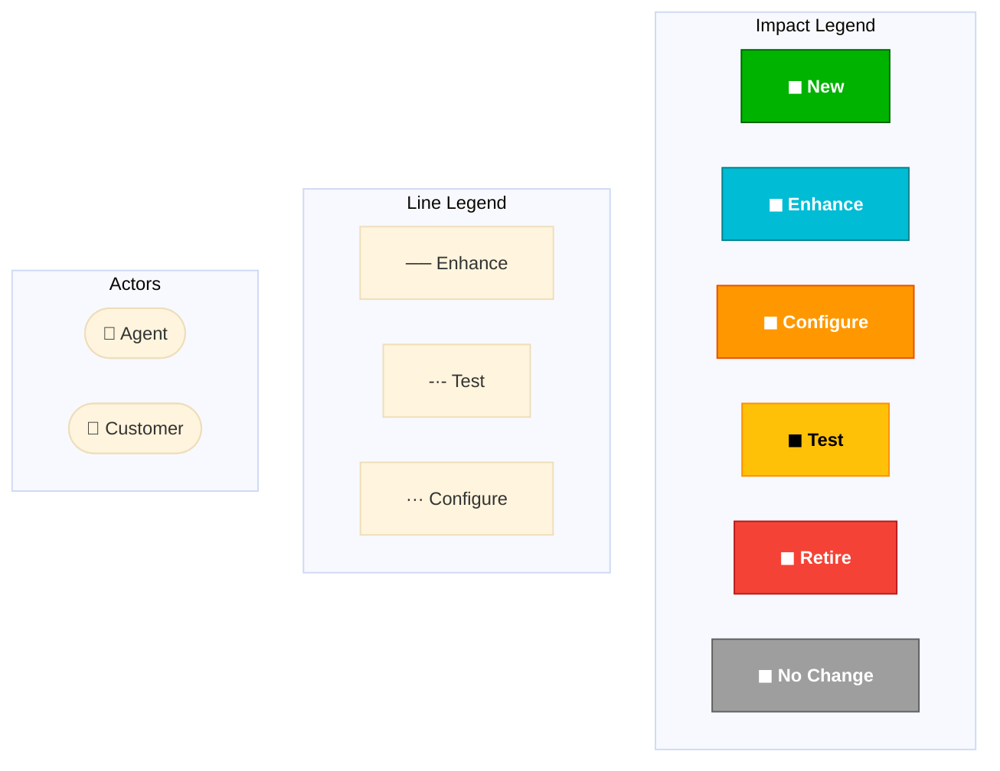

<!-- SI Template – Solution Intent Document Template -->
<!-- Instructions: Replace all {{PLACEHOLDER}} values with project-specific content -->
<!-- Remove any sections that are not applicable and add additional sections as needed -->

<table border="1" style="border-collapse: collapse; width: 100%;">
  <thead>
    <tr>
      <th style="border: 1px solid black; padding: 8px;"></th>
      <th style="border: 1px solid black; padding: 8px;">Solution Intent (SI)</th>
    </tr>
  </thead>
</table>

SI Generated: {{SI_GENERATED_DATE}}

***ATTENTION: This Solution Intent (SI) should be validated by the Solution Architect to ensure requirements are still satisfied, if PI planning or phase 2 implementation begins after {{VALIDATION_EXPIRY_DATE}}***

*It is Strongly encouraged to be reviewed with the Solution Architect if initial SI is being targeted in a later PI/release than initially planned.*

# {{EPIC_ID}} {{PROJECT_NAME}} Solution Intent

Revision History

<table border="1" style="border-collapse: collapse; width: 100%;">
  <thead>
    <tr>
      <th style="border: 1px solid black; padding: 8px;">Author / ATTUID</th>
      <th style="border: 1px solid black; padding: 8px;">Revision Date</th>
      <th style="border: 1px solid black; padding: 8px;">Version</th>
      <th style="border: 1px solid black; padding: 8px;">Revision Description</th>
    </tr>
  </thead>
  <tbody>
    <tr>
      <td style="border: 1px solid black; padding: 8px;">{{AUTHOR_NAME}} {{ATTUID}}</td>
      <td style="border: 1px solid black; padding: 8px;">{{DATE}}</td>
      <td style="border: 1px solid black; padding: 8px;">0.01</td>
      <td style="border: 1px solid black; padding: 8px;">Initial version SI</td>
    </tr>
    <!-- Add additional revision rows as needed -->
  </tbody>
</table>

# Problem Statement

{{PROBLEM_STATEMENT_DESCRIPTION}}

# Contributing Factors

{{CONTRIBUTING_FACTORS_DESCRIPTION}}

## Assumptions, Constraints and Dependencies

<table border="1" style="border-collapse: collapse; width: 100%;">
  <thead>
    <tr>
      <th style="border: 1px solid black; padding: 8px;">A/C/D #</th>
      <th style="border: 1px solid black; padding: 8px;">Description</th>
    </tr>
  </thead>
  <tbody>
    <tr>
      <td style="border: 1px solid black; padding: 8px;">Assumptions</td>
      <td style="border: 1px solid black; padding: 8px;"></td>
    </tr>
    <tr>
      <td style="border: 1px solid black; padding: 8px;">A1</td>
      <td style="border: 1px solid black; padding: 8px;">{{ASSUMPTION_1}}</td>
    </tr>
    <tr>
      <td style="border: 1px solid black; padding: 8px;">A2</td>
      <td style="border: 1px solid black; padding: 8px;">{{ASSUMPTION_2}}</td>
    </tr>
    <!-- Add additional assumption rows as needed -->
    <tr>
      <td style="border: 1px solid black; padding: 8px;">Constraints</td>
      <td style="border: 1px solid black; padding: 8px;"></td>
    </tr>
    <tr>
      <td style="border: 1px solid black; padding: 8px;">C1</td>
      <td style="border: 1px solid black; padding: 8px;">{{CONSTRAINT_1}}</td>
    </tr>
    <!-- Add additional constraint rows as needed -->
    <tr>
      <td style="border: 1px solid black; padding: 8px;">Dependencies</td>
      <td style="border: 1px solid black; padding: 8px;"></td>
    </tr>
    <tr>
      <td style="border: 1px solid black; padding: 8px;">D1</td>
      <td style="border: 1px solid black; padding: 8px;">{{DEPENDENCY_1}}</td>
    </tr>
    <!-- Add additional dependency rows as needed -->
  </tbody>
</table>

## Applications Summary Table

<table border="1" style="border-collapse: collapse; width: 100%;">
  <thead>
    <tr>
      <th style="border: 1px solid black; padding: 8px;">Parent Package</th>
      <th style="border: 1px solid black; padding: 8px;">Impact Type</th>
      <th style="border: 1px solid black; padding: 8px;">MOTS ID</th>
      <th style="border: 1px solid black; padding: 8px;">Application</th>
      <th style="border: 1px solid black; padding: 8px;">IT App Owner</th>
      <th style="border: 1px solid black; padding: 8px;">LoE</th>
    </tr>
  </thead>
  <tbody>
    <tr>
      <td style="border: 1px solid black; padding: 8px;">{{EPIC_ID}} Development</td>
      <td style="border: 1px solid black; padding: 8px;">{{IMPACT_TYPE}}</td>
      <td style="border: 1px solid black; padding: 8px;">{{MOTS_ID}}</td>
      <td style="border: 1px solid black; padding: 8px;">{{APPLICATION_NAME}}</td>
      <td style="border: 1px solid black; padding: 8px;">{{APP_OWNER_ATTUID}}</td>
      <td style="border: 1px solid black; padding: 8px;">{{LOE}}</td>
    </tr>
    <!-- Add additional application rows as needed -->
    <!-- Impact Types: New, Enhance, Configure, Test, Retire, No Change -->
    <!-- LoE Values: Easy, Moderate, Complex, TestSupport, Test -->
    <!-- Parent Package Categories: {{EPIC_ID}} Development, {{EPIC_ID}} Non Development, {{EPIC_ID}} No Impact, {{EPIC_ID}} TBD -->
  </tbody>
</table>

*Group impacts are added automatically via MDE and are not represented in the SI.

## Sequencing Summary Table

<table border="1" style="border-collapse: collapse; width: 100%;">
  <thead>
    <tr>
      <th style="border: 1px solid black; padding: 8px;">Seq #</th>
      <th style="border: 1px solid black; padding: 8px;">Application</th>
      <th style="border: 1px solid black; padding: 8px;">Activity/Action</th>
      <th style="border: 1px solid black; padding: 8px;">Description</th>
    </tr>
  </thead>
  <tbody>
    <tr>
      <td style="border: 1px solid black; padding: 8px;">1</td>
      <td style="border: 1px solid black; padding: 8px;">{{APPLICATION_NAME}}</td>
      <td style="border: 1px solid black; padding: 8px;">{{ACTIVITY}}</td>
      <td style="border: 1px solid black; padding: 8px;">{{DESCRIPTION}}</td>
    </tr>
    <!-- Add additional sequencing rows as needed -->
    <!-- Use "ZZZ" for applications not considered in the sequencing -->
  </tbody>
</table>

*Sequences of "ZZZ" means the application was not considered in the sequencing.
This sequence table understands that this sequence does not cover all acceptance criteria or requirements or all scenarios under epic but covers most common and generic flow to give high level idea.
Actual development sequence should be relied on PI planning exercises.

## Product Team Summary Table

<table border="1" style="border-collapse: collapse; width: 100%;">
  <thead>
    <tr>
      <th style="border: 1px solid black; padding: 8px;">Product Team</th>
      <th style="border: 1px solid black; padding: 8px;">Notes</th>
      <th style="border: 1px solid black; padding: 8px;">MOTS ID</th>
      <th style="border: 1px solid black; padding: 8px;">Application</th>
      <th style="border: 1px solid black; padding: 8px;">Application LoE</th>
    </tr>
  </thead>
  <tbody>
    <tr>
      <td style="border: 1px solid black; padding: 8px;">{{PRODUCT_TEAM}}</td>
      <td style="border: 1px solid black; padding: 8px;">{{APPLICATION_FULL_NAME}} (MOTS ID: {{MOTS_ID}})</td>
      <td style="border: 1px solid black; padding: 8px;">{{MOTS_ID}}</td>
      <td style="border: 1px solid black; padding: 8px;">{{APPLICATION_NAME}}</td>
      <td style="border: 1px solid black; padding: 8px;">{{LOE}}</td>
    </tr>
    <!-- Add additional product team rows as needed -->
  </tbody>
</table>

## Interfaces Summary Table

<table border="1" style="border-collapse: collapse; width: 100%;">
  <thead>
    <tr>
      <th style="border: 1px solid black; padding: 8px;">Source</th>
      <th style="border: 1px solid black; padding: 8px;">Target</th>
      <th style="border: 1px solid black; padding: 8px;">Name</th>
      <th style="border: 1px solid black; padding: 8px;">Type</th>
      <th style="border: 1px solid black; padding: 8px;">Description</th>
      <th style="border: 1px solid black; padding: 8px;">Impact Type</th>
    </tr>
  </thead>
  <tbody>
    <tr>
      <td style="border: 1px solid black; padding: 8px;">{{SOURCE_APP}}</td>
      <td style="border: 1px solid black; padding: 8px;">{{TARGET_APP}}</td>
      <td style="border: 1px solid black; padding: 8px;">{{INTERFACE_NAME}}</td>
      <td style="border: 1px solid black; padding: 8px;">{{INTERFACE_TYPE}}</td>
      <td style="border: 1px solid black; padding: 8px;">{{INTERFACE_DESCRIPTION}}</td>
      <td style="border: 1px solid black; padding: 8px;">{{IMPACT_TYPE}}</td>
    </tr>
    <!-- Add additional interface rows as needed -->
    <!-- Interface Types: mS, Event, DirectLink, API -->
    <!-- Impact Types: Enhance, Test, Configure, New -->
  </tbody>
</table>

*Any Non-Backward compatible api design changes should be flagged for a risk assessment/validation by the api Provider with all api Consumers and SA/AA/SyE

## Requirements Summary Table

<table border="1" style="border-collapse: collapse; width: 100%;">
  <thead>
    <tr>
      <th style="border: 1px solid black; padding: 8px;">NFR</th>
      <th style="border: 1px solid black; padding: 8px;">Name</th>
      <th style="border: 1px solid black; padding: 8px;">Notes</th>
      <th style="border: 1px solid black; padding: 8px;">Apps</th>
    </tr>
  </thead>
  <tbody>
    <tr>
      <td style="border: 1px solid black; padding: 8px;">{{NFR_ID}}</td>
      <td style="border: 1px solid black; padding: 8px;">{{NFR_NAME}}</td>
      <td style="border: 1px solid black; padding: 8px;">{{NFR_NOTES}}</td>
      <td style="border: 1px solid black; padding: 8px;">{{APPS}}</td>
    </tr>
    <!-- Add additional requirements rows as needed -->
  </tbody>
</table>

## {{EPIC_ID}} End to End Solution

<!-- Provide detailed narrative of the end-to-end solution. -->
<!-- Include scenario descriptions, business rules, and process flows. -->
<!-- Add supporting tables as needed for charge codes, business rules, etc. -->

{{END_TO_END_SOLUTION_NARRATIVE}}

<!-- Repeat the following subsection blocks for each scenario/use case -->

### {{SCENARIO_NAME}}

{{SCENARIO_DESCRIPTION}}

<!-- Add scenario-specific tables, business rules, and details here -->

---

##### Reporting and Audit

{{REPORTING_AND_AUDIT_DETAILS}}

##### Future Scope Considerations (not in this EPIC)

- {{FUTURE_SCOPE_ITEM_1}}
- {{FUTURE_SCOPE_ITEM_2}}

### Context - {{EPIC_ID}} {{PROJECT_NAME}}

<!-- Insert Mermaid diagram or image reference for the context diagram -->
<!-- Option 1: Mermaid diagram (interactive) -->

<!-- Option 2: Static image reference -->
<!--  -->

SI Created by: {{AUTHOR_NAME}} on {{CREATION_DATE}}
Modified: {{MODIFIED_DATE}}
Figure: 1

### {{EPIC_ID}} Development

<!-- Repeat the following block for EACH application with Impact Type = Enhance or Configure -->

#### {{APPLICATION_NAME}} {{MOTS_ID}}

{{APPLICATION_FULL_NAME}} (MOTS ID: {{MOTS_ID}})

Tagged Values

<table border="1" style="border-collapse: collapse; width: 100%;">
  <thead>
    <tr>
      <th style="border: 1px solid black; padding: 8px;">Application Name</th>
      <th style="border: 1px solid black; padding: 8px;">App Lifestyle</th>
      <th style="border: 1px solid black; padding: 8px;">App Lifestyle Status</th>
      <th style="border: 1px solid black; padding: 8px;">Impact Type</th>
      <th style="border: 1px solid black; padding: 8px;">LoE</th>
    </tr>
  </thead>
  <tbody>
    <tr>
      <td style="border: 1px solid black; padding: 8px;"></td>
      <td style="border: 1px solid black; padding: 8px;">{{APP_LIFESTYLE}}</td>
      <td style="border: 1px solid black; padding: 8px;">{{APP_LIFESTYLE_STATUS}}</td>
      <td style="border: 1px solid black; padding: 8px;">{{IMPACT_TYPE}}</td>
      <td style="border: 1px solid black; padding: 8px;">{{LOE}}</td>
    </tr>
  </tbody>
</table>

<!-- Include Interfaces table only if the application has interfaces -->

Interfaces

<table border="1" style="border-collapse: collapse; width: 100%;">
  <thead>
    <tr>
      <th style="border: 1px solid black; padding: 8px;">Source</th>
      <th style="border: 1px solid black; padding: 8px;">Target</th>
      <th style="border: 1px solid black; padding: 8px;">Name</th>
      <th style="border: 1px solid black; padding: 8px;">Type</th>
      <th style="border: 1px solid black; padding: 8px;">Description</th>
      <th style="border: 1px solid black; padding: 8px;">Impact Type</th>
    </tr>
  </thead>
  <tbody>
    <tr>
      <td style="border: 1px solid black; padding: 8px;">{{SOURCE_APP}}</td>
      <td style="border: 1px solid black; padding: 8px;">{{TARGET_APP}}</td>
      <td style="border: 1px solid black; padding: 8px;">{{INTERFACE_NAME}}</td>
      <td style="border: 1px solid black; padding: 8px;">{{INTERFACE_TYPE}}</td>
      <td style="border: 1px solid black; padding: 8px;">{{INTERFACE_DESCRIPTION}}</td>
      <td style="border: 1px solid black; padding: 8px;">{{IMPACT_TYPE}}</td>
    </tr>
    <!-- Add additional interface rows as needed -->
  </tbody>
</table>

---

<!-- END of per-application block – repeat for each Development application -->

### {{EPIC_ID}} Non Development

<!-- Repeat the per-application block (Tagged Values + optional Interfaces) for each Non Development application -->
<!-- These typically have Impact Type = Test -->

---

### {{EPIC_ID}} No Impact

<!-- Repeat the per-application block for each No Impact application -->

---

### {{EPIC_ID}} TBD

<!-- List any applications that are still To Be Determined -->

## Epic#{{RELATED_EPIC_ID}} End to End Solution

<!-- If additional related EPICs exist, repeat the End to End Solution structure -->

## Solution Details

### Agent

<!-- Agent channel solution details -->

---

### Customer

<!-- Customer channel solution details -->

---

### Epic#{{RELATED_EPIC_ID}} No Impact

<!-- Repeat per-application blocks for related EPIC No Impact applications -->

---

### Epic#{{RELATED_EPIC_ID}} TBD

<!-- List any TBD applications for related EPIC -->

## Issues Log

# Log (Optional issues and information for tracking purposes)

<table border="1" style="border-collapse: collapse; width: 100%;">
  <thead>
    <tr>
      <th style="border: 1px solid black; padding: 8px;">No.</th>
      <th style="border: 1px solid black; padding: 8px;">Date</th>
      <th style="border: 1px solid black; padding: 8px;">Log Title (Short Title)</th>
      <th style="border: 1px solid black; padding: 8px;">Description (Chronologically list the activities with dates)</th>
      <th style="border: 1px solid black; padding: 8px;">Notes</th>
    </tr>
  </thead>
  <tbody>
    <tr>
      <td style="border: 1px solid black; padding: 8px;"></td>
      <td style="border: 1px solid black; padding: 8px;"></td>
      <td style="border: 1px solid black; padding: 8px;"></td>
      <td style="border: 1px solid black; padding: 8px;"></td>
      <td style="border: 1px solid black; padding: 8px;"></td>
    </tr>
    <!-- Add additional log rows as needed -->
  </tbody>
</table>
