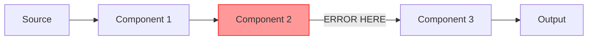

User input: $ARGUMENTS

## Behavioral Rules

> **CRITICAL: This workflow diagnoses failing tests in the TDD Red-Green cycle. Its goal is to understand WHY a test is not passing and guide the implementation to reach Green.**
>
> - **TDD CONTEXT:** A failing test is the expected initial state (Red). This workflow identifies whether the failure is due to: (a) a correct failing test and missing implementation, (b) a test assertion error, (c) a test setup/configuration issue, or (d) a genuine defect in existing code.
> - **ALWAYS** present a structured Debug Plan FIRST showing: identified failing tests, root cause hypothesis, affected components, data flows, and proposed fixes.
> - **WAIT for user confirmation** of the plan before modifying any code or configurations.
> - If the user just asks "what's wrong?" or "analyze this error", present ONLY the analysis and plan — do not apply fixes.
> - The debug plan must include a component table mapping each affected area to the appropriate TDD pattern from the catalog below.
> - If the user wants to compare alternative debug approaches, direct them to use the `tdd-compare` workflow instead.
> - If the user wants to refactor code rather than fix test failures, direct them to use the `tdd-refactor` workflow instead.

## Execution Steps

### 0. Environment Setup

**Validate Environment:**
Check that the following are available:
- Git command is installed (for version control)
- Text editor or IDE
- Basic command-line tools
- Access to logs and error messages

If any validation fails, halt the workflow and report the missing requirements.

### 1. Parse Input

Extract from $ARGUMENTS:
- Error description and symptoms
- Affected components
- Solution architecture overview
- When the error occurs (timing, conditions)
- Error messages or stack traces

### 2. Infer Context from User's Assets

**Before analyzing the problem, understand the user's context.**

**If user references a PROJECT or DIRECTORY:**
```
Analyze directory structure to infer composition:
- Look for package.json, requirements.txt, pom.xml → Application type
- Look for .tf, terraform/ → Infrastructure as Code
- Look for .py + mlflow/, model/ → ML/Data Science
- Look for Dockerfile, helm/, k8s/ → Container/Kubernetes
- Look for .sql, dbt_project.yml → Data Engineering
- Look for airflow/, dags/ → Orchestration
- Look for tests/, pytest.ini → Testing focus
- Look for manifest.yaml + constitution.md → Archetype

Generate context description:
"Project composition: {inferred_type} with {key_technologies}"
```

**If user references a FILE:**
```
Analyze file to infer purpose:
- .py → Python (check imports for framework: fastapi, pyspark, sklearn, etc.)
- .sql → SQL queries
- .tf → Terraform infrastructure
- .tsx/.jsx → React frontend
- .yaml/.yml → Configuration (check content: k8s, airflow, etc.)
- .sh/.bash → Automation scripts
- .md → Documentation
- .log → Log files

Generate context description:
"File type: {extension}, Purpose: {inferred_purpose}, Framework: {detected_framework}"
```

**Build Augmented Analysis:**
```
${AUGMENTED_ANALYSIS} = "${CONTEXT_DESCRIPTION}. Error: $ARGUMENTS"
```

### 3. Analyze Problem Across Components

**Identify Affected Component Types:**

Match error symptoms and affected areas to component types using keyword analysis:

1. **Score each component** against the error context using this process:
   - **Exact name match** in query → +50 points
   - **Display name match** in query → +30 points
   - **Keyword match** (exact) → +10 points per keyword
   - **Keyword partial match** (hyphenated sub-word) → +3 points per partial
   - **Description word overlap** (words ≥4 chars) → +2 points per shared word
   - **File context keyword match** (if file provided) → +5 points per keyword

   Select all components scoring > 0 and rank by score descending.

2. **Match component keywords** to determine affected component types:

   | Domain | Keywords |
   |--------|----------|
   | TDD cycle | TDD, test-driven, red-green-refactor, failing-test, red, green, refactor |
   | Unit testing | unit, test, assertion, isolate, arrange-act-assert, spy, fake |
   | Integration testing | integration, service-test, API-test, component-interaction, in-process |
   | BDD | BDD, behavior, gherkin, cucumber, given-when-then, scenario, feature, step-definition |
   | ATDD | ATDD, acceptance, acceptance-criteria, FitNesse, robot-framework, end-to-end |
   | Contract testing | contract, pact, consumer-driven, provider, API-contract, schema-contract, Dredd |
   | Property testing | property-based, hypothesis, invariant, generative, fuzzing, shrinking, QuickCheck |
   | Mocking & doubles | mock, stub, spy, double, test-double, mockito, sinon, unittest.mock, WireMock |
   | Test frameworks | pytest, JUnit, jest, Vitest, mocha, NUnit, Jasmine, RSpec, Spock |
   | Test coverage | coverage, branch-coverage, line-coverage, mutation, threshold, lcov, jacoco |
   | Frontend testing | React, component-test, render, user-event, DOM, snapshot, Testing-Library |
   | Backend API testing | route, endpoint, HTTP, inject, fastify.inject, supertest, httpx, MockMvc |
   | Data testing | pipeline, schema, data-quality, dbt-test, great-expectations, pandera, deequ |
   | ML testing | model-evaluation, metric-threshold, accuracy, drift, deep-checks, evidently |
   | Performance testing | load-test, stress, benchmark, latency, throughput, k6, locust, JMeter |
   | Security testing | security, OWASP, vulnerability, injection, auth-test, penetration |
   | CI/CD quality gate | CI, CD, coverage-gate, quality-gate, lint, build-check, pre-commit |
   | Test documentation | test-strategy, test-plan, coverage-report, living-docs, spec |
   | Frontend | UI, frontend, React, Vue, Angular, web app, SPA, SSR |
   | Backend API | API, REST, GraphQL, backend, service, endpoint, FastAPI |
   | Full-stack app | application, app, web, fullstack, maker |
   | Database/SQL | SQL, database, query, schema, data store, Snowflake, CTE |
   | Infrastructure | deploy, infrastructure, Kubernetes, container, cloud, Terraform, IaC |
   | Documentation | document, docs, guide, readme, release notes, changelog |

3. **Match to common solution patterns** (see below)

**Common TDD Patterns:**

**Pattern: Classic TDD (Inside-Out)**
- Approach: Red → Green → Refactor starting from the smallest failing unit test
- Components: unit-test-code-coverage, code-reviewer, regression-test-coverage, quality-guardian
- Keywords: unit, assert, arrange-act-assert, isolated, pure-function, logic
- Debug focus: Assertion failures, unexpected return values, missing edge-case coverage, incorrect mock setup

**Pattern: Outside-In TDD (London School)**
- Approach: Write failing acceptance test → mock collaborators → drive unit tests inward
- Components: unit-test-code-coverage, regression-test-coverage, integration-specialist, code-reviewer
- Keywords: mock, stub, outside-in, acceptance, London, top-down, collaborator
- Debug focus: Mock interaction failures, interface contract violations, unexpected call counts, acceptance test gaps

**Pattern: BDD (Behavior Driven Development)**
- Approach: Given/When/Then scenarios → step definitions → implementation → living docs
- Components: unit-test-code-coverage, regression-test-coverage, documentation-evangelist, jira-user-stories
- Keywords: BDD, gherkin, cucumber, given-when-then, scenario, feature, step-definition
- Debug focus: Step definition mismatches, ambiguous Gherkin steps, scenario context failures, pending steps

**Pattern: ATDD (Acceptance Test Driven Development)**
- Approach: Acceptance criteria from tickets → automate as tests → implement to pass
- Components: regression-test-coverage, jira-user-stories, documentation-evangelist, unit-test-code-coverage, quality-guardian
- Keywords: ATDD, acceptance, criteria, FitNesse, robot-framework, end-to-end
- Debug focus: End-to-end test flakiness, environment setup failures, criteria automation gaps, test data problems

**Pattern: Contract-First TDD**
- Approach: Define API contract → consumer tests → provider verification → implementation
- Components: integration-specialist, unit-test-code-coverage, documentation-evangelist, aks-devops-deployment
- Keywords: contract, pact, consumer-driven, provider, API-contract, Dredd, Prism
- Debug focus: Contract broker failures, provider verification errors, schema mismatches, consumer test breakages

**Pattern: Property-Based TDD**
- Approach: Define invariants and properties → auto-generate inputs → shrink failures → fix
- Components: unit-test-code-coverage, quality-guardian, data-validation, interpretability-analyst
- Keywords: property-based, hypothesis, invariant, generative, fuzzing, shrinking, QuickCheck
- Debug focus: Shrunk counter-examples, invariant violations, generator failures, property definition errors

**Pattern: TDD for Data Pipelines**
- Approach: Write schema/contract tests → pipeline unit tests → integration tests
- Components: unit-test-code-coverage, quality-guardian, data-pipeline-builder, transformation-alchemist, data-validation
- Keywords: pipeline, schema, data-quality, dbt-test, great-expectations, pandera, deequ
- Debug focus: Schema mismatch failures, transformation assertion errors, null-handling bugs, data drift detection

**Pattern: TDD for ML Models**
- Approach: Define metric thresholds → evaluation test harness → train until tests pass
- Components: unit-test-code-coverage, language-model-evaluation, model-architect, quality-guardian
- Keywords: model-evaluation, metric-threshold, accuracy, drift, deep-checks, evidently, mlflow
- Debug focus: Threshold violation failures, evaluation pipeline errors, training instability, feature drift detection

4. **Error Pattern Recognition:**
   - Connection errors → Database, API, Infrastructure
   - Schema errors → Data transformation, Data quality
   - Performance issues → Database, Infrastructure, ML inference
   - Authentication errors → Backend API, Infrastructure
   - Data validation errors → Data quality, Data transformation
   - Deployment errors → Infrastructure, Orchestration
   - Model errors → ML training, ML inference
   - UI errors → Frontend
   - Integration errors → Multiple components

**Root Cause Analysis:**

For each affected component type:

1. **Examine Error Symptoms:**
   - What is the exact error message?
   - When does it occur?
   - Is it consistent or intermittent?
   - What changed recently?

2. **Check Component Health:**
   - Is the component running?
   - Are resources available (CPU, memory, disk)?
   - Are dependencies accessible?
   - Are configurations correct?

3. **Verify Component Inputs:**
   - Is input data in expected format?
   - Are input parameters valid?
   - Are upstream components working?

**Data Flow Tracing:**

Track data through the system:

1. **Identify Data Source:**
   - Where does the data originate?
   - What format is it in?
   - Is the source accessible?

2. **Trace Transformation Stages:**
   - Component 1 → Component 2 → ... → Error Point
   - What transformations occur at each stage?
   - Where does the data deviate from expectations?

3. **Check Integration Points:**
   - Are contracts between components honored?
   - Are data formats consistent?
   - Are APIs responding correctly?
   - Are message queues flowing?

**Dependency Analysis:**

Verify system dependencies:

1. **Component Versions:**
   - Are all components at compatible versions?
   - Were any recent upgrades made?
   - Are dependencies up to date?

2. **Configuration Consistency:**
   - Are environment variables set correctly?
   - Are configuration files in sync?
   - Are secrets accessible?
   - Are feature flags consistent?

3. **Contract Validation:**
   - Do API contracts match between services?
   - Are data schemas compatible?
   - Are message formats consistent?
   - Are authentication mechanisms aligned?

### 4. Present Debug Plan (MANDATORY)

> **REQUIRED: Present this plan and WAIT for user confirmation before applying any fixes.**

Present the following debug plan to the user:

**Debug Plan:**

| # | Affected Area | Component | Category | Root Cause Hypothesis | Severity |
|---|--------------|-----------|----------|----------------------|----------|
| 1 | {area_1} | {matched_component} | {category} | {hypothesis} | Critical/High/Medium/Low |
| 2 | {area_2} | {matched_component} | {category} | {hypothesis} | Critical/High/Medium/Low |
| ... | ... | ... | ... | ... | ... |

**Matched Solution Pattern:** {pattern_name}

**Root Cause Analysis Summary:**
- Primary cause: {root_cause}
- Contributing factors: {factors}
- Impact scope: {scope}

**Data Flow Diagram (with error point):**


**Proposed Fixes:**
- Fix 1: {component} — {description}
- Fix 2: {component} — {description}
- Fix 3: {integration} — {description}

**Risk Assessment:**
- Breaking changes: Yes/No
- Estimated effort: {hours}
- Rollback strategy: {approach}

> **Ask the user:** "Here is the debug plan with root cause analysis. Shall I proceed with applying the fixes, or would you like to adjust the scope or investigate further?"

**STOP HERE and wait for user confirmation before proceeding to Step 5.**

### 5. Generate Fixes

**Component-Level Fixes:**

For each affected component type, generate appropriate fixes:

**Data Ingestion Component Fixes:**
- Fix connection strings and credentials
- Adjust retry logic and timeouts
- Update schema mappings
- Add error handling for malformed data
- Implement incremental loading fixes

**Data Transformation Component Fixes:**
- Correct transformation logic
- Fix schema mismatches
- Optimize performance bottlenecks
- Add null handling
- Fix data type conversions

**Data Quality Component Fixes:**
- Update validation rules
- Adjust quality thresholds
- Fix assertion logic
- Add missing checks
- Update expected schemas

**ML Training Component Fixes:**
- Fix feature engineering bugs
- Correct hyperparameters
- Update training data paths
- Fix experiment tracking
- Resolve model versioning issues

**ML Inference Component Fixes:**
- Update model loading logic
- Fix preprocessing steps
- Correct prediction logic
- Update API contracts
- Fix batch processing

**Frontend Component Fixes:**
- Fix API integration
- Correct state management
- Update component logic
- Fix routing issues
- Resolve styling problems

**Backend API Component Fixes:**
- Fix endpoint logic
- Update authentication
- Correct database queries
- Fix error handling
- Update API documentation

**Database Component Fixes:**
- Optimize slow queries
- Fix schema issues
- Update indexes
- Correct connection pooling
- Fix transaction logic

**Orchestration Component Fixes:**
- Fix DAG dependencies
- Update scheduling
- Correct task parameters
- Fix retry logic
- Update workflow definitions

**Infrastructure Component Fixes:**
- Fix deployment configurations
- Update resource limits
- Correct health checks
- Fix networking issues
- Update scaling policies

**Monitoring Component Fixes:**
- Add missing metrics
- Fix alert thresholds
- Update log collection
- Correct dashboard queries
- Fix trace propagation

**Integration-Level Fixes:**

Address cross-component issues:

1. **Update Contracts:**
   - Align API schemas between services
   - Update message formats
   - Synchronize data models
   - Document contract changes

2. **Add Error Handling:**
   - Implement circuit breakers
   - Add retry mechanisms
   - Include fallback logic
   - Add timeout handling
   - Implement graceful degradation

3. **Improve Communication:**
   - Add request/response validation
   - Implement proper error propagation
   - Add correlation IDs for tracing
   - Include detailed error messages

### 6. Implement Fixes

**Implementation Steps:**

1. **Create Fix Branch:**
   ```bash
   git checkout -b fix/[issue-description]
   ```

2. **Apply Component Fixes:**
   - Make code changes
   - Update configurations
   - Modify infrastructure
   - Update documentation

3. **Test Fixes:**
   - Run unit tests
   - Run integration tests
   - Test in staging environment
   - Verify error is resolved

4. **Deploy Fixes:**
   - Deploy to staging first
   - Monitor for issues
   - Deploy to production
   - Monitor production metrics

### 7. Add Recommendations

**Prevention Measures:**

1. **Monitoring Improvements:**
   - Add metrics for early detection
   - Create alerts for similar issues
   - Implement health checks
   - Add distributed tracing
   - Improve log aggregation

2. **Test Coverage Gaps:**
   - Add unit tests for fixed code
   - Create integration tests for data flow
   - Add regression tests
   - Implement contract testing
   - Add performance tests

3. **Documentation Updates:**
   - Document the issue and fix
   - Update architecture diagrams
   - Add troubleshooting guide
   - Update runbooks
   - Document lessons learned

4. **Process Improvements:**
   - Add code review checklist items
   - Update deployment procedures
   - Improve change management
   - Add validation gates
   - Enhance monitoring dashboards

**Long-term Recommendations:**

1. **Architecture Improvements:**
   - Consider adding redundancy
   - Implement better error isolation
   - Add circuit breakers
   - Improve observability
   - Enhance resilience

2. **Development Practices:**
   - Implement contract testing
   - Add chaos engineering
   - Improve CI/CD pipeline
   - Enhance testing strategy
   - Add performance benchmarks

3. **Operational Excellence:**
   - Create incident response playbooks
   - Improve on-call procedures
   - Add automated remediation
   - Enhance monitoring coverage
   - Implement SLOs/SLIs

### 8. Validate and Report

**Validation Checks:**

1. **Error Resolution:**
   - Verify the original error is fixed
   - Confirm no new errors introduced
   - Check all affected components are healthy
   - Validate data flow is correct

2. **Performance Validation:**
   - Verify performance is acceptable
   - Check resource utilization
   - Confirm latency is within SLAs
   - Validate throughput is adequate

3. **Integration Validation:**
   - Test all integration points
   - Verify contracts are honored
   - Check error handling works
   - Validate monitoring is functioning

**Report Generation:**

```
✓ Debug Complete

Issue: {original_error_description}

Root Cause: {identified_root_cause}

Affected Components: {count}
{list of component types and specific issues}

Fixes Applied: {count}
{list of fixes with component and description}

Testing: {test_results}
- Unit tests: {passed/total}
- Integration tests: {passed/total}
- Manual verification: {status}

Recommendations:
1. Monitoring: {monitoring_improvements}
2. Testing: {test_coverage_gaps}
3. Documentation: {documentation_updates}
4. Prevention: {prevention_measures}

Next Steps:
1. Monitor production metrics for 24-48 hours
2. Update incident documentation
3. Share lessons learned with team
4. Implement prevention recommendations
```

## Examples

**Example 1: Data Pipeline Failure**
```
User: /tdd-debug Data quality check failing after Spark transformation

Analysis:
- Error Pattern: Data validation errors
- Component 1: Data transformation (Spark) - Schema mismatch detected
- Component 2: Data quality - Validation rules expecting old schema

Root Cause:
- Spark transformation updated to add new column
- Quality validation rules not updated to match new schema

Fixes Applied:
1. Data Transformation: Updated schema documentation
2. Data Quality: Updated validation rules to include new column
3. Integration: Added schema compatibility test

Recommendations:
- Add schema evolution testing to CI/CD
- Implement contract testing between transformation and quality
- Add alerts for schema mismatches
- Document schema change process
```

**Example 2: ML Model Inference Failure**
```
User: /tdd-debug Model inference endpoint returning 500 errors

Analysis:
- Error Pattern: ML inference errors, performance issues
- Component 1: ML inference - Model loading timeout
- Component 2: Infrastructure - Insufficient memory allocation

Root Cause:
- New model version is larger than previous
- Container memory limit not updated
- Model loading exceeds timeout threshold

Fixes Applied:
1. Infrastructure: Increased container memory from 2GB to 4GB
2. ML Inference: Increased model loading timeout from 30s to 60s
3. Monitoring: Added memory utilization alerts

Recommendations:
- Add model size validation in CI/CD
- Implement model performance testing before deployment
- Create runbook for model deployment
- Add automated resource scaling based on model size
```

**Example 3: Frontend-Backend Integration Issue**
```
User: /tdd-debug React app showing "undefined" for user data

Analysis:
- Error Pattern: Frontend errors, API integration
- Component 1: Backend API - Changed response format
- Component 2: Frontend - Expecting old response format

Root Cause:
- Backend API updated to nest user data under "data" key
- Frontend still accessing user data at root level
- No contract testing between frontend and backend

Fixes Applied:
1. Backend API: Added API versioning (v1 maintains old format, v2 has new format)
2. Frontend: Updated to use v2 API with new format
3. Integration: Added contract tests using Pact

Recommendations:
- Implement API versioning strategy
- Add contract testing to CI/CD
- Document API changes in changelog
- Add deprecation warnings for old API versions
- Create API migration guide
```

**Example 4: Database Connection Pool Exhaustion**
```
User: /tdd-debug Application intermittently failing with "connection timeout" errors

Analysis:
- Error Pattern: Database errors, connection issues, intermittent
- Component 1: Backend API - Not closing database connections
- Component 2: Database - Connection pool exhausted
- Component 3: Infrastructure - Connection pool size too small

Root Cause:
- Database connections not properly closed in error scenarios
- Connection pool size (10) too small for load
- No monitoring on connection pool utilization

Fixes Applied:
1. Backend API: Fixed connection leak in error handling paths
2. Database: Increased connection pool size from 10 to 50
3. Infrastructure: Added connection pool monitoring
4. Monitoring: Added alerts for connection pool > 80% utilization

Recommendations:
- Add connection leak detection in testing
- Implement connection pool health checks
- Add load testing to CI/CD
- Create runbook for connection pool issues
- Review all database access patterns for proper cleanup
```

---

## Component Catalog Reference

Complete inventory of 72 components organized by category. Use this for discovery and keyword matching.

### ML Models (11)
| Component | Keywords |
|-----------|----------|
| clustering-ml-models | clustering, databricks, delta, governance, mlflow, models, notebook, scala, validation |
| collaborative-filtering-model | collaborative, filtering, governance, databricks, delta, devops, mlflow, model |
| dbscan-model | dbscan, model, monitoring, notebook, observability, python |
| forecasting-analyst | forecasting, analyst, databricks, delta, devops, governance, mlflow, monitoring |
| gradient-boosted-trees | gradient, boosted, trees, governance, lightgbm, mlflow, monitoring, validation, xgboost |
| isolation-forest-model | isolation, forest, model, monitoring, notebook, python, rest |
| logistic-regression-specialist | logistic, regression, databricks, devops, governance, mlflow, monitoring, notebook, observability |
| neural-network-model | neural, network, model, governance, mlflow, monitoring, numpy, observability, python |
| q-learning-model | q-learning, learning, model, numpy, observability, python, scala, validation |
| random-forest-model | random, forest, model, delta, governance, mlflow, monitoring, python, rest |
| siamese-neural-network | siamese, neural, network, mlflow, observability, rest, scala, validation |

### ML Operations (8)
| Component | Keywords |
|-----------|----------|
| experiment-scientist | experiment, scientist, databricks, delta, devops, governance, mlflow, monitoring |
| feature-architect | feature, architect, store, databricks, delta, devops, engineering, governance, point-in-time, training-data |
| inference-orchestrator | inference, orchestrator, aks, deployment, devops, endpoint, helm, kafka, prediction, serving |
| interpretability-analyst | interpretability, analyst, compliance, mlflow, notebook |
| language-model-evaluation | language, model, evaluation, LLM, grader, monitoring, testing, validation |
| model-architect | model, architect, experiment, feature, governance, hyperparameter, mlflow, monitoring, training |
| model-ops-steward | model-ops, steward, aks, lifecycle, compliance, databricks, delta, devops, governance, mlflow |
| insight-reporter | insight, reporter, performance, narratives, KPI, notebook, observability |

### Data Engineering (10)
| Component | Keywords |
|-----------|----------|
| data-pipeline-builder | pipeline, builder, data, databricks, delta, ingestion, loading, batch, incremental, streaming, python, scala |
| data-tdd-architect | data, solution, architect, airflow, databricks, governance, python, rest, scala |
| data-sourcing-specialist | data, sourcing, specialist, databricks, delta, governance, notebook, python |
| databricks-developer-workflow | databricks, developer, workflow, jupyter, monitoring, notebook, devops |
| databricks-workflow-creator | databricks, workflow, creator, delta, devops, governance, kafka, mlflow |
| eda-navigator | eda, navigator, exploratory, analysis, databricks, delta, devops, governance, mlflow |
| elasticsearch-stream | elasticsearch, stream, eventhub, databricks, jupyter, notebook, python |
| pipeline-orchestrator | pipeline, orchestrator, airflow, cron, dag, orchestration, scheduling, task, tws, workflow |
| sql-query-crafter | sql, query, crafter, cte, database, governance, join, select, snowflake, testing |
| transformation-alchemist | transformation, alchemist, data-quality, databricks, dataframe, delta, etl, pyspark, python, scala, spark, sql |

### Data Governance (6)
| Component | Keywords |
|-----------|----------|
| data-classification-policy | data, classification, policy, compliance, governance, monitoring, security, PII, SPI |
| data-reliability | data, reliability, availability, freshness, quality, latency, lineage, governance, monitoring, observability |
| data-security | data, security, encryption, SPI, retention, masking, compliance, governance, observability |
| data-validation | data, validation, complete, accurate, timely, consistent, contract, governance |
| quality-guardian | quality, guardian, data-quality, deequ, delta, great-expectations, pandas, python, scala, testing, threshold, validation |
| ai-ethics-advisor | ethics, advisor, compliance, governance, monitoring, security, testing, bias, fairness |

### Infrastructure & DevOps (9)
| Component | Keywords |
|-----------|----------|
| aks-devops-deployment | aks, deployment, CI/CD, container, devops, docker, fastapi, governance, helm, kubernetes, microservice |
| automation-scripter | automation, scripter, CI/CD, compliance, governance, monitoring, security, testing |
| container-tdd-architect | container, docker, dockerfile, podman, multi-stage, health-check, lifecycle, process-supervision, resource-limits |
| dev-ops-engineer | devops, engineer, governance, observability, ops, security, validation |
| key-vault-config-steward | key-vault, config, steward, airflow, fastapi, governance, observability, secrets |
| microservice-cicd-architect | microservice, CI/CD, compliance, devops, governance, observability, security |
| observability | observability, traces, metrics, logs, monitoring, opentelemetry, fastapi, python, react, telemetry |
| performance-tuner | performance, tuner, bottleneck, optimization, profiling, spark, tuning |
| terraform-cicd-architect | terraform, CI/CD, infrastructure, IaC, compliance, drift, governance, monitoring, policy, security |

### Application Development (7)
| Component | Keywords |
|-----------|----------|
| app-maker | app, application, maker, backend, fastapi, frontend, python, react, rest, security, UI, web |
| backend-only | backend, API, aks, docker, fastapi, helm, kubernetes, devops |
| demo-producer | demo, producer, playwright, python, react, testing, validation |
| frontend-only | frontend, react, security, testing, validation |
| integration-specialist | integration, specialist, fastapi, graphql, python, rest, security |
| ppt-maker | ppt, maker, powerpoint, python, presentation, slides |
| streamlit-developer | streamlit, developer, pandas, python, sql, data-app, validation |

### Graph Analytics (3)
| Component | Keywords |
|-----------|----------|
| general-graph-ontology | graph, ontology, general, databricks, delta, governance, monitoring, pyspark, security, spark |
| graph-community-detection | graph, community, detection, databricks, delta, governance, kafka, mlflow |
| ontology-engineer | ontology, engineer, RelationalAI, Snowflake, jupyter, monitoring, notebook, python |

### Software Quality (10)
| Component | Keywords |
|-----------|----------|
| code-reviewer | code-review, reviewer, snowflake, sql, python, tws, databricks, quality-gate, security |
| git-secret-remediation | git, secret, remediation, compliance, security, testing |
| java-library-upgrade | java, library, upgrade, dependency |
| java-security-vulnerability | java, security, vulnerability, CVE |
| pub-sub-load-testing | pub-sub, load, testing, kafka, validation |
| pull-review-risk | pull, review, risk, compliance, governance, monitoring, security |
| python-library-upgrade | python, library, upgrade, dependency, pip, poetry |
| python-security-vulnerability | python, security, vulnerability, CVE |
| regression-test-coverage | regression, test, coverage, automation, quality-assurance |
| unit-test-code-coverage | unit, test, coverage, java, validation |

### Documentation & Requirements (4)
| Component | Keywords |
|-----------|----------|
| documentation-evangelist | documentation, evangelist, compliance, databricks, governance, notebook, pandas, python, testing |
| jira-user-stories | jira, user, stories, acceptance-criteria, requirements, backlog |
| notebook-collaboration-coach | notebook, collaboration, coach, jupyter, jupytext, reproducibility |
| software-release-notes | release, notes, software, changelog, sprint, jira |

### Meta & Specialized (4)
| Component | Keywords |
|-----------|----------|
| archetype-architect | archetype, meta, template, generator, constitution, workflow, scaffold, quality, standard, ecosystem |
| impact-analyzer | impact, analyzer, databricks, python, scala, sql, testing |
| parallel-agent | parallel, agent, docker, python, scala, security, sql, testing |
| responsible-prompting | responsible, prompting, prompt, safety, compliance, governance, LLM |

---

## Required Output Structure

Every response from this workflow MUST contain the following sections:

1. **Debug Plan** (MANDATORY, before any fixes)
   - Component table mapping affected areas to specific components from the catalog
   - Matched solution pattern name
   - Root cause analysis summary
   - Data flow diagram with error point (Mermaid)
   - Proposed fixes and risk assessment
   - Confirmation prompt to user

2. **Applied Fixes** (only after user confirms the plan)
   - Component-level fixes
   - Integration-level fixes
   - Cross-cutting improvements

3. **Validation & Testing**
   - Error resolution verification
   - Performance validation
   - Integration validation

4. **Debug Report**
   - Issue summary, root cause, fixes applied
   - Test results and recommendations
   - Prevention measures and next steps

If the user only asks "what's wrong?" or "analyze this error", present ONLY section 1 and stop.

## Notes

- **Always present the debug plan first — never jump straight to applying fixes.**
- This workflow is completely standalone and does not depend on external files, scripts, or directory structures
- Component discovery uses inline keyword matching against the embedded catalog above
- Fixes should address both immediate issues and root causes
- All fixes should be tested thoroughly before production deployment
- Documentation and monitoring improvements are critical for preventing recurrence
- For comparing alternative debug approaches, use the `tdd-compare` workflow
- For refactoring code rather than fixing bugs, use the `tdd-refactor` workflow
- The component catalog contains 72 components across 10 categories — use it as a lookup reference
