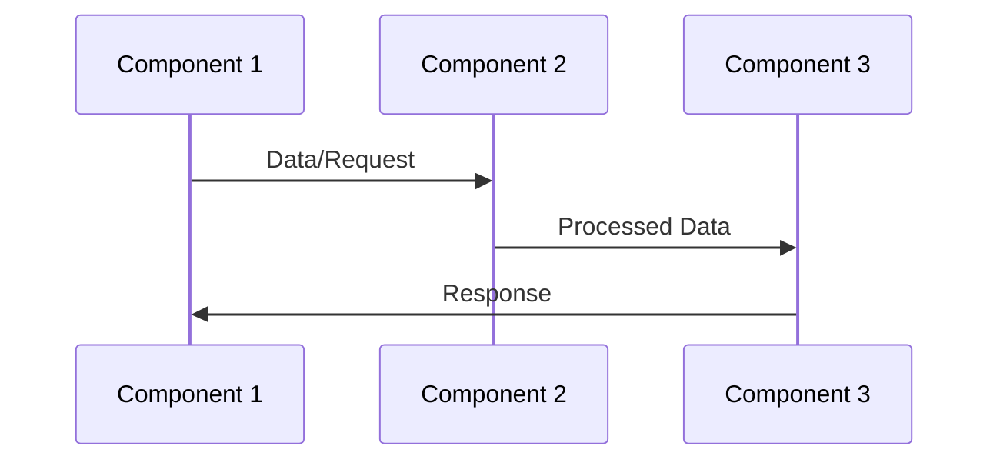

User input: $ARGUMENTS

## Behavioral Rules

> **CRITICAL: This workflow MUST present a Documentation Plan before generating any documentation files.**
>
> - **ALWAYS** present a structured documentation plan FIRST showing: identified components, documentation types to generate, structure overview, and target audiences.
> - **WAIT for user confirmation** of the plan before generating documentation files.
> - If the user just asks "what would you document?" or "show me the plan", present ONLY the plan — do not generate documentation files.
> - The documentation plan must include a component table mapping each solution element to a specific component from the catalog below.
> - **If NO arguments are provided**, auto-detect the project type from the workspace, then default to generating `PROJECT_STRUCTURE_AND_CONVENTIONS.md` with full project structure, naming conventions, and code quality standards for the detected stack.
> - **Whenever generating documentation for project structure and naming conventions**, the output file MUST be named `PROJECT_STRUCTURE_AND_CONVENTIONS.md` — never use any other filename for this purpose.
> - **TOTALLY ignore the `.koda/` folder and all of its contents** during workspace analysis, context inference, component discovery, file scanning, and documentation generation. Treat `.koda/**` as out of scope and never use it as project evidence, a source of truth, or documentation input.
> - If the user wants to compare alternative documentation approaches, direct them to use the `tdd-compare` workflow instead.
> - If the user wants to scaffold code before documenting, direct them to use the `tdd-scaffold` workflow instead.

### Existing Project vs. New Project Rules

> **CRITICAL: Determine whether the workspace contains an existing project or is a new (greenfield) project BEFORE generating any documentation or folders.**

**Existing Project:**
- If the workspace already contains source code, `package.json`, `requirements.txt`, configuration files, or an established directory structure → treat it as an **existing project**.
- **DO NOT create new `frontend/` or `backend/` folders.** Document what already exists — detect the actual technology stack, directory layout, naming patterns, and conventions in use.
- Generate `PROJECT_STRUCTURE_AND_CONVENTIONS.md` that reflects the **real, existing** structure and conventions. Do not impose a new structure on an existing codebase.
- Place documentation in the project's existing `docs/` folder (or create `docs/` at the project root if none exists).

**New Project (Greenfield):**
- If the workspace is empty or the user explicitly states this is a new project → treat it as a **new project**.
- **Create the required project folders** based on the project scope:
  - **Full-stack (frontend + backend):** Create both `frontend/` and `backend/` directories at the workspace root.
  - **Frontend only:** Create a `frontend/` directory at the workspace root.
  - **Backend only:** Create a `backend/` directory at the workspace root.
- Generate `PROJECT_STRUCTURE_AND_CONVENTIONS.md` in each folder's `docs/` subdirectory with the prescribed structure and conventions.

### Default Technology Stack (When No Language/Framework Is Specified)

> **If the user does not specify a language or framework, apply these defaults:**

| Scope | Default Stack |
|-------|---------------|
| **Frontend** | React 18+ · Vite · TypeScript (strict mode) |
| **Backend** | Fastify · TypeScript · MongoDB (via Mongoose) · @fastify/swagger for API docs |
| **Database** | MongoDB |
| **API Documentation** | Swagger (via `@fastify/swagger` + `@fastify/swagger-ui`) |

- If the user explicitly chooses a different framework/language, use their choice instead of the defaults.
- For existing projects, detect and document the **actual** stack — do not override with defaults.

### HTTP Service Rules (Frontend)

> **CRITICAL: All HTTP communication from the frontend to the backend MUST go through a single custom `httpService` utility.**

- **NO external HTTP libraries** (no Axios, no ky, no got, no superagent). Use the **native `fetch` API** exclusively.
- The custom `httpService` (`src/services/httpService.ts`) wraps `fetch` and provides:
  - A configurable `BASE_URL` read from the environment variable `VITE_API_BASE_URL`.
  - Typed helper methods: `get<T>`, `post<T>`, `put<T>`, `patch<T>`, `delete<T>`.
  - Centralized error handling, request/response interceptors, and auth-header injection.
  - Content-Type defaults (`application/json`) and automatic `JSON.parse` of responses.
- **All service files** in `src/services/` must import and use `httpService` — never call `fetch` directly outside of `httpService.ts`.
- **NO Vite dev-server proxy** (`server.proxy` in `vite.config.ts`) and **NO Node.js proxy middleware**. The frontend calls the backend directly via the env-controlled `VITE_API_BASE_URL`.
- Environment files (`.env`, `.env.development`, `.env.production`) define `VITE_API_BASE_URL`:
  ```
  # .env.development
  VITE_API_BASE_URL=http://localhost:3000/api

  # .env.production
  VITE_API_BASE_URL=https://api.example.com/api
  ```

## Execution Steps

### 0. Parse Input

Extract solution components and documentation scope from $ARGUMENTS.

**If $ARGUMENTS is empty or not provided:**
1. Auto-detect the project type by scanning the workspace:
   - Look for `package.json`, `requirements.txt`, `pom.xml` → Application type
   - Look for `.tf`, `terraform/` → Infrastructure as Code
   - Look for `.py` + `mlflow/`, `model/` → ML/Data Science
   - Look for `Dockerfile`, `helm/`, `k8s/` → Container/Kubernetes
   - Look for `frontend/`, `src/components/` → Frontend project
   - Look for `backend/`, `src/api/` → Backend project
2. Default action: Generate `PROJECT_STRUCTURE_AND_CONVENTIONS.md` for the detected project type(s)
3. Place the file in:
   - `{frontend_folder}/docs/PROJECT_STRUCTURE_AND_CONVENTIONS.md` (if frontend detected)
   - `{backend_folder}/docs/PROJECT_STRUCTURE_AND_CONVENTIONS.md` (if backend detected)
   - `./docs/PROJECT_STRUCTURE_AND_CONVENTIONS.md` (if single-component or root-level project)
4. Proceed to Step 1 to infer full context, then Step 3 to present the Documentation Plan

**If $ARGUMENTS is provided:**

Identify:
- What components/archetypes are part of the solution
- What level of documentation is needed (overview, detailed, operational)
- Target audience (developers, operators, stakeholders)
- Any specific documentation requirements

> **Note:** Any request that involves documenting project structure, directory layout, naming conventions, or coding standards MUST produce a file named `PROJECT_STRUCTURE_AND_CONVENTIONS.md` — this filename is mandatory and must not be changed.

### 1. Infer Context from User's Assets

**Before discovering archetypes, analyze the user's context to augment queries.**

**Workspace scanning rule:**
```
TOTALLY ignore the `.koda/` folder and all nested files/directories.
- Exclude `.koda/**` from all directory scans, file analysis, pattern matching, and context inference.
- Do not use `.koda` workflows, manifests, prompts, archetypes, templates, or metadata as evidence about the user's actual project.
- Base all inference only on user project files outside `.koda/`.
```

**If user references a PROJECT or DIRECTORY:**
```
Analyze directory structure to infer composition:
- Look for package.json, requirements.txt, pom.xml → Application type
- Look for .tf, terraform/ → Infrastructure as Code
- Look for .py + mlflow/, model/ → ML/Data Science
- Look for Dockerfile, helm/, k8s/ → Container/Kubernetes
- Look for .sql, dbt_project.yml → Data Engineering
- Look for airflow/, dags/ → Orchestration
- Look for manifest.yaml + constitution.md → Archetype

Generate context description:
"Project composition: {inferred_type} with {key_technologies}"
```

**If user references a FILE:**
```
Analyze file to infer purpose and framework from imports/content.

Generate context description:
"File type: {extension}, Purpose: {inferred_purpose}, Framework: {detected_framework}"
```

**Build Augmented Query:**
```
${AUGMENTED_QUERY} = "${CONTEXT_DESCRIPTION}. User request: $ARGUMENTS"
```

### 2. Analyze Solution

Identify component types for each part of the solution:

**Component Identification Process:**

1. **Score each component** against the user's query using this process:
   - **Exact name match** in query → +50 points
   - **Display name match** in query → +30 points
   - **Keyword match** (exact) → +10 points per keyword
   - **Keyword partial match** (hyphenated sub-word) → +3 points per partial
   - **Description word overlap** (words ≥4 chars) → +2 points per shared word
   - **File context keyword match** (if file provided) → +5 points per keyword

   Select all components scoring > 0 and rank by score descending.

2. **Match component keywords** to determine TDD component type:

   | Domain | Keywords |
   |--------|----------|
   | TDD cycle | TDD, test-driven, red-green-refactor, failing-test, red, green, refactor |
   | Unit testing | unit, test, assertion, isolate, arrange-act-assert, spy, fake |
   | Integration testing | integration, service-test, API-test, component-interaction, in-process |
   | BDD | BDD, behavior, gherkin, cucumber, given-when-then, scenario, feature, step-definition |
   | ATDD | ATDD, acceptance, acceptance-criteria, FitNesse, robot-framework, end-to-end |
   | Contract testing | contract, pact, consumer-driven, provider, API-contract, schema-contract, Dredd |
   | Property testing | property-based, hypothesis, invariant, generative, fuzzing, shrinking, QuickCheck |
   | Mocking & doubles | mock, stub, spy, double, test-double, mockito, sinon, unittest.mock, WireMock |
   | Test frameworks | pytest, JUnit, jest, Vitest, mocha, NUnit, Jasmine, RSpec, Spock |
   | Test coverage | coverage, branch-coverage, line-coverage, mutation, threshold, lcov, jacoco |
   | Frontend testing | React, component-test, render, user-event, DOM, snapshot, Testing-Library |
   | Backend API testing | route, endpoint, HTTP, inject, fastify.inject, supertest, httpx, MockMvc |
   | Data testing | pipeline, schema, data-quality, dbt-test, great-expectations, pandera, deequ |
   | ML testing | model-evaluation, metric-threshold, accuracy, drift, deep-checks, evidently |
   | Performance testing | load-test, stress, benchmark, latency, throughput, k6, locust, JMeter |
   | Security testing | security, OWASP, vulnerability, injection, auth-test, penetration |
   | CI/CD quality gate | CI, CD, coverage-gate, quality-gate, lint, build-check, pre-commit |
   | Test documentation | test-strategy, test-plan, coverage-report, living-docs, spec |
   | Frontend | UI, frontend, React, Vue, Angular, web app, SPA, SSR |
   | Backend API | API, REST, GraphQL, backend, service, endpoint, FastAPI |
   | Full-stack app | application, app, web, fullstack, maker |
   | Database/SQL | SQL, database, query, schema, data store, Snowflake, CTE |
   | Infrastructure | deploy, infrastructure, Kubernetes, container, cloud, Terraform, IaC |
   | Documentation | document, docs, guide, readme, release notes, changelog |

3. **Categorize components** by TDD approach:
   - TDD Cycle Approach (Classic, Outside-In, BDD, ATDD, Contract-First, Property-Based)
   - Test Layer (Unit, Integration, Contract, E2E, Performance, Security)
   - Application Domain (Frontend, Backend, Data Pipeline, ML Models, Infrastructure)
   - Documentation Type (Test Strategy, Coverage Report, Living Docs, Conventions, API Reference)
   - Infrastructure & DevOps
   - Application Development
   - Graph Analytics
   - Software Quality
   - Documentation & Requirements
   - Meta & Specialized

4. **Identify technology stack** for each component

5. **Match to common solution patterns** (see below)

**Common TDD Patterns:**

**Pattern: Classic TDD (Inside-Out)**
- Approach: Red → Green → Refactor starting from the smallest failing unit test
- Components: unit-test-code-coverage, code-reviewer, regression-test-coverage, quality-guardian
- Keywords: unit, assert, arrange-act-assert, isolated, pure-function, logic
- Documentation focus: TDD cycle explanation, test naming conventions, test runner setup guide, AAA pattern examples

**Pattern: Outside-In TDD (London School)**
- Approach: Write failing acceptance test → mock collaborators → drive unit tests inward
- Components: unit-test-code-coverage, regression-test-coverage, integration-specialist, code-reviewer
- Keywords: mock, stub, outside-in, acceptance, London, top-down, collaborator
- Documentation focus: Mock/stub setup guide, acceptance test structure, double-loop TDD diagram, collaboration contracts

**Pattern: BDD (Behavior Driven Development)**
- Approach: Given/When/Then scenarios → step definitions → implementation → living docs
- Components: unit-test-code-coverage, regression-test-coverage, documentation-evangelist, jira-user-stories
- Keywords: BDD, gherkin, cucumber, given-when-then, scenario, feature, step-definition
- Documentation focus: Feature file standards, step definition guide, living documentation setup, scenario writing conventions

**Pattern: ATDD (Acceptance Test Driven Development)**
- Approach: Acceptance criteria from tickets → automate as tests → implement to pass
- Components: regression-test-coverage, jira-user-stories, documentation-evangelist, unit-test-code-coverage, quality-guardian
- Keywords: ATDD, acceptance, criteria, FitNesse, robot-framework, end-to-end
- Documentation focus: Acceptance criteria templates, test automation guide, criteria-to-test traceability, delivery pipeline docs

**Pattern: Contract-First TDD**
- Approach: Define API contract → consumer tests → provider verification → implementation
- Components: integration-specialist, unit-test-code-coverage, documentation-evangelist, aks-devops-deployment
- Keywords: contract, pact, consumer-driven, provider, API-contract, Dredd, Prism
- Documentation focus: Contract format guide, Pact broker setup, consumer/provider team workflow, API versioning policy

**Pattern: Property-Based TDD**
- Approach: Define invariants and properties → auto-generate inputs → shrink failures → fix
- Components: unit-test-code-coverage, quality-guardian, data-validation, interpretability-analyst
- Keywords: property-based, hypothesis, invariant, generative, fuzzing, shrinking, QuickCheck
- Documentation focus: Property definition guide, generator patterns, invariant documenting, failure analysis procedures

**Pattern: TDD for Data Pipelines**
- Approach: Write schema/contract tests → pipeline unit tests → integration tests
- Components: unit-test-code-coverage, quality-guardian, data-pipeline-builder, transformation-alchemist, data-validation
- Keywords: pipeline, schema, data-quality, dbt-test, great-expectations, pandera, deequ
- Documentation focus: Data contract format, test data management guide, quality gate configuration, pipeline testing strategy

**Pattern: TDD for ML Models**
- Approach: Define metric thresholds → evaluation test harness → train until tests pass
- Components: unit-test-code-coverage, language-model-evaluation, model-architect, quality-guardian
- Keywords: model-evaluation, metric-threshold, accuracy, drift, deep-checks, evidently, mlflow
- Documentation focus: Evaluation methodology, metric threshold rationale, test harness guide, model card template

### 3. Present Documentation Plan (MANDATORY)

> **REQUIRED: Present this plan and WAIT for user confirmation before generating any documentation files.**

Present the following documentation plan to the user:

**Documentation Plan:**

| # | Solution Element | Component | Category | Doc Types |
|---|-----------------|-----------|----------|----------|
| 1 | {requirement_1} | {matched_component} | {category} | Architecture, API, Operations |
| 2 | {requirement_2} | {matched_component} | {category} | Component, User Guide |
| ... | ... | ... | ... | ... |

**Matched Solution Pattern:** {pattern_name}

**Documentation Structure:**
```
docs/
├── README.md                           # Overview and navigation
├── ARCHITECTURE.md                     # Architecture documentation
├── DEPLOYMENT.md                       # Deployment guide
├── OPERATIONS.md                       # Operational runbook
├── DEVELOPMENT.md                      # Developer guide
├── CHANGELOG.md                        # Version history
├── PROJECT_STRUCTURE_AND_CONVENTIONS.md # Project standards (if root-level)
├── components/                         # Component-specific docs
├── integration/                        # Integration documentation
├── diagrams/                           # Architecture diagrams
└── guides/                             # User guides

{frontend_folder}/docs/
└── PROJECT_STRUCTURE_AND_CONVENTIONS.md # Frontend-specific standards

{backend_folder}/docs/
└── PROJECT_STRUCTURE_AND_CONVENTIONS.md # Backend-specific standards
```

**Architecture Diagram:**
```mermaid
graph TD
    A[Component 1: {archetype}] --> B[Component 2: {archetype}]
    A --> C[Component 3: {archetype}]
    B --> D[Component 4: {archetype}]
    C --> D
```

**Target Audiences:**
- Developers: API reference, code organization, testing guide
- Operators: Deployment, monitoring, troubleshooting
- Stakeholders: Architecture overview, business objectives

> **Ask the user:** "Here is the documentation plan. Shall I proceed with generating these documentation files, or would you like to adjust the scope, structure, or target audiences?"

**STOP HERE and wait for user confirmation before proceeding to Step 4.**

### 4. Generate Documentation

Create comprehensive documentation package covering all aspects of the solution.

#### Project Structure and Conventions Documentation (MANDATORY)

**Generate `PROJECT_STRUCTURE_AND_CONVENTIONS.md` for each component type:**

**For Frontend Components (React + Vite + TypeScript):**

Generate in `{frontend_folder}/docs/PROJECT_STRUCTURE_AND_CONVENTIONS.md`:

```markdown
# Frontend Project Structure and Conventions

## Technology Stack
- **Framework:** React 18+
- **Build Tool:** Vite
- **Language:** TypeScript (strict mode)
- **Styling:** [Tailwind CSS / CSS Modules / Styled Components]
- **State Management:** [Context API / Redux / Zustand]
- **Routing:** React Router
- **HTTP Client:** Custom `httpService` wrapper over native `fetch` API (NO Axios or external HTTP libraries)

## Directory Structure

```
{frontend_folder}/
├── src/
│   ├── components/          # UI components
│   │   ├── feature-name/    # Feature-based grouping (kebab-case)
│   │   │   ├── FeatureComponent.tsx
│   │   │   └── FeaturePage.tsx
│   ├── services/            # API calls and data fetching
│   │   ├── httpService.ts   # ⚠️ CORE — custom fetch wrapper, sole HTTP gateway
│   │   ├── userService.ts   # Domain service — uses httpService
│   │   └── productService.ts
│   ├── types/               # TypeScript type definitions
│   │   ├── index.ts         # Barrel export
│   │   ├── UserType.ts
│   │   └── ApiResponseType.ts
│   ├── utils/               # Utility functions and GLOBAL CONSTANTS
│   │   ├── helpers.ts
│   │   └── constants.ts     # SCREAMING_SNAKE_CASE constants
│   ├── context/             # React Context providers
│   │   └── AppContext.tsx
│   ├── hooks/               # Custom React hooks
│   │   └── useCustomHook.ts
│   ├── assets/              # Static assets
│   ├── App.tsx              # Root component
│   └── main.tsx             # Entry point
├── public/                  # Public static files
├── docs/                    # Frontend documentation
│   └── PROJECT_STRUCTURE_AND_CONVENTIONS.md
├── tests/                   # Test files
├── .env                     # Shared env defaults
├── .env.development         # Dev env — VITE_API_BASE_URL=http://localhost:3000/api
├── .env.production          # Prod env — VITE_API_BASE_URL=https://api.example.com/api
├── package.json
├── tsconfig.json
└── vite.config.ts           # ⚠️ NO server.proxy configuration
```

## Naming Conventions

### Files
- **Components:** PascalCase with `.tsx` extension
  - Reusable UI: `ButtonComponent.tsx`, `ModalComponent.tsx`
  - Pages: `HomePage.tsx`, `DashboardPage.tsx`
  - Exception: Root components (`App.tsx`, `Header.tsx`)
- **Utilities:** camelCase with `.ts` extension (`helpers.ts`, `formatters.ts`)
- **Types:** PascalCase with `.ts` extension (`UserType.ts`, `ApiResponseType.ts`)

### Directories
- **Multi-word:** kebab-case (`user-profile/`, `data-table/`, `api-client/`)
- **Single-word:** lowercase (`components/`, `utils/`, `hooks/`)

### Code Elements
- **Functions:** camelCase, verb-first (`getUserData()`, `handleSubmit()`, `formatDate()`)
- **Constants:** SCREAMING_SNAKE_CASE (`API_BASE_URL`, `MAX_RETRY_COUNT`, `DEFAULT_TIMEOUT`)
- **Types/Interfaces:** PascalCase with descriptive suffixes
  - Types: `UserType`, `ProductType`
  - Props: `ButtonProps`, `ModalProps`
  - API: `ApiResponseType`, `EndpointConfigType`
- **Components:** PascalCase with suffix (`DetailPanelComponent`, `SettingsPage`)

## Component Structure Rules

### 1. One Component Per File
- Each React component must be in its own separate file
- Component file name must match component name
- No multiple component definitions in a single file

### 2. Type Definitions
- **NEVER define TypeScript interfaces/types in component files**
- All types must be in `/src/types/` directory
- Organize by feature domain and purpose:
  - Domain entities: `UserType.ts`, `ProductType.ts`
  - API/Service types: `ApiResponseType.ts`, `EndpointType.ts`
  - Component props: `ButtonProps.ts`, `ModalProps.ts`
  - Shared types: `CommonType.ts`, `UtilityType.ts`
- Use barrel exports in `/src/types/index.ts`
- Import types: `import type { TypeName } from '../types'`

### 3. Component File Structure
Consistent structure for all components:
```typescript
// 1. Imports (external libraries first, then internal)
import React from 'react';
import type { ButtonProps } from '../types';

// 2. Component definition
export const ButtonComponent: React.FC<ButtonProps> = ({ label, onClick }) => {
  // Component logic
  return (
    <button onClick={onClick}>{label}</button>
  );
};

// 3. Export (already done inline above, or default export)
```

### 4. Global Constants
- All global constants must be in `src/utils/constants.ts`
- Use SCREAMING_SNAKE_CASE naming
- Group related constants together
- Export as named exports

### 5. HTTP Service (MANDATORY)

> **All backend HTTP calls MUST go through `src/services/httpService.ts`. No exceptions.**

- Uses the **native `fetch` API** only — **NO Axios, ky, got, or any external HTTP library**.
- `BASE_URL` is read from the environment variable `VITE_API_BASE_URL` (set in `.env.*` files).
- **NO Vite dev-server proxy** (`server.proxy` in `vite.config.ts`) and **NO Node.js proxy middleware**.
- The frontend calls the backend directly using the env-controlled base URL.

**Reference implementation:**
```typescript
// src/services/httpService.ts
const BASE_URL = import.meta.env.VITE_API_BASE_URL as string;

interface RequestOptions extends Omit<RequestInit, 'body'> {
  body?: unknown;
  params?: Record<string, string>;
}

async function request<T>(endpoint: string, options: RequestOptions = {}): Promise<T> {
  const { body, params, headers: customHeaders, ...rest } = options;

  const url = new URL(`${BASE_URL}${endpoint}`);
  if (params) {
    Object.entries(params).forEach(([key, value]) => url.searchParams.set(key, value));
  }

  const headers: HeadersInit = {
    'Content-Type': 'application/json',
    ...customHeaders,
  };

  // Inject auth token if available
  const token = localStorage.getItem('auth_token');
  if (token) {
    (headers as Record<string, string>)['Authorization'] = `Bearer ${token}`;
  }

  const response = await fetch(url.toString(), {
    ...rest,
    headers,
    body: body ? JSON.stringify(body) : undefined,
  });

  if (!response.ok) {
    const error = await response.json().catch(() => ({ message: response.statusText }));
    throw new Error(error.message || `HTTP ${response.status}`);
  }

  return response.json() as Promise<T>;
}

export const httpService = {
  get:    <T>(endpoint: string, options?: RequestOptions) => request<T>(endpoint, { ...options, method: 'GET' }),
  post:   <T>(endpoint: string, body: unknown, options?: RequestOptions) => request<T>(endpoint, { ...options, method: 'POST', body }),
  put:    <T>(endpoint: string, body: unknown, options?: RequestOptions) => request<T>(endpoint, { ...options, method: 'PUT', body }),
  patch:  <T>(endpoint: string, body: unknown, options?: RequestOptions) => request<T>(endpoint, { ...options, method: 'PATCH', body }),
  delete: <T>(endpoint: string, options?: RequestOptions) => request<T>(endpoint, { ...options, method: 'DELETE' }),
};
```

**Usage in domain services:**
```typescript
// src/services/userService.ts
import { httpService } from './httpService';
import type { UserType } from '../types';

export const userService = {
  getAll:  ()                       => httpService.get<UserType[]>('/users'),
  getById: (id: string)             => httpService.get<UserType>(`/users/${id}`),
  create:  (data: Partial<UserType>) => httpService.post<UserType>('/users', data),
  update:  (id: string, data: Partial<UserType>) => httpService.put<UserType>(`/users/${id}`, data),
  remove:  (id: string)             => httpService.delete<void>(`/users/${id}`),
};
```

### 6. Environment Variables & API Base URL

- **All backend endpoint URLs are controlled through environment variables**, never hard-coded.
- Vite exposes env vars prefixed with `VITE_` to client code via `import.meta.env`.
- Required env files:
  | File | Purpose | Example Value |
  |------|---------|---------------|
  | `.env` | Shared defaults | `VITE_APP_NAME=MyApp` |
  | `.env.development` | Local dev | `VITE_API_BASE_URL=http://localhost:3000/api` |
  | `.env.production` | Production build | `VITE_API_BASE_URL=https://api.example.com/api` |
- **NO `server.proxy`** in `vite.config.ts`. **NO http-proxy-middleware.** The browser calls the backend origin directly; CORS is handled on the backend.

## Code Quality Standards

### TypeScript
- Use TypeScript strict mode
- No `any` types (use `unknown` if necessary)
- Explicit return types for functions
- Proper type imports using `import type`

### Error Handling
- Implement proper error boundaries
- Use try-catch for async operations
- Provide user-friendly error messages
- Log errors appropriately

### Styling
- Follow existing theme system
- Use consistent spacing and sizing
- Implement responsive design
- Maintain accessibility standards (ARIA labels, keyboard navigation)

### Imports
- Use barrel exports for clean imports
- Organize imports: external → internal → types → styles
- Use absolute imports with path aliases when configured

### Best Practices
- Semantic and descriptive naming
- Keep components small and focused
- Extract reusable logic into custom hooks
- Use Context API for global state sparingly
- Memoize expensive computations with `useMemo`
- Memoize callbacks with `useCallback`
```

**For Backend Components (Fastify + TypeScript + MongoDB + Swagger):**

> **Note:** If the user specifies a different backend framework/language, replace the Fastify/TypeScript/MongoDB defaults below with their chosen stack. For existing projects, document the actual stack in use.

Generate in `{backend_folder}/docs/PROJECT_STRUCTURE_AND_CONVENTIONS.md`:

```markdown
# Backend Project Structure and Conventions

## Technology Stack
- **Framework:** Fastify 5+
- **Language:** TypeScript (strict mode)
- **Database:** MongoDB (via Mongoose ODM)
- **API Documentation:** Swagger (via `@fastify/swagger` + `@fastify/swagger-ui`)
- **Validation:** JSON Schema (Fastify's native validation) or Zod with `zod-to-json-schema`
- **Authentication:** JWT (`@fastify/jwt`) or OAuth2
- **CORS:** `@fastify/cors` — configured to allow the frontend origin(s)
- **Environment Config:** `@fastify/env` or `dotenv`

## Directory Structure

```
{backend_folder}/
├── src/
│   ├── routes/              # Fastify route modules (auto-loaded)
│   │   ├── v1/
│   │   │   ├── users/
│   │   │   │   ├── index.ts         # Route definitions
│   │   │   │   └── schema.ts        # JSON Schema for request/response validation
│   │   │   ├── products/
│   │   │   │   ├── index.ts
│   │   │   │   └── schema.ts
│   │   │   └── index.ts             # v1 route prefix registration
│   ├── models/              # Mongoose models & schemas
│   │   ├── User.ts
│   │   └── Product.ts
│   ├── services/            # Business logic layer
│   │   ├── userService.ts
│   │   └── productService.ts
│   ├── plugins/             # Fastify plugins (db, auth, swagger, cors)
│   │   ├── database.ts      # MongoDB/Mongoose connection plugin
│   │   ├── swagger.ts       # @fastify/swagger + @fastify/swagger-ui setup
│   │   ├── cors.ts          # @fastify/cors configuration
│   │   └── auth.ts          # @fastify/jwt or auth plugin
│   ├── hooks/               # Fastify lifecycle hooks (onRequest, preHandler, etc.)
│   │   └── authenticate.ts  # Auth hook — verifies JWT
│   ├── middleware/           # Custom middleware / decorators
│   ├── utils/               # Utility functions
│   │   ├── errors.ts        # Custom error classes
│   │   └── helpers.ts
│   ├── config/              # Configuration
│   │   └── env.ts           # Environment variable schema & loader
│   ├── types/               # TypeScript type definitions
│   │   └── index.ts
│   ├── app.ts               # Fastify instance factory (registers plugins, routes)
│   └── server.ts            # Entry point — starts the server
├── tests/                   # Test files
│   ├── unit/
│   ├── integration/
│   └── e2e/
├── docs/                    # Backend documentation
│   └── PROJECT_STRUCTURE_AND_CONVENTIONS.md
├── .env                     # Environment variables (git-ignored)
├── .env.example             # Template for environment variables (committed)
├── package.json
├── tsconfig.json
└── README.md
```

## Naming Conventions

### Files
- **Route modules:** kebab-case directories, `index.ts` + `schema.ts` per resource (`users/index.ts`)
- **Models:** PascalCase (`.ts`) — `User.ts`, `Product.ts`
- **Services:** camelCase (`.ts`) — `userService.ts`, `productService.ts`
- **Plugins:** camelCase (`.ts`) — `database.ts`, `swagger.ts`
- **Config / Utils:** camelCase (`.ts`) — `env.ts`, `helpers.ts`

### Directories
- **Multi-word:** kebab-case (`user-profile/`, `order-items/`)
- **Single-word:** lowercase (`routes/`, `models/`, `services/`, `plugins/`)

### Code Elements
- **Functions/Methods:** camelCase, verb-first (`getUser()`, `createOrder()`, `handleError()`)
- **Classes:** PascalCase (`UserService`, `AppError`)
- **Constants:** SCREAMING_SNAKE_CASE (`MAX_RETRY_COUNT`, `DEFAULT_PAGE_SIZE`)
- **Variables:** camelCase (`currentUser`, `pageSize`)
- **Mongoose Models:** PascalCase singular (`User`, `Product`) — collection names are auto-pluralized
- **Interfaces/Types:** PascalCase with descriptive suffixes (`UserDocument`, `CreateUserBody`, `UserResponse`)

## API Design Standards

### REST Endpoints
- Use plural nouns for resources: `/api/v1/users`, `/api/v1/products`
- Use HTTP methods correctly: GET, POST, PUT, PATCH, DELETE
- Version your API: `/api/v1/`, `/api/v2/`
- Use proper HTTP status codes (200, 201, 204, 400, 401, 403, 404, 409, 500)

### Fastify Route Structure
```typescript
// src/routes/v1/users/index.ts
import type { FastifyPluginAsync } from 'fastify';
import { getUsersSchema, createUserSchema } from './schema';
import { userService } from '../../../services/userService';

const usersRoutes: FastifyPluginAsync = async (fastify) => {
  fastify.get('/', { schema: getUsersSchema }, async (request, reply) => {
    const users = await userService.getAll();
    return reply.send(users);
  });

  fastify.post('/', { schema: createUserSchema }, async (request, reply) => {
    const user = await userService.create(request.body);
    return reply.code(201).send(user);
  });
};

export default usersRoutes;
```

### JSON Schema Validation
- Define request/response schemas in `schema.ts` per route module
- Fastify validates automatically using JSON Schema — invalid requests receive 400 before the handler runs
- Schemas double as Swagger documentation when `@fastify/swagger` is registered

### Swagger / API Documentation
- Swagger UI available at `/documentation` in development
- All routes must have `schema` definitions so they appear in Swagger
- Use `tags` to group endpoints by resource
- Include `description`, `summary`, `response` schemas for every route

### Request/Response
- Validate all inputs via JSON Schema (Fastify's built-in validation)
- Return consistent error format:
  ```json
  { "statusCode": 400, "error": "Bad Request", "message": "body must have required property 'email'" }
  ```
- Include pagination for list endpoints (`page`, `limit`, `total`, `data`)

### Authentication & Authorization
- Use JWT tokens via `@fastify/jwt`
- Implement role-based access control (RBAC) via `preHandler` hooks
- Protect routes with the `authenticate` hook
- Rate limit API endpoints with `@fastify/rate-limit`

### CORS Configuration
- Configure `@fastify/cors` to allow the frontend origin(s)
- Origins are read from environment variables (`CORS_ORIGIN`)
- Example: `origin: process.env.CORS_ORIGIN || 'http://localhost:5173'`
- **The frontend does NOT use a proxy** — CORS must be properly configured on the backend

## MongoDB & Mongoose Standards

### Connection
- Use a Fastify plugin (`src/plugins/database.ts`) to connect via Mongoose
- Connection string from `MONGODB_URI` environment variable
- Enable connection pooling, set `maxPoolSize`
- Handle connection events (connected, error, disconnected) with Fastify logger

### Model Definitions
```typescript
// src/models/User.ts
import { Schema, model, type Document } from 'mongoose';

export interface UserDocument extends Document {
  name: string;
  email: string;
  password: string;
  role: 'admin' | 'user';
  createdAt: Date;
  updatedAt: Date;
}

const userSchema = new Schema<UserDocument>(
  {
    name:     { type: String, required: true, trim: true },
    email:    { type: String, required: true, unique: true, lowercase: true },
    password: { type: String, required: true, select: false },
    role:     { type: String, enum: ['admin', 'user'], default: 'user' },
  },
  { timestamps: true }
);

userSchema.index({ email: 1 });

export const User = model<UserDocument>('User', userSchema);
```

### Best Practices
- Define indexes in the schema (not ad-hoc)
- Use `lean()` for read-only queries (better performance)
- Never return `password` or sensitive fields — use `select: false` or explicit projection
- Use Mongoose middleware (`pre`, `post`) for cross-cutting concerns (hashing passwords, logging)
- Use transactions for multi-document writes when data consistency is critical

## Code Quality Standards

### Error Handling
- Use custom error classes extending `Error` (e.g., `AppError`, `NotFoundError`, `ValidationError`)
- Register a global Fastify `setErrorHandler` for consistent error responses
- Log errors with full context using Fastify's built-in Pino logger
- Never expose stack traces or internal details to clients in production

### Environment Variables
- All configuration via environment variables (loaded from `.env` via `@fastify/env` or `dotenv`)
- Validate env vars at startup with a JSON Schema — fail fast if required vars are missing
- Provide `.env.example` with all required variables documented
- **Required variables:**
  | Variable | Description | Example |
  |----------|-------------|---------|
  | `PORT` | Server port | `3000` |
  | `HOST` | Server host | `0.0.0.0` |
  | `MONGODB_URI` | MongoDB connection string | `mongodb://localhost:27017/myapp` |
  | `JWT_SECRET` | JWT signing secret | `your-secret-key` |
  | `CORS_ORIGIN` | Allowed frontend origin(s) | `http://localhost:5173` |
  | `NODE_ENV` | Environment | `development` |
  | `LOG_LEVEL` | Pino log level | `info` |

### Security
- Validate and sanitize all inputs (Fastify JSON Schema validation)
- Use Mongoose parameterized queries (prevent NoSQL injection)
- Implement CORS properly — allow only known frontend origins
- Store secrets in environment variables — never in code
- Hash passwords with `bcrypt` or `argon2`
- Use `@fastify/helmet` for security headers
- Use `@fastify/rate-limit` to prevent abuse

### Testing
- Write unit tests for services and utilities
- Integration tests for routes using `fastify.inject()` (Fastify's built-in test helper — no HTTP server needed)
- Mock Mongoose models for unit tests
- Use an in-memory MongoDB (`mongodb-memory-server`) for integration tests
- Aim for >80% code coverage

### Documentation
- All routes documented via Swagger (`@fastify/swagger`)
- Swagger UI accessible at `/documentation` in development
- Include request/response examples in JSON Schema definitions
- Document all environment variables in `.env.example` and `README.md`
- Maintain an API changelog
```

**Note:** These files are generated based on detected component types (frontend/backend). Customize content based on actual technology stack used in the project.

#### Architecture Documentation

**Solution Overview:**
- High-level description of the solution
- Business objectives and use cases
- Key features and capabilities
- Technology stack summary

**Component Diagram:**
```mermaid
graph TD
    A[Component 1: {archetype}] --> B[Component 2: {archetype}]
    A --> C[Component 3: {archetype}]
    B --> D[Component 4: {archetype}]
    C --> D
```

**Data Flow Diagram:**


**Integration Points:**
- List all integration points between components
- Document data contracts and schemas
- Describe communication protocols (REST, gRPC, message queues, etc.)
- Note authentication and authorization mechanisms

**Architecture Decisions:**
- Key architectural decisions and rationale
- Trade-offs considered
- Alternatives evaluated
- Future considerations

#### Component Documentation

For each component, generate comprehensive documentation:

**Component Documentation Includes:**
- Component purpose and responsibilities
- Technical specifications
- Configuration options
- Dependencies
- API/Interface documentation
- Code examples
- Testing approach

#### Integration Documentation

**API Contracts:**
- REST API endpoints with request/response schemas
- GraphQL schemas (if applicable)
- gRPC service definitions (if applicable)
- Authentication and authorization requirements

**Message Schemas:**
- Event definitions for event-driven components
- Message queue topics and formats
- Pub/sub patterns
- Data serialization formats (JSON, Avro, Protobuf, etc.)

**Event Specifications:**
- Event types and triggers
- Event payload structures
- Event ordering and delivery guarantees
- Error handling and retry policies

**Data Contracts:**
- Shared data models
- Schema evolution policies
- Backward compatibility requirements
- Validation rules

#### Operational Documentation

**Deployment Guide:**
- Prerequisites and dependencies
- Environment setup instructions
- Configuration management
- Deployment procedures (step-by-step)
- Rollback procedures
- Smoke testing after deployment

**Monitoring Setup:**
- Metrics to monitor for each component
- Alerting rules and thresholds
- Dashboard configurations
- Log aggregation setup
- Distributed tracing configuration
- Health check endpoints

**Troubleshooting Guide:**
- Common issues and solutions
- Debugging techniques
- Log locations and formats
- Performance tuning tips
- Error codes and meanings
- Escalation procedures

**Runbook:**
- Operational procedures
- Incident response playbook
- Maintenance tasks
- Backup and recovery procedures
- Scaling procedures
- Security incident response

#### User Documentation

**Getting Started:**
- Quick start guide
- Installation instructions
- Basic usage examples
- First-time user walkthrough
- Common workflows

**User Guides:**
- Feature documentation
- Step-by-step tutorials
- Best practices
- Tips and tricks
- FAQ

**API Reference:**
- Complete API documentation
- Endpoint descriptions
- Request/response examples
- Error codes
- Rate limits
- Authentication guide
- SDK documentation (if applicable)

**Developer Guide:**
- Development environment setup
- Code organization
- Coding standards
- Testing guidelines
- Contribution guidelines
- CI/CD pipeline usage

### 5. Generate Supporting Documentation

**README.md:**
- Project overview
- Quick start
- Links to detailed documentation
- License and contribution information

**ARCHITECTURE.md:**
- Detailed architecture documentation
- Component diagrams
- Data flow diagrams
- Technology decisions

**DEPLOYMENT.md:**
- Comprehensive deployment guide
- Environment configurations
- Infrastructure requirements
- Deployment automation

**OPERATIONS.md:**
- Operational runbook
- Monitoring and alerting
- Troubleshooting
- Maintenance procedures

**DEVELOPMENT.md:**
- Developer setup guide
- Code organization
- Testing approach
- CI/CD pipeline

**PROJECT_STRUCTURE_AND_CONVENTIONS.md:**
- **MANDATORY for frontend and backend components**
- **This is the DEFAULT output when no arguments are provided** — auto-detect the project and generate this file
- **This filename is mandatory** — all project structure, directory layout, and naming convention documentation MUST use this exact filename
- Generated separately for each component type
- Frontend version: `{frontend_folder}/docs/PROJECT_STRUCTURE_AND_CONVENTIONS.md`
- Backend version: `{backend_folder}/docs/PROJECT_STRUCTURE_AND_CONVENTIONS.md`
- Root version: `./docs/PROJECT_STRUCTURE_AND_CONVENTIONS.md` for shared conventions or single-component projects
- Contains:
  - Technology stack documentation
  - Directory structure with explanations
  - Naming conventions (files, directories, code elements)
  - Component structure rules (frontend)
  - API design standards (backend)
  - Code quality standards
  - Best practices specific to the stack

**CHANGELOG.md:**
- Version history
- Feature additions
- Bug fixes
- Breaking changes

### 6. Validate Documentation

**Completeness Check:**
- Verify all components are documented
- Ensure all integration points are covered
- Check that operational procedures are complete
- Validate API documentation matches implementation

**Quality Check:**
- Review for clarity and readability
- Check for broken links
- Verify code examples are correct
- Ensure diagrams are accurate
- Test deployment instructions

**Consistency Check:**
- Verify terminology is consistent
- Check formatting is uniform
- Ensure cross-references are correct
- Validate version numbers match

### 7. Package and Deliver

**Documentation Structure:**
```
docs/
├── README.md                           # Overview and navigation
├── ARCHITECTURE.md                     # Architecture documentation
├── DEPLOYMENT.md                       # Deployment guide
├── OPERATIONS.md                       # Operational runbook
├── DEVELOPMENT.md                      # Developer guide
├── CHANGELOG.md                        # Version history
├── PROJECT_STRUCTURE_AND_CONVENTIONS.md # Root-level standards (optional)
├── components/                         # Component-specific docs
│   ├── component1.md
│   ├── component2.md
│   └── ...
├── integration/                        # Integration documentation
│   ├── api-contracts.md
│   ├── message-schemas.md
│   └── event-specs.md
├── diagrams/                           # Architecture diagrams
│   ├── architecture.mmd
│   ├── data-flow.mmd
│   └── deployment.mmd
└── guides/                             # User guides
    ├── getting-started.md
    ├── user-guide.md
    └── troubleshooting.md

{frontend_folder}/docs/
└── PROJECT_STRUCTURE_AND_CONVENTIONS.md # Frontend standards (MANDATORY)

{backend_folder}/docs/
└── PROJECT_STRUCTURE_AND_CONVENTIONS.md # Backend standards (MANDATORY)
```

**Delivery:**
- Generate all documentation files
- Create table of contents
- Generate navigation links
- Package documentation
- Provide access instructions

## Examples

**Example 1: ML Platform Documentation**
```
User: /tdd-document Document our ML training and deployment platform

Components Identified:
1. feature-architect: Feature engineering pipeline docs
2. model-architect: Model training workflow docs
3. inference-orchestrator: Model serving API documentation
4. model-ops-steward: Monitoring and operations guide
5. observability: Telemetry and monitoring setup

Documentation Generated:
- Architecture overview with component diagram
- Feature engineering guide
- Model training procedures
- API reference for inference endpoints
- Monitoring dashboard setup
- Troubleshooting guide
- Deployment runbook

Output: Complete platform documentation package in docs/ directory
```

**Example 2: Data Platform Documentation**
```
User: /tdd-document Create documentation for data ingestion and analytics platform

Components Identified:
1. pipeline-builder: Data ingestion documentation
2. transformation-alchemist: Spark transformation guide
3. sql-query-crafter: SQL analytics documentation
4. quality-guardian: Data quality validation guide
5. pipeline-orchestrator: Workflow orchestration docs

Documentation Generated:
- Platform architecture and data flow
- Ingestion pipeline setup
- Transformation development guide
- SQL query patterns and examples
- Quality validation rules
- Orchestration workflow configuration
- Operational procedures

Output: Comprehensive data platform documentation
```

**Example 3: Web Application Documentation**
```
User: /tdd-document Document customer portal application

Components Identified:
1. app-maker: React + Vite + TypeScript frontend documentation
2. integration-specialist: Fastify + MongoDB + Swagger backend API docs
3. microservice-cicd-architect: CI/CD pipeline docs
4. unit-test-code-coverage: Testing guide
5. observability: Monitoring setup

Documentation Generated:
- Architecture overview (frontend ↔ backend via custom httpService + env-controlled endpoints)
- Frontend component library with httpService integration guide
- Backend API reference (auto-generated via @fastify/swagger)
- MongoDB schema and model documentation
- CI/CD pipeline guide
- Testing strategy and examples
- Monitoring and alerting setup
- Deployment procedures
- User guide

Output: Complete application documentation package
```

**Example 4: New Full-Stack Project (No Stack Specified)**
```
User: /tdd-document (no arguments, empty workspace)

Detection: Empty workspace → new greenfield project

Actions:
1. Create frontend/ and backend/ directories
2. Generate frontend/docs/PROJECT_STRUCTURE_AND_CONVENTIONS.md
   - React 18+ · Vite · TypeScript (default stack)
   - Custom httpService (native fetch, no Axios)
   - Env-controlled API base URL (VITE_API_BASE_URL)
   - No Vite proxy
3. Generate backend/docs/PROJECT_STRUCTURE_AND_CONVENTIONS.md
   - Fastify · TypeScript · MongoDB · Swagger (default stack)
   - Mongoose ODM, @fastify/swagger, @fastify/cors
   - CORS configured for frontend origin (no proxy)

Output: PROJECT_STRUCTURE_AND_CONVENTIONS.md in both frontend/docs/ and backend/docs/
```

---

## Component Catalog Reference

Complete inventory of 72 components organized by category. Use this for discovery and keyword matching.

### ML Models (11)
| Component | Keywords |
|-----------|----------|
| clustering-ml-models | clustering, databricks, delta, governance, mlflow, models, notebook, scala, validation |
| collaborative-filtering-model | collaborative, filtering, governance, databricks, delta, devops, mlflow, model |
| dbscan-model | dbscan, model, monitoring, notebook, observability, python |
| forecasting-analyst | forecasting, analyst, databricks, delta, devops, governance, mlflow, monitoring |
| gradient-boosted-trees | gradient, boosted, trees, governance, lightgbm, mlflow, monitoring, validation, xgboost |
| isolation-forest-model | isolation, forest, model, monitoring, notebook, python, rest |
| logistic-regression-specialist | logistic, regression, databricks, devops, governance, mlflow, monitoring, notebook, observability |
| neural-network-model | neural, network, model, governance, mlflow, monitoring, numpy, observability, python |
| q-learning-model | q-learning, learning, model, numpy, observability, python, scala, validation |
| random-forest-model | random, forest, model, delta, governance, mlflow, monitoring, python, rest |
| siamese-neural-network | siamese, neural, network, mlflow, observability, rest, scala, validation |

### ML Operations (8)
| Component | Keywords |
|-----------|----------|
| experiment-scientist | experiment, scientist, databricks, delta, devops, governance, mlflow, monitoring |
| feature-architect | feature, architect, store, databricks, delta, devops, engineering, governance, point-in-time, training-data |
| inference-orchestrator | inference, orchestrator, aks, deployment, devops, endpoint, helm, kafka, prediction, serving |
| interpretability-analyst | interpretability, analyst, compliance, mlflow, notebook |
| language-model-evaluation | language, model, evaluation, LLM, grader, monitoring, testing, validation |
| model-architect | model, architect, experiment, feature, governance, hyperparameter, mlflow, monitoring, training |
| model-ops-steward | model-ops, steward, aks, lifecycle, compliance, databricks, delta, devops, governance, mlflow |
| insight-reporter | insight, reporter, performance, narratives, KPI, notebook, observability |

### Data Engineering (10)
| Component | Keywords |
|-----------|----------|
| data-pipeline-builder | pipeline, builder, data, databricks, delta, ingestion, loading, batch, incremental, streaming, python, scala |
| data-tdd-architect | data, solution, architect, airflow, databricks, governance, python, rest, scala |
| data-sourcing-specialist | data, sourcing, specialist, databricks, delta, governance, notebook, python |
| databricks-developer-workflow | databricks, developer, workflow, jupyter, monitoring, notebook, devops |
| databricks-workflow-creator | databricks, workflow, creator, delta, devops, governance, kafka, mlflow |
| eda-navigator | eda, navigator, exploratory, analysis, databricks, delta, devops, governance, mlflow |
| elasticsearch-stream | elasticsearch, stream, eventhub, databricks, jupyter, notebook, python |
| pipeline-orchestrator | pipeline, orchestrator, airflow, cron, dag, orchestration, scheduling, task, tws, workflow |
| sql-query-crafter | sql, query, crafter, cte, database, governance, join, select, snowflake, testing |
| transformation-alchemist | transformation, alchemist, data-quality, databricks, dataframe, delta, etl, pyspark, python, scala, spark, sql |

### Data Governance (6)
| Component | Keywords |
|-----------|----------|
| data-classification-policy | data, classification, policy, compliance, governance, monitoring, security, PII, SPI |
| data-reliability | data, reliability, availability, freshness, quality, latency, lineage, governance, monitoring, observability |
| data-security | data, security, encryption, SPI, retention, masking, compliance, governance, observability |
| data-validation | data, validation, complete, accurate, timely, consistent, contract, governance |
| quality-guardian | quality, guardian, data-quality, deequ, delta, great-expectations, pandas, python, scala, testing, threshold, validation |
| ai-ethics-advisor | ethics, advisor, compliance, governance, monitoring, security, testing, bias, fairness |

### Infrastructure & DevOps (9)
| Component | Keywords |
|-----------|----------|
| aks-devops-deployment | aks, deployment, CI/CD, container, devops, docker, fastapi, governance, helm, kubernetes, microservice |
| automation-scripter | automation, scripter, CI/CD, compliance, governance, monitoring, security, testing |
| container-tdd-architect | container, docker, dockerfile, podman, multi-stage, health-check, lifecycle, process-supervision, resource-limits |
| dev-ops-engineer | devops, engineer, governance, observability, ops, security, validation |
| key-vault-config-steward | key-vault, config, steward, airflow, fastapi, governance, observability, secrets |
| microservice-cicd-architect | microservice, CI/CD, compliance, devops, governance, observability, security |
| observability | observability, traces, metrics, logs, monitoring, opentelemetry, fastapi, python, react, telemetry |
| performance-tuner | performance, tuner, bottleneck, optimization, profiling, spark, tuning |
| terraform-cicd-architect | terraform, CI/CD, infrastructure, IaC, compliance, drift, governance, monitoring, policy, security |

### Application Development (7)
| Component | Keywords |
|-----------|----------|
| app-maker | app, application, maker, backend, fastapi, frontend, python, react, rest, security, UI, web |
| backend-only | backend, API, aks, docker, fastapi, helm, kubernetes, devops |
| demo-producer | demo, producer, playwright, python, react, testing, validation |
| frontend-only | frontend, react, security, testing, validation |
| integration-specialist | integration, specialist, fastapi, graphql, python, rest, security |
| ppt-maker | ppt, maker, powerpoint, python, presentation, slides |
| streamlit-developer | streamlit, developer, pandas, python, sql, data-app, validation |

### Graph Analytics (3)
| Component | Keywords |
|-----------|----------|
| general-graph-ontology | graph, ontology, general, databricks, delta, governance, monitoring, pyspark, security, spark |
| graph-community-detection | graph, community, detection, databricks, delta, governance, kafka, mlflow |
| ontology-engineer | ontology, engineer, RelationalAI, Snowflake, jupyter, monitoring, notebook, python |

### Software Quality (10)
| Component | Keywords |
|-----------|----------|
| code-reviewer | code-review, reviewer, snowflake, sql, python, tws, databricks, quality-gate, security |
| git-secret-remediation | git, secret, remediation, compliance, security, testing |
| java-library-upgrade | java, library, upgrade, dependency |
| java-security-vulnerability | java, security, vulnerability, CVE |
| pub-sub-load-testing | pub-sub, load, testing, kafka, validation |
| pull-review-risk | pull, review, risk, compliance, governance, monitoring, security |
| python-library-upgrade | python, library, upgrade, dependency, pip, poetry |
| python-security-vulnerability | python, security, vulnerability, CVE |
| regression-test-coverage | regression, test, coverage, automation, quality-assurance |
| unit-test-code-coverage | unit, test, coverage, java, validation |

### Documentation & Requirements (4)
| Component | Keywords |
|-----------|----------|
| documentation-evangelist | documentation, evangelist, compliance, databricks, governance, notebook, pandas, python, testing |
| jira-user-stories | jira, user, stories, acceptance-criteria, requirements, backlog |
| notebook-collaboration-coach | notebook, collaboration, coach, jupyter, jupytext, reproducibility |
| software-release-notes | release, notes, software, changelog, sprint, jira |

### Meta & Specialized (4)
| Component | Keywords |
|-----------|----------|
| archetype-architect | archetype, meta, template, generator, constitution, workflow, scaffold, quality, standard, ecosystem |
| impact-analyzer | impact, analyzer, databricks, python, scala, sql, testing |
| parallel-agent | parallel, agent, docker, python, scala, security, sql, testing |
| responsible-prompting | responsible, prompting, prompt, safety, compliance, governance, LLM |

---

## Required Output Structure

Every response from this workflow MUST contain the following sections:

1. **Documentation Plan** (MANDATORY, before any file generation)
   - Component table mapping solution elements to specific components from the catalog
   - Matched solution pattern name
   - Documentation structure overview
   - Architecture diagram (Mermaid)
   - Target audiences
   - Confirmation prompt to user

2. **Generated Documentation** (only after user confirms the plan)
   - Architecture documentation (overview, diagrams, decisions)
   - Component documentation (per-component technical specs)
   - Integration documentation (API contracts, schemas, events)
   - Operational documentation (deployment, monitoring, troubleshooting)
   - User documentation (getting started, guides, API reference)

3. **Supporting Documents**
   - README.md, ARCHITECTURE.md, DEPLOYMENT.md, OPERATIONS.md, DEVELOPMENT.md, CHANGELOG.md
   - **PROJECT_STRUCTURE_AND_CONVENTIONS.md** (MANDATORY)
     - Generated separately for frontend and backend in their respective docs folders
     - Contains technology stack, directory structure, naming conventions, and code quality standards

4. **Validation Report**
   - Completeness, quality, and consistency checks
   - Documentation delivery summary

If the user only asks for a plan or "what would you document?", present ONLY section 1 and stop.

## Notes

- **Always present the documentation plan first — never jump straight to generating documentation files.**
- **If no arguments are provided, default to generating `PROJECT_STRUCTURE_AND_CONVENTIONS.md`** by auto-detecting the project type from the workspace
- **The filename `PROJECT_STRUCTURE_AND_CONVENTIONS.md` is mandatory** — all project structure and naming convention documentation must use this exact name, never an alternative
- This workflow is completely standalone and does not depend on external files, scripts, or directory structures
- Component discovery uses inline keyword matching against the embedded catalog above
- Documentation should be comprehensive, clear, and maintainable
- All documentation should follow industry best practices and be version-controlled
- For comparing alternative documentation approaches, use the `tdd-compare` workflow
- For scaffolding code before documenting, use the `tdd-scaffold` workflow
- The component catalog contains 72 components across 10 categories — use it as a lookup reference
- **CRITICAL: Always generate `PROJECT_STRUCTURE_AND_CONVENTIONS.md`** for frontend and backend components in their respective docs folders
- This file is referenced by the `tdd-scaffold` workflow and must exist before scaffolding
- Frontend and backend conventions are different and must be documented separately

### Existing vs. New Project Behavior
- **Existing project** (workspace has source code/config files): Document what exists — do NOT create new `frontend/` or `backend/` folders or impose a new structure.
- **New project** (empty workspace or user says "new project"): Create `frontend/` and/or `backend/` folders as needed and generate prescribed conventions.

### Default Stack Rules
- **Frontend default** (when no language/framework specified): React 18+ · Vite · TypeScript (strict mode)
- **Backend default** (when no language/framework specified): Fastify · TypeScript · MongoDB (Mongoose) · Swagger (`@fastify/swagger` + `@fastify/swagger-ui`)
- If the user specifies a different stack, use their choice. For existing projects, detect and document the actual stack.

### HTTP Service & Proxy Rules (Frontend → Backend Communication)
- **All HTTP calls from frontend to backend** must go through a single custom `httpService` (`src/services/httpService.ts`) built on the **native `fetch` API**.
- **NO external HTTP libraries** — no Axios, ky, got, superagent, or similar.
- **API base URL is controlled via environment variable** `VITE_API_BASE_URL`, set in `.env.development` and `.env.production`.
- **NO Vite dev-server proxy** (`server.proxy` in `vite.config.ts`) and **NO Node.js proxy middleware** (e.g., `http-proxy-middleware`).
- The frontend calls the backend origin directly; CORS is handled on the backend via `@fastify/cors`.
