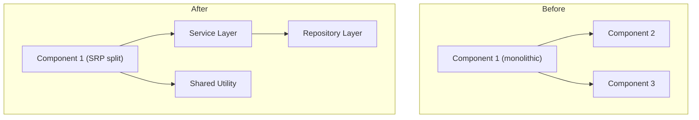

User input: $ARGUMENTS

## Behavioral Rules

> **CRITICAL: This workflow is EXCLUSIVELY for the Refactor phase of TDD's Red-Green-Refactor cycle. It modifies and improves EXISTING functionality only. It does NOT create new features or scaffold new components.**
>
> - **TDD CONSTRAINT:** Refactoring is only safe when ALL existing tests are green. Verify tests pass BEFORE proposing any refactoring. Verify tests still pass AFTER each refactoring step.
> - **SCOPE:** Only modify, improve, restructure, or optimize code that already exists. Never add new business capabilities.
> - **ALWAYS** present a structured Refactoring Plan FIRST showing: identified issues, refactoring goals by quality dimension, test coverage status, impact analysis, and phased approach.
> - **WAIT for user confirmation** of the plan before modifying any code or files.
> - If the user just asks "what would you refactor?" or "show me the plan", present ONLY the plan — do not modify code.
> - The refactoring plan must map each target to a specific quality dimension: DRY, Reusability, SOLID, Design Patterns, Security, Maintainability, Performance, or Convention compliance.
> - **ANALYZE** the existing codebase against all best practices from `tdd-review` before proposing changes.
> - **VALIDATE** against project conventions from `PROJECT_STRUCTURE_AND_CONVENTIONS.md` before and after refactoring.
> - If the user wants to compare alternative refactoring approaches, direct them to use the `tdd-compare` workflow instead.
> - If the user wants to scaffold NEW code or features, direct them to use the `tdd-scaffold` workflow instead.
> - If the user wants to review code without changing it, direct them to use the `tdd-review` workflow instead.

## Execution Steps

### 0. Environment Setup

**Validate Environment:**
Check that the following are available:
- Git command is installed (for version control)
- Text editor or IDE
- Basic command-line tools
- Testing framework (pytest, jest, etc.)

If any validation fails, halt the workflow and report the missing requirements.

### 1. Parse Input

Extract from $ARGUMENTS:
- Components to refactor
- Refactoring goals (performance, maintainability, scalability, etc.)
- Scope of refactoring (code structure, architecture, patterns)
- Constraints (backward compatibility, timeline, resources)

### 2. Infer Context from User's Assets

**Before analyzing components, understand the user's context.**

**If user references a PROJECT or DIRECTORY:**
```
Analyze directory structure to infer composition:
- Look for package.json, requirements.txt, pom.xml → Application type
- Look for .tf, terraform/ → Infrastructure as Code
- Look for .py + mlflow/, model/ → ML/Data Science
- Look for Dockerfile, helm/, k8s/ → Container/Kubernetes
- Look for .sql, dbt_project.yml → Data Engineering
- Look for airflow/, dags/ → Orchestration
- Look for tests/, pytest.ini → Testing focus
- Look for manifest.yaml + constitution.md → Archetype

Generate context description:
"Project composition: {inferred_type} with {key_technologies}"
```

**If user references a FILE:**
```
Analyze file to infer purpose:
- .py → Python (check imports for framework: fastapi, pyspark, sklearn, etc.)
- .sql → SQL queries
- .tf → Terraform infrastructure
- .tsx/.jsx → React frontend
- .yaml/.yml → Configuration (check content: k8s, airflow, etc.)
- .sh/.bash → Automation scripts
- .md → Documentation

Generate context description:
"File type: {extension}, Purpose: {inferred_purpose}, Framework: {detected_framework}"
```

**Build Augmented Analysis:**
```
${AUGMENTED_ANALYSIS} = "${CONTEXT_DESCRIPTION}. Refactoring request: $ARGUMENTS"
```

### 3. Analyze Existing Code for Refactoring Opportunities

> **SCOPE REMINDER: Only analyze and refactor existing code. Do not add new business functionality.**

Read and fully understand the existing codebase before proposing any changes. Every analysis dimension below is mandatory.

**Load Project Conventions:**
1. Check for `{frontend_folder}/docs/PROJECT_STRUCTURE_AND_CONVENTIONS.md`
2. Check for `{backend_folder}/docs/PROJECT_STRUCTURE_AND_CONVENTIONS.md`
3. Check for `./docs/PROJECT_STRUCTURE_AND_CONVENTIONS.md`
4. If not found, use standard conventions from `tdd-scaffold` workflow

**Identify Component Types via keyword matching:**

| Domain | Keywords |
|--------|----------|
| TDD cycle | TDD, test-driven, red-green-refactor, failing-test, red, green, refactor |
| Unit testing | unit, test, assertion, isolate, arrange-act-assert, spy, fake |
| Integration testing | integration, service-test, API-test, component-interaction, in-process |
| BDD | BDD, behavior, gherkin, cucumber, given-when-then, scenario, feature, step-definition |
| ATDD | ATDD, acceptance, acceptance-criteria, FitNesse, robot-framework, end-to-end |
| Contract testing | contract, pact, consumer-driven, provider, API-contract, schema-contract, Dredd |
| Property testing | property-based, hypothesis, invariant, generative, fuzzing, shrinking, QuickCheck |
| Mocking & doubles | mock, stub, spy, double, test-double, mockito, sinon, unittest.mock, WireMock |
| Test frameworks | pytest, JUnit, jest, Vitest, mocha, NUnit, Jasmine, RSpec, Spock |
| Test coverage | coverage, branch-coverage, line-coverage, mutation, threshold, lcov, jacoco |
| Frontend testing | React, component-test, render, user-event, DOM, snapshot, Testing-Library |
| Backend API testing | route, endpoint, HTTP, inject, fastify.inject, supertest, httpx, MockMvc |
| Data testing | pipeline, schema, data-quality, dbt-test, great-expectations, pandera, deequ |
| ML testing | model-evaluation, metric-threshold, accuracy, drift, deep-checks, evidently |
| Performance testing | load-test, stress, benchmark, latency, throughput, k6, locust, JMeter |
| Security testing | security, OWASP, vulnerability, injection, auth-test, penetration |
| CI/CD quality gate | CI, CD, coverage-gate, quality-gate, lint, build-check, pre-commit |
| Test documentation | test-strategy, test-plan, coverage-report, living-docs, spec |
| Frontend | UI, frontend, React, Vue, Angular, web app, SPA, SSR |
| Backend API | API, REST, GraphQL, backend, service, endpoint, FastAPI |
| Full-stack app | application, app, web, fullstack, maker |
| Database/SQL | SQL, database, query, schema, data store, Snowflake, CTE |
| Infrastructure | deploy, infrastructure, Kubernetes, container, cloud, Terraform, IaC |
| Documentation | document, docs, guide, readme, release notes, changelog |

---

#### 3.1. Duplicate Code Detection (DRY Principle)

**Scan the existing codebase for:**
- Identical or near-identical code blocks copied across files or functions
- Logic repeated in multiple components/services that can be extracted into a shared utility
- Copy-pasted error handling, validation, or transformation logic
- Repeated SQL queries or ORM patterns that should be in a repository/service layer
- Duplicated constants or configuration values defined in multiple places
- Similar React components or hooks that differ only by minor props — consolidate with generics/props

**For each duplicate, record:**
- All locations (file + line range)
- The recommended abstraction (utility function, shared hook, base class, mixin, generic component)
- Estimated lines of code saved after refactoring
- Risk level of introducing the shared abstraction

**Common patterns to consolidate:**
- Same validation logic across endpoints → validator middleware
- Same date/string/number formatting → `utils/formatters`
- Same `try-catch` boilerplate → `withErrorHandling` wrapper
- Same API call setup → dedicated service/repository layer
- Repeated `if-else` type checks → polymorphism or a strategy map

---

#### 3.2. Code Reusability Analysis

**Evaluate each existing module for reusability:**
- Are functions over-specialized for a single caller, or generic enough for reuse?
- Are magic strings/numbers scattered across files instead of in shared constants?
- Are shared types/interfaces re-declared in multiple files instead of defined once and imported?
- Are utility functions embedded in components/services instead of a shared utilities module?
- Do React components tightly couple UI + data-fetching + state when they could be split?
- Do backend service methods hard-code concerns that other routes/controllers could benefit from?
- Are common patterns (pagination, filtering, sorting, auth checks) copy-pasted instead of abstracted?

**Rate each module:** `High / Medium / Low` reusability with justification.

**Refactoring recommendations where reusability is Low:**
- Extract shared hooks for repeated stateful logic (data fetching, form state, auth)
- Create generic components for repeated UI patterns (tables, modals, form fields)
- Create service/repository classes for repeated data access patterns
- Extract middleware for cross-cutting concerns (logging, auth, validation, error handling)

---

#### 3.3. SOLID Principles Violations

Scan all existing classes, modules, and functions:

**S — Single Responsibility Principle (SRP):**
- Flag: Functions doing validation + business logic + persistence together
- Flag: Components handling UI rendering + API calls + state management simultaneously
- Refactoring: Split into separate layers (controller → service → repository)

**O — Open/Closed Principle (OCP):**
- Flag: Long if-else / switch chains that need modification for each new type
- Refactoring: Replace with strategy pattern, polymorphism, or lookup maps

**L — Liskov Substitution Principle (LSP):**
- Flag: Subclasses that override methods to throw `NotImplemented` or change contract behavior
- Flag: Interface implementations that ignore required method contracts

**I — Interface Segregation Principle (ISP):**
- Flag: Large interfaces where implementations only use a subset of methods
- Refactoring: Split into smaller, focused interfaces

**D — Dependency Inversion Principle (DIP):**
- Flag: Direct instantiation of dependencies inside classes (use injection instead)
- Flag: Hard-coded service URLs, DB connections, or SDK calls without abstraction
- Refactoring: Introduce dependency injection and interface-based wiring

---

#### 3.4. Design Pattern Misuse and Missing Patterns

**Flag misapplied patterns in existing code:**
- God Object/Class: One class doing too much — split by responsibility
- Spaghetti Code: Tangled control flow — refactor with patterns
- Magic Numbers/Strings: Replace with named constants
- Premature Optimization: Overly complex code without proven need — simplify
- Anemic Domain Model: Business logic scattered across services — move to domain objects
- Shotgun Surgery: One change requires edits across many unrelated files — consolidate
- Feature Envy: A method using another class's data more than its own — move the method

**Identify missing patterns that would improve existing code:**
- Factory: Where object creation logic is complex and repeated
- Strategy: Where if-else chains select different algorithms
- Repository: Where data access is mixed into business logic
- Observer/Event: Where tight coupling can be replaced with events
- Decorator: Where cross-cutting concerns (logging, caching, auth) are embedded inline
- Facade: Where complex subsystem interactions are repeated across callers
- Command: Where operations need to be queued, retried, or undone

---

#### 3.5. Security Vulnerabilities in Existing Code

**OWASP Top 10 — audit every applicable category in existing code:**
- A01 Broken Access Control: Missing authorization checks, IDOR — user can access another user's data
- A02 Cryptographic Failures: Sensitive data unencrypted, weak hashing (MD5/SHA1)
- A03 Injection: SQL, NoSQL, LDAP, OS command injection via string concatenation
- A04 Insecure Design: Insecure design choices baked into existing architecture
- A05 Security Misconfiguration: Debug mode in code, verbose error responses, default credentials
- A06 Vulnerable Components: Outdated dependencies with known CVEs
- A07 Auth Failures: Weak session management, no token expiry, no revocation
- A08 Integrity Failures: Insecure deserialization, missing input integrity checks
- A09 Logging Failures: Sensitive data in logs, missing audit trails
- A10 SSRF: User-controlled URLs fetched without validation

**Critical checks in existing code:**
- Hardcoded secrets, API keys, tokens, or passwords anywhere in code or config files
- SQL/NoSQL injection via string concatenation — replace with parameterized queries/ORM
- XSS via unescaped user input — add proper sanitization
- CSRF missing on state-changing endpoints — add protection
- JWT tokens stored in `localStorage` — migrate to `httpOnly` cookies
- Passwords hashed with MD5/SHA1 — migrate to bcrypt/argon2
- CORS wildcard `*` in production — restrict to known origins
- No rate limiting on auth/API endpoints — add middleware
- Sensitive data in error responses or logs — sanitize and redact
- Dependency vulnerabilities — run `npm audit` / `pip audit` / `snyk test`

---

#### 3.6. Performance Issues in Existing Code

**Frontend:**
- Unnecessary re-renders — add `useMemo`, `useCallback`, `React.memo` where profiling confirms need
- Missing code splitting — add `React.lazy` and dynamic `import()` for large route components
- Memory leaks — missing cleanup in `useEffect` (unsubscribed listeners, cancelled requests)
- Large bundle contributions — replace heavy libraries with lighter alternatives or tree-shake properly
- Repeated identical API calls — add deduplication, caching, or request batching

**Backend:**
- N+1 query problems — replace with `JOIN`, eager loading, or batch fetching
- `SELECT *` queries — replace with explicit column selection
- Missing indexes on frequently filtered/sorted columns
- Inefficient algorithms (O(n²) or worse) — optimize to O(n log n) or better
- Missing caching for hot read paths — add Redis or in-memory cache
- Blocking I/O in async handlers — ensure proper `async/await` usage
- Unbounded result sets — add pagination to all list endpoints

**Infrastructure:**
- Over-sized container images — optimize with multi-stage builds
- Missing connection pooling — configure for DB and external services
- Missing request compression — add gzip/brotli middleware

---

#### 3.7. Code Maintainability Issues

**Complexity problems:**
- Cyclomatic complexity > 10 per function — split into smaller functions
- Functions exceeding 50 lines — decompose
- Files exceeding 300–500 lines — split by responsibility
- Nesting > 3–4 levels — introduce early returns / guard clauses
- Functions with > 4 parameters — convert to options object

**Naming and clarity:**
- Non-descriptive names (`temp`, `data2`, `x`, `handler`) — rename with intent
- Misleading names (name doesn't match behavior) — rename
- Magic numbers and magic strings — extract to named constants
- Missing comments on complex/non-obvious logic (the "why", not the "what")
- Boolean parameters — replace with named options objects

**Dead code to remove:**
- Unused imports, functions, variables, and type declarations
- Commented-out code blocks — remove (version control preserves history)
- TODO/FIXME/HACK comments — resolve or log as tracked issues
- Deprecated API usage — migrate to current APIs

**Architecture violations:**
- Circular dependencies — eliminate
- Layers violated (e.g., UI layer calling DB directly) — enforce layering
- Missing separation of concerns — split UI, business logic, data access
- High coupling between modules — introduce interfaces / dependency injection

---

#### 3.8. Convention Compliance Gaps

**Frontend (React + Vite + TypeScript) — flag violations:**
- Types defined inside component files — move to `/src/types/`
- Missing barrel exports (`index.ts`) in component folders
- `any` types used anywhere — replace with proper TypeScript types
- Inline styles instead of CSS modules or Tailwind classes
- Naming convention violations (component not PascalCase, utility not camelCase)
- Constants not in `src/utils/` or not SCREAMING_SNAKE_CASE
- Multiple components in one file — split into separate files

**Backend — flag violations:**
- API endpoints not following REST conventions (plural nouns, proper HTTP methods)
- Missing request/response validation schemas (Pydantic, Zod, JOI)
- Missing consistent response envelope (`data`, `error`, `meta`)
- Missing API versioning (`/api/v1/`)
- Inconsistent error handling — standardize with custom exceptions

**Infrastructure — flag violations:**
- Terraform code not modularized — extract reusable modules
- Missing resource limits/requests in Kubernetes manifests
- Secrets hardcoded in IaC files — move to vault/secrets manager
- Missing health check and readiness probe definitions

---

#### 3.9. Test Quality Issues

**Coverage gaps:**
- Untested business logic functions
- Untested error/failure paths (only happy path tested)
- Missing integration tests for API endpoints
- Missing edge case tests

**Test quality problems:**
- Tests with shared mutable state between cases — isolate each test
- Tests that test implementation details instead of behavior — rewrite to test outcomes
- Logic (if/loops) inside tests — simplify to declarative assertions
- Non-descriptive test names — rename to `should [behavior] when [condition]`
- Tests that don't clean up side effects — add proper teardown

---

#### 3.10. Match to TDD Patterns

Identify which TDD approach applies to the code being refactored. Refactoring must preserve test coverage for the matched pattern.

**Pattern: Classic TDD (Inside-Out)**
- Approach: Red → Green → Refactor starting from the smallest failing unit test
- Components: unit-test-code-coverage, code-reviewer, regression-test-coverage, quality-guardian
- Keywords: unit, assert, arrange-act-assert, isolated, pure-function, logic
- Refactoring focus: Test readability, extract helper assertions, eliminate test duplication, improve test naming to be behavior-focused

**Pattern: Outside-In TDD (London School)**
- Approach: Write failing acceptance test → mock collaborators → drive unit tests inward
- Components: unit-test-code-coverage, regression-test-coverage, integration-specialist, code-reviewer
- Keywords: mock, stub, outside-in, acceptance, London, top-down, collaborator
- Refactoring focus: Consolidate test doubles, simplify mock setup, improve acceptance test expressiveness, remove over-specified mocks

**Pattern: BDD (Behavior Driven Development)**
- Approach: Given/When/Then scenarios → step definitions → implementation → living docs
- Components: unit-test-code-coverage, regression-test-coverage, documentation-evangelist, jira-user-stories
- Keywords: BDD, gherkin, cucumber, given-when-then, scenario, feature, step-definition
- Refactoring focus: Scenario organization, step reuse and consolidation, feature file clarity, remove duplicate step definitions

**Pattern: ATDD (Acceptance Test Driven Development)**
- Approach: Acceptance criteria from tickets → automate as tests → implement to pass
- Components: regression-test-coverage, jira-user-stories, documentation-evangelist, unit-test-code-coverage, quality-guardian
- Keywords: ATDD, acceptance, criteria, FitNesse, robot-framework, end-to-end
- Refactoring focus: Acceptance test structure, shared step libraries, test data management, criteria traceability

**Pattern: Contract-First TDD**
- Approach: Define API contract → consumer tests → provider verification → implementation
- Components: integration-specialist, unit-test-code-coverage, documentation-evangelist, aks-devops-deployment
- Keywords: contract, pact, consumer-driven, provider, API-contract, Dredd, Prism
- Refactoring focus: Contract versioning, backward compatibility maintenance, consumer grouping, provider test clarity

**Pattern: Property-Based TDD**
- Approach: Define invariants and properties → auto-generate inputs → shrink failures → fix
- Components: unit-test-code-coverage, quality-guardian, data-validation, interpretability-analyst
- Keywords: property-based, hypothesis, invariant, generative, fuzzing, shrinking, QuickCheck
- Refactoring focus: Property generalization, test oracle clarity, custom generator performance, invariant consolidation

**Pattern: TDD for Data Pipelines**
- Approach: Write schema/contract tests → pipeline unit tests → integration tests
- Components: unit-test-code-coverage, quality-guardian, data-pipeline-builder, transformation-alchemist, data-validation
- Keywords: pipeline, schema, data-quality, dbt-test, great-expectations, pandera, deequ
- Refactoring focus: Test data fixture management, pipeline stage isolation, assertion consolidation, quality rule DRY

**Pattern: TDD for ML Models**
- Approach: Define metric thresholds → evaluation test harness → train until tests pass
- Components: unit-test-code-coverage, language-model-evaluation, model-architect, quality-guardian
- Keywords: model-evaluation, metric-threshold, accuracy, drift, deep-checks, evidently, mlflow
- Refactoring focus: Evaluation pipeline efficiency, test isolation per metric, threshold configuration standardization

### 4. Present Refactoring Plan (MANDATORY)

> **REQUIRED: Present this plan and WAIT for user confirmation before modifying any code.**
> **SCOPE CHECK: Every item in the plan must modify existing code — not add new functionality.**

**This step has TWO parts:**
1. **Detailed Refactoring Plan** — comprehensive analysis and phased approach
2. **Final Proposed Outcome Summary** — plain-language summary of what will be delivered
3. **Approval Gate** — explicit request for user approval, adjustments, or cancellation

Present the complete refactoring plan in the format below:

---

```markdown
## Refactoring Plan

**Scope:** Existing functionality improvement only — no new features
**Solution Pattern:** {matched_pattern_name}
**Files to Modify:** {count}
**Estimated Effort:** {hours/days}

---

### Issues Found (Pre-Refactor Analysis)

| # | File / Module | Quality Dimension | Issue | Severity | Principle Violated |
|---|---|---|---|---|---|
| 1 | {file:line} | DRY | {description} | High/Med/Low | DRY |
| 2 | {file:line} | SOLID | {description} | High/Med/Low | SRP / OCP / LSP / ISP / DIP |
| 3 | {file:line} | Security | {description} | Critical/High/Med | OWASP A0X |
| 4 | {file:line} | Maintainability | {description} | High/Med/Low | Complexity / Naming / Dead Code |
| 5 | {file:line} | Reusability | {description} | High/Med/Low | Reusability |
| 6 | {file:line} | Performance | {description} | High/Med/Low | Performance |
| 7 | {file:line} | Design Pattern | {description} | High/Med/Low | Anti-Pattern / Missing Pattern |
| 8 | {file:line} | Convention | {description} | Med/Low | Convention |

---

### Duplicate Code Summary

**Duplications Found:** {count}
**Estimated Lines to Eliminate:** {count}

| Location A | Location B | Lines | Recommended Abstraction |
|---|---|---|---|
| {file:line-range} | {file:line-range} | {N} | {utility/hook/service/base class} |

---

### Reusability Summary

| Module / Component | Current Score | Recommendation |
|---|---|---|
| {name} | High / Medium / Low | {specific abstraction to extract} |

---

### SOLID Compliance (Current State)

| Principle | Status | Violations |
|---|---|---|
| SRP | ✅ / ❌ | {details} |
| OCP | ✅ / ❌ | {details} |
| LSP | ✅ / ❌ | {details} |
| ISP | ✅ / ❌ | {details} |
| DIP | ✅ / ❌ | {details} |

---

### Security Audit (Current State)

| OWASP Category | Status | Issue Found |
|---|---|---|
| A01 Broken Access Control | ✅ / ❌ | {details} |
| A02 Cryptographic Failures | ✅ / ❌ | {details} |
| A03 Injection | ✅ / ❌ | {details} |
| A04 Insecure Design | ✅ / ❌ | {details} |
| A05 Security Misconfiguration | ✅ / ❌ | {details} |
| A06 Vulnerable Components | ✅ / ❌ | {details} |
| A07 Auth Failures | ✅ / ❌ | {details} |
| A08 Integrity Failures | ✅ / ❌ | {details} |
| A09 Logging Failures | ✅ / ❌ | {details} |
| A10 SSRF | ✅ / ❌ | {details} |

---

### Pre-Refactor Quality Metrics

```
Maintainability Index:     [0-100]
Cyclomatic Complexity:     [Average per function]
Code Duplication:          [X%]
Test Coverage:             [X%]
Security Score:            [0-10]
SOLID Compliance:          [X/5 principles]
Convention Compliance:     [X%]
Technical Debt Estimate:   [X hours]
```

---

### Architecture Diagram (Before → After)



---

### Phased Refactoring Approach

**Phase 1 — Security & Critical Fixes** (no behavioral change, highest priority)
- Fix all OWASP Critical/High issues
- Remove hardcoded secrets
- Patch vulnerable dependencies

**Phase 2 — DRY & Reusability** (extract shared abstractions)
- Consolidate duplicate code into shared utilities/hooks/services
- Extract reusable components and middleware
- Move constants to shared locations

**Phase 3 — SOLID & Design Patterns** (structural improvement)
- Apply SRP splits to oversized classes/functions
- Replace anti-patterns with appropriate design patterns
- Introduce dependency injection where needed

**Phase 4 — Maintainability & Conventions** (code quality cleanup)
- Rename non-descriptive identifiers
- Remove dead code, resolve TODO/FIXME
- Fix convention violations (naming, types, file structure)
- Reduce complexity (nesting, function length)

**Phase 5 — Performance** (measurable improvements)
- Fix N+1 queries, add indexes
- Add caching for hot paths
- Optimize bundle size and re-renders

**Phase 6 — Tests & Documentation** (validation)
- Update and add tests for all refactored code
- Verify test coverage maintained or improved
- Update documentation to reflect structural changes

---

### Risk Assessment

| Risk | Level | Mitigation |
|---|---|---|
| Breaking changes to API contracts | High/Med/Low | {strategy} |
| Test failures during refactor | High/Med/Low | Run tests after each phase |
| Regression in behavior | High/Med/Low | {strategy} |
| Estimated rollback time | {X hours} | Feature branch + git revert |

**Breaking changes:** Yes / No
**Rollback strategy:** Feature branch — `git revert` or branch deletion

---

## Final Proposed Outcome Summary

> **This is what I will deliver if you approve:**

**Files to be Modified:** {N} files across {M} directories
**Files to be Created:** {N} new files (utilities, tests, documentation)
**Files to be Deleted:** {N} files (dead code removal)

**What You'll Get:**

1. **Security Improvements:**
   - {List specific security fixes, e.g., "Remove 3 hardcoded API keys from config files"}
   - {e.g., "Replace string-concatenated SQL with parameterized queries in 5 endpoints"}
   - {e.g., "Upgrade password hashing from MD5 to bcrypt"}

2. **Code Quality Improvements:**
   - {e.g., "Extract 8 duplicate code blocks into 3 shared utility functions"}
   - {e.g., "Split 4 oversized components (>300 lines) into focused modules"}
   - {e.g., "Rename 15 non-descriptive variables (temp, data2, x) to intention-revealing names"}

3. **Performance Improvements:**
   - {e.g., "Fix 3 N+1 query patterns in user/order endpoints"}
   - {e.g., "Add database indexes on 5 frequently filtered columns"}
   - {e.g., "Reduce bundle size by 40% through code splitting"}

4. **Architecture Improvements:**
   - {e.g., "Introduce service layer to separate business logic from controllers"}
   - {e.g., "Replace 2 if-else chains with strategy pattern"}
   - {e.g., "Add dependency injection for 4 tightly coupled services"}

5. **Test & Documentation:**
   - {e.g., "Update 12 existing tests to match refactored interfaces"}
   - {e.g., "Add 8 new tests for extracted utilities"}
   - {e.g., "Update architecture diagrams and API documentation"}

**What Will NOT Change:**
- ✅ All existing API contracts remain compatible
- ✅ All existing functionality preserved
- ✅ No new business features added
- ✅ All existing tests will pass after refactoring

**Estimated Effort:** {X hours/days}
**Risk Level:** {Low/Medium/High}
**Breaking Changes:** {Yes/No — if Yes, list them}

---

## Approval Required

> **I need your approval before proceeding. Please choose one:**

**Option 1: Approve All Phases**
- Reply: "Approved" or "Proceed" or "Go ahead"
- I will execute all 6 phases sequentially, running tests after each phase

**Option 2: Approve Specific Phases Only**
- Reply: "Approve Phase 1, 2, and 5 only" (or similar)
- I will execute only the phases you specify

**Option 3: Request Adjustments**
- Reply with specific changes you want to the plan
- Examples:
  - "Skip performance optimizations for now"
  - "Focus only on security fixes"
  - "Don't rename variables, just fix the security issues"
  - "Add more detail on the service layer refactoring"
- I will revise the plan based on your feedback and present it again

**Option 4: Cancel**
- Reply: "Cancel" or "Stop"
- I will not proceed with any refactoring

---

> **Waiting for your response...**
```

---

**STOP HERE and wait for user confirmation before proceeding to Step 5.**

**Do NOT proceed to Step 5 until the user explicitly approves the plan.**

### 5. Execute Refactoring by Quality Dimension

> **Execute only the phases confirmed by the user. Modify existing code only — do not add new business functionality.**
> **Run tests after each phase. Commit after each phase completes successfully.**

---

#### Phase 1 — Security & Critical Fixes

Apply these changes first — they fix vulnerabilities without altering behavior:

**Injection (OWASP A03):**
- Replace all string-concatenated SQL/NoSQL queries with parameterized queries or ORM methods
- Escape or sanitize all user inputs before use in queries, shell commands, or HTML

**Hardcoded Secrets (OWASP A02/A05):**
- Remove all hardcoded API keys, passwords, tokens from code and config files
- Replace with environment variable reads or vault/secrets manager calls
- Add `.env.example` with placeholder values if not already present

**Authentication & Authorization (OWASP A01/A07):**
- Add missing authorization checks to all protected routes
- Replace `localStorage` JWT storage with `httpOnly` cookies
- Enforce short token expiry and add refresh/revocation support
- Upgrade password hashing from MD5/SHA1 to bcrypt/argon2

**Other Critical Security:**
- Add CSRF protection to all state-changing endpoints
- Add CORS restrictions (remove wildcard `*` in production)
- Add rate limiting middleware to auth and sensitive API endpoints
- Redact sensitive data from error responses and log statements
- Run and resolve `npm audit` / `pip audit` dependency vulnerabilities
- Fix insecure file upload handlers (add type validation, size limits, path traversal checks)

---

#### Phase 2 — DRY & Reusability Refactoring

Extract shared abstractions from the duplicated code identified in Step 3.1 and 3.2:

**Extract shared utilities:**
- Consolidate duplicate formatting/transformation logic into `utils/formatters` or equivalent
- Consolidate duplicate validation logic into shared validator functions or middleware
- Replace repeated `try-catch` boilerplate with a `withErrorHandling` wrapper utility
- Move all duplicated constants into a single shared constants file

**Extract shared hooks (Frontend):**
- Consolidate repeated data-fetching patterns into a `useData` / `useFetch` custom hook
- Consolidate repeated form state patterns into a `useForm` custom hook
- Consolidate repeated auth checks into a `useAuth` custom hook

**Extract shared service/repository layer (Backend):**
- Consolidate repeated API call setup into dedicated service classes
- Consolidate repeated DB queries into a repository layer
- Consolidate repeated pagination/filtering/sorting logic into shared query builders

**Extract shared/generic components (Frontend):**
- Consolidate similar components that differ only by minor props into a single generic component
- Extract repeated table, modal, form field patterns into shared component library entries

**Cross-component DRY:**
- Define shared types/interfaces once (e.g., in `shared/` or `src/types/`) — remove re-declarations
- Define API response envelopes once and reuse across all endpoints

---

#### Phase 3 — SOLID Principles & Design Pattern Refactoring

Apply structural improvements to existing code based on findings in Step 3.3 and 3.4:

**SRP — Split oversized classes and functions:**
- Split any function doing > 1 thing (validate + process + persist) into separate focused functions
- Split any component doing UI + API calls + state management into container/presentational components
- Split any service doing multiple unrelated concerns into separate services

**OCP — Replace modification-required if-else chains:**
- Replace long `if-else`/`switch` type-dispatch chains with strategy maps or polymorphism
- Introduce plugin/hook points so new types can be added by extension, not modification

**DIP — Introduce dependency injection:**
- Replace direct instantiation of services/repositories inside classes with constructor injection
- Replace hard-coded external URLs and SDK calls with injected/configured abstractions

**Replace anti-patterns:**
- God Object: Identify and split by responsibility into focused classes/modules
- Spaghetti Code: Introduce clear layering (controller → service → repository) and remove cross-layer calls
- Anemic Domain Model: Move business logic from service layer into domain objects where appropriate
- Shotgun Surgery: Consolidate scattered related logic into a single cohesive module
- Feature Envy: Move methods to the class whose data they primarily operate on

**Introduce missing design patterns:**
- Factory: For complex or repeated object creation logic
- Strategy: For algorithm/behavior variation that currently uses if-else dispatch
- Repository: For data access currently mixed into business logic
- Decorator: For cross-cutting concerns (logging, caching, auth) currently embedded inline
- Observer/Event: For tight coupling that can be replaced with event emission/subscription

---

#### Phase 4 — Maintainability & Convention Refactoring

**Reduce complexity:**
- Decompose functions with cyclomatic complexity > 10 into smaller functions
- Decompose functions > 50 lines into smaller focused functions
- Split files > 300–500 lines by responsibility
- Replace deep nesting (> 3–4 levels) with early returns / guard clauses
- Replace functions with > 4 parameters with options objects

**Improve naming and clarity:**
- Rename non-descriptive identifiers (`temp`, `data2`, `x`, `handler`) to intention-revealing names
- Rename misleading identifiers (name does not match actual behavior)
- Extract magic numbers and magic strings to named constants
- Replace boolean parameters with named options objects
- Add explanatory comments only where logic is complex — explain "why", not "what"

**Remove dead code:**
- Delete unused imports, functions, variables, and type declarations
- Delete commented-out code blocks (version control preserves history)
- Resolve or log as tracked issues all TODO/FIXME/HACK comments
- Migrate all deprecated API usage to current alternatives

**Fix convention violations (Frontend):**
- Move type definitions from component files to `/src/types/`
- Add barrel exports (`index.ts`) to all component and type folders
- Replace all `any` types with proper TypeScript types
- Remove inline styles — migrate to CSS modules or Tailwind classes
- Fix naming violations (PascalCase components, camelCase utilities, SCREAMING_SNAKE_CASE constants)
- Split files with multiple components into separate single-component files

**Fix convention violations (Backend):**
- Rename API endpoints to follow REST conventions (plural nouns, proper HTTP verbs)
- Add missing request/response validation schemas (Pydantic, Zod, JOI)
- Standardize all responses to consistent envelope (`data`, `error`, `meta`)
- Add API versioning prefix if missing (`/api/v1/`)
- Standardize error handling using custom exception hierarchy

**Fix convention violations (Infrastructure):**
- Modularize Terraform code — extract reusable modules
- Add missing resource limits/requests to Kubernetes manifests
- Remove hardcoded secrets from IaC files — use vault references
- Add missing health check and readiness probe definitions

---

#### Phase 5 — Performance Refactoring

**Frontend performance:**
- Add `React.memo` to pure components that re-render unnecessarily (verify with profiler first)
- Add `useMemo`/`useCallback` only where profiling confirms expensive recomputation
- Add `React.lazy` + `Suspense` for route-level code splitting
- Add cleanup functions in `useEffect` for all subscriptions and async requests
- Replace heavy library imports with lighter alternatives or import only needed submodules

**Backend performance:**
- Fix all identified N+1 queries with `JOIN`, eager loading, or batch queries
- Replace `SELECT *` with explicit column lists
- Add database indexes on all frequently filtered/sorted/joined columns
- Improve algorithm complexity where O(n²) or worse is identified
- Add Redis/in-memory caching for hot read-only data paths
- Ensure all I/O operations use proper `async/await` (no blocking calls in async handlers)
- Add pagination to all list endpoints with unbounded result sets

**Infrastructure performance:**
- Optimize Dockerfiles with multi-stage builds to reduce image size
- Add connection pooling configuration for all databases and external services
- Add gzip/brotli compression middleware if missing

---

#### Phase 6 — Test & Documentation Updates

**Update and add tests for all refactored code:**
- Update existing unit tests to match new interfaces after refactoring
- Add unit tests for newly extracted utility functions, hooks, services, and repositories
- Add integration tests for any refactored API endpoints
- Add tests for previously untested error/failure paths
- Fix test quality issues found in Step 3.9 (isolation, naming, declarative assertions)
- Verify overall test coverage is maintained or improved (target > 80% for business logic)

**Update documentation:**
- Update inline documentation for all renamed identifiers and refactored functions
- Update architecture diagrams to reflect structural changes
- Update API documentation if endpoint signatures changed
- Add migration notes for any interface changes that affect callers

---

#### Cross-Cutting Concerns (Applied Across All Phases)

**Error handling consistency:**
- Standardize all error handling to a single pattern (custom exception hierarchy + handler middleware)
- Ensure all failure paths are handled explicitly — remove silent `catch` blocks
- Add descriptive, actionable error messages for both users and developers

**Logging standardization:**
- Implement structured logging (JSON) at appropriate levels (debug/info/warn/error)
- Add correlation IDs to all log entries for request tracing
- Remove or redact all sensitive data from log statements

**Configuration management:**
- Ensure all environment-specific values are read from environment variables or config files
- Remove any remaining hardcoded configuration values
- Validate required configuration at startup — fail fast with a clear message if missing

**Integration contracts:**
- Verify all API contracts remain compatible after refactoring
- Standardize message/event schemas across services
- Add or update contract tests where integration interfaces changed

### 6. Validate Consistency

**Ensure refactored components maintain:**

1. **Contract Compatibility:**
   - Verify API contracts remain compatible
   - Check data schemas match expectations
   - Validate message formats
   - Test integration points
   - Run contract tests

2. **Performance Characteristics:**
   - Benchmark before and after refactoring
   - Verify latency requirements met
   - Check throughput maintained or improved
   - Validate resource usage
   - Run performance tests

3. **Test Coverage:**
   - Maintain or improve test coverage
   - Update existing tests
   - Add tests for new code paths
   - Run full test suite
   - Verify all tests pass

4. **Backward Compatibility:**
   - Verify existing functionality preserved
   - Check API versions maintained
   - Validate data migrations
   - Test with existing clients
   - Document breaking changes

5. **Documentation:**
   - Update code documentation
   - Update architecture diagrams
   - Document refactoring decisions
   - Update API documentation
   - Add migration guides

### 7. Create Detailed Execution Plan

**Phased Approach:**

1. **Phase 1: Preparation**
   - Create feature branch
   - Set up testing environment
   - Document current state
   - Identify dependencies
   - Plan rollback strategy

2. **Phase 2: Component Refactoring**
   - Refactor one component at a time
   - Run tests after each change
   - Commit frequently
   - Document changes
   - Review with team

3. **Phase 3: Integration Testing**
   - Test component interactions
   - Run integration test suite
   - Verify performance
   - Check error handling
   - Validate monitoring

4. **Phase 4: Deployment**
   - Deploy to staging first
   - Run smoke tests
   - Monitor metrics
   - Deploy to production
   - Monitor for issues

5. **Phase 5: Validation**
   - Verify all functionality works
   - Check performance metrics
   - Validate monitoring
   - Gather feedback
   - Document lessons learned

### 8. Generate Refactoring Report

Present the full report after all confirmed phases are complete:

```markdown
# Refactoring Report

**Scope:** Existing functionality improvement — no new features added
**Solution Pattern:** {matched_pattern_name}
**Files Modified:** {count}
**Phases Completed:** {list}

---

## Executive Summary

| Metric | Before | After | Improvement |
|---|---|---|---|
| Maintainability Index | [0-100] | [0-100] | [+N] |
| Cyclomatic Complexity (avg) | [N] | [N] | [-N] |
| Code Duplication | [X%] | [X%] | [-X%] |
| Test Coverage | [X%] | [X%] | [+X%] |
| Security Score | [0-10] | [0-10] | [+N] |
| SOLID Compliance | [X/5] | [X/5] | [+N] |
| Convention Compliance | [X%] | [X%] | [+X%] |
| Technical Debt | [X hrs] | [X hrs] | [-X hrs] |
| Lines of Code (net) | [N] | [N] | [-N via DRY] |

**Overall Assessment:** [Improved / Significantly Improved / No Change]

---

## Changes by Quality Dimension

### Phase 1 — Security Fixes
| File | Change | OWASP Category | Breaking |
|---|---|---|---|
| {file:line} | {description} | A0X | Yes/No |

### Phase 2 — DRY & Reusability
| Duplication Eliminated | Abstraction Created | Lines Saved |
|---|---|---|
| {file A} + {file B} | {utility/hook/service} | {N} |

### Phase 3 — SOLID & Design Patterns
| File | SOLID Violation Fixed | Pattern Applied |
|---|---|---|
| {file} | SRP / OCP / LSP / ISP / DIP | {pattern name} |

### Phase 4 — Maintainability & Conventions
| File | Change Type | Detail |
|---|---|---|
| {file:line} | Renamed / Decomposed / Dead Code Removed / Convention Fixed | {detail} |

### Phase 5 — Performance
| File | Issue Fixed | Expected Impact |
|---|---|---|
| {file:line} | N+1 / Index / Caching / Bundle / Complexity | {estimated improvement} |

### Phase 6 — Tests & Documentation
| Type | Before | After |
|---|---|---|
| Unit Tests | {passed/total} | {passed/total} |
| Integration Tests | {passed/total} | {passed/total} |
| Coverage | {X%} | {X%} |

---

## SOLID Compliance (After)

| Principle | Before | After | Changes Made |
|---|---|---|---|
| SRP | ✅/❌ | ✅/❌ | {description} |
| OCP | ✅/❌ | ✅/❌ | {description} |
| LSP | ✅/❌ | ✅/❌ | {description} |
| ISP | ✅/❌ | ✅/❌ | {description} |
| DIP | ✅/❌ | ✅/❌ | {description} |

---

## Security (After)

| OWASP Category | Before | After |
|---|---|---|
| A01 Broken Access Control | ✅/❌ | ✅/❌ |
| A02 Cryptographic Failures | ✅/❌ | ✅/❌ |
| A03 Injection | ✅/❌ | ✅/❌ |
| A04 Insecure Design | ✅/❌ | ✅/❌ |
| A05 Security Misconfiguration | ✅/❌ | ✅/❌ |
| A06 Vulnerable Components | ✅/❌ | ✅/❌ |
| A07 Auth Failures | ✅/❌ | ✅/❌ |
| A08 Integrity Failures | ✅/❌ | ✅/❌ |
| A09 Logging Failures | ✅/❌ | ✅/❌ |
| A10 SSRF | ✅/❌ | ✅/❌ |

---

## Breaking Changes

**Breaking changes introduced:** Yes / No

| Change | Affected Callers | Migration Steps |
|---|---|---|
| {description} | {files/services} | {steps} |

**Migration Guide:**
{step-by-step migration instructions for any interface changes}

---

## Backward Compatibility Verification

- [ ] All existing API contracts verified compatible
- [ ] All existing tests pass after refactoring
- [ ] Data schemas unchanged or migration provided
- [ ] Integration points tested end-to-end

---

## Remaining Technical Debt

| Item | Priority | Estimated Effort |
|---|---|---|
| {description} | High/Med/Low | {X hrs} |

---

## Next Steps

1. **Deploy to staging** — run full integration test suite
2. **Monitor** — watch for regressions in error rates, latency, and test coverage
3. **Code review** — run `/tdd-review` on refactored code to confirm quality targets met
4. **Backlog** — log any remaining technical debt items in issue tracker
5. **Team communication** — share migration guide for any breaking changes
```

## Examples

**Example 1: Data Pipeline Refactoring**
```
User: /tdd-refactor Refactor data pipeline for better performance and maintainability

Components Identified:
- Data ingestion (pipeline-builder): Refactor to idempotent writes
- Data transformation (transformation-alchemist): Optimize Spark code
- Orchestration (pipeline-orchestrator): Improve error handling

Refactoring Applied:
1. Data Ingestion:
   - Extracted connection logic into reusable module
   - Implemented upsert pattern for idempotency
   - Added retry mechanism with exponential backoff
   - Improved error logging

2. Data Transformation:
   - Optimized Spark joins using broadcast
   - Extracted complex transformations into functions
   - Added proper null handling
   - Improved partition strategy

3. Orchestration:
   - Simplified DAG dependencies
   - Added proper error handling and retries
   - Implemented task-level monitoring
   - Added configuration management

Integration Updates:
- Maintained data contracts between components
- Added integration tests for data flow
- Implemented end-to-end monitoring

Results:
- Performance: 40% improvement in pipeline execution time
- Code Quality: Reduced complexity by 30%
- Test Coverage: 65% → 85%
- Maintainability: Improved code readability and modularity
```

**Example 2: ML Model Serving Refactoring**
```
User: /tdd-refactor Optimize ML inference service for lower latency

Components Identified:
- ML inference (inference-orchestrator): Optimize model loading and prediction
- Monitoring (observability): Add detailed latency metrics

Refactoring Applied:
1. ML Inference:
   - Implemented model caching to avoid repeated loading
   - Added batch prediction optimization
   - Refactored preprocessing into separate module
   - Optimized feature transformation
   - Added request validation middleware

2. Monitoring:
   - Added detailed latency metrics (p50, p95, p99)
   - Implemented distributed tracing
   - Added model performance metrics
   - Created latency dashboard

Integration Updates:
- Maintained API contract compatibility
- Added performance benchmarks
- Implemented canary deployment support

Results:
- Latency: Reduced p95 from 500ms to 150ms (70% improvement)
- Throughput: Increased from 100 to 300 requests/second
- Resource Usage: Reduced memory by 40%
- Test Coverage: Added performance regression tests
```

**Example 3: Frontend Architecture Refactoring**
```
User: /tdd-refactor Refactor React app for better performance and maintainability

Components Identified:
- Frontend (app-maker): Improve component structure and performance
- Backend API (integration-specialist): Optimize API calls

Refactoring Applied:
1. Frontend:
   - Extracted common UI components into library
   - Implemented proper state management with Redux Toolkit
   - Added React.memo for expensive components
   - Implemented code splitting and lazy loading
   - Optimized bundle size
   - Added proper TypeScript types

2. Backend API:
   - Implemented GraphQL for flexible data fetching
   - Added response caching
   - Optimized database queries
   - Implemented pagination

Integration Updates:
- Migrated from REST to GraphQL
- Added API response caching
- Implemented optimistic updates
- Added proper error handling

Results:
- Initial Load Time: 3.5s → 1.2s (66% improvement)
- Bundle Size: 2.5MB → 800KB (68% reduction)
- Lighthouse Score: 65 → 92
- Code Maintainability: Improved component reusability by 50%
```

**Example 4: Infrastructure as Code Refactoring**
```
User: /tdd-refactor Refactor Terraform code for better modularity and reusability

Components Identified:
- Infrastructure (terraform-cicd-architect): Modularize IaC code

Refactoring Applied:
1. Infrastructure:
   - Extracted common patterns into reusable modules
   - Implemented proper variable management
   - Refactored for multi-environment support
   - Added proper tagging strategy
   - Implemented remote state management
   - Added security best practices

Integration Updates:
- Maintained infrastructure compatibility
- Added infrastructure testing with Terratest
- Implemented proper CI/CD pipeline
- Added drift detection

Results:
- Code Reusability: 70% of code now in reusable modules
- Deployment Time: Reduced by 50%
- Environment Consistency: 100% parity across environments
- Security: Implemented 15 security best practices
- Maintainability: Reduced code duplication by 80%
```

---

## Component Catalog Reference

Complete inventory of 72 components organized by category. Use this for discovery and keyword matching.

### ML Models (11)
| Component | Keywords |
|-----------|----------|
| clustering-ml-models | clustering, databricks, delta, governance, mlflow, models, notebook, scala, validation |
| collaborative-filtering-model | collaborative, filtering, governance, databricks, delta, devops, mlflow, model |
| dbscan-model | dbscan, model, monitoring, notebook, observability, python |
| forecasting-analyst | forecasting, analyst, databricks, delta, devops, governance, mlflow, monitoring |
| gradient-boosted-trees | gradient, boosted, trees, governance, lightgbm, mlflow, monitoring, validation, xgboost |
| isolation-forest-model | isolation, forest, model, monitoring, notebook, python, rest |
| logistic-regression-specialist | logistic, regression, databricks, devops, governance, mlflow, monitoring, notebook, observability |
| neural-network-model | neural, network, model, governance, mlflow, monitoring, numpy, observability, python |
| q-learning-model | q-learning, learning, model, numpy, observability, python, scala, validation |
| random-forest-model | random, forest, model, delta, governance, mlflow, monitoring, python, rest |
| siamese-neural-network | siamese, neural, network, mlflow, observability, rest, scala, validation |

### ML Operations (8)
| Component | Keywords |
|-----------|----------|
| experiment-scientist | experiment, scientist, databricks, delta, devops, governance, mlflow, monitoring |
| feature-architect | feature, architect, store, databricks, delta, devops, engineering, governance, point-in-time, training-data |
| inference-orchestrator | inference, orchestrator, aks, deployment, devops, endpoint, helm, kafka, prediction, serving |
| interpretability-analyst | interpretability, analyst, compliance, mlflow, notebook |
| language-model-evaluation | language, model, evaluation, LLM, grader, monitoring, testing, validation |
| model-architect | model, architect, experiment, feature, governance, hyperparameter, mlflow, monitoring, training |
| model-ops-steward | model-ops, steward, aks, lifecycle, compliance, databricks, delta, devops, governance, mlflow |
| insight-reporter | insight, reporter, performance, narratives, KPI, notebook, observability |

### Data Engineering (10)
| Component | Keywords |
|-----------|----------|
| data-pipeline-builder | pipeline, builder, data, databricks, delta, ingestion, loading, batch, incremental, streaming, python, scala |
| data-tdd-architect | data, solution, architect, airflow, databricks, governance, python, rest, scala |
| data-sourcing-specialist | data, sourcing, specialist, databricks, delta, governance, notebook, python |
| databricks-developer-workflow | databricks, developer, workflow, jupyter, monitoring, notebook, devops |
| databricks-workflow-creator | databricks, workflow, creator, delta, devops, governance, kafka, mlflow |
| eda-navigator | eda, navigator, exploratory, analysis, databricks, delta, devops, governance, mlflow |
| elasticsearch-stream | elasticsearch, stream, eventhub, databricks, jupyter, notebook, python |
| pipeline-orchestrator | pipeline, orchestrator, airflow, cron, dag, orchestration, scheduling, task, tws, workflow |
| sql-query-crafter | sql, query, crafter, cte, database, governance, join, select, snowflake, testing |
| transformation-alchemist | transformation, alchemist, data-quality, databricks, dataframe, delta, etl, pyspark, python, scala, spark, sql |

### Data Governance (6)
| Component | Keywords |
|-----------|----------|
| data-classification-policy | data, classification, policy, compliance, governance, monitoring, security, PII, SPI |
| data-reliability | data, reliability, availability, freshness, quality, latency, lineage, governance, monitoring, observability |
| data-security | data, security, encryption, SPI, retention, masking, compliance, governance, observability |
| data-validation | data, validation, complete, accurate, timely, consistent, contract, governance |
| quality-guardian | quality, guardian, data-quality, deequ, delta, great-expectations, pandas, python, scala, testing, threshold, validation |
| ai-ethics-advisor | ethics, advisor, compliance, governance, monitoring, security, testing, bias, fairness |

### Infrastructure & DevOps (9)
| Component | Keywords |
|-----------|----------|
| aks-devops-deployment | aks, deployment, CI/CD, container, devops, docker, fastapi, governance, helm, kubernetes, microservice |
| automation-scripter | automation, scripter, CI/CD, compliance, governance, monitoring, security, testing |
| container-tdd-architect | container, docker, dockerfile, podman, multi-stage, health-check, lifecycle, process-supervision, resource-limits |
| dev-ops-engineer | devops, engineer, governance, observability, ops, security, validation |
| key-vault-config-steward | key-vault, config, steward, airflow, fastapi, governance, observability, secrets |
| microservice-cicd-architect | microservice, CI/CD, compliance, devops, governance, observability, security |
| observability | observability, traces, metrics, logs, monitoring, opentelemetry, fastapi, python, react, telemetry |
| performance-tuner | performance, tuner, bottleneck, optimization, profiling, spark, tuning |
| terraform-cicd-architect | terraform, CI/CD, infrastructure, IaC, compliance, drift, governance, monitoring, policy, security |

### Application Development (7)
| Component | Keywords |
|-----------|----------|
| app-maker | app, application, maker, backend, fastapi, frontend, python, react, rest, security, UI, web |
| backend-only | backend, API, aks, docker, fastapi, helm, kubernetes, devops |
| demo-producer | demo, producer, playwright, python, react, testing, validation |
| frontend-only | frontend, react, security, testing, validation |
| integration-specialist | integration, specialist, fastapi, graphql, python, rest, security |
| ppt-maker | ppt, maker, powerpoint, python, presentation, slides |
| streamlit-developer | streamlit, developer, pandas, python, sql, data-app, validation |

### Graph Analytics (3)
| Component | Keywords |
|-----------|----------|
| general-graph-ontology | graph, ontology, general, databricks, delta, governance, monitoring, pyspark, security, spark |
| graph-community-detection | graph, community, detection, databricks, delta, governance, kafka, mlflow |
| ontology-engineer | ontology, engineer, RelationalAI, Snowflake, jupyter, monitoring, notebook, python |

### Software Quality (10)
| Component | Keywords |
|-----------|----------|
| code-reviewer | code-review, reviewer, snowflake, sql, python, tws, databricks, quality-gate, security |
| git-secret-remediation | git, secret, remediation, compliance, security, testing |
| java-library-upgrade | java, library, upgrade, dependency |
| java-security-vulnerability | java, security, vulnerability, CVE |
| pub-sub-load-testing | pub-sub, load, testing, kafka, validation |
| pull-review-risk | pull, review, risk, compliance, governance, monitoring, security |
| python-library-upgrade | python, library, upgrade, dependency, pip, poetry |
| python-security-vulnerability | python, security, vulnerability, CVE |
| regression-test-coverage | regression, test, coverage, automation, quality-assurance |
| unit-test-code-coverage | unit, test, coverage, java, validation |

### Documentation & Requirements (4)
| Component | Keywords |
|-----------|----------|
| documentation-evangelist | documentation, evangelist, compliance, databricks, governance, notebook, pandas, python, testing |
| jira-user-stories | jira, user, stories, acceptance-criteria, requirements, backlog |
| notebook-collaboration-coach | notebook, collaboration, coach, jupyter, jupytext, reproducibility |
| software-release-notes | release, notes, software, changelog, sprint, jira |

### Meta & Specialized (4)
| Component | Keywords |
|-----------|----------|
| archetype-architect | archetype, meta, template, generator, constitution, workflow, scaffold, quality, standard, ecosystem |
| impact-analyzer | impact, analyzer, databricks, python, scala, sql, testing |
| parallel-agent | parallel, agent, docker, python, scala, security, sql, testing |
| responsible-prompting | responsible, prompting, prompt, safety, compliance, governance, LLM |

---

## Required Output Structure

Every response from this workflow MUST contain all sections below:

1. **Refactoring Plan** (MANDATORY — present FIRST, wait for user confirmation before any code changes)
   - Issues Found table covering all 8 quality dimensions (DRY, Reusability, SOLID, Design Patterns, Security, Maintainability, Performance, Convention)
   - Duplicate Code Summary table with locations and recommended abstractions
   - Reusability Summary table per module
   - SOLID Compliance table (current state, pass/fail per principle)
   - Security Audit table (full OWASP Top 10, current state)
   - Pre-Refactor Quality Metrics summary
   - Before/After architecture diagram (Mermaid)
   - Phased approach (Phase 1–6) with scope per phase
   - Risk Assessment table with mitigation strategies
   - **Final Proposed Outcome Summary** — plain-language summary of deliverables (what files will change, what improvements will be made, what will NOT change)
   - **Approval Gate** — explicit request for user to Approve / Request Adjustments / Approve Specific Phases / Cancel
   - Confirmation prompt — stop and wait for user

2. **Refactored Code** (only after user confirms the plan, phase by phase)
   - Phase 1: Security & Critical Fixes
   - Phase 2: DRY & Reusability extractions
   - Phase 3: SOLID & Design Pattern improvements
   - Phase 4: Maintainability & Convention fixes
   - Phase 5: Performance optimizations
   - Phase 6: Test updates and documentation
   - Cross-cutting concerns applied throughout

3. **Validation & Testing** (after each phase)
   - All existing tests pass
   - API contracts verified compatible
   - Coverage maintained or improved
   - No new business functionality introduced

4. **Refactoring Report** (after all phases complete)
   - Before/After quality metrics table for all dimensions
   - Changes by quality dimension (one table per phase)
   - SOLID compliance before/after
   - Security (OWASP) before/after
   - Breaking changes and migration guide
   - Backward compatibility verification checklist
   - Remaining technical debt backlog
   - Next steps

If the user only asks "what would you refactor?" or "show me the plan", present ONLY section 1 and stop.

## Refactoring Checklist

Before marking the refactoring complete, verify every item:

- [ ] Existing functionality preserved — no new business capabilities added
- [ ] All security vulnerabilities from OWASP audit fixed or logged
- [ ] Hardcoded secrets removed and replaced with environment/vault references
- [ ] Duplicate code consolidated into shared abstractions
- [ ] Reusability improved — shared utilities, hooks, services, and components extracted
- [ ] SOLID violations resolved — each principle assessed and fixed
- [ ] Anti-patterns removed — replaced with appropriate design patterns
- [ ] Complexity reduced (cyclomatic, nesting, function length, file length)
- [ ] Dead code removed (unused imports, functions, variables, commented-out blocks)
- [ ] Convention violations fixed (naming, types, file structure)
- [ ] Performance issues resolved (N+1, indexes, bundle size, memory leaks)
- [ ] All existing tests pass after refactoring
- [ ] Test coverage maintained or improved
- [ ] Documentation updated for structural changes
- [ ] Breaking changes documented with migration guide
- [ ] Refactoring report generated with before/after metrics

## Notes

- **This workflow is EXCLUSIVELY for improving existing code — never add new business functionality.**
- **Always present the refactoring plan first — never jump straight to modifying code.**
- **Always include the "Final Proposed Outcome Summary" section — this is what the user needs to approve.**
- **Always include the "Approval Gate" section with explicit options: Approve / Request Adjustments / Approve Specific Phases / Cancel.**
- **Never proceed to Step 5 (Execute Refactoring) until the user explicitly approves the plan.**
- Every planned change must map to a quality dimension (DRY, Reusability, SOLID, Design Patterns, Security, Maintainability, Performance, Convention)
- Analysis in Step 3 must cover all 9 sub-sections — none are optional
- Security analysis must cover all OWASP Top 10 categories for the applicable stack
- Duplicate code detection must scan across ALL files in scope, not just individual files in isolation
- Refactoring is executed phase by phase — run tests and commit after each phase
- Maintain backward compatibility unless the user explicitly approves breaking changes
- Document all refactoring decisions with rationale in the report
- If the user requests adjustments, revise the plan and present it again — do not proceed with the original plan
- If the user approves specific phases only, execute only those phases and skip the rest
- For comparing alternative refactoring approaches, use the `tdd-compare` workflow
- For scaffolding NEW code or features, use the `tdd-scaffold` workflow
- For reviewing code without modifying it, use the `tdd-review` workflow
- After refactoring is complete, run `/tdd-review` to validate quality targets were met
- The component catalog (72 components, 10 categories) is used for keyword matching and pattern identification
- For comparing alternative refactoring approaches, use the `tdd-compare` workflow
- For scaffolding NEW code or features, use the `tdd-scaffold` workflow
- For reviewing code without modifying it, use the `tdd-review` workflow
- After refactoring is complete, run `/tdd-review` to validate quality targets were met
- The component catalog (72 components, 10 categories) is used for keyword matching and pattern identification
- After refactoring is complete, run `/tdd-review` to validate quality targets were met
- The component catalog (72 components, 10 categories) is used for keyword matching and pattern identification
