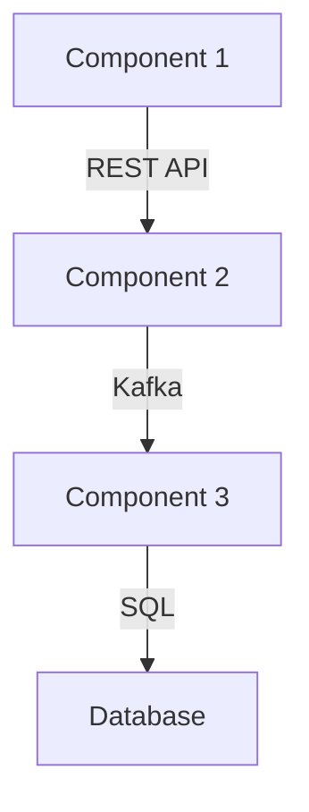
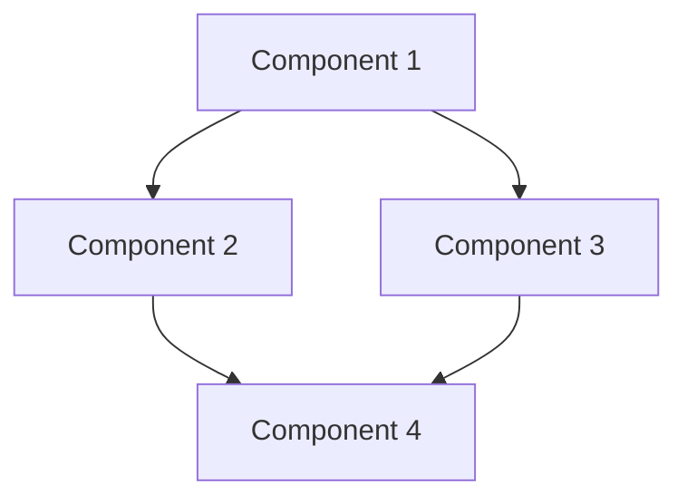

User input: $ARGUMENTS

## Behavioral Rules

> **CRITICAL: This workflow operates in TWO mandatory stages following the TDD Red-Green-Refactor cycle. You MUST NOT skip or merge them.**
>
> ### Stage 1 — TDD Plan (ALWAYS run this first)
> - **ALWAYS** present the full Scaffolding Plan FIRST: chosen TDD approach, components, test structure (failing tests first), directory structure, integration points, prerequisites, risks.
> - The plan MUST specify which TDD pattern applies (Classic Inside-Out, Outside-In, BDD, ATDD, Contract-First, Property-Based, Data Pipeline TDD, or ML TDD).
> - The plan MUST show test files BEFORE implementation files in the proposed structure.
> - **STOP COMPLETELY after presenting the plan.** Do not generate any code, files, or scaffolding.
> - End every Stage 1 response with: **"TDD scaffolding plan ready. Please confirm to proceed, or tell me what to adjust."**
> - **DO NOT proceed to Stage 2 until the user explicitly confirms** (e.g. "yes", "proceed", "go ahead", "Y").
>
> ### Stage 2 — Implement (only after explicit user confirmation)
> - Scaffold **one component at a time** by default.
> - For EACH component, **generate failing test files FIRST (Red phase)**, then generate the minimal implementation to pass those tests (Green phase). Never scaffold implementation files without tests.
> - After generating each component's tests + implementation, **STOP and wait** for the user's instruction before moving to the next component.
> - End every per-component response with: **"Component [N/total] complete (tests + minimal implementation). Ready for next component — confirm to continue, or tell me what to adjust."**
> - Never generate multiple components in one response unless the user explicitly says "do all" or "generate everything".
>
> ### Hard Rules (never override these)
> - **NEVER** generate code or files in the same response as the plan.
> - **NEVER** assume confirmation — silence or a follow-up question is NOT confirmation.
> - If the user just asks "what would you scaffold?" or "show me the plan", present ONLY the plan — do not generate any code.
> - If the user wants to compare approaches, direct them to `tdd-compare` instead.

### Existing Project vs. New Project Rules

> **CRITICAL: Determine whether the workspace contains an existing project or is a new (greenfield) project BEFORE scaffolding.**

**Existing Project:**
- If the workspace already contains source code, `package.json`, `requirements.txt`, configuration files, or an established directory structure → treat it as an **existing project**.
- **DO NOT create new `frontend/` or `backend/` folders.** Scaffold into the existing structure — respect the actual technology stack, directory layout, naming patterns, and conventions already in use.
- If `PROJECT_STRUCTURE_AND_CONVENTIONS.md` exists, follow it strictly.

**New Project (Greenfield):**
- If the workspace is empty or the user explicitly states this is a new project → treat it as a **new project**.
- **Create the required project folders** based on the project scope:
  - **Full-stack (frontend + backend):** Create both `frontend/` and `backend/` directories at the workspace root.
  - **Frontend only:** Create a `frontend/` directory at the workspace root.
  - **Backend only:** Create a `backend/` directory at the workspace root.
- Scaffold using the default technology stacks (see below) unless the user specifies otherwise.

### Default Technology Stack (When No Language/Framework Is Specified)

> **If the user does not specify a language or framework, apply these defaults:**

| Scope | Default Stack |
|-------|---------------|
| **Frontend** | React 18+ · Vite · TypeScript (strict mode) |
| **Backend** | Fastify 5+ · TypeScript · MongoDB (via Mongoose) · @fastify/swagger + @fastify/swagger-ui |
| **Database** | MongoDB |
| **API Documentation** | Swagger (via `@fastify/swagger` + `@fastify/swagger-ui`) |

- If the user explicitly chooses a different framework/language, use their choice instead of the defaults.
- For existing projects, detect and use the **actual** stack — do not override with defaults.

### HTTP Service Rules (Frontend → Backend Communication)

> **CRITICAL: All HTTP communication from the frontend to the backend MUST go through a single custom `httpService` utility.**

- **NO external HTTP libraries** (no Axios, no ky, no got, no superagent). Use the **native `fetch` API** exclusively.
- The custom `httpService` (`src/services/httpService.ts`) wraps `fetch` and provides:
  - A configurable `BASE_URL` read from the environment variable `VITE_API_BASE_URL`.
  - Typed helper methods: `get<T>`, `post<T>`, `put<T>`, `patch<T>`, `delete<T>`.
  - Centralized error handling, request/response interceptors, and auth-header injection.
  - Content-Type defaults (`application/json`) and automatic `JSON.parse` of responses.
- **All service files** in `src/services/` must import and use `httpService` — never call `fetch` directly outside of `httpService.ts`.
- **NO Vite dev-server proxy** (`server.proxy` in `vite.config.ts`) and **NO Node.js proxy middleware**. The frontend calls the backend directly via the env-controlled `VITE_API_BASE_URL`.
- Environment files (`.env`, `.env.development`, `.env.production`) define `VITE_API_BASE_URL`:
  ```
  # .env.development
  VITE_API_BASE_URL=http://localhost:3000/api

  # .env.production
  VITE_API_BASE_URL=https://api.example.com/api
  ```

### Unit Test Mandate

> **CRITICAL: Every scaffolded implementation file MUST have a corresponding unit test file AND documentation on how to run it.**

- For **every** source file that contains logic (services, utilities, hooks, models, routes, plugins), generate a matching test file.
- Test files are co-located in a `tests/` directory mirroring the `src/` structure, or in a `__tests__/` directory adjacent to the source file.
- Frontend test files: use Vitest (bundled with Vite) — e.g., `tests/services/httpService.test.ts`, `tests/hooks/useAuth.test.ts`.
- Backend test files: use Vitest or the framework's built-in test utilities — e.g., `tests/routes/users.test.ts`, `tests/services/userService.test.ts`.
- Each test file must contain at least:
  - One **happy-path** test (expected input → expected output).
  - One **error/edge-case** test (invalid input, missing data, network failure, etc.).
- **Never scaffold an implementation file without its test.** If a component has 5 source files, it must have 5 test files.

### Unit Test Documentation Mandate

> **CRITICAL: Every component MUST include a "How to Run Unit Tests" section in its output.**

After generating each component's implementation and test files, you MUST include a **"How to Run Unit Tests"** block that documents:

1. **Install test dependencies** — the exact command to install testing libraries (e.g., `npm install --save-dev vitest`, `pip install pytest pytest-cov`).
2. **Run all tests** — the exact command to execute the full test suite for that component (e.g., `npx vitest run`, `pytest tests/ -v`).
3. **Run a single test file** — the exact command to run one specific test file (e.g., `npx vitest run tests/services/userService.test.ts`, `pytest tests/test_model.py -v`).
4. **Run tests with coverage** — the exact command to generate a coverage report (e.g., `npx vitest run --coverage`, `pytest --cov=src --cov-report=html`).

**Example output format (include this for every component):**

```
### How to Run Unit Tests

# Install test dependencies
npm install --save-dev vitest @vitest/coverage-v8

# Run all tests
npx vitest run

# Run a single test file
npx vitest run tests/services/userService.test.ts

# Run tests with coverage report
npx vitest run --coverage
```

- Adapt the commands to the component's language and test framework (Vitest for TypeScript/JavaScript, pytest for Python, JUnit for Java, etc.).
- If the component uses a `package.json` or `pyproject.toml`, also add the appropriate `test` script entry and document using `npm test` or `poetry run pytest`.
- **Never finish a component without this documentation block.** It is as mandatory as the test files themselves.

## Execution Steps

### 0. Environment Setup & Validation

**Validate Required Tools:**

1. **Version Control:**
   - Git installed and configured
   - Repository initialized (or create new repo)

2. **Language Runtimes** (based on components):
   - Python 3.8+ (for Python components)
   - Node.js 16+ (for JavaScript/React components)
   - Java 11+ (for Java components)

3. **Package Managers:**
   - pip/poetry (Python)
   - npm/yarn (Node.js)
   - maven/gradle (Java)

4. **Cloud CLIs** (if needed):
   - Azure CLI (for AKS components)
   - kubectl (for Kubernetes)
   - terraform (for IaC components)
   - databricks-cli (for Databricks components)

5. **Development Tools:**
   - Docker (for container components)
   - IDE/Editor with language support

**Validation Process:**
```bash
# Check each required tool
git --version || echo "Git not found"
python --version || echo "Python not found"
node --version || echo "Node.js not found"
docker --version || echo "Docker not found"
```

**If validation fails:**
- List missing tools with installation links
- Offer to continue with partial scaffolding
- Document missing prerequisites in README

### 1. Analyze Solution Requirements

Parse $ARGUMENTS for:
- Solution scope and components
- Technology stack
- Integration requirements
- Deployment targets

### 2. Infer Context from User's Assets

**Before discovering archetypes, analyze the user's context to augment queries.**

**If user references a PROJECT or DIRECTORY:**
```
Analyze directory structure to infer composition:
- Look for package.json, requirements.txt, pom.xml → Application type
- Look for .tf, terraform/ → Infrastructure as Code
- Look for .py + mlflow/, model/ → ML/Data Science
- Look for Dockerfile, helm/, k8s/ → Container/Kubernetes
- Look for .sql, dbt_project.yml → Data Engineering
- Look for airflow/, dags/ → Orchestration
- Look for tests/, pytest.ini → Testing focus
- Look for manifest.yaml + constitution.md → Archetype

Generate context description:
"Project composition: {inferred_type} with {key_technologies}"
```

**If user references a FILE:**
```
Analyze file to infer purpose:
- .py → Python (check imports for framework: fastapi, pyspark, sklearn, etc.)
- .sql → SQL queries
- .tf → Terraform infrastructure
- .tsx/.jsx → React frontend
- .yaml/.yml → Configuration (check content: k8s, airflow, etc.)
- .sh/.bash → Automation scripts
- .md → Documentation

Generate context description:
"File type: {extension}, Purpose: {inferred_purpose}, Framework: {detected_framework}"
```

**Build Augmented Query for each component:**
```
${AUGMENTED_QUERY} = "${CONTEXT_DESCRIPTION}. Component: {component_description}"
```

### 3. Identify Required Components

**Component Discovery Process:**

For each component mentioned in requirements, identify the appropriate component type by analyzing the user's request:

**Component Scoring Algorithm:**

Score each component against the user's query:
1. **Exact component name match** → +50 points
2. **Display name match** → +30 points
3. **Keyword match** (exact) → +10 points per keyword
4. **Keyword partial match** → +3 points per partial
5. **Pattern match** (component in matched pattern) → +15 points
6. **Technology match** (user specified tech) → +5 points

Select components scoring > 15 points, ranked by score descending.

**Conflict Resolution:**
If multiple components score similarly:
- Prefer components that integrate better with other selected components
- Prefer simpler components for initial scaffolding
- Document alternative components in plan

1. **Match component keywords** to determine TDD component type:
   - Unit testing: unit, test, assert, isolated, pure-function, logic, mock
   - Integration testing: integration, service-test, API-test, component-interaction
   - BDD: BDD, gherkin, cucumber, given-when-then, scenario, feature
   - ATDD: ATDD, acceptance, criteria, FitNesse, robot-framework
   - Contract testing: contract, pact, consumer-driven, provider, API-contract
   - Property testing: property-based, hypothesis, invariant, generative, fuzzing
   - Frontend: UI, frontend, React, Vue, Angular, web app, component
   - Backend API: API, REST, GraphQL, backend, service, endpoint, route
   - Database: SQL, database, query, schema, data store
   - Data pipeline: pipeline, transform, ETL, schema, data-quality
   - Infrastructure: deploy, infrastructure, Kubernetes, container, cloud
   - Testing framework: pytest, jest, Vitest, JUnit, mocha, RSpec
   - Documentation: document, docs, guide, readme

2. **Determine the action** from the query:
   - scaffold: create, generate, build, new, setup, init
   - debug: debug, fix, troubleshoot, diagnose, error, issue, problem
   - test: test, validate, verify, check, quality, coverage
   - document: document, docs, documentation, readme, guide, explain
   - refactor: refactor, improve, optimize, clean, restructure, modernize
   - compare: compare, difference, versus, vs, alternative, options
   - Default: scaffold

3. **Select the best-matching component type** for each requirement

### 3.5. Technology Stack Selection

For each component, select appropriate technologies based on:

**Decision Factors:**
1. **User Requirements:** Explicitly requested technologies
2. **Existing Stack:** Technologies already in the project
3. **Team Expertise:** Known team skills
4. **Integration:** Compatibility with other components
5. **Industry Standards:** Best practices for the domain

**Technology Defaults by Component Type:**

| Component Type | Default Stack | Alternatives |
|----------------|---------------|--------------|
| Data Pipeline | Python + PySpark | Scala + Spark, SQL |
| ML Training | Python + MLflow + XGBoost | TensorFlow, PyTorch |
| ML Inference | FastAPI + Docker | Flask, TorchServe |
| Frontend | React 18+ + Vite + TypeScript (strict) | Vue, Angular, Svelte |
| Backend API | **Fastify 5+ + TypeScript + MongoDB (Mongoose) + @fastify/swagger** | Express, NestJS, FastAPI |
| Database | **MongoDB** (via Mongoose ODM) | PostgreSQL, MySQL, Snowflake |
| API Documentation | **Swagger** (`@fastify/swagger` + `@fastify/swagger-ui`) | — |
| Orchestration | Airflow | Prefect, Dagster, Temporal |
| Infrastructure | Terraform + Kubernetes | Pulumi, CloudFormation |
| Testing (Frontend) | **Vitest** | Jest |
| Testing (Backend) | **Vitest** + `fastify.inject()` + `mongodb-memory-server` | Jest, node:test |
| Testing (Python) | pytest + coverage | unittest |
| Documentation | Markdown + MkDocs | Sphinx, Docusaurus |

> **Note:** The Backend API default has changed from FastAPI to **Fastify + TypeScript + MongoDB + Swagger**. Only use FastAPI if the user explicitly requests Python or FastAPI.

**Document Technology Choices:**
Include rationale for each technology selection in the scaffolding plan.

**Frontend Development Standards (React + Vite + TypeScript):**

When scaffolding frontend components, follow these strict rules:

1. **Component Structure:**
   - One React component per file
   - Use PascalCase with `.tsx` extension
   - Component naming conventions:
     - `Component` suffix for reusable UI (e.g., `DetailPanelComponent.tsx`)
     - `Page` suffix for route pages (e.g., `DesignerPage.tsx`)
   - Exception: Root components and simple wrappers (e.g., `App.tsx`, `Header.tsx`)

2. **Type Definitions:**
   - **NEVER define TypeScript interfaces/types in component files**
   - All types must be in `/src/types/` directory
   - Organize by feature domain and purpose:
     - Domain entity types (e.g., `UserType.ts`, `ProductType.ts`)
     - API/Service types (e.g., `ApiResponseType.ts`, `EndpointType.ts`)
     - Component prop types (e.g., `ButtonProps.ts`, `ModalProps.ts`)
     - Shared/Common types (e.g., `CommonType.ts`, `UtilityType.ts`)
   - Use barrel exports in `/src/types/index.ts`
   - Import types: `import type { TypeName } from '../types'`

3. **Naming Conventions:**
   - **Files**: PascalCase for components (`.tsx`), camelCase for utilities (`.ts`)
   - **Directories**: kebab-case for multi-word (e.g., `detail-panel/`, `graph-canvas/`)
   - **Functions**: camelCase, verb-first (e.g., `getWorkflowDetails()`, `handlePublish()`)
   - **Constants**: SCREAMING_SNAKE_CASE (e.g., `DEFAULT_LEFT_SIZE`, `NODE_TYPES`)
   - **Types/Interfaces**: PascalCase with suffixes (e.g., `WorkflowDetailsType`, `DetailPanelProps`)

4. **Project Organization:**
   - `/src/components/` - UI presentation components
   - `/src/services/` - HTTP service + domain API services
     - `httpService.ts` — ⚠️ CORE — custom `fetch` wrapper, sole HTTP gateway
     - `userService.ts`, `productService.ts`, etc. — domain services that import `httpService`
   - `/src/types/` - Type definitions
   - `/src/utils/` - Pure utility functions and **global constants**
   - `/src/context/` - State management
   - `/src/hooks/` - Reusable logic
   - Feature-based grouping within components

5. **Code Quality:**
   - Use TypeScript strict mode
   - Implement proper error handling
   - Follow existing theme system for styling
   - Use barrel exports for clean imports
   - Consistent component structure: imports → interface → component → export
   - Semantic naming for readability

6. **Global Constants:**
   - All global constants must be in `src/utils/` folder
   - Use SCREAMING_SNAKE_CASE naming

7. **HTTP Service (MANDATORY):**
   - All backend HTTP calls go through `src/services/httpService.ts`
   - Uses **native `fetch` API** only — **NO Axios, ky, got, or any external HTTP library**
   - `BASE_URL` read from `import.meta.env.VITE_API_BASE_URL`
   - Typed helpers: `get<T>`, `post<T>`, `put<T>`, `patch<T>`, `delete<T>`
   - Centralized error handling, auth-header injection, Content-Type defaults
   - All domain service files import `httpService` — never call `fetch` directly

8. **Environment Variables & API Base URL:**
   - All backend endpoint URLs controlled via `VITE_API_BASE_URL` env var
   - `.env.development`: `VITE_API_BASE_URL=http://localhost:3000/api`
   - `.env.production`: `VITE_API_BASE_URL=https://api.example.com/api`
   - **NO `server.proxy`** in `vite.config.ts` — **NO Node.js proxy middleware**
   - The browser calls the backend origin directly; CORS is handled on the backend

9. **Unit Tests (MANDATORY):**
   - Every service, hook, and utility file must have a corresponding test file
   - Use **Vitest** (ships with Vite)
   - Test files in `tests/` directory mirroring `src/` structure
   - Minimum per test file: 1 happy-path test + 1 error/edge-case test

**Backend Development Standards (Fastify + TypeScript + MongoDB + Swagger):**

> **Note:** These are the DEFAULT backend standards when no framework is specified. If the user requests a different backend stack, adapt accordingly. For existing projects, follow the actual stack in use.

When scaffolding backend components, follow these rules:

1. **Project Structure:**
   ```
   backend/
   ├── src/
   │   ├── routes/              # Fastify route modules (auto-loaded)
   │   │   └── v1/
   │   │       ├── users/
   │   │       │   ├── index.ts         # Route definitions
   │   │       │   └── schema.ts        # JSON Schema for request/response
   │   │       └── products/
   │   │           ├── index.ts
   │   │           └── schema.ts
   │   ├── models/              # Mongoose models & schemas
   │   │   ├── User.ts
   │   │   └── Product.ts
   │   ├── services/            # Business logic layer
   │   │   ├── userService.ts
   │   │   └── productService.ts
   │   ├── plugins/             # Fastify plugins (db, auth, swagger, cors)
   │   │   ├── database.ts      # MongoDB/Mongoose connection
   │   │   ├── swagger.ts       # @fastify/swagger + @fastify/swagger-ui
   │   │   ├── cors.ts          # @fastify/cors — allows frontend origin(s)
   │   │   └── auth.ts          # @fastify/jwt auth plugin
   │   ├── hooks/               # Fastify lifecycle hooks
   │   │   └── authenticate.ts  # Auth preHandler hook
   │   ├── utils/               # Utility functions
   │   │   ├── errors.ts        # Custom error classes
   │   │   └── helpers.ts
   │   ├── config/
   │   │   └── env.ts           # Environment variable schema & loader
   │   ├── types/
   │   │   └── index.ts
   │   ├── app.ts               # Fastify instance factory
   │   └── server.ts            # Entry point — starts the server
   ├── tests/
   │   ├── routes/
   │   │   └── users.test.ts
   │   ├── services/
   │   │   └── userService.test.ts
   │   └── setup.ts             # Test setup (mongodb-memory-server)
   ├── .env.example
   ├── package.json
   ├── tsconfig.json
   └── README.md
   ```

2. **Naming Conventions:**
   - **Route modules:** kebab-case directories, `index.ts` + `schema.ts` per resource
   - **Models:** PascalCase — `User.ts`, `Product.ts`
   - **Services:** camelCase — `userService.ts`, `productService.ts`
   - **Plugins:** camelCase — `database.ts`, `swagger.ts`
   - **Functions:** camelCase, verb-first — `getUser()`, `createOrder()`
   - **Constants:** SCREAMING_SNAKE_CASE — `MAX_RETRY_COUNT`
   - **Interfaces/Types:** PascalCase with suffixes — `UserDocument`, `CreateUserBody`

3. **Route Pattern:**
   ```typescript
   // src/routes/v1/users/index.ts
   import type { FastifyPluginAsync } from 'fastify';
   import { getUsersSchema, createUserSchema } from './schema';
   import { userService } from '../../../services/userService';

   const usersRoutes: FastifyPluginAsync = async (fastify) => {
     fastify.get('/', { schema: getUsersSchema }, async (request, reply) => {
       const users = await userService.getAll();
       return reply.send(users);
     });

     fastify.post('/', { schema: createUserSchema }, async (request, reply) => {
       const user = await userService.create(request.body);
       return reply.code(201).send(user);
     });
   };
   export default usersRoutes;
   ```

4. **JSON Schema Validation:**
   - Define request/response schemas in `schema.ts` per route module
   - Fastify validates automatically — invalid requests get 400 before handler runs
   - Schemas double as Swagger documentation

5. **Swagger / API Documentation:**
   - Register `@fastify/swagger` + `@fastify/swagger-ui` in `src/plugins/swagger.ts`
   - Swagger UI at `/documentation` in development
   - All routes must have `schema` definitions to appear in Swagger
   - Use `tags` to group endpoints by resource

6. **MongoDB / Mongoose:**
   - Connect via Fastify plugin (`src/plugins/database.ts`)
   - Connection string from `MONGODB_URI` environment variable
   - Define indexes in schema, use `lean()` for read-only queries
   - Never return `password` — use `select: false`
   - Use transactions for multi-document writes

7. **CORS Configuration:**
   - `@fastify/cors` configured to allow the frontend origin (`CORS_ORIGIN` env var)
   - Default: `origin: process.env.CORS_ORIGIN || 'http://localhost:5173'`
   - **The frontend does NOT use a proxy** — CORS must be properly configured here

8. **Environment Variables:**
   - All config via `.env` (loaded with `@fastify/env` or `dotenv`)
   - Validate at startup — fail fast if required vars are missing
   - Required: `PORT`, `HOST`, `MONGODB_URI`, `JWT_SECRET`, `CORS_ORIGIN`, `NODE_ENV`, `LOG_LEVEL`
   - Provide `.env.example` template (committed to git)

9. **Error Handling:**
   - Custom error classes (`AppError`, `NotFoundError`, `ValidationError`)
   - Global `setErrorHandler` for consistent responses
   - Pino logger (Fastify built-in) for structured logging
   - Never expose stack traces in production

10. **Unit Tests (MANDATORY):**
    - Every route, service, and utility file must have a corresponding test file
    - Use **Vitest** or Fastify's built-in `fastify.inject()` for route testing
    - Use `mongodb-memory-server` for integration tests (no real DB needed)
    - Minimum per test file: 1 happy-path test + 1 error/edge-case test

**Reference Documentation:**
All scaffolding must comply with `PROJECT_STRUCTURE_AND_CONVENTIONS.md` if it exists:
- For frontend components: Check `{frontend_folder}/docs/PROJECT_STRUCTURE_AND_CONVENTIONS.md`
- For backend components: Check `{backend_folder}/docs/PROJECT_STRUCTURE_AND_CONVENTIONS.md`
- If not found in component folder, check project root `./docs/PROJECT_STRUCTURE_AND_CONVENTIONS.md`

**Component Identification via Keywords:**

| Domain | Keywords |
|--------|----------|
| TDD cycle | TDD, test-driven, red-green-refactor, failing-test, red, green, refactor |
| Unit testing | unit, test, assertion, isolate, arrange-act-assert, spy, fake |
| Integration testing | integration, service-test, API-test, component-interaction, in-process |
| BDD | BDD, behavior, gherkin, cucumber, given-when-then, scenario, feature, step-definition |
| ATDD | ATDD, acceptance, acceptance-criteria, FitNesse, robot-framework, end-to-end |
| Contract testing | contract, pact, consumer-driven, provider, API-contract, schema-contract, Dredd |
| Property testing | property-based, hypothesis, invariant, generative, fuzzing, shrinking, QuickCheck |
| Mocking & doubles | mock, stub, spy, double, test-double, mockito, sinon, unittest.mock, WireMock |
| Test frameworks | pytest, JUnit, jest, Vitest, mocha, NUnit, Jasmine, RSpec, Spock |
| Test coverage | coverage, branch-coverage, line-coverage, mutation, threshold, lcov, jacoco |
| Frontend testing | React, component-test, render, user-event, DOM, snapshot, Testing-Library |
| Backend API testing | route, endpoint, HTTP, inject, fastify.inject, supertest, httpx, MockMvc |
| Data testing | pipeline, schema, data-quality, dbt-test, great-expectations, pandera, deequ |
| ML testing | model-evaluation, metric-threshold, accuracy, drift, deep-checks, evidently |
| Performance testing | load-test, stress, benchmark, latency, throughput, k6, locust, JMeter |
| Security testing | security, OWASP, vulnerability, injection, auth-test, penetration |
| CI/CD quality gate | CI, CD, coverage-gate, quality-gate, lint, build-check, pre-commit |
| Test documentation | test-strategy, test-plan, coverage-report, living-docs, spec |
| Frontend | UI, frontend, React, Vue, Angular, web app, SPA, SSR |
| Backend API | API, REST, GraphQL, backend, service, endpoint, FastAPI |
| Full-stack app | application, app, web, fullstack, maker |
| Database/SQL | SQL, database, query, schema, data store, Snowflake, CTE |
| Infrastructure | deploy, infrastructure, Kubernetes, container, cloud, Terraform, IaC |
| Documentation | document, docs, guide, readme, release notes, changelog |

**Common TDD Scaffold Patterns:**

**Pattern: Classic TDD (Inside-Out)**
- Approach: Red → Green → Refactor cycle starting from the smallest failing unit test
- Components: unit-test-code-coverage, code-reviewer, regression-test-coverage, quality-guardian
- Keywords: unit, assert, arrange-act-assert, isolated, pure-function, logic
- Scaffold focus: Test file structure, test runner config, assertion library, one test file per source file

**Pattern: Outside-In TDD (London School)**
- Approach: Write failing acceptance test → mock collaborators → drive unit tests inward
- Components: unit-test-code-coverage, regression-test-coverage, integration-specialist, code-reviewer
- Keywords: mock, stub, outside-in, acceptance, London, top-down, collaborator
- Scaffold focus: Acceptance test harness, mock/stub configuration, integration test fixtures, test double helpers

**Pattern: BDD (Behavior Driven Development)**
- Approach: Given/When/Then scenarios → step definitions → implementation → living docs
- Components: unit-test-code-coverage, regression-test-coverage, documentation-evangelist, jira-user-stories
- Keywords: BDD, gherkin, cucumber, given-when-then, scenario, feature, step-definition
- Scaffold focus: Feature file structure, step definition files, BDD framework config, living documentation output

**Pattern: ATDD (Acceptance Test Driven Development)**
- Approach: Acceptance criteria from tickets → automate as tests → implement to pass
- Components: regression-test-coverage, jira-user-stories, documentation-evangelist, unit-test-code-coverage, quality-guardian
- Keywords: ATDD, acceptance, criteria, FitNesse, robot-framework, end-to-end
- Scaffold focus: Acceptance test framework, test suite structure, CI integration, criteria traceability

**Pattern: Contract-First TDD**
- Approach: Define API contract → consumer tests → provider verification → implementation
- Components: integration-specialist, unit-test-code-coverage, documentation-evangelist, aks-devops-deployment
- Keywords: contract, pact, consumer-driven, provider, API-contract, Dredd, Prism
- Scaffold focus: Pact broker setup, consumer test structure, provider verification pipeline, contract files

**Pattern: Property-Based TDD**
- Approach: Define invariants and properties → auto-generate inputs → shrink failures → fix
- Components: unit-test-code-coverage, quality-guardian, data-validation, interpretability-analyst
- Keywords: property-based, hypothesis, invariant, generative, fuzzing, shrinking, QuickCheck
- Scaffold focus: Property library config, custom generators, invariant test file structure

**Pattern: TDD for Data Pipelines**
- Approach: Write schema/contract tests → pipeline unit tests → integration tests
- Components: unit-test-code-coverage, quality-guardian, data-pipeline-builder, transformation-alchemist, data-validation
- Keywords: pipeline, schema, data-quality, dbt-test, great-expectations, pandera, deequ
- Scaffold focus: Test data fixtures, pipeline test harness, quality gate config, schema validation setup

**Pattern: TDD for ML Models**
- Approach: Define metric thresholds → evaluation test harness → train until tests pass
- Components: unit-test-code-coverage, language-model-evaluation, model-architect, quality-guardian
- Keywords: model-evaluation, metric-threshold, accuracy, drift, deep-checks, evidently, mlflow
- Scaffold focus: Evaluation framework setup, test harness structure, metric threshold config, MLflow test integration

**Pattern: Full-Stack Web Application (TDD)**
- Approach: API contract tests first → backend unit + route tests → frontend component tests
- Components: app-maker (frontend-only + backend-only), integration-specialist, unit-test-code-coverage, observability
- Default stack: React 18+ + Vite + TypeScript (frontend) ↔ Fastify + TypeScript + MongoDB + Swagger (backend)
- Frontend communicates via custom `httpService` (native `fetch`, env-controlled `VITE_API_BASE_URL`, no proxy)
- Backend provides CORS via `@fastify/cors`, Swagger UI at `/documentation`
- Scaffold focus: Vitest config for both frontend/backend, test file co-location, httpService mock, mongodb-memory-server

### 4. Present Scaffolding Plan (MANDATORY — STAGE 1)

> **STAGE 1: Present the plan ONLY. Do NOT generate any code. STOP after the plan and wait for explicit user confirmation before proceeding.**

**This step has THREE parts:**
1. **Detailed Scaffolding Plan** — comprehensive component breakdown, architecture, integration points
2. **Final Proposed Outcome Summary** — plain-language summary of what will be delivered
3. **Approval Gate** — explicit request for user approval, adjustments, or cancellation

Present the plan in this format:

---

## Scaffolding Plan

**Solution Pattern:** {matched_pattern_name}
**Total Components:** {count}
**Estimated Files:** {file_count}
**Estimated Setup Time:** {time_estimate}
**Implementation Mode:** One component at a time (default) — say "do all" to generate everything at once

### Component Breakdown

| # | Component | Type | Technology | Files | Dependencies | Score |
|---|-----------|------|------------|-------|--------------|-------|
| 1 | {name} | {type} | {tech} | {count} | {deps} | {score} |
| 2 | {name} | {type} | {tech} | {count} | {deps} | {score} |

### Directory Structure
```
project-root/
├── component-1/
│   ├── src/
│   ├── tests/
│   └── README.md
├── component-2/
│   ├── src/
│   ├── tests/
│   └── README.md
├── docs/
├── tests/integration/
└── README.md
```

### Integration Points
1. **{Component A} → {Component B}**
   - Interface: {API/Message/File}
   - Data Format: {JSON/Parquet/CSV}
   - Protocol: {REST/gRPC/Kafka}

### Architecture Diagram


### Technology Justification
- **{Technology}:** {Reason for selection}

### Prerequisites
- [ ] {Tool/Service} installed
- [ ] {Environment variable} configured
- [ ] {Access/Permission} granted

### Risks & Considerations
- **Risk:** {Description}
  - **Mitigation:** {Strategy}

---

## Final Proposed Outcome Summary

> **This is what I will deliver if you approve:**

**Components to be Generated:** {N} components
**Total Files to be Created:** {N} files across {M} directories
**Estimated Setup Time:** {X hours/days}

**What You'll Get:**

1. **Component Scaffolds:**
   - {List each component with brief description}
   - {e.g., "collaborative-filtering-model: Python ML training pipeline with MLflow tracking"}
   - {e.g., "inference-orchestrator: FastAPI service with Docker containerization"}
   - {e.g., "observability: OpenTelemetry instrumentation for metrics and traces"}

2. **Integration Layer:**
   - {e.g., "REST API contracts between frontend and backend"}
   - {e.g., "Kafka message schemas for event streaming"}
   - {e.g., "Shared type definitions and data models"}

3. **Configuration & Infrastructure:**
   - {e.g., "Environment configuration files (.env.example, config.yaml)"}
   - {e.g., "Docker Compose for local development"}
   - {e.g., "Kubernetes manifests for production deployment"}

4. **Testing Framework:**
   - {e.g., "Unit test scaffolds for each component"}
   - {e.g., "Integration test suite for API endpoints"}
   - {e.g., "pytest/jest configuration with coverage reporting"}

5. **Documentation:**
   - {e.g., "README.md with setup instructions"}
   - {e.g., "Architecture diagrams (Mermaid)"}
   - {e.g., "API documentation (OpenAPI/Swagger)"}
   - {e.g., "Deployment guide and operational runbook"}

**Technology Stack:**
- **Languages:** {e.g., "Python 3.11, TypeScript 5.0"}
- **Frameworks:** {e.g., "FastAPI, React + Vite"}
- **Infrastructure:** {e.g., "Docker, Kubernetes, Terraform"}
- **Data:** {e.g., "PostgreSQL, Redis, Kafka"}

**What Will NOT Be Included:**
- ❌ Production secrets or credentials (only .env.example templates)
- ❌ Fully implemented business logic (scaffolds with TODOs for customization)
- ❌ Production-ready data (sample/mock data only)

**Implementation Mode:** One component at a time (default) — you can say "do all" to generate everything at once

**Estimated Effort:** {X hours/days}
**Risk Level:** {Low/Medium/High}

---

## Approval Required

> **I need your approval before proceeding. Please choose one:**

**Option 1: Approve All Components**
- Reply: "Approved" or "Proceed" or "Go ahead"
- I will scaffold all components one at a time (default mode)
- After each component, I'll pause and wait for your confirmation to continue

**Option 2: Approve Specific Components Only**
- Reply: "Approve components 1, 3, and 5 only" (or similar)
- I will scaffold only the components you specify

**Option 3: Generate All at Once**
- Reply: "Do all" or "Generate everything" or "Scaffold all at once"
- I will generate all components in a single response without pausing between them

**Option 4: Request Adjustments**
- Reply with specific changes you want to the plan
- Examples:
  - "Use PostgreSQL instead of MongoDB"
  - "Add a caching layer with Redis"
  - "Skip the observability component for now"
  - "Use Flask instead of FastAPI"
  - "Add more detail on the integration layer"
- I will revise the plan based on your feedback and present it again

**Option 5: Cancel**
- Reply: "Cancel" or "Stop"
- I will not proceed with any scaffolding

---

> **Waiting for your response...**

---

> ⚠️ **STOP — DO NOT GENERATE CODE YET.**
> Present the plan above, then end your response with exactly this line:
> **"Scaffolding plan ready. Please confirm to proceed, or tell me what to adjust."**
>
> **Only move to Step 5 after the user explicitly confirms.**

### 5. Generate Component Scaffolds (STAGE 2 — only after explicit user confirmation)

> **STAGE 2: Default mode is one component per response. After each component, STOP and wait for the user's next instruction.**
> **Only generate all components in one response if the user explicitly said "do all" or "generate everything".**

For each component, follow this per-component loop:

1. Generate the scaffold for the current component only
2. End the response with: **"Component [N/total] — [{component_name}] complete. Confirm to continue to component [N+1], or tell me what to adjust."**
3. **STOP. Wait for user instruction before generating the next component.**

**Component Scaffolding Guidelines:**

**Data Ingestion Components:**
- Create data source connectors
- Implement incremental loading logic
- Add error handling and retry mechanisms
- Include data validation

**Data Transformation Components:**
- Set up transformation framework (PySpark, SQL, etc.)
- Create transformation logic with idempotency
- Add data quality checks
- Include unit tests

**ML Training Components:**
- Create training pipeline
- Set up experiment tracking
- Implement model versioning
- Add evaluation metrics

**ML Inference Components:**
- Create inference API
- Implement model loading
- Add request/response validation
- Include monitoring hooks

**Frontend Components (React + Vite + TypeScript):**
- Set up framework (React 18+ + Vite + TypeScript strict mode)
- Create component structure following naming conventions:
  - Components in `/src/components/` with `Component` or `Page` suffix
  - One component per `.tsx` file
- Add routing (React Router) and state management (Context API)
- Include styling framework (Tailwind CSS or theme system)
- Create type definitions in `/src/types/`:
  - Component prop types
  - Feature domain types
  - Barrel export in `index.ts`
- Set up directory structure:
  - `/src/components/` - UI components
  - `/src/services/` - `httpService.ts` (CORE fetch wrapper) + domain services
  - `/src/types/` - TypeScript types
  - `/src/utils/` - Utilities and global constants
  - `/src/context/` - Context providers
  - `/src/hooks/` - Custom hooks
- **Scaffold `src/services/httpService.ts`** — custom `fetch` wrapper with typed helpers (`get<T>`, `post<T>`, `put<T>`, `patch<T>`, `delete<T>`), reading `VITE_API_BASE_URL` from env
- **Scaffold domain service files** (e.g., `userService.ts`) that import `httpService` — never `fetch` directly
- **Create `.env.development`** (`VITE_API_BASE_URL=http://localhost:3000/api`) and **`.env.production`**
- **NO `server.proxy`** in `vite.config.ts` — **NO Node.js proxy middleware**
- Configure TypeScript strict mode
- Add barrel exports for clean imports
- **Scaffold unit tests for every service, hook, and utility** (Vitest) — minimum 1 happy-path + 1 error test per file

**Backend API Components (Fastify + TypeScript + MongoDB + Swagger):**
- Set up Fastify 5+ with TypeScript (strict mode)
- Create route modules in `src/routes/v1/{resource}/index.ts` + `schema.ts`
- Register plugins: `@fastify/swagger`, `@fastify/swagger-ui`, `@fastify/cors`, `@fastify/jwt`, `@fastify/env`
- Connect MongoDB via Mongoose in `src/plugins/database.ts` (connection string from `MONGODB_URI` env var)
- Create Mongoose models in `src/models/` (PascalCase, e.g., `User.ts`)
- Create business logic services in `src/services/` (camelCase, e.g., `userService.ts`)
- Add JWT authentication via `@fastify/jwt` + `authenticate` preHandler hook
- Configure CORS to allow frontend origin(s) via `CORS_ORIGIN` env var
- Swagger UI accessible at `/documentation` in development
- Define JSON Schema for every route (validation + Swagger docs)
- Create `.env.example` with all required variables (`PORT`, `MONGODB_URI`, `JWT_SECRET`, `CORS_ORIGIN`, etc.)
- Add global error handler (`setErrorHandler`) with custom error classes
- **Scaffold unit tests for every route, service, and utility** (Vitest + `fastify.inject()` + `mongodb-memory-server`) — minimum 1 happy-path + 1 error test per file
- Note: Only use FastAPI/Express if user explicitly requests Python/Express

**Database Components:**
- Create schema definitions
- Set up migrations
- Add query optimization
- Include backup procedures

**Infrastructure Components:**
- Create IaC templates (Terraform, Helm, etc.)
- Set up deployment configurations
- Add health checks
- Include scaling policies

### 5.5. Scaffolding Mode

**Default mode — one component at a time (always active unless user overrides):**

1. **Component priority order:**
   - Core components first (data sources, models)
   - Integration components second (APIs, orchestration)
   - Supporting components last (monitoring, docs)

2. **Per-component loop:**
   - Generate scaffold for current component
   - Generate unit test files for every implementation file in the component
   - Include a **"How to Run Unit Tests"** section with exact commands (install deps, run all, run single, run with coverage)
   - Validate the component
   - End response: **"Component [N/total] complete. Confirm to continue, or tell me what to adjust."**
   - **STOP — wait for user instruction before the next component**

**Bulk mode — only when user explicitly requests it:**
- User says: "do all", "generate everything", or "scaffold all at once"
- In this case only: generate all components in sequence without stopping between them
- Still end the full bulk response with the completion prompt

### 5.6. Dependency Conflict Resolution

**Detect Conflicts:**
- Scan all component dependencies
- Identify version conflicts
- Check for incompatible packages

**Resolution Strategies:**

1. **Version Pinning:**
   - Use compatible version ranges
   - Document version constraints
   - Test with resolved versions

2. **Dependency Isolation:**
   - Separate virtual environments per component
   - Use Docker containers for isolation
   - Microservice architecture for incompatible deps

3. **Upgrade Path:**
   - Identify which components can upgrade
   - Document breaking changes
   - Provide migration scripts

**Report Format:**
```
⚠️ Dependency Conflicts Detected:

Component A requires: pandas==1.5.0
Component B requires: pandas==2.0.0

Resolution: Use pandas>=1.5.0,<3.0.0
Impact: Component A may need code updates
Action: Review pandas 2.0 migration guide
```

### 6. Create Integration Layer

Generate integration code between components:

**Data Flow Integration:**
- Component outputs → Component inputs
- Message passing contracts
- Event schemas

**Dependency Management:**
- Shared configurations
- Environment variables
- Secret references

**Error Handling:**
- Cross-component error propagation
- Retry strategies
- Circuit breakers

### 6.5. Generate Configuration Management

**Centralized Configuration:**

Create configuration hierarchy:
```
config/
├── base.yaml          # Base configuration
├── dev.yaml           # Development overrides
├── staging.yaml       # Staging overrides
├── prod.yaml          # Production overrides
└── secrets.example    # Secret templates (no actual secrets)
```

**Environment Variables:**
Create `.env.example`:
```bash
# Database
DATABASE_URL=postgresql://localhost:5432/dbname

# API Keys (DO NOT COMMIT ACTUAL KEYS)
API_KEY=your_api_key_here

# Feature Flags
ENABLE_FEATURE_X=false
```

**Configuration Loading:**
Generate configuration loader that:
- Loads base config
- Overlays environment-specific config
- Reads environment variables
- Validates required settings
- Provides type-safe access

**Secret Management:**
- Document secret requirements
- Provide key vault integration templates
- Never hardcode secrets in generated code
- Include secret rotation guidance

### 7. Generate Dependency Graph

Create visual representation of component dependencies:



Save to: `docs/architecture.mmd`

### 8. Generate Solution Documentation

Create comprehensive documentation package:

**Files Generated:**
- `README.md` - Solution overview
- `docs/ARCHITECTURE.md` - Architecture documentation
- `docs/DEPLOYMENT.md` - Deployment guide
- `docs/OPERATIONS.md` - Operational runbook
- `docs/DEVELOPMENT.md` - Developer guide

### 9. Generate Comprehensive Testing Framework

**Test Structure:**
```
tests/
├── unit/
│   ├── component_1/
│   │   ├── test_module_a.py
│   │   └── test_module_b.py
│   └── component_2/
├── integration/
│   ├── test_component_integration.py
│   └── test_data_flow.py
├── e2e/
│   └── test_full_workflow.py
├── performance/
│   └── test_load.py
├── fixtures/
│   ├── sample_data.json
│   └── mock_responses.py
├── conftest.py
└── pytest.ini
```

**Generated Test Types:**

1. **Unit Tests (per component):**
   ```python
   # test_component.py
   import pytest
   from component import function_to_test
   
   def test_basic_functionality():
       result = function_to_test(input_data)
       assert result == expected_output
   
   def test_error_handling():
       with pytest.raises(ValueError):
           function_to_test(invalid_input)
   ```

2. **Integration Tests:**
   ```python
   # test_integration.py
   def test_component_a_to_b_flow():
       # Test data flow between components
       output_a = component_a.process(input)
       result_b = component_b.process(output_a)
       assert result_b.status == "success"
   ```

3. **Contract Tests:**
   ```python
   # test_api_contract.py
   def test_api_response_schema():
       response = api.get_data()
       assert validate_schema(response, expected_schema)
   ```

4. **Performance Tests:**
   ```python
   # test_performance.py
   import time
   
   def test_throughput():
       start = time.time()
       process_batch(large_dataset)
       duration = time.time() - start
       assert duration < max_acceptable_time
   ```

**Test Configuration:**
```ini
# pytest.ini
[pytest]
testpaths = tests
python_files = test_*.py
python_classes = Test*
python_functions = test_*
addopts = 
    --verbose
    --cov=src
    --cov-report=html
    --cov-report=term-missing
```

**CI Integration:**
Generate GitHub Actions / Azure DevOps pipeline that runs tests on:
- Every commit
- Pull requests
- Scheduled (nightly)

### 10. Validate and Report

**Validation Checks:**

For each component generated, validate:
1. **File Structure**: All required files and directories are created
2. **Code Quality**: Generated code follows best practices
3. **Dependencies**: All dependencies are properly declared
4. **Configuration**: Configuration files are complete and valid
5. **Documentation**: Basic documentation is present
6. **Tests**: Test scaffolding is in place
7. **Integration**: Integration points are properly defined

If any validation fails, report the issues and provide remediation steps.

### 10.5. Rollback and Cleanup

If scaffolding fails or user requests rollback:

**Failure Scenarios:**
- Component generation error → Log failed component, continue with others
- Integration conflict → Report conflict, suggest resolution
- Validation failure → Stop, report issues, await user decision

**Cleanup Commands:**
```bash
# Remove generated scaffolding (use with caution)
rm -rf {generated_directories}
git reset --hard HEAD  # If under version control
```

**Partial Success Handling:**
- Document which components succeeded
- Provide manual steps to complete failed components
- Offer to retry failed components individually

**Report Generation:**
```
✓ Solution Scaffold Complete

Components Generated: {count}
{list of components with archetypes}

Integration Points: {count}
{list of integrations}

Documentation: {files}
Testing Framework: {test_files}

Next Steps:
1. Review generated code and configurations
2. Customize integration layer for specific needs
3. Run integration tests: pytest tests/integration/
4. Deploy components: See docs/DEPLOYMENT.md
```

## Examples

**Example 1: Data Analytics Platform**
```
User: /tdd-scaffold Build analytics platform with ingestion, transformation, and reporting

Components Identified:
1. pipeline-builder (Data Engineering) - Ingestion
2. transformation-alchemist (Data Engineering) - Spark transformation
3. sql-query-crafter (Data Engineering) - SQL analytics
4. insight-reporter (Graph & Analytics) - Reporting dashboard
5. quality-guardian (Data Governance) - Quality checks
6. pipeline-orchestrator (Data Engineering) - Workflow orchestration

Integration: Data flow from ingestion → transformation → analytics → reporting
```

**Example 2: ML Model Deployment**
```
User: /tdd-scaffold Deploy XGBoost model with feature engineering and monitoring

Components Identified:
1. feature-architect (ML Operations) - Feature pipeline
2. gradient-boosted-trees (ML Models) - Model training
3. inference-orchestrator (ML Operations) - Model serving
4. model-ops-steward (ML Operations) - Monitoring
5. aks-devops-deployment (Infrastructure) - K8s deployment
6. observability (Infrastructure) - Telemetry

Integration: Feature store → Model → Inference API → Monitoring
```

**Example 3: Web Application with API**
```
User: /tdd-scaffold Build customer portal with React frontend and backend

Components Identified:
1. app-maker (Application Development) - React + Vite + TypeScript frontend
   - Custom httpService (native fetch, no Axios)
   - Env-controlled VITE_API_BASE_URL, no Vite proxy
2. integration-specialist (Application Development) - Fastify + MongoDB + Swagger backend
   - Mongoose models, JSON Schema validation
   - @fastify/swagger for API docs, @fastify/cors for frontend origin
3. sql-query-crafter (Data Engineering) - Database queries
4. microservice-cicd-architect (Infrastructure) - CI/CD pipeline
5. unit-test-code-coverage (Software Quality) - Testing
6. documentation-evangelist (Documentation) - API docs

Unit Tests: Every implementation file has a matching test file (Vitest)
Integration: Frontend httpService → Fastify API → MongoDB, CI/CD automation
```

**Example 5: New Full-Stack Project (No Stack Specified)**
```
User: /tdd-scaffold (empty workspace, no framework specified)

Detection: Empty workspace → new greenfield project
Default Stack Applied:
  Frontend: React 18+ · Vite · TypeScript (strict)
  Backend: Fastify 5+ · TypeScript · MongoDB (Mongoose) · Swagger

Actions:
1. Create frontend/ and backend/ directories
2. Scaffold frontend/ with:
   - src/services/httpService.ts (custom fetch wrapper)
   - .env.development (VITE_API_BASE_URL=http://localhost:3000/api)
   - vite.config.ts (NO server.proxy)
   - tests/ with unit tests for every service/hook/utility
3. Scaffold backend/ with:
   - Fastify app + routes + plugins (swagger, cors, database, auth)
   - Mongoose models + services
   - .env.example with all required vars
   - tests/ with unit tests for every route/service/utility
```

**Example 4: Interactive Scaffolding Flow (Correct Two-Stage Behavior)**
```
User: /tdd-scaffold Build a recommendation system

--- STAGE 1: AI presents plan and STOPS ---

AI: ## Scaffolding Plan

**Solution Pattern:** Recommendation System
**Total Components:** 4
**Estimated Files:** 28
**Estimated Setup Time:** 45-60 minutes
**Implementation Mode:** One component at a time (default) — say "do all" to generate everything at once

### Component Breakdown

| # | Component | Type | Technology | Files | Dependencies | Score |
|---|-----------|------|------------|-------|--------------|-------|
| 1 | collaborative-filtering-model | ML Model | Python + MLflow | 8 | numpy, pandas, mlflow | 45 |
| 2 | feature-architect | ML Ops | Python + Feast | 6 | feast, pyspark | 38 |
| 3 | inference-orchestrator | ML Ops | FastAPI + Docker | 10 | fastapi, uvicorn | 42 |
| 4 | observability | Infrastructure | OpenTelemetry | 4 | opentelemetry | 25 |

### Architecture Diagram
[mermaid diagram]

### Prerequisites / Risks
[...]

Scaffolding plan ready. Please confirm to proceed, or tell me what to adjust.

--- AI STOPS HERE. Waits for user. ---

User: yes, proceed

--- STAGE 2: AI generates component 1 ONLY, then STOPS ---

AI: ✓ Generating Component 1: collaborative-filtering-model
→ Type: ML Model
→ Technology: Python + MLflow
→ Files: src/model/train.py, src/model/evaluate.py, src/model/config.py, tests/test_model.py, ...

[full scaffold for component 1 only]

Component 1/4 — [collaborative-filtering-model] complete. Confirm to continue to component 2 (feature-architect), or tell me what to adjust.

--- AI STOPS HERE. Waits for user. ---

User: looks good, continue

--- AI generates component 2 ONLY, then STOPS ---

AI: ✓ Generating Component 2: feature-architect
→ Type: ML Ops
→ Technology: Python + Feast
→ Files: src/features/store.py, src/features/pipeline.py, ...

[full scaffold for component 2 only]

Component 2/4 — [feature-architect] complete. Confirm to continue to component 3 (inference-orchestrator), or tell me what to adjust.

--- AI STOPS HERE. Waits for user. ---
[... and so on for components 3 and 4 ...]
```

---

## Component Catalog Reference

Complete inventory of 72 components organized by category. Use this for discovery and keyword matching.

### ML Models (11)
| Component | Keywords |
|-----------|----------|
| clustering-ml-models | clustering, databricks, delta, governance, mlflow, models, notebook, scala, validation |
| collaborative-filtering-model | collaborative, filtering, governance, databricks, delta, devops, mlflow, model |
| dbscan-model | dbscan, model, monitoring, notebook, observability, python |
| forecasting-analyst | forecasting, analyst, databricks, delta, devops, governance, mlflow, monitoring |
| gradient-boosted-trees | gradient, boosted, trees, governance, lightgbm, mlflow, monitoring, validation, xgboost |
| isolation-forest-model | isolation, forest, model, monitoring, notebook, python, rest |
| logistic-regression-specialist | logistic, regression, databricks, devops, governance, mlflow, monitoring, notebook, observability |
| neural-network-model | neural, network, model, governance, mlflow, monitoring, numpy, observability, python |
| q-learning-model | q-learning, learning, model, numpy, observability, python, scala, validation |
| random-forest-model | random, forest, model, delta, governance, mlflow, monitoring, python, rest |
| siamese-neural-network | siamese, neural, network, mlflow, observability, rest, scala, validation |

### ML Operations (8)
| Component | Keywords |
|-----------|----------|
| experiment-scientist | experiment, scientist, databricks, delta, devops, governance, mlflow, monitoring |
| feature-architect | feature, architect, store, databricks, delta, devops, engineering, governance, point-in-time, training-data |
| inference-orchestrator | inference, orchestrator, aks, deployment, devops, endpoint, helm, kafka, prediction, serving |
| interpretability-analyst | interpretability, analyst, compliance, mlflow, notebook |
| language-model-evaluation | language, model, evaluation, LLM, grader, monitoring, testing, validation |
| model-architect | model, architect, experiment, feature, governance, hyperparameter, mlflow, monitoring, training |
| model-ops-steward | model-ops, steward, aks, lifecycle, compliance, databricks, delta, devops, governance, mlflow |
| insight-reporter | insight, reporter, performance, narratives, KPI, notebook, observability |

### Data Engineering (10)
| Component | Keywords |
|-----------|----------|
| data-pipeline-builder | pipeline, builder, data, databricks, delta, ingestion, loading, batch, incremental, streaming, python, scala |
| data-tdd-architect | data, solution, architect, airflow, databricks, governance, python, rest, scala |
| data-sourcing-specialist | data, sourcing, specialist, databricks, delta, governance, notebook, python |
| databricks-developer-workflow | databricks, developer, workflow, jupyter, monitoring, notebook, devops |
| databricks-workflow-creator | databricks, workflow, creator, delta, devops, governance, kafka, mlflow |
| eda-navigator | eda, navigator, exploratory, analysis, databricks, delta, devops, governance, mlflow |
| elasticsearch-stream | elasticsearch, stream, eventhub, databricks, jupyter, notebook, python |
| pipeline-orchestrator | pipeline, orchestrator, airflow, cron, dag, orchestration, scheduling, task, tws, workflow |
| sql-query-crafter | sql, query, crafter, cte, database, governance, join, select, snowflake, testing |
| transformation-alchemist | transformation, alchemist, data-quality, databricks, dataframe, delta, etl, pyspark, python, scala, spark, sql |

### Data Governance (6)
| Component | Keywords |
|-----------|----------|
| data-classification-policy | data, classification, policy, compliance, governance, monitoring, security, PII, SPI |
| data-reliability | data, reliability, availability, freshness, quality, latency, lineage, governance, monitoring, observability |
| data-security | data, security, encryption, SPI, retention, masking, compliance, governance, observability |
| data-validation | data, validation, complete, accurate, timely, consistent, contract, governance |
| quality-guardian | quality, guardian, data-quality, deequ, delta, great-expectations, pandas, python, scala, testing, threshold, validation |
| ai-ethics-advisor | ethics, advisor, compliance, governance, monitoring, security, testing, bias, fairness |

### Infrastructure & DevOps (9)
| Component | Keywords |
|-----------|----------|
| aks-devops-deployment | aks, deployment, CI/CD, container, devops, docker, fastapi, governance, helm, kubernetes, microservice |
| automation-scripter | automation, scripter, CI/CD, compliance, governance, monitoring, security, testing |
| container-tdd-architect | container, docker, dockerfile, podman, multi-stage, health-check, lifecycle, process-supervision, resource-limits |
| dev-ops-engineer | devops, engineer, governance, observability, ops, security, validation |
| key-vault-config-steward | key-vault, config, steward, airflow, fastapi, governance, observability, secrets |
| microservice-cicd-architect | microservice, CI/CD, compliance, devops, governance, observability, security |
| observability | observability, traces, metrics, logs, monitoring, opentelemetry, fastapi, python, react, telemetry |
| performance-tuner | performance, tuner, bottleneck, optimization, profiling, spark, tuning |
| terraform-cicd-architect | terraform, CI/CD, infrastructure, IaC, compliance, drift, governance, monitoring, policy, security |

### Application Development (7)
| Component | Keywords |
|-----------|----------|
| app-maker | app, application, maker, backend, fastapi, frontend, python, react, rest, security, UI, web |
| backend-only | backend, API, aks, docker, fastapi, helm, kubernetes, devops |
| demo-producer | demo, producer, playwright, python, react, testing, validation |
| frontend-only | frontend, react, security, testing, validation |
| integration-specialist | integration, specialist, fastapi, graphql, python, rest, security |
| ppt-maker | ppt, maker, powerpoint, python, presentation, slides |
| streamlit-developer | streamlit, developer, pandas, python, sql, data-app, validation |

### Graph Analytics (3)
| Component | Keywords |
|-----------|----------|
| general-graph-ontology | graph, ontology, general, databricks, delta, governance, monitoring, pyspark, security, spark |
| graph-community-detection | graph, community, detection, databricks, delta, governance, kafka, mlflow |
| ontology-engineer | ontology, engineer, RelationalAI, Snowflake, jupyter, monitoring, notebook, python |

### Software Quality (10)
| Component | Keywords |
|-----------|----------|
| code-reviewer | code-review, reviewer, snowflake, sql, python, tws, databricks, quality-gate, security |
| git-secret-remediation | git, secret, remediation, compliance, security, testing |
| java-library-upgrade | java, library, upgrade, dependency |
| java-security-vulnerability | java, security, vulnerability, CVE |
| pub-sub-load-testing | pub-sub, load, testing, kafka, validation |
| pull-review-risk | pull, review, risk, compliance, governance, monitoring, security |
| python-library-upgrade | python, library, upgrade, dependency, pip, poetry |
| python-security-vulnerability | python, security, vulnerability, CVE |
| regression-test-coverage | regression, test, coverage, automation, quality-assurance |
| unit-test-code-coverage | unit, test, coverage, java, validation |

### Documentation & Requirements (4)
| Component | Keywords |
|-----------|----------|
| documentation-evangelist | documentation, evangelist, compliance, databricks, governance, notebook, pandas, python, testing |
| jira-user-stories | jira, user, stories, acceptance-criteria, requirements, backlog |
| notebook-collaboration-coach | notebook, collaboration, coach, jupyter, jupytext, reproducibility |
| software-release-notes | release, notes, software, changelog, sprint, jira |

### Meta & Specialized (4)
| Component | Keywords |
|-----------|----------|
| archetype-architect | archetype, meta, template, generator, constitution, workflow, scaffold, quality, standard, ecosystem |
| impact-analyzer | impact, analyzer, databricks, python, scala, sql, testing |
| parallel-agent | parallel, agent, docker, python, scala, security, sql, testing |
| responsible-prompting | responsible, prompting, prompt, safety, compliance, governance, LLM |

---

## Pre-Scaffolding Validation

Before presenting the scaffolding plan, verify:
- [ ] All user requirements parsed and understood
- [ ] At least 1 component identified from catalog
- [ ] Solution pattern matched (or custom pattern documented)
- [ ] Technology stack choices justified
- [ ] Integration points identified between components
- [ ] Architecture diagram prepared
- [ ] File structure planned for each component

Before generating code (after user confirmation), verify:
- [ ] User explicitly confirmed the plan
- [ ] All dependencies documented (requirements.txt, package.json, etc.)
- [ ] Configuration files planned (.env.example, config.yaml, etc.)
- [ ] Test structure defined for each component
- [ ] Documentation outline prepared

## Required Output Structure

Every response from this workflow MUST contain the following sections:

1. **Scaffolding Plan** (MANDATORY, before any code generation)
   - Component table mapping requirements to specific components from the catalog
   - Matched solution pattern name
   - Architecture diagram (Mermaid)
   - Integration points between components
   - **Final Proposed Outcome Summary** — plain-language summary of deliverables (what components will be generated, what files will be created, what technology stack will be used, what will NOT be included)
   - **Approval Gate** — explicit request for user to Approve All / Approve Specific Components / Generate All at Once / Request Adjustments / Cancel
   - Confirmation prompt to user

2. **Generated Scaffolds** (only after user confirms the plan)
   - Component files with technology-appropriate code
   - Integration layer
   - Configuration files

3. **Documentation & Tests**
   - README.md, architecture docs
   - Test scaffolding for each component

4. **Validation Report**
   - Summary of generated components, files, integrations
   - Next steps for the user

If the user only asks for a plan or "what would you build", present ONLY section 1 and stop.

## Notes

- **Always present the scaffolding plan first — never jump straight to code generation.**
- **Always include the "Final Proposed Outcome Summary" section — this is what the user needs to approve.**
- **Always include the "Approval Gate" section with explicit options: Approve All / Approve Specific Components / Generate All at Once / Request Adjustments / Cancel.**
- **Never proceed to Step 5 (Generate Component Scaffolds) until the user explicitly confirms.**
- **Default implementation mode is one component at a time** — after each component, stop and wait for user confirmation before continuing
- **Only generate all components at once if the user explicitly says "do all" or "generate everything"**
- If the user requests adjustments, revise the plan and present it again — do not proceed with the original plan
- If the user approves specific components only, scaffold only those components and skip the rest
- This workflow is completely standalone and does not depend on external files, scripts, or directory structures
- Component discovery uses inline keyword matching against the embedded catalog above
- Technology choices should be based on project requirements and team expertise
- All generated code should follow industry best practices and security guidelines
- For comparing alternative approaches before scaffolding, use the `tdd-compare` workflow
- The component catalog contains 72 components across 10 categories — use it as a lookup reference
- **Frontend components must follow React + Vite + TypeScript standards** as documented in the Technology Stack Selection section
- **Backend default is Fastify + TypeScript + MongoDB + Swagger** — only use FastAPI/Express if the user explicitly requests it
- **All frontend HTTP calls go through `src/services/httpService.ts`** — native `fetch` only, no Axios or external HTTP libs
- **API base URL controlled via `VITE_API_BASE_URL` env var** — no Vite proxy, no Node proxy middleware
- **CORS handled on the backend** via `@fastify/cors` — frontend calls the backend origin directly
- **Every scaffolded implementation file MUST have a corresponding unit test** — no exceptions
- **Existing projects:** scaffold into the existing structure, do not create new `frontend/`/`backend/` folders
- **New projects:** create `frontend/` and/or `backend/` directories based on scope, apply default stacks
   - README.md, architecture docs
   - Test scaffolding for each component

4. **Validation Report**
   - Summary of generated components, files, integrations
   - Next steps for the user

If the user only asks for a plan or "what would you build", present ONLY section 1 and stop.

## Notes

- **Always present the scaffolding plan first — never jump straight to code generation.**
- **Always include the "Final Proposed Outcome Summary" section — this is what the user needs to approve.**
- **Always include the "Approval Gate" section with explicit options: Approve All / Approve Specific Components / Generate All at Once / Request Adjustments / Cancel.**
- **Never proceed to Step 5 (Generate Component Scaffolds) until the user explicitly confirms.**
- **Default implementation mode is one component at a time** — after each component, stop and wait for user confirmation before continuing
- **Only generate all components at once if the user explicitly says "do all" or "generate everything"**
- If the user requests adjustments, revise the plan and present it again — do not proceed with the original plan
- If the user approves specific components only, scaffold only those components and skip the rest
- This workflow is completely standalone and does not depend on external files, scripts, or directory structures
- Component discovery uses inline keyword matching against the embedded catalog above
- Technology choices should be based on project requirements and team expertise
- All generated code should follow industry best practices and security guidelines
- For comparing alternative approaches before scaffolding, use the `tdd-compare` workflow
- The component catalog contains 72 components across 10 categories — use it as a lookup reference
- **Frontend components must follow React + Vite + TypeScript standards** as documented in the Technology Stack Selection section
- **Backend default is Fastify + TypeScript + MongoDB + Swagger** — only use FastAPI/Express if the user explicitly requests it
- **All frontend HTTP calls go through `src/services/httpService.ts`** — native `fetch` only, no Axios or external HTTP libs
- **API base URL controlled via `VITE_API_BASE_URL` env var** — no Vite proxy, no Node proxy middleware
- **CORS handled on the backend** via `@fastify/cors` — frontend calls the backend origin directly
- **Every scaffolded implementation file MUST have a corresponding unit test** — no exceptions
- **Existing projects:** scaffold into the existing structure, do not create new `frontend/`/`backend/` folders
- **New projects:** create `frontend/` and/or `backend/` directories based on scope, apply default stacks
