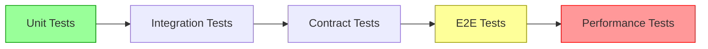

User input: $ARGUMENTS

## Behavioral Rules

> **CRITICAL: This workflow implements the TDD Red phase. Tests MUST be written BEFORE any implementation exists.**
>
> - **TDD RED PHASE:** Tests written here are EXPECTED to fail initially — that is intentional and correct. A failing test is the starting point of TDD, not an error.
> - **ALWAYS** present a structured Test Plan FIRST showing: TDD approach chosen, identified components, test scope matrix, test architecture, and coverage targets.
> - **WAIT for user confirmation** of the plan before generating test code.
> - If the user just asks "what tests do I need?" or "analyze test coverage", present ONLY the test plan — do not generate test code.
> - The test plan must include a component table mapping each testable area to the appropriate TDD approach (Classic, Outside-In, BDD, ATDD, Contract, Property-Based, etc.).
> - Tests must be written to describe BEHAVIOR, not implementation details. Test names must read as specifications (e.g., `should return 401 when token is expired`).
> - If the user wants to compare alternative testing approaches, direct them to use the `tdd-compare` workflow instead.
> - If the user wants to debug test failures, direct them to use the `tdd-debug` workflow instead.

## Execution Steps

### 0. Environment Setup

**Validate Environment:**
Check that the following are available:
- Git command is installed (for version control)
- Testing frameworks (pytest, jest, junit, etc.)
- Test runners and coverage tools
- Access to test environments

If any validation fails, halt the workflow and report the missing requirements.

### 1. Parse Input

Extract from $ARGUMENTS:
- Solution components to test
- Testing scope (unit, integration, e2e, performance)
- Test coverage goals
- Performance requirements
- Specific test scenarios

### 2. Infer Context from User's Assets

**Before generating tests, understand the user's context.**

**If user references a PROJECT or DIRECTORY:**
```
Analyze directory structure to infer composition:
- Look for package.json, requirements.txt, pom.xml → Application type
- Look for .tf, terraform/ → Infrastructure as Code
- Look for .py + mlflow/, model/ → ML/Data Science
- Look for Dockerfile, helm/, k8s/ → Container/Kubernetes
- Look for .sql, dbt_project.yml → Data Engineering
- Look for airflow/, dags/ → Orchestration
- Look for tests/, pytest.ini → Testing focus
- Look for manifest.yaml + constitution.md → Archetype

Generate context description:
"Project composition: {inferred_type} with {key_technologies}"
```

**If user references a FILE:**
```
Analyze file to infer purpose:
- .py → Python (check imports for framework: fastapi, pyspark, sklearn, etc.)
- .sql → SQL queries
- .tf → Terraform infrastructure
- .tsx/.jsx → React frontend
- .yaml/.yml → Configuration (check content: k8s, airflow, etc.)
- .sh/.bash → Automation scripts
- .md → Documentation

Generate context description:
"File type: {extension}, Purpose: {inferred_purpose}, Framework: {detected_framework}"
```

**Build Augmented Analysis:**
```
${AUGMENTED_ANALYSIS} = "${CONTEXT_DESCRIPTION}. Testing request: $ARGUMENTS"
```

### 3. Analyze Solution

**Identify Testable Components and Integration Points:**

Match components to test using keyword analysis:

1. **Score each component** against the testing context using this process:
   - **Exact name match** in query → +50 points
   - **Display name match** in query → +30 points
   - **Keyword match** (exact) → +10 points per keyword
   - **Keyword partial match** (hyphenated sub-word) → +3 points per partial
   - **Description word overlap** (words ≥4 chars) → +2 points per shared word
   - **File context keyword match** (if file provided) → +5 points per keyword

   Select all components scoring > 0 and rank by score descending.

2. **Match component keywords** to determine testable component types:

   | Domain | Keywords |
   |--------|----------|
   | TDD cycle | TDD, test-driven, red-green-refactor, failing-test, red, green, refactor |
   | Unit testing | unit, test, assertion, isolate, arrange-act-assert, spy, fake |
   | Integration testing | integration, service-test, API-test, component-interaction, in-process |
   | BDD | BDD, behavior, gherkin, cucumber, given-when-then, scenario, feature, step-definition |
   | ATDD | ATDD, acceptance, acceptance-criteria, FitNesse, robot-framework, end-to-end |
   | Contract testing | contract, pact, consumer-driven, provider, API-contract, schema-contract, Dredd |
   | Property testing | property-based, hypothesis, invariant, generative, fuzzing, shrinking, QuickCheck |
   | Mocking & doubles | mock, stub, spy, double, test-double, mockito, sinon, unittest.mock, WireMock |
   | Test frameworks | pytest, JUnit, jest, Vitest, mocha, NUnit, Jasmine, RSpec, Spock |
   | Test coverage | coverage, branch-coverage, line-coverage, mutation, threshold, lcov, jacoco |
   | Frontend testing | React, component-test, render, user-event, DOM, snapshot, Testing-Library |
   | Backend API testing | route, endpoint, HTTP, inject, fastify.inject, supertest, httpx, MockMvc |
   | Data testing | pipeline, schema, data-quality, dbt-test, great-expectations, pandera, deequ |
   | ML testing | model-evaluation, metric-threshold, accuracy, drift, deep-checks, evidently |
   | Performance testing | load-test, stress, benchmark, latency, throughput, k6, locust, JMeter |
   | Security testing | security, OWASP, vulnerability, injection, auth-test, penetration |
   | CI/CD quality gate | CI, CD, coverage-gate, quality-gate, lint, build-check, pre-commit |
   | Test documentation | test-strategy, test-plan, coverage-report, living-docs, spec |
   | Frontend | UI, frontend, React, Vue, Angular, web app, SPA, SSR |
   | Backend API | API, REST, GraphQL, backend, service, endpoint, FastAPI |
   | Full-stack app | application, app, web, fullstack, maker |
   | Database/SQL | SQL, database, query, schema, data store, Snowflake, CTE |
   | Infrastructure | deploy, infrastructure, Kubernetes, container, cloud, Terraform, IaC |
   | Documentation | document, docs, guide, readme, release notes, changelog |

3. **Match to common solution patterns** (see below)

**Common TDD Patterns:**

**Pattern: Classic TDD (Inside-Out)**
- Approach: Red → Green → Refactor starting from the smallest failing unit test
- Components: unit-test-code-coverage, code-reviewer, regression-test-coverage, quality-guardian
- Keywords: unit, assert, arrange-act-assert, isolated, pure-function, logic
- Test focus: Individual function/method behavior, edge cases, error paths, boundary values

**Pattern: Outside-In TDD (London School)**
- Approach: Write failing acceptance test → mock collaborators → drive unit tests inward
- Components: unit-test-code-coverage, regression-test-coverage, integration-specialist, code-reviewer
- Keywords: mock, stub, outside-in, acceptance, London, top-down, collaborator
- Test focus: API contracts, service interfaces, HTTP endpoint behavior, mock interaction verification

**Pattern: BDD (Behavior Driven Development)**
- Approach: Given/When/Then scenarios → step definitions → implementation → living docs
- Components: unit-test-code-coverage, regression-test-coverage, documentation-evangelist, jira-user-stories
- Keywords: BDD, gherkin, cucumber, given-when-then, scenario, feature, step-definition
- Test focus: User-facing behavior, feature scenarios, business acceptance scenarios

**Pattern: ATDD (Acceptance Test Driven Development)**
- Approach: Acceptance criteria from tickets → automate as tests → implement to pass
- Components: regression-test-coverage, jira-user-stories, documentation-evangelist, unit-test-code-coverage, quality-guardian
- Keywords: ATDD, acceptance, criteria, FitNesse, robot-framework, end-to-end
- Test focus: Business requirement validation, full delivery pipeline coverage, stakeholder sign-off

**Pattern: Contract-First TDD**
- Approach: Define API contract → consumer tests → provider verification → implementation
- Components: integration-specialist, unit-test-code-coverage, documentation-evangelist, aks-devops-deployment
- Keywords: contract, pact, consumer-driven, provider, API-contract, Dredd, Prism
- Test focus: Cross-service API contract compliance, schema validation, consumer-driven test cases

**Pattern: Property-Based TDD**
- Approach: Define invariants and properties → auto-generate inputs → shrink failures → fix
- Components: unit-test-code-coverage, quality-guardian, data-validation, interpretability-analyst
- Keywords: property-based, hypothesis, invariant, generative, fuzzing, shrinking, QuickCheck
- Test focus: Invariant coverage, edge-case discovery, data transformation correctness, mathematical properties

**Pattern: TDD for Data Pipelines**
- Approach: Write schema/contract tests → pipeline unit tests → integration tests
- Components: unit-test-code-coverage, quality-guardian, data-pipeline-builder, transformation-alchemist, data-validation
- Keywords: pipeline, schema, data-quality, dbt-test, great-expectations, pandera, deequ
- Test focus: Schema compliance, transformation correctness, idempotency, data completeness, quality thresholds

**Pattern: TDD for ML Models**
- Approach: Define metric thresholds → evaluation test harness → train until tests pass
- Components: unit-test-code-coverage, language-model-evaluation, model-architect, quality-guardian
- Keywords: model-evaluation, metric-threshold, accuracy, drift, deep-checks, evidently, mlflow
- Test focus: Accuracy/performance metrics, bias detection, feature validation, inference correctness

4. **Map to Test Categories:**
   - **Unit Tests**: Individual component logic
   - **Integration Tests**: Component interactions
   - **Contract Tests**: API and data contracts
   - **End-to-End Tests**: Complete workflows
   - **Performance Tests**: Load, stress, and scalability
   - **Security Tests**: Authentication, authorization, vulnerabilities
   - **Regression Tests**: Prevent known issues

5. **Identify Integration Points:**
   - API endpoints between services
   - Data flow between components
   - Message queue interactions
   - Database connections
   - External service dependencies
   - Event-driven workflows

### 4. Present Test Plan (MANDATORY)

> **REQUIRED: Present this plan and WAIT for user confirmation before generating test code.**

Present the following test plan to the user:

**Test Plan:**

| # | Testable Area | Component | Category | Test Types | Priority |
|---|--------------|-----------|----------|------------|----------|
| 1 | {area_1} | {matched_component} | {category} | Unit, Integration | High/Medium/Low |
| 2 | {area_2} | {matched_component} | {category} | Unit, E2E | High/Medium/Low |
| ... | ... | ... | ... | ... | ... |

**Matched Solution Pattern:** {pattern_name}

**Test Scope Matrix:**

| Component | Unit | Integration | Contract | E2E | Performance | Security |
|-----------|------|-------------|----------|-----|-------------|----------|
| {component_1} | ✓ | ✓ | | ✓ | | |
| {component_2} | ✓ | | ✓ | | ✓ | |
| ... | ... | ... | ... | ... | ... | ... |

**Test Architecture:**


**Coverage Targets:**
- Unit test coverage: {target}% (minimum 80%)
- Integration test coverage: {target}% of integration points
- E2E scenarios: {count} complete workflows
- Performance SLAs: {list of latency/throughput targets}

> **Ask the user:** "Here is the test plan with scope matrix and coverage targets. Shall I proceed with generating the test suite, or would you like to adjust the scope or priorities?"

**STOP HERE and wait for user confirmation before proceeding to Step 5.**

### 5. Generate Test Suite

**Component-Level Tests:**

For each component type, generate appropriate tests:

**Data Ingestion Component Tests:**

*Unit Tests:*
- Test connection logic with mocked sources
- Test data parsing and validation
- Test error handling for malformed data
- Test retry logic
- Test incremental loading logic

*Integration Tests:*
- Test actual data source connections
- Test end-to-end data loading
- Test idempotency
- Test error recovery

*Example (Python/pytest):*
```python
# tests/unit/test_data_ingestion.py
def test_parse_csv_data():
    """Test CSV parsing with valid data"""
    data = "col1,col2\nval1,val2"
    result = parse_csv(data)
    assert len(result) == 1
    assert result[0]['col1'] == 'val1'

def test_parse_csv_invalid_data():
    """Test CSV parsing with invalid data"""
    data = "invalid,csv,data,with,extra,columns"
    with pytest.raises(ValidationError):
        parse_csv(data)

# tests/integration/test_data_ingestion_integration.py
def test_load_from_source():
    """Test loading data from actual source"""
    loader = DataLoader(config)
    result = loader.load()
    assert result.success
    assert result.rows_loaded > 0
```

**Data Transformation Component Tests:**

*Unit Tests:*
- Test individual transformation functions
- Test null handling
- Test data type conversions
- Test aggregation logic
- Test filtering logic

*Integration Tests:*
- Test Spark/SQL job execution
- Test schema compatibility
- Test data quality after transformation
- Test performance with realistic data volumes

*Example (PySpark):*
```python
# tests/unit/test_transformations.py
def test_clean_data():
    """Test data cleaning transformation"""
    input_df = spark.createDataFrame([
        (1, "  test  ", None),
        (2, "valid", 100)
    ], ["id", "name", "value"])
    
    result = clean_data(input_df)
    
    assert result.count() == 2
    assert result.filter(col("name") == "test").count() == 1

# tests/integration/test_transformation_pipeline.py
def test_full_transformation_pipeline():
    """Test complete transformation pipeline"""
    input_path = "tests/fixtures/input_data.parquet"
    output_path = "tests/output/transformed_data.parquet"
    
    run_transformation(input_path, output_path)
    
    result_df = spark.read.parquet(output_path)
    assert result_df.count() > 0
    assert "transformed_column" in result_df.columns
```

**Data Quality Component Tests:**

*Unit Tests:*
- Test individual validation rules
- Test threshold calculations
- Test quality metrics
- Test rule configuration parsing

*Integration Tests:*
- Test validation against real data
- Test quality reporting
- Test alerting on quality failures

*Example (Great Expectations):*
```python
# tests/unit/test_quality_checks.py
def test_validate_schema():
    """Test schema validation"""
    df = pd.DataFrame({"col1": [1, 2], "col2": ["a", "b"]})
    result = validate_schema(df, expected_schema)
    assert result.success

# tests/integration/test_quality_suite.py
def test_quality_suite_execution():
    """Test full quality suite"""
    context = ge.data_context.DataContext()
    results = context.run_checkpoint("data_quality_checkpoint")
    assert results.success
```

**ML Training Component Tests:**

*Unit Tests:*
- Test feature engineering functions
- Test model initialization
- Test training loop logic
- Test evaluation metrics
- Test model serialization

*Integration Tests:*
- Test full training pipeline
- Test experiment tracking
- Test model registry integration
- Test reproducibility

*Example (scikit-learn/MLflow):*
```python
# tests/unit/test_model_training.py
def test_feature_engineering():
    """Test feature engineering"""
    X = pd.DataFrame({"feature1": [1, 2, 3]})
    result = engineer_features(X)
    assert "engineered_feature" in result.columns

def test_model_training():
    """Test model training"""
    X_train, y_train = generate_test_data()
    model = train_model(X_train, y_train)
    assert model is not None
    assert hasattr(model, 'predict')

# tests/integration/test_training_pipeline.py
def test_full_training_pipeline():
    """Test complete training pipeline"""
    with mlflow.start_run():
        model, metrics = run_training_pipeline()
        assert metrics['accuracy'] > 0.7
        assert mlflow.active_run() is not None
```

**ML Inference Component Tests:**

*Unit Tests:*
- Test model loading
- Test preprocessing
- Test prediction logic
- Test postprocessing
- Test input validation

*Integration Tests:*
- Test API endpoints
- Test batch prediction
- Test latency requirements
- Test error handling

*Example (FastAPI):*
```python
# tests/unit/test_inference.py
def test_preprocess_input():
    """Test input preprocessing"""
    raw_input = {"feature1": "value1"}
    result = preprocess(raw_input)
    assert "feature1" in result

def test_predict():
    """Test prediction"""
    model = load_model()
    input_data = prepare_test_input()
    prediction = model.predict(input_data)
    assert prediction is not None

# tests/integration/test_inference_api.py
def test_prediction_endpoint(client):
    """Test prediction API endpoint"""
    response = client.post("/predict", json={"feature1": 1.0})
    assert response.status_code == 200
    assert "prediction" in response.json()

def test_prediction_latency(client):
    """Test prediction latency"""
    import time
    start = time.time()
    response = client.post("/predict", json={"feature1": 1.0})
    latency = time.time() - start
    assert latency < 0.1  # 100ms SLA
```

**Frontend Component Tests:**

*Unit Tests:*
- Test component rendering
- Test user interactions
- Test state management
- Test utility functions

*Integration Tests:*
- Test API integration
- Test routing
- Test form submissions
- Test error handling

*Example (React/Jest):*
```javascript
// tests/unit/Component.test.tsx
describe('UserProfile', () => {
  test('renders user information', () => {
    const user = { name: 'John', email: 'john@example.com' };
    render(<UserProfile user={user} />);
    expect(screen.getByText('John')).toBeInTheDocument();
  });

  test('handles button click', () => {
    const handleClick = jest.fn();
    render(<Button onClick={handleClick}>Click me</Button>);
    fireEvent.click(screen.getByText('Click me'));
    expect(handleClick).toHaveBeenCalledTimes(1);
  });
});

// tests/integration/UserFlow.test.tsx
describe('User Flow', () => {
  test('complete user registration flow', async () => {
    render(<App />);
    fireEvent.click(screen.getByText('Register'));
    fireEvent.change(screen.getByLabelText('Email'), {
      target: { value: 'test@example.com' }
    });
    fireEvent.click(screen.getByText('Submit'));
    await waitFor(() => {
      expect(screen.getByText('Registration successful')).toBeInTheDocument();
    });
  });
});
```

**Backend API Component Tests:**

*Unit Tests:*
- Test business logic
- Test validation
- Test error handling
- Test utility functions

*Integration Tests:*
- Test API endpoints
- Test database operations
- Test authentication
- Test authorization

*Example (FastAPI/pytest):*
```python
# tests/unit/test_business_logic.py
def test_calculate_total():
    """Test total calculation"""
    items = [{"price": 10}, {"price": 20}]
    total = calculate_total(items)
    assert total == 30

# tests/integration/test_api.py
def test_create_user(client):
    """Test user creation endpoint"""
    response = client.post("/users", json={
        "name": "Test User",
        "email": "test@example.com"
    })
    assert response.status_code == 201
    assert response.json()["name"] == "Test User"

def test_authentication(client):
    """Test authentication"""
    response = client.post("/login", json={
        "username": "test",
        "password": "password"
    })
    assert response.status_code == 200
    assert "access_token" in response.json()
```

**Database Component Tests:**

*Unit Tests:*
- Test query generation
- Test data models
- Test validation

*Integration Tests:*
- Test actual database operations
- Test transactions
- Test migrations
- Test query performance

*Example (SQLAlchemy):*
```python
# tests/unit/test_models.py
def test_user_model():
    """Test user model"""
    user = User(name="Test", email="test@example.com")
    assert user.name == "Test"
    assert user.email == "test@example.com"

# tests/integration/test_database.py
def test_create_user(db_session):
    """Test creating user in database"""
    user = User(name="Test", email="test@example.com")
    db_session.add(user)
    db_session.commit()
    
    retrieved = db_session.query(User).filter_by(email="test@example.com").first()
    assert retrieved is not None
    assert retrieved.name == "Test"

def test_query_performance(db_session):
    """Test query performance"""
    import time
    start = time.time()
    users = db_session.query(User).limit(1000).all()
    duration = time.time() - start
    assert duration < 1.0  # Should complete in under 1 second
```

**Integration Tests:**

Test interactions between components:

1. **Data Flow Validation:**
```python
def test_data_pipeline_flow():
    """Test complete data flow from ingestion to transformation"""
    # Ingest data
    ingestion_result = ingest_data(source_config)
    assert ingestion_result.success
    
    # Transform data
    transformation_result = transform_data(ingestion_result.output_path)
    assert transformation_result.success
    
    # Validate output
    output_df = read_output(transformation_result.output_path)
    assert output_df.count() > 0
    assert validate_schema(output_df)
```

2. **API Contract Testing:**
```python
def test_api_contract():
    """Test API contract between services"""
    # Service A calls Service B
    response = service_a_client.get("/data")
    assert response.status_code == 200
    
    # Validate response schema
    data = response.json()
    assert "id" in data
    assert "name" in data
    assert isinstance(data["id"], int)
```

3. **Event-Driven Workflows:**
```python
def test_event_workflow():
    """Test event-driven workflow"""
    # Publish event
    publish_event("user.created", {"user_id": 123})
    
    # Wait for processing
    time.sleep(2)
    
    # Verify side effects
    user = get_user(123)
    assert user.welcome_email_sent
    assert user.onboarding_started
```

4. **Error Propagation:**
```python
def test_error_propagation():
    """Test error handling across components"""
    # Trigger error in upstream component
    with pytest.raises(DataValidationError):
        process_invalid_data()
    
    # Verify error is logged
    assert "DataValidationError" in get_logs()
    
    # Verify downstream components handle gracefully
    status = get_pipeline_status()
    assert status == "failed"
    assert status.error_message is not None
```

**End-to-End Tests:**

Test complete workflows:

1. **Complete Workflow Scenarios:**
```python
def test_ml_prediction_workflow():
    """Test complete ML prediction workflow"""
    # 1. Load model
    model_loaded = load_model_from_registry("production")
    assert model_loaded
    
    # 2. Make prediction
    response = requests.post(
        "http://api/predict",
        json={"features": [1.0, 2.0, 3.0]}
    )
    assert response.status_code == 200
    
    # 3. Verify prediction logged
    prediction_log = get_prediction_log(response.json()["prediction_id"])
    assert prediction_log is not None
    
    # 4. Verify monitoring metrics updated
    metrics = get_metrics()
    assert metrics["predictions_count"] > 0
```

2. **User Journey Testing:**
```python
def test_user_registration_journey():
    """Test complete user registration journey"""
    # 1. User visits registration page
    driver.get("http://app/register")
    
    # 2. User fills form
    driver.find_element_by_id("email").send_keys("test@example.com")
    driver.find_element_by_id("password").send_keys("password123")
    
    # 3. User submits
    driver.find_element_by_id("submit").click()
    
    # 4. Verify success message
    assert "Registration successful" in driver.page_source
    
    # 5. Verify email sent
    assert email_was_sent("test@example.com", "Welcome")
    
    # 6. Verify user in database
    user = get_user_by_email("test@example.com")
    assert user is not None
```

**Performance Tests:**

Test system under load:

1. **Load Testing (Locust):**
```python
# tests/performance/locustfile.py
from locust import HttpUser, task, between

class APIUser(HttpUser):
    wait_time = between(1, 3)
    
    @task
    def predict(self):
        self.client.post("/predict", json={
            "features": [1.0, 2.0, 3.0]
        })
    
    @task(3)
    def health_check(self):
        self.client.get("/health")
```

2. **Stress Testing:**
```python
def test_high_load():
    """Test system under high load"""
    import concurrent.futures
    
    def make_request():
        return requests.post("/predict", json={"features": [1.0]})
    
    # Send 1000 concurrent requests
    with concurrent.futures.ThreadPoolExecutor(max_workers=100) as executor:
        futures = [executor.submit(make_request) for _ in range(1000)]
        results = [f.result() for f in futures]
    
    # Verify success rate
    success_count = sum(1 for r in results if r.status_code == 200)
    assert success_count / len(results) > 0.95  # 95% success rate
```

### 6. Provide Test Execution

**Test Execution Commands:**

```bash
# Run all tests
pytest tests/

# Run unit tests only
pytest tests/unit/

# Run integration tests
pytest tests/integration/

# Run E2E tests
pytest tests/e2e/

# Run with coverage
pytest --cov=src --cov-report=html tests/

# Run performance tests
locust -f tests/performance/locustfile.py --host=http://localhost:8000

# Run specific test file
pytest tests/unit/test_data_ingestion.py

# Run specific test
pytest tests/unit/test_data_ingestion.py::test_parse_csv_data

# Run tests in parallel
pytest -n auto tests/

# Run tests with verbose output
pytest -v tests/
```

**Continuous Integration:**

```yaml
# .github/workflows/test.yml
name: Test Suite

on: [push, pull_request]

jobs:
  test:
    runs-on: ubuntu-latest
    steps:
      - uses: actions/checkout@v2
      
      - name: Set up Python
        uses: actions/setup-python@v2
        with:
          python-version: 3.9
      
      - name: Install dependencies
        run: |
          pip install -r requirements.txt
          pip install -r requirements-test.txt
      
      - name: Run unit tests
        run: pytest tests/unit/ --cov=src --cov-report=xml
      
      - name: Run integration tests
        run: pytest tests/integration/
      
      - name: Upload coverage
        uses: codecov/codecov-action@v2
```

### 7. Generate Test Report

**Test Report Contents:**

```
✓ Test Suite Complete

Test Summary:
- Total Tests: {total}
- Passed: {passed}
- Failed: {failed}
- Skipped: {skipped}
- Duration: {duration}

Coverage:
- Overall: {percentage}%
- Unit Tests: {unit_coverage}%
- Integration Tests: {integration_coverage}%

Component Test Results:
1. {component}: {passed}/{total} tests passed
2. {component}: {passed}/{total} tests passed
...

Integration Test Results:
- Data Flow: {passed}/{total} tests passed
- API Contracts: {passed}/{total} tests passed
- Event Workflows: {passed}/{total} tests passed

Performance Test Results:
- Average Latency: {latency}ms
- Throughput: {requests_per_second} req/s
- Error Rate: {error_rate}%
- 95th Percentile: {p95_latency}ms

Failed Tests:
{list of failed tests with error messages}

Recommendations:
1. Increase coverage for {component} (current: {coverage}%)
2. Add performance tests for {component}
3. Add contract tests for {integration_point}
4. Improve test data quality
```

## Examples

**Example 1: ML Pipeline Testing**
```
User: /tdd-test Generate comprehensive tests for ML training and inference pipeline

Components Identified:
- Feature engineering (feature-architect)
- Model training (gradient-boosted-trees)
- Model inference (inference-orchestrator)
- Monitoring (model-ops-steward)

Tests Generated:

Unit Tests:
- Feature engineering: 15 tests (transformation logic, null handling, validation)
- Model training: 12 tests (initialization, training loop, metrics)
- Model inference: 10 tests (loading, preprocessing, prediction)
- Monitoring: 8 tests (metric collection, alerting)

Integration Tests:
- Feature → Model: Schema compatibility tests
- Model → Inference: Serialization/deserialization tests
- Inference → Monitoring: Metrics collection tests

E2E Test:
- Complete prediction workflow with monitoring

Performance Tests:
- Inference latency: p95 < 100ms
- Training throughput: 1000 samples/sec

Results:
- Total Tests: 45
- Coverage: 87%
- All tests passing
```

**Example 2: Data Platform Testing**
```
User: /tdd-test Create test suite for data ingestion and transformation pipeline

Components Identified:
- Data ingestion (pipeline-builder)
- Data transformation (transformation-alchemist)
- Data quality (quality-guardian)
- Orchestration (pipeline-orchestrator)

Tests Generated:

Unit Tests:
- Data ingestion: Connection logic, parsing, validation (18 tests)
- Transformation: Individual transformations, aggregations (22 tests)
- Quality: Validation rules, thresholds (15 tests)
- Orchestration: Task logic, dependencies (10 tests)

Integration Tests:
- End-to-end data flow from source to destination
- Schema evolution handling
- Error recovery and retry logic
- Idempotency verification

Performance Tests:
- Pipeline throughput: 10GB/hour
- Transformation latency: < 5 minutes for 1M rows

Results:
- Total Tests: 65
- Coverage: 82%
- 2 performance tests need optimization
```

---

## Component Catalog Reference

Complete inventory of 72 components organized by category. Use this for discovery and keyword matching.

### ML Models (11)
| Component | Keywords |
|-----------|----------|
| clustering-ml-models | clustering, databricks, delta, governance, mlflow, models, notebook, scala, validation |
| collaborative-filtering-model | collaborative, filtering, governance, databricks, delta, devops, mlflow, model |
| dbscan-model | dbscan, model, monitoring, notebook, observability, python |
| forecasting-analyst | forecasting, analyst, databricks, delta, devops, governance, mlflow, monitoring |
| gradient-boosted-trees | gradient, boosted, trees, governance, lightgbm, mlflow, monitoring, validation, xgboost |
| isolation-forest-model | isolation, forest, model, monitoring, notebook, python, rest |
| logistic-regression-specialist | logistic, regression, databricks, devops, governance, mlflow, monitoring, notebook, observability |
| neural-network-model | neural, network, model, governance, mlflow, monitoring, numpy, observability, python |
| q-learning-model | q-learning, learning, model, numpy, observability, python, scala, validation |
| random-forest-model | random, forest, model, delta, governance, mlflow, monitoring, python, rest |
| siamese-neural-network | siamese, neural, network, mlflow, observability, rest, scala, validation |

### ML Operations (8)
| Component | Keywords |
|-----------|----------|
| experiment-scientist | experiment, scientist, databricks, delta, devops, governance, mlflow, monitoring |
| feature-architect | feature, architect, store, databricks, delta, devops, engineering, governance, point-in-time, training-data |
| inference-orchestrator | inference, orchestrator, aks, deployment, devops, endpoint, helm, kafka, prediction, serving |
| interpretability-analyst | interpretability, analyst, compliance, mlflow, notebook |
| language-model-evaluation | language, model, evaluation, LLM, grader, monitoring, testing, validation |
| model-architect | model, architect, experiment, feature, governance, hyperparameter, mlflow, monitoring, training |
| model-ops-steward | model-ops, steward, aks, lifecycle, compliance, databricks, delta, devops, governance, mlflow |
| insight-reporter | insight, reporter, performance, narratives, KPI, notebook, observability |

### Data Engineering (10)
| Component | Keywords |
|-----------|----------|
| data-pipeline-builder | pipeline, builder, data, databricks, delta, ingestion, loading, batch, incremental, streaming, python, scala |
| data-tdd-architect | data, solution, architect, airflow, databricks, governance, python, rest, scala |
| data-sourcing-specialist | data, sourcing, specialist, databricks, delta, governance, notebook, python |
| databricks-developer-workflow | databricks, developer, workflow, jupyter, monitoring, notebook, devops |
| databricks-workflow-creator | databricks, workflow, creator, delta, devops, governance, kafka, mlflow |
| eda-navigator | eda, navigator, exploratory, analysis, databricks, delta, devops, governance, mlflow |
| elasticsearch-stream | elasticsearch, stream, eventhub, databricks, jupyter, notebook, python |
| pipeline-orchestrator | pipeline, orchestrator, airflow, cron, dag, orchestration, scheduling, task, tws, workflow |
| sql-query-crafter | sql, query, crafter, cte, database, governance, join, select, snowflake, testing |
| transformation-alchemist | transformation, alchemist, data-quality, databricks, dataframe, delta, etl, pyspark, python, scala, spark, sql |

### Data Governance (6)
| Component | Keywords |
|-----------|----------|
| data-classification-policy | data, classification, policy, compliance, governance, monitoring, security, PII, SPI |
| data-reliability | data, reliability, availability, freshness, quality, latency, lineage, governance, monitoring, observability |
| data-security | data, security, encryption, SPI, retention, masking, compliance, governance, observability |
| data-validation | data, validation, complete, accurate, timely, consistent, contract, governance |
| quality-guardian | quality, guardian, data-quality, deequ, delta, great-expectations, pandas, python, scala, testing, threshold, validation |
| ai-ethics-advisor | ethics, advisor, compliance, governance, monitoring, security, testing, bias, fairness |

### Infrastructure & DevOps (9)
| Component | Keywords |
|-----------|----------|
| aks-devops-deployment | aks, deployment, CI/CD, container, devops, docker, fastapi, governance, helm, kubernetes, microservice |
| automation-scripter | automation, scripter, CI/CD, compliance, governance, monitoring, security, testing |
| container-tdd-architect | container, docker, dockerfile, podman, multi-stage, health-check, lifecycle, process-supervision, resource-limits |
| dev-ops-engineer | devops, engineer, governance, observability, ops, security, validation |
| key-vault-config-steward | key-vault, config, steward, airflow, fastapi, governance, observability, secrets |
| microservice-cicd-architect | microservice, CI/CD, compliance, devops, governance, observability, security |
| observability | observability, traces, metrics, logs, monitoring, opentelemetry, fastapi, python, react, telemetry |
| performance-tuner | performance, tuner, bottleneck, optimization, profiling, spark, tuning |
| terraform-cicd-architect | terraform, CI/CD, infrastructure, IaC, compliance, drift, governance, monitoring, policy, security |

### Application Development (7)
| Component | Keywords |
|-----------|----------|
| app-maker | app, application, maker, backend, fastapi, frontend, python, react, rest, security, UI, web |
| backend-only | backend, API, aks, docker, fastapi, helm, kubernetes, devops |
| demo-producer | demo, producer, playwright, python, react, testing, validation |
| frontend-only | frontend, react, security, testing, validation |
| integration-specialist | integration, specialist, fastapi, graphql, python, rest, security |
| ppt-maker | ppt, maker, powerpoint, python, presentation, slides |
| streamlit-developer | streamlit, developer, pandas, python, sql, data-app, validation |

### Graph Analytics (3)
| Component | Keywords |
|-----------|----------|
| general-graph-ontology | graph, ontology, general, databricks, delta, governance, monitoring, pyspark, security, spark |
| graph-community-detection | graph, community, detection, databricks, delta, governance, kafka, mlflow |
| ontology-engineer | ontology, engineer, RelationalAI, Snowflake, jupyter, monitoring, notebook, python |

### Software Quality (10)
| Component | Keywords |
|-----------|----------|
| code-reviewer | code-review, reviewer, snowflake, sql, python, tws, databricks, quality-gate, security |
| git-secret-remediation | git, secret, remediation, compliance, security, testing |
| java-library-upgrade | java, library, upgrade, dependency |
| java-security-vulnerability | java, security, vulnerability, CVE |
| pub-sub-load-testing | pub-sub, load, testing, kafka, validation |
| pull-review-risk | pull, review, risk, compliance, governance, monitoring, security |
| python-library-upgrade | python, library, upgrade, dependency, pip, poetry |
| python-security-vulnerability | python, security, vulnerability, CVE |
| regression-test-coverage | regression, test, coverage, automation, quality-assurance |
| unit-test-code-coverage | unit, test, coverage, java, validation |

### Documentation & Requirements (4)
| Component | Keywords |
|-----------|----------|
| documentation-evangelist | documentation, evangelist, compliance, databricks, governance, notebook, pandas, python, testing |
| jira-user-stories | jira, user, stories, acceptance-criteria, requirements, backlog |
| notebook-collaboration-coach | notebook, collaboration, coach, jupyter, jupytext, reproducibility |
| software-release-notes | release, notes, software, changelog, sprint, jira |

### Meta & Specialized (4)
| Component | Keywords |
|-----------|----------|
| archetype-architect | archetype, meta, template, generator, constitution, workflow, scaffold, quality, standard, ecosystem |
| impact-analyzer | impact, analyzer, databricks, python, scala, sql, testing |
| parallel-agent | parallel, agent, docker, python, scala, security, sql, testing |
| responsible-prompting | responsible, prompting, prompt, safety, compliance, governance, LLM |

---

## Required Output Structure

Every response from this workflow MUST contain the following sections:

1. **Test Plan** (MANDATORY, before any test code)
   - Component table mapping testable areas to specific components from the catalog
   - Matched solution pattern name
   - Test scope matrix (Unit/Integration/Contract/E2E/Performance/Security per component)
   - Test architecture diagram (Mermaid)
   - Coverage targets and confirmation prompt to user

2. **Test Suite** (only after user confirms the plan)
   - Component-level tests (unit + integration per component)
   - Integration tests across component boundaries
   - End-to-end workflow tests
   - Performance and load tests

3. **Test Execution**
   - Commands to run each test category
   - CI/CD pipeline configuration

4. **Test Report**
   - Summary with pass/fail counts and coverage percentages
   - Component-level results
   - Performance results with SLA validation
   - Recommendations for coverage improvements

If the user only asks "what tests do I need?" or "analyze test coverage", present ONLY section 1 and stop.

## Notes

- **Always present the test plan first — never jump straight to generating test code.**
- This workflow is completely standalone and does not depend on external files, scripts, or directory structures
- Component discovery uses inline keyword matching against the embedded catalog above
- Tests should cover unit, integration, contract, end-to-end, performance, and security scenarios
- Performance tests should validate SLA requirements
- Test coverage should be maintained above 80%
- All tests should be automated and run in CI/CD pipeline
- For comparing alternative testing approaches, use the `tdd-compare` workflow
- For debugging test failures, use the `tdd-debug` workflow
- The component catalog contains 72 components across 10 categories — use it as a lookup reference
